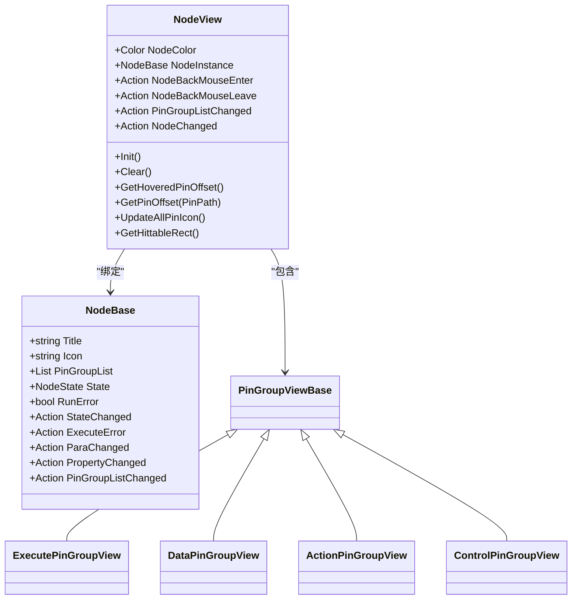
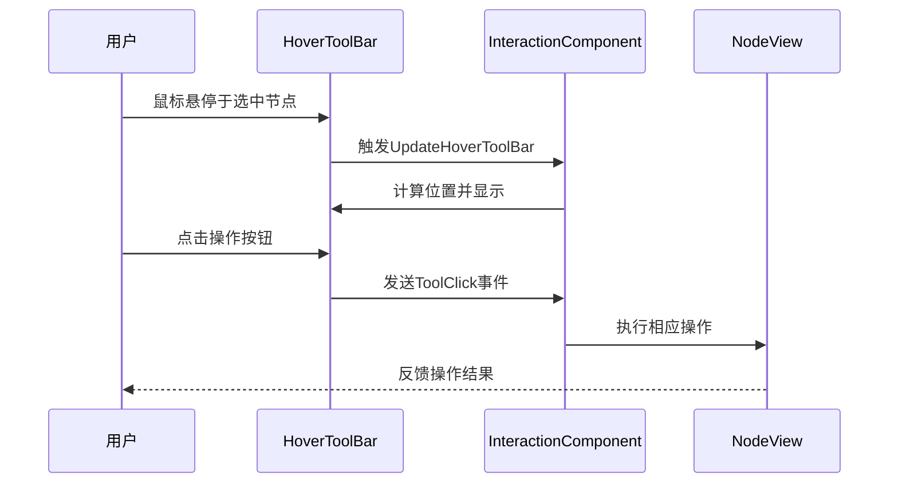
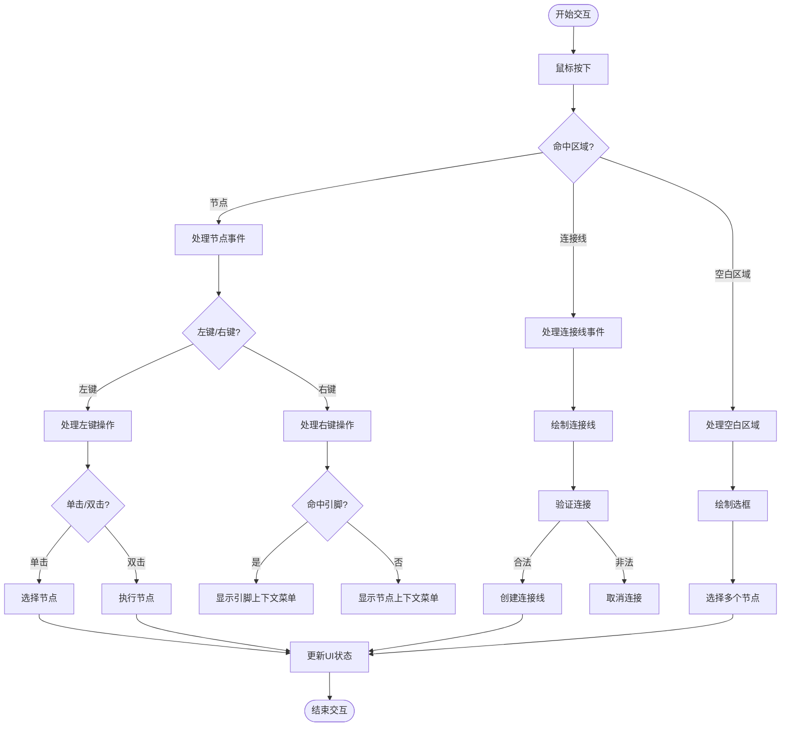
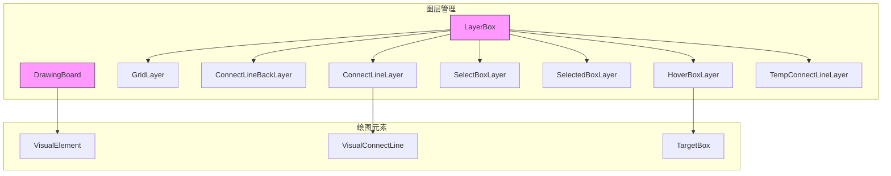
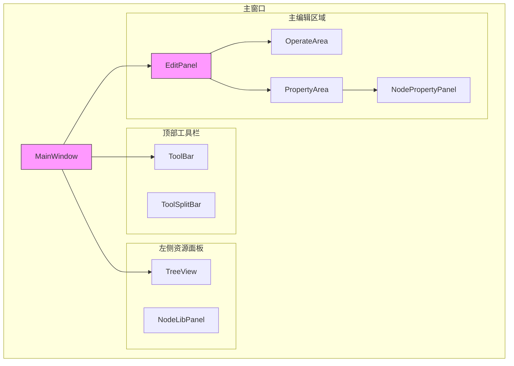
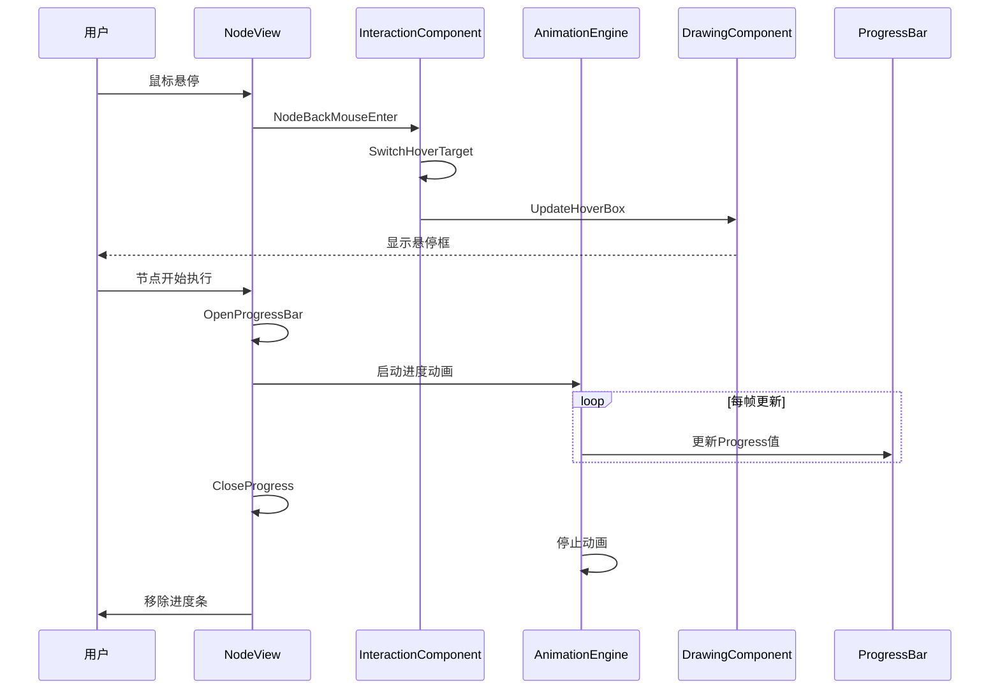
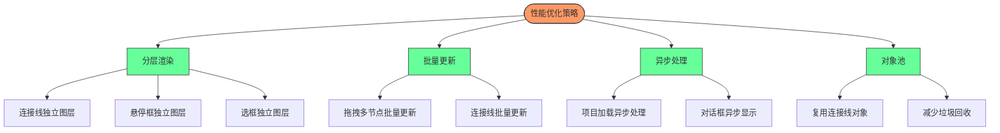

# UI与交互设计

<cite>
**本文档引用的文件**
- [NodeView.xaml.cs](file://XNode/SubSystem/NodeEditSystem/Control/NodeView.xaml.cs)
- [HoverToolBar.xaml.cs](file://XNode/SubSystem/NodeEditSystem/Control/HoverToolBar.xaml.cs)
- [InteractionComponent.cs](file://XNode/SubSystem/NodeEditSystem/Panel/Component/InteractionComponent.cs)
- [DrawingBoard.cs](file://XLib.WPF/Drawing/DrawingBoard.cs)
- [EditPanel.xaml.cs](file://XNode/SubSystem/NodeEditSystem/Panel/EditPanel.xaml.cs)
- [ConnectLineLayer.cs](file://XNode/SubSystem/NodeEditSystem/Panel/Layer/ConnectLineLayer.cs)
- [ToolBar.xaml.cs](file://XLib.WPFControl/ToolBar.xaml.cs)
- [TreeView.xaml.cs](file://XLib.WPFControl/TreeView.xaml.cs)
- [NodePropertyPanel.xaml.cs](file://XNode/SubSystem/NodeEditSystem/Control/NodePropertyPanel.xaml.cs)
</cite>

## 目录
1. [引言](#引言)
2. [NodeView的视觉构成与数据绑定](#nodeview的视觉构成与数据绑定)
3. [HoverToolBar的悬停响应机制](#hovertoolbar的悬停响应机制)
4. [InteractionComponent的交互逻辑处理](#interactioncomponent的交互逻辑处理)
5. [DrawingBoard的图层管理与重绘机制](#drawingboard的图层管理与重绘机制)
6. [主界面控件集成](#主界面控件集成)
7. [动画效果与事件处理](#动画效果与事件处理)
8. [UI线程优化策略](#ui线程优化策略)
9. [可访问性与响应式布局](#可访问性与响应式布局)
10. [结论](#结论)

## 引言
XNode是一个基于WPF的节点式编程编辑器，其UI设计采用了组件化架构，通过MVVM模式实现数据与视图的分离。系统通过EditPanel作为主编辑区域，集成了NodeView、HoverToolBar、ToolBar、TreeView等多个UI组件，实现了丰富的用户交互功能。本文档详细分析XNode的UI组件与用户交互设计，涵盖视觉构成、事件处理、性能优化等方面。

## NodeView的视觉构成与数据绑定

NodeView是XNode中表示节点的UI控件，继承自MoveableControl，实现了节点的可视化展示与交互功能。其视觉构成主要包括标题栏、引脚区和属性区。

NodeView通过NodeBase类实现数据绑定，NodeBase是节点的逻辑模型，包含节点的标题、图标、引脚组等属性。NodeView的Init方法中，通过NodeInstance属性绑定NodeBase实例，加载节点图标与标题，并根据引脚组类型创建相应的PinGroupViewBase子类实例（如ExecutePinGroupView、DataPinGroupView等）并添加到Stack_PinGroupList中。

当NodeBase的属性发生变化时，通过事件监听机制更新UI。NodeView在Init方法中注册了NodeInstance的多个事件，包括StateChanged、ExecuteError、ParaChanged、PropertyChanged和PinGroupListChanged。例如，当节点状态改变时，Node_StateChanged方法会更新节点右上角的状态指示灯图标。

**图示来源**
- [NodeView.xaml.cs](file://XNode/SubSystem/NodeEditSystem/Control/NodeView.xaml.cs#L1-L335)
- [NodeBase.cs](file://XLib.Node/NodeBase.cs)

**本节来源**
- [NodeView.xaml.cs](file://XNode/SubSystem/NodeEditSystem/Control/NodeView.xaml.cs#L1-L335)

## HoverToolBar的悬停响应机制

HoverToolBar是一个用户控件，作为悬浮工具栏显示在选中节点的上方，提供常用操作按钮。它通过监听鼠标悬停事件来显示和定位。

在InteractionComponent的Init方法中，创建HoverToolBar实例并添加到LayerBox_ToolBar容器中，初始状态为Visibility.Collapsed。当节点选择状态改变时，UpdateHoverToolBar方法会根据选中节点的数量和位置计算工具栏的显示位置，并设置Visibility属性。

HoverToolBar的Init方法为工具栏中的每个按钮注册Click事件，通过ToolClick事件向外传递按钮点击信息。在InteractionComponent中，HoverToolBar_ToolClick方法处理工具栏点击事件，根据按钮名称执行相应操作，如"Tool_Start"启动节点、"Tool_Stop"停止节点、"Tool_Delete"删除节点。

**图示来源**
- [HoverToolBar.xaml.cs](file://XNode/SubSystem/NodeEditSystem/Control/HoverToolBar.xaml.cs#L1-L20)
- [InteractionComponent.cs](file://XNode/SubSystem/NodeEditSystem/Panel/Component/InteractionComponent.cs#L1-L756)

**本节来源**
- [HoverToolBar.xaml.cs](file://XNode/SubSystem/NodeEditSystem/Control/HoverToolBar.xaml.cs#L1-L20)

## InteractionComponent的交互逻辑处理

InteractionComponent是XNode的核心交互组件，负责处理所有用户输入事件，包括鼠标点击、拖拽、键盘操作等。它通过事件委托机制与UI元素解耦，实现了复杂的交互逻辑。

该组件在Enable方法中注册OperateArea（操作区域）的MouseMove、MouseDown和MouseUp事件。通过SelectTool工具类处理不同类型的鼠标操作，如选择节点、拖拽节点、绘制连接线等。

对于拖拽操作，InteractionComponent提供了BeginDragNode、DragNode和EndDragNode方法。在拖拽过程中，节点位置会根据鼠标移动实时更新，并自动对齐到10x10的网格。多选功能通过绘制选框实现，BeginDrawSelectBox记录鼠标按下位置，DrawSelectBox实时更新选框，EndDrawSelectBox完成选择操作。

连接线绘制是节点编辑器的核心功能。BeginDrawConnectLine方法记录起始引脚和鼠标位置，开始绘制临时连接线。DrawConnectLine方法根据鼠标位置更新连接线终点。EndDrawConnectLine方法完成连接线创建，通过CanConnect方法验证连接合法性，包括检查引脚类型、流向、所属节点等条件。

**图示来源**
- [InteractionComponent.cs](file://XNode/SubSystem/NodeEditSystem/Panel/Component/InteractionComponent.cs#L1-L756)

**本节来源**
- [InteractionComponent.cs](file://XNode/SubSystem/NodeEditSystem/Panel/Component/InteractionComponent.cs#L1-L756)

## DrawingBoard的图层管理与重绘机制

DrawingBoard是XNode的绘图基础类，继承自FrameworkElement，用于管理多个可视对象。它采用分层渲染架构，通过多个DrawingBoard实例实现不同图层的分离。

在EditPanel中，通过LayerBox容器管理多个图层，包括GridLayer（网格层）、ConnectLineBackLayer（连接线背景层）、ConnectLineLayer（连接线层）、SelectBoxLayer（选框层）、SelectedBoxLayer（已选框层）、HoverBoxLayer（悬停框层）和TempConnectLineLayer（临时连接线层）。这种分层设计使得不同类型的图形元素可以独立渲染，提高了重绘效率。

DrawingBoard通过VisualChildrenCount和GetVisualChild方法实现WPF的可视化树管理。AddVisualElement方法添加可视元素到_elementList列表，并调用AddVisualChild和AddLogicalChild方法将其加入可视化树。RemoveVisualElement和ClearVisualElement方法则负责移除元素。

命中检测通过WPF的VisualTreeHelper.HitTest方法实现。GetHitedVisualElement方法创建一个圆形命中检测区域（半径8像素的椭圆），对所有可视元素进行命中测试。HitTestCallback回调函数在检测到命中元素时停止搜索，确保性能最优。

**图示来源**
- [DrawingBoard.cs](file://XLib.WPF/Drawing/DrawingBoard.cs#L1-L94)
- [ConnectLineLayer.cs](file://XNode/SubSystem/NodeEditSystem/Panel/Layer/ConnectLineLayer.cs#L1-L51)
- [EditPanel.xaml.cs](file://XNode/SubSystem/NodeEditSystem/Panel/EditPanel.xaml.cs#L1-L122)

**本节来源**
- [DrawingBoard.cs](file://XLib.WPF/Drawing/DrawingBoard.cs#L1-L94)
- [ConnectLineLayer.cs](file://XNode/SubSystem/NodeEditSystem/Panel/Layer/ConnectLineLayer.cs#L1-L51)

## 主界面控件集成

XNode的主界面通过MainWindow集成多个核心控件，包括ToolBar、TreeView和EditPanel。这些控件通过布局容器（如Grid、DockPanel）进行组织，形成完整的用户界面。

ToolBar控件位于窗口顶部，提供文件操作、编辑命令等全局功能。它通过XAML定义按钮和分隔符，使用Command或事件处理程序绑定功能。在XNode中，ToolBar.xaml.cs定义了工具栏的UI和基本行为。

TreeView控件用于显示项目资源结构，如节点库、文件系统等。TreeItemView和TreeView控件实现了树形结构的可视化，支持展开/折叠、选择等操作。NodeLibPanel使用TreeView显示可用的节点类型，用户可以通过拖拽将节点添加到编辑区域。

EditPanel作为主编辑区域，占据了窗口的主要空间。它通过IDropable接口支持拖拽操作，OnDrop方法处理从TreeView拖拽节点到编辑区域的逻辑。InteractionComponent的HandleDrop方法负责创建节点实例和NodeView控件。

**图示来源**
- [ToolBar.xaml.cs](file://XLib.WPFControl/ToolBar.xaml.cs)
- [TreeView.xaml.cs](file://XLib.WPFControl/TreeView.xaml.cs)
- [EditPanel.xaml.cs](file://XNode/SubSystem/NodeEditSystem/Panel/EditPanel.xaml.cs#L1-L122)
- [NodePropertyPanel.xaml.cs](file://XNode/SubSystem/NodeEditSystem/Control/NodePropertyPanel.xaml.cs)

**本节来源**
- [ToolBar.xaml.cs](file://XLib.WPFControl/ToolBar.xaml.cs)
- [TreeView.xaml.cs](file://XLib.WPFControl/TreeView.xaml.cs)
- [EditPanel.xaml.cs](file://XNode/SubSystem/NodeEditSystem/Panel/EditPanel.xaml.cs#L1-L122)

## 动画效果与事件处理

XNode通过XLib.Animate库实现动画效果，如节点执行时的进度条动画、悬停高亮等。动画系统基于Animation类和AnimationEngine，支持多种缓动函数（Easing）。

在NodeView中，当节点开始执行并需要显示进度时，OpenProgressBar方法创建ProgressBar控件并添加到节点底部。AnimationEngine驱动进度条的平滑更新，通过定时器每帧更新进度值。CloseProgress方法在执行完成后移除进度条控件。

悬停高亮效果通过InteractionComponent实现。当鼠标进入节点区域时，NodeBack_MouseEnter事件触发SwitchHoverTarget方法，设置HoverBox（悬停框）并调用UpdateHoverBox方法重绘。悬停框使用半透明边框突出显示当前悬停的节点。

事件处理采用委托模式，通过Action委托实现松耦合。例如，NodeView定义了NodeBackMouseEnter、NodeBackMouseLeave等事件委托，InteractionComponent在ListenNodeCard方法中订阅这些事件。这种设计使得UI组件与业务逻辑分离，提高了代码的可维护性。

**图示来源**
- [NodeView.xaml.cs](file://XNode/SubSystem/NodeEditSystem/Control/NodeView.xaml.cs#L1-L335)
- [InteractionComponent.cs](file://XNode/SubSystem/NodeEditSystem/Panel/Component/InteractionComponent.cs#L1-L756)
- [Animation.cs](file://XLib.Animate/Animation.cs)

**本节来源**
- [NodeView.xaml.cs](file://XNode/SubSystem/NodeEditSystem/Control/NodeView.xaml.cs#L1-L335)
- [InteractionComponent.cs](file://XNode/SubSystem/NodeEditSystem/Panel/Component/InteractionComponent.cs#L1-L756)

## UI线程优化策略

XNode采用多种策略优化UI线程性能，避免在复杂节点场景下的卡顿。核心策略包括分层渲染、批量更新、异步处理和对象池。

分层渲染将不同类型的图形元素分离到独立图层，减少重绘范围。例如，连接线变化时只需重绘ConnectLineLayer，而不影响GridLayer或节点层。DrawingComponent的UpdateConnectLine方法仅更新连接线图层，避免全场景重绘。

批量更新通过延迟布局更新实现。在拖拽多个节点时，DragNode方法先计算所有节点的偏移，然后批量应用到Canvas.Left和Canvas.Top附加属性，最后统一调用UpdateSelectedBox和UpdateConnectLine。这种批量操作减少了布局引擎的计算次数。

异步处理用于耗时操作。Project_Loaded事件在项目加载完成后异步更新引脚图标和生成连接线，避免阻塞UI线程。WM.ShowError等对话框使用Dispatcher.BeginInvoke异步显示，确保UI响应性。

对象池复用频繁创建和销毁的对象。VisualConnectLine等图形元素在移除时不会立即销毁，而是放入对象池等待复用。这减少了GC压力，提高了性能。

**图示来源**
- [InteractionComponent.cs](file://XNode/SubSystem/NodeEditSystem/Panel/Component/InteractionComponent.cs#L1-L756)
- [DrawingComponent.cs](file://XNode/SubSystem/NodeEditSystem/Panel/Component/DrawingComponent.cs)
- [NodeView.xaml.cs](file://XNode/SubSystem/NodeEditSystem/Control/NodeView.xaml.cs#L1-L335)

**本节来源**
- [InteractionComponent.cs](file://XNode/SubSystem/NodeEditSystem/Panel/Component/InteractionComponent.cs#L1-L756)

## 可访问性与响应式布局

XNode在设计时考虑了可访问性和响应式布局，确保不同用户和设备上的可用性。

可访问性方面，系统提供了键盘快捷键支持。InteractionComponent的HandleKeyDown方法处理Delete键删除节点、Space键启动/停止节点。所有交互操作都有键盘替代方案，符合无障碍设计原则。高对比度主题和屏幕阅读器支持通过WPF的内置可访问性API实现。

响应式布局通过自适应容器和动态计算实现。EditPanel使用Canvas作为操作区域，支持无限画布和自由缩放。Zoom功能通过DrawingComponent的缩放变换实现，保持UI元素的清晰度。工具栏和属性面板使用DockPanel和Grid布局，自动适应窗口大小变化。

在高DPI显示方面，WPF的矢量渲染特性确保了UI元素的清晰度。图标资源提供多种分辨率，系统根据DPI自动选择合适的资源。字体大小和控件间距也根据DPI进行相应调整，保证用户体验的一致性。

**本节来源**
- [InteractionComponent.cs](file://XNode/SubSystem/NodeEditSystem/Panel/Component/InteractionComponent.cs#L1-L756)
- [EditPanel.xaml.cs](file://XNode/SubSystem/NodeEditSystem/Panel/EditPanel.xaml.cs#L1-L122)
- [DrawingComponent.cs](file://XNode/SubSystem/NodeEditSystem/Panel/Component/DrawingComponent.cs)

## 结论
XNode的UI与交互设计采用了组件化、分层化的架构，通过清晰的职责分离实现了复杂的功能。NodeView作为节点的可视化表示，通过数据绑定与NodeBase模型同步。HoverToolBar提供上下文相关的操作入口，提升用户体验。InteractionComponent集中处理所有用户输入，实现了选择、拖拽、连接等核心交互。DrawingBoard的分层设计和高效重绘机制确保了复杂场景下的性能。主界面通过ToolBar、TreeView等控件的集成，提供了完整的开发环境。系统的动画效果、线程优化、可访问性和响应式布局设计，共同构成了一个高效、易用的节点式编程编辑器。