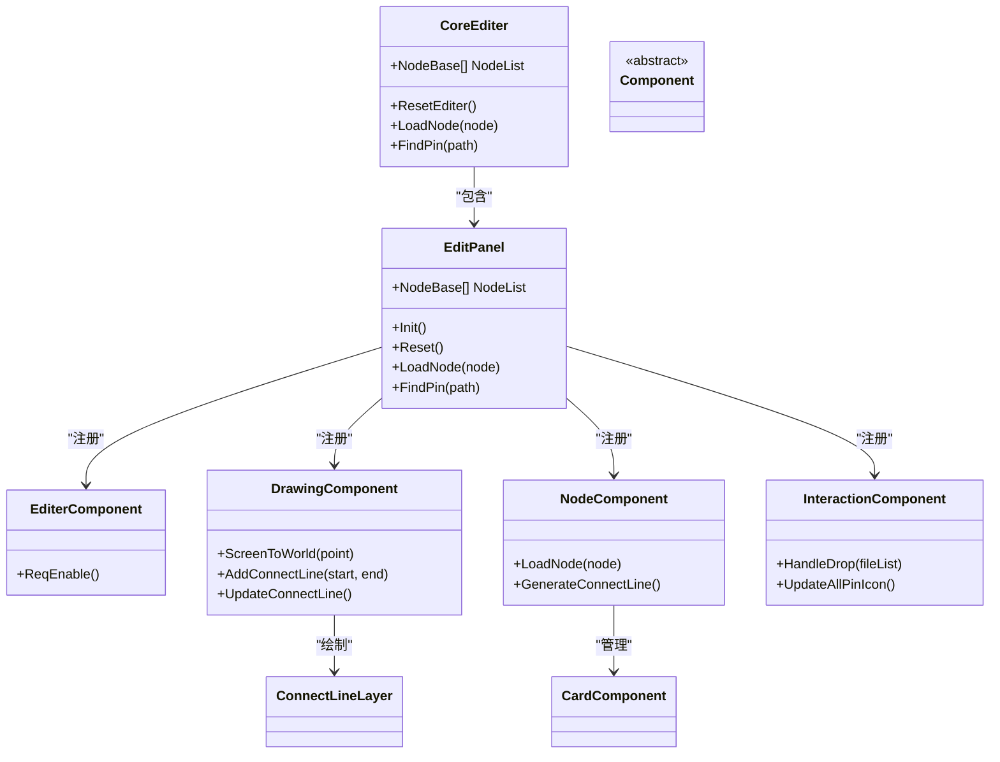
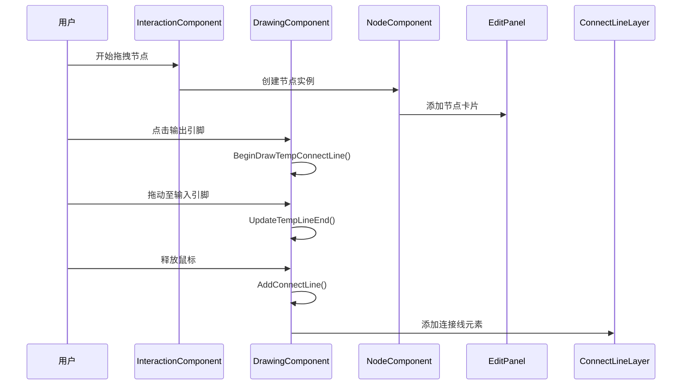

# 快速入门

<cite>
**本文档中引用的文件**  
- [MainWindow.xaml.cs](file://XNode/MainWindow.xaml.cs)
- [CoreEditer.xaml.cs](file://XNode/CoreEditer.xaml.cs)
- [ProjectManager.cs](file://XNode/SubSystem/ProjectSystem/ProjectManager.cs)
- [NodeProject.cs](file://XNode/SubSystem/ProjectSystem/NodeProject.cs)
- [EditPanel.xaml.cs](file://XNode/SubSystem/NodeEditSystem/Panel/EditPanel.xaml.cs)
</cite>

## 目录
1. [简介](#简介)
2. [安装与启动](#安装与启动)
3. [项目管理基础](#项目管理基础)
4. [核心编辑区域](#核心编辑区域)
5. [节点操作流程](#节点操作流程)
6. [工具栏功能详解](#工具栏功能详解)
7. [常见问题与解决方案](#常见问题与解决方案)
8. [总结](#总结)

## 简介

XNode 是一个基于WPF的可视化节点编辑器，允许用户通过拖拽、连接节点的方式构建逻辑流程。本指南旨在帮助新手快速掌握XNode的基本使用方法，从创建项目到完成第一个节点图，涵盖所有关键操作步骤。

## 安装与启动

XNode 是一个 .NET WPF 应用程序，启动前需确保系统已安装 .NET Framework 4.8 或更高版本。启动方法如下：

1. 克隆或下载项目源码
2. 使用 Visual Studio 打开解决方案文件
3. 编译并运行 `XNode` 项目

启动后，主窗口将自动初始化并加载核心编辑器。应用程序入口点位于 `App.xaml.cs`，负责初始化代理、系统服务和工具组件。

**Section sources**
- [App.xaml.cs](file://XNode/App.xaml.cs#L15-L60)

## 项目管理基础

### 新建项目

点击工具栏上的“新建项目”按钮（图标为文档），系统将调用 `ProjectManager.Instance.NewProject()` 方法创建一个新项目。若当前项目未保存，系统会提示是否保存。

新项目默认命名为“新建节点项目_01”，并自动加载到编辑区域。

### 打开已有项目

点击“打开项目”按钮（文件夹图标），系统调用 `ProjectManager.Instance.OpenProject()` 打开文件选择对话框，支持 `.xnode` 格式的项目文件。若项目已打开，会显示提示信息避免重复加载。

### 保存项目

点击“保存项目”按钮（磁盘图标），系统执行 `ProjectManager.Instance.SaveProject()`。若项目尚未指定路径，会弹出“另存为”对话框让用户选择保存位置。项目文件扩展名为 `.xnode`。

**Section sources**
- [ProjectManager.cs](file://XNode/SubSystem/ProjectSystem/ProjectManager.cs#L40-L150)
- [NodeProject.cs](file://XNode/SubSystem/ProjectSystem/NodeProject.cs#L1-L40)

## 核心编辑区域

核心编辑区域由 `CoreEditer` 控件构成，是用户进行节点操作的主要界面。该控件在 `MainWindow` 加载时通过 `LoadCoreEditer()` 方法动态添加到主布局中。

`CoreEditer` 内部包含两个核心面板：
- `Panel_NodeEditer`：负责节点编辑逻辑
- `Panel_NodeLib`：显示可用节点库

编辑器初始化时会自动调用 `Init()` 方法，注册事件监听并准备交互组件。

**Diagram sources**
- [CoreEditer.xaml.cs](file://XNode/CoreEditer.xaml.cs#L1-L72)
- [EditPanel.xaml.cs](file://XNode/SubSystem/NodeEditSystem/Panel/EditPanel.xaml.cs#L1-L122)

**Section sources**
- [CoreEditer.xaml.cs](file://XNode/CoreEditer.xaml.cs#L1-L72)
- [EditPanel.xaml.cs](file://XNode/SubSystem/NodeEditSystem/Panel/EditPanel.xaml.cs#L1-L122)

## 节点操作流程

### 添加节点

1. 在节点库面板中找到所需节点（如“流程-循环”）
2. 拖拽节点到编辑区域
3. 节点将以卡片形式显示，可自由移动

底层通过 `InteractionComponent.HandleDrop()` 方法处理拖拽事件，并调用 `NodeComponent.LoadNode()` 加载节点实例。

### 连接节点

1. 点击一个节点的输出引脚（右侧小圆点）
2. 按住鼠标拖动至另一个节点的输入引脚
3. 释放鼠标完成连接

连接过程由 `DrawingComponent` 管理，通过 `BeginDrawTempConnectLine()` 和 `UpdateTempLineEnd()` 实时绘制临时连接线，最终调用 `AddConnectLine()` 生成永久连接。

**Diagram sources**
- [DrawingComponent.cs](file://XNode/SubSystem/NodeEditSystem/Panel/Component/DrawingComponent.cs#L1-L200)
- [EditPanel.xaml.cs](file://XNode/SubSystem/NodeEditSystem/Panel/EditPanel.xaml.cs#L1-L122)

**Section sources**
- [DrawingComponent.cs](file://XNode/SubSystem/NodeEditSystem/Panel/Component/DrawingComponent.cs#L1-L200)

## 工具栏功能详解

工具栏在 `MainWindow` 的 `XWindowLoaded()` 事件中通过 `InitToolBar()` 方法初始化。每个按钮对应一个命令名称，点击后触发 `ToolBar_ToolClick` 事件。

| 按钮 | 命令名称 | 功能 |
|------|----------|------|
| 新建项目 | NewProject | 调用 `ProjectManager.NewProject()` |
| 打开项目 | OpenProject | 调用 `ProjectManager.OpenProject()` |
| 保存项目 | SaveProject | 调用 `ProjectManager.SaveProject()` |
| 另存为 | SaveAs | 调用 `ProjectManager.SaveAsProject()` |
| 撤销 | Undo | 预留功能（当前未实现） |
| 重做 | Redo | 预留功能（当前未实现） |
| 控制台 | Console | 切换系统控制台显示状态 |
| 清空控制台 | ClearConsole | 调用 `Console.Clear()` |

工具栏图标从 `ImageResManager` 加载，路径为 `Icon16/{name}.png`。

**Section sources**
- [MainWindow.xaml.cs](file://XNode/MainWindow.xaml.cs#L100-L199)

## 常见问题与解决方案

### 未保存项目的提示机制

当用户尝试关闭窗口但项目未保存时，系统会触发 `ReadyClose()` 方法。该方法检查 `ProjectManager.Instance.Saved` 属性，若为 `false`，则弹出询问对话框：

- **保存**：执行 `SaveProject()`，若保存失败则阻止关闭
- **不保存**：直接关闭项目
- **取消**：取消关闭操作

此机制同样应用于“新建项目”和“打开项目”操作前的检查。

### 项目文件重复打开

系统通过比较 `CurrentProject.ProjectFilePath` 与目标路径，防止同一项目被重复打开，并通过 `WM.ShowTip()` 显示友好提示。

### 编辑器初始化问题

首次启动时，`CoreEditer_Loaded` 事件会自动创建一个新项目并标记为已保存，确保编辑器始终处于可用状态。

**Section sources**
- [MainWindow.xaml.cs](file://XNode/MainWindow.xaml.cs#L150-L199)
- [ProjectManager.cs](file://XNode/SubSystem/ProjectSystem/ProjectManager.cs#L40-L80)

## 总结

本指南介绍了XNode的基本使用流程，包括项目管理、节点操作和工具栏功能。通过理解 `ProjectManager` 的项目生命周期管理和 `CoreEditer` 的组件架构，用户可以快速上手并开始创建自己的节点项目。建议新手从简单项目开始，逐步探索更多高级功能。