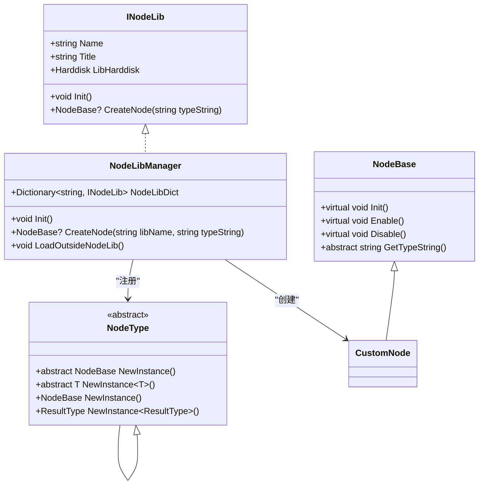
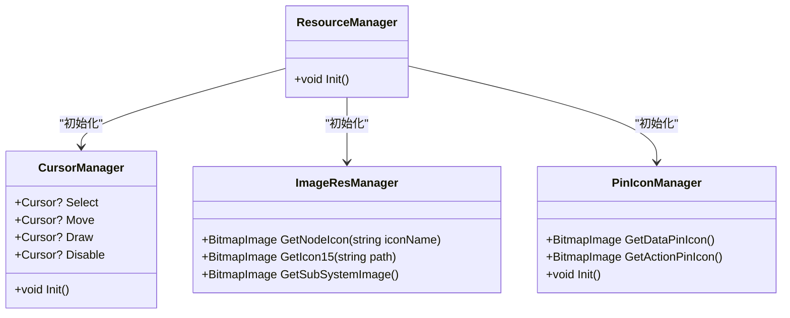
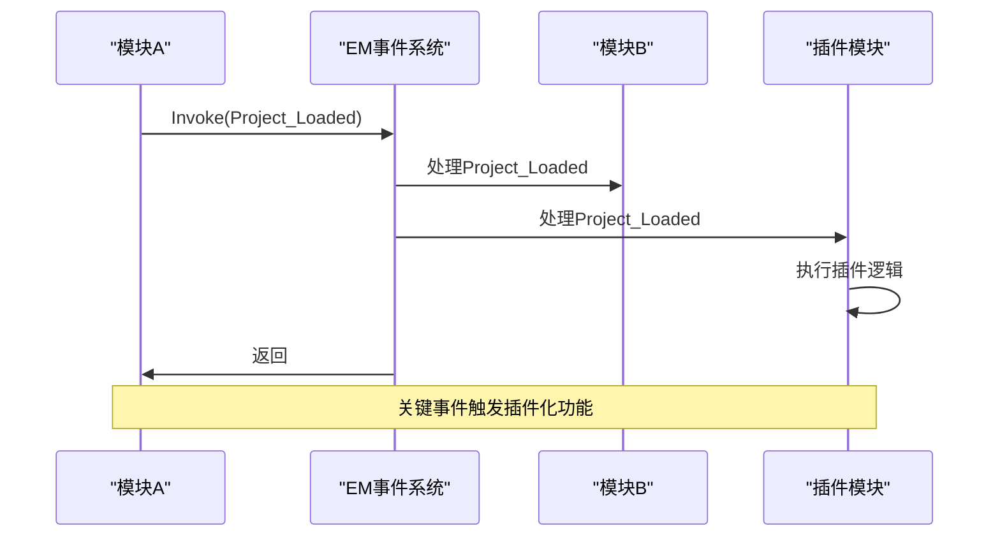
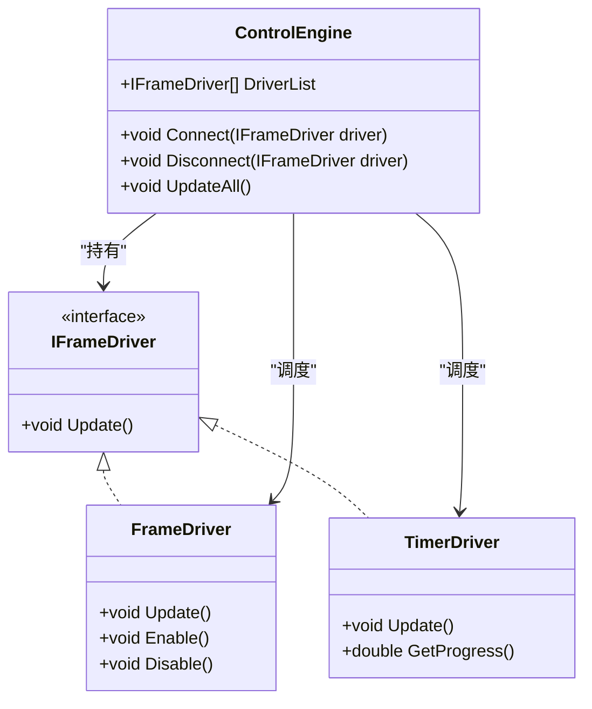

# 扩展与集成

<cite>
**本文档引用的文件**  
- [NodeType.cs](file://XLib.Node/NodeType.cs)
- [NodeLibManager.cs](file://NodeLib.File/NodeLibManager.cs)
- [NodeLibManager.cs](file://XNode/SubSystem/NodeLibSystem/NodeLibManager.cs)
- [EM.cs](file://XNode/SubSystem/EventSystem/EM.cs)
- [EventType.cs](file://XNode/SubSystem/EventSystem/EventType.cs)
- [IFrameDriver.cs](file://XLib.Base/Drive/IFrameDriver.cs)
- [FrameDriver.cs](file://XNode/SubSystem/NodeLibSystem/Define/Drivers/FrameDriver.cs)
- [TimerDriver.cs](file://XNode/SubSystem/NodeLibSystem/Define/Drivers/TimerDriver.cs)
- [ResourceManager.cs](file://XNode/SubSystem/ResourceSystem/ResourceManager.cs)
- [CursorManager.cs](file://XNode/SubSystem/ResourceSystem/CursorManager.cs)
- [ImageResManager.cs](file://XNode/SubSystem/ResourceSystem/ImageResManager.cs)
- [PinIconManager.cs](file://XNode/SubSystem/ResourceSystem/PinIconManager.cs)
</cite>

## 目录
1. [简介](#简介)
2. [自定义节点扩展](#自定义节点扩展)
3. [资源替换机制](#资源替换机制)
4. [事件系统扩展](#事件系统扩展)
5. [外部驱动集成](#外部驱动集成)
6. [插件开发最佳实践](#插件开发最佳实践)
7. [示例：添加函数节点](#示例：添加函数节点)
8. [结论](#结论)

## 简介
本文档为高级用户提供XNode系统的扩展与集成指南。通过继承`NodeType<T>`创建自定义节点、替换图标与光标资源、订阅EM事件系统、集成外部驱动器等机制，开发者可以深度定制和增强XNode功能。文档涵盖核心扩展点的实现原理与使用方法，并提供插件开发的最佳实践建议。

## 自定义节点扩展

XNode通过`NodeType<T>`泛型类和`NodeLibManager`实现节点库的可扩展性。开发者可通过继承`NodeBase`创建自定义节点类型，并通过`NodeType<T>`包装后注册到节点库中。

核心机制如下：
- `NodeType<T>`继承自抽象类`NodeType`，提供`NewInstance()`方法用于实例化节点
- `NodeLibManager`负责管理所有节点库，通过`CreateNode()`方法根据类型字符串创建节点实例
- 外部节点库通过DLL动态加载，实现插件化架构



**图示来源**  
- [NodeType.cs](file://XLib.Node/NodeType.cs#L1-L39)
- [NodeLibManager.cs](file://XNode/SubSystem/NodeLibSystem/NodeLibManager.cs#L15-L220)
- [NodeLibManager.cs](file://NodeLib.File/NodeLibManager.cs#L8-L53)

**本节来源**  
- [NodeType.cs](file://XLib.Node/NodeType.cs#L1-L39)
- [NodeLibManager.cs](file://XNode/SubSystem/NodeLibSystem/NodeLibManager.cs#L15-L220)

## 资源替换机制

XNode提供完整的资源管理系统，允许用户自定义图标、光标和样式主题。资源管理由`ResourceManager`统一协调，各子管理器负责具体资源类型。

### 光标管理
`CursorManager`预定义了14种常用光标，包括选择、移动、绘制、禁止等状态。所有光标从`Assets/Cursor/`目录加载，用户可通过替换对应`.cur`文件来自定义外观。

### 图标管理
`ImageResManager`提供多种图标获取方法：
- `GetNodeIcon(string iconName)`：获取16x16节点图标
- `GetIcon15(string path)`：获取15x15小图标
- `GetSubSystemImage()`：获取子系统专用图标

### 引脚图标管理
`PinIconManager`专门管理引脚图标，支持根据引脚类型显示不同图标。

资源加载采用`pack://application:,,,/`协议，确保资源嵌入程序集，便于部署和替换。



**图示来源**  
- [ResourceManager.cs](file://XNode/SubSystem/ResourceSystem/ResourceManager.cs#L1-L35)
- [CursorManager.cs](file://XNode/SubSystem/ResourceSystem/CursorManager.cs#L1-L96)
- [ImageResManager.cs](file://XNode/SubSystem/ResourceSystem/ImageResManager.cs#L1-L97)

**本节来源**  
- [ResourceManager.cs](file://XNode/SubSystem/ResourceSystem/ResourceManager.cs#L1-L35)
- [CursorManager.cs](file://XNode/SubSystem/ResourceSystem/CursorManager.cs#L1-L96)
- [ImageResManager.cs](file://XNode/SubSystem/ResourceSystem/ImageResManager.cs#L1-L97)
- [PinIconManager.cs](file://XNode/SubSystem/ResourceSystem/PinIconManager.cs)

## 事件系统扩展

XNode采用EM（Event Messenger）事件系统实现模块间通信和插件扩展。EM系统基于泛型事件类型，支持同步和异步事件触发。

### 核心特性
- `EM.Instance.Invoke()`：同步触发事件
- `EM.Instance.BeginInvoke()`：异步触发事件（通过Dispatcher）
- 支持0-3个泛型参数的事件重载
- 事件类型定义在`EventType`枚举中

### 关键事件
- `Project_Loaded`：项目加载完成
- `Project_Saved`：项目保存完成
- `Node_Created`：节点创建
- `Node_Deleted`：节点删除

第三方模块可通过订阅这些关键事件实现插件功能，如自动保存、日志记录、状态同步等。



**图示来源**  
- [EM.cs](file://XNode/SubSystem/EventSystem/EM.cs#L1-L62)
- [EventType.cs](file://XNode/SubSystem/EventSystem/EventType.cs)

**本节来源**  
- [EM.cs](file://XNode/SubSystem/EventSystem/EM.cs#L1-L62)

## 外部驱动集成

XNode通过`IFrameDriver`接口实现外部驱动或定时器系统的集成。任何实现该接口的对象都可以作为驱动源，被`ControlEngine`调度执行。

### IFrameDriver接口
```csharp
public interface IFrameDriver
{
    void Update();
}
```

### 集成机制
1. 自定义驱动类实现`IFrameDriver`接口
2. 在`Enable()`生命周期中通过`ControlEngine.Instance.Connect(this)`注册
3. 在`Disable()`生命周期中通过`ControlEngine.Instance.Disconnect(this)`注销
4. `ControlEngine`在主循环中调用所有连接的驱动的`Update()`方法

### 内置驱动示例
- `FrameDriver`：基于固定帧率的驱动器
- `TimerDriver`：基于时间间隔的驱动器，同时实现`IProgressGetter`接口提供进度信息



**图示来源**  
- [IFrameDriver.cs](file://XLib.Base/Drive/IFrameDriver.cs#L1-L9)
- [FrameDriver.cs](file://XNode/SubSystem/NodeLibSystem/Define/Drivers/FrameDriver.cs#L1-L108)
- [TimerDriver.cs](file://XNode/SubSystem/NodeLibSystem/Define/Drivers/TimerDriver.cs#L1-L115)
- [ControlEngine.cs](file://XNode/SubSystem/ControlSystem/ControlEngine.cs)

**本节来源**  
- [IFrameDriver.cs](file://XLib.Base/Drive/IFrameDriver.cs#L1-L9)
- [FrameDriver.cs](file://XNode/SubSystem/NodeLibSystem/Define/Drivers/FrameDriver.cs#L1-L108)
- [TimerDriver.cs](file://XNode/SubSystem/NodeLibSystem/Define/Drivers/TimerDriver.cs#L1-L115)

## 插件开发最佳实践

### 命名空间管理
- 使用唯一命名空间避免冲突，建议采用`Company.Product.PluginName`格式
- 节点类型名称应具有描述性且不重复

### 资源隔离
- 插件资源应放在独立目录，避免与主程序资源冲突
- 使用`pack://application:,,,/Plugins/PluginName/`路径前缀

### 版本兼容性
- 遵循语义化版本控制（SemVer）
- 在`INodeLib`实现中提供版本信息
- 处理参数字典时使用`try-catch`避免因版本差异导致崩溃

### 错误处理
- 在`LoadParaDict()`等方法中使用异常处理
- 提供合理的默认值
- 记录错误日志以便调试

### 性能考虑
- `Update()`方法中避免频繁的内存分配
- 使用对象池管理临时对象
- 合理设置更新频率，避免过度消耗CPU

## 示例：添加函数节点

以下示例展示如何添加一个"字符串转大写"的函数节点：

1. 创建节点类：
```csharp
public class Func_Upper : NodeBase
{
    public override void Init()
    {
        SetViewProperty(NodeColorSet.Function, "Func_Upper", "字符串转大写");
        PinGroupList.Add(new DataPinGroup(this, "string", "输入", ""));
        PinGroupList.Add(new DataPinGroup(this, "string", "输出", "") { Readable = false });
        PinGroupList.Add(new ActionPinGroup(this, "执行"));
        InitPinGroup();
    }

    public override void Action(int index)
    {
        string input = GetData(0);
        SetData(1, input.ToUpper());
    }

    public override string GetTypeString() => nameof(Func_Upper);
}
```

2. 创建节点库：
```csharp
public class StringLibManager : INodeLib
{
    public static StringLibManager Instance { get; } = new StringLibManager();
    
    public void Init()
    {
        LibHarddisk.CreateFile(LibHarddisk.Root, "转大写", "nt", new NodeType<Func_Upper>());
    }
    
    public NodeBase? CreateNode(string typeString)
    {
        return typeString == nameof(Func_Upper) ? new Func_Upper() : null;
    }
    
    // 其他INodeLib成员...
}
```

3. 编译为DLL并放入插件目录，系统将自动加载。

**本节来源**  
- [Func_Upper.cs](file://NodeLib.File/Define/Rename/Func_Upper.cs)
- [NodeLibManager.cs](file://NodeLib.File/NodeLibManager.cs#L8-L53)

## 结论
XNode提供了完善的扩展与集成机制，包括自定义节点创建、资源替换、事件系统和外部驱动集成。通过遵循插件开发最佳实践，开发者可以安全、高效地增强系统功能。建议在开发插件时充分测试兼容性和性能，确保与主系统的稳定集成。