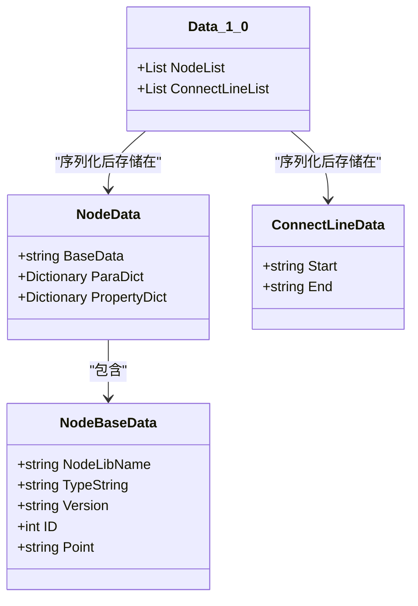
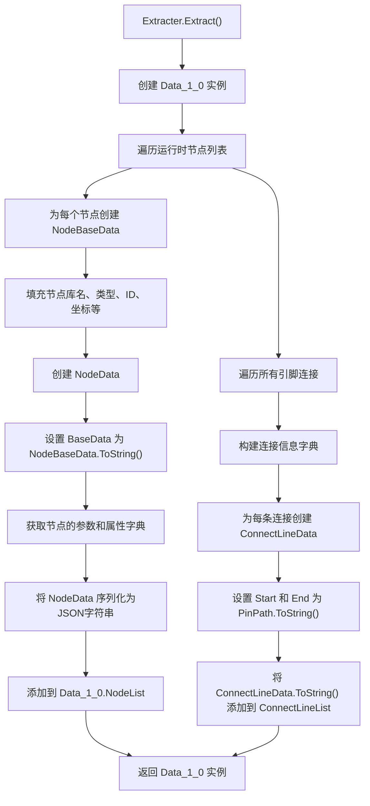
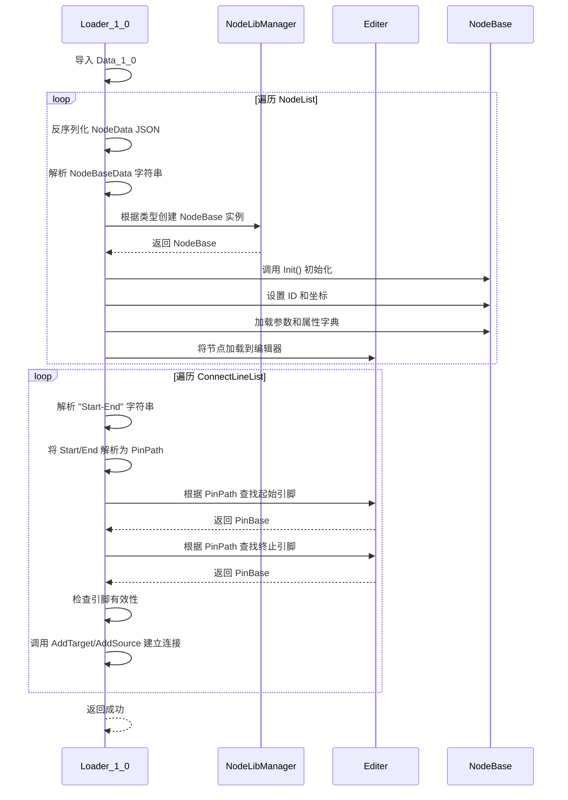

# 数据模型与序列化

<cite>
**本文档引用的文件**  
- [Data_1_0.cs](file://XNode/SubSystem/ArchiveSystem/Define/Data_1_0/Data_1_0.cs)
- [NodeBaseData.cs](file://XNode/SubSystem/ArchiveSystem/Define/Data_1_0/NodeBaseData.cs)
- [NodeData.cs](file://XNode/SubSystem/ArchiveSystem/Define/Data_1_0/NodeData.cs)
- [ConnectLineData.cs](file://XNode/SubSystem/ArchiveSystem/Define/Data_1_0/ConnectLineData.cs)
- [Extracter.cs](file://XNode/SubSystem/ArchiveSystem/Extracter.cs)
- [Loader_1_0.cs](file://XNode/SubSystem/ArchiveSystem/Loader/Loader_1_0.cs)
- [ArchiveManager.cs](file://XNode/SubSystem/ArchiveSystem/ArchiveManager.cs)
- [ConnectLine.cs](file://XNode/SubSystem/NodeEditSystem/Define/ConnectLine.cs)
- [PinPath.cs](file://XNode/SubSystem/NodeEditSystem/Define/PinPath.cs)
- [NodeBase.cs](file://XLib.Node/NodeBase.cs)
</cite>

## 目录
1. [引言](#引言)
2. [核心实体结构](#核心实体结构)
3. [连接线数据结构](#连接线数据结构)
4. [存档数据模型 Data_1_0](#存档数据模型-data_1_0)
5. [序列化机制：Extracter](#序列化机制extracter)
6. [反序列化机制：Loader_1_0](#反序列化机制loader_1_0)
7. [版本兼容策略](#版本兼容策略)
8. [JSON 示例与序列化特性](#json-示例与序列化特性)
9. [结论](#结论)

## 引言
XNode 是一个基于节点的可视化编程系统，其核心功能依赖于稳定、高效的序列化与反序列化机制，以实现节点图的持久化存储与加载。本文档详细描述 XNode 的数据模型设计，重点解析其核心实体结构、连接线表示方式、存档数据模型 `Data_1_0` 的组成，以及 `Extracter` 和 `Loader_1_0` 的工作原理。同时，阐述其版本兼容策略，并提供实际的 JSON 存储示例，以全面展示系统的数据持久化能力。

## 核心实体结构

XNode 的核心运行时实体是 `NodeBase` 类，它定义了节点在内存中的基本结构。该类的关键字段包括：

- **Name**: 节点的名称，用于用户界面显示。
- **Position**: 通过 `NodePoint` 类型表示节点在编辑器画布上的坐标位置。
- **Pins**: 节点的引脚集合，由 `PinBase` 及其派生类构成，是节点间数据或控制流连接的基础。

在内存中，`NodeBase` 实例通过其属性和方法维护自身的状态、位置、引脚连接关系以及自定义参数和属性。当需要持久化时，这些运行时对象的状态必须被提取并转换为可序列化的数据结构。

**Section sources**
- [NodeBase.cs](file://XLib.Node/NodeBase.cs)

## 连接线数据结构

连接线（`ConnectLine`）在运行时表示为画布上的一条视觉路径，其数据结构定义在 `XNode.SubSystem.NodeEditSystem.Define.ConnectLine` 中。它包含两个关键属性：

- **Start**: 起始点的 `System.Windows.Point` 坐标。
- **End**: 终止点的 `System.Windows.Point` 坐标。

然而，这种视觉表示不适合持久化，因为它依赖于渲染状态。因此，系统使用 `PinPath`（引脚路径）来唯一标识连接的逻辑关系。

`PinPath` 类定义了引脚的唯一路径，其结构为：`节点版本,节点ID,引脚组索引,引脚索引`。通过 `ToString()` 方法将其序列化为字符串，例如 `"1.0,5,2,1"`。这种基于ID的引用方式确保了即使节点位置发生变化，连接关系依然可以被准确重建。

**Section sources**
- [ConnectLine.cs](file://XNode/SubSystem/NodeEditSystem/Define/ConnectLine.cs)
- [PinPath.cs](file://XNode/SubSystem/NodeEditSystem/Define/PinPath.cs)

## 存档数据模型 Data_1_0

`Data_1_0` 是 XNode 定义的第一个正式存档数据模型，位于 `XNode.SubSystem.ArchiveSystem.Define.Data_1_0` 命名空间下。它是一个纯粹的数据容器，不包含任何业务逻辑，专为 JSON 序列化设计。

该模型的核心结构如下：



**Diagram sources**
- [Data_1_0.cs](file://XNode/SubSystem/ArchiveSystem/Define/Data_1_0/Data_1_0.cs)
- [NodeData.cs](file://XNode/SubSystem/ArchiveSystem/Define/Data_1_0/NodeData.cs)
- [NodeBaseData.cs](file://XNode/SubSystem/ArchiveSystem/Define/Data_1_0/NodeBaseData.cs)
- [ConnectLineData.cs](file://XNode/SubSystem/ArchiveSystem/Define/Data_1_0/ConnectLineData.cs)

### NodeList
`NodeList` 并非直接存储 `NodeData` 对象，而是存储其 JSON 序列化后的字符串列表。每个字符串代表一个节点的完整数据，包括：
- **BaseData**: `NodeBaseData` 对象的字符串表示，包含节点类型、库名、版本、ID和坐标。
- **ParaDict**: 节点参数字典，键值对均为字符串。
- **PropertyDict**: 节点属性字典，键值对均为字符串。

### ConnectLineList
`ConnectLineList` 同样存储字符串列表。每个字符串代表一条连接线，格式为 `"{Start}-{End}"`，其中 `Start` 和 `End` 都是 `PinPath` 的字符串表示。

## 序列化机制：Extracter

`Extracter` 类是序列化过程的核心，负责将运行时的节点图对象提取为 `Data_1_0` 模型。

其工作流程如下：



**Diagram sources**
- [Extracter.cs](file://XNode/SubSystem/ArchiveSystem/Extracter.cs)

`Extracter` 通过 `JsonConvert.SerializeObject` 将 `NodeData` 对象转换为 JSON 字符串，然后存入 `NodeList`。这种方式避免了在 `Data_1_0` 模型中直接嵌套复杂对象，简化了版本管理和反序列化过程。

## 反序列化机制：Loader_1_0

`Loader_1_0` 类负责将 `Data_1_0` 模型反序列化并重建运行时的节点图。

其工作流程如下：



**Diagram sources**
- [Loader_1_0.cs](file://XNode/SubSystem/ArchiveSystem/Loader/Loader_1_0.cs)

`Loader_1_0` 首先遍历 `NodeList`，将每个 JSON 字符串反序列化为 `NodeData` 对象，再解析 `BaseData` 字符串得到 `NodeBaseData`。然后，它使用 `NodeLibManager` 根据类型信息创建具体的 `NodeBase` 实例，并设置其ID、坐标，最后加载参数和属性。节点创建并初始化后，被添加到编辑器中。随后，它遍历 `ConnectLineList`，解析出起始和终止的 `PinPath`，通过 `Editer` 的 `FindPin` 方法找到对应的引脚实例，并建立连接关系。

## 版本兼容策略

XNode 通过 `ArchiveManager` 实现了稳健的版本兼容策略，确保系统能够处理不同版本的存档文件。

其核心机制如下：

1.  **版本标识**: 每个存档文件 (`ArchiveFile`) 都包含一个 `Version` 字段，明确标识其数据格式版本。
2.  **版本检查**: `ArchiveManager` 在加载文件时，首先调用 `CheckVersion` 确保存档版本字符串格式有效。
3.  **版本比较**: 使用 `CompareVersion` 方法将存档版本与软件当前支持的 `CurrentVersion` 进行比较。
4.  **兼容性处理**:
    *   **过旧版本 (result > 0)**: 系统支持加载旧版本。`ArchiveManager` 会将旧版本的数据通过特定的 `Loader`（如 `Loader_1_0`）导入，因为 `Data_1_0` 模型被设计为向后兼容的基础格式。
    *   **当前版本 (result == 0)**: 直接使用对应的 `Loader` 加载。
    *   **过新版本 (result < 0)**: 系统会提示用户“存档版本过新，请升级软件后重试”，并拒绝加载，防止因数据结构不兼容导致的错误。

这种策略通过在 `ImportArchiveData` 方法中使用 `switch` 语句分派不同的 `Loader`，为未来支持 `Data_2_0` 等新格式提供了清晰的扩展路径。

**Section sources**
- [ArchiveManager.cs](file://XNode/SubSystem/ArchiveSystem/ArchiveManager.cs)

## JSON 示例与序列化特性

以下是一个符合 `Data_1_0` 模型的 JSON 文件示例：

```json
{
  "Version": "1.0",
  "Data": {
    "NodeList": [
      "{\"BaseData\":\"Inner/Flow_Start/1.0/1/100,100\",\"ParaDict\":{},\"PropertyDict\":{}}",
      "{\"BaseData\":\"Inner/Func_Log/1.0/2/200,150\",\"ParaDict\":{\"Text\":\"Hello World\"},\"PropertyDict\":{}}"
    ],
    "ConnectLineList": [
      "1.0,1,0,0-1.0,2,0,0"
    ]
  }
}
```

### Newtonsoft.Json 序列化特性应用

在 `Extracter` 和 `Loader_1_0` 中，`Newtonsoft.Json` 库被巧妙地用于处理复杂的数据转换：

- **嵌套序列化**: `Extracter` 先将 `NodeData` 对象序列化为 JSON 字符串，再将这些字符串作为元素存入 `Data_1_0` 的 `NodeList`。这利用了 JSON 库处理复杂对象的能力，同时保持了 `Data_1_0` 结构的扁平化。
- **类型转换**: `NodeBaseData` 的 `ToString()` 和构造函数实现了与字符串的相互转换，这是一种轻量级的序列化/反序列化，用于在 `NodeData` 和 `NodeBaseData` 之间传递核心元数据。
- **属性忽略**: `Data_1_0` 模型中的集合（`NodeList`, `ConnectLineList`）被直接序列化，而运行时对象中可能存在的、不需要持久化的属性（如事件处理器、UI 组件引用）则被自然忽略，因为它们不在 `NodeData` 或 `ConnectLineData` 的定义中。

## 结论

XNode 的数据模型与序列化机制设计精巧，通过分离运行时对象与存档数据模型，实现了高效、可靠的持久化。`Data_1_0` 模型以字符串列表的形式存储节点和连接线数据，结合 `Extracter` 的提取逻辑和 `Loader_1_0` 的重建逻辑，确保了数据的完整转换。基于 `PinPath` 的连接引用方式保证了连接关系的稳定性。通过 `ArchiveManager` 实现的版本比较策略，系统具备了良好的向前和向后兼容性，为未来的功能迭代和格式升级奠定了坚实的基础。