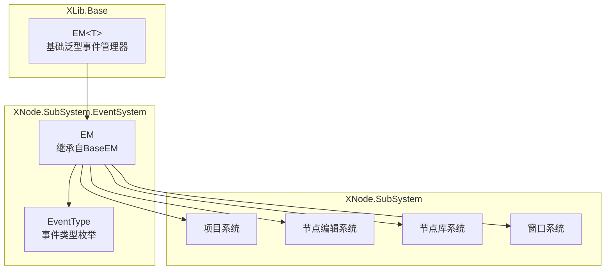
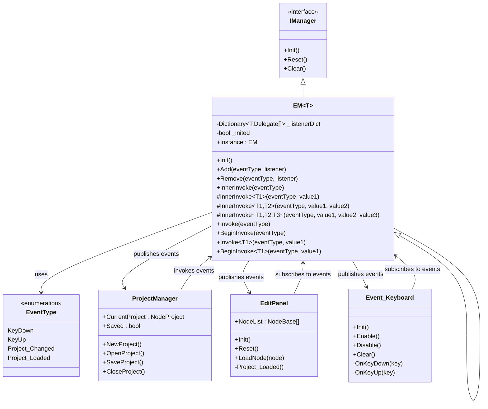
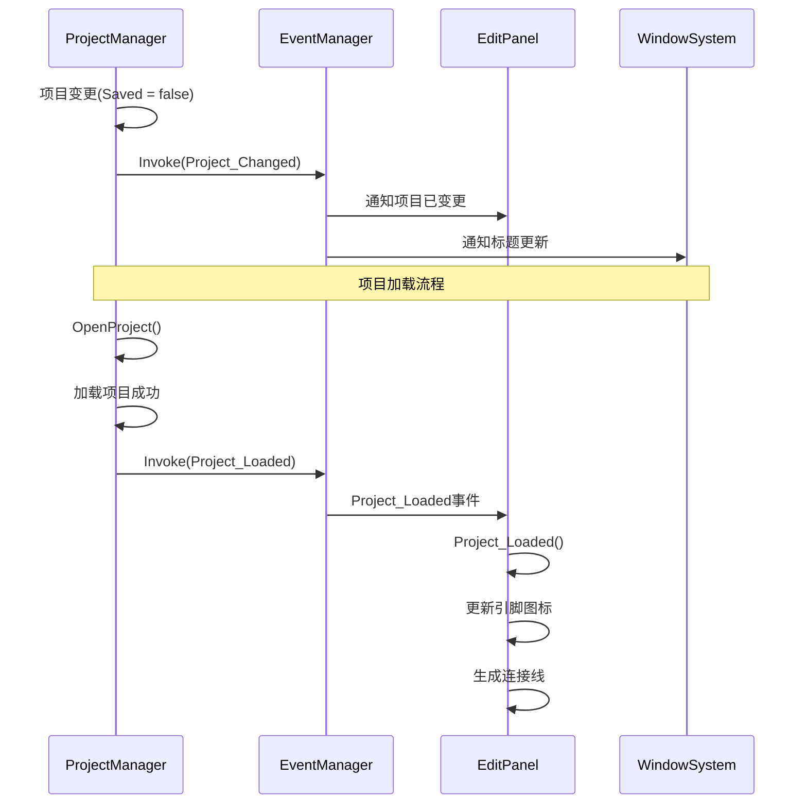
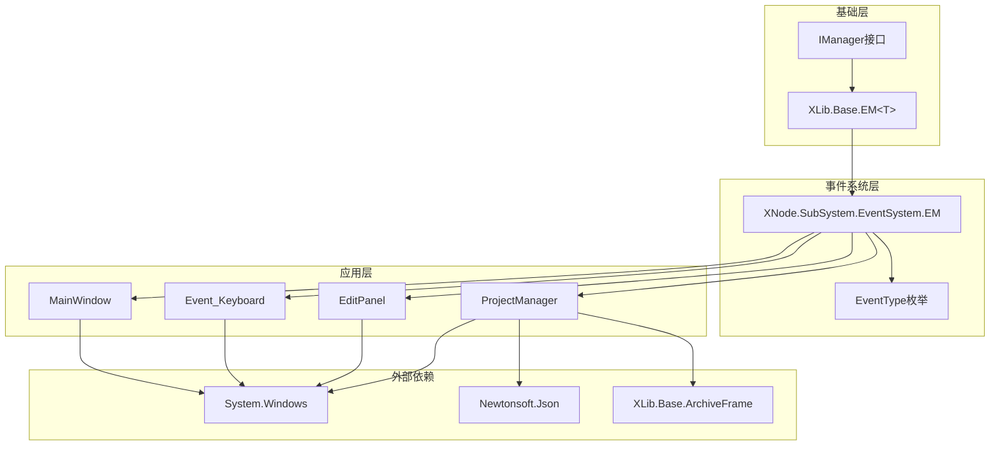

# 事件系统架构文档

<cite>
**本文档引用的文件**
- [EM.cs](file://XLib.Base/EM.cs)
- [EM.cs](file://XNode/SubSystem/EventSystem/EM.cs)
- [EventType.cs](file://XNode/SubSystem/EventSystem/EventType.cs)
- [ProjectManager.cs](file://XNode/SubSystem/ProjectSystem/ProjectManager.cs)
- [EditPanel.xaml.cs](file://XNode/SubSystem/NodeEditSystem/Panel/EditPanel.xaml.cs)
- [Event_Keyboard.cs](file://XNode/SubSystem/NodeLibSystem/Define/Events/Event_Keyboard.cs)
- [TComponent.cs](file://XLib.Base/UIComponent/TComponent.cs)
- [MainWindow.xaml.cs](file://XNode/MainWindow.xaml.cs)
</cite>

## 目录
1. [简介](#简介)
2. [项目结构](#项目结构)
3. [核心组件](#核心组件)
4. [架构概览](#架构概览)
5. [详细组件分析](#详细组件分析)
6. [依赖关系分析](#依赖关系分析)
7. [性能考虑](#性能考虑)
8. [故障排除指南](#故障排除指南)
9. [结论](#结论)

## 简介

事件系统是XNode框架的核心基础设施，采用观察者模式设计，实现了模块间的松耦合通信。该系统基于泛型的订阅（On）与发布（Invoke）机制，通过EM类作为全局事件中枢，为整个应用程序提供了统一的事件管理能力。

事件系统的主要特点包括：
- **泛型支持**：支持多种事件类型和参数传递
- **单例模式**：全局唯一的事件管理器实例
- **异步支持**：支持UI线程安全的事件调用
- **生命周期管理**：完整的事件监听器生命周期控制
- **局部事件**：支持组件级别的局部事件管理

## 项目结构

事件系统在XNode项目中的组织结构如下：



**图表来源**
- [EM.cs](file://XLib.Base/EM.cs#L1-L142)
- [EM.cs](file://XNode/SubSystem/EventSystem/EM.cs#L1-L63)
- [EventType.cs](file://XNode/SubSystem/EventSystem/EventType.cs#L1-L16)

## 核心组件

### XLib.Base.EM<T> - 基础泛型事件管理器

`EM<T>`是事件系统的基础类，实现了泛型化的事件管理功能：

```csharp
public class EM<T> : IManager where T : Enum
{
    // 生命周期管理
    public void Init()
    public void Reset() 
    public void Clear()
    
    // 事件订阅
    public void Add(T eventType, Action listener)
    public void Add<T1>(T eventType, Action<T1> listener)
    public void Add<T1, T2>(T eventType, Action<T1, T2> listener)
    public void Add<T1, T2, T3>(T eventType, Action<T1, T2, T3> listener)
    
    // 事件取消订阅
    public void Remove(T eventType, Action listener)
    public void Remove<T1>(T eventType, Action<T1> listener)
    public void Remove<T1, T2>(T eventType, Action<T1, T2> listener)
    public void Remove<T1, T2, T3>(T eventType, Action<T1, T2, T3> listener)
    
    // 事件发布
    protected void InnerInvoke(T eventType)
    protected void InnerInvoke<T1>(T eventType, T1 value1)
    protected void InnerInvoke<T1, T2>(T eventType, T1 value1, T2 value2)
    protected void InnerInvoke<T1, T2, T3>(T eventType, T1 value1, T2 value2, T3 value3)
}
```

### XNode.SubSystem.EventSystem.EM - 全局事件管理器

`EM`类继承自`EM<EventType>`，提供了全局唯一的事件管理器实例：

```csharp
public class EM : EM<EventType>
{
    // 单例模式
    private EM() { }
    public static EM Instance { get; } = new EM();
    
    // 同步事件发布
    public void Invoke(EventType eventType)
    public void Invoke<T1>(EventType eventType, T1 value1)
    public void Invoke<T1, T2>(EventType eventType, T1 value1, T2 value2)
    public void Invoke<T1, T2, T3>(EventType eventType, T1 value1, T2 value2, T3 value3)
    
    // 异步事件发布（WPF Dispatcher）
    public void BeginInvoke(EventType eventType)
    public void BeginInvoke<T1>(EventType eventType, T1 value1)
    public void BeginInvoke<T1, T2>(EventType eventType, T1 value1, T2 value2)
    public void BeginInvoke<T1, T2, T3>(EventType eventType, T1 value1, T2 value2, T3 value3)
}
```

**章节来源**
- [EM.cs](file://XLib.Base/EM.cs#L1-L142)
- [EM.cs](file://XNode/SubSystem/EventSystem/EM.cs#L1-L63)

## 架构概览

事件系统采用分层架构设计，从底层的基础事件管理器到上层的具体应用事件：



**图表来源**
- [EM.cs](file://XLib.Base/EM.cs#L1-L142)
- [EM.cs](file://XNode/SubSystem/EventSystem/EM.cs#L1-L63)
- [EventType.cs](file://XNode/SubSystem/EventSystem/EventType.cs#L1-L16)
- [ProjectManager.cs](file://XNode/SubSystem/ProjectSystem/ProjectManager.cs#L1-L254)
- [EditPanel.xaml.cs](file://XNode/SubSystem/NodeEditSystem/Panel/EditPanel.xaml.cs#L1-L123)

## 详细组件分析

### 事件类型定义

事件系统通过`EventType`枚举定义了所有可用的事件类型：

```csharp
public enum EventType
{
    /// <summary>按键按下</summary>
    KeyDown,
    /// <summary>按键松开</summary>
    KeyUp,
    /// <summary>项目已变更</summary>
    Project_Changed,
    /// <summary>项目已加载</summary>
    Project_Loaded,
}
```

这些事件类型涵盖了应用程序的主要交互场景：
- **键盘事件**：处理用户输入的按键响应
- **项目状态事件**：跟踪项目的加载、保存和变更状态

### 项目系统事件处理

项目管理系统通过事件通知其他子系统项目状态的变化：



**图表来源**
- [ProjectManager.cs](file://XNode/SubSystem/ProjectSystem/ProjectManager.cs#L35-L103)
- [EditPanel.xaml.cs](file://XNode/SubSystem/NodeEditSystem/Panel/EditPanel.xaml.cs#L49-L56)

### 编辑面板事件响应

编辑面板作为事件系统的消费者，负责响应项目状态变化：

```csharp
private void Project_Loaded()
{
    // 更新引脚图标
    _interactionComponent.UpdateAllPinIcon();
    // 生成连接线
    _nodeComponent.GenerateConnectLine();
}
```

这个方法展示了事件驱动架构的优势：
- **解耦**：编辑面板不需要知道项目是如何被加载的
- **可扩展**：可以轻松添加新的响应逻辑
- **异步**：事件处理不会阻塞主线程

### 局部事件管理

`TComponent`类展示了如何在组件级别实现局部事件管理：

```csharp
public class Component<THost, TEvent> : Component<THost>
    where THost : class
    where TEvent : Enum
{
    private readonly LocalEM _lem = new LocalEM();
    
    public void AddEvent(TEvent eventType, Action action) => _lem.Add(eventType, action);
    public void AddEvent<T>(TEvent eventType, Action<T> action) => _lem.Add(eventType, action);
    public void RemoveEvent(TEvent eventType, Action action) => _lem.Remove(eventType, action);
    public void RemoveEvent<T>(TEvent eventType, Action<T> action) => _lem.Remove(eventType, action);
    
    protected void Invoke(TEvent eventType) => _lem.Invoke(eventType);
    protected void Invoke<T>(TEvent eventType, T value) => _lem.Invoke(eventType, value);
}
```

这种设计允许：
- **组件隔离**：每个组件都有自己的事件空间
- **生命周期绑定**：事件随组件创建和销毁
- **类型安全**：编译时检查事件类型

**章节来源**
- [EventType.cs](file://XNode/SubSystem/EventSystem/EventType.cs#L1-L16)
- [ProjectManager.cs](file://XNode/SubSystem/ProjectSystem/ProjectManager.cs#L35-L103)
- [EditPanel.xaml.cs](file://XNode/SubSystem/NodeEditSystem/Panel/EditPanel.xaml.cs#L49-L56)
- [TComponent.cs](file://XLib.Base/UIComponent/TComponent.cs#L132-L167)

## 依赖关系分析

事件系统的依赖关系展现了清晰的分层架构：



**图表来源**
- [EM.cs](file://XLib.Base/EM.cs#L1-L142)
- [EM.cs](file://XNode/SubSystem/EventSystem/EM.cs#L1-L63)
- [ProjectManager.cs](file://XNode/SubSystem/ProjectSystem/ProjectManager.cs#L1-L254)

### 核心依赖关系

1. **基础依赖**：事件系统依赖于.NET Framework的System.Windows命名空间
2. **接口约束**：所有事件管理器都实现IManager接口
3. **类型约束**：泛型事件管理器要求事件类型必须是枚举
4. **单例模式**：全局事件管理器采用单例模式确保唯一性

**章节来源**
- [EM.cs](file://XLib.Base/EM.cs#L1-L142)
- [EM.cs](file://XNode/SubSystem/EventSystem/EM.cs#L1-L63)

## 性能考虑

### 内存管理

事件系统采用了多种策略来优化内存使用：

1. **延迟初始化**：监听器字典在首次使用时才创建
2. **弱引用**：避免循环引用导致的内存泄漏
3. **及时清理**：提供Clear和ClearAll方法清理监听器

### 性能优化

1. **批量处理**：支持多参数事件调用减少方法调用开销
2. **类型检查**：使用is运算符进行高效的类型检查
3. **异步支持**：BeginInvoke方法支持UI线程安全的异步调用

### 最佳实践

1. **及时注销**：在组件销毁时及时移除事件监听器
2. **避免过度订阅**：不要在一个事件上注册过多的监听器
3. **合理使用局部事件**：对于组件特定的事件使用局部事件管理器

## 故障排除指南

### 常见问题

1. **事件未触发**
   - 检查事件管理器是否已初始化
   - 确认事件类型是否正确
   - 验证监听器是否已正确注册

2. **内存泄漏**
   - 确保在组件销毁时调用Remove方法
   - 使用弱引用避免循环依赖
   - 定期调用Clear方法清理无用监听器

3. **线程安全问题**
   - 对于UI相关事件使用BeginInvoke
   - 避免在非UI线程直接修改UI元素

### 调试技巧

1. **事件追踪**：在Invoke方法中添加日志记录
2. **监听器验证**：定期检查监听器数量是否异常
3. **类型检查**：使用调试器验证事件类型匹配

**章节来源**
- [EM.cs](file://XLib.Base/EM.cs#L94-L141)

## 结论

XNode的事件系统是一个设计精良的观察者模式实现，具有以下优势：

### 技术优势

1. **类型安全**：通过泛型和枚举确保编译时类型检查
2. **解耦设计**：模块间通过事件进行松耦合通信
3. **可扩展性**：易于添加新的事件类型和监听器
4. **线程安全**：支持UI线程安全的异步事件调用

### 实际效益

1. **降低复杂度**：减少了模块间的直接依赖关系
2. **提高可维护性**：事件驱动的架构使代码更易于理解和维护
3. **增强灵活性**：可以轻松添加新的功能而无需修改现有代码
4. **改善性能**：按需触发事件，避免不必要的计算

### 发展方向

1. **异步事件流**：考虑引入基于Reactive Extensions的事件流
2. **事件过滤**：添加事件过滤机制以减少不必要的事件传播
3. **性能监控**：集成性能监控工具跟踪事件处理性能
4. **分布式事件**：支持跨进程或跨网络的事件通信

事件系统作为XNode框架的核心基础设施，为整个应用程序提供了稳定、高效、可扩展的事件通信机制，是实现模块化架构的重要基石。