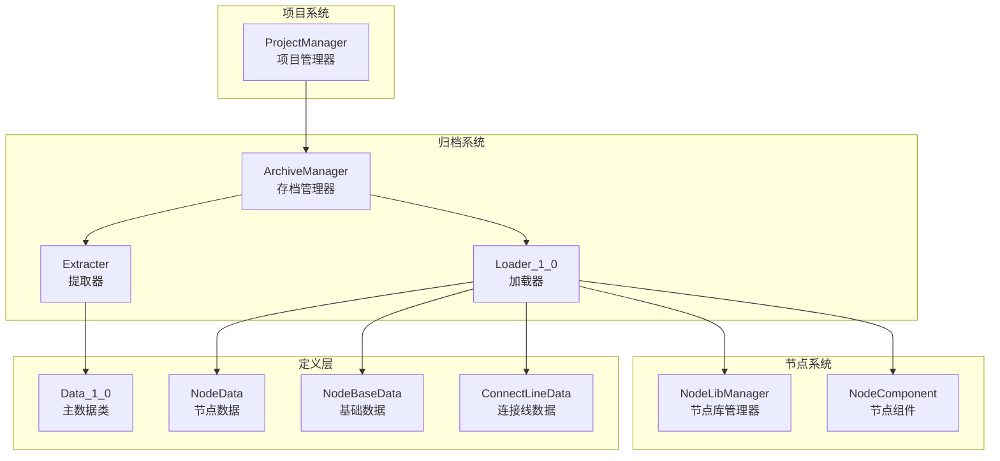
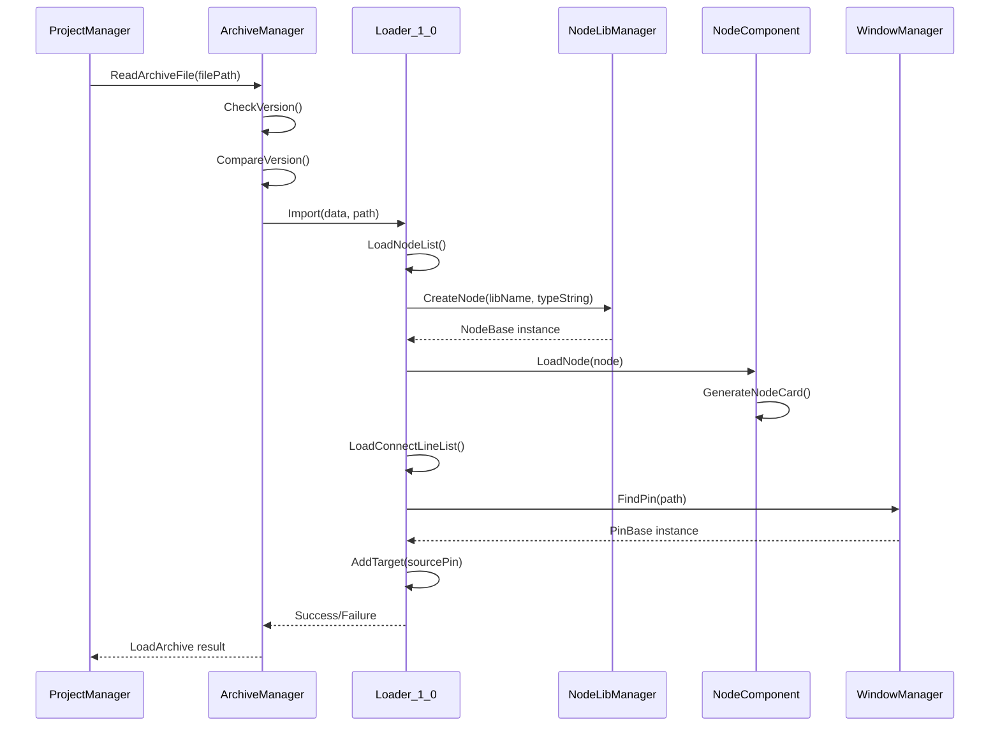
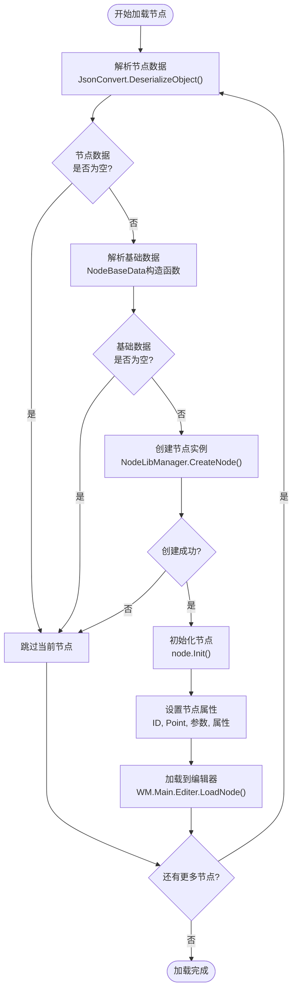
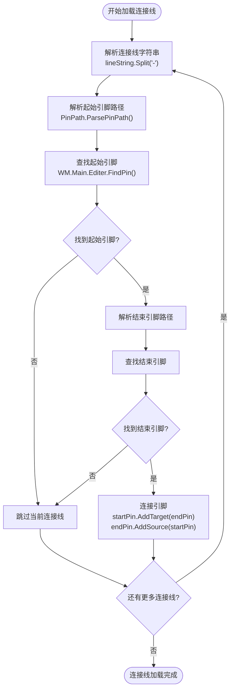
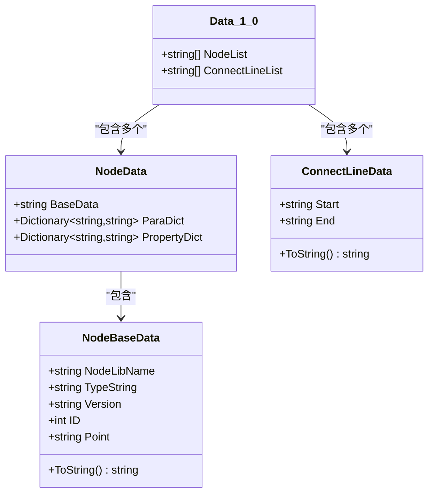
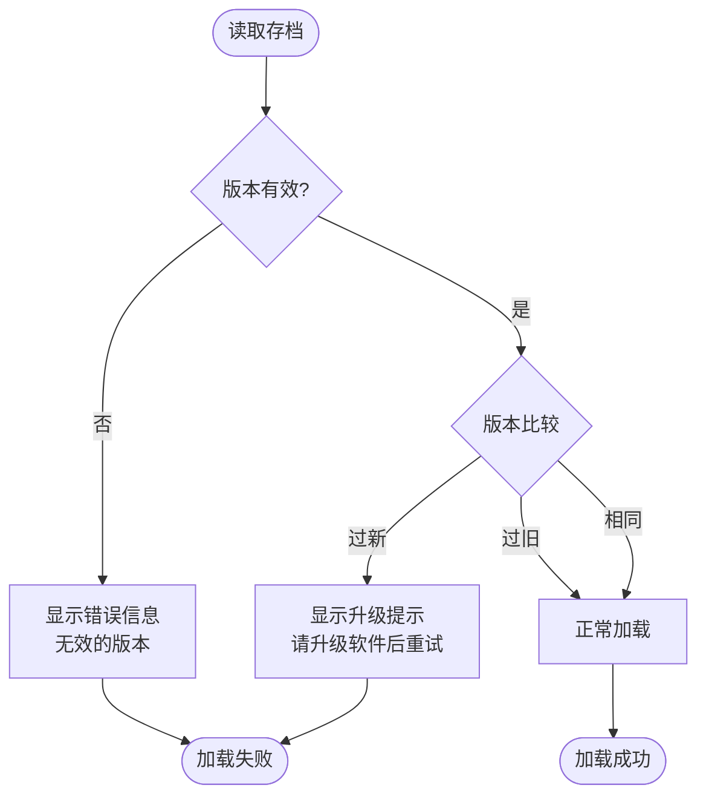

# 归档加载机制

<cite>
**本文档中引用的文件**
- [Loader_1_0.cs](file://XNode/SubSystem/ArchiveSystem/Loader/Loader_1_0.cs)
- [Data_1_0.cs](file://XNode/SubSystem/ArchiveSystem/Define/Data_1_0/Data_1_0.cs)
- [NodeData.cs](file://XNode/SubSystem/ArchiveSystem/Define/Data_1_0/NodeData.cs)
- [NodeBaseData.cs](file://XNode/SubSystem/ArchiveSystem/Define/Data_1_0/NodeBaseData.cs)
- [ConnectLineData.cs](file://XNode/SubSystem/ArchiveSystem/Define/Data_1_0/ConnectLineData.cs)
- [ProjectManager.cs](file://XNode/SubSystem/ProjectSystem/ProjectManager.cs)
- [ArchiveManager.cs](file://XNode/SubSystem/ArchiveSystem/ArchiveManager.cs)
- [Extracter.cs](file://XNode/SubSystem/ArchiveSystem/Extracter.cs)
- [NodeComponent.cs](file://XNode/SubSystem/NodeEditSystem/Panel/Component/NodeComponent.cs)
- [NodeLibManager.cs](file://XNode/SubSystem/NodeLibSystem/NodeLibManager.cs)
</cite>

## 目录
1. [简介](#简介)
2. [项目结构概览](#项目结构概览)
3. [核心组件分析](#核心组件分析)
4. [架构概览](#架构概览)
5. [详细组件分析](#详细组件分析)
6. [版本兼容性设计](#版本兼容性设计)
7. [错误恢复机制](#错误恢复机制)
8. [性能考虑](#性能考虑)
9. [故障排除指南](#故障排除指南)
10. [结论](#结论)

## 简介

XNode项目采用了一套完整的归档加载机制，用于将JSON格式的Data_1_0数据反序列化并重建为运行时对象（NodeBase、ConnectLine等）。该系统通过Loader_1_0类实现，支持版本兼容性设计、工厂模式创建节点实例，并与NodeComponent协同完成UI重建。整个过程从文件读取到项目状态恢复形成完整的数据流。

## 项目结构概览

归档加载机制的核心文件组织如下：



**图表来源**
- [ArchiveManager.cs](file://XNode/SubSystem/ArchiveSystem/ArchiveManager.cs#L1-L137)
- [Loader_1_0.cs](file://XNode/SubSystem/ArchiveSystem/Loader/Loader_1_0.cs#L1-L82)
- [ProjectManager.cs](file://XNode/SubSystem/ProjectSystem/ProjectManager.cs#L1-L254)

## 核心组件分析

### Loader_1_0类

Loader_1_0是归档加载的核心类，负责将JSON数据转换为运行时对象：

```csharp
public class Loader_1_0
{
    public static bool Import(Data_1_0 data, string archiveFilePath)
    {
        try
        {
            LoadNodeList(data);
            LoadConnectLineList(data);
        }
        catch (Exception ex)
        {
            WM.ShowError("加载存档失败：" + ex.Message);
            return false;
        }
        return true;
    }
}
```

该类实现了两个主要功能：
- **LoadNodeList**: 处理节点数据的反序列化和重建
- **LoadConnectLineList**: 处理连接线数据的解析和连接

**章节来源**
- [Loader_1_0.cs](file://XNode/SubSystem/ArchiveSystem/Loader/Loader_1_0.cs#L10-L25)

### 版本兼容性设计

系统通过版本检查确保兼容性：

```csharp
private bool CheckVersion(ArchiveFile file)
{
    if (string.IsNullOrEmpty(file.Version) || file.Version == "???") return false;
    try
    {
        ArchiveVersion version = new ArchiveVersion(file.Version);
    }
    catch (Exception) { return false; }
    return true;
}

private int CompareVersion(string version)
{
    ArchiveVersion file = new ArchiveVersion(version);
    ArchiveVersion current = new ArchiveVersion(CurrentVersion);
    return file.CompareTo(current);
}
```

**章节来源**
- [ArchiveManager.cs](file://XNode/SubSystem/ArchiveSystem/ArchiveManager.cs#L75-L95)

## 架构概览

归档加载机制采用分层架构设计：



**图表来源**
- [ProjectManager.cs](file://XNode/SubSystem/ProjectSystem/ProjectManager.cs#L75-L95)
- [ArchiveManager.cs](file://XNode/SubSystem/ArchiveSystem/ArchiveManager.cs#L95-L130)
- [Loader_1_0.cs](file://XNode/SubSystem/ArchiveSystem/Loader/Loader_1_0.cs#L10-L25)

## 详细组件分析

### 节点数据反序列化流程

节点数据的反序列化过程包含以下步骤：



**图表来源**
- [Loader_1_0.cs](file://XNode/SubSystem/ArchiveSystem/Loader/Loader_1_0.cs#L27-L60)

### 连接线数据处理

连接线数据的处理流程：



**图表来源**
- [Loader_1_0.cs](file://XNode/SubSystem/ArchiveSystem/Loader/Loader_1_0.cs#L62-L78)

### 工厂模式实现

NodeLibManager使用工厂模式创建节点实例：

```csharp
public NodeBase? CreateNode(string libName, string typeString) =>
    NodeLibDict.ContainsKey(libName) ? NodeLibDict[libName].CreateNode(typeString) : null;

// 内置节点库的创建逻辑
public NodeBase? CreateNode(string typeString)
{
    return typeString switch
    {
        nameof(Data_Int) => new Data_Int(),
        nameof(Data_Double) => new Data_Double(),
        nameof(Data_String) => new Data_String(),
        
        nameof(FrameDriver) => new FrameDriver(),
        nameof(TimerDriver) => new TimerDriver(),
        
        nameof(Event_Keyboard) => new Event_Keyboard(),
        
        nameof(Flow_If) => new Flow_If(),
        nameof(Flow_LoopByCount) => new Flow_LoopByCount(),
        nameof(Flow_While) => new Flow_While(),
        nameof(Flow_Switch) => new Flow_Switch(),
        
        nameof(Func_Compare) => new Func_Compare(),
        // ... 更多节点类型
        
        _ => null,
    };
}
```

**章节来源**
- [NodeLibManager.cs](file://XNode/SubSystem/NodeLibSystem/NodeLibManager.cs#L50-L70)
- [NodeLibManager.cs](file://XNode/SubSystem/NodeLibSystem/NodeLibManager.cs#L72-L95)

### 数据模型结构

归档系统使用以下数据模型：



**图表来源**
- [Data_1_0.cs](file://XNode/SubSystem/ArchiveSystem/Define/Data_1_0/Data_1_0.cs#L7-L13)
- [NodeData.cs](file://XNode/SubSystem/ArchiveSystem/Define/Data_1_0/NodeData.cs#L7-L16)
- [NodeBaseData.cs](file://XNode/SubSystem/ArchiveSystem/Define/Data_1_0/NodeBaseData.cs#L4-L33)
- [ConnectLineData.cs](file://XNode/SubSystem/ArchiveSystem/Define/Data_1_0/ConnectLineData.cs#L7-L13)

**章节来源**
- [Data_1_0.cs](file://XNode/SubSystem/ArchiveSystem/Define/Data_1_0/Data_1_0.cs#L1-L14)
- [NodeData.cs](file://XNode/SubSystem/ArchiveSystem/Define/Data_1_0/NodeData.cs#L1-L17)
- [NodeBaseData.cs](file://XNode/SubSystem/ArchiveSystem/Define/Data_1_0/NodeBaseData.cs#L1-L34)
- [ConnectLineData.cs](file://XNode/SubSystem/ArchiveSystem/Define/Data_1_0/ConnectLineData.cs#L1-L14)

## 版本兼容性设计

### 版本检查机制

系统通过ArchiveVersion类进行版本比较：

```csharp
public class ArchiveVersion
{
    public string Version { get; private set; }
    
    public ArchiveVersion(string version)
    {
        Version = version;
        // 版本解析逻辑
    }
    
    public int CompareTo(ArchiveVersion other)
    {
        // 版本比较算法
        // 返回值：-1（小于）、0（等于）、1（大于）
    }
}
```

### 版本处理策略



**图表来源**
- [ArchiveManager.cs](file://XNode/SubSystem/ArchiveSystem/ArchiveManager.cs#L75-L95)
- [ArchiveManager.cs](file://XNode/SubSystem/ArchiveSystem/ArchiveManager.cs#L95-L130)

**章节来源**
- [ArchiveManager.cs](file://XNode/SubSystem/ArchiveSystem/ArchiveManager.cs#L75-L130)

## 错误恢复机制

### 错误处理策略

系统采用多层次的错误处理机制：

1. **节点级错误处理**：
```csharp
try
{
    LoadNodeList(data);
    LoadConnectLineList(data);
}
catch (Exception ex)
{
    WM.ShowError("加载存档失败：" + ex.Message);
    return false;
}
```

2. **节点跳过机制**：
```csharp
if (nodeData == null) continue;
if (nodeBaseData == null) continue;
if (node == null) continue;
```

3. **连接线容错处理**：
```csharp
if (startPin == null) continue;
if (endPin == null) continue;
```

### 用户提示系统

系统通过WindowManager提供用户友好的错误提示：

```csharp
WM.ShowError("加载存档失败：" + ex.Message);
WM.ShowTip("存档版本过新，请升级软件后重试");
```

**章节来源**
- [Loader_1_0.cs](file://XNode/SubSystem/ArchiveSystem/Loader/Loader_1_0.cs#L12-L25)
- [Loader_1_0.cs](file://XNode/SubSystem/ArchiveSystem/Loader/Loader_1_0.cs#L30-L40)
- [ArchiveManager.cs](file://XNode/SubSystem/ArchiveSystem/ArchiveManager.cs#L80-L85)

## 性能考虑

### 内存优化策略

1. **延迟加载**：节点和连接线按需创建
2. **对象池**：复用NodeBase实例减少GC压力
3. **批量处理**：一次加载所有节点和连接线

### 序列化优化

1. **JSON压缩**：使用紧凑格式存储数据
2. **字符串缓存**：避免重复创建相同的字符串
3. **增量更新**：仅更新变化的部分

## 故障排除指南

### 常见问题及解决方案

1. **版本不兼容**
   - 症状：显示"存档版本过新"提示
   - 解决方案：升级软件到最新版本

2. **节点加载失败**
   - 症状：某些节点无法显示
   - 解决方案：检查节点库是否完整，重新安装相关插件

3. **连接线丢失**
   - 症状：节点间连线消失
   - 解决方案：检查引脚路径是否正确，重新建立连接

### 调试技巧

1. **启用详细日志**：在开发模式下查看详细的加载过程
2. **验证JSON格式**：使用JSON验证工具检查存档文件
3. **检查依赖项**：确保所有必要的节点库都已加载

**章节来源**
- [ArchiveManager.cs](file://XNode/SubSystem/ArchiveSystem/ArchiveManager.cs#L80-L90)
- [Loader_1_0.cs](file://XNode/SubSystem/ArchiveSystem/Loader/Loader_1_0.cs#L30-L78)

## 结论

XNode项目的归档加载机制是一个设计精良的数据持久化系统，具有以下特点：

1. **模块化设计**：清晰的职责分离，便于维护和扩展
2. **版本兼容性**：完善的版本检查和处理机制
3. **错误恢复**：多层次的错误处理和用户提示
4. **性能优化**：合理的内存管理和序列化策略
5. **可扩展性**：支持自定义节点库和插件系统

该系统通过Loader_1_0类实现了从JSON数据到运行时对象的完整转换，支持工厂模式创建节点实例，并与NodeComponent协同完成UI重建。整个过程从文件读取到项目状态恢复形成了完整的数据流，为用户提供了可靠的项目加载体验。