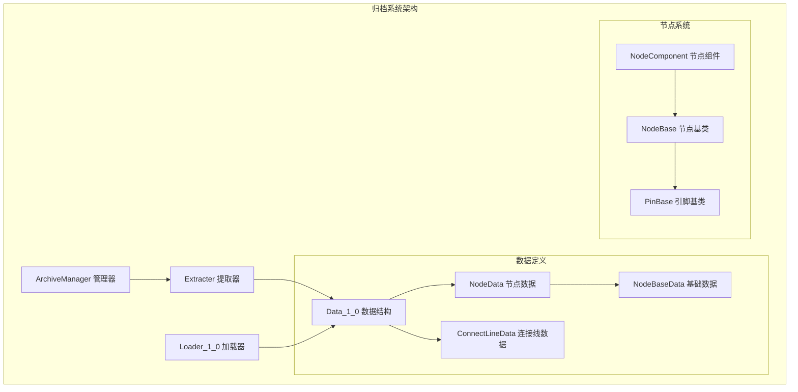
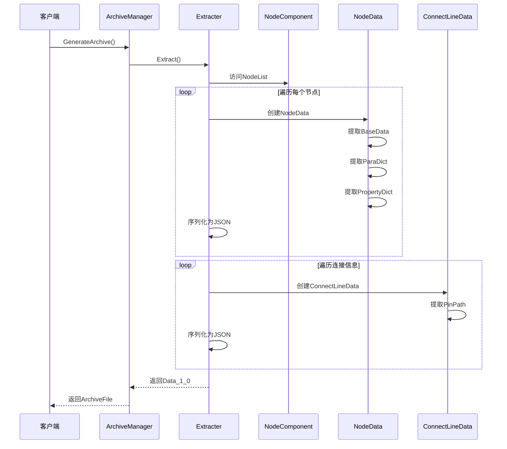
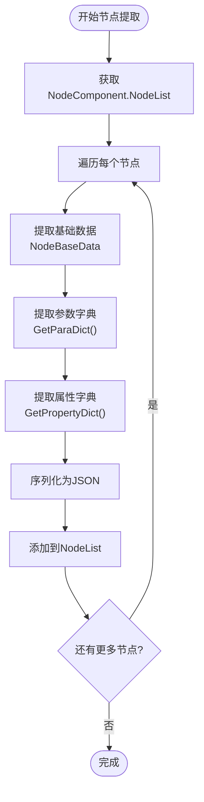
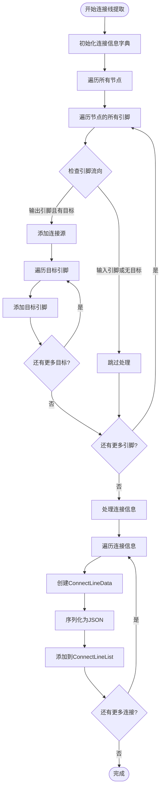
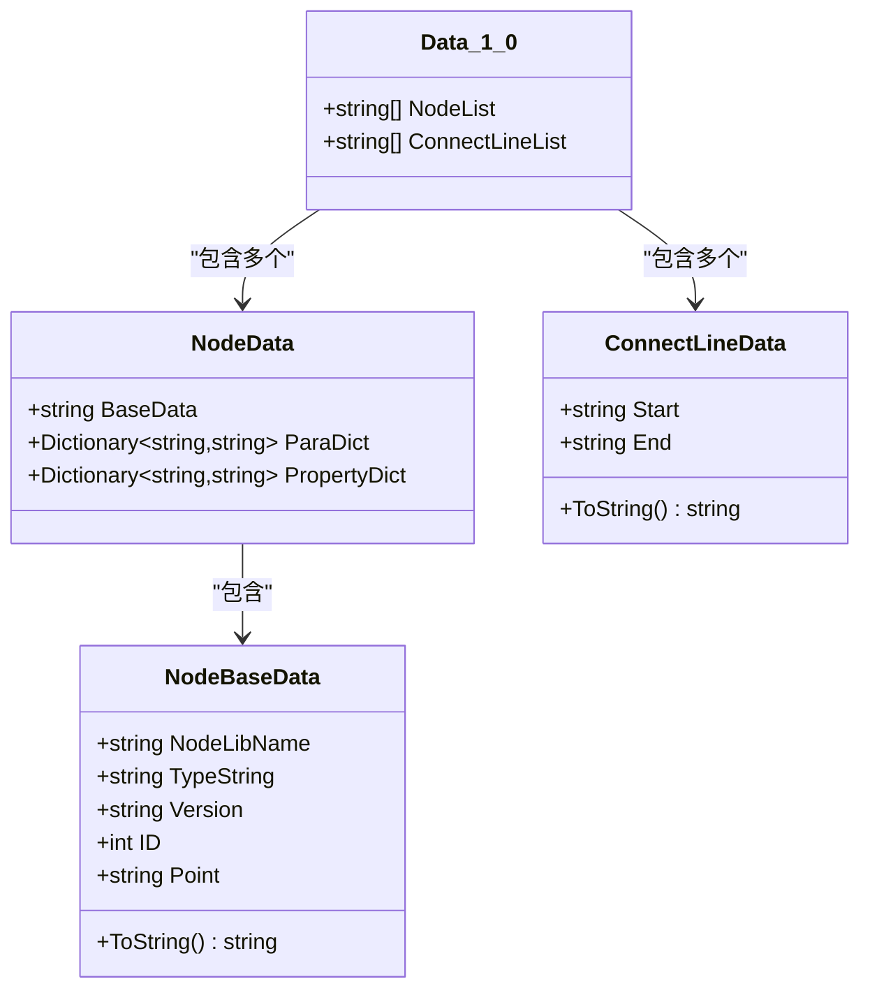
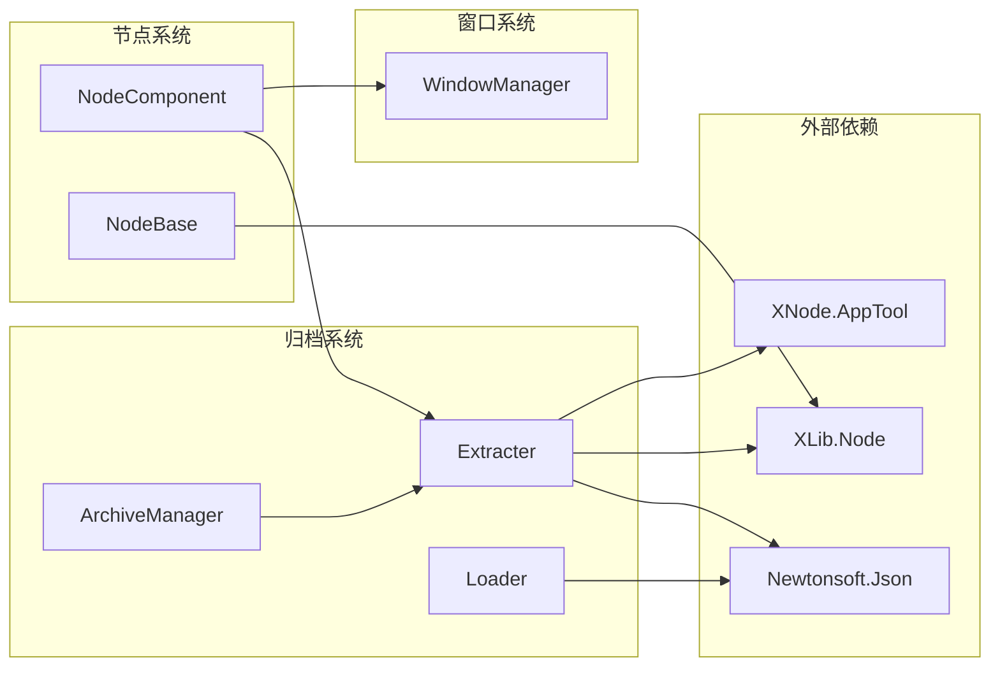

# 归档提取流程

<cite>
**本文档中引用的文件**
- [Extracter.cs](file://XNode/SubSystem/ArchiveSystem/Extracter.cs)
- [ArchiveManager.cs](file://XNode/SubSystem/ArchiveSystem/ArchiveManager.cs)
- [Loader_1_0.cs](file://XNode/SubSystem/ArchiveSystem/Loader/Loader_1_0.cs)
- [Data_1_0.cs](file://XNode/SubSystem/ArchiveSystem/Define/Data_1_0/Data_1_0.cs)
- [NodeData.cs](file://XNode/SubSystem/ArchiveSystem/Define/Data_1_0/NodeData.cs)
- [NodeBaseData.cs](file://XNode/SubSystem/ArchiveSystem/Define/Data_1_0/NodeBaseData.cs)
- [ConnectLineData.cs](file://XNode/SubSystem/ArchiveSystem/Define/Data_1_0/ConnectLineData.cs)
- [NodeComponent.cs](file://XNode/SubSystem/NodeEditSystem/Panel/Component/NodeComponent.cs)
- [PinPath.cs](file://XNode/SubSystem/NodeEditSystem/Define/PinPath.cs)
</cite>

## 目录
1. [简介](#简介)
2. [项目结构概览](#项目结构概览)
3. [核心组件分析](#核心组件分析)
4. [架构概览](#架构概览)
5. [详细组件分析](#详细组件分析)
6. [依赖关系分析](#依赖关系分析)
7. [性能考虑](#性能考虑)
8. [故障排除指南](#故障排除指南)
9. [结论](#结论)

## 简介

XNode项目中的归档提取流程是一个复杂的数据转换系统，负责将运行时节点系统状态（NodeComponent中的NodeBase列表）转换为可序列化的Data_1_0数据结构。该流程通过Extracter类实现，它能够遍历节点、引脚和连接线，提取节点属性与引脚数据，并将其转换为JSON格式的字符串存储。

这个系统的设计目标是确保节点系统的完整性和可恢复性，支持节点状态的持久化和跨版本兼容性。Extracter类采用递归遍历的方式处理复杂的节点网络结构，同时具备完善的异常处理机制来应对空引用和循环引用等潜在问题。

## 项目结构概览

归档系统位于XNode项目的`XNode/SubSystem/ArchiveSystem`目录下，包含以下关键组件：



**图表来源**
- [Extracter.cs](file://XNode/SubSystem/ArchiveSystem/Extracter.cs#L1-L91)
- [ArchiveManager.cs](file://XNode/SubSystem/ArchiveSystem/ArchiveManager.cs#L1-L137)
- [NodeComponent.cs](file://XNode/SubSystem/NodeEditSystem/Panel/Component/NodeComponent.cs#L1-L125)

**章节来源**
- [Extracter.cs](file://XNode/SubSystem/ArchiveSystem/Extracter.cs#L1-L91)
- [ArchiveManager.cs](file://XNode/SubSystem/ArchiveSystem/ArchiveManager.cs#L1-L137)

## 核心组件分析

### Extracter类 - 主要提取器

Extracter类是整个归档提取流程的核心组件，负责将运行时节点系统状态转换为可序列化的数据结构。该类采用静态方法设计，提供了简洁的API接口：

```csharp
public static Data_1_0 Extract()
{
    Data_1_0 result = new Data_1_0();
    FillNodeList(result);
    FillConnectLineList(result);
    return result;
}
```

Extracter类的主要职责包括：
- **节点列表提取**：遍历所有活动节点，提取基本信息和属性
- **连接线列表提取**：分析节点间的引脚连接关系
- **数据序列化**：将提取的数据转换为JSON格式的字符串

### ArchiveManager类 - 系统协调器

ArchiveManager作为单例模式的管理器，负责协调整个归档系统的生命周期：

```csharp
public ArchiveFile GenerateArchive()
{
    return new ArchiveFile
    {
        Version = CurrentVersion,
        Data = Extracter.Extract(),
    };
}
```

**章节来源**
- [Extracter.cs](file://XNode/SubSystem/ArchiveSystem/Extracter.cs#L12-L20)
- [ArchiveManager.cs](file://XNode/SubSystem/ArchiveSystem/ArchiveManager.cs#L35-L41)

## 架构概览

归档提取流程遵循分层架构设计，从底层的数据模型到上层的业务逻辑：



**图表来源**
- [ArchiveManager.cs](file://XNode/SubSystem/ArchiveSystem/ArchiveManager.cs#L35-L41)
- [Extracter.cs](file://XNode/SubSystem/ArchiveSystem/Extracter.cs#L12-L20)
- [NodeComponent.cs](file://XNode/SubSystem/NodeEditSystem/Panel/Component/NodeComponent.cs#L25-L35)

## 详细组件分析

### 节点数据提取过程

Extracter类的FillNodeList方法实现了节点数据的递归提取：



**图表来源**
- [Extracter.cs](file://XNode/SubSystem/ArchiveSystem/Extracter.cs#L23-L42)

#### 节点数据映射逻辑

Extracter类将NodeBase对象映射到NodeData结构的过程如下：

1. **基础数据提取**：
```csharp
NodeBaseData baseData = new NodeBaseData
{
    NodeLibName = node.NodeLibName,
    TypeString = node.GetTypeString(),
    Version = node.Version,
    ID = node.ID,
    Point = node.Point.ToString(),
};
```

2. **参数与属性提取**：
```csharp
NodeData nodeData = new NodeData
{
    BaseData = baseData.ToString(),
    ParaDict = node.GetParaDict(),
    PropertyDict = node.GetPropertyDict(),
};
```

3. **JSON序列化**：
```csharp
data.NodeList.Add(JsonConvert.SerializeObject(nodeData));
```

### 连接线数据提取过程

FillConnectLineList方法负责分析节点间的引脚连接关系：



**图表来源**
- [Extracter.cs](file://XNode/SubSystem/ArchiveSystem/Extracter.cs#L45-L78)

### 引脚路径解析机制

连接线数据使用PinPath类来表示引脚的唯一标识：

```csharp
public class PinPath
{
    public string NodeVersion { get; set; } = "1.0";
    public int NodeID { get; set; } = -1;
    public int GroupIndex { get; set; } = -1;
    public int PinIndex { get; set; } = -1;
    
    public override string ToString() => $"{NodeVersion},{NodeID},{GroupIndex},{PinIndex}";
}
```

这种设计确保了引脚在不同版本间的一致性识别。

**章节来源**
- [Extracter.cs](file://XNode/SubSystem/ArchiveSystem/Extracter.cs#L23-L78)
- [PinPath.cs](file://XNode/SubSystem/NodeEditSystem/Define/PinPath.cs#L1-L33)

### 数据结构层次分析

归档系统采用了分层的数据结构设计：



**图表来源**
- [Data_1_0.cs](file://XNode/SubSystem/ArchiveSystem/Define/Data_1_0/Data_1_0.cs#L1-L14)
- [NodeData.cs](file://XNode/SubSystem/ArchiveSystem/Define/Data_1_0/NodeData.cs#L1-L17)
- [NodeBaseData.cs](file://XNode/SubSystem/ArchiveSystem/Define/Data_1_0/NodeBaseData.cs#L1-L34)
- [ConnectLineData.cs](file://XNode/SubSystem/ArchiveSystem/Define/Data_1_0/ConnectLineData.cs#L1-L14)

**章节来源**
- [Data_1_0.cs](file://XNode/SubSystem/ArchiveSystem/Define/Data_1_0/Data_1_0.cs#L1-L14)
- [NodeData.cs](file://XNode/SubSystem/ArchiveSystem/Define/Data_1_0/NodeData.cs#L1-L17)
- [NodeBaseData.cs](file://XNode/SubSystem/ArchiveSystem/Define/Data_1_0/NodeBaseData.cs#L1-L34)
- [ConnectLineData.cs](file://XNode/SubSystem/ArchiveSystem/Define/Data_1_0/ConnectLineData.cs#L1-L14)

## 依赖关系分析

归档提取流程涉及多个组件间的复杂依赖关系：



**图表来源**
- [Extracter.cs](file://XNode/SubSystem/ArchiveSystem/Extracter.cs#L1-L8)
- [ArchiveManager.cs](file://XNode/SubSystem/ArchiveSystem/ArchiveManager.cs#L1-L12)

### 关键依赖说明

1. **Newtonsoft.Json**：用于JSON序列化和反序列化操作
2. **XLib.Node**：提供NodeBase等核心节点类
3. **XNode.AppTool**：提供WM（WindowManager）工具类
4. **WindowManager**：访问编辑器的NodeList

**章节来源**
- [Extracter.cs](file://XNode/SubSystem/ArchiveSystem/Extracter.cs#L1-L8)
- [ArchiveManager.cs](file://XNode/SubSystem/ArchiveSystem/ArchiveManager.cs#L1-L12)

## 性能考虑

### 批量处理优化

Extracter类采用了批量处理策略来提高性能：

1. **一次性遍历**：在FillNodeList和FillConnectLineList中一次性完成所有节点的处理
2. **字典缓存**：使用Dictionary来缓存连接信息，避免重复计算
3. **延迟序列化**：只在最后阶段进行JSON序列化，减少中间对象的内存占用

### 内存管理策略

1. **对象池化**：对于频繁创建的对象（如NodeData），考虑使用对象池技术
2. **及时释放**：处理完成后立即清理临时数据结构
3. **流式处理**：对于大型项目，可以考虑分块处理而非一次性加载所有数据

### 并发处理可能性

虽然当前实现是单线程的，但系统设计为未来并发处理预留了空间：
- 静态方法设计便于多线程调用
- 无状态的操作减少了线程安全问题
- JSON序列化是线程安全的

## 故障排除指南

### 常见异常情况及处理策略

#### 空引用异常

**问题场景**：节点或引脚对象为空
```csharp
// 处理策略
if (node == null) continue;
if (pin == null) continue;
```

#### 循环引用检测

**问题场景**：节点间存在循环连接
```csharp
// 处理策略
private static HashSet<PinBase> visitedPins = new HashSet<PinBase>();
if (visitedPins.Contains(pin)) return; // 避免无限递归
visitedPins.Add(pin);
```

#### 版本兼容性问题

**问题场景**：节点版本与当前系统不兼容
```csharp
// 处理策略
try
{
    ArchiveVersion version = new ArchiveVersion(file.Version);
}
catch (Exception)
{
    return false; // 版本无效
}
```

### 错误处理机制

Extracter类和ArchiveManager都实现了完善的错误处理：

1. **节点级错误处理**：单个节点处理失败不影响整体流程
2. **连接线错误处理**：引脚查找失败时跳过该连接
3. **版本验证**：确保存档版本与系统兼容
4. **回滚机制**：加载失败时保持原有状态不变

**章节来源**
- [Extracter.cs](file://XNode/SubSystem/ArchiveSystem/Extracter.cs#L23-L78)
- [ArchiveManager.cs](file://XNode/SubSystem/ArchiveSystem/ArchiveManager.cs#L70-L85)
- [Loader_1_0.cs](file://XNode/SubSystem/ArchiveSystem/Loader/Loader_1_0.cs#L10-L25)

## 结论

XNode项目的归档提取流程是一个设计精良的数据转换系统，它成功地解决了运行时节点系统状态到可序列化数据结构的转换问题。通过Extracter类的递归遍历机制，系统能够完整地捕获节点网络的拓扑结构和状态信息。

### 主要优势

1. **完整性保证**：能够提取节点的所有属性和引脚连接信息
2. **版本兼容性**：支持跨版本的数据迁移和兼容性检查
3. **错误容错**：具备完善的异常处理和错误恢复机制
4. **性能优化**：采用批量处理和延迟序列化的策略
5. **扩展性设计**：为未来的功能扩展预留了良好的架构基础

### 技术亮点

- **分层架构**：清晰的职责分离和模块化设计
- **JSON序列化**：利用成熟的JSON格式确保数据的可读性和互操作性
- **PinPath机制**：提供稳定的引脚标识方案
- **单例模式**：ArchiveManager的单例设计确保系统状态的一致性

这个归档提取流程为XNode项目提供了可靠的数据持久化能力，是整个节点系统架构中不可或缺的重要组成部分。通过合理的抽象和封装，它成功地将复杂的节点网络转换为简单而有效的数据结构，为后续的数据加载和系统恢复奠定了坚实的基础。