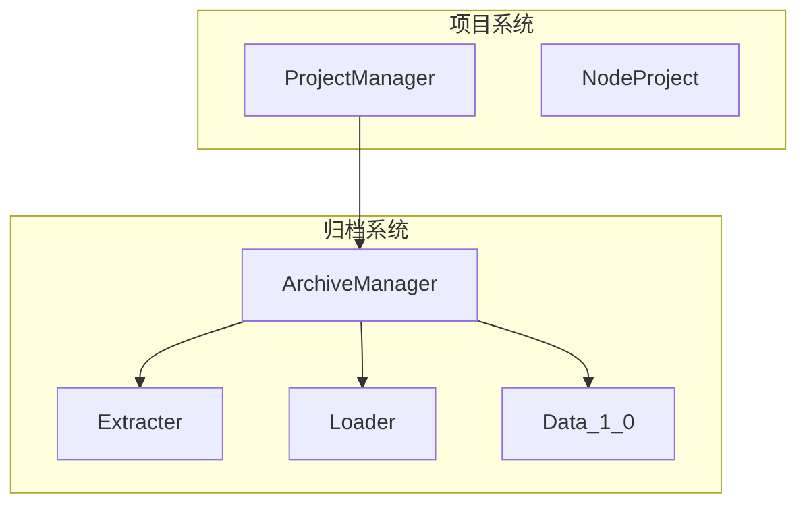
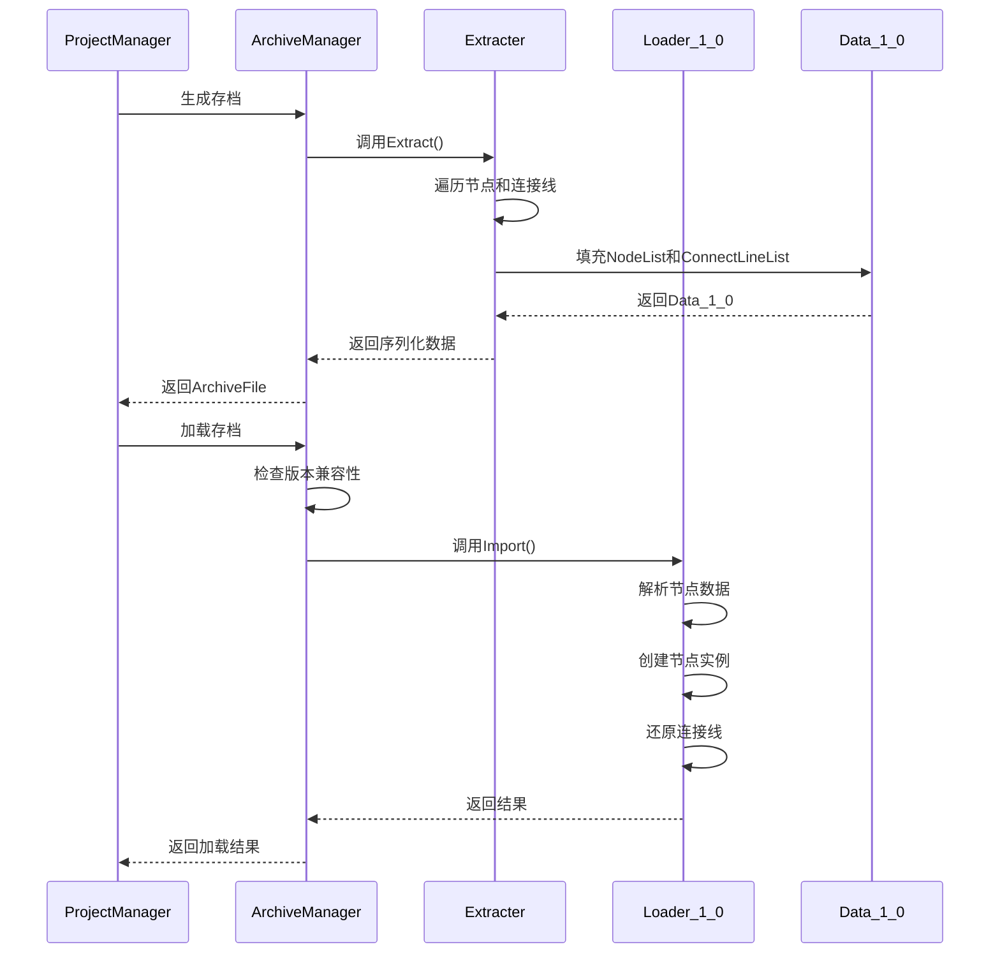
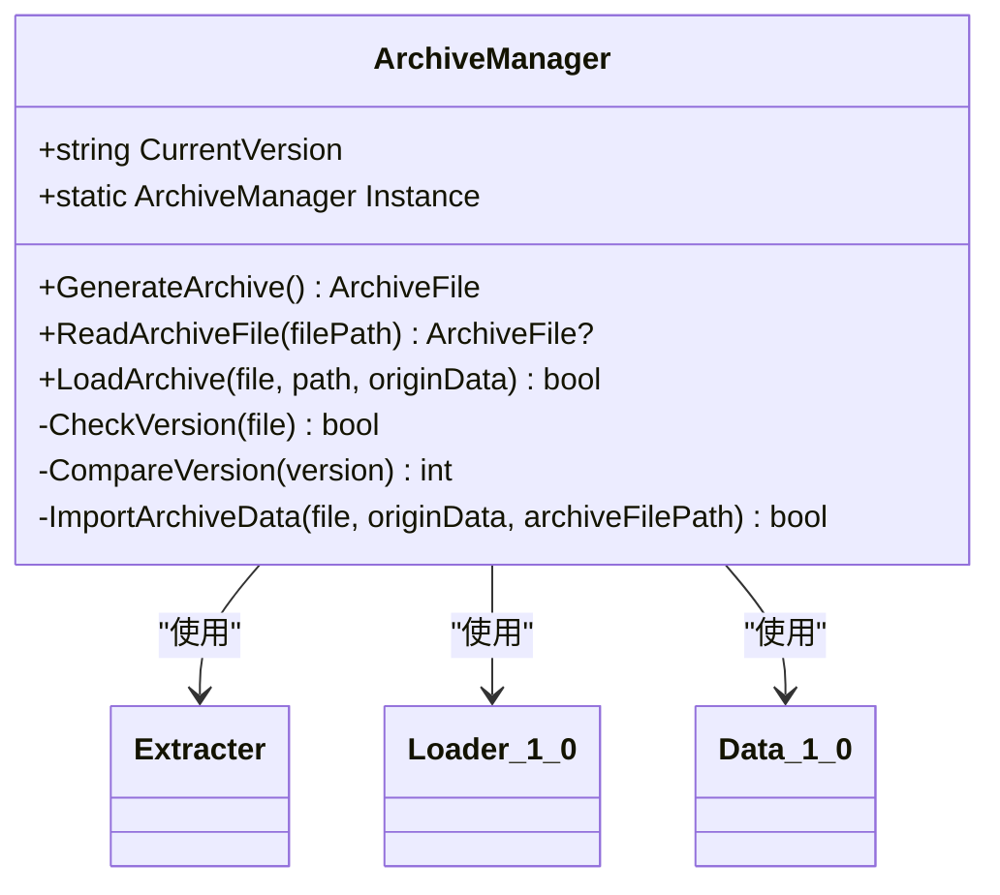
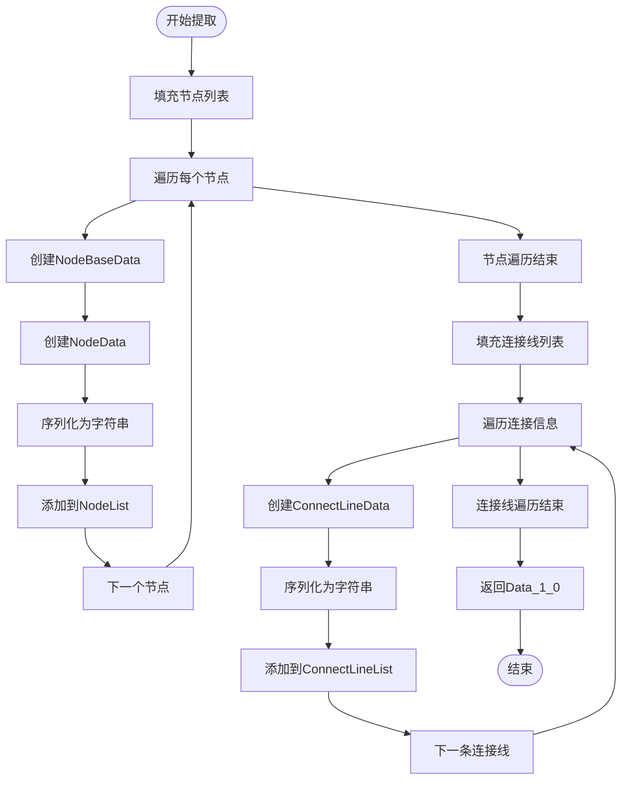
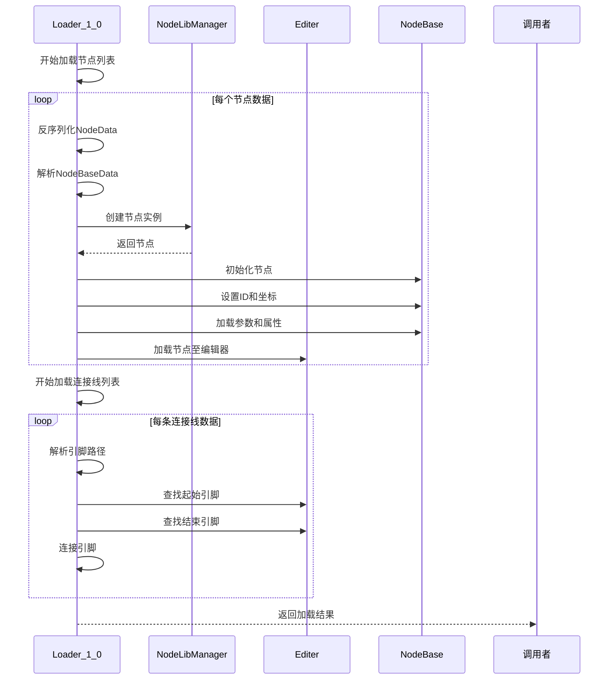
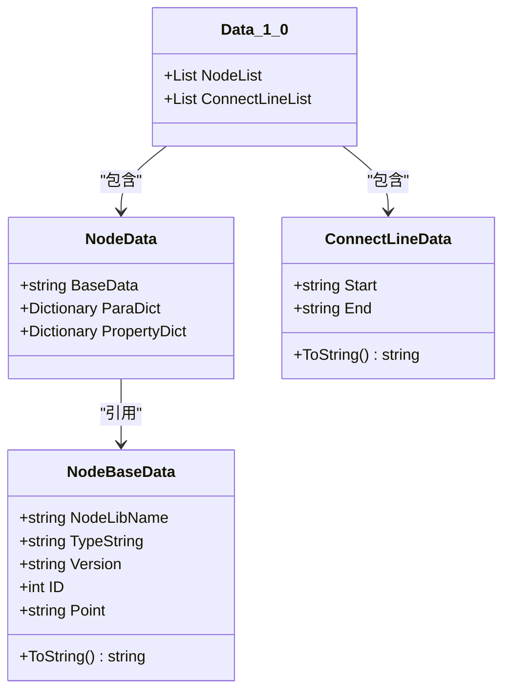
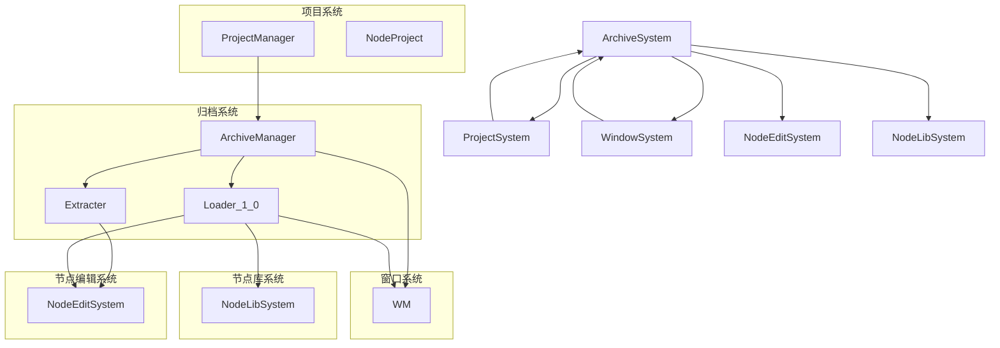

# 归档系统架构

<cite>
**本文档引用的文件**
- [ArchiveManager.cs](file://XNode/SubSystem/ArchiveSystem/ArchiveManager.cs)
- [Extracter.cs](file://XNode/SubSystem/ArchiveSystem/Extracter.cs)
- [Loader_1_0.cs](file://XNode/SubSystem/ArchiveSystem/Loader/Loader_1_0.cs)
- [Data_1_0.cs](file://XNode/SubSystem/ArchiveSystem/Define/Data_1_0/Data_1_0.cs)
- [NodeBaseData.cs](file://XNode/SubSystem/ArchiveSystem/Define/Data_1_0/NodeBaseData.cs)
- [NodeData.cs](file://XNode/SubSystem/ArchiveSystem/Define/Data_1_0/NodeData.cs)
- [ConnectLineData.cs](file://XNode/SubSystem/ArchiveSystem/Define/Data_1_0/ConnectLineData.cs)
- [ProjectManager.cs](file://XNode/SubSystem/ProjectSystem/ProjectManager.cs)
- [NodeProject.cs](file://XNode/SubSystem/ProjectSystem/NodeProject.cs)
</cite>

## 目录
1. [简介](#简介)
2. [项目结构](#项目结构)
3. [核心组件](#核心组件)
4. [架构概述](#架构概述)
5. [详细组件分析](#详细组件分析)
6. [依赖分析](#依赖分析)
7. [性能考虑](#性能考虑)
8. [故障排除指南](#故障排除指南)
9. [结论](#结论)

## 简介
本文档详细阐述了归档系统（ArchiveSystem）的架构设计，重点涵盖项目数据的持久化与版本兼容策略。文档说明了ArchiveManager如何协调Extracter（提取数据模型）和Loader_1_0（加载旧版本数据）完成序列化与反序列化流程。解析了Data_1_0数据结构如何映射运行时对象（NodeBase、ConnectLine）为JSON可序列化格式。描述了Extracter如何遍历NodeComponent中的节点列表并生成归档数据。讨论了Loader_1_0如何处理未来可能的格式升级与向后兼容性。提供了代码示例展示从NodeProject到JSON字符串的完整转换路径，并强调了该系统与ProjectManager的紧密协作。

## 项目结构
归档系统位于`XNode/SubSystem/ArchiveSystem`目录下，是XNode项目的核心子系统之一。该系统主要由ArchiveManager、Extracter、Loader和Data模型组成，负责项目数据的持久化存储与版本管理。

**Diagram sources**
- [ArchiveManager.cs](file://XNode/SubSystem/ArchiveSystem/ArchiveManager.cs#L1-L136)
- [ProjectManager.cs](file://XNode/SubSystem/ProjectSystem/ProjectManager.cs#L1-L253)

**Section sources**
- [ArchiveManager.cs](file://XNode/SubSystem/ArchiveSystem/ArchiveManager.cs#L1-L136)
- [ProjectManager.cs](file://XNode/SubSystem/ProjectSystem/ProjectManager.cs#L1-L253)

## 核心组件
归档系统的核心组件包括ArchiveManager、Extracter、Loader_1_0和Data_1_0数据模型。这些组件协同工作，实现了项目数据的序列化、反序列化和版本管理功能。

**Section sources**
- [ArchiveManager.cs](file://XNode/SubSystem/ArchiveSystem/ArchiveManager.cs#L1-L136)
- [Extracter.cs](file://XNode/SubSystem/ArchiveSystem/Extracter.cs#L1-L90)
- [Loader_1_0.cs](file://XNode/SubSystem/ArchiveSystem/Loader/Loader_1_0.cs#L1-L81)
- [Data_1_0.cs](file://XNode/SubSystem/ArchiveSystem/Define/Data_1_0/Data_1_0.cs#L1-L13)

## 架构概述
归档系统的架构设计遵循单一职责原则，各组件分工明确。ArchiveManager作为协调者，负责管理存档的生成和加载流程。Extracter负责从运行时对象提取数据，而Loader_1_0负责将存档数据还原为运行时对象。Data_1_0数据模型定义了版本1.0的存档数据结构。

**Diagram sources**
- [ArchiveManager.cs](file://XNode/SubSystem/ArchiveSystem/ArchiveManager.cs#L1-L136)
- [Extracter.cs](file://XNode/SubSystem/ArchiveSystem/Extracter.cs#L1-L90)
- [Loader_1_0.cs](file://XNode/SubSystem/ArchiveSystem/Loader/Loader_1_0.cs#L1-L81)

## 详细组件分析
### ArchiveManager分析
ArchiveManager是归档系统的核心协调者，负责管理存档的生成和加载流程。它通过单例模式确保全局唯一实例，并维护当前版本号。

**Diagram sources**
- [ArchiveManager.cs](file://XNode/SubSystem/ArchiveSystem/ArchiveManager.cs#L1-L136)

**Section sources**
- [ArchiveManager.cs](file://XNode/SubSystem/ArchiveSystem/ArchiveManager.cs#L1-L136)

### Extracter分析
Extracter负责从运行时对象提取数据，生成可序列化的存档数据。它通过遍历节点列表和连接线信息，将运行时状态转换为Data_1_0数据模型。

**Diagram sources**
- [Extracter.cs](file://XNode/SubSystem/ArchiveSystem/Extracter.cs#L1-L90)

**Section sources**
- [Extracter.cs](file://XNode/SubSystem/ArchiveSystem/Extracter.cs#L1-L90)

### Loader_1_0分析
Loader_1_0负责将存档数据还原为运行时对象。它处理版本1.0的存档数据，确保向后兼容性，并在出现异常时提供错误处理。

**Diagram sources**
- [Loader_1_0.cs](file://XNode/SubSystem/ArchiveSystem/Loader/Loader_1_0.cs#L1-L81)

**Section sources**
- [Loader_1_0.cs](file://XNode/SubSystem/ArchiveSystem/Loader/Loader_1_0.cs#L1-L81)

### Data_1_0数据模型分析
Data_1_0数据模型定义了版本1.0的存档数据结构，包括节点列表和连接线列表。这些数据结构被设计为可序列化为JSON格式。

**Diagram sources**
- [Data_1_0.cs](file://XNode/SubSystem/ArchiveSystem/Define/Data_1_0/Data_1_0.cs#L1-L13)
- [NodeBaseData.cs](file://XNode/SubSystem/ArchiveSystem/Define/Data_1_0/NodeBaseData.cs#L1-L33)
- [NodeData.cs](file://XNode/SubSystem/ArchiveSystem/Define/Data_1_0/NodeData.cs#L1-L16)
- [ConnectLineData.cs](file://XNode/SubSystem/ArchiveSystem/Define/Data_1_0/ConnectLineData.cs#L1-L13)

**Section sources**
- [Data_1_0.cs](file://XNode/SubSystem/ArchiveSystem/Define/Data_1_0/Data_1_0.cs#L1-L13)
- [NodeBaseData.cs](file://XNode/SubSystem/ArchiveSystem/Define/Data_1_0/NodeBaseData.cs#L1-L33)
- [NodeData.cs](file://XNode/SubSystem/ArchiveSystem/Define/Data_1_0/NodeData.cs#L1-L16)
- [ConnectLineData.cs](file://XNode/SubSystem/ArchiveSystem/Define/Data_1_0/ConnectLineData.cs#L1-L13)

## 依赖分析
归档系统与其他子系统存在紧密的依赖关系，特别是与项目系统和窗口系统的交互。

**Diagram sources**
- [ArchiveManager.cs](file://XNode/SubSystem/ArchiveSystem/ArchiveManager.cs#L1-L136)
- [ProjectManager.cs](file://XNode/SubSystem/ProjectSystem/ProjectManager.cs#L1-L253)
- [Loader_1_0.cs](file://XNode/SubSystem/ArchiveSystem/Loader/Loader_1_0.cs#L1-L81)
- [Extracter.cs](file://XNode/SubSystem/ArchiveSystem/Extracter.cs#L1-L90)

**Section sources**
- [ArchiveManager.cs](file://XNode/SubSystem/ArchiveSystem/ArchiveManager.cs#L1-L136)
- [ProjectManager.cs](file://XNode/SubSystem/ProjectSystem/ProjectManager.cs#L1-L253)

## 性能考虑
归档系统的性能主要受数据量和序列化/反序列化效率的影响。系统采用分步处理策略，将大型项目数据分解为小块进行处理，避免内存峰值。同时，使用StringBuilder和预分配集合来优化性能。

## 故障排除指南
当归档系统出现问题时，可以按照以下步骤进行排查：
1. 检查存档文件是否损坏或格式不正确
2. 验证版本号是否兼容
3. 检查节点库是否完整
4. 确认文件路径是否有效
5. 查看异常日志以获取详细信息

**Section sources**
- [ArchiveManager.cs](file://XNode/SubSystem/ArchiveSystem/ArchiveManager.cs#L1-L136)
- [Loader_1_0.cs](file://XNode/SubSystem/ArchiveSystem/Loader/Loader_1_0.cs#L1-L81)

## 结论
归档系统通过精心设计的架构实现了项目数据的持久化与版本管理。ArchiveManager作为协调者，有效地整合了Extracter和Loader_1_0的功能，确保了数据的正确序列化和反序列化。Data_1_0数据模型的设计考虑了JSON序列化的效率和兼容性。整个系统与ProjectManager紧密协作，为用户提供可靠的项目保存和加载功能。未来的版本升级可以通过添加新的Loader类来实现，保持良好的向后兼容性。