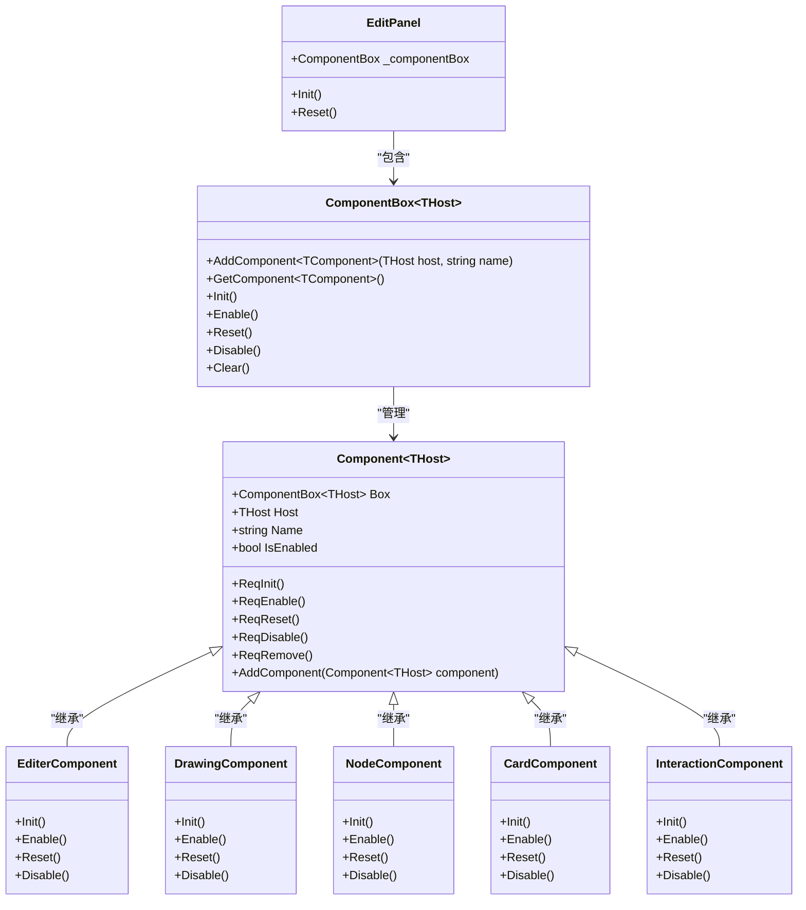
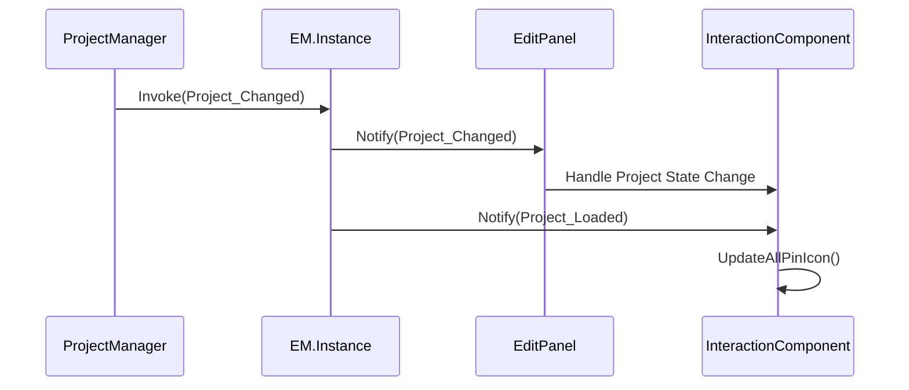
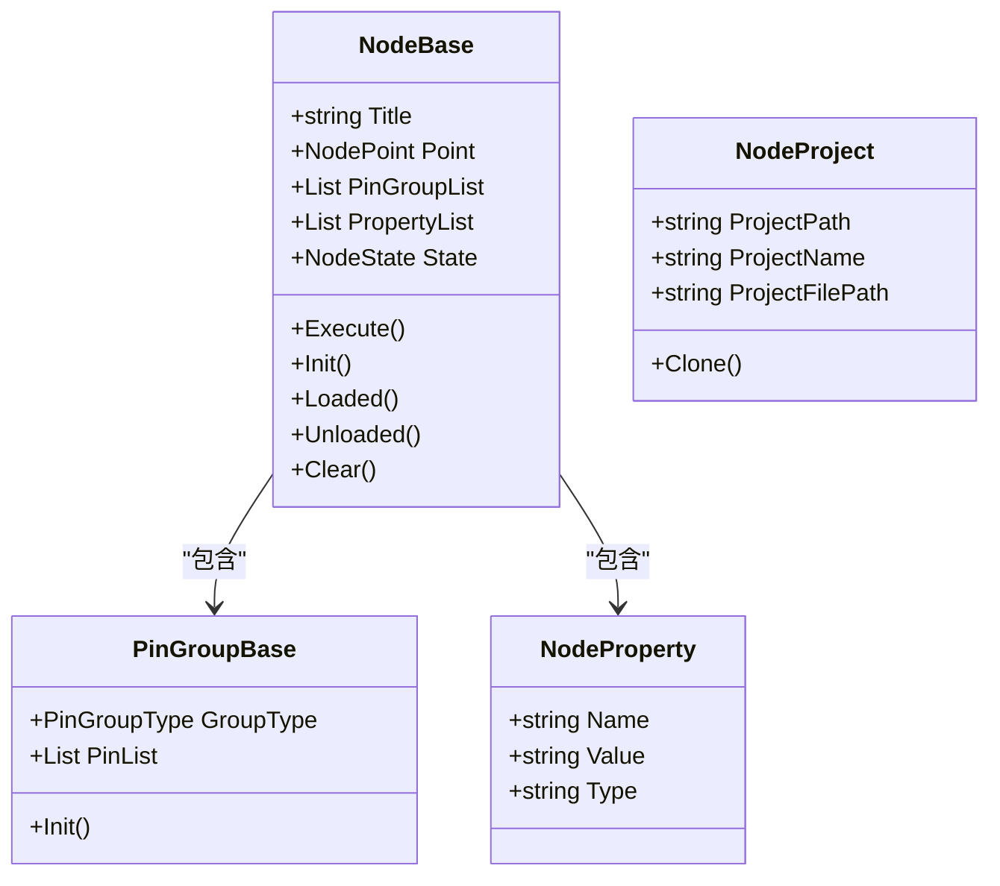
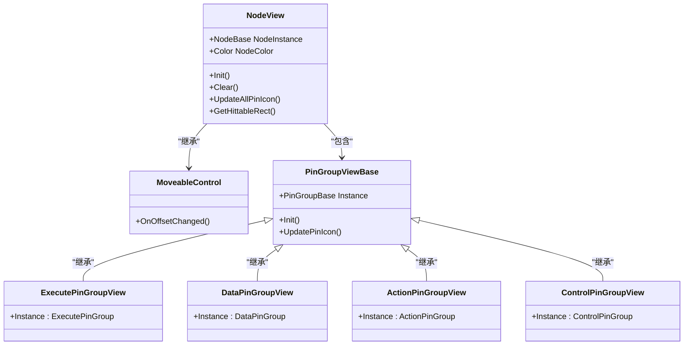
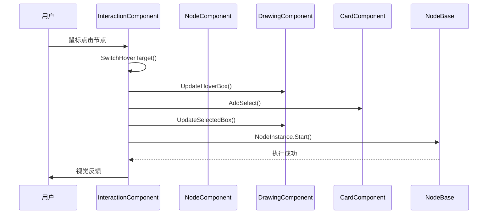
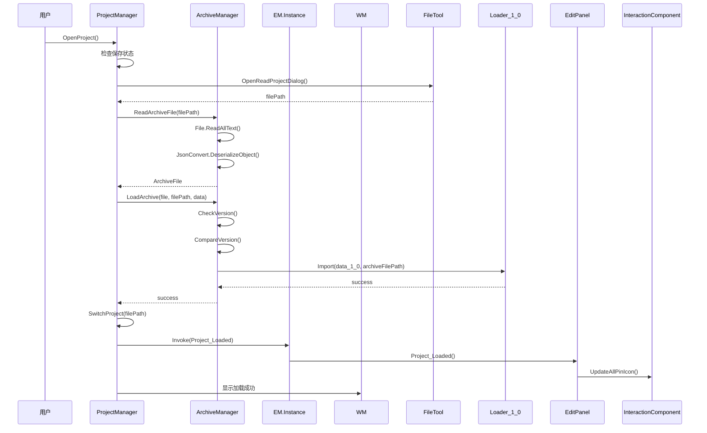
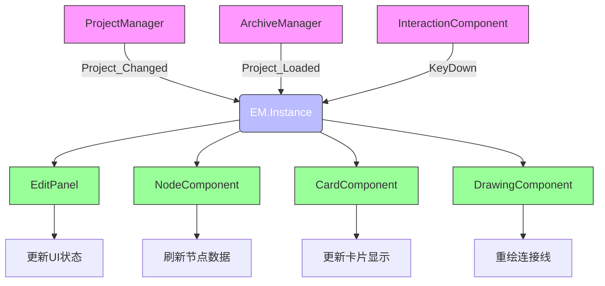

# 架构设计

<cite>
**本文档引用的文件**
- [ProjectManager.cs](file://XNode/SubSystem/ProjectSystem/ProjectManager.cs)
- [ArchiveManager.cs](file://XNode/SubSystem/ArchiveSystem/ArchiveManager.cs)
- [EM.cs](file://XLib.Base/EM.cs)
- [NodeBase.cs](file://XLib.Node/NodeBase.cs)
- [NodeProject.cs](file://XNode/SubSystem/ProjectSystem/NodeProject.cs)
- [EditPanel.xaml.cs](file://XNode/SubSystem/NodeEditSystem/Panel/EditPanel.xaml.cs)
- [TComponentBox.cs](file://XLib.Base/UIComponent/TComponentBox.cs)
- [NodeView.xaml.cs](file://XNode/SubSystem/NodeEditSystem/Control/NodeView.xaml.cs)
- [InteractionComponent.cs](file://XNode/SubSystem/NodeEditSystem/Panel/Component/InteractionComponent.cs)
- [EventType.cs](file://XNode/SubSystem/EventSystem/EventType.cs)
</cite>

## 目录
1. [引言](#引言)
2. [分层架构](#分层架构)
3. [核心设计模式](#核心设计模式)
4. [MVC变体架构](#mvc变体架构)
5. [系统上下文与组件交互](#系统上下文与组件交互)
6. [技术选型与权衡](#技术选型与权衡)
7. [结论](#结论)

## 引言
XNode是一个基于节点的可视化编程系统，采用分层架构和多种设计模式来实现高内聚、低耦合的系统设计。本架构设计文档深入解析XNode的高阶设计原则与系统边界，重点阐述其三大核心设计模式：单例模式、组件模式和观察者模式的应用，以及MVC变体架构中Model、View与Controller的职责划分。通过系统上下文图与组件交互图，展示核心管理器在项目生命周期中的协作机制。

## 分层架构
XNode系统采用清晰的分层架构，分为XLib基础库层和XNode主应用层两大核心层次。

**XLib基础库层**提供通用工具、数据结构和基础服务，包括：
- **XLib.Base**：提供基础服务框架、事件管理器(EM)、虚拟磁盘、UI组件等核心基础设施
- **XLib.Node**：定义节点系统的基础模型，如NodeBase、PinBase等
- **XLib.WPF**：提供WPF相关的UI组件和绘制功能
- **XLib.Animate**：提供动画引擎和相关功能

**XNode主应用层**实现具体的业务逻辑和功能，包括：
- **ProjectSystem**：项目管理系统，负责项目生命周期管理
- **ArchiveSystem**：存档系统，负责项目数据的序列化与反序列化
- **NodeEditSystem**：节点编辑系统，核心的可视化编辑功能
- **EventSystem**：事件系统，基于EM实现模块间通信
- **ResourceSystem**：资源管理系统，管理图标、光标等资源

这种分层结构实现了基础功能与业务逻辑的分离，提高了代码的可维护性和可扩展性。

**Section sources**
- [ProjectManager.cs](file://XNode/SubSystem/ProjectSystem/ProjectManager.cs)
- [ArchiveManager.cs](file://XNode/SubSystem/ArchiveSystem/ArchiveManager.cs)
- [EM.cs](file://XLib.Base/EM.cs)

## 核心设计模式
XNode系统广泛应用了三种核心设计模式：单例模式、组件模式和观察者模式，这些模式共同构建了系统的稳定架构。

### 单例模式
单例模式确保系统中关键管理器的全局唯一性，避免资源冲突和状态不一致。

**ProjectManager**作为项目管理的单例，通过静态Instance属性提供全局访问点：
```csharp
private ProjectManager() { }
public static ProjectManager Instance { get; } = new ProjectManager();
```
该实例负责管理当前项目的状态、新建、打开、保存和关闭等操作，是项目生命周期的核心控制点。

**ArchiveManager**同样采用单例模式，负责存档文件的生成、读取和加载：
```csharp
private ArchiveManager() { }
public static ArchiveManager Instance { get; } = new ArchiveManager();
```
它处理不同版本存档的兼容性问题，确保数据的持久化和版本迁移。

**EM.Instance**作为事件系统的全局入口，实现了跨模块通信的中枢：
```csharp
private EM() { }
public static EM Instance { get; } = new EM();
```
所有模块通过EM.Instance进行事件的发布和订阅，实现了松耦合的通信机制。

**Section sources**
- [ProjectManager.cs](file://XNode/SubSystem/ProjectSystem/ProjectManager.cs#L15-L252)
- [ArchiveManager.cs](file://XNode/SubSystem/ArchiveSystem/ArchiveManager.cs#L14-L135)
- [EM.cs](file://XNode/SubSystem/EventSystem/EM.cs#L5-L61)

### 组件模式
组件模式通过组合而非继承的方式构建复杂功能，提高了系统的灵活性和可扩展性。

**EditPanel**作为编辑器的宿主，通过ComponentBox组合多个功能组件：
```csharp
private readonly ComponentBox<EditPanel> _componentBox = new ComponentBox<EditPanel>();
```
在初始化过程中，EditPanel将各个功能组件添加到ComponentBox中：
```csharp
_componentBox.AddComponent<EditerComponent>(this, "编辑器组件");
_componentBox.AddComponent<DrawingComponent>(this, "绘图组件");
_componentBox.AddComponent<NodeComponent>(this, "节点组件");
_componentBox.AddComponent<CardComponent>(this, "卡片组件");
_componentBox.AddComponent<InteractionComponent>(this, "交互组件");
```

**ComponentBox**作为组件容器，管理组件的生命周期和依赖关系：
```csharp
public TComponent? AddComponent<TComponent>(THost host, string name = "未命名组件") where TComponent : Component<THost>, new()
```
它提供了组件的添加、获取、初始化、启用、重置和禁用等统一接口，实现了组件的集中管理。

**Component**基类定义了组件的标准接口和生命周期方法：
```csharp
protected virtual void Init() { }
protected virtual void Enable() { }
protected virtual void Reset() { }
protected virtual void Disable() { }
```
各具体组件继承Component类并实现相应功能，如NodeComponent负责节点管理，InteractionComponent负责交互处理。

这种组件化设计使得功能模块可以独立开发、测试和维护，通过组合方式构建复杂的编辑器功能。



**Diagram sources**
- [EditPanel.xaml.cs](file://XNode/SubSystem/NodeEditSystem/Panel/EditPanel.xaml.cs#L0-L122)
- [TComponentBox.cs](file://XLib.Base/UIComponent/TComponentBox.cs#L0-L154)
- [TComponent.cs](file://XLib.Base/UIComponent/TComponent.cs#L0-L167)

### 观察者模式
观察者模式通过事件机制实现模块间的松耦合通信，是XNode系统解耦的关键。

**EM（事件管理器）**作为观察者模式的核心，实现了事件的发布-订阅机制：
```csharp
public class EM<T> : IManager where T : Enum
```
它支持多种参数类型的事件监听：
```csharp
public void Add(T eventType, Action listener)
public void Add<T1>(T eventType, Action<T1> listener)
public void Add<T1, T2>(T eventType, Action<T1, T2> listener)
```

**EventType枚举**定义了系统中的事件类型：
```csharp
public enum EventType
{
    KeyDown,
    KeyUp,
    Project_Changed,
    Project_Loaded,
}
```

模块间通过EM进行事件通信，例如ProjectManager在项目状态变更时触发事件：
```csharp
EM.Instance.Invoke(EventType.Project_Changed);
```
其他模块可以订阅这些事件：
```csharp
EM.Instance.Add(EventType.Project_Loaded, Project_Loaded);
```

这种事件驱动的架构使得各模块可以独立工作，通过事件进行协作，大大降低了模块间的耦合度，提高了系统的可维护性和可扩展性。



**Diagram sources**
- [EM.cs](file://XLib.Base/EM.cs#L6-L140)
- [EM.cs](file://XNode/SubSystem/EventSystem/EM.cs#L5-L61)
- [EventType.cs](file://XNode/SubSystem/EventSystem/EventType.cs#L0-L15)

## MVC变体架构
XNode系统采用MVC变体架构，将系统分为Model、View和Controller三个核心部分，实现关注点分离。

### Model层
Model层负责数据管理和业务逻辑，主要包括NodeBase和NodeProject类。

**NodeBase**作为节点的基类，定义了节点的核心属性和行为：
```csharp
public abstract class NodeBase
{
    public string Title { get; set; }
    public NodePoint Point { get; set; }
    public List<PinGroupBase> PinGroupList { get; set; }
    public List<NodeProperty> PropertyList { get; set; }
    
    public void Execute()
    public abstract void Init()
    public virtual void Loaded()
}
```
它封装了节点的状态、坐标、引脚组、属性等数据，并提供了执行、初始化等核心方法。

**NodeProject**表示一个节点项目，管理项目的基本信息：
```csharp
public class NodeProject
{
    public string ProjectPath { get; set; }
    public string ProjectName { get; set; }
    public string ProjectFilePath => $"{ProjectPath}\\{ProjectFileName}{FileExtension}"
}
```
它负责项目路径、名称和文件路径的管理，是项目数据的载体。



**Diagram sources**
- [NodeBase.cs](file://XLib.Node/NodeBase.cs#L0-L417)
- [NodeProject.cs](file://XNode/SubSystem/ProjectSystem/NodeProject.cs#L0-L40)

### View层
View层负责用户界面的呈现和用户交互的可视化，主要包括NodeView和Layer等组件。

**NodeView**作为节点的可视化表示，继承自MoveableControl：
```csharp
public partial class NodeView : MoveableControl
```
它负责节点的UI呈现，包括：
- 节点图标和标题的显示
- 引脚组的布局和渲染
- 进度条的动态显示
- 节点状态的视觉反馈

NodeView通过监听NodeBase的事件来更新UI：
```csharp
NodeInstance.StateChanged += Node_StateChanged;
NodeInstance.ExecuteError += Node_ExecuteError;
NodeInstance.ParaChanged += Node_ParaChanged;
```

**Layer**系统负责不同图层的绘制，包括：
- GridLayer：网格背景
- ConnectLineLayer：连接线
- SelectedBoxLayer：选中框
- HoverBoxLayer：悬停框
- TempConnectLineLayer：临时连接线

这种分层绘制机制实现了复杂的视觉效果，同时保持了良好的性能。



**Diagram sources**
- [NodeView.xaml.cs](file://XNode/SubSystem/NodeEditSystem/Control/NodeView.xaml.cs#L0-L335)
- [PinGroupViewBase.cs](file://XNode/SubSystem/NodeEditSystem/Control/PinGroupViewBase.cs)

### Controller层
Controller层负责协调Model和View，处理用户输入和业务逻辑的调度，主要由InteractionComponent实现。

**InteractionComponent**作为核心控制器，负责处理所有用户交互：
```csharp
public class InteractionComponent : Component<EditPanel>
```
它的主要职责包括：

1. **输入处理**：监听键盘和鼠标事件
```csharp
_host.OperateArea.MouseMove += OperateArea_MouseMove;
_host.OperateArea.MouseDown += OperateArea_MouseDown;
_host.OperateArea.MouseUp += OperateArea_MouseUp;
```

2. **工具管理**：集成SelectTool等交互工具
```csharp
_tool = new SelectTool(this);
_tool.Init();
```

3. **操作协调**：协调节点的拖拽、选择、连接等操作
```csharp
public void BeginDragNode()
public void DragNode()
public void EndDragNode()
public void BeginDrawConnectLine()
public void DrawConnectLine()
public void EndDrawConnectLine()
```

4. **状态管理**：维护当前悬停、选中等状态
```csharp
private NodeView? _hoveredNodeView = null;
private Point _mousePoint = new Point();
private Point _mouseDown = new Point();
```

5. **事件响应**：处理节点状态变更事件
```csharp
private void NodeBack_MouseEnter(NodeView nodeView)
private void NodeBack_MouseLeave(NodeView nodeView)
private void PinGroupListChanged()
private void NodeChanged()
```

InteractionComponent通过GetComponent<T>方法访问其他组件，实现了组件间的协作：
```csharp
GetComponent<DrawingComponent>()
GetComponent<NodeComponent>()
GetComponent<CardComponent>()
```

这种Controller设计使得交互逻辑集中管理，便于维护和扩展。



**Diagram sources**
- [InteractionComponent.cs](file://XNode/SubSystem/NodeEditSystem/Panel/Component/InteractionComponent.cs#L0-L756)
- [SelectTool.cs](file://XNode/SubSystem/NodeEditSystem/Panel/Component/SelectTool.cs)

## 系统上下文与组件交互
XNode系统的运行依赖于核心管理器之间的紧密协作和事件驱动的通信机制。

### 项目生命周期中的协作
ProjectManager与ArchiveManager在项目生命周期中密切协作，共同管理项目的持久化。



在这个流程中，ProjectManager负责项目级别的操作控制，而ArchiveManager专注于存档数据的读取和解析。两者通过清晰的职责划分和接口定义实现了高效协作。

**Diagram sources**
- [ProjectManager.cs](file://XNode/SubSystem/ProjectSystem/ProjectManager.cs#L15-L252)
- [ArchiveManager.cs](file://XNode/SubSystem/ArchiveSystem/ArchiveManager.cs#L14-L135)

### EM在跨模块通信中的中枢作用
EM事件系统作为系统的通信中枢，实现了模块间的松耦合通信。



EM系统的主要特点包括：
- **类型安全**：通过泛型约束事件类型
- **线程安全**：支持同步和异步事件调用
- **灵活的参数支持**：支持0-3个参数的事件
- **生命周期管理**：支持事件监听器的添加、移除和清理

这种事件驱动架构使得各模块可以独立开发和测试，通过事件进行协作，大大提高了系统的可维护性和可扩展性。

**Diagram sources**
- [EM.cs](file://XLib.Base/EM.cs#L6-L140)
- [EM.cs](file://XNode/SubSystem/EventSystem/EM.cs#L5-L61)
- [EventType.cs](file://XNode/SubSystem/EventSystem/EventType.cs#L0-L15)

## 技术选型与权衡
XNode系统在技术选型上做出了多项关键决策，这些决策基于对系统需求和架构目标的深入考虑。

### 组件化 vs 传统继承
XNode选择组件化而非传统继承方式扩展功能，主要基于以下权衡：

**组件化的优势：**
1. **灵活性**：功能模块可以动态组合，支持运行时的组件添加和移除
2. **可维护性**：每个组件职责单一，代码更易于理解和维护
3. **可测试性**：组件可以独立进行单元测试
4. **复用性**：组件可以在不同宿主中复用
5. **避免继承地狱**：避免了深层次继承带来的复杂性和脆弱性

**传统继承的局限：**
1. **僵化性**：继承关系在编译时确定，难以动态调整
2. **紧耦合**：子类与父类高度耦合，修改父类可能影响所有子类
3. **多重继承问题**：C#不支持多重继承，限制了功能组合
4. **脆弱的基类问题**：基类的修改可能破坏子类的行为

通过组件模式，XNode实现了"组合优于继承"的设计原则，使得系统更加灵活和可扩展。

### 单例模式的适用性
单例模式在XNode中的应用经过了谨慎考虑：

**适用场景：**
- **全局状态管理**：ProjectManager需要全局唯一的项目状态
- **资源协调**：ArchiveManager需要统一管理存档资源
- **通信中枢**：EM需要作为全局事件总线

**风险控制：**
- **延迟初始化**：通过私有构造函数和静态实例确保单例
- **线程安全**：在多线程环境下确保实例的唯一性
- **避免滥用**：仅在真正需要全局唯一性的场景使用

### 观察者模式的选择
选择观察者模式而非其他通信机制，主要基于：

**优势：**
- **解耦**：发布者和订阅者无需知道对方的存在
- **可扩展性**：可以轻松添加新的事件处理者
- **灵活性**：支持一对多的通信模式
- **异步支持**：可以通过BeginInvoke实现异步事件处理

**替代方案的不足：**
- **直接调用**：导致模块间紧耦合
- **轮询机制**：效率低下，资源浪费
- **回调函数**：难以管理复杂的依赖关系

这些技术选型共同构成了XNode稳定、灵活和可扩展的架构基础。

## 结论
XNode系统通过精心设计的分层架构和核心设计模式，构建了一个高内聚、低耦合的可视化编程平台。系统采用XLib基础库层与XNode主应用层的分层结构，实现了基础功能与业务逻辑的分离。三大核心设计模式——单例模式、组件模式和观察者模式——协同工作，确保了系统的稳定性、灵活性和可扩展性。

MVC变体架构中，Model、View和Controller的清晰职责划分实现了关注点分离，使得系统各部分可以独立开发和维护。ProjectManager与ArchiveManager在项目生命周期中的紧密协作，以及EM事件系统在跨模块通信中的中枢作用，展示了系统组件间高效协作的机制。

技术选型上，采用组件化而非传统继承方式扩展功能，体现了"组合优于继承"的设计原则，为系统带来了更高的灵活性和可维护性。这些架构决策共同支撑了XNode作为一个强大、稳定和可扩展的可视化编程系统的定位。