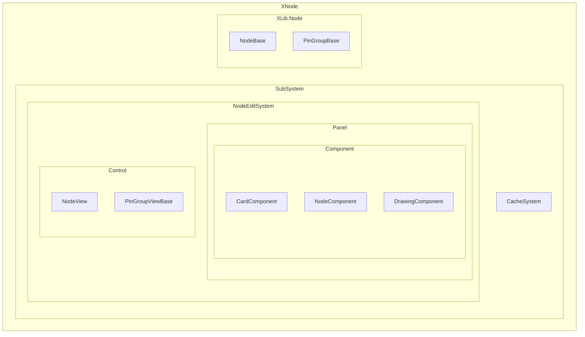
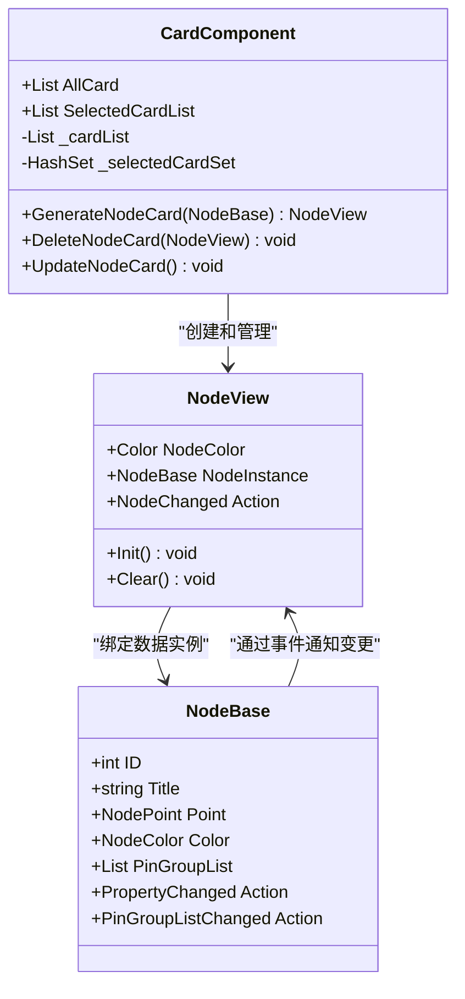
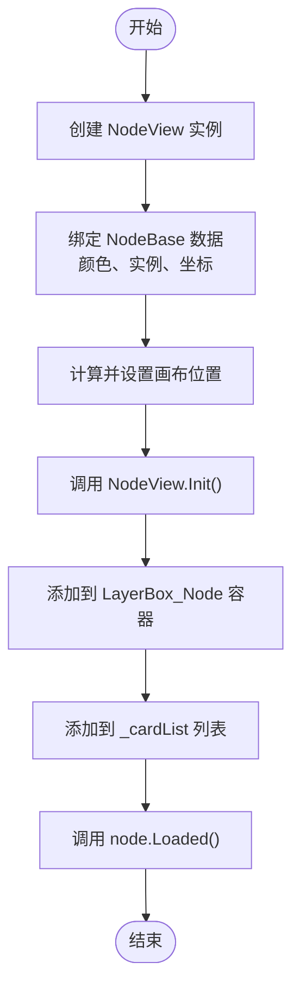
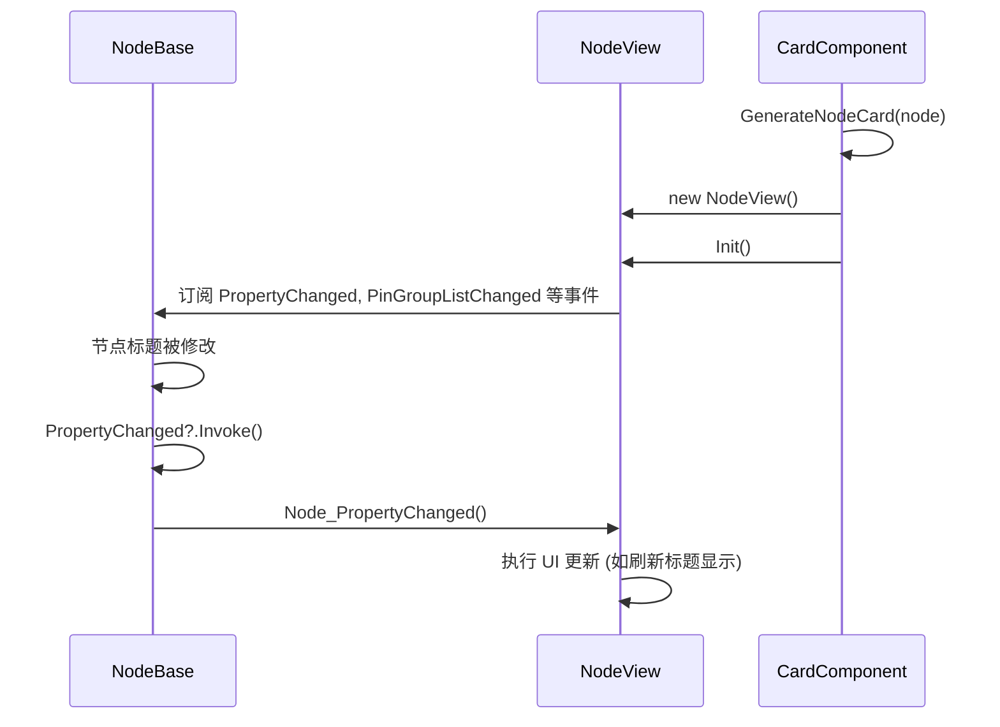

# CardComponent 视图管理

<cite>
**本文档引用的文件**   
- [CardComponent.cs](file://XNode/SubSystem/NodeEditSystem/Panel/Component/CardComponent.cs)
- [NodeView.xaml.cs](file://XNode/SubSystem/NodeEditSystem/Control/NodeView.xaml.cs)
- [NodeBase.cs](file://XLib.Node/NodeBase.cs)
- [NodeView.xaml](file://XNode/SubSystem/NodeEditSystem/Control/NodeView.xaml)
- [CacheManager.cs](file://XNode/SubSystem/CacheSystem/CacheManager.cs)
</cite>

## 目录
1. [简介](#简介)
2. [项目结构](#项目结构)
3. [核心组件](#核心组件)
4. [架构概述](#架构概述)
5. [详细组件分析](#详细组件分析)
6. [依赖分析](#依赖分析)
7. [性能考虑](#性能考虑)
8. [故障排除指南](#故障排除指南)
9. [结论](#结论)

## 简介
CardComponent 是 XNode 编辑器中的核心 UI 视图管理器，负责管理节点的可视化表示。它作为 NodeComponent 与 NodeView 之间的桥梁，实现了数据模型（NodeBase）到用户界面（NodeView）的映射。本文档详细阐述 CardComponent 如何生成、维护和更新节点卡片，以及其在处理大量节点时的性能优化策略。

## 项目结构
XNode 项目采用分层架构，将核心功能模块化。CardComponent 位于 NodeEditSystem 的 Panel 组件层，与 DrawingComponent、EditerComponent 等协同工作，共同构建节点编辑器的交互界面。



**Diagram sources**
- [CardComponent.cs](file://XNode/SubSystem/NodeEditSystem/Panel/Component/CardComponent.cs#L1-L134)
- [NodeView.xaml.cs](file://XNode/SubSystem/NodeEditSystem/Control/NodeView.xaml.cs#L1-L336)

**Section sources**
- [CardComponent.cs](file://XNode/SubSystem/NodeEditSystem/Panel/Component/CardComponent.cs#L1-L134)
- [NodeView.xaml.cs](file://XNode/SubSystem/NodeEditSystem/Control/NodeView.xaml.cs#L1-L336)

## 核心组件
CardComponent 的核心职责是管理 NodeView 控件的生命周期。它维护一个 `_cardList` 列表来存储所有已生成的节点视图，并通过 `GenerateNodeCard` 和 `DeleteNodeCard` 方法实现节点的创建与销毁。同时，它还管理一个 `_selectedCardSet` 集合，用于跟踪当前选中的节点卡片。

**Section sources**
- [CardComponent.cs](file://XNode/SubSystem/NodeEditSystem/Panel/Component/CardComponent.cs#L12-L133)

## 架构概述
CardComponent 与 NodeBase 和 NodeView 构成了一个典型的 MVC（Model-View-Controller）模式。NodeBase 作为数据模型（Model），包含节点的所有逻辑和状态信息；NodeView 作为视图（View），负责节点的 UI 呈现；而 CardComponent 则扮演控制器（Controller）的角色，协调模型与视图之间的同步。



**Diagram sources**
- [CardComponent.cs](file://XNode/SubSystem/NodeEditSystem/Panel/Component/CardComponent.cs#L12-L133)
- [NodeView.xaml.cs](file://XNode/SubSystem/NodeEditSystem/Control/NodeView.xaml.cs#L15-L334)
- [NodeBase.cs](file://XLib.Node/NodeBase.cs#L7-L417)

## 详细组件分析

### CardComponent 分析
CardComponent 是节点 UI 的核心管理器，其主要功能是根据 NodeComponent 中的 NodeBase 数据生成并维护对应的 NodeView 控件。

#### GenerateNodeCard 方法流程
`GenerateNodeCard` 方法是创建节点视图的关键入口。其执行流程如下：
1.  **创建 NodeView 实例**：根据传入的 `NodeBase` 对象，创建一个新的 `NodeView` 实例。
2.  **绑定数据与属性**：将 `NodeBase` 的颜色、实例引用和坐标信息赋值给 `NodeView` 的相应属性。
3.  **计算并设置位置**：结合 `DrawingComponent` 提供的世界中心坐标和节点自身的相对坐标，计算出节点在画布上的绝对位置，并通过 `Canvas.SetLeft` 和 `Canvas.SetTop` 进行设置。
4.  **初始化视图**：调用 `NodeView.Init()` 方法，完成视图内部的初始化工作，如加载引脚组、设置图标和标题等。
5.  **添加到容器**：将初始化完成的 `NodeView` 添加到 `_host.LayerBox_Node` 这个 UI 容器中，并将其加入 `_cardList` 列表进行管理。
6.  **触发加载事件**：调用 `node.Loaded()`，通知 `NodeBase` 实例它已被成功加载到编辑器中。



**Diagram sources**
- [CardComponent.cs](file://XNode/SubSystem/NodeEditSystem/Panel/Component/CardComponent.cs#L25-L58)

#### RemoveNodeCard 方法流程
`DeleteNodeCard` 方法负责安全地移除一个节点视图。其流程包括：
1.  **清理视图**：调用 `card.Clear()`，解除 `NodeView` 对 `NodeBase` 事件的监听，防止内存泄漏。
2.  **从 UI 移除**：从 `_host.LayerBox_Node` 容器中移除该 `NodeView` 控件。
3.  **从列表移除**：从 `_cardList` 列表中移除该 `NodeView` 的引用。

**Section sources**
- [CardComponent.cs](file://XNode/SubSystem/NodeEditSystem/Panel/Component/CardComponent.cs#L105-L115)

### NodeView 与 NodeBase 的数据同步
NodeView 与 NodeBase 之间的数据同步主要通过事件驱动机制和 XAML 绑定实现。

#### 事件驱动机制
`NodeView` 在 `Init()` 方法中，通过事件订阅的方式监听 `NodeBase` 的状态变化：
-   **PropertyChanged 事件**：当节点的属性（如标题、颜色）发生变化时，会触发此事件。`NodeView` 的 `Node_PropertyChanged` 回调会收到通知，并可以执行相应的 UI 更新逻辑。
-   **PinGroupListChanged 事件**：当节点的引脚组列表发生变更时，会触发此事件。`NodeView` 的 `Node_PinGroupListChanged` 回调会清空当前的引脚组视图，然后根据新的 `PinGroupList` 重新创建并加载所有引脚组视图。
-   **StateChanged 事件**：当节点的启用/禁用状态改变时，会触发此事件。`NodeView` 的 `Node_StateChanged` 回调会更新节点上的指示灯图标。



**Diagram sources**
- [NodeView.xaml.cs](file://XNode/SubSystem/NodeEditSystem/Control/NodeView.xaml.cs#L120-L125)
- [NodeBase.cs](file://XLib.Node/NodeBase.cs#L100-L115)

#### XAML 绑定机制
虽然代码中直接使用了属性赋值（如 `Block_Title.Text = NodeInstance.Title;`），但 XAML 绑定是实现动态更新的更优雅方式。在 `NodeView.xaml` 文件中，可以通过 `Binding` 将 UI 元素与 `NodeBase` 的属性关联起来。例如，`TextBlock` 的 `Text` 属性可以绑定到 `NodeInstance.Title`。当 `NodeBase.Title` 发生变化并触发 `PropertyChanged` 事件时，WPF 的数据绑定引擎会自动更新 UI 上的文本，无需在代码中手动设置。

```xml
<TextBlock x:Name="Block_Title" Text="{Binding NodeInstance.Title}" ... />
```

### 大量节点渲染的虚拟化与性能优化

#### 当前性能策略
根据现有代码分析，CardComponent 本身并未实现复杂的 UI 虚拟化（UI Virtualization）策略。它会为每一个 `NodeBase` 实例创建一个 `NodeView` 控件，并将它们全部添加到画布容器中。这种方式在节点数量较少时性能良好，但在处理大量节点时，可能会导致 UI 元素过多，影响渲染性能。

#### 潜在的优化手段
1.  **UI 虚拟化**：可以引入 `VirtualizingStackPanel` 或 `ListView` 的虚拟化功能，只渲染当前可视区域内的节点，对于屏幕外的节点，只保留其数据模型，不创建实际的 UI 控件。
2.  **缓存系统**：项目中存在 `CacheSystem`，`CacheManager` 负责管理缓存数据。虽然当前代码未显示其与 UI 的直接关联，但可以利用此系统来缓存节点的复杂计算结果或预渲染的图像，避免重复计算。
3.  **对象池**：对于频繁创建和销毁的节点，可以实现一个对象池（Object Pool），复用 `NodeView` 实例，减少垃圾回收的压力。
4.  **延迟加载**：对于复杂的节点，可以采用延迟加载策略，只有当节点进入可视区域或被选中时，才加载其完整的引脚组和详细信息。

**Section sources**
- [CardComponent.cs](file://XNode/SubSystem/NodeEditSystem/Panel/Component/CardComponent.cs#L1-L134)
- [CacheManager.cs](file://XNode/SubSystem/CacheSystem/CacheManager.cs#L1-L84)

## 依赖分析
CardComponent 的正常运行依赖于多个核心组件和系统。

```mermaid
graph TD
CardComponent --> DrawingComponent : "获取世界中心坐标"
CardComponent --> EditPanel : "访问 LayerBox_Node 容器"
NodeView --> NodeBase : "绑定数据实例"
NodeView --> PinGroupViewBase : "创建引脚组视图"
NodeBase --> PinGroupBase : "包含引脚组列表"
NodeBase --> NodeProperty : "包含属性列表"
```

**Diagram sources**
- [CardComponent.cs](file://XNode/SubSystem/NodeEditSystem/Panel/Component/CardComponent.cs#L40-L45)
- [NodeView.xaml.cs](file://XNode/SubSystem/NodeEditSystem/Control/NodeView.xaml.cs#L100-L115)

## 性能考虑
CardComponent 的性能主要受节点数量和 UI 复杂度的影响。目前的实现方式在节点数量庞大时可能会遇到性能瓶颈。建议未来版本中引入 UI 虚拟化技术，并结合 `CacheSystem` 进行数据缓存，以提升大规模节点场景下的用户体验。

## 故障排除指南
-   **问题：节点创建后不显示**
    -   **检查**：确认 `GenerateNodeCard` 方法是否被正确调用。
    -   **检查**：确认 `NodeBase` 实例的 `Point` 坐标是否在可视区域内。
    -   **检查**：确认 `_host.LayerBox_Node` 容器是否正确初始化并添加到主 UI 树中。

-   **问题：节点属性修改后 UI 未更新**
    -   **检查**：确认 `NodeBase` 的 `PropertyChanged` 事件是否被正确触发。
    -   **检查**：确认 `NodeView` 的 `Node_PropertyChanged` 回调是否已正确订阅。

-   **问题：内存泄漏**
    -   **检查**：确认 `DeleteNodeCard` 方法中的 `card.Clear()` 是否被调用，以确保事件监听被正确移除。

**Section sources**
- [CardComponent.cs](file://XNode/SubSystem/NodeEditSystem/Panel/Component/CardComponent.cs#L105-L115)
- [NodeView.xaml.cs](file://XNode/SubSystem/NodeEditSystem/Control/NodeView.xaml.cs#L150-L155)

## 结论
CardComponent 作为 XNode 编辑器的节点 UI 管理器，成功实现了 NodeBase 数据模型到 NodeView 视图的映射。它通过 `GenerateNodeCard` 和 `DeleteNodeCard` 等方法精确地控制着节点视图的生命周期，并通过事件机制与 NodeBase 保持数据同步。尽管当前实现未包含高级的虚拟化策略，但其清晰的架构为未来的性能优化奠定了坚实的基础。通过引入 UI 虚拟化和更深入地利用缓存系统，可以显著提升编辑器在处理复杂项目时的性能表现。