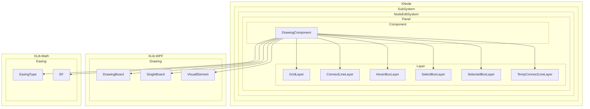
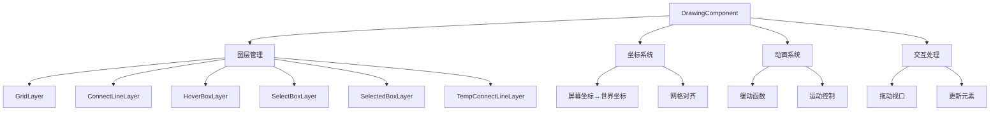
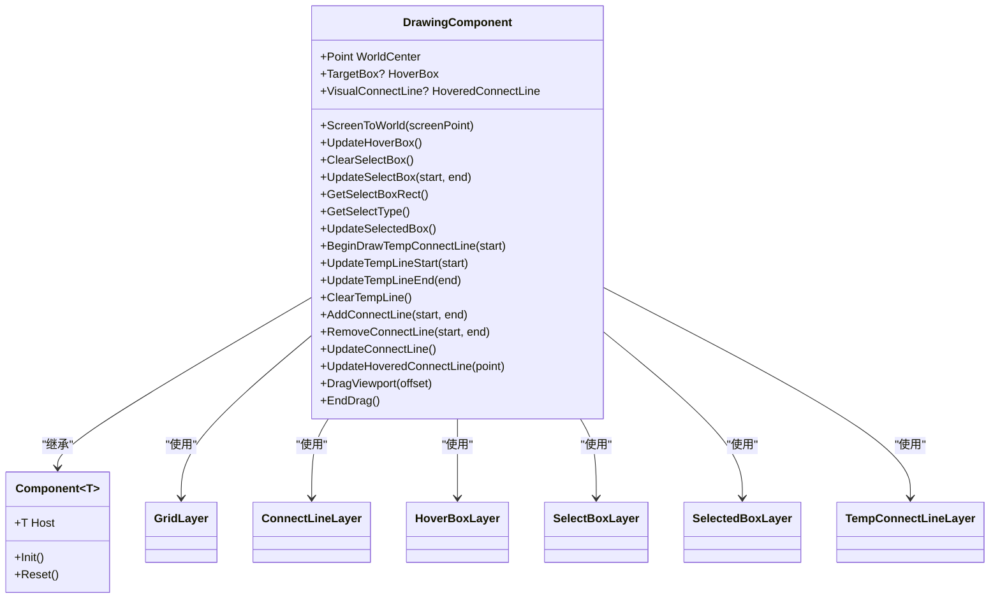
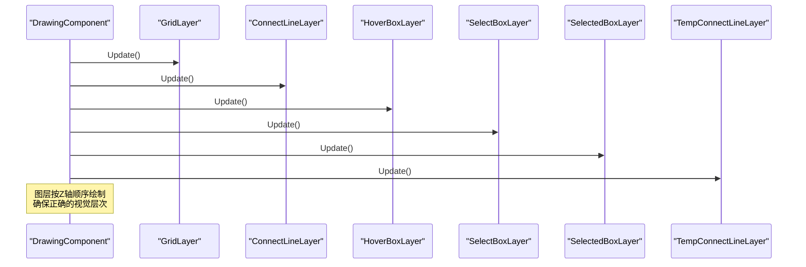
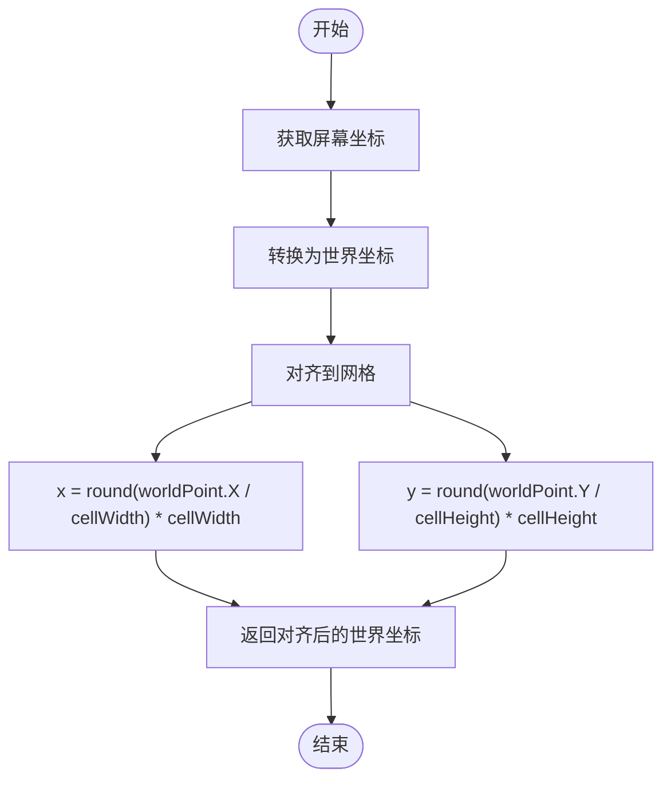
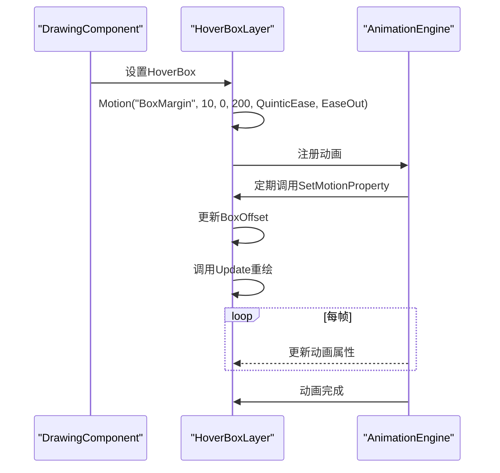
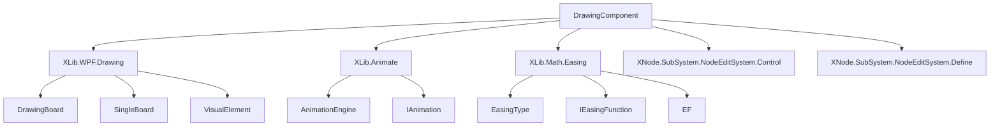

# DrawingComponent 渲染与图层

<cite>
**本文档引用文件**   
- [DrawingComponent.cs](file://XNode/SubSystem/NodeEditSystem/Panel/Component/DrawingComponent.cs)
- [GridLayer.cs](file://XNode/SubSystem/NodeEditSystem/Panel/Layer/GridLayer.cs)
- [ConnectLineLayer.cs](file://XNode/SubSystem/NodeEditSystem/Panel/Layer/ConnectLineLayer.cs)
- [HoverBoxLayer.cs](file://XNode/SubSystem/NodeEditSystem/Panel/Layer/HoverBoxLayer.cs)
- [SelectBoxLayer.cs](file://XNode/SubSystem/NodeEditSystem/Panel/Layer/SelectBoxLayer.cs)
- [SelectedBoxLayer.cs](file://XNode/SubSystem/NodeEditSystem/Panel/Layer/SelectedBoxLayer.cs)
- [TempConnectLineLayer.cs](file://XNode/SubSystem/NodeEditSystem/Panel/Layer/TempConnectLineLayer.cs)
- [DrawingBoard.cs](file://XLib.WPF/Drawing/DrawingBoard.cs)
- [VisualElement.cs](file://XLib.WPF/Drawing/VisualElement.cs)
- [SingleBoard.cs](file://XLib.WPF/Drawing/SingleBoard.cs)
- [EF.cs](file://XLib.Math/Easing/EF.cs)
- [EasingType.cs](file://XLib.Math/Easing/EasingType.cs)
</cite>

## 目录
1. [引言](#引言)
2. [项目结构](#项目结构)
3. [核心组件](#核心组件)
4. [架构概述](#架构概述)
5. [详细组件分析](#详细组件分析)
6. [依赖分析](#依赖分析)
7. [性能考虑](#性能考虑)
8. [故障排除指南](#故障排除指南)
9. [结论](#结论)

## 引言
DrawingComponent 是 XNode 图形编辑系统中的核心渲染组件，负责管理多个图层的绘制顺序与更新机制。该组件实现了复杂的坐标转换系统，支持缩放和平移操作，并集成了动画渲染流程和视觉反馈机制。本文档将深入分析 DrawingComponent 的设计原理和实现细节。

## 项目结构
DrawingComponent 位于 NodeEditSystem 的 Panel 组件中，与其他图层组件共同构成图形渲染子系统。它依赖于 WPF 绘图基础类库和数学计算模块。

**Diagram sources**
- [DrawingComponent.cs](file://XNode/SubSystem/NodeEditSystem/Panel/Component/DrawingComponent.cs#L1-L387)
- [GridLayer.cs](file://XNode/SubSystem/NodeEditSystem/Panel/Layer/GridLayer.cs#L1-L209)
- [ConnectLineLayer.cs](file://XNode/SubSystem/NodeEditSystem/Panel/Layer/ConnectLineLayer.cs#L1-L52)

**Section sources**
- [DrawingComponent.cs](file://XNode/SubSystem/NodeEditSystem/Panel/Component/DrawingComponent.cs#L1-L387)
- [GridLayer.cs](file://XNode/SubSystem/NodeEditSystem/Panel/Layer/GridLayer.cs#L1-L209)

## 核心组件
DrawingComponent 作为图形渲染的核心，管理着多个图层的生命周期和绘制逻辑。它通过继承 Component<EditPanel> 实现了与编辑面板的紧密集成。

**Section sources**
- [DrawingComponent.cs](file://XNode/SubSystem/NodeEditSystem/Panel/Component/DrawingComponent.cs#L1-L387)

## 架构概述
DrawingComponent 采用分层架构设计，将不同的视觉元素分配到独立的图层中进行管理。这种设计实现了关注点分离，提高了渲染效率和可维护性。

**Diagram sources**
- [DrawingComponent.cs](file://XNode/SubSystem/NodeEditSystem/Panel/Component/DrawingComponent.cs#L1-L387)
- [GridLayer.cs](file://XNode/SubSystem/NodeEditSystem/Panel/Layer/GridLayer.cs#L1-L209)

## 详细组件分析
### DrawingComponent 分析
DrawingComponent 是图形渲染系统的核心控制器，负责协调各个图层的工作。

#### 类图

**Diagram sources**
- [DrawingComponent.cs](file://XNode/SubSystem/NodeEditSystem/Panel/Component/DrawingComponent.cs#L1-L387)

**Section sources**
- [DrawingComponent.cs](file://XNode/SubSystem/NodeEditSystem/Panel/Component/DrawingComponent.cs#L1-L387)

### 图层管理分析
DrawingComponent 管理多个图层，每个图层负责特定类型的视觉元素绘制。

#### 图层绘制顺序序列图

**Diagram sources**
- [DrawingComponent.cs](file://XNode/SubSystem/NodeEditSystem/Panel/Component/DrawingComponent.cs#L1-L387)
- [GridLayer.cs](file://XNode/SubSystem/NodeEditSystem/Panel/Layer/GridLayer.cs#L1-L209)

### 坐标转换系统分析
DrawingComponent 实现了完整的坐标转换系统，支持屏幕坐标与世界坐标之间的相互转换。

#### 坐标转换流程图

**Diagram sources**
- [DrawingComponent.cs](file://XNode/SubSystem/NodeEditSystem/Panel/Component/DrawingComponent.cs#L1-L387)
- [GridLayer.cs](file://XNode/SubSystem/NodeEditSystem/Panel/Layer/GridLayer.cs#L1-L209)

### 动画渲染流程分析
DrawingComponent 集成了动画系统，实现了平滑的视觉效果。

#### 悬停框动画序列图

**Diagram sources**
- [DrawingComponent.cs](file://XNode/SubSystem/NodeEditSystem/Panel/Component/DrawingComponent.cs#L1-L387)
- [HoverBoxLayer.cs](file://XNode/SubSystem/NodeEditSystem/Panel/Layer/HoverBoxLayer.cs#L1-L42)
- [EasingType.cs](file://XLib.Math/Easing/EasingType.cs#L1-L10)

## 依赖分析
DrawingComponent 依赖于多个核心组件和库，形成了复杂的依赖关系网络。

**Diagram sources**
- [DrawingComponent.cs](file://XNode/SubSystem/NodeEditSystem/Panel/Component/DrawingComponent.cs#L1-L387)
- [go.mod](file://XNode/go.mod#L1-L10)

**Section sources**
- [DrawingComponent.cs](file://XNode/SubSystem/NodeEditSystem/Panel/Component/DrawingComponent.cs#L1-L387)
- [go.mod](file://XNode/go.mod#L1-L10)

## 性能考虑
DrawingComponent 在设计时充分考虑了性能优化，采用了多种技术来确保流畅的用户体验。

1. **分层渲染**：将不同类型的视觉元素分配到独立图层，减少不必要的重绘
2. **增量更新**：只更新发生变化的元素，而不是重绘整个场景
3. **命中测试优化**：使用 GeometryHitTestParameters 进行高效的命中检测
4. **绘图批处理**：在 OnUpdate 方法中批量执行绘图操作
5. **内存管理**：及时清理不再使用的连接线和临时元素

## 故障排除指南
### 常见问题及解决方案

| 问题现象 | 可能原因 | 解决方案 |
|---------|--------|--------|
| 网格显示异常 | 视口尺寸变化未正确处理 | 检查 OperateArea_SizeChanged 事件处理 |
| 连接线不更新 | 引脚坐标计算错误 | 验证 GetPinPoint 方法的实现 |
| 悬停动画卡顿 | 动画帧率过低 | 检查 AnimationEngine 的调度机制 |
| 选框无法正确选择节点 | 坐标转换错误 | 验证 ScreenToWorld 方法的实现 |

**Section sources**
- [DrawingComponent.cs](file://XNode/SubSystem/NodeEditSystem/Panel/Component/DrawingComponent.cs#L1-L387)
- [GridLayer.cs](file://XNode/SubSystem/NodeEditSystem/Panel/Layer/GridLayer.cs#L1-L209)

## 结论
DrawingComponent 作为 XNode 图形编辑系统的核心渲染组件，通过精心设计的分层架构和高效的坐标转换系统，实现了复杂而流畅的图形界面。其模块化的设计使得各个功能组件可以独立开发和测试，同时保持了良好的整体性能。未来可以进一步优化动画系统和渲染性能，以支持更大规模的图形场景。