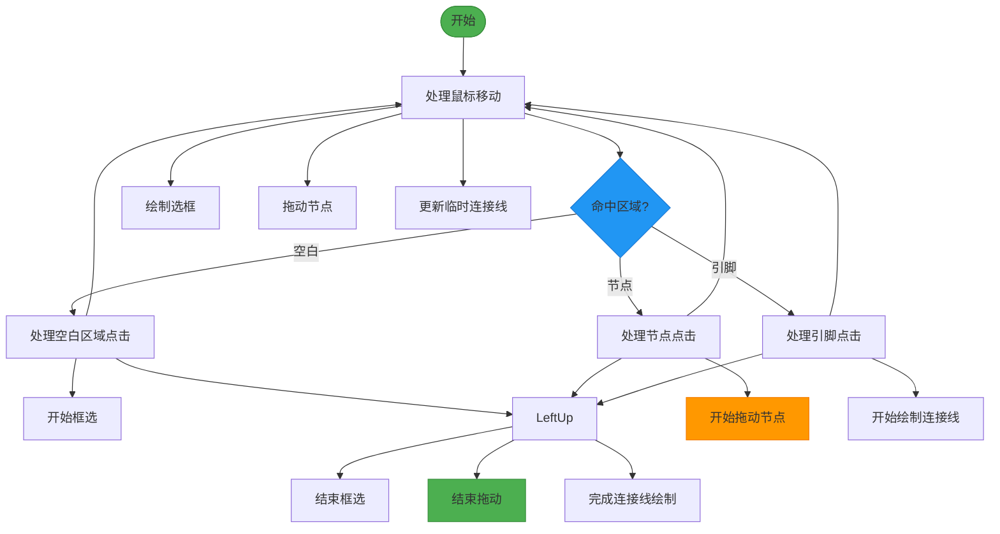
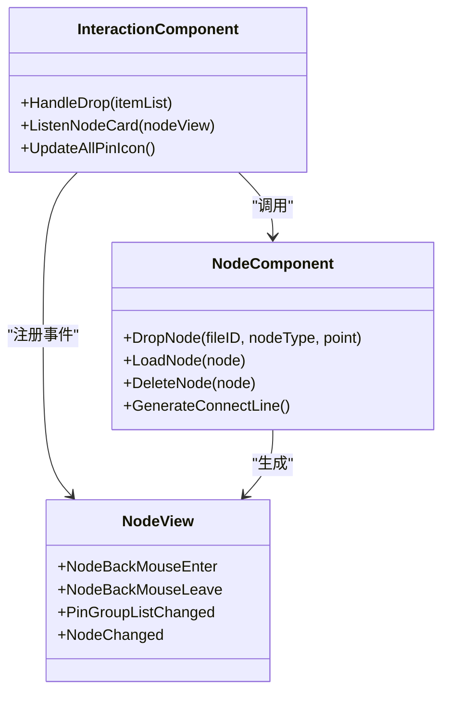
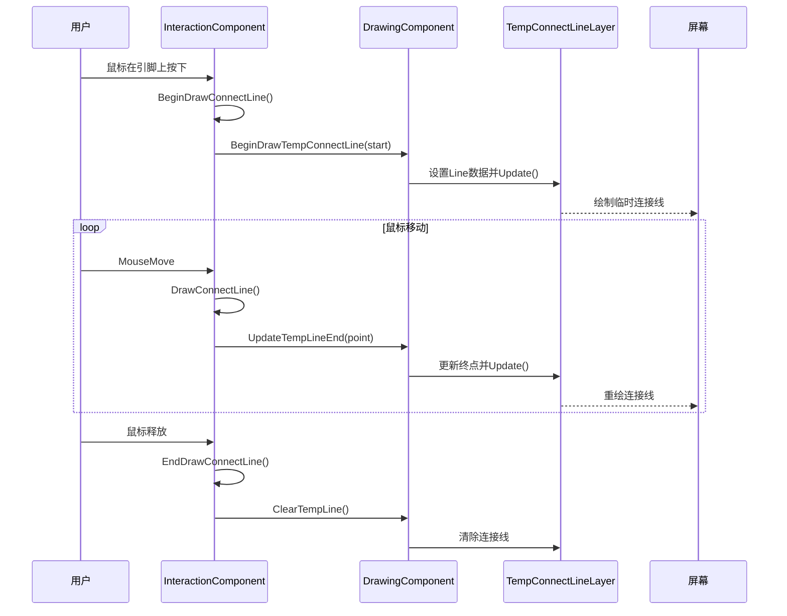
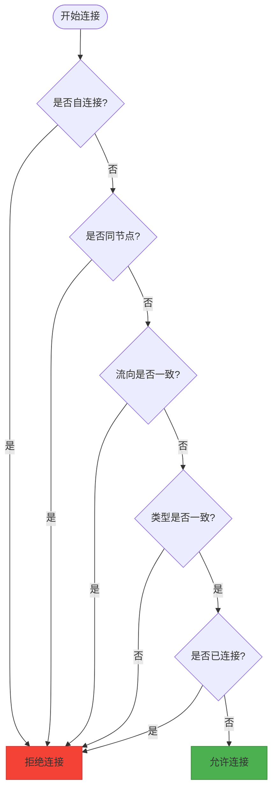

# InteractionComponent 交互控制

<cite>
**本文档引用的文件**
- [InteractionComponent.cs](file://XNode/SubSystem/NodeEditSystem/Panel/Component/InteractionComponent.cs)
- [SelectTool.cs](file://XNode/SubSystem/NodeEditSystem/Panel/SelectTool.cs)
- [DrawingComponent.cs](file://XNode/SubSystem/NodeEditSystem/Panel/Component/DrawingComponent.cs)
- [TempConnectLineLayer.cs](file://XNode/SubSystem/NodeEditSystem/Panel/Layer/TempConnectLineLayer.cs)
- [NodeComponent.cs](file://XNode/SubSystem/NodeEditSystem/Panel/Component/NodeComponent.cs)
- [EnumDefine.cs](file://XNode/SubSystem/NodeEditSystem/Define/EnumDefine.cs)
- [PinBase.cs](file://XLib.Node/PinBase.cs)
</cite>

## 目录
1. [引言](#引言)
2. [核心交互机制](#核心交互机制)
3. [状态机设计与事件处理流程](#状态机设计与事件处理流程)
4. [组件协作关系](#组件协作关系)
5. [临时图层与连接线预览](#临时图层与连接线预览)
6. [异常处理与边界情况](#异常处理与边界情况)
7. [结论](#结论)

## 引言
InteractionComponent 是 XNode 编辑器中的用户交互中枢，负责处理所有鼠标和键盘事件，并将其转换为高层语义操作。该组件通过与 SelectTool、DrawingComponent 和 NodeComponent 等核心模块的紧密协作，实现了节点拖拽、连接线绘制、框选操作等关键功能。本文将深入解析其内部实现机制，重点阐述事件处理流程、状态机设计以及组件间协作模式。

## 核心交互机制

InteractionComponent 作为交互控制中心，通过注册鼠标事件监听器来捕获用户的操作行为。在 `Enable` 方法中，它订阅了 `MouseMove`、`MouseDown` 和 `MouseUp` 事件，将原始输入事件转发给 SelectTool 进行状态机处理。

该组件能够识别多种用户操作语义：
- **节点拖拽**：当用户在已选中节点上按下鼠标左键并移动时，触发节点位置调整
- **连接线绘制**：当用户在引脚上点击并拖动时，启动连接线创建流程
- **框选操作**：在空白区域按下鼠标左键并拖动，可进行多节点选择
- **视口拖动**：使用鼠标中键拖动可平移整个编辑视图

这些操作语义的识别依赖于 `GetHitedArea` 方法，该方法根据当前鼠标位置判断其命中区域（空白、节点、引脚或连接线），为后续操作提供上下文信息。

**Section sources**
- [InteractionComponent.cs](file://XNode/SubSystem/NodeEditSystem/Panel/Component/InteractionComponent.cs#L48-L58)
- [InteractionComponent.cs](file://XNode/SubSystem/NodeEditSystem/Panel/Component/InteractionComponent.cs#L523-L532)

## 状态机设计与事件处理流程

### 状态机架构
SelectTool 实现了基于行为树（Behavior Tree）的状态机设计，通过 `NewTree` 和 `NewNode` 方法构建状态转换逻辑。每个交互场景（如"命中节点"、"命中引脚"）都对应一个独立的状态树，确保不同操作模式之间的隔离性。

**Diagram sources**
- [SelectTool.cs](file://XNode/SubSystem/NodeEditSystem/Panel/SelectTool.cs#L121-L163)
- [SelectTool.cs](file://XNode/SubSystem/NodeEditSystem/Panel/SelectTool.cs#L160-L206)

### 核心方法流程

#### HandleDrag 与 HandleDrop
`BeginDragNode` 方法启动节点拖拽流程，首先设置光标样式为移动状态，并记录鼠标按下时的初始坐标。在 `DragNode` 方法中，系统会：
1. 计算鼠标当前位置与初始位置的偏移量
2. 将偏移量对齐到10像素的网格单位
3. 更新所有选中节点的显示位置
4. 同步更新选中框和连接线的视觉表现

`EndDragNode` 方法最终将临时偏移应用到节点的实际坐标上，完成拖拽操作。

#### StartConnect 与连接线绘制
`BeginDrawConnectLine` 方法启动连接线绘制流程：
1. 记录起始引脚（_startPin）
2. 获取鼠标与引脚的相对偏移
3. 计算引脚连接点的世界坐标
4. 通知 DrawingComponent 开始绘制临时连接线

`DrawConnectLine` 方法持续更新临时连接线的终点位置，当鼠标悬停在目标引脚上时，会自动吸附到引脚的连接点。

**Section sources**
- [InteractionComponent.cs](file://XNode/SubSystem/NodeEditSystem/Panel/Component/InteractionComponent.cs#L323-L361)
- [InteractionComponent.cs](file://XNode/SubSystem/NodeEditSystem/Panel/Component/InteractionComponent.cs#L363-L406)

## 组件协作关系

InteractionComponent 与多个核心组件保持紧密协作，形成完整的交互闭环。

### 与 NodeComponent 的协作
NodeComponent 负责管理节点实例的生命周期。当用户通过拖放操作添加新节点时，InteractionComponent 的 `HandleDrop` 方法会调用 NodeComponent 的 `DropNode` 方法创建节点实例，并建立事件监听关系。这种设计实现了交互逻辑与业务逻辑的分离。

**Diagram sources**
- [InteractionComponent.cs](file://XNode/SubSystem/NodeEditSystem/Panel/Component/InteractionComponent.cs#L140-L174)
- [NodeComponent.cs](file://XNode/SubSystem/NodeEditSystem/Panel/Component/NodeComponent.cs#L40-L75)

### 与 DrawingComponent 的协作
DrawingComponent 作为视觉呈现层，负责所有图形元素的绘制。InteractionComponent 通过调用其方法来更新各种视觉状态：
- 节点拖拽时调用 `UpdateSelectedBox` 和 `UpdateConnectLine`
- 框选操作时调用 `UpdateSelectBox`
- 连接线绘制时调用 `BeginDrawTempConnectLine` 等系列方法

这种职责分离的设计使得交互逻辑与渲染逻辑相互独立，提高了代码的可维护性。

**Section sources**
- [InteractionComponent.cs](file://XNode/SubSystem/NodeEditSystem/Panel/Component/InteractionComponent.cs#L323-L361)
- [DrawingComponent.cs](file://XNode/SubSystem/NodeEditSystem/Panel/Component/DrawingComponent.cs#L100-L120)

## 临时图层与连接线预览

### TempConnectLineLayer 实现
TempConnectLineLayer 专门负责临时连接线的绘制，实现了流畅的贝塞尔曲线预览效果。其 `OnUpdate` 方法根据当前的起始点和终点坐标动态生成路径几何。

关键实现细节：
- 使用 `PathGeometry` 和 `BezierSegment` 创建平滑曲线
- 控制线长度动态计算，确保曲线在短距离时不会过度弯曲
- 最小控制线长度限制为40像素，保证视觉质量

**Diagram sources**
- [InteractionComponent.cs](file://XNode/SubSystem/NodeEditSystem/Panel/Component/InteractionComponent.cs#L363-L406)
- [DrawingComponent.cs](file://XNode/SubSystem/NodeEditSystem/Panel/Component/DrawingComponent.cs#L140-L170)
- [TempConnectLineLayer.cs](file://XNode/SubSystem/NodeEditSystem/Panel/Layer/TempConnectLineLayer.cs#L15-L45)

## 异常处理与边界情况

InteractionComponent 在设计时充分考虑了各种异常情况和边界条件，确保系统的健壮性。

### 连接线合法性验证
`CanConnect` 方法实现了严格的连接规则验证：
- 禁止自连接（不能连接同一引脚）
- 禁止同节点连接（不能连接同一节点下的引脚）
- 流向必须相反（输入引脚只能连接输出引脚）
- 类型必须一致（执行引脚只能连接执行引脚）
- 不能重复连接（已存在的连接不能再次创建）

**Diagram sources**
- [InteractionComponent.cs](file://XNode/SubSystem/NodeEditSystem/Panel/Component/InteractionComponent.cs#L475-L485)

### 边界情况处理
- **数据引脚特殊处理**：数据引脚采用"单源多目标"模式，当新连接建立时会自动断开原有连接
- **鼠标捕获管理**：使用 `CaptureOperationLayer` 和 `ReleaseOperationLayer` 确保鼠标事件的正确捕获与释放
- **状态重置机制**：在 `ResetComponent` 方法中清理所有临时状态，防止状态污染
- **空值保护**：所有方法调用前都进行空值检查，避免空引用异常

**Section sources**
- [InteractionComponent.cs](file://XNode/SubSystem/NodeEditSystem/Panel/Component/InteractionComponent.cs#L475-L485)
- [InteractionComponent.cs](file://XNode/SubSystem/NodeEditSystem/Panel/Component/InteractionComponent.cs#L534-L570)

## 结论
InteractionComponent 通过精巧的状态机设计和清晰的组件协作，实现了复杂而直观的用户交互体验。其核心价值体现在：
1. **职责分离**：将事件处理、状态管理、视觉呈现分离到不同组件
2. **扩展性**：基于行为树的状态机易于添加新的交互模式
3. **健壮性**：完善的异常处理机制确保系统稳定性
4. **用户体验**：平滑的动画效果和智能的吸附机制提升操作效率

该组件的设计模式为类似可视化编程编辑器的开发提供了有价值的参考范例。