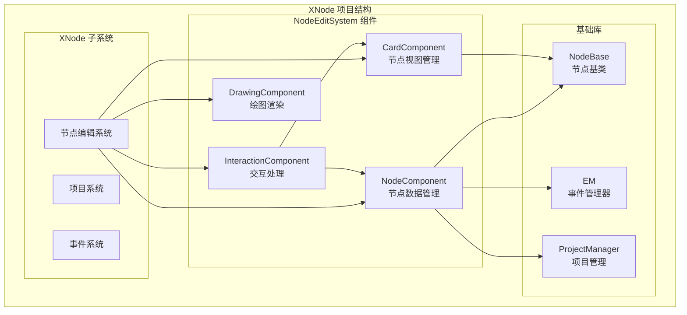
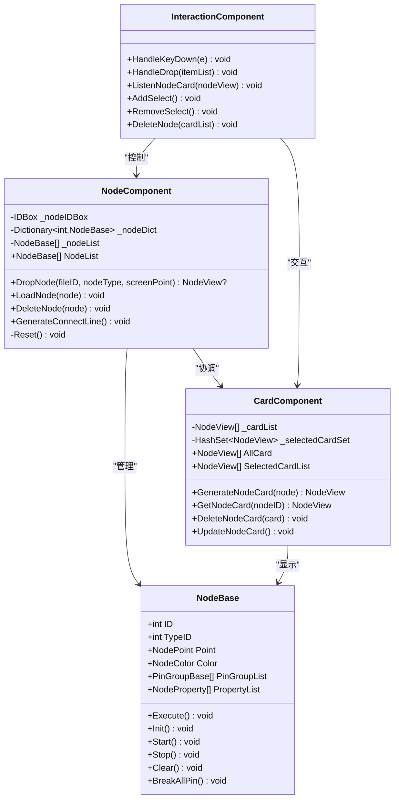
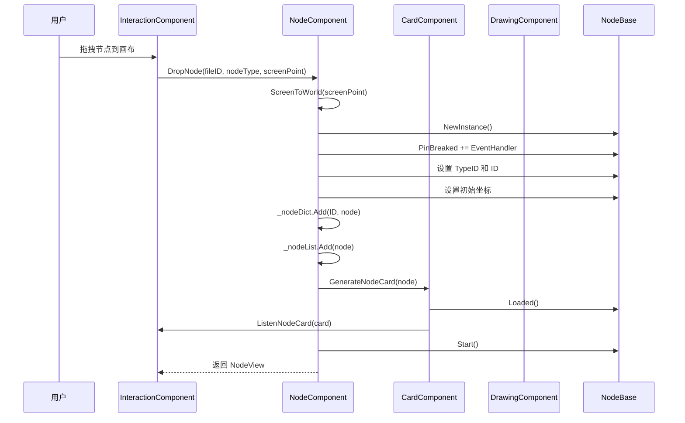
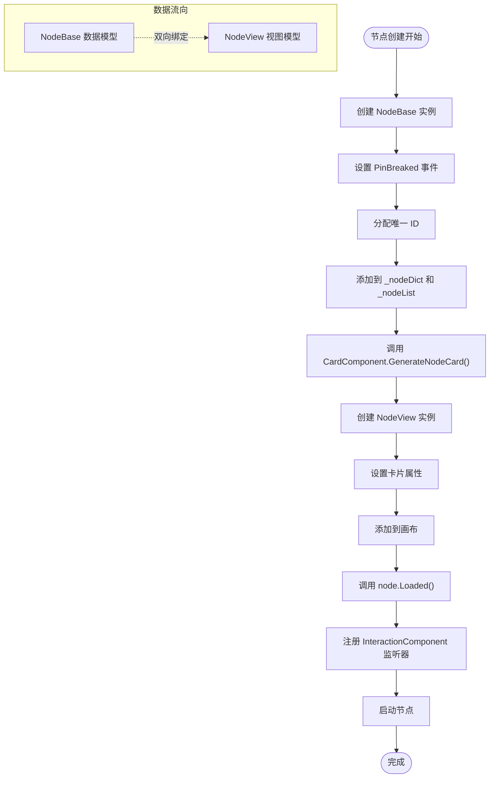
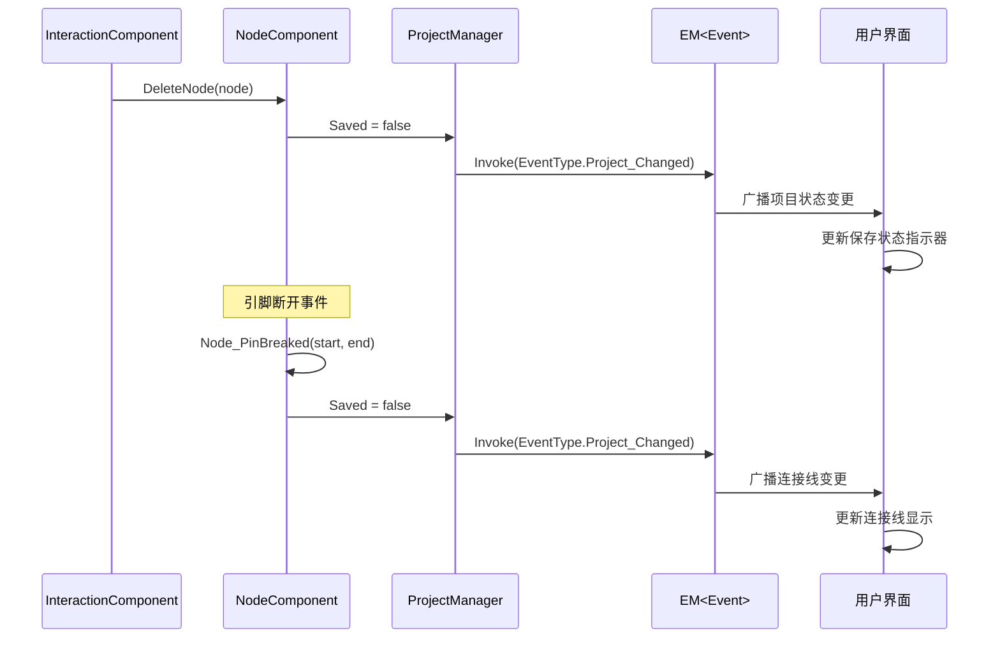

# NodeComponent 数据管理

<cite>
**本文档中引用的文件**
- [NodeComponent.cs](file://XNode/SubSystem/NodeEditSystem/Panel/Component/NodeComponent.cs)
- [CardComponent.cs](file://XNode/SubSystem/NodeEditSystem/Panel/Component/CardComponent.cs)
- [InteractionComponent.cs](file://XNode/SubSystem/NodeEditSystem/Panel/Component/InteractionComponent.cs)
- [NodeBase.cs](file://XLib.Node/NodeBase.cs)
- [EM.cs](file://XLib.Base/EM.cs)
- [ProjectManager.cs](file://XNode/SubSystem/ProjectSystem/ProjectManager.cs)
</cite>

## 目录
1. [简介](#简介)
2. [项目结构概览](#项目结构概览)
3. [NodeComponent 核心职责](#nodecomponent-核心职责)
4. [架构概览](#架构概览)
5. [详细组件分析](#详细组件分析)
6. [数据同步机制](#数据同步机制)
7. [事件系统集成](#事件系统集成)
8. [性能优化考虑](#性能优化考虑)
9. [故障排除指南](#故障排除指南)
10. [结论](#结论)

## 简介

NodeComponent 是 XNode 节点编辑系统的核心数据管理组件，负责维护所有 NodeBase 实例的完整生命周期。该组件不仅管理节点的创建、删除和查找操作，还通过与 CardComponent 的紧密协作确保数据的一致性，并通过 EM 事件系统实现状态变更的广播机制。

NodeComponent 采用单例模式设计，通过 IDBox 管理节点编号分配，使用 Dictionary 和 List 双重数据结构确保高效的节点查询和遍历性能。它与 ProjectManager 协作确保数据一致性，并支持大规模节点场景下的内存管理和性能优化。

## 项目结构概览

NodeComponent 位于 XNode 项目的层次化架构中，作为节点编辑系统的核心组件：



**图表来源**
- [NodeComponent.cs](file://XNode/SubSystem/NodeEditSystem/Panel/Component/NodeComponent.cs#L11-L123)
- [CardComponent.cs](file://XNode/SubSystem/NodeEditSystem/Panel/Component/CardComponent.cs#L12-L133)
- [InteractionComponent.cs](file://XNode/SubSystem/NodeEditSystem/Panel/Component/InteractionComponent.cs#L18-L755)

## NodeComponent 核心职责

NodeComponent 作为节点编辑系统的核心数据管理器，承担以下关键职责：

### 生命周期管理
- **节点创建**：通过 DropNode 方法创建新的 NodeBase 实例
- **节点加载**：通过 LoadNode 方法加载已存在的节点
- **节点删除**：通过 DeleteNode 方法安全地清理节点资源
- **节点查询**：提供高效的节点查找和访问接口

### 编号管理
- 使用 IDBox 管理节点唯一标识符
- 自动分配和回收节点 ID
- 确保节点 ID 的唯一性和连续性

### 数据同步
- 与 CardComponent 协同维护节点视图
- 确保数据模型与视图模型的一致性
- 处理节点状态变更的同步更新

**章节来源**
- [NodeComponent.cs](file://XNode/SubSystem/NodeEditSystem/Panel/Component/NodeComponent.cs#L11-L123)

## 架构概览

NodeComponent 采用分层架构设计，通过组件化的方式实现职责分离：



**图表来源**
- [NodeComponent.cs](file://XNode/SubSystem/NodeEditSystem/Panel/Component/NodeComponent.cs#L11-L123)
- [NodeBase.cs](file://XLib.Node/NodeBase.cs#L7-L417)
- [CardComponent.cs](file://XNode/SubSystem/NodeEditSystem/Panel/Component/CardComponent.cs#L12-L133)
- [InteractionComponent.cs](file://XNode/SubSystem/NodeEditSystem/Panel/Component/InteractionComponent.cs#L18-L755)

## 详细组件分析

### NodeComponent 核心实现

NodeComponent 通过双重数据结构确保高效的节点管理：

```csharp
// 节点字典：O(1) 时间复杂度的快速查找
private readonly Dictionary<int, NodeBase> _nodeDict = new Dictionary<int, NodeBase>();

// 节点列表：保持插入顺序，支持遍历操作
private List<NodeBase> _nodeList = new List<NodeBase>();

// 节点编号箱：管理节点唯一标识符
private readonly IDBox _nodeIDBox = new IDBox();
```

#### DropNode 方法详解

DropNode 方法是 NodeComponent 的核心入口，负责创建新节点并建立完整的生命周期：



**图表来源**
- [NodeComponent.cs](file://XNode/SubSystem/NodeEditSystem/Panel/Component/NodeComponent.cs#L28-L47)
- [InteractionComponent.cs](file://XNode/SubSystem/NodeEditSystem/Panel/Component/InteractionComponent.cs#L100-L120)

#### DeleteNode 方法实现

DeleteNode 方法确保节点的完整清理过程：

```csharp
public void DeleteNode(NodeBase node)
{
    // 清理节点状态
    node.Clear();
    // 断开所有引脚连接
    node.BreakAllPin();
    // 移除事件订阅
    node.PinBreaked -= Node_PinBreaked;
    // 回收节点ID
    _nodeIDBox.RecycleID(node.ID);
    // 从数据结构中移除
    _nodeDict.Remove(node.ID);
    _nodeList.Remove(node);
}
```

**章节来源**
- [NodeComponent.cs](file://XNode/SubSystem/NodeEditSystem/Panel/Component/NodeComponent.cs#L28-L85)

### NodeBase 生命周期管理

NodeBase 定义了完整的节点生命周期规范：

```mermaid
stateDiagram-v2
[*] --> Created : NewInstance()
Created --> Initialized : Init()
Initialized --> Loaded : Loaded()
Loaded --> Enabled : Start()
Enabled --> Disabled : Stop()
Disabled --> Enabled : Start()
Enabled --> Unloaded : Unloaded()
Disabled --> Unloaded : Unloaded()
Unloaded --> [*] : Clear()
note right of Created : 分配ID和基本属性
note right of Initialized : 设置引脚组和属性
note right of Loaded : 添加到UI显示
note right of Enabled : 开始执行流程
note right of Disabled : 停止执行但保留状态
note right of Unloaded : 从UI移除但保留数据
note right of Clear : 彻底清理所有资源
```

**图表来源**
- [NodeBase.cs](file://XLib.Node/NodeBase.cs#L7-L417)

## 数据同步机制

NodeComponent 与 CardComponent 之间建立了紧密的数据同步机制：

### 双向绑定关系



**图表来源**
- [NodeComponent.cs](file://XNode/SubSystem/NodeEditSystem/Panel/Component/NodeComponent.cs#L28-L47)
- [CardComponent.cs](file://XNode/SubSystem/NodeEditSystem/Panel/Component/CardComponent.cs#L32-L50)

### 同步保证机制

CardComponent 确保数据模型与视图模型的一致性：

```csharp
public NodeView GenerateNodeCard(NodeBase node)
{
    // 创建节点卡片
    NodeView card = new NodeView
    {
        NodeColor = Color.FromRgb(node.Color.r, node.Color.g, node.Color.b),
        NodeInstance = node,
        Point = new Point(node.Point.X, node.Point.Y),
    };
    
    // 设置卡片坐标
    Point center = GetComponent<DrawingComponent>().WorldCenter;
    Canvas.SetLeft(card, center.X + node.Point.X - 12);
    Canvas.SetTop(card, center.Y + node.Point.Y - 1);
    
    // 初始化节点卡片
    card.Init();
    // 添加视图
    _host.LayerBox_Node.Children.Add(card);
    _cardList.Add(card);
    
    // 调用已加载
    node.Loaded();
    
    return card;
}
```

**章节来源**
- [CardComponent.cs](file://XNode/SubSystem/NodeEditSystem/Panel/Component/CardComponent.cs#L32-L50)

## 事件系统集成

NodeComponent 通过 EM 事件系统实现状态变更的广播机制：

### 事件传播流程



**图表来源**
- [NodeComponent.cs](file://XNode/SubSystem/NodeEditSystem/Panel/Component/NodeComponent.cs#L87-L89)
- [ProjectManager.cs](file://XNode/SubSystem/ProjectSystem/ProjectManager.cs#L25-L30)

### EM 事件管理器

EM 类提供了泛型事件管理功能：

```csharp
public class EM<T> : IManager where T : Enum
{
    // 添加监听器
    public void Add<T1>(T eventType, Action<T1> listener)
    {
        if (_inited)
            _listenerDict[eventType].Add(listener);
    }
    
    // 引发事件
    protected void InnerInvoke<T1>(T eventType, T1 value1)
    {
        if (_inited)
            foreach (var item in _listenerDict[eventType])
                if (item is Action<T1> listener) listener?.Invoke(value1);
    }
}
```

**章节来源**
- [EM.cs](file://XLib.Base/EM.cs#L1-L142)

## 性能优化考虑

### 数据结构优化

NodeComponent 采用双重数据结构确保最佳性能：

1. **Dictionary + List 双重结构**
   - Dictionary 提供 O(1) 的节点查找性能
   - List 保持插入顺序，支持高效的遍历操作
   - 两种结构相互补充，满足不同场景需求

2. **IDBox 编号管理**
   - 自动分配和回收节点 ID
   - 确保 ID 的唯一性和连续性
   - 减少内存碎片和 ID 浪费

### 大规模节点场景优化

对于大规模节点场景，NodeComponent 实现了以下优化策略：

1. **延迟加载机制**
   - 节点仅在需要时才完全初始化
   - 避免一次性加载过多节点造成性能瓶颈

2. **批量操作支持**
   - 支持批量删除和批量更新操作
   - 减少事件触发频率和 UI 更新次数

3. **内存管理**
   - 及时清理不再使用的节点资源
   - 使用弱引用避免内存泄漏

### 连接线生成优化

GenerateConnectLine 方法实现了高效的连接线生成：

```csharp
public void GenerateConnectLine()
{
    // 遍历节点
    foreach (var node in _nodeList)
    {
        // 遍历全部引脚
        foreach (var pin in node.GetAllPin())
        {
            // 忽略输入引脚与空输出引脚
            if (pin.Flow == PinFlow.Input || pin.TargetList.Count == 0) continue;
            
            // 添加连接线
            foreach (var target in pin.TargetList)
                GetComponent<DrawingComponent>().AddConnectLine(pin, target);
        }
    }
}
```

**章节来源**
- [NodeComponent.cs](file://XNode/SubSystem/NodeEditSystem/Panel/Component/NodeComponent.cs#L69-L85)

## 故障排除指南

### 常见问题及解决方案

#### 1. 节点创建失败
**症状**：DropNode 方法返回 null 或抛出异常
**可能原因**：
- NodeType 参数无效
- 屏幕坐标转换错误
- 内存不足

**解决方案**：
```csharp
// 检查 NodeType 是否有效
if (nodeType == null) throw new ArgumentNullException("NodeType不能为空");

// 验证屏幕坐标
var worldPoint = GetComponent<DrawingComponent>().ScreenToWorld(screenPoint);
if (double.IsNaN(worldPoint.X) || double.IsNaN(worldPoint.Y))
    throw new ArgumentException("无效的屏幕坐标");
```

#### 2. 节点删除不彻底
**症状**：节点被删除但仍然存在于 _nodeDict 中
**可能原因**：
- 事件订阅未正确移除
- ID 回收失败
- 引脚断开不完整

**解决方案**：
```csharp
// 确保所有清理步骤都执行
public void DeleteNode(NodeBase node)
{
    try
    {
        node.Clear();           // 清理节点状态
        node.BreakAllPin();     // 断开所有引脚
        node.PinBreaked -= Node_PinBreaked; // 移除事件订阅
        _nodeIDBox.RecycleID(node.ID);      // 回收ID
        _nodeDict.Remove(node.ID);          // 从字典移除
        _nodeList.Remove(node);             // 从列表移除
    }
    catch (Exception ex)
    {
        // 记录错误日志
        Logger.Error($"删除节点失败: {ex.Message}");
    }
}
```

#### 3. 数据同步问题
**症状**：NodeBase 数据与 NodeView 视图不一致
**可能原因**：
- 事件处理程序未正确注册
- 更新时机不正确
- 异步操作冲突

**解决方案**：
```csharp
// 确保正确的更新顺序
public void UpdateNodeCard()
{
    Point center = GetComponent<DrawingComponent>().WorldCenter;
    foreach (var card in _cardList)
    {
        // 先更新数据模型
        card.NodeInstance.Point = new NodePoint(
            (int)(card.Point.X - center.X + 12),
            (int)(card.Point.Y - center.Y + 1)
        );
        
        // 再更新视图
        Canvas.SetLeft(card, center.X + card.Point.X - 12);
        Canvas.SetTop(card, center.Y + card.Point.Y - 1);
    }
}
```

**章节来源**
- [NodeComponent.cs](file://XNode/SubSystem/NodeEditSystem/Panel/Component/NodeComponent.cs#L58-L75)
- [CardComponent.cs](file://XNode/SubSystem/NodeEditSystem/Panel/Component/CardComponent.cs#L60-L75)

## 结论

NodeComponent 作为 XNode 节点编辑系统的核心数据管理组件，通过精心设计的架构和算法实现了高效、可靠的数据管理功能。其主要优势包括：

1. **完整的生命周期管理**：从节点创建到销毁的全过程管理
2. **高效的数据结构**：Dictionary + List 双重结构确保最佳性能
3. **可靠的同步机制**：与 CardComponent 的紧密协作确保数据一致性
4. **灵活的事件系统**：通过 EM 事件系统实现状态变更的广播
5. **良好的扩展性**：模块化设计便于功能扩展和维护

在实际应用中，NodeComponent 能够很好地支持大规模节点场景，通过合理的性能优化策略确保系统在高负载情况下的稳定性。同时，完善的错误处理和故障排除机制为系统的可靠性提供了有力保障。

未来可以考虑进一步优化的方向包括：
- 实现更智能的节点缓存机制
- 增强批量操作的性能
- 改进内存使用效率
- 添加更多监控和诊断功能