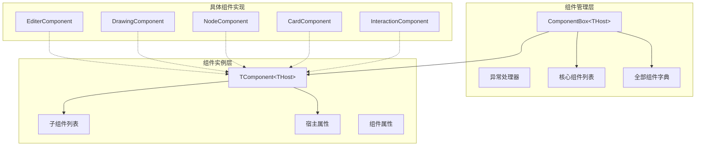
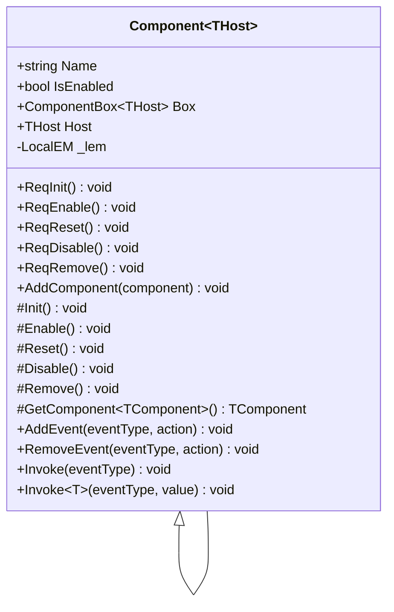
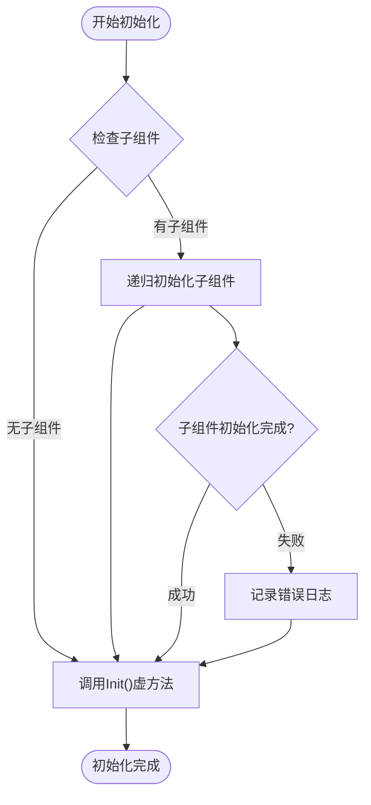
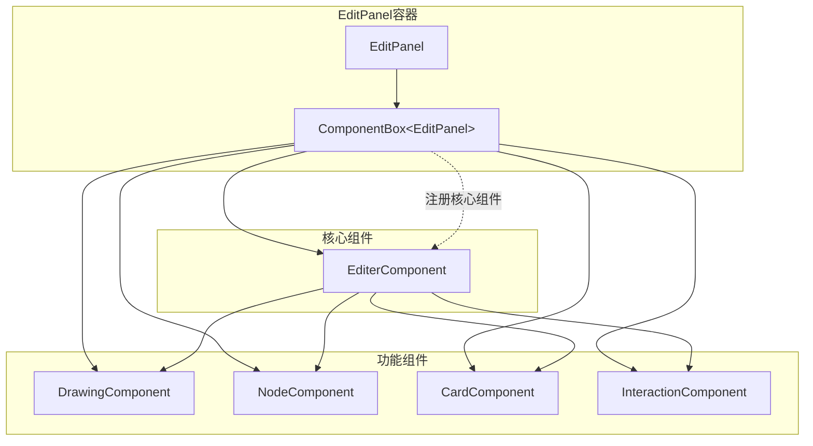
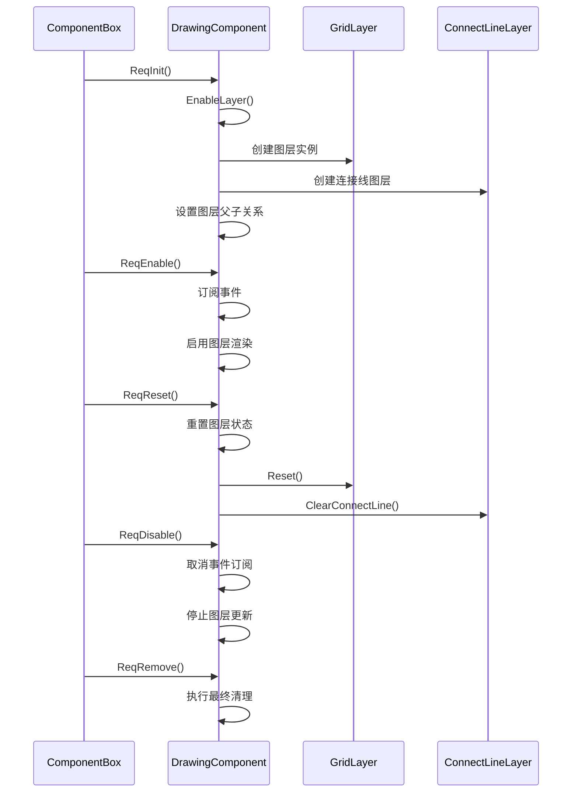

# 组件生命周期管理

<cite>
**本文档中引用的文件**
- [TComponent.cs](file://XLib.Base/UIComponent/TComponent.cs)
- [TComponentBox.cs](file://XLib.Base/UIComponent/TComponentBox.cs)
- [EditPanel.xaml.cs](file://XNode/SubSystem/NodeEditSystem/Panel/EditPanel.xaml.cs)
- [EditerComponent.cs](file://XNode/SubSystem/NodeEditSystem/Panel/Component/EditerComponent.cs)
- [DrawingComponent.cs](file://XNode/SubSystem/NodeEditSystem/Panel/Component/DrawingComponent.cs)
- [NodeComponent.cs](file://XNode/SubSystem/NodeEditSystem/Panel/Component/NodeComponent.cs)
- [CardComponent.cs](file://XNode/SubSystem/NodeEditSystem/Panel/Component/CardComponent.cs)
- [GridLayer.cs](file://XNode/SubSystem/NodeEditSystem/Panel/Layer/GridLayer.cs)
</cite>

## 目录
1. [简介](#简介)
2. [核心架构概览](#核心架构概览)
3. [TComponent基础组件](#tcomponent基础组件)
4. [ComponentBox组件管理器](#componentbox组件管理器)
5. [生命周期方法详解](#生命周期方法详解)
6. [组件注册与依赖关系](#组件注册与依赖关系)
7. [实际应用案例](#实际应用案例)
8. [设计模式优势](#设计模式优势)
9. [最佳实践指南](#最佳实践指南)
10. [总结](#总结)

## 简介

XNode项目中的组件生命周期管理系统是一个精心设计的框架，通过TComponent和TComponentBox两个核心类实现了松耦合的模块化架构。该系统采用声明式生命周期管理模式，通过统一的接口规范确保组件状态的一致性和可预测性。

该框架的核心设计理念是将复杂的用户界面功能分解为独立的、可复用的组件单元，每个组件都遵循标准化的生命周期管理流程。这种设计不仅提高了代码的可维护性和可测试性，还为开发者提供了清晰的扩展路径。

## 核心架构概览

组件生命周期管理系统由两个主要组件构成：TComponent基础组件类和ComponentBox组件管理器。这两个组件形成了一个层次化的架构体系，其中ComponentBox负责全局的组件协调和生命周期管理，而TComponent则定义了单个组件的行为规范。



**图表来源**
- [TComponentBox.cs](file://XLib.Base/UIComponent/TComponentBox.cs#L1-L155)
- [TComponent.cs](file://XLib.Base/UIComponent/TComponent.cs#L1-L168)

## TComponent基础组件

TComponent是整个生命周期管理系统的基础，它定义了组件的基本行为和生命周期方法。该类采用了模板设计模式，支持泛型约束以确保类型安全。

### 基本属性结构

TComponent类提供了四个核心属性：

- **Box**: 组件所属的组件箱实例，用于访问其他组件和管理器
- **Host**: 组件的宿主对象，通常是包含该组件的父容器
- **Name**: 组件的标识名称，默认为"未命名组件"
- **IsEnabled**: 组件的启用状态标志

### 生命周期方法架构

TComponent定义了五个关键的生命周期方法，每个方法都有对应的请求方法：



**图表来源**
- [TComponent.cs](file://XLib.Base/UIComponent/TComponent.cs#L1-L168)

### 子组件管理机制

TComponent支持树形结构的子组件管理，通过`_subComponentList`字段维护子组件的层次关系。这种设计允许组件之间形成复杂的依赖关系，同时保持清晰的职责分离。

**章节来源**
- [TComponent.cs](file://XLib.Base/UIComponent/TComponent.cs#L1-L168)

## ComponentBox组件管理器

ComponentBox是组件生命周期管理的核心控制器，它负责组件的注册、初始化、启用、重置和清理等全生命周期管理。

### 组件注册机制

ComponentBox采用双重注册策略：核心组件注册和普通组件注册。核心组件是指那些需要参与生命周期管理的关键组件，而非核心组件则可以独立管理自己的生命周期。

```mermaid
sequenceDiagram
participant EP as EditPanel
participant CB as ComponentBox
participant EC as EditerComponent
participant DC as DrawingComponent
participant NC as NodeComponent
EP->>CB : AddComponent&lt;EditerComponent&gt;()
CB->>EC : 创建实例
CB->>EC : 设置Box和Host属性
CB->>EP : 返回组件实例
EP->>CB : AddComponent&lt;DrawingComponent&gt;()
CB->>DC : 创建实例
CB->>DC : 设置Box和Host属性
EP->>CB : RegisterCoreComponent(EC)
CB->>CB : 添加到核心组件列表
EP->>EC : AddComponent(DC)
EP->>EC : AddComponent(NC)
EP->>CB : Init()
CB->>EC : ReqInit()
CB->>DC : ReqInit()
CB->>NC : ReqInit()
```

**图表来源**
- [EditPanel.xaml.cs](file://XNode/SubSystem/NodeEditSystem/Panel/EditPanel.xaml.cs#L30-L50)
- [TComponentBox.cs](file://XLib.Base/UIComponent/TComponentBox.cs#L15-L35)

### 异常处理机制

ComponentBox提供了完善的异常处理机制，通过`ExceptionHandler`属性允许外部设置自定义的异常处理逻辑。这种设计确保了即使某个组件初始化失败，整个系统仍然能够继续运行。

### 组件字典管理

ComponentBox内部维护两个重要的数据结构：
- `_allComponentDict`: 存储所有已注册组件的字典，按类型索引
- `_coreComponentList`: 存储需要参与生命周期管理的核心组件列表

**章节来源**
- [TComponentBox.cs](file://XLib.Base/UIComponent/TComponentBox.cs#L1-L155)

## 生命周期方法详解

组件生命周期管理遵循严格的顺序和规则，确保系统状态的一致性和可预测性。

### 初始化阶段（Init）

初始化是组件生命周期的第一个阶段，主要用于设置组件的基本配置和资源分配。Init方法只被调用一次，且在组件首次启用之前完成。



**图表来源**
- [TComponent.cs](file://XLib.Base/UIComponent/TComponent.cs#L30-L35)

### 启用阶段（Enable）

启用阶段激活组件的功能，使其能够响应用户的操作和系统事件。启用操作具有幂等性，即多次调用不会产生副作用。

### 重置阶段（Reset）

重置操作将组件恢复到启用后的初始状态，但不改变其启用状态。这在需要清除临时数据或恢复默认配置时非常有用。

### 禁用阶段（Disable）

禁用阶段停止组件的所有功能，释放相关资源。与启用类似，禁用操作也具有幂等性。

### 移除阶段（Remove）

移除是组件生命周期的最后一个阶段，用于执行最终的清理工作。这个阶段会递归地移除所有子组件，确保完全的资源释放。

**章节来源**
- [TComponent.cs](file://XLib.Base/UIComponent/TComponent.cs#L37-L75)

## 组件注册与依赖关系

在XNode项目中，组件注册遵循特定的模式和原则，确保系统的稳定性和可维护性。

### 编辑器组件架构

以EditPanel为例，展示了典型的组件注册模式：



**图表来源**
- [EditPanel.xaml.cs](file://XNode/SubSystem/NodeEditSystem/Panel/EditPanel.xaml.cs#L30-L50)

### 组件间通信机制

组件通过ComponentBox提供的`GetComponent<TComponent>()`方法进行相互访问。这种设计避免了直接的依赖关系，实现了松耦合的架构。

**章节来源**
- [EditPanel.xaml.cs](file://XNode/SubSystem/NodeEditSystem/Panel/EditPanel.xaml.cs#L30-L60)

## 实际应用案例

### DrawingComponent组件实现

DrawingComponent展示了如何利用组件生命周期管理来实现复杂的功能模块：



**图表来源**
- [DrawingComponent.cs](file://XNode/SubSystem/NodeEditSystem/Panel/Component/DrawingComponent.cs#L45-L55)

### GridLayer组件集成

GridLayer作为DrawingComponent的子组件，展示了组件间的协作模式：

- **初始化**: 在DrawingComponent的Init方法中创建并配置
- **启用**: 随着DrawingComponent的启用而启用
- **重置**: 在DrawingComponent的Reset方法中重置状态
- **清理**: 在DrawingComponent的Remove方法中销毁

**章节来源**
- [DrawingComponent.cs](file://XNode/SubSystem/NodeEditSystem/Panel/Component/DrawingComponent.cs#L150-L200)
- [GridLayer.cs](file://XNode/SubSystem/NodeEditSystem/Panel/Layer/GridLayer.cs#L25-L45)

## 设计模式优势

### 松耦合架构

组件生命周期管理系统通过以下机制实现松耦合：

1. **接口隔离**: 每个组件只暴露必要的公共接口
2. **依赖注入**: 通过ComponentBox传递依赖关系
3. **事件驱动**: 组件间通过事件进行通信
4. **模板方法**: 通过虚方法提供扩展点

### 可测试性提升

该设计模式显著提升了代码的可测试性：

- **独立测试**: 每个组件可以独立测试其生命周期方法
- **模拟支持**: 可以轻松模拟ComponentBox和其他依赖
- **状态验证**: 通过IsEnabled属性可以验证组件状态
- **异常处理**: 完善的异常处理机制便于测试边界情况

### 可维护性增强

- **职责分离**: 每个组件专注于单一功能领域
- **版本兼容**: 生命周期方法的标准化确保向后兼容
- **文档友好**: 清晰的接口定义便于编写技术文档
- **重构友好**: 组件边界明确，便于重构和优化

## 最佳实践指南

### 自定义组件开发

开发自定义组件时应遵循以下最佳实践：

1. **继承合适的基类**: 根据需求选择Component<THost>或Component<THost,TEvent>
2. **正确重写生命周期方法**: 只在必要时重写虚方法
3. **合理使用子组件**: 仅在功能确实相关的场景下使用子组件
4. **异常处理**: 在重写的方法中妥善处理异常

### 组件设计原则

- **单一职责**: 每个组件应该只有一个变更的原因
- **开放封闭**: 对扩展开放，对修改封闭
- **依赖倒置**: 依赖抽象而不是具体实现
- **接口隔离**: 不依赖不需要的接口方法

### 性能优化建议

- **延迟初始化**: 只在真正需要时才初始化组件
- **资源池化**: 对于频繁创建销毁的对象考虑使用对象池
- **异步处理**: 对耗时操作使用异步模式
- **内存管理**: 及时释放不再使用的资源

## 总结

XNode项目的组件生命周期管理系统是一个精心设计的架构解决方案，它通过TComponent和ComponentBox两个核心组件实现了高度模块化和可扩展的系统架构。

该系统的主要优势包括：

1. **统一的生命周期管理**: 通过标准化的生命周期方法确保系统状态的一致性
2. **松耦合的组件架构**: 通过ComponentBox实现组件间的解耦
3. **强大的扩展能力**: 通过模板方法模式支持灵活的功能扩展
4. **完善的异常处理**: 提供健壮的错误处理和恢复机制
5. **优秀的可测试性**: 清晰的接口设计便于单元测试和集成测试

这种设计模式不仅适用于XNode项目，也为其他大型WPF应用程序的架构设计提供了宝贵的参考。通过遵循这些设计原则和最佳实践，开发者可以构建出高质量、可维护的软件系统。