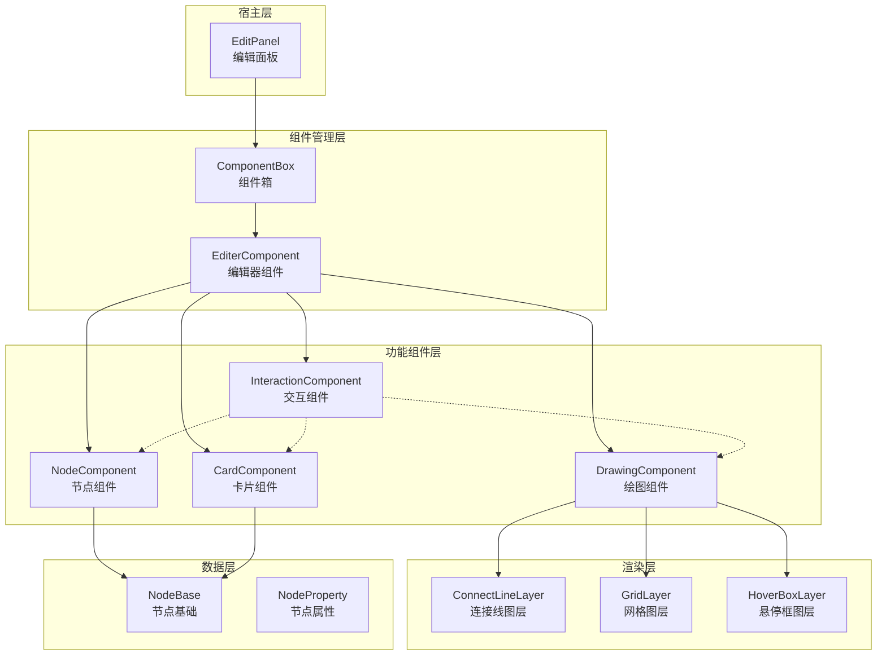
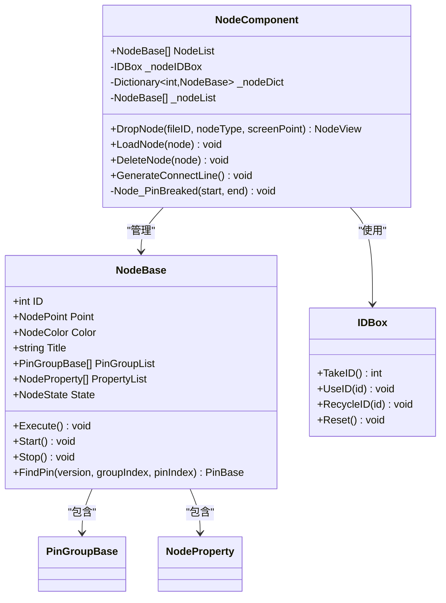
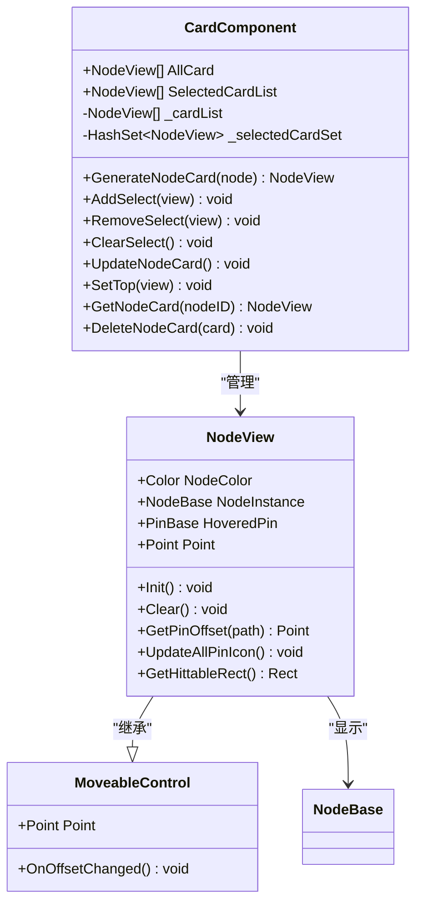
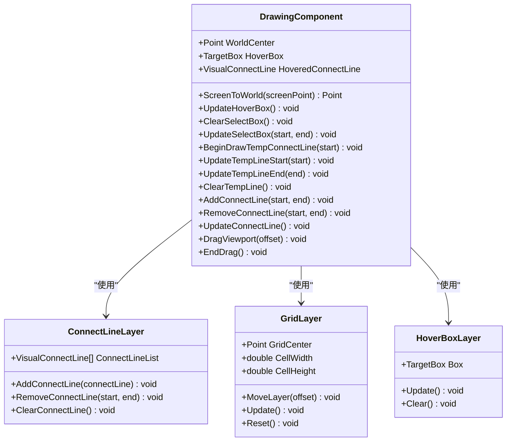
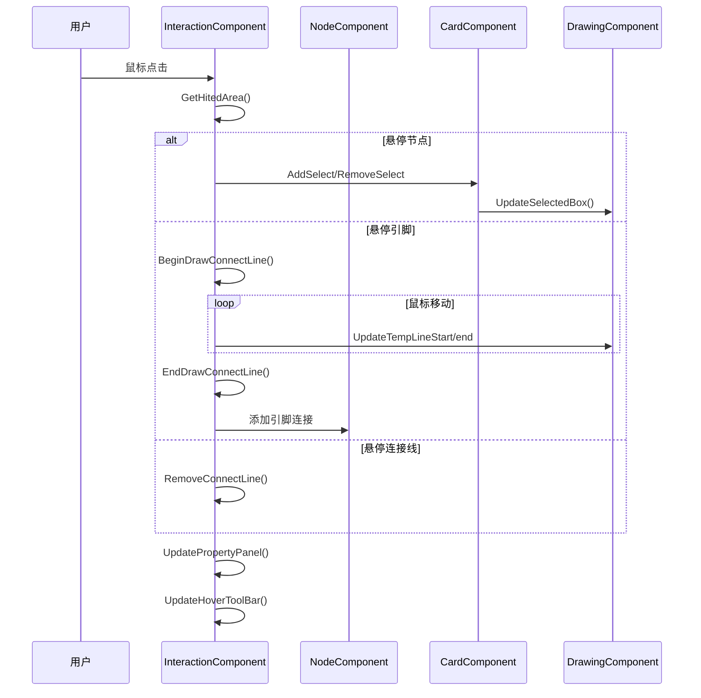
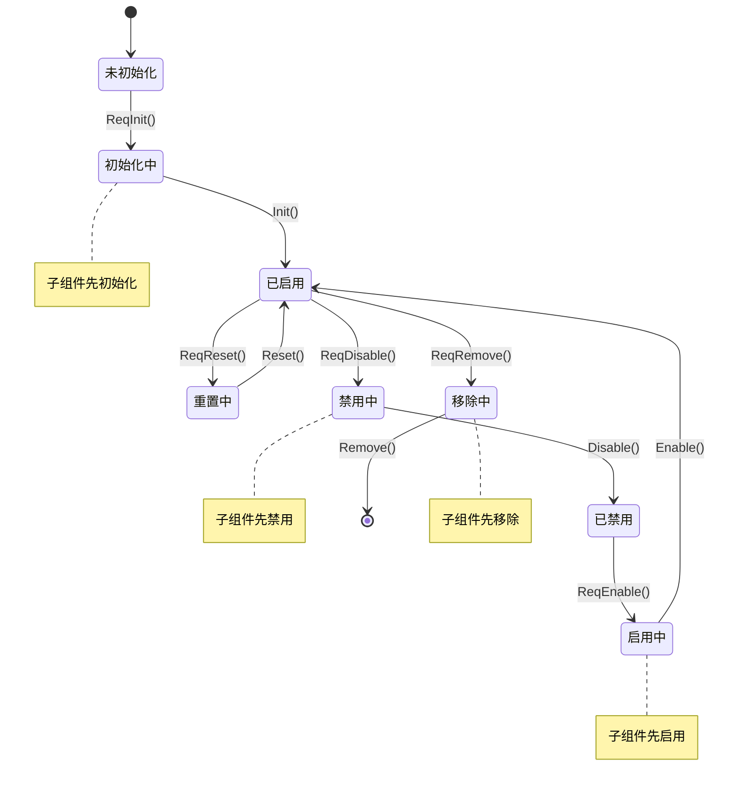
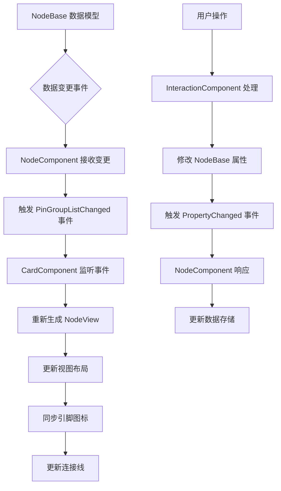
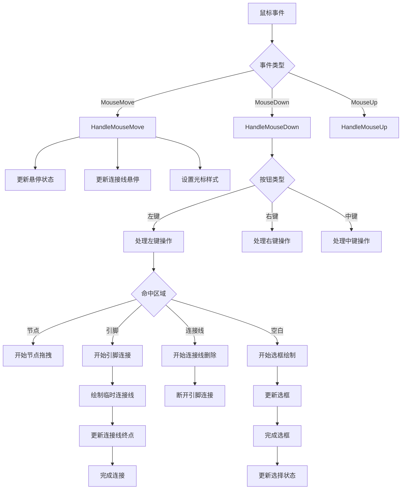
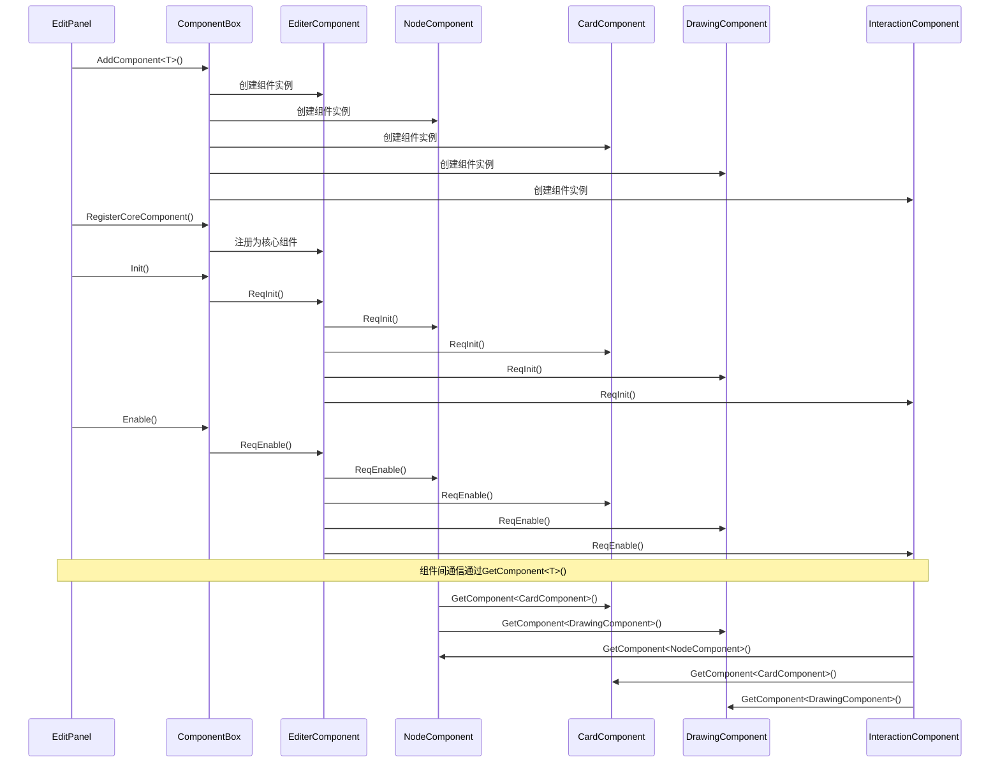

# 节点编辑系统架构设计文档

<cite>
**本文档引用的文件**
- [TComponent.cs](file://XLib.Base/UIComponent/TComponent.cs)
- [TComponentBox.cs](file://XLib.Base/UIComponent/TComponentBox.cs)
- [EditPanel.xaml.cs](file://XNode/SubSystem/NodeEditSystem/Panel/EditPanel.xaml.cs)
- [NodeComponent.cs](file://XNode/SubSystem/NodeEditSystem/Panel/Component/NodeComponent.cs)
- [CardComponent.cs](file://XNode/SubSystem/NodeEditSystem/Panel/Component/CardComponent.cs)
- [DrawingComponent.cs](file://XNode/SubSystem/NodeEditSystem/Panel/Component/DrawingComponent.cs)
- [InteractionComponent.cs](file://XNode/SubSystem/NodeEditSystem/Panel/Component/InteractionComponent.cs)
- [EditerComponent.cs](file://XNode/SubSystem/NodeEditSystem/Panel/Component/EditerComponent.cs)
- [NodeView.xaml.cs](file://XNode/SubSystem/NodeEditSystem/Control/NodeView.xaml.cs)
- [NodeBase.cs](file://XLib.Node/NodeBase.cs)
- [NodeProperty.cs](file://XLib.Node/NodeProperty.cs)
- [ConnectLineLayer.cs](file://XNode/SubSystem/NodeEditSystem/Panel/Layer/ConnectLineLayer.cs)
</cite>

## 目录
1. [简介](#简介)
2. [系统架构概览](#系统架构概览)
3. [核心组件分析](#核心组件分析)
4. [组件生命周期管理](#组件生命周期管理)
5. [数据-视图同步机制](#数据-视图同步机制)
6. [用户交互处理](#用户交互处理)
7. [组件通信模式](#组件通信模式)
8. [性能优化与扩展性](#性能优化与扩展性)
9. [故障排除指南](#故障排除指南)
10. [总结](#总结)

## 简介

XNode节点编辑系统是一个高度模块化的WPF应用程序，采用组件化架构设计，通过四个核心组件协同工作来提供完整的节点编辑功能。该系统的核心设计理念是将复杂的编辑功能分解为独立的、可复用的组件，每个组件负责特定的功能领域，通过统一的生命周期管理和通信机制实现松耦合的协作。

系统的主要特点包括：
- **模块化设计**：通过组件化架构实现功能分离
- **生命周期管理**：统一的组件初始化、启用、重置和禁用流程
- **数据-视图分离**：NodeComponent负责数据管理，CardComponent负责视图渲染
- **事件驱动**：基于事件的组件间通信机制
- **可扩展性**：支持新组件的动态添加和现有组件的功能扩展

## 系统架构概览

节点编辑系统采用分层架构设计，核心围绕EditPanel作为宿主容器，通过ComponentBox管理四大核心组件：



**图表来源**
- [EditPanel.xaml.cs](file://XNode/SubSystem/NodeEditSystem/Panel/EditPanel.xaml.cs#L11-L121)
- [TComponentBox.cs](file://XLib.Base/UIComponent/TComponentBox.cs#L5-L153)

**章节来源**
- [EditPanel.xaml.cs](file://XNode/SubSystem/NodeEditSystem/Panel/EditPanel.xaml.cs#L11-L121)
- [TComponentBox.cs](file://XLib.Base/UIComponent/TComponentBox.cs#L5-L153)

## 核心组件分析

### NodeComponent - 数据管理核心

NodeComponent是系统的核心数据管理组件，负责节点实例的创建、管理和生命周期控制：



**图表来源**
- [NodeComponent.cs](file://XNode/SubSystem/NodeEditSystem/Panel/Component/NodeComponent.cs#L11-L123)
- [NodeBase.cs](file://XLib.Node/NodeBase.cs#L7-L417)

NodeComponent的核心职责包括：
- **节点实例管理**：维护节点字典和列表，确保节点的唯一性和可访问性
- **ID分配与回收**：通过IDBox管理节点ID的分配和回收
- **节点生命周期**：处理节点的创建、启动、停止和销毁
- **连接线生成**：根据节点引脚关系自动生成连接线

### CardComponent - 视图管理核心

CardComponent负责节点视图的创建、管理和渲染：



**图表来源**
- [CardComponent.cs](file://XNode/SubSystem/NodeEditSystem/Panel/Component/CardComponent.cs#L12-L133)
- [NodeView.xaml.cs](file://XNode/SubSystem/NodeEditSystem/Control/NodeView.xaml.cs#L15-L334)

CardComponent的关键功能：
- **节点卡片生成**：将NodeBase实例转换为可交互的NodeView
- **选择管理**：维护选中节点集合，支持多选操作
- **布局更新**：根据世界坐标更新节点视图位置
- **层级管理**：控制节点卡片的Z轴顺序

### DrawingComponent - 渲染核心

DrawingComponent是系统的核心渲染组件，负责所有视觉元素的绘制和管理：



**图表来源**
- [DrawingComponent.cs](file://XNode/SubSystem/NodeEditSystem/Panel/Component/DrawingComponent.cs#L15-L385)
- [ConnectLineLayer.cs](file://XNode/SubSystem/NodeEditSystem/Panel/Layer/ConnectLineLayer.cs#L0-L51)

### InteractionComponent - 用户交互核心

InteractionComponent处理所有的用户输入事件和交互逻辑：



**图表来源**
- [InteractionComponent.cs](file://XNode/SubSystem/NodeEditSystem/Panel/Component/InteractionComponent.cs#L18-L755)

**章节来源**
- [NodeComponent.cs](file://XNode/SubSystem/NodeEditSystem/Panel/Component/NodeComponent.cs#L11-L123)
- [CardComponent.cs](file://XNode/SubSystem/NodeEditSystem/Panel/Component/CardComponent.cs#L12-L133)
- [DrawingComponent.cs](file://XNode/SubSystem/NodeEditSystem/Panel/Component/DrawingComponent.cs#L15-L385)
- [InteractionComponent.cs](file://XNode/SubSystem/NodeEditSystem/Panel/Component/InteractionComponent.cs#L18-L755)

## 组件生命周期管理

系统通过TComponent基类提供了统一的组件生命周期管理机制：



**图表来源**
- [TComponent.cs](file://XLib.Base/UIComponent/TComponent.cs#L30-L80)

### 生命周期方法详解

**Init()方法**：组件初始化阶段，建立基本的数据结构和依赖关系
```csharp
protected override void Init()
{
    // 子组件先初始化
    foreach (var component in _subComponentList) component.ReqInit();
    // 自身初始化
    Init();
}
```

**Enable()方法**：组件启用阶段，注册事件监听器和启动功能
```csharp
public void ReqEnable()
{
    if (IsEnabled) return;
    // 子组件先启用
    foreach (var component in _subComponentList) component.ReqEnable();
    // 自身启用
    Enable();
    IsEnabled = true;
}
```

**Reset()方法**：组件重置阶段，恢复到启用时的状态
```csharp
public void ReqReset()
{
    // 子组件先重置
    foreach (var component in _subComponentList) component.ReqReset();
    // 自身重置
    Reset();
}
```

**Disable()方法**：组件禁用阶段，清理资源和取消事件监听
```csharp
public void ReqDisable()
{
    if (!IsEnabled) return;
    // 子组件先禁用
    foreach (var component in _subComponentList) component.ReqDisable();
    // 自身禁用
    Disable();
    IsEnabled = false;
}
```

**章节来源**
- [TComponent.cs](file://XLib.Base/UIComponent/TComponent.cs#L30-L80)

## 数据-视图同步机制

系统采用经典的MVC（Model-View-Controller）架构模式，通过NodeComponent和CardComponent实现数据与视图的分离和同步：



**图表来源**
- [NodeComponent.cs](file://XNode/SubSystem/NodeEditSystem/Panel/Component/NodeComponent.cs#L40-L80)
- [CardComponent.cs](file://XNode/SubSystem/NodeEditSystem/Panel/Component/CardComponent.cs#L40-L80)

### 数据同步流程

1. **节点创建流程**：
   ```csharp
   // NodeComponent创建节点实例
   NodeBase nodeInstance = nodeType.NewInstance();
   nodeInstance.ID = _nodeIDBox.TakeID();
   nodeInstance.Point = new NodePoint((int)worldPoint.X, (int)worldPoint.Y);
   
   // CardComponent生成对应的视图
   NodeView card = GetComponent<CardComponent>().GenerateNodeCard(nodeInstance);
   ```

2. **属性变更同步**：
   ```csharp
   // NodeBase属性变更触发事件
   protected void InvokePropertyChanged() => PropertyChanged?.Invoke();
   
   // CardComponent响应事件更新视图
   private void Node_PropertyChanged()
   {
       // 更新节点标题
       Block_Title.Text = NodeInstance.Title;
       // 更新节点颜色
       NodeColor = Color.FromRgb(node.Color.r, node.Color.g, node.Color.b);
   }
   ```

3. **引脚组变更同步**：
   ```csharp
   // 引脚组列表变更触发事件
   protected void InvokePinGroupListChanged() => PinGroupListChanged?.Invoke();
   
   // 重新生成引脚组视图
   private void Node_PinGroupListChanged()
   {
       // 清空当前引脚组
       Stack_PinGroupList.Children.Clear();
       _pinGroupViewList.Clear();
       
       // 加载新的引脚组
       foreach (var pinGroup in NodeInstance.PinGroupList)
       {
           PinGroupViewBase? pinView = CreatePinGroupView(pinGroup);
           if (pinView == null) continue;
           Stack_PinGroupList.Children.Add(pinView);
           _pinGroupViewList.Add(pinView);
           pinView.Init();
       }
       
       UpdateLayout();
       PinGroupListChanged?.Invoke();
   }
   ```

**章节来源**
- [NodeComponent.cs](file://XNode/SubSystem/NodeEditSystem/Panel/Component/NodeComponent.cs#L40-L80)
- [CardComponent.cs](file://XNode/SubSystem/NodeEditSystem/Panel/Component/CardComponent.cs#L40-L80)
- [NodeView.xaml.cs](file://XNode/SubSystem/NodeEditSystem/Control/NodeView.xaml.cs#L200-L250)

## 用户交互处理

InteractionComponent是系统的核心交互处理器，负责捕获和处理各种用户输入事件：



**图表来源**
- [InteractionComponent.cs](file://XNode/SubSystem/NodeEditSystem/Panel/Component/InteractionComponent.cs#L18-L755)

### 主要交互模式

**节点拖拽**：
```csharp
public void BeginDragNode()
{
    _host.OperateArea.Cursor = CursorManager.Instance.SelectAndMove;
    _mouseDown = Mouse.GetPosition(_host.OperateArea);
}

public void DragNode()
{
    // 计算偏移量并对齐网格
    Point offset = new Point(_mousePoint.X - _mouseDown.X, _mousePoint.Y - _mouseDown.Y);
    offset.X = Math.Round(offset.X / 10) * 10;
    offset.Y = Math.Round(offset.Y / 10) * 10;
    
    // 更新节点位置
    foreach (var card in GetComponent<CardComponent>().SelectedCardList)
    {
        card.SetOffset(offset);
        Canvas.SetLeft(card, center.X + card.Point.X - 12);
        Canvas.SetTop(card, center.Y + card.Point.Y - 1);
    }
}
```

**引脚连接**：
```csharp
public void BeginDrawConnectLine()
{
    // 设置起始引脚
    _startPin = _hoveredNodeView.HoveredPin;
    // 开始绘制临时连接线
    GetComponent<DrawingComponent>().BeginDrawTempConnectLine(pinPoint);
}

public void EndDrawConnectLine()
{
    // 连接引脚
    if (_startPin.Flow == PinFlow.Input)
    {
        _startPin.AddSource(endPin);
        endPin.AddTarget(_startPin);
        GetComponent<DrawingComponent>().AddConnectLine(endPin, _startPin);
    }
    else
    {
        _startPin.AddTarget(endPin);
        endPin.AddSource(_startPin);
        GetComponent<DrawingComponent>().AddConnectLine(_startPin, endPin);
    }
}
```

**选框选择**：
```csharp
public void EndDrawSelectBox()
{
    Rect rect = GetComponent<DrawingComponent>().GetSelectBoxRect();
    SelectType type = GetComponent<DrawingComponent>().GetSelectType();
    
    // 选择节点视图
    foreach (var card in GetComponent<CardComponent>().AllCard)
    {
        Rect nodeRect = card.GetHittableRect();
        switch (type)
        {
            case SelectType.Box:
                if (rect.Contains(nodeRect)) GetComponent<CardComponent>().AddSelect(card);
                break;
            case SelectType.Cross:
                if (rect.IntersectsWith(nodeRect)) GetComponent<CardComponent>().AddSelect(card);
                break;
        }
    }
}
```

**章节来源**
- [InteractionComponent.cs](file://XNode/SubSystem/NodeEditSystem/Panel/Component/InteractionComponent.cs#L18-L755)

## 组件通信模式

系统采用基于宿主（Host）和组件箱（Box）的通信模式，通过ComponentBox统一管理组件间的依赖关系：



**图表来源**
- [EditPanel.xaml.cs](file://XNode/SubSystem/NodeEditSystem/Panel/EditPanel.xaml.cs#L30-L50)
- [TComponentBox.cs](file://XLib.Base/UIComponent/TComponentBox.cs#L15-L50)

### 通信机制详解

**组件获取**：
```csharp
// 在组件内部获取其他组件
private DrawingComponent _drawingComponent = GetComponent<DrawingComponent>();
private NodeComponent _nodeComponent = GetComponent<NodeComponent>();

// 在ComponentBox中注册核心组件
_componentBox.RegisterCoreComponent(_editerComponent);

// 在EditerComponent中添加功能组件
_editerComponent.AddComponent(_drawingComponent);
_editerComponent.AddComponent(_nodeComponent);
_editerComponent.AddComponent(_cardComponent);
_editerComponent.AddComponent(_interactionComponent);
```

**事件通信**：
```csharp
// NodeComponent触发节点事件
_nodeInstance.PinBreaked += Node_PinBreaked;

// DrawingComponent响应连接线事件
private void Node_PinBreaked(PinBase start, PinBase end) 
    => GetComponent<DrawingComponent>().RemoveConnectLine(start, end);

// InteractionComponent监听节点卡片
public void ListenNodeCard(NodeView nodeView)
{
    nodeView.NodeBackMouseEnter = NodeBack_MouseEnter;
    nodeView.NodeBackMouseLeave = NodeBack_MouseLeave;
    nodeView.PinGroupListChanged = PinGroupListChanged;
    nodeView.NodeChanged = NodeChanged;
}
```

**章节来源**
- [EditPanel.xaml.cs](file://XNode/SubSystem/NodeEditSystem/Panel/EditPanel.xaml.cs#L30-L50)
- [TComponentBox.cs](file://XLib.Base/UIComponent/TComponentBox.cs#L15-L50)
- [NodeComponent.cs](file://XNode/SubSystem/NodeEditSystem/Panel/Component/NodeComponent.cs#L80-L90)

## 性能优化与扩展性

### 性能优化策略

1. **组件懒加载**：只有在需要时才初始化和启用组件
2. **事件节流**：对频繁触发的事件进行节流处理
3. **批量更新**：将多个视图更新操作合并为批量操作
4. **内存管理**：及时清理不再使用的组件和资源

### 扩展性设计

1. **插件化架构**：支持新组件的动态添加
2. **接口抽象**：通过接口定义组件契约
3. **配置驱动**：通过配置文件控制组件行为
4. **事件驱动**：基于事件的松耦合通信机制

```csharp
// 示例：添加新组件
public void AddCustomComponent<TComponent>(string name = "自定义组件") 
    where TComponent : Component<EditPanel>, new()
{
    var customComponent = _componentBox.AddComponent<TComponent>(this, name);
    _componentBox.RegisterCoreComponent(customComponent);
    customComponent.ReqInit();
    customComponent.ReqEnable();
}
```

## 故障排除指南

### 常见问题及解决方案

**组件初始化失败**：
- 检查组件依赖是否正确注册
- 验证组件构造函数是否有异常
- 确认宿主对象是否正确传递

**数据同步问题**：
- 检查事件订阅是否正确
- 验证数据模型变更通知机制
- 确认视图更新逻辑是否完整

**性能问题**：
- 分析组件初始化耗时
- 检查事件处理效率
- 优化批量更新操作

**章节来源**
- [TComponent.cs](file://XLib.Base/UIComponent/TComponent.cs#L50-L80)
- [TComponentBox.cs](file://XLib.Base/UIComponent/TComponentBox.cs#L50-L100)

## 总结

XNode节点编辑系统通过精心设计的组件化架构，实现了高度模块化和可扩展的节点编辑功能。四大核心组件各司其职，通过统一的生命周期管理和事件驱动的通信机制，构建了一个稳定、高效的编辑平台。

系统的主要优势包括：
- **清晰的职责分离**：每个组件专注于特定功能领域
- **强大的扩展性**：支持新组件的动态添加和功能扩展
- **优秀的性能**：通过懒加载和批量更新优化性能
- **良好的可维护性**：模块化设计便于维护和调试

这种架构设计不仅满足了当前的功能需求，也为未来的功能扩展奠定了坚实的基础。开发者可以通过理解和遵循这套设计原则，轻松地扩展系统功能或集成新的组件。