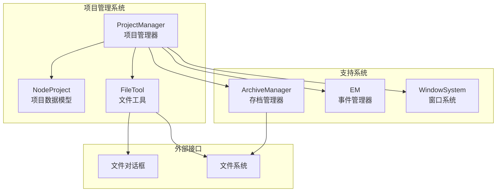
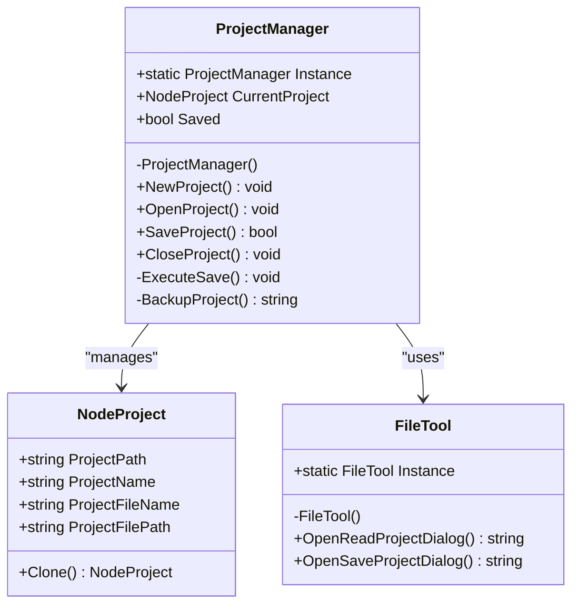
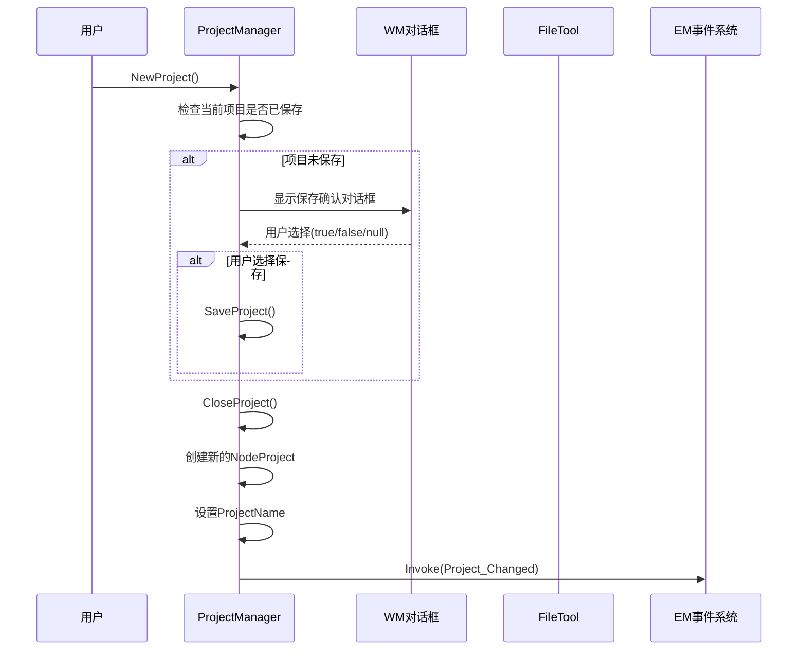
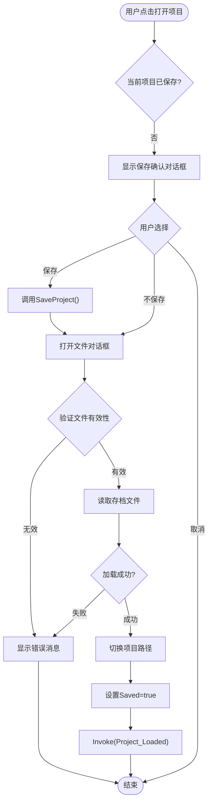
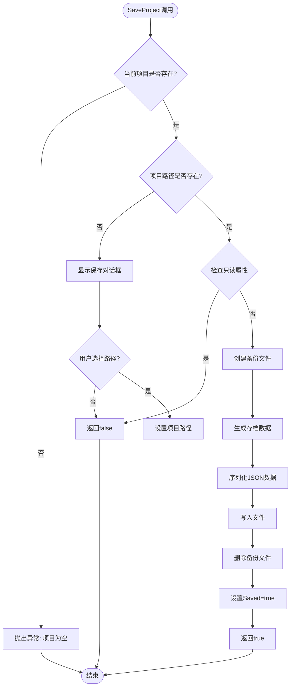
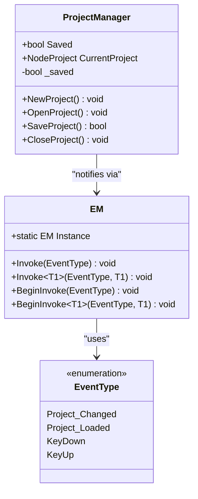
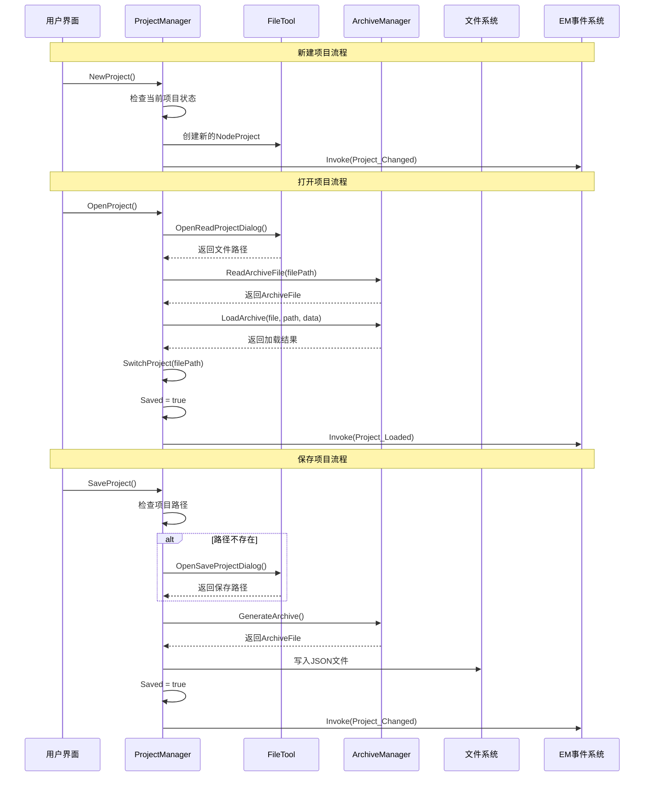
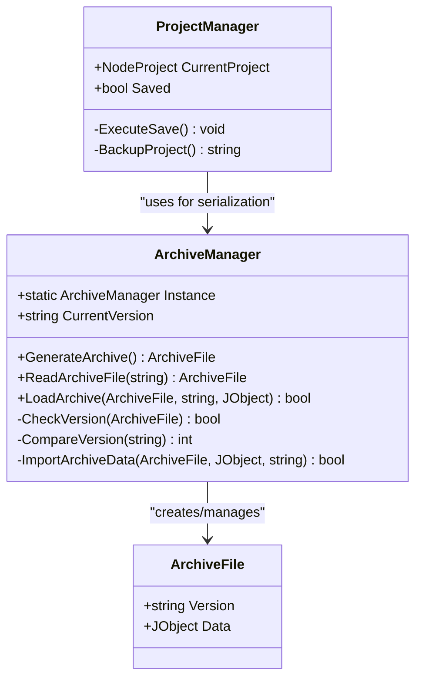
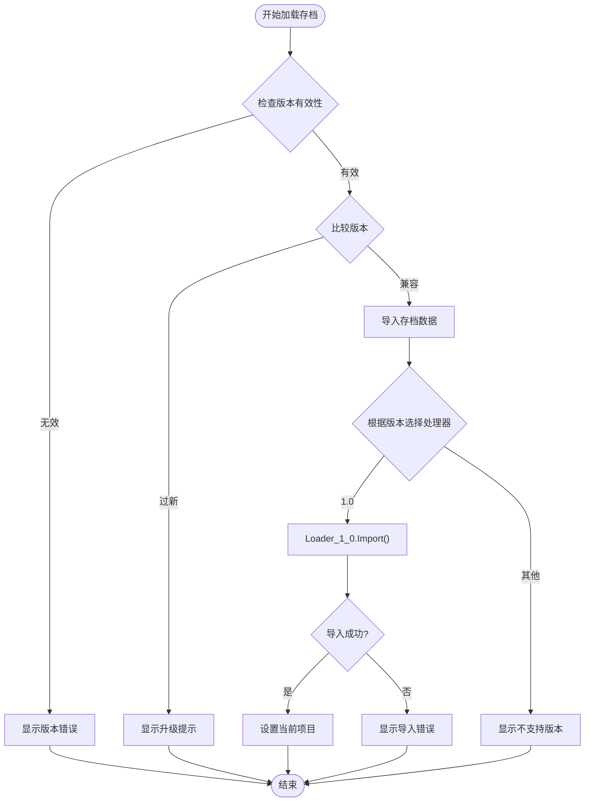

# 项目管理架构

<cite>
**本文档中引用的文件**
- [ProjectManager.cs](file://XNode/SubSystem/ProjectSystem/ProjectManager.cs)
- [NodeProject.cs](file://XNode/SubSystem/ProjectSystem/NodeProject.cs)
- [FileTool.cs](file://XNode/SubSystem/ProjectSystem/FileTool.cs)
- [ArchiveManager.cs](file://XNode/SubSystem/ArchiveSystem/ArchiveManager.cs)
- [EM.cs](file://XNode/SubSystem/EventSystem/EM.cs)
- [EventType.cs](file://XNode/SubSystem\EventSystem\EventType.cs)
- [CoreEditer.xaml.cs](file://XNode/CoreEditer.xaml.cs)
- [MainWindow.xaml.cs](file://XNode/MainWindow.xaml.cs)
</cite>

## 目录
1. [简介](#简介)
2. [项目结构概览](#项目结构概览)
3. [核心组件分析](#核心组件分析)
4. [架构设计原理](#架构设计原理)
5. [详细组件分析](#详细组件分析)
6. [事件系统集成](#事件系统集成)
7. [文件操作流程](#文件操作流程)
8. [序列化与反序列化](#序列化与反序列化)
9. [性能考虑](#性能考虑)
10. [故障排除指南](#故障排除指南)
11. [总结](#总结)

## 简介

项目管理架构是XNode应用程序的核心基础设施，负责管理项目生命周期的各个方面。该架构采用单例模式设计，确保项目状态的一致性和唯一性，同时提供了完整的项目创建、打开、保存和关闭功能。

本架构主要由三个核心组件构成：
- **ProjectManager**：项目管理器，负责项目生命周期控制和状态管理
- **NodeProject**：项目数据模型，封装项目的基本信息和属性
- **FileTool**：文件工具类，处理文件对话框操作和系统文件交互

## 项目结构概览



**图表来源**
- [ProjectManager.cs](file://XNode/SubSystem/ProjectSystem/ProjectManager.cs#L1-L254)
- [NodeProject.cs](file://XNode/SubSystem/ProjectSystem/NodeProject.cs#L1-L41)
- [FileTool.cs](file://XNode/SubSystem/ProjectSystem/FileTool.cs#L1-L48)

## 核心组件分析

### ProjectManager - 单例项目管理器

ProjectManager是整个项目管理系统的核心，采用经典的单例模式设计，确保在整个应用程序中只有一个项目实例存在。

```csharp
public class ProjectManager
{
    private ProjectManager() { }
    public static ProjectManager Instance { get; } = new ProjectManager();
    
    public NodeProject? CurrentProject { get; set; } = null;
    public bool Saved { get; set; }
}
```

**关键特性：**
- **单例模式**：保证项目状态的唯一性
- **状态管理**：跟踪项目是否已保存
- **生命周期控制**：管理项目的新建、打开、保存、关闭流程
- **事件通知**：通过EM系统广播项目状态变更

### NodeProject - 项目数据模型

NodeProject类定义了项目的基本数据结构，封装了项目的所有基本信息。

```csharp
public class NodeProject
{
    public string ProjectPath { get; set; } = "";
    public string ProjectName { get; set; } = "";
    public string ProjectFileName { get; set; }
    public static string FileExtension { get; private set; } = ".xnode";
    public string ProjectFilePath => $"{ProjectPath}\\{ProjectFileName}{FileExtension}";
}
```

**数据结构特点：**
- **路径管理**：分离项目路径和文件名
- **扩展名统一**：使用.xnode作为默认文件扩展名
- **克隆支持**：提供Clone()方法用于备份操作
- **计算属性**：ProjectFilePath自动计算完整文件路径

### FileTool - 文件操作工具

FileTool封装了所有文件对话框操作，提供了标准化的文件选择界面。

```csharp
public class FileTool
{
    public string OpenReadProjectDialog()
    {
        OpenFileDialog dialog = new OpenFileDialog
        {
            InitialDirectory = OptionManager.Instance.ProjectPath,
            Filter = _projectFilter.ToString(),
        };
        return dialog.ShowDialog() == true ? dialog.FileName : "";
    }
}
```

**功能特性：**
- **标准化对话框**：统一的OpenFileDialog和SaveFileDialog配置
- **过滤器管理**：自动添加.xnode和.json文件类型
- **路径记忆**：记住上次访问的项目目录
- **类型安全**：强类型的文件扩展名管理

**章节来源**
- [ProjectManager.cs](file://XNode/SubSystem/ProjectSystem/ProjectManager.cs#L1-L254)
- [NodeProject.cs](file://XNode/SubSystem/ProjectSystem/NodeProject.cs#L1-L41)
- [FileTool.cs](file://XNode/SubSystem/ProjectSystem/FileTool.cs#L1-L48)

## 架构设计原理

### 单例模式的应用

ProjectManager采用饿汉式单例模式，确保项目状态在整个应用程序中的唯一性：



**图表来源**
- [ProjectManager.cs](file://XNode/SubSystem/ProjectSystem/ProjectManager.cs#L15-L20)
- [NodeProject.cs](file://XNode/SubSystem/ProjectSystem/NodeProject.cs#L5-L40)
- [FileTool.cs](file://XNode/SubSystem/ProjectSystem/FileTool.cs#L10-L15)

### 状态管理模式

项目状态通过Saved属性进行管理，当状态发生变化时会自动触发事件通知：

```csharp
public bool Saved
{
    get => _saved;
    set
    {
        _saved = value;
        EM.Instance.Invoke(EventType.Project_Changed);
    }
}
```

这种设计确保了：
- **状态一致性**：所有组件都能获取到最新的项目状态
- **响应式更新**：UI和其他组件能够及时响应状态变化
- **事件驱动**：通过EM系统实现松耦合的组件通信

## 详细组件分析

### 项目生命周期管理

#### 新建项目流程



**图表来源**
- [ProjectManager.cs](file://XNode/SubSystem/ProjectSystem/ProjectManager.cs#L35-L50)

#### 打开项目流程



**图表来源**
- [ProjectManager.cs](file://XNode/SubSystem/ProjectSystem/ProjectManager.cs#L52-L95)

#### 保存项目流程



**图表来源**
- [ProjectManager.cs](file://XNode/SubSystem/ProjectSystem/ProjectManager.cs#L97-L155)

### 文件操作封装

FileTool类提供了标准化的文件操作接口，封装了WPF的文件对话框：

```csharp
public string OpenSaveProjectDialog(string fileName)
{
    SaveFileDialog dialog = new SaveFileDialog
    {
        InitialDirectory = OptionManager.Instance.ProjectPath,
        FileName = $"{fileName}.xnode",
        Filter = _projectFilter.ToString(),
    };
    return dialog.ShowDialog() == true ? dialog.FileName : "";
}
```

**设计优势：**
- **配置集中**：所有文件对话框的配置都在FileTool中统一管理
- **类型安全**：通过静态属性确保文件扩展名的一致性
- **用户体验**：预填充默认文件名和初始目录

**章节来源**
- [ProjectManager.cs](file://XNode/SubSystem/ProjectSystem/ProjectManager.cs#L35-L155)
- [FileTool.cs](file://XNode/SubSystem/ProjectSystem/FileTool.cs#L25-L47)

## 事件系统集成

### EM事件系统架构

ProjectManager与EM事件系统紧密集成，通过事件机制实现组件间的松耦合通信：



**图表来源**
- [EM.cs](file://XNode/SubSystem/EventSystem/EM.cs#L1-L63)
- [EventType.cs](file://XNode/SubSystem\EventSystem\EventType.cs#L1-L16)

### 事件触发机制

ProjectManager在关键操作完成后会触发相应的事件：

```csharp
// 项目状态变更事件
public bool Saved
{
    get => _saved;
    set
    {
        _saved = value;
        EM.Instance.Invoke(EventType.Project_Changed);
    }
}

// 项目加载完成事件
if (success)
{
    SwitchProject(filePath);
    Saved = true;
    EM.Instance.Invoke(EventType.Project_Loaded);
}
```

**事件类型说明：**
- **Project_Changed**：项目内容发生变更时触发
- **Project_Loaded**：项目成功加载完成后触发

### 事件监听示例

其他组件可以通过以下方式监听项目状态变化：

```csharp
// 在UI组件中监听项目变更
EM.Instance.Invoke(EventType.Project_Changed, (Action)(() =>
{
    // 更新UI状态
    UpdateWindowTitle();
}));
```

**章节来源**
- [ProjectManager.cs](file://XNode/SubSystem/ProjectSystem/ProjectManager.cs#L25-L30)
- [EM.cs](file://XNode/SubSystem/EventSystem/EM.cs#L1-L63)
- [EventType.cs](file://XNode/SubSystem\EventSystem\EventType.cs#L1-L16)

## 文件操作流程

### 完整的项目操作流程



**图表来源**
- [ProjectManager.cs](file://XNode/SubSystem/ProjectSystem/ProjectManager.cs#L35-L155)
- [FileTool.cs](file://XNode/SubSystem/ProjectSystem/FileTool.cs#L25-L47)
- [ArchiveManager.cs](file://XNode/SubSystem/ArchiveSystem/ArchiveManager.cs#L35-L85)

### 错误处理机制

ProjectManager实现了完善的错误处理机制：

```csharp
private void ExecuteSave()
{
    try
    {
        // 备份项目：防止因保存异常导致项目文件损坏
        string backupPath = BackupProject();
        
        // 生成存档数据
        ArchiveFile file = ArchiveManager.Instance.GenerateArchive();
        // 序列化存档数据
        string jsonData = JsonConvert.SerializeObject(file, Formatting.Indented);
        // 创建文件并写入数据，文件已存在则覆盖
        File.WriteAllText(CurrentProject.ProjectFilePath, jsonData, Encoding.UTF8);
        // 设置为已保存
        Saved = true;
        
        // 删除备份
        if (backupPath != "" && File.Exists(backupPath)) File.Delete(backupPath);
    }
    catch (Exception) { }
}
```

**错误处理策略：**
- **备份机制**：保存前创建备份文件
- **异常捕获**：捕获所有可能的异常而不中断程序
- **资源清理**：确保备份文件在成功保存后被删除

**章节来源**
- [ProjectManager.cs](file://XNode/SubSystem/ProjectSystem/ProjectManager.cs#L157-L202)

## 序列化与反序列化

### ArchiveManager协作机制

ProjectManager与ArchiveManager紧密协作，处理项目的序列化和反序列化：



**图表来源**
- [ArchiveManager.cs](file://XNode/SubSystem/ArchiveSystem/ArchiveManager.cs#L15-L137)

### 版本兼容性处理

ArchiveManager实现了版本检查机制，确保不同版本间的兼容性：

```csharp
private bool CheckVersion(ArchiveFile file)
{
    if (string.IsNullOrEmpty(file.Version) || file.Version == "???") return false;
    try
    {
        ArchiveVersion version = new ArchiveVersion(file.Version);
    }
    catch (Exception) { return false; }
    return true;
}

private int CompareVersion(string version)
{
    ArchiveVersion file = new ArchiveVersion(version);
    ArchiveVersion current = new ArchiveVersion(CurrentVersion);
    return file.CompareTo(current);
}
```

**版本处理逻辑：**
- **版本验证**：检查版本字符串的有效性
- **版本比较**：支持向前兼容和向后兼容检查
- **错误处理**：优雅处理版本不兼容的情况

### 数据导入流程



**图表来源**
- [ArchiveManager.cs](file://XNode/SubSystem/ArchiveSystem/ArchiveManager.cs#L85-L137)

**章节来源**
- [ArchiveManager.cs](file://XNode/SubSystem/ArchiveSystem/ArchiveManager.cs#L15-L137)

## 性能考虑

### 内存优化策略

1. **延迟初始化**：ProjectManager采用饿汉式单例，避免运行时创建开销
2. **对象复用**：NodeProject支持Clone()方法，减少对象创建成本
3. **事件批处理**：EM系统支持BeginInvoke，避免UI线程阻塞

### 文件I/O优化

1. **异步操作**：事件系统支持异步调用，提高响应性
2. **增量保存**：只在项目内容变更时触发保存操作
3. **备份策略**：保存前创建备份，避免数据丢失

### 并发安全性

虽然当前实现不是线程安全的，但设计上考虑了以下并发场景：
- **UI线程**：所有文件操作都在UI线程执行
- **事件处理**：通过Dispatcher确保事件在正确线程执行
- **状态同步**：Saved属性的setter确保状态变更的原子性

## 故障排除指南

### 常见问题及解决方案

#### 项目保存失败

**症状**：SaveProject()返回false或抛出异常

**可能原因**：
1. 项目路径无效
2. 文件权限不足
3. 磁盘空间不足
4. 文件被其他进程占用

**解决方案**：
```csharp
// 检查文件属性
bool isReadOnly = ProjectReadonly();
if (isReadOnly)
{
    // 提示用户修改文件属性
    MessageBox.Show("项目文件为只读，请修改文件属性");
}
```

#### 项目打开失败

**症状**：OpenProject()无法加载项目文件

**可能原因**：
1. 文件格式不正确
2. 版本不兼容
3. 文件损坏

**解决方案**：
```csharp
// 检查文件有效性
ArchiveFile? file = ArchiveManager.Instance.ReadArchiveFile(filePath);
if (file == null)
{
    // 尝试从备份恢复
    RestoreFromBackup(filePath);
}
```

#### 事件通知失效

**症状**：项目状态变更后UI没有更新

**可能原因**：
1. EM实例未正确初始化
2. 事件订阅丢失
3. 线程同步问题

**解决方案**：
```csharp
// 确保事件在UI线程执行
EM.Instance.BeginInvoke(EventType.Project_Changed, () =>
{
    // 更新UI逻辑
});
```

**章节来源**
- [ProjectManager.cs](file://XNode/SubSystem/ProjectSystem/ProjectManager.cs#L204-L235)

## 总结

项目管理架构通过精心设计的组件协作，实现了完整的项目生命周期管理。其核心特点包括：

### 设计优势

1. **单例模式确保一致性**：ProjectManager的单例设计保证了项目状态的唯一性和一致性
2. **模块化设计**：各组件职责明确，便于维护和扩展
3. **事件驱动架构**：通过EM系统实现松耦合的组件通信
4. **完善的错误处理**：多层次的错误处理机制确保系统稳定性

### 技术亮点

1. **备份机制**：保存前自动创建备份，防止数据丢失
2. **版本兼容性**：支持多版本存档文件的加载和转换
3. **用户体验**：标准化的文件对话框和智能的状态提示
4. **性能优化**：合理的内存管理和I/O优化策略

### 扩展建议

1. **异步操作支持**：可以考虑将文件操作改为异步模式
2. **多项目支持**：扩展为支持多个项目同时打开
3. **云存储集成**：添加云端项目存储和同步功能
4. **项目模板**：实现项目模板系统，提高开发效率

这个项目管理架构为XNode应用程序提供了坚实的基础，通过清晰的职责划分和良好的设计原则，确保了系统的可维护性和可扩展性。无论是对于初学者还是经验丰富的开发者，这套架构都提供了很好的学习价值和实践指导。