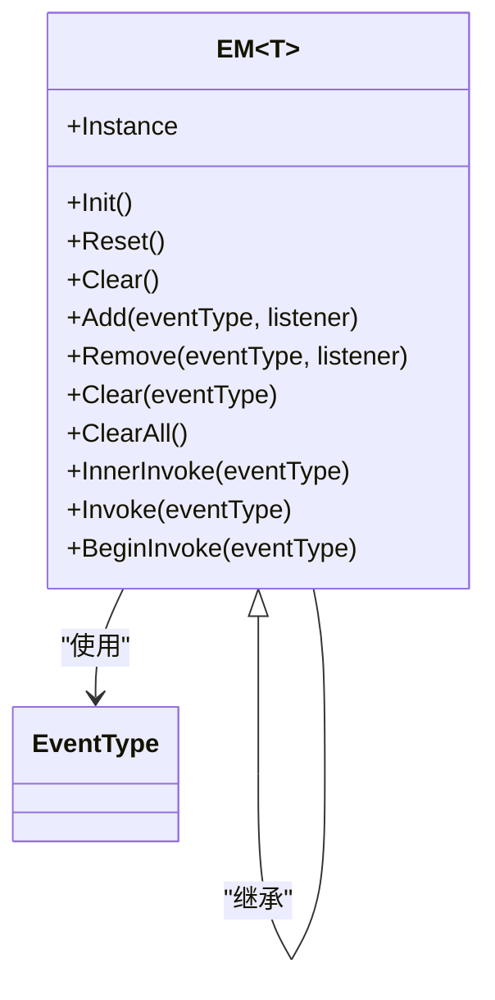
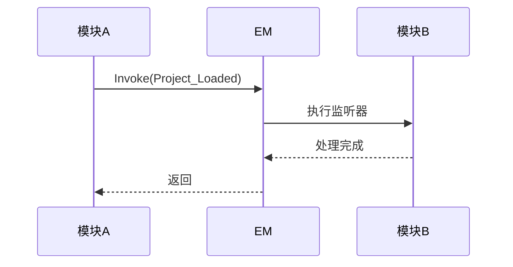
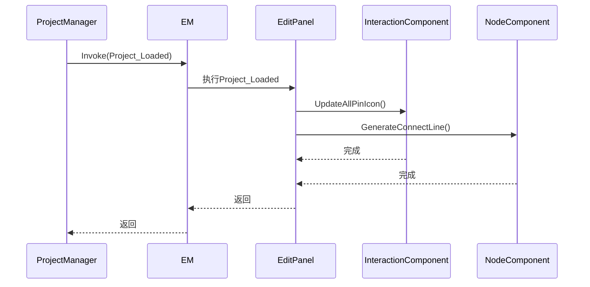
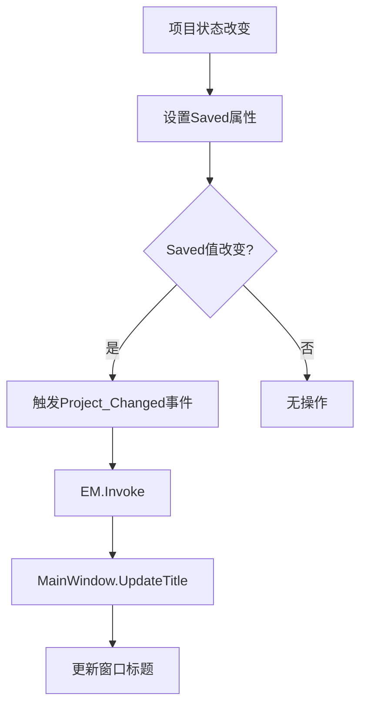
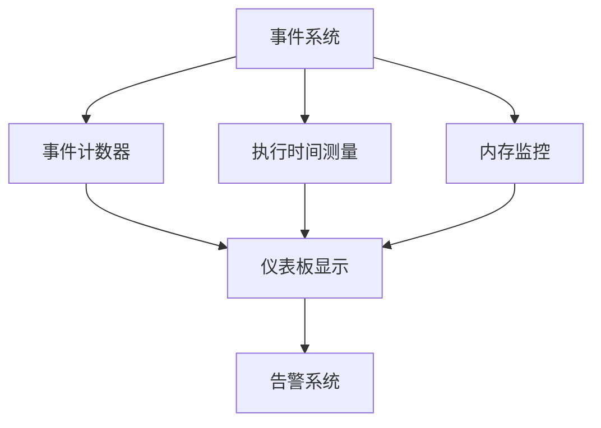

# 事件系统

<cite>
**本文档引用的文件**   
- [EM.cs](file://XLib.Base/EM.cs)
- [EventType.cs](file://XNode/SubSystem/EventSystem/EventType.cs)
- [EM.cs](file://XNode/SubSystem/EventSystem/EM.cs)
- [ProjectManager.cs](file://XNode/SubSystem/ProjectSystem/ProjectManager.cs)
- [MainWindow.xaml.cs](file://XNode/MainWindow.xaml.cs)
- [EditPanel.xaml.cs](file://XNode/SubSystem/NodeEditSystem/Panel/EditPanel.xaml.cs)
- [NodeComponent.cs](file://XNode/SubSystem/NodeEditSystem/Panel/Component/NodeComponent.cs)
- [NodeBase.cs](file://XLib.Node/NodeBase.cs)
- [NodeType.cs](file://XLib.Node/NodeType.cs)
</cite>

## 目录
1. [引言](#引言)
2. [事件管理器架构](#事件管理器架构)
3. [核心事件类型](#核心事件类型)
4. [事件订阅与发布机制](#事件订阅与发布机制)
5. [模块间协作示例](#模块间协作示例)
6. [松耦合优势分析](#松耦合优势分析)
7. [潜在问题与预防措施](#潜在问题与预防措施)
8. [调试与性能监控](#调试与性能监控)
9. [结论](#结论)

## 引言
本文档深入解析基于EM（事件管理器）的全局通信机制。EM系统通过单例模式实现跨模块解耦通信，为XNode项目提供了一套完整的事件驱动架构。该系统允许不同模块通过事件进行协作，而无需直接依赖彼此，从而实现了高度的模块化和可维护性。

**Section sources**
- [EM.cs](file://XLib.Base/EM.cs#L1-L141)
- [EventType.cs](file://XNode/SubSystem/EventSystem/EventType.cs#L1-L15)

## 事件管理器架构
EM（事件管理器）采用泛型设计，通过继承`IManager`接口实现生命周期管理。其核心架构基于字典结构`_listenerDict`，以事件类型为键，存储对应事件的委托列表。系统在初始化时预创建所有事件类型的监听器列表，确保运行时性能。

**Diagram sources**
- [EM.cs](file://XLib.Base/EM.cs#L1-L141)
- [EM.cs](file://XNode/SubSystem/EventSystem/EM.cs#L1-L62)

**Section sources**
- [EM.cs](file://XLib.Base/EM.cs#L1-L141)
- [EM.cs](file://XNode/SubSystem/EventSystem/EM.cs#L1-L62)

## 核心事件类型
系统定义了多种核心事件类型，用于通知关键状态变更。这些事件在特定时机被触发，驱动系统各组件的响应行为。

| 事件类型 | 触发时机 | 描述 |
|---------|--------|------|
| KeyDown | 键盘按键按下时 | 通知系统按键输入事件 |
| KeyUp | 键盘按键松开时 | 通知系统按键释放事件 |
| Project_Changed | 项目状态变更时 | 当项目保存状态改变时触发 |
| Project_Loaded | 项目加载完成时 | 项目成功加载后触发 |

**Section sources**
- [EventType.cs](file://XNode/SubSystem/EventSystem/EventType.cs#L1-L15)

## 事件订阅与发布机制
事件系统提供了完整的订阅（On）、发布（Fire）和取消订阅（Off）机制。EM.Instance作为单例全局访问点，各模块通过它进行事件通信。

### 订阅机制
模块通过`Add`方法订阅事件，支持不同参数数量的委托类型：
- `Add(EventType, Action)` - 无参数事件
- `Add<T1>(EventType, Action<T1>)` - 单参数事件
- `Add<T1, T2>(EventType, Action<T1, T2>)` - 双参数事件
- `Add<T1, T2, T3>(EventType, Action<T1, T2, T3>)` - 三参数事件

### 发布机制
事件通过`Invoke`方法同步发布，或通过`BeginInvoke`方法异步发布到UI线程：

**Diagram sources**
- [EM.cs](file://XLib.Base/EM.cs#L1-L141)
- [EM.cs](file://XNode/SubSystem/EventSystem/EM.cs#L1-L62)

**Section sources**
- [EM.cs](file://XLib.Base/EM.cs#L1-L141)
- [EM.cs](file://XNode/SubSystem/EventSystem/EM.cs#L1-L62)

## 模块间协作示例
事件系统在实际应用中实现了模块间的无缝协作。以下是一个典型的协作场景：

### 项目加载流程
当项目加载完成后，系统触发`Project_Loaded`事件，多个模块响应此事件：

**Diagram sources**
- [ProjectManager.cs](file://XNode/SubSystem/ProjectSystem/ProjectManager.cs#L85-L120)
- [EditPanel.xaml.cs](file://XNode/SubSystem/NodeEditSystem/Panel/EditPanel.xaml.cs#L37-L80)

**Section sources**
- [ProjectManager.cs](file://XNode/SubSystem/ProjectSystem/ProjectManager.cs#L85-L120)
- [EditPanel.xaml.cs](file://XNode/SubSystem/NodeEditSystem/Panel/EditPanel.xaml.cs#L37-L80)

### 项目状态变更
当项目保存状态改变时，标题栏自动更新：

**Diagram sources**
- [ProjectManager.cs](file://XNode/SubSystem/ProjectSystem/ProjectManager.cs#L15-L20)
- [MainWindow.xaml.cs](file://XNode/MainWindow.xaml.cs#L53-L60)

**Section sources**
- [ProjectManager.cs](file://XNode/SubSystem/ProjectSystem/ProjectManager.cs#L15-L20)
- [MainWindow.xaml.cs](file://XNode/MainWindow.xaml.cs#L53-L60)

## 松耦合优势分析
事件系统在维护系统松耦合方面具有显著优势：

1. **模块独立性**：各模块无需知道其他模块的存在，只需关注事件本身
2. **可扩展性**：新增功能模块只需订阅相关事件，不影响现有代码
3. **可测试性**：模块可以独立测试，通过模拟事件进行单元测试
4. **维护性**：修改一个模块的实现不影响其他模块，只要事件契约不变

例如，`MainWindow`仅通过`Project_Changed`事件更新标题，而不需要了解`ProjectManager`的内部实现细节。

**Section sources**
- [ProjectManager.cs](file://XNode/SubSystem/ProjectSystem/ProjectManager.cs#L15-L20)
- [MainWindow.xaml.cs](file://XNode/MainWindow.xaml.cs#L53-L60)

## 潜在问题与预防措施
尽管事件系统带来了诸多好处，但也存在一些潜在问题需要关注：

### 内存泄漏
未及时取消订阅可能导致内存泄漏，因为事件管理器持有委托引用，阻止对象被垃圾回收。

**预防措施**：
- 在对象销毁时显式调用`Remove`方法取消订阅
- 使用弱引用事件模式（当前系统未实现）
- 定期审查事件订阅关系

### 事件风暴
频繁触发事件可能导致性能问题，形成"事件风暴"。

**预防措施**：
- 合并频繁的事件触发
- 使用节流（throttle）或防抖（debounce）技术
- 异步处理非关键事件

### 调试困难
事件驱动的程序流程不如命令式程序直观，调试难度增加。

**解决方案**：
- 实现事件日志系统
- 提供事件监听器查看工具
- 在开发环境中启用事件跟踪

**Section sources**
- [EM.cs](file://XLib.Base/EM.cs#L1-L141)
- [EM.cs](file://XNode/SubSystem/EventSystem/EM.cs#L1-L62)

## 调试与性能监控
为确保大规模事件调度的稳定性，建议实施以下调试和性能监控方案：

### 事件调试工具
1. **事件监听器查看器**：列出所有事件类型及其订阅者数量
2. **事件日志记录**：记录事件触发的时间、参数和调用堆栈
3. **事件依赖图**：可视化事件与模块间的依赖关系

### 性能监控方案
1. **事件频率监控**：统计单位时间内各类事件的触发次数
2. **事件处理时间**：测量每个事件处理程序的执行时间
3. **内存使用监控**：跟踪事件系统占用的内存增长情况

**Diagram sources**
- [EM.cs](file://XLib.Base/EM.cs#L1-L141)
- [EM.cs](file://XNode/SubSystem/EventSystem/EM.cs#L1-L62)

**Section sources**
- [EM.cs](file://XLib.Base/EM.cs#L1-L141)
- [EM.cs](file://XNode/SubSystem/EventSystem/EM.cs#L1-L62)

## 结论
基于EM的全局通信机制为XNode项目提供了一个强大而灵活的事件驱动架构。通过单例模式实现的跨模块解耦通信，系统各组件能够高效协作，同时保持高度的独立性和可维护性。事件订阅、发布和取消订阅的完整机制，配合精心设计的核心事件类型，构成了系统稳定运行的基础。

尽管存在内存泄漏和事件风暴等潜在风险，但通过合理的预防措施和完善的调试监控方案，可以有效规避这些问题。建议在开发过程中严格遵循事件使用规范，定期审查事件订阅关系，确保系统的长期稳定性和可扩展性。