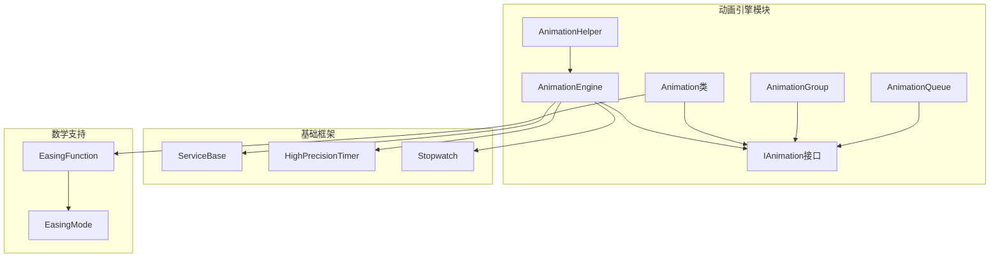
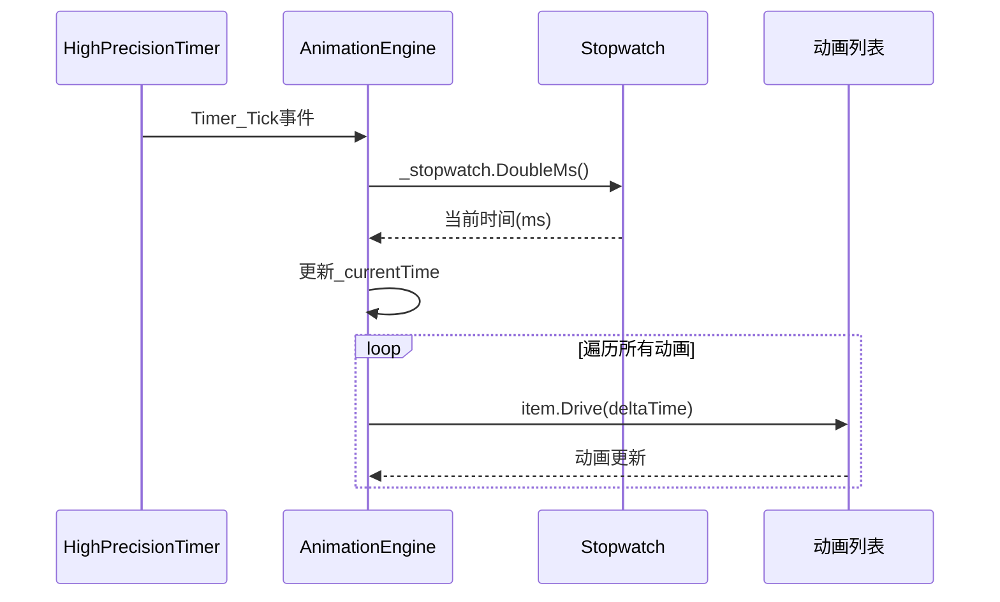
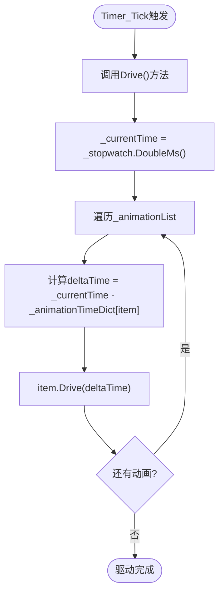
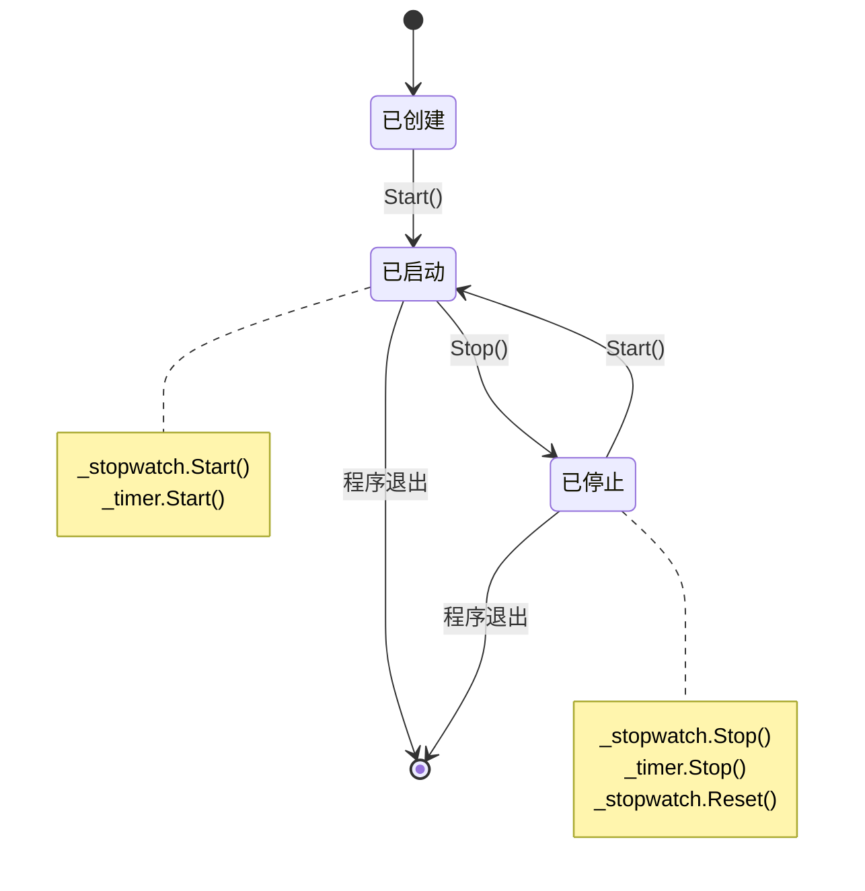
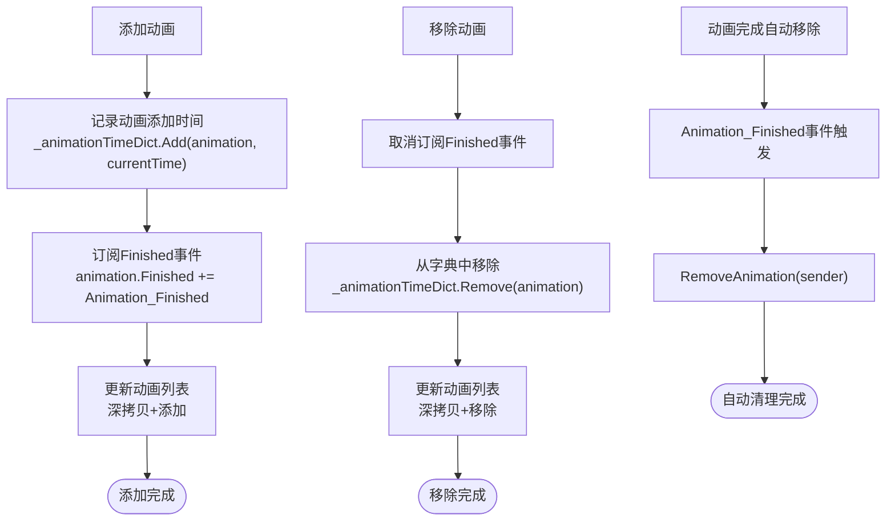
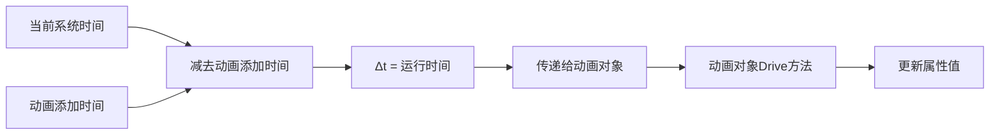

# 动画引擎核心

<cite>
**本文档引用的文件**
- [AnimationEngine.cs](file://XLib.Animate/AnimationEngine.cs)
- [ServiceBase.cs](file://XLib.Base/AppFrame/ServiceBase.cs)
- [HighPrecisionTimer.cs](file://XLib.Base/HighPrecisionTimer.cs)
- [IAnimation.cs](file://XLib.Animate/IAnimation.cs)
- [Animation.cs](file://XLib.Animate/Animation.cs)
- [AnimationHelper.cs](file://XLib.Animate/AnimationHelper.cs)
- [AnimationGroup.cs](file://XLib.Animate/AnimationGroup.cs)
- [AnimationQueue.cs](file://XLib.Animate/AnimationQueue.cs)
- [LoadingLayer.cs](file://XLib.Sample/Layer/LoadingLayer.cs)
</cite>

## 目录
1. [简介](#简介)
2. [项目结构概览](#项目结构概览)
3. [AnimationEngine单例实现](#animationengine单例实现)
4. [时间驱动机制详解](#时间驱动机制详解)
5. [生命周期管理](#生命周期管理)
6. [动画管理系统](#动画管理系统)
7. [核心算法分析](#核心算法分析)
8. [实践应用示例](#实践应用示例)
9. [性能优化建议](#性能优化建议)
10. [故障排除指南](#故障排除指南)
11. [总结](#总结)

## 简介

AnimationEngine是XNode框架中的核心动画引擎，采用单例模式设计，负责管理所有动画实例的生命周期和时间驱动。该引擎继承自ServiceBase基类，提供了完整的动画生命周期管理功能，包括启动、停止、动画添加、移除等操作。

AnimationEngine通过HighPrecisionTimer以10ms间隔触发Tick事件来驱动动画帧更新，使用Stopwatch高精度计时器计算动画时间戳，并通过_animationList与_animationTimeDict协同管理活跃动画及其起始时间。每帧遍历动画列表并传递已运行时间的核心逻辑确保了动画的流畅执行。

## 项目结构概览



**图表来源**
- [AnimationEngine.cs](file://XLib.Animate/AnimationEngine.cs#L1-L112)
- [ServiceBase.cs](file://XLib.Base/AppFrame/ServiceBase.cs#L1-L18)
- [HighPrecisionTimer.cs](file://XLib.Base/HighPrecisionTimer.cs#L1-L151)

## AnimationEngine单例实现

AnimationEngine采用了经典的C#单例模式实现，具有以下特点：

### 单例构造与初始化

```csharp
private AnimationEngine()
{
    _timer.Interval = 10;
    _timer.Tick += Timer_Tick;
}

public static AnimationEngine Instance { get; } = new AnimationEngine();
```

这种实现方式具有以下优势：
- **线程安全**：静态字段初始化在.NET中是线程安全的
- **延迟初始化**：只有在首次访问Instance属性时才会创建实例
- **不可变性**：Instance属性是只读的，防止意外修改
- **简洁性**：使用表达式体成员简化代码

### 字段结构设计

```csharp
/// <summary>秒表，提供精确时间</summary>
private readonly Stopwatch _stopwatch = new Stopwatch();
/// <summary>当前时间</summary>
private double _currentTime = 0;

/// <summary>定时器：定时驱动</summary>
private readonly HighPrecisionTimer _timer = new HighPrecisionTimer();

/// <summary>动画列表</summary>
private List<IAnimation> _animationList = new List<IAnimation>();

/// <summary>动画时间表，记录动画的添加时间</summary>
private readonly Dictionary<IAnimation, double> _animationTimeDict = new Dictionary<IAnimation, double>();
```

**章节来源**
- [AnimationEngine.cs](file://XLib.Animate/AnimationEngine.cs#L10-L112)

## 时间驱动机制详解

AnimationEngine的时间驱动机制是整个动画系统的核心，基于HighPrecisionTimer的10ms间隔触发。

### HighPrecisionTimer集成



**图表来源**
- [AnimationEngine.cs](file://XLib.Animate/AnimationEngine.cs#L78-L82)
- [HighPrecisionTimer.cs](file://XLib.Base/HighPrecisionTimer.cs#L100-L120)

### 时间戳计算原理

AnimationEngine使用Stopwatch高精度计时器来计算动画时间戳：

```csharp
public void Drive()
{
    _currentTime = _stopwatch.DoubleMs();
    foreach (var item in _animationList)
        item.Drive(_currentTime - _animationTimeDict[item]);
}
```

时间计算公式：
- **动画运行时间** = 当前系统时间 - 动画添加时的系统时间
- **Delta时间** = 当前帧时间 - 上一帧时间

### Tick事件处理流程



**图表来源**
- [AnimationEngine.cs](file://XLib.Animate/AnimationEngine.cs#L78-L82)

**章节来源**
- [AnimationEngine.cs](file://XLib.Animate/AnimationEngine.cs#L78-L82)
- [HighPrecisionTimer.cs](file://XLib.Base/HighPrecisionTimer.cs#L100-L120)

## 生命周期管理

AnimationEngine继承自ServiceBase基类，实现了完整的生命周期管理。

### ServiceBase基类设计

```csharp
public abstract class ServiceBase
{
    public abstract void Start();
    public abstract void Stop();
    
    public void Restart()
    {
        Stop();
        Start();
    }
}
```

### AnimationEngine生命周期实现

```csharp
public override void Start()
{
    _stopwatch.Start();
    _timer.Start();
}

public override void Stop()
{
    _stopwatch.Stop();
    _stopwatch.Reset();
    _timer.Stop();
}
```

### 生命周期状态转换



**图表来源**
- [AnimationEngine.cs](file://XLib.Animate/AnimationEngine.cs#L25-L35)
- [ServiceBase.cs](file://XLib.Base/AppFrame/ServiceBase.cs#L1-L18)

**章节来源**
- [AnimationEngine.cs](file://XLib.Animate/AnimationEngine.cs#L25-L35)
- [ServiceBase.cs](file://XLib.Base/AppFrame/ServiceBase.cs#L1-L18)

## 动画管理系统

AnimationEngine通过两个核心数据结构协同管理活跃动画：

### 动画列表管理

```csharp
/// <summary>动画列表</summary>
private List<IAnimation> _animationList = new List<IAnimation>();

/// <summary>动画时间表，记录动画的添加时间</summary>
private readonly Dictionary<IAnimation, double> _animationTimeDict = new Dictionary<IAnimation, double>();
```

### 动画添加机制

```csharp
public void AddAnimation(IAnimation animation)
{
    _animationTimeDict.Add(animation, _stopwatch.DoubleMs());
    animation.Finished += Animation_Finished;
    List<IAnimation> newList = new List<IAnimation>(_animationList)
    {
        animation
    };
    _animationList = newList;
}
```

### 动画移除机制

```csharp
public void RemoveAnimation(IAnimation animation)
{
    _animationTimeDict.Remove(animation);
    List<IAnimation> newList = new List<IAnimation>(_animationList);
    newList.Remove(animation);
    _animationList = newList;
}
```

### 动画管理流程



**图表来源**
- [AnimationEngine.cs](file://XLib.Animate/AnimationEngine.cs#L40-L65)

**章节来源**
- [AnimationEngine.cs](file://XLib.Animate/AnimationEngine.cs#L40-L65)

## 核心算法分析

### Drive方法核心逻辑

Drive方法是动画引擎的核心算法，负责遍历所有活跃动画并传递时间参数：

```csharp
public void Drive()
{
    _currentTime = _stopwatch.DoubleMs();
    foreach (var item in _animationList)
        item.Drive(_currentTime - _animationTimeDict[item]);
}
```

### 时间计算算法



**图表来源**
- [AnimationEngine.cs](file://XLib.Animate/AnimationEngine.cs#L78-L82)

### 动画完成检测

Animation_Finished事件回调实现了动画的自动移除机制：

```csharp
private void Animation_Finished(IAnimation sender) => RemoveAnimation(sender);
```

当动画对象的Drive方法检测到动画完成条件时，会触发Finished事件，AnimationEngine自动将其从管理列表中移除。

### IAnimation接口规范

```csharp
public interface IAnimation
{
    /// <summary>动画已完成</summary>
    public event Action<IAnimation> Finished;

    /// <summary>
    /// 获取总时长
    /// </summary>
    public double GetTotalLength();

    /// <summary>
    /// 驱动至指定毫秒
    /// </summary>
    public void Drive(double time);

    /// <summary>
    /// 停止
    /// </summary>
    public void Stop();
}
```

**章节来源**
- [AnimationEngine.cs](file://XLib.Animate/AnimationEngine.cs#L78-L82)
- [AnimationEngine.cs](file://XLib.Animate/AnimationEngine.cs#L84-L86)
- [IAnimation.cs](file://XLib.Animate/IAnimation.cs#L1-L26)

## 实践应用示例

### 基本动画使用示例

```csharp
// 创建动画对象
Animation animation = new Animation(targetObject)
{
    MotionProperty = "Opacity",
    BeginValue = 0.0,
    EndValue = 1.0,
    Duration = 1000,
    EasingFunction = new QuadraticEase { Mode = EasingMode.EaseOut }
};

// 初始化动画
animation.Init();

// 添加到动画引擎
AnimationEngine.Instance.AddAnimation(animation);
```

### 使用AnimationHelper扩展方法

```csharp
// 使用扩展方法创建并添加动画
targetObject.Motion(
    property: "Width",
    begin: 100,
    end: 300,
    duration: 500,
    type: EasingType.QuadraticEase,
    mode: EasingMode.EaseInOut
);
```

### 自定义UI组件中的动画注册

```csharp
public class CustomUIComponent : IMotion
{
    private double _opacity = 0.0;
    private double _scale = 1.0;
    
    public void AnimateIn()
    {
        // 透明度淡入动画
        this.Motion("Opacity", 0.0, 1.0, 500, EasingType.QuadraticEase, EasingMode.EaseOut);
        
        // 缩放动画
        this.Motion("Scale", 0.5, 1.0, 300, EasingType.CubicEase, EasingMode.EaseOut);
    }
    
    public void AnimateOut()
    {
        // 淡出动画
        this.Motion("Opacity", _opacity, 0.0, 400, EasingType.LinearEase);
    }
    
    // IMotion接口实现
    public double GetMotionProperty(string propertyName)
    {
        return propertyName switch
        {
            "Opacity" => _opacity,
            "Scale" => _scale,
            _ => 0.0
        };
    }
    
    public void SetMotionProperty(string propertyName, double value)
    {
        switch (propertyName)
        {
            case "Opacity":
                _opacity = value;
                UpdateVisual(); // 更新UI显示
                break;
            case "Scale":
                _scale = value;
                UpdateVisual();
                break;
        }
    }
}
```

### 避免内存泄漏的关键点

1. **及时移除完成的动画**
```csharp
// AnimationEngine会自动处理动画完成后的移除
animation.Finished += (sender) => {
    // 可以在这里进行额外的清理工作
    CleanupResources();
};
```

2. **正确处理组件生命周期**
```csharp
public class AnimatedComponent : IDisposable
{
    private Animation _fadeIn;
    private Animation _fadeOut;
    
    public void Dispose()
    {
        // 停止并移除所有动画
        _fadeIn?.Stop();
        _fadeOut?.Stop();
        
        // 从引擎中移除
        AnimationEngine.Instance.RemoveAnimation(_fadeIn);
        AnimationEngine.Instance.RemoveAnimation(_fadeOut);
    }
}
```

3. **避免循环引用**
```csharp
// 错误做法：保持对动画对象的强引用
private List<Animation> _animations = new List<Animation>();

// 正确做法：让引擎自动管理
public void CreateAnimation()
{
    var anim = new Animation(target);
    anim.Init();
    AnimationEngine.Instance.AddAnimation(anim); // 不保存引用
}
```

**章节来源**
- [AnimationHelper.cs](file://XLib.Animate/AnimationHelper.cs#L1-L78)
- [LoadingLayer.cs](file://XLib.Sample/Layer/LoadingLayer.cs#L1-L101)

## 性能优化建议

### 动画数量控制

1. **限制并发动画数量**
```csharp
public class AnimationManager
{
    private const int MaxConcurrentAnimations = 50;
    
    public void AddAnimationSafe(IAnimation animation)
    {
        if (AnimationEngine.Instance.GetActiveAnimationCount() >= MaxConcurrentAnimations)
        {
            // 移除最旧的动画
            RemoveOldestAnimation();
        }
        
        AnimationEngine.Instance.AddAnimation(animation);
    }
}
```

2. **使用动画池复用对象**
```csharp
public class AnimationPool<T> where T : IAnimation, new()
{
    private readonly Queue<T> _pool = new Queue<T>();
    
    public T GetAnimation()
    {
        if (_pool.Count > 0)
            return _pool.Dequeue();
        return new T();
    }
    
    public void ReturnAnimation(T animation)
    {
        animation.Reset(); // 重置动画状态
        _pool.Enqueue(animation);
    }
}
```

### 内存优化策略

1. **及时清理完成的动画**
```csharp
// AnimationEngine内部已经实现了自动清理
// 但可以手动清理大量动画
public void ClearOldAnimations(TimeSpan maxAge)
{
    var now = DateTime.UtcNow;
    var animationsToRemove = _animationTimeDict
        .Where(kvp => now - kvp.Value > maxAge)
        .Select(kvp => kvp.Key)
        .ToList();
    
    foreach (var anim in animationsToRemove)
    {
        AnimationEngine.Instance.RemoveAnimation(anim);
    }
}
```

2. **优化Stopwatch使用**
```csharp
// 避免频繁调用DoubleMs()，可以批量获取时间
private double[] GetAnimationTimes(List<IAnimation> animations)
{
    var currentTime = _stopwatch.DoubleMs();
    var times = new double[animations.Count];
    
    for (int i = 0; i < animations.Count; i++)
    {
        times[i] = currentTime - _animationTimeDict[animations[i]];
    }
    
    return times;
}
```

## 故障排除指南

### 常见问题及解决方案

1. **动画不执行**
```csharp
// 检查动画引擎是否已启动
if (!AnimationEngine.Instance.IsRunning)
{
    AnimationEngine.Instance.Start();
}

// 检查动画是否已添加
if (!_animationTimeDict.ContainsKey(animation))
{
    AnimationEngine.Instance.AddAnimation(animation);
}
```

2. **内存泄漏问题**
```csharp
// 检查事件订阅是否正确清理
public void SafeRemoveAnimation(IAnimation animation)
{
    // 取消订阅事件
    animation.Finished -= Animation_Finished;
    
    // 从引擎中移除
    AnimationEngine.Instance.RemoveAnimation(animation);
}
```

3. **性能问题诊断**
```csharp
public class AnimationProfiler
{
    public void ProfileAnimations()
    {
        var stopwatch = Stopwatch.StartNew();
        
        // 执行动画驱动
        AnimationEngine.Instance.Drive();
        
        stopwatch.Stop();
        
        if (stopwatch.ElapsedMilliseconds > 16) // 超过一帧时间
        {
            Console.WriteLine($"动画驱动耗时过长: {stopwatch.ElapsedMilliseconds}ms");
        }
    }
}
```

### 调试技巧

1. **启用详细日志**
```csharp
public class DebugAnimationEngine : AnimationEngine
{
    protected override void Drive()
    {
        var originalCount = _animationList.Count;
        
        base.Drive();
        
        var newCount = _animationList.Count;
        Console.WriteLine($"动画帧更新: {originalCount} -> {newCount}");
    }
}
```

2. **监控动画状态**
```csharp
public void MonitorAnimations()
{
    foreach (var anim in _animationList)
    {
        var totalTime = anim.GetTotalLength();
        var elapsed = _currentTime - _animationTimeDict[anim];
        var progress = Math.Min(elapsed / totalTime, 1.0);
        
        Console.WriteLine($"动画进度: {progress:P2}");
    }
}
```

**章节来源**
- [AnimationEngine.cs](file://XLib.Animate/AnimationEngine.cs#L78-L82)

## 总结

AnimationEngine作为XNode框架的核心组件，通过精心设计的单例模式、时间驱动机制和生命周期管理，为整个动画系统提供了稳定可靠的基础。其主要特点包括：

### 核心优势

1. **单例模式设计**：确保全局唯一性和线程安全性
2. **高精度时间控制**：基于Stopwatch和HighPrecisionTimer的精确时间计算
3. **自动生命周期管理**：从添加到完成的完整自动化流程
4. **灵活的动画接口**：支持多种动画类型和组合
5. **高效的内存管理**：自动清理完成的动画，避免内存泄漏

### 技术亮点

- **时间驱动架构**：10ms间隔的Tick事件驱动动画更新
- **双数据结构管理**：List和Dictionary协同维护动画状态
- **事件驱动模型**：Finished事件实现自动清理机制
- **接口抽象设计**：IAnimation接口支持多种动画实现

### 应用价值

AnimationEngine不仅是一个技术实现，更是现代UI动画系统的最佳实践体现。它展示了如何在复杂的动画场景中保持高性能、低延迟和稳定的用户体验。通过合理的架构设计和优化策略，该引擎能够支持大规模的动画应用，为开发者提供了强大而易用的动画开发平台。

对于希望构建高质量动画效果的应用程序，AnimationEngine提供了一个完整的解决方案，从底层的时间管理到上层的动画接口，都经过了充分的测试和优化，是值得学习和借鉴的优秀设计案例。