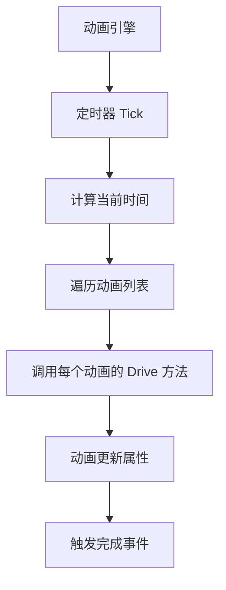
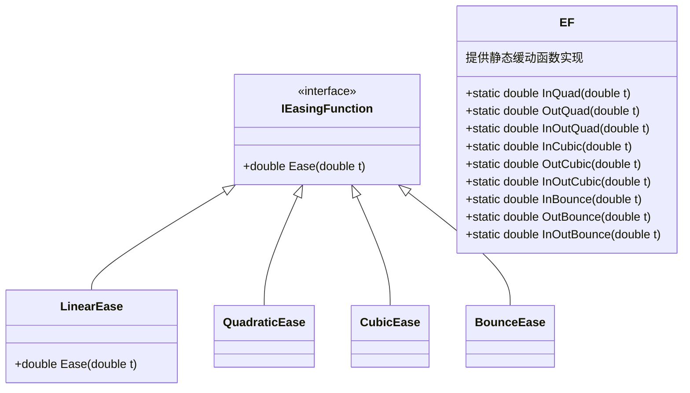
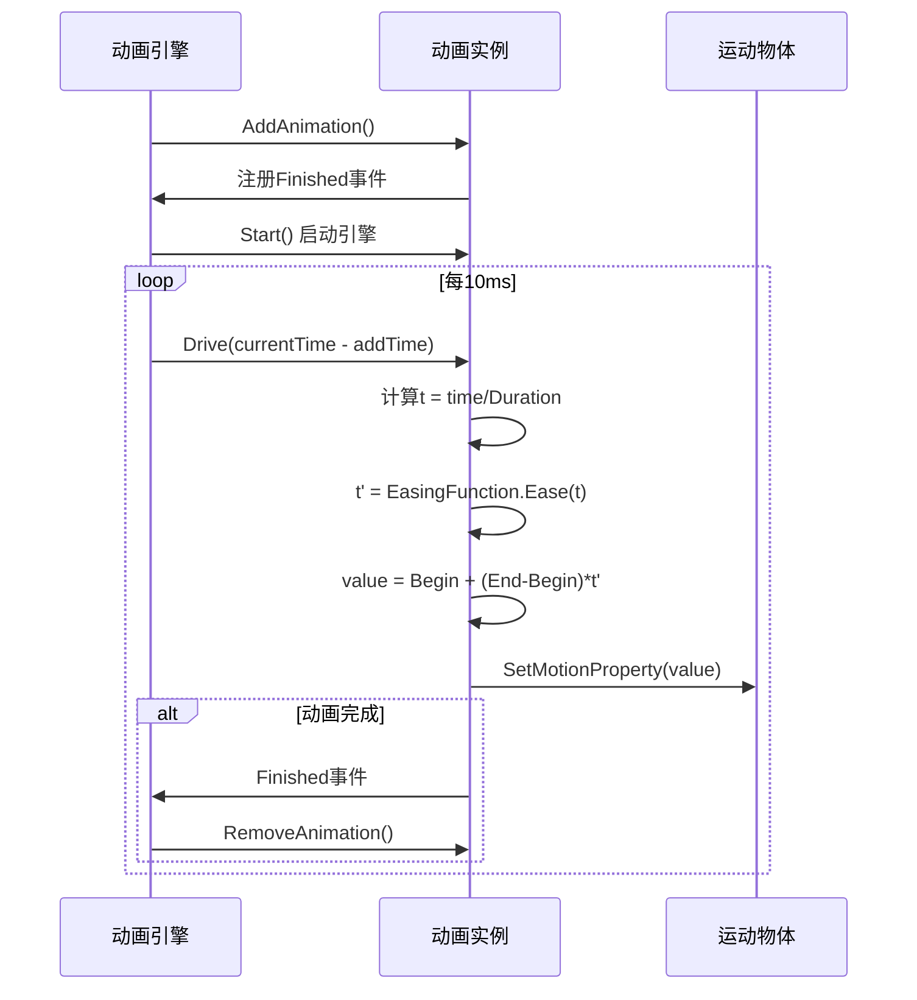
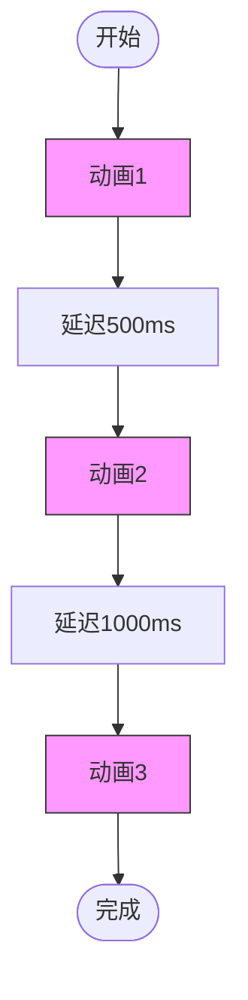
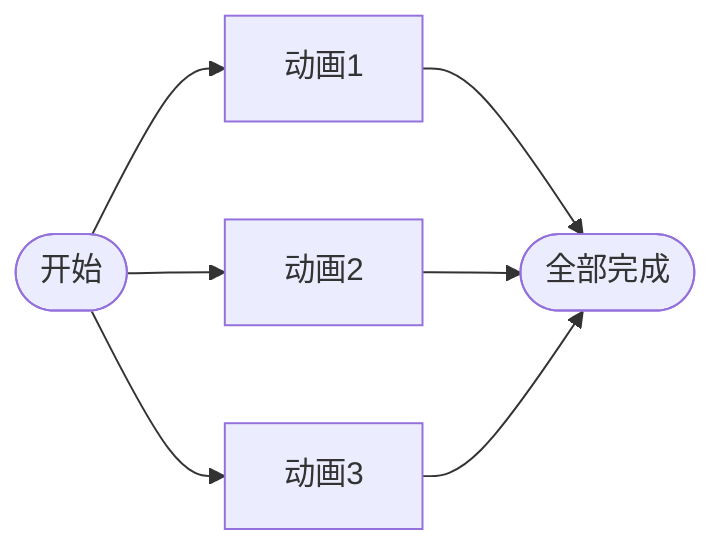
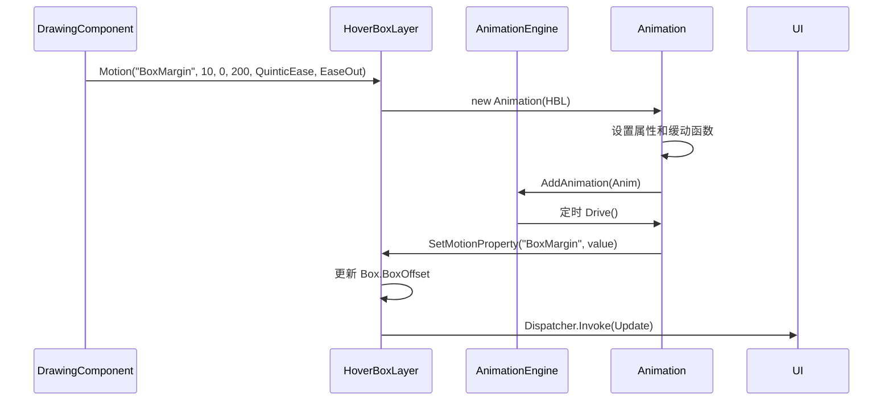

# 动画渲染机制

<cite>
**本文档引用文件**  
- [AnimationEngine.cs](file://XLib.Animate/AnimationEngine.cs)
- [Animation.cs](file://XLib.Animate/Animation.cs)
- [AnimationGroup.cs](file://XLib.Animate/AnimationGroup.cs)
- [AnimationQueue.cs](file://XLib.Animate/AnimationQueue.cs)
- [EF.cs](file://XLib.Math/Easing/EF.cs)
- [EasingMode.cs](file://XLib.Math/Easing/EasingMode.cs)
- [EasingType.cs](file://XLib.Math/Easing/EasingType.cs)
- [HoverBoxLayer.cs](file://XNode/SubSystem/NodeEditSystem/Panel/Layer/HoverBoxLayer.cs)
- [DrawingComponent.cs](file://XNode/SubSystem/NodeEditSystem/Panel/Component/DrawingComponent.cs)
</cite>

## 目录
1. [引言](#引言)
2. [动画引擎核心架构](#动画引擎核心架构)
3. [缓动函数与插值计算](#缓动函数与插值计算)
4. [动画生命周期管理](#动画生命周期管理)
5. [动画协调机制：队列与组](#动画协调机制：队列与组)
6. [悬停框动画实现示例](#悬停框动画实现示例)
7. [性能监控与优化策略](#性能监控与优化策略)
8. [结论](#结论)

## 引言
本文系统阐述XNode项目中基于`AnimationEngine`的动画渲染流程。重点解析动画引擎如何驱动悬停框展开、连接线生成过渡、节点高亮等视觉效果，深入剖析缓动函数在动画插值中的应用，并通过具体代码示例展示动画注册、启动与回调的完整生命周期。同时说明动画队列与动画组对复杂动画序列的协调控制机制，最后提供性能监控手段与帧率优化策略。

## 动画引擎核心架构

`AnimationEngine`是整个动画系统的核心驱动器，负责统一调度所有动画的执行。它继承自`ServiceBase`，通过高精度定时器（`HighPrecisionTimer`）以10ms间隔触发驱动逻辑，确保动画的平滑运行。

动画引擎维护一个动画列表（`_animationList`）和动画时间字典（`_animationTimeDict`），记录每个动画的添加时间。在每次驱动周期中，引擎计算当前时间与动画添加时间的差值，并将该时间差传递给每个动画对象进行驱动。



**Diagram sources**
- [AnimationEngine.cs](file://XLib.Animate/AnimationEngine.cs#L50-L110)

**Section sources**
- [AnimationEngine.cs](file://XLib.Animate/AnimationEngine.cs#L1-L111)

## 缓动函数与插值计算

缓动函数（Easing Function）决定了动画的运动曲线，直接影响用户体验。系统通过`EasingType`枚举定义了多种缓动类型，包括线性、二次方、三次方、弹性、弹跳等，并通过`EasingMode`枚举控制缓动模式（缓入、缓出、缓入缓出）。

`EF`类提供了所有缓动函数的静态实现，如`InQuad`、`OutCubic`、`InBounce`等。这些函数接收归一化时间（0~1）作为输入，输出经过曲线变换的时间比例，从而实现非线性的动画效果。



**Diagram sources**
- [EF.cs](file://XLib.Math/Easing/EF.cs#L1-L143)
- [EasingMode.cs](file://XLib.Math/Easing/EasingMode.cs#L1-L14)
- [EasingType.cs](file://XLib.Math/Easing/EasingType.cs#L1-L28)

**Section sources**
- [EF.cs](file://XLib.Math/Easing/EF.cs#L1-L143)
- [EasingMode.cs](file://XLib.Math/Easing/EasingMode.cs#L1-L14)
- [EasingType.cs](file://XLib.Math/Easing/EasingType.cs#L1-L28)

## 动画生命周期管理

动画的生命周期由`Animation`类实现，遵循典型的创建、初始化、驱动、完成、销毁流程。

1. **创建**：指定运动对象（`IMotion`）、属性名、起止值、持续时间、缓动类型和模式。
2. **初始化**：调用`Init()`方法计算差值和时间范围。
3. **驱动**：引擎在每一帧调用`Drive(double time)`方法，根据当前时间计算插值并更新属性。
4. **完成**：当时间超过总时长（含延迟）时，触发`Finished`事件并从引擎中移除。
5. **循环**：若`Loop`属性为`true`，动画将自动重播。



**Diagram sources**
- [Animation.cs](file://XLib.Animate/Animation.cs#L50-L129)

**Section sources**
- [Animation.cs](file://XLib.Animate/Animation.cs#L1-L129)

## 动画协调机制：队列与组

对于复杂动画序列，系统提供了`AnimationQueue`和`AnimationGroup`两种协调机制。

### 动画队列（AnimationQueue）
`AnimationQueue`用于**顺序执行**多个动画。它通过`_timeDict`记录每个动画的时间区间，在驱动时根据当前总时间定位到应执行的动画，并确保动画按序播放。



### 动画组（AnimationGroup）
`AnimationGroup`用于**并行执行**多个动画。它同时驱动所有子动画，并在所有子动画完成后触发自身的`Finished`事件。



**Diagram sources**
- [AnimationQueue.cs](file://XLib.Animate/AnimationQueue.cs#L1-L130)
- [AnimationGroup.cs](file://XLib.Animate/AnimationGroup.cs#L1-L71)

**Section sources**
- [AnimationQueue.cs](file://XLib.Animate/AnimationQueue.cs#L1-L130)
- [AnimationGroup.cs](file://XLib.Animate/AnimationGroup.cs#L1-L71)

## 悬停框动画实现示例

`HoverBoxLayer`是`IMotion`接口的实现类，作为悬停框的动画宿主。当`DrawingComponent`设置`HoverBox`属性时，会调用`Motion`扩展方法启动动画。

```csharp
// 在 DrawingComponent 中
_hoverBoxLayer.Motion("BoxMargin", 10, 0, 200, EasingType.QuinticEase, EasingMode.EaseOut);
```

该调用创建一个`Animation`实例，将`BoxMargin`属性从0插值到10，持续200ms，使用五次方缓出函数。`SetMotionProperty`方法接收插值结果并更新`TargetBox.BoxOffset`，触发UI重绘。



**Diagram sources**
- [HoverBoxLayer.cs](file://XNode/SubSystem/NodeEditSystem/Panel/Layer/HoverBoxLayer.cs#L1-L41)
- [DrawingComponent.cs](file://XNode/SubSystem/NodeEditSystem/Panel/Component/DrawingComponent.cs#L1-L44)

**Section sources**
- [HoverBoxLayer.cs](file://XNode/SubSystem/NodeEditSystem/Panel/Layer/HoverBoxLayer.cs#L1-L41)
- [DrawingComponent.cs](file://XNode/SubSystem/NodeEditSystem/Panel/Component/DrawingComponent.cs#L1-L44)

## 性能监控与优化策略

为避免UI卡顿，系统采用以下性能优化策略：

1. **固定帧率驱动**：动画引擎以10ms（约100FPS）固定间隔驱动，避免频繁重绘。
2. **对象池与复用**：避免在`Drive`方法中创建临时对象，减少GC压力。
3. **动画裁剪**：对不可见区域的动画进行裁剪或降帧处理。
4. **异步更新**：通过`Dispatcher.Invoke`将UI更新调度到UI线程，避免阻塞动画线程。
5. **性能监控**：可通过`Stopwatch`监控单帧动画处理时间，当超过阈值时自动降级动画质量或暂停非关键动画。

建议在复杂场景中使用`AnimationGroup`和`AnimationQueue`组合管理动画，避免大量独立动画同时运行导致性能下降。

## 结论

XNode的动画系统基于`AnimationEngine`构建，通过`IMotion`接口解耦动画逻辑与UI渲染，支持丰富的缓动函数和灵活的动画协调机制。`HoverBoxLayer`等组件展示了如何将动画无缝集成到UI中，实现流畅的交互体验。通过合理的性能监控与优化策略，可确保复杂动画场景下的系统稳定性与响应速度。