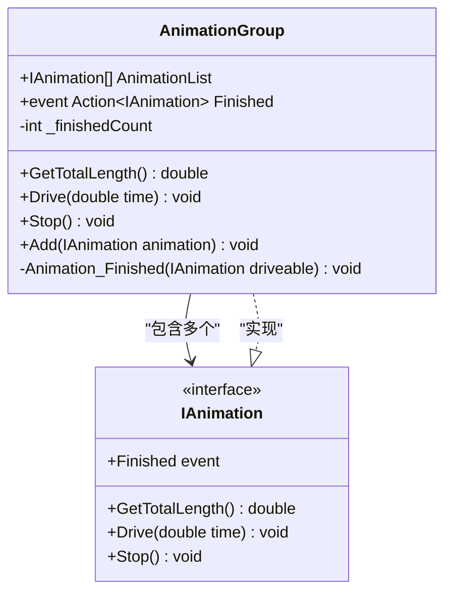
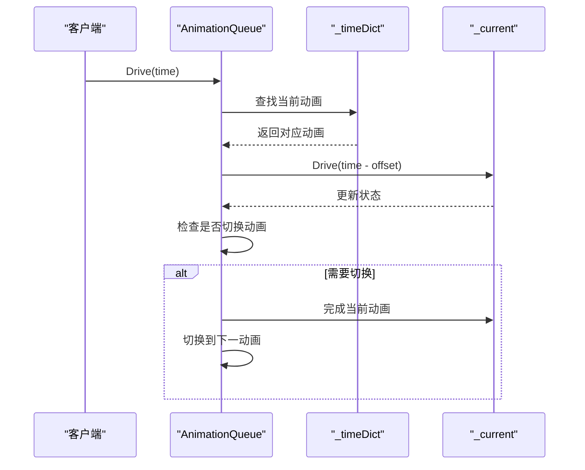
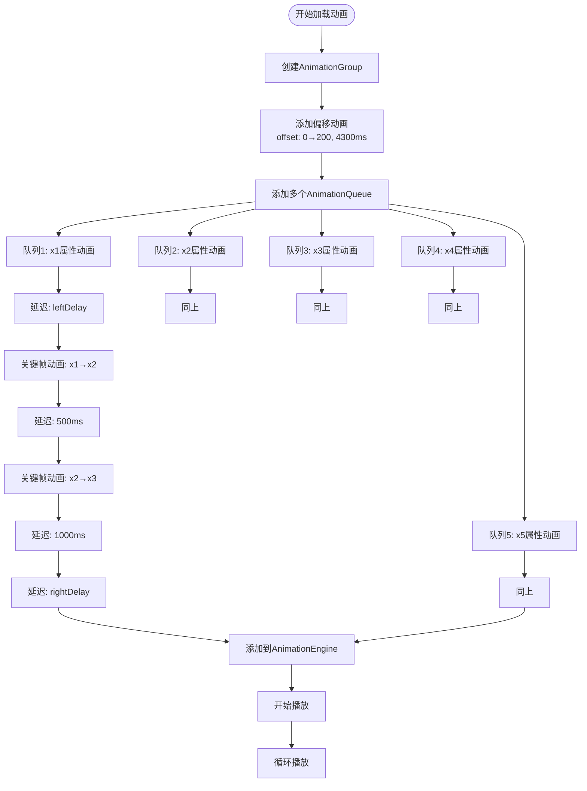
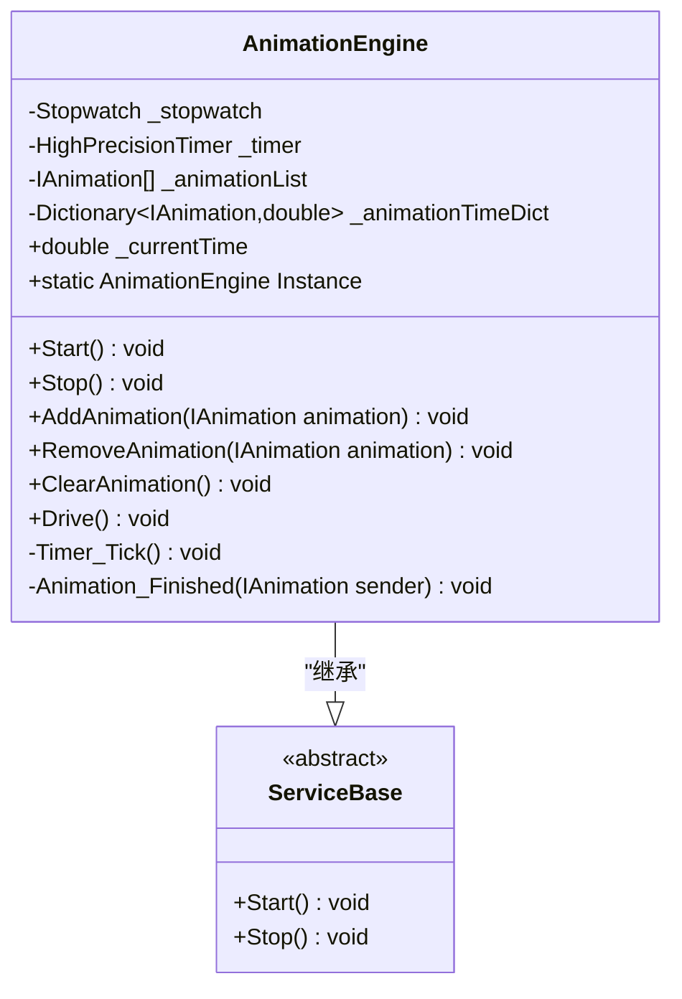

# 动画组合与序列控制

<cite>
**本文档中引用的文件**
- [AnimationGroup.cs](file://XLib.Animate/AnimationGroup.cs)
- [AnimationQueue.cs](file://XLib.Animate/AnimationQueue.cs)
- [IAnimation.cs](file://XLib.Animate/IAnimation.cs)
- [AnimationDelay.cs](file://XLib.Animate/AnimationDelay.cs)
- [Animation.cs](file://XLib.Animate/Animation.cs)
- [IMotion.cs](file://XLib.Animate/IMotion.cs)
- [AnimationEngine.cs](file://XLib.Animate/AnimationEngine.cs)
- [LoadingLayer.cs](file://XLib.Sample/Layer/LoadingLayer.cs)
</cite>

## 目录
1. [简介](#简介)
2. [核心接口设计](#核心接口设计)
3. [AnimationGroup并发动画机制](#animationgroup并发动画机制)
4. [AnimationQueue串行动画机制](#animationqueue串行动画机制)
5. [复合动画的实际应用](#复合动画的实际应用)
6. [动画引擎架构](#动画引擎架构)
7. [性能优化与最佳实践](#性能优化与最佳实践)
8. [故障排除指南](#故障排除指南)
9. [总结](#总结)

## 简介

XNode动画系统提供了两种强大的复合动画机制：AnimationGroup和AnimationQueue。这两种机制分别实现了不同的动画编排策略，为开发者提供了灵活的动画组合能力。

AnimationGroup采用并行执行模型，允许多个动画在同一时间线上同步播放，适用于需要同时改变多个属性的场景。而AnimationQueue则实现了串行执行逻辑，按照预定义的时间顺序依次播放动画，特别适合构建复杂的动画序列和循环指示器。

## 核心接口设计

### IAnimation接口规范

所有动画组件都必须实现IAnimation接口，该接口定义了动画的基本行为规范：

```csharp
public interface IAnimation
{
    /// <summary>动画已完成</summary>
    public event Action<IAnimation> Finished;

    /// <summary>
    /// 获取总时长
    /// </summary>
    public double GetTotalLength();

    /// <summary>
    /// 驱动至指定毫秒
    /// </summary>
    public void Drive(double time);

    /// <summary>
    /// 停止
    /// </summary>
    public void Stop();
}
```

这个统一的接口设计使得AnimationGroup和AnimationQueue能够无缝地组合各种类型的动画，包括基础动画、延迟动画等。

**章节来源**
- [IAnimation.cs](file://XLib.Animate/IAnimation.cs#L1-L26)

## AnimationGroup并发动画机制

### 设计原理

AnimationGroup实现了真正的并行动画执行模型。它将多个动画组织在一起，在同一时间轴上同步播放，所有子动画共享相同的进度参数，但可以独立控制各自的属性变化。



**图表来源**
- [AnimationGroup.cs](file://XLib.Animate/AnimationGroup.cs#L1-L72)
- [IAnimation.cs](file://XLib.Animate/IAnimation.cs#L1-L26)

### 并发控制机制

AnimationGroup的核心创新在于其并发控制机制。通过`_finishedCount`计数器精确跟踪所有子动画的完成状态：

```csharp
private void Animation_Finished(IAnimation driveable)
{
    _finishedCount++;
    // 全部完成时，调用动画组完成
    if (_finishedCount == AnimationList.Count) Finished?.Invoke(this);
}
```

这种设计确保了只有当所有子动画都完成时，整个动画组才会触发完成事件，避免了部分动画未完成就提前结束的问题。

### 使用场景分析

AnimationGroup最适合以下场景：
- **多属性同步变化**：如同时进行位置移动和透明度变化
- **视觉效果增强**：通过组合多个简单动画创建复杂效果
- **资源优化**：减少重复的时间计算，提高渲染效率

**章节来源**
- [AnimationGroup.cs](file://XLib.Animate/AnimationGroup.cs#L1-L72)

## AnimationQueue串行动画机制

### 时间轴管理

AnimationQueue实现了精确的时间轴管理，通过`_timeDict`字典记录每个动画在总时间线上的位置区间：



**图表来源**
- [AnimationQueue.cs](file://XLib.Animate/AnimationQueue.cs#L30-L50)

### 循环模式支持

AnimationQueue提供了完整的循环模式支持，通过取模运算实现无缝循环：

```csharp
public void Drive(double time)
{
    if (Loop && time >= _totalLength) time %= _totalLength;
    if (time >= _totalLength)
    {
        Finished?.Invoke(this);
        return;
    }
    
    // 获取下一个动画
    _next = GetAnimation(time);
    // 切换动画...
}
```

### Init()方法的重要性

AnimationQueue的Init()方法是其正常工作的关键，它负责计算每个动画的时间区间并建立时间映射关系：

```csharp
public void Init()
{
    if (AnimationList.Count == 0) throw new Exception("当前队列没有动画");

    // 计算每个动画的时间段
    double current = 0;
    foreach (var item in AnimationList)
    {
        double itemLength = item.GetTotalLength();
        _timeDict.Add(item, new Range(current, current + itemLength));
        current += itemLength;
        _totalLength += itemLength;
    }
    // 设置第一个动画
    _current = GetAnimation(0);
    // 驱动至初始状态
    BackToStart();
}
```

**章节来源**
- [AnimationQueue.cs](file://XLib.Animate/AnimationQueue.cs#L1-L131)

## 复合动画的实际应用

### LoadingLayer中的动画编排

LoadingLayer展示了AnimationGroup和AnimationQueue的完美结合，创建了一个复杂的循环加载动画：



**图表来源**
- [LoadingLayer.cs](file://XLib.Sample/Layer/LoadingLayer.cs#L15-L35)

### 动画队列构建示例

CreatQueue方法展示了如何组合AnimationDelay与关键帧动画构建复杂的时间序列：

```csharp
private AnimationQueue CreatQueue(string property, double leftDelay, double x1, double x2, double x3, double rightDelay)
{
    AnimationQueue queue = new AnimationQueue { Loop = true };
    queue.AnimationList.Add(new AnimationDelay { Duration = leftDelay });
    queue.AnimationList.Add(this.CreateAnimation(property, x1, x2, 1000, EasingType.QuinticEase, EasingMode.EaseOut));
    queue.AnimationList.Add(new AnimationDelay { Duration = 500 });
    queue.AnimationList.Add(this.CreateAnimation(property, x2, x3, 1000, EasingType.QuinticEase, EasingMode.EaseIn));
    queue.AnimationList.Add(new AnimationDelay { Duration = 1000 });
    queue.AnimationList.Add(new AnimationDelay { Duration = rightDelay });
    queue.Init();
    return queue;
}
```

这种模式允许开发者精确控制每个动画片段的时序，包括延迟、关键帧变化和过渡效果。

**章节来源**
- [LoadingLayer.cs](file://XLib.Sample/Layer/LoadingLayer.cs#L1-L101)

## 动画引擎架构

### AnimationEngine单例模式

AnimationEngine采用了单例模式，确保整个应用程序只有一个动画调度器：



**图表来源**
- [AnimationEngine.cs](file://XLib.Animate/AnimationEngine.cs#L1-L112)

### 时间同步机制

AnimationEngine通过高精度计时器和秒表实现精确的时间同步：

```csharp
public void Drive()
{
    _currentTime = _stopwatch.DoubleMs();
    foreach (var item in _animationList)
        item.Drive(_currentTime - _animationTimeDict[item]);
}
```

这种设计确保了所有动画都能基于相同的时间基准运行，避免了不同动画之间的时间偏差。

**章节来源**
- [AnimationEngine.cs](file://XLib.Animate/AnimationEngine.cs#L1-L112)

## 性能优化与最佳实践

### 内存管理优化

1. **对象池化**：对于频繁创建的动画对象，建议实现对象池以减少GC压力
2. **及时清理**：使用完毕后应立即调用Stop()方法释放资源
3. **批量操作**：尽可能使用AnimationGroup批量添加相关动画

### 最佳实践建议

1. **Init()方法调用**：始终在添加AnimationQueue到引擎前调用Init()方法
2. **循环动画设计**：合理设置Loop属性，避免不必要的内存占用
3. **延迟优化**：使用AnimationDelay而非直接Sleep来节省CPU资源
4. **嵌套组合**：利用AnimationGroup和AnimationQueue的嵌套特性创建复杂动画序列

### 性能监控

建议在开发过程中监控以下指标：
- 动画数量对帧率的影响
- 内存分配和回收频率
- CPU使用率的变化趋势

## 故障排除指南

### 常见问题诊断

1. **AnimationQueue不工作**
   - 检查是否调用了Init()方法
   - 验证AnimationList是否包含有效动画
   - 确认Loop属性设置正确

2. **AnimationGroup未完成**
   - 检查所有子动画是否都有正确的Finished事件处理
   - 验证_add()方法是否被正确调用
   - 确认_timeDict字典是否完整

3. **时间同步问题**
   - 检查AnimationEngine是否正常启动
   - 验证Stopwatch是否正确计时
   - 确认Timer_Tick事件是否正常触发

### 调试技巧

1. **启用调试输出**：在关键方法中添加Trace.WriteLine语句
2. **时间断点**：在特定时间点检查动画状态
3. **状态快照**：定期保存动画状态用于问题重现

**章节来源**
- [AnimationQueue.cs](file://XLib.Animate/AnimationQueue.cs#L50-L70)
- [AnimationGroup.cs](file://XLib.Animate/AnimationGroup.cs#L50-L70)

## 总结

XNode动画系统的AnimationGroup和AnimationQueue为开发者提供了强大而灵活的动画编排能力。AnimationGroup通过并行执行模型实现了高效的多属性同步变化，而AnimationQueue则通过精确的时间轴管理支持复杂的串行动画序列。

这两种机制的结合使用，再加上AnimationEngine的统一调度，构成了一个完整的动画解决方案。通过合理的架构设计和性能优化，这套系统能够满足从简单的UI过渡到复杂的交互动画的各种需求。

在实际应用中，开发者应该根据具体的动画需求选择合适的组合方式，充分利用Init()方法的初始化功能，并遵循最佳实践来确保动画的流畅性和性能。