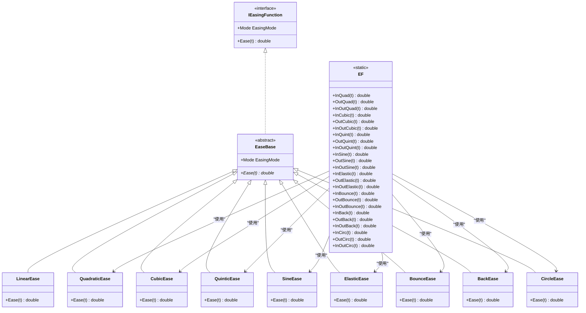
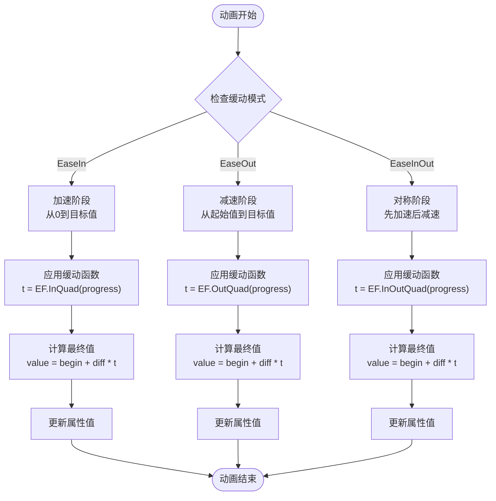
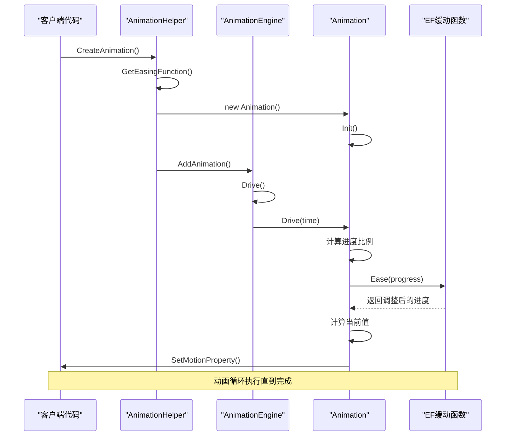

# 缓动函数与运动曲线

<cite>
**本文档引用的文件**
- [EF.cs](file://XLib.Math\Easing\EF.cs)
- [EasingType.cs](file://XLib.Math\Easing\EasingType.cs)
- [EasingMode.cs](file://XLib.Math\Easing\EasingMode.cs)
- [IEasingFunction.cs](file://XLib.Math\Easing\IEasingFunction.cs)
- [Animation.cs](file://XLib.Animate\Animation.cs)
- [AnimationEngine.cs](file://XLib.Animate\AnimationEngine.cs)
- [AnimationHelper.cs](file://XLib.Animate\AnimationHelper.cs)
- [LoadingLayer.cs](file://XLib.Sample\Layer\LoadingLayer.cs)
- [HoverBoxLayer.cs](file://XNode\SubSystem\NodeEditSystem\Panel\Layer\HoverBoxLayer.cs)
</cite>

## 目录
1. [简介](#简介)
2. [缓动函数架构概览](#缓动函数架构概览)
3. [核心缓动类型详解](#核心缓动类型详解)
4. [缓动模式与数学模型](#缓动模式与数学模型)
5. [动画系统集成](#动画系统集成)
6. [实际应用案例](#实际应用案例)
7. [性能优化与最佳实践](#性能优化与最佳实践)
8. [故障排除指南](#故障排除指南)
9. [总结](#总结)

## 简介

EF类是XNode框架中提供的强大静态缓动函数库，专门用于动画插值计算。该库通过一系列精心设计的数学函数，为UI元素提供了平滑、自然的运动曲线，使动画效果更加生动和专业。缓动函数的核心思想是通过非线性变换调整动画进度值，创造出符合人类视觉感知习惯的运动效果。

## 缓动函数架构概览

EF类采用模块化设计，将不同类型的缓动函数按幂次分类组织，同时支持多种缓动模式以满足不同的动画需求。



**图表来源**
- [EF.cs](file://XLib.Math\Easing\EF.cs#L1-L144)
- [IEasingFunction.cs](file://XLib.Math\Easing\IEasingFunction.cs#L1-L183)

**章节来源**
- [EF.cs](file://XLib.Math\Easing\EF.cs#L1-L144)
- [IEasingFunction.cs](file://XLib.Math\Easing\IEasingFunction.cs#L1-L183)

## 核心缓动类型详解

### 幂次方缓动函数

EF类提供了基于幂次的缓动函数，包括二次方、三次方、四次方和五次方等类型。这些函数通过简单的数学运算实现平滑的加速和减速效果。

#### 二次方缓动 (QuadraticEase)
```csharp
// 内部实现原理
public static double InQuad(double t) => t * t;
public static double OutQuad(double t) => 1 - InQuad(1 - t);
public static double InOutQuad(double t)
{
    if (t < 0.5) return InQuad(t * 2) / 2;
    return 1 - InQuad((1 - t) * 2) / 2;
}
```

#### 三次方缓动 (CubicEase)
三次方缓动提供更明显的加速效果，常用于需要强烈视觉冲击的动画场景。

#### 五次方缓动 (QuinticEase)
五次方缓动是最强烈的幂次缓动，适合需要快速达到最大速度再减速的场景。

### 特殊效果缓动函数

#### 正弦缓动 (SineEase)
基于三角函数的平滑缓动，产生自然的波动效果。

#### 弹性缓动 (ElasticEase)
模拟弹性物体的运动特性，具有振荡效果，适合创造活泼的动画。

#### 弹跳缓动 (BounceEase)
模拟物体碰撞地面后的弹跳效果，增加动画的趣味性和真实感。

#### 后退缓动 (BackEase)
产生轻微的反向运动效果，常用于强调动作的开始或结束。

#### 圆形缓动 (CircleEase)
基于圆周运动的缓动，提供独特的视觉效果。

**章节来源**
- [EF.cs](file://XLib.Math\Easing\EF.cs#L10-L144)

## 缓动模式与数学模型

缓动模式定义了动画的运动方向和特性，共有三种基本模式：

### 缓入模式 (EaseIn)
- **特点**: 动画从静止开始，逐渐加速
- **数学表达**: 从零点开始的缓动曲线
- **适用场景**: 开始动作、进入效果

### 缓出模式 (EaseOut)
- **特点**: 动画接近终点时逐渐减速
- **数学表达**: 接近终点时的缓动曲线
- **适用场景**: 结束动作、退出效果

### 缓入缓出模式 (EaseInOut)
- **特点**: 动画两端都具有缓动特性
- **数学表达**: 对称的S型曲线
- **适用场景**: 中间过程、过渡效果



**图表来源**
- [Animation.cs](file://XLib.Animate\Animation.cs#L60-L80)

**章节来源**
- [EasingMode.cs](file://XLib.Math\Easing\EasingMode.cs#L5-L13)
- [IEasingFunction.cs](file://XLib.Math\Easing\IEasingFunction.cs#L20-L183)

## 动画系统集成

EF类与XNode动画系统的深度集成，通过AnimationEngine和Animation类实现高效的动画管理。

### 动画引擎架构



**图表来源**
- [AnimationHelper.cs](file://XLib.Animate\AnimationHelper.cs#L10-L77)
- [AnimationEngine.cs](file://XLib.Animate\AnimationEngine.cs#L1-L112)
- [Animation.cs](file://XLib.Animate\Animation.cs#L1-L130)

### 缓动函数选择机制

AnimationHelper类提供了智能的缓动函数选择机制，根据EasingType和EasingMode参数动态创建相应的缓动函数实例。

```csharp
private static IEasingFunction GetEasingFunction(EasingType type, EasingMode mode)
{
    return type switch
    {
        EasingType.LinearEase => new LinearEase { Mode = mode },
        EasingType.QuadraticEase => new QuadraticEase { Mode = mode },
        EasingType.CubicEase => new CubicEase { Mode = mode },
        EasingType.QuarticEase => new QuarticEase { Mode = mode },
        EasingType.QuinticEase => new QuinticEase { Mode = mode },
        EasingType.SineEase => new SineEase { Mode = mode },
        EasingType.ElasticEase => new ElasticEase { Mode = mode },
        EasingType.BounceEase => new BounceEase { Mode = mode },
        EasingType.BackEase => new BackEase { Mode = mode },
        EasingType.CircleEase => new CircleEase { Mode = mode },
        _ => throw new Exception("创建缓动函数失败"),
    };
}
```

**章节来源**
- [AnimationHelper.cs](file://XLib.Animate\AnimationHelper.cs#L50-L77)
- [Animation.cs](file://XLib.Animate\Animation.cs#L1-L130)

## 实际应用案例

### LoadingLayer中的缓动应用

LoadingLayer展示了EF类在实际项目中的典型应用，特别是在复杂动画序列中的使用。

```csharp
// 创建动画队列，使用QuinticEase + EaseOut
queue.AnimationList.Add(this.CreateAnimation(property, x1, x2, 1000, 
    EasingType.QuinticEase, EasingMode.EaseOut));
```

这个例子中，QuinticEase配合EaseOut模式用于：
- **视觉效果**: 提供强烈的加速效果，使动画看起来更加生动
- **性能考虑**: 五次方函数虽然计算复杂度较高，但在短时间内的动画中影响有限
- **用户体验**: 明显的加速减速效果符合用户对快速响应的预期

### HoverBoxLayer中的属性控制

虽然HoverBoxLayer没有直接使用复杂的缓动函数，但它展示了IMotion接口的实现方式，为缓动函数的应用提供了基础框架。

```csharp
public void SetMotionProperty(string propertyName, double value)
{
    if (Box == null) return;
    switch (propertyName)
    {
        case "BoxMargin":
            Box.BoxOffset = value;
            break;
    }
    Dispatcher.Invoke(Update);
}
```

这种设计允许任何实现了IMotion接口的类都可以无缝地使用EF类提供的缓动功能。

**章节来源**
- [LoadingLayer.cs](file://XLib.Sample\Layer\LoadingLayer.cs#L25-L35)
- [HoverBoxLayer.cs](file://XNode\SubSystem\NodeEditSystem\Panel\Layer\HoverBoxLayer.cs#L25-L35)

## 性能优化与最佳实践

### 缓动类型选择建议

#### EaseOut模式推荐
- **适用场景**: 导航菜单展开、模态对话框显示、页面切换
- **原因**: 用户期望看到内容快速出现，然后平稳停止
- **性能优势**: 减少计算量，提升响应速度

#### EaseInOut模式推荐
- **适用场景**: 页面内元素移动、状态切换动画、过渡效果
- **原因**: 对称的缓动特性提供平衡的视觉体验
- **性能优势**: 平衡了动画质量和计算效率

#### 特殊效果缓动
- **ElasticEase**: 适合欢迎动画、游戏界面
- **BounceEase**: 适合儿童教育应用、娱乐界面
- **BackEase**: 适合强调动作的开始或结束

### 性能对比分析

| 缓动类型 | 计算复杂度 | 内存占用 | 推荐场景 |
|---------|-----------|----------|----------|
| LinearEase | O(1) | 最小 | 简单过渡、调试 |
| QuadraticEase | O(1) | 小 | 基础动画 |
| CubicEase | O(1) | 小 | 中等复杂度动画 |
| QuinticEase | O(1) | 中等 | 高质量动画 |
| SineEase | O(log n) | 中等 | 自然波动效果 |
| ElasticEase | O(log n) | 大 | 活泼效果 |
| BounceEase | O(n) | 大 | 趣味性动画 |

### 可读性优化提示

1. **命名规范**: 使用描述性的变量名，如`progress`代替`t`
2. **注释说明**: 为复杂的缓动公式添加数学解释
3. **常量定义**: 将重复使用的参数提取为常量
4. **错误处理**: 添加边界条件检查和异常处理

```csharp
// 推荐的缓动函数使用方式
public static double SmoothEase(double progress, EasingType type, EasingMode mode)
{
    if (progress < 0 || progress > 1)
        throw new ArgumentOutOfRangeException(nameof(progress), "进度值必须在0-1范围内");
        
    var easingFunc = GetEasingFunction(type, mode);
    return easingFunc.Ease(progress);
}
```

## 故障排除指南

### 常见问题与解决方案

#### 1. 动画不流畅
**症状**: 动画过程中出现卡顿或跳跃现象
**原因**: 
- 缓动函数计算过于复杂
- 主线程被阻塞
- 动画频率设置不当

**解决方案**:
```csharp
// 使用简单缓动函数
animation.EasingFunction = new LinearEase();

// 或降低动画频率
_timer.Interval = 16; // 约60fps
```

#### 2. 过度缓动导致效果不明显
**症状**: 动画变化幅度太小，难以察觉
**原因**: 
- 缓动强度过大
- 起始值和结束值差异过小
- 时间间隔过短

**解决方案**:
```csharp
// 增加值范围或延长动画时间
animation.BeginValue = 0;
animation.EndValue = 100; // 增大变化范围
animation.Duration = 2000; // 延长动画时间
```

#### 3. 缓动函数选择错误
**症状**: 动画效果不符合预期
**原因**: 
- 错误选择了缓动类型
- 忽略了缓动模式的影响

**解决方案**:
```csharp
// 根据具体需求选择合适的缓动模式
if (需要快速开始) {
    animation.EasingFunction = new QuinticEase { Mode = EasingMode.EaseIn };
} else if (需要自然停止) {
    animation.EasingFunction = new QuinticEase { Mode = EasingMode.EaseOut };
}
```

**章节来源**
- [Animation.cs](file://XLib.Animate\Animation.cs#L60-L80)

## 总结

EF类作为XNode框架的核心缓动函数库，通过精心设计的数学模型和灵活的接口架构，为开发者提供了强大而易用的动画工具。其主要优势包括：

### 技术优势
1. **完整的缓动类型覆盖**: 从简单的线性到复杂的弹性、弹跳效果
2. **灵活的模式组合**: 支持多种缓动模式的自由组合
3. **高性能实现**: 所有函数均为静态方法，避免实例化开销
4. **深度集成**: 与动画系统无缝集成，提供完整的生命周期管理

### 应用价值
1. **提升用户体验**: 通过自然的运动曲线增强界面交互感
2. **提高开发效率**: 提供统一的API接口，简化动画开发流程
3. **保证一致性**: 统一的缓动标准确保整个应用的视觉风格一致
4. **易于维护**: 清晰的架构设计便于后续扩展和维护

EF类不仅是一个技术工具，更是现代UI设计中不可或缺的美学元素。通过合理运用各种缓动类型和模式，开发者可以创造出既美观又实用的用户界面，显著提升产品的整体品质和用户满意度。