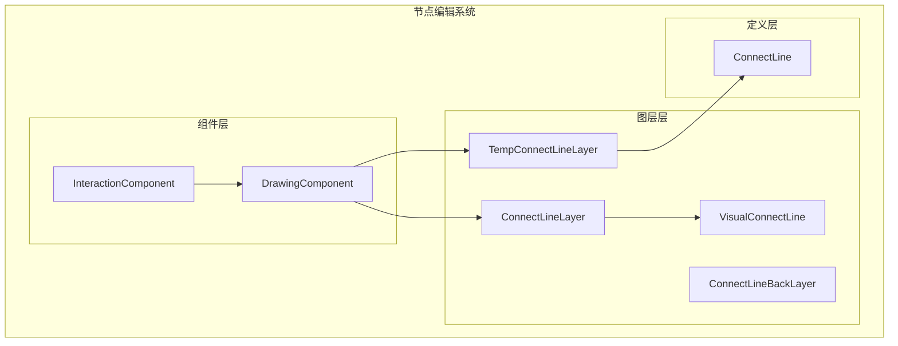
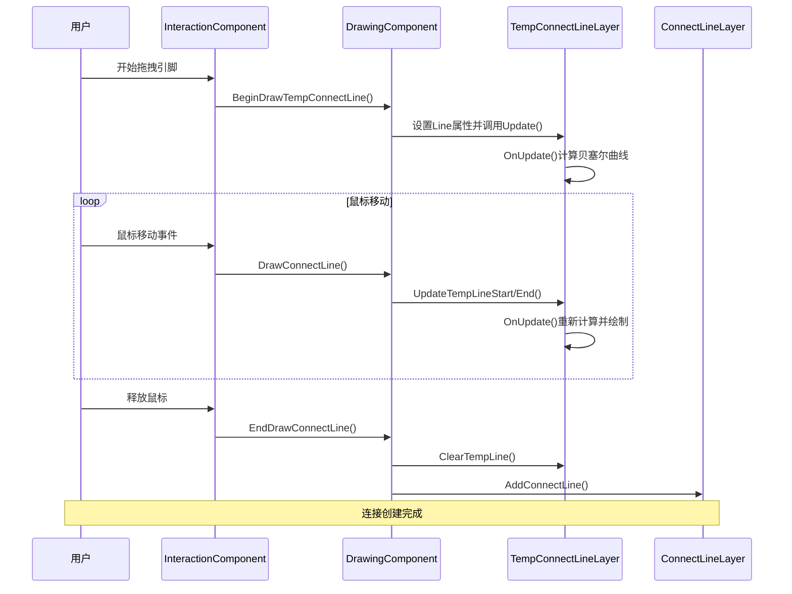
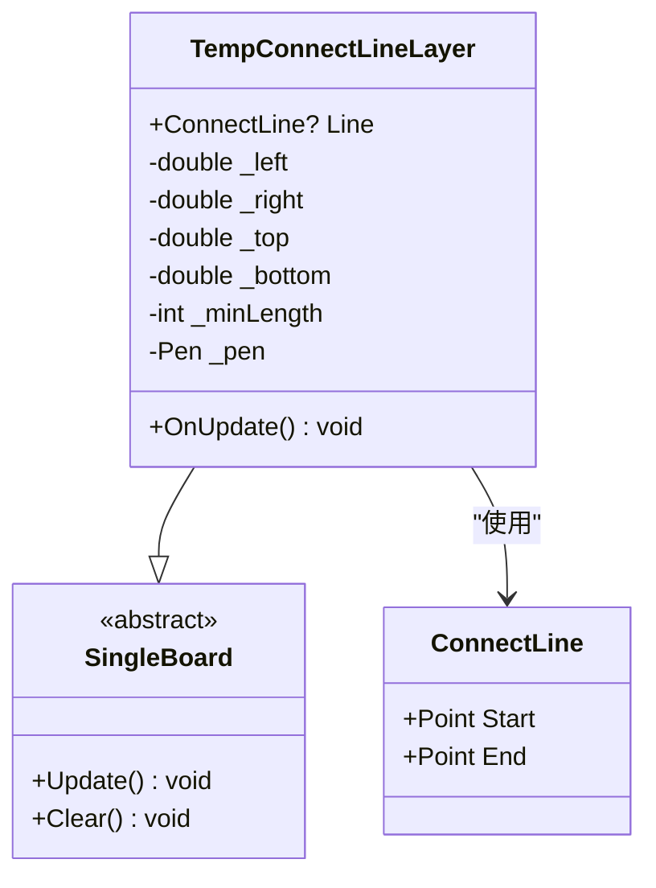
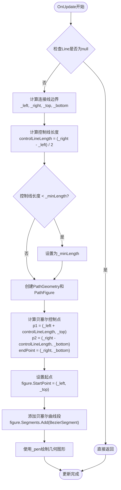
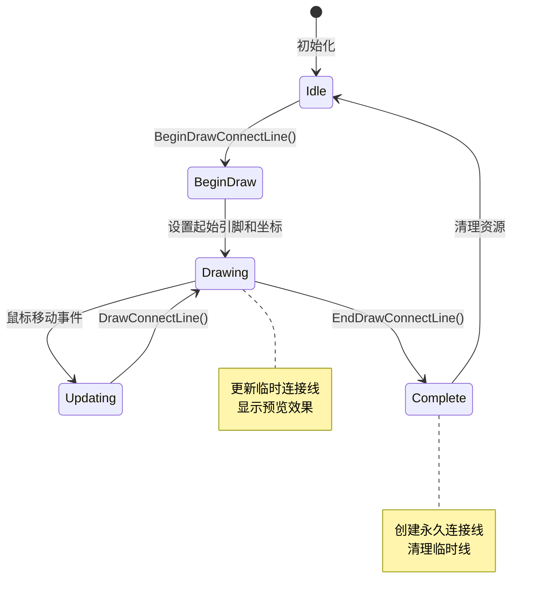
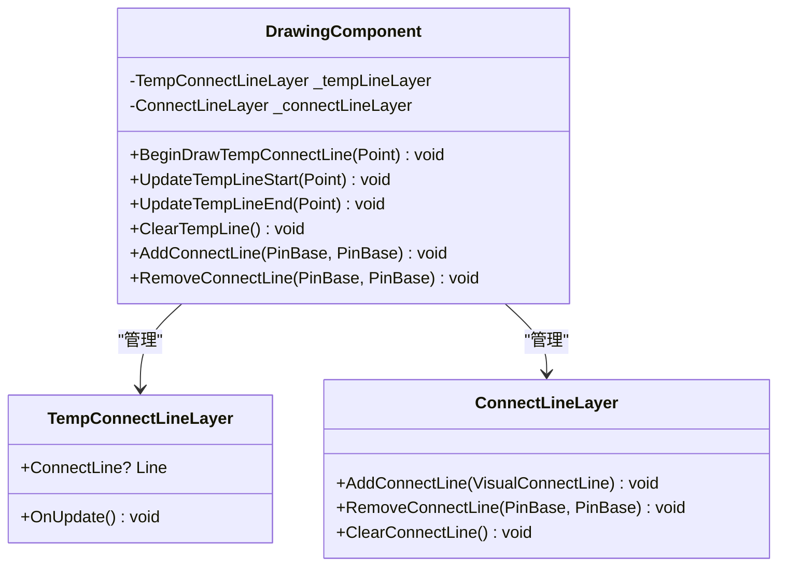
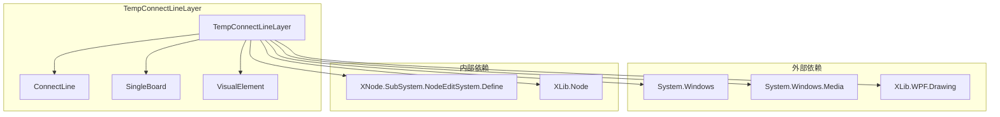

# 临时连接线图层 (TempConnectLineLayer)

<cite>
**本文档引用的文件**
- [TempConnectLineLayer.cs](file://XNode/SubSystem/NodeEditSystem/Panel/Layer/TempConnectLineLayer.cs)
- [VisualConnectLine.cs](file://XNode/SubSystem/NodeEditSystem/Panel/Layer/VisualConnectLine.cs)
- [ConnectLineLayer.cs](file://XNode/SubSystem/NodeEditSystem/Panel/Layer/ConnectLineLayer.cs)
- [ConnectLineBackLayer.cs](file://XNode/SubSystem/NodeEditSystem/Panel/Layer/ConnectLineBackLayer.cs)
- [InteractionComponent.cs](file://XNode/SubSystem/NodeEditSystem/Panel/Component/InteractionComponent.cs)
- [DrawingComponent.cs](file://XNode/SubSystem/NodeEditSystem/Panel/Component/DrawingComponent.cs)
- [ConnectLine.cs](file://XNode/SubSystem/NodeEditSystem/Define/ConnectLine.cs)
</cite>

## 目录
1. [简介](#简介)
2. [项目结构](#项目结构)
3. [核心组件](#核心组件)
4. [架构概览](#架构概览)
5. [详细组件分析](#详细组件分析)
6. [依赖关系分析](#依赖关系分析)
7. [性能考虑](#性能考虑)
8. [故障排除指南](#故障排除指南)
9. [结论](#结论)

## 简介

TempConnectLineLayer是XNode节点编辑器系统中的关键组件，负责在用户拖拽引脚创建新连接时提供动态的临时连接线绘制功能。该组件通过实时响应鼠标移动事件，为用户提供直观的连接预览效果，显著提升了用户体验和交互效率。

该组件的核心职责包括：
- 实时计算和绘制贝塞尔曲线连接线
- 响应鼠标移动事件动态更新连接线路径
- 提供视觉反馈的临时连接线预览
- 与InteractionComponent紧密协作完成连接创建流程
- 在交互结束后正确清理资源

## 项目结构

TempConnectLineLayer位于XNode项目的层次化架构中，作为节点编辑系统的可视化组件之一：



**图表来源**
- [InteractionComponent.cs](file://XNode/SubSystem/NodeEditSystem/Panel/Component/InteractionComponent.cs#L1-L50)
- [DrawingComponent.cs](file://XNode/SubSystem/NodeEditSystem/Panel/Component/DrawingComponent.cs#L1-L50)
- [TempConnectLineLayer.cs](file://XNode/SubSystem/NodeEditSystem/Panel/Layer/TempConnectLineLayer.cs#L1-L20)

## 核心组件

TempConnectLineLayer继承自SingleBoard类，是一个专门用于绘制临时连接线的可视化组件。其核心特性包括：

### 主要属性和字段

- **Line属性**: 存储当前的临时连接线对象，支持null值表示未激活状态
- **最小控制线长度**: 固定为40像素，确保连接线具有足够的视觉表现力
- **画笔配置**: 使用白色实线画笔，透明度为255，宽度为1像素

### 关键方法

- **OnUpdate()**: 重写的更新方法，负责计算贝塞尔曲线并绘制连接线
- **Clear()**: 清理临时连接线的方法，由DrawingComponent调用

**章节来源**
- [TempConnectLineLayer.cs](file://XNode/SubSystem/NodeEditSystem/Panel/Layer/TempConnectLineLayer.cs#L10-L60)

## 架构概览

TempConnectLineLayer在整个节点编辑系统中扮演着桥梁的角色，连接用户交互和最终连接线创建：



**图表来源**
- [InteractionComponent.cs](file://XNode/SubSystem/NodeEditSystem/Panel/Component/InteractionComponent.cs#L300-L350)
- [DrawingComponent.cs](file://XNode/SubSystem/NodeEditSystem/Panel/Component/DrawingComponent.cs#L117-L165)

## 详细组件分析

### TempConnectLineLayer类分析

TempConnectLineLayer类是临时连接线的核心实现，采用单板设计模式：



**图表来源**
- [TempConnectLineLayer.cs](file://XNode/SubSystem/NodeEditSystem/Panel/Layer/TempConnectLineLayer.cs#L10-L60)
- [ConnectLine.cs](file://XNode/SubSystem/NodeEditSystem/Define/ConnectLine.cs#L6-L13)

#### 动态绘制算法

TempConnectLineLayer的核心功能是实时计算和绘制贝塞尔曲线连接线：



**图表来源**
- [TempConnectLineLayer.cs](file://XNode/SubSystem/NodeEditSystem/Panel/Layer/TempConnectLineLayer.cs#L15-L40)

### 与InteractionComponent的协作

InteractionComponent负责管理整个连接创建的生命周期：



**图表来源**
- [InteractionComponent.cs](file://XNode/SubSystem/NodeEditSystem/Panel/Component/InteractionComponent.cs#L280-L350)

### DrawingComponent协调机制

DrawingComponent作为中央协调器，管理所有图层的交互：



**图表来源**
- [DrawingComponent.cs](file://XNode/SubSystem/NodeEditSystem/Panel/Component/DrawingComponent.cs#L117-L165)
- [ConnectLineLayer.cs](file://XNode/SubSystem/NodeEditSystem/Panel/Layer/ConnectLineLayer.cs#L8-L51)

**章节来源**
- [TempConnectLineLayer.cs](file://XNode/SubSystem/NodeEditSystem/Panel/Layer/TempConnectLineLayer.cs#L1-L60)
- [InteractionComponent.cs](file://XNode/SubSystem/NodeEditSystem/Panel/Component/InteractionComponent.cs#L280-L350)
- [DrawingComponent.cs](file://XNode/SubSystem/NodeEditSystem/Panel/Component/DrawingComponent.cs#L117-L165)

## 依赖关系分析

TempConnectLineLayer的依赖关系体现了清晰的分层架构：



**图表来源**
- [TempConnectLineLayer.cs](file://XNode/SubSystem/NodeEditSystem/Panel/Layer/TempConnectLineLayer.cs#L1-L5)

**章节来源**
- [TempConnectLineLayer.cs](file://XNode/SubSystem/NodeEditSystem/Panel/Layer/TempConnectLineLayer.cs#L1-L60)

## 性能考虑

TempConnectLineLayer在设计时充分考虑了性能优化：

### 渲染优化
- 使用SingleBoard基类减少不必要的重绘
- 只在Line属性非空时才进行渲染计算
- 采用固定画笔对象避免重复创建

### 内存管理
- 最小控制线长度限制防止过度计算
- 及时清理临时连接线避免内存泄漏
- 使用对象池模式复用几何图形对象

### 渲染效率
- 贝塞尔曲线计算简单高效
- 几何图形对象复用提高绘制速度
- 批量更新机制减少界面刷新频率

## 故障排除指南

### 常见问题及解决方案

#### 1. 连接线不显示
**症状**: 拖拽引脚时看不到临时连接线
**可能原因**: 
- Line属性未正确设置
- TempConnectLineLayer未正确初始化
- Update()方法未被调用

**解决方案**:
```csharp
// 确保正确初始化
_tempLineLayer.Line = new ConnectLine { Start = startPoint, End = startPoint };
_tempLineLayer.Update();
```

#### 2. 连接线绘制异常
**症状**: 连接线显示错误或变形
**可能原因**:
- 坐标计算错误
- 控制线长度计算异常
- 几何图形对象状态不一致

**解决方案**:
检查坐标转换和边界计算逻辑，确保Start和End点坐标正确。

#### 3. 性能问题
**症状**: 拖拽时出现卡顿现象
**可能原因**:
- 频繁的重绘操作
- 复杂的几何图形计算
- 内存泄漏导致性能下降

**解决方案**:
- 优化Update()方法的计算逻辑
- 使用异步更新机制
- 定期清理不再使用的资源

**章节来源**
- [TempConnectLineLayer.cs](file://XNode/SubSystem/NodeEditSystem/Panel/Layer/TempConnectLineLayer.cs#L15-L40)
- [InteractionComponent.cs](file://XNode/SubSystem/NodeEditSystem/Panel/Component/InteractionComponent.cs#L300-L350)

## 结论

TempConnectLineLayer作为XNode节点编辑器系统中的关键组件，通过精心设计的架构和高效的算法实现了流畅的临时连接线绘制功能。其主要优势包括：

### 技术优势
- **简洁的设计**: 基于SingleBoard的单板设计模式，职责单一明确
- **高效的渲染**: 采用贝塞尔曲线算法，提供平滑的视觉效果
- **良好的性能**: 通过多种优化策略确保流畅的用户体验

### 架构优势
- **清晰的分层**: 清晰的组件层次结构便于维护和扩展
- **松耦合设计**: 与InteractionComponent和DrawingComponent协作良好
- **可扩展性**: 支持未来功能扩展和定制需求

### 用户体验优势
- **即时反馈**: 实时响应鼠标移动，提供直观的视觉预览
- **流畅交互**: 优化的性能表现确保拖拽过程的流畅性
- **一致性**: 与系统其他组件保持一致的视觉风格

TempConnectLineLayer的成功实现展示了现代UI框架中复杂交互功能的最佳实践，为开发者提供了宝贵的参考价值。其设计理念和实现技巧可以广泛应用于类似的图形编辑器和可视化应用开发中。