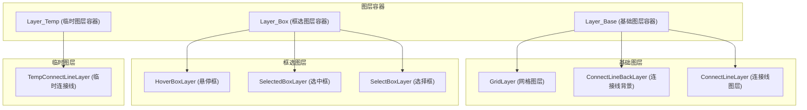
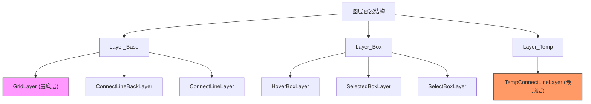
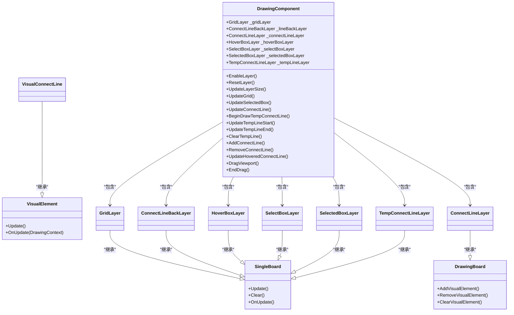
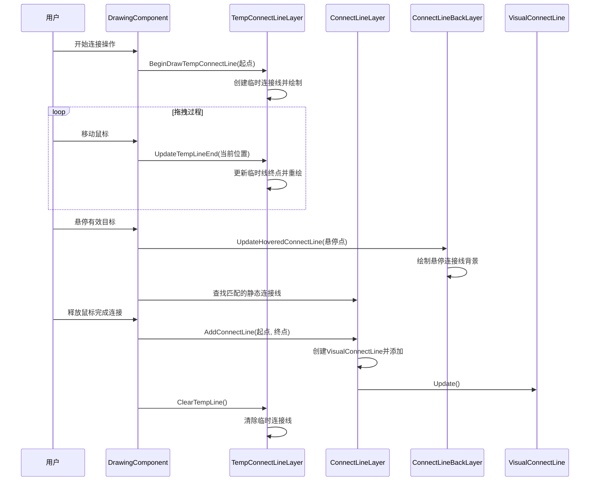

# 图层管理系统

<cite>
**本文档引用文件**  
- [GridLayer.cs](file://XNode/SubSystem/NodeEditSystem/Panel/Layer/GridLayer.cs)
- [ConnectLineLayer.cs](file://XNode/SubSystem/NodeEditSystem/Panel/Layer/ConnectLineLayer.cs)
- [ConnectLineBackLayer.cs](file://XNode/SubSystem/NodeEditSystem/Panel/Layer/ConnectLineBackLayer.cs)
- [TempConnectLineLayer.cs](file://XNode/SubSystem/NodeEditSystem/Panel/Layer/TempConnectLineLayer.cs)
- [VisualConnectLine.cs](file://XNode/SubSystem/NodeEditSystem/Panel/Layer/VisualConnectLine.cs)
- [DrawingComponent.cs](file://XNode/SubSystem/NodeEditSystem/Panel/Component/DrawingComponent.cs)
- [SingleBoard.cs](file://XLib/WPF/Drawing/SingleBoard.cs)
- [DrawingBoard.cs](file://XLib/WPF/Drawing/DrawingBoard.cs)
- [VisualElement.cs](file://XLib/WPF/Drawing/VisualElement.cs)
- [HoverBoxLayer.cs](file://XNode/SubSystem/NodeEditSystem/Panel/Layer/HoverBoxLayer.cs)
- [SelectBoxLayer.cs](file://XNode/SubSystem/NodeEditSystem/Panel/Layer/SelectBoxLayer.cs)
- [SelectedBoxLayer.cs](file://XNode/SubSystem/NodeEditSystem/Panel/Layer/SelectedBoxLayer.cs)
</cite>

## 目录
1. [引言](#引言)
2. [图层架构设计](#图层架构设计)
3. [核心图层功能分析](#核心图层功能分析)
4. [图层叠加顺序控制机制](#图层叠加顺序控制机制)
5. [DrawingComponent统一调度机制](#drawingcomponent统一调度机制)
6. [临时连接线与静态连接线协同流程](#临时连接线与静态连接线协同流程)
7. [自定义图层开发指南](#自定义图层开发指南)
8. [图层渲染异常排查与优化](#图层渲染异常排查与优化)
9. [结论](#结论)

## 引言
本文档全面介绍XNode编辑器中图层管理系统的架构设计与实现细节。系统采用分层绘制架构，通过多个专用图层实现不同视觉元素的分离绘制与高效管理。各图层在编辑器中具有明确的职责划分和视觉层级关系，确保复杂图形界面的清晰呈现与流畅交互。

## 图层架构设计



**图层来源**  
- [DrawingComponent.cs](file://XNode/SubSystem/NodeEditSystem/Panel/Component/DrawingComponent.cs#L239-L276)
- [GridLayer.cs](file://XNode/SubSystem/NodeEditSystem/Panel/Layer/GridLayer.cs#L0-L208)

**本节来源**  
- [DrawingComponent.cs](file://XNode/SubSystem/NodeEditSystem/Panel/Component/DrawingComponent.cs#L239-L276)
- [GridLayer.cs](file://XNode/SubSystem/NodeEditSystem/Panel/Layer/GridLayer.cs#L0-L208)

## 核心图层功能分析

### 网格图层 (GridLayer)
网格图层负责绘制编辑器背景网格，提供坐标参考和对齐辅助。该图层继承自`SingleBoard`，通过`DrawGrid`方法绘制主网格线、细分线和中心十字线。网格尺寸和细分量由`_gridWidth`、`_subdivideWidth`等字段定义。

**本节来源**  
- [GridLayer.cs](file://XNode/SubSystem/NodeEditSystem/Panel/Layer/GridLayer.cs#L0-L208)

### 连接线图层 (ConnectLineLayer)
连接线图层管理所有静态连接线的绘制，继承自`DrawingBoard`，支持多个可视元素。通过`AddConnectLine`、`RemoveConnectLine`等方法管理`VisualConnectLine`对象列表，并负责其生命周期。

**本节来源**  
- [ConnectLineLayer.cs](file://XNode/SubSystem/NodeEditSystem/Panel/Layer/ConnectLineLayer.cs#L0-L51)
- [VisualConnectLine.cs](file://XNode/SubSystem/NodeEditSystem/Panel/Layer/VisualConnectLine.cs#L0-L68)

### 临时连接线图层 (TempConnectLineLayer)
临时连接线图层用于绘制用户拖拽创建连接线时的动态预览线。该图层仅包含一条连接线（由`Line`属性引用），在用户操作过程中实时更新起点和终点位置。

**本节来源**  
- [TempConnectLineLayer.cs](file://XNode/SubSystem/NodeEditSystem/Panel/Layer/TempConnectLineLayer.cs#L0-L38)

### 悬停框图层 (HoverBoxLayer)
悬停框图层用于高亮显示鼠标悬停的节点或区域。实现`IMotion`接口，支持动画效果（如`BoxMargin`属性动画），通过`TargetBox.GetPointList`方法获取框体轮廓点并绘制。

**本节来源**  
- [HoverBoxLayer.cs](file://XNode/SubSystem/NodeEditSystem/Panel/Layer/HoverBoxLayer.cs#L0-L41)

### 选中框图层 (SelectedBoxLayer)
选中框图层用于显示当前选中节点的边界框。维护`BoxList`集合，遍历并绘制每个选中节点的`TargetBox`轮廓，使用橙色边框突出显示。

**本节来源**  
- [SelectedBoxLayer.cs](file://XNode/SubSystem/NodeEditSystem/Panel/Layer/SelectedBoxLayer.cs#L0-L26)

### 选择框图层 (SelectBoxLayer)
选择框图层用于实现框选功能，绘制用户鼠标拖拽形成的选择矩形。根据起点和终点的相对位置使用蓝色或橙色填充，区分普通选择和交叉选择模式。

**本节来源**  
- [SelectBoxLayer.cs](file://XNode/SubSystem/NodeEditSystem/Panel/Layer/SelectBoxLayer.cs#L0-L36)

## 图层叠加顺序控制机制



**图层来源**  
- [DrawingComponent.cs](file://XNode/SubSystem/NodeEditSystem/Panel/Component/DrawingComponent.cs#L239-L276)

**本节来源**  
- [DrawingComponent.cs](file://XNode/SubSystem/NodeEditSystem/Panel/Component/DrawingComponent.cs#L239-L276)

图层的Z-order（叠加顺序）由其在不同容器中的添加顺序决定：
1. **Layer_Base**：包含基础视觉元素，按添加顺序从下到上为：GridLayer → ConnectLineBackLayer → ConnectLineLayer
2. **Layer_Box**：包含各种框体，按添加顺序从下到上为：HoverBoxLayer → SelectedBoxLayer → SelectBoxLayer
3. **Layer_Temp**：包含临时元素，仅包含TempConnectLineLayer，位于最顶层

这种分容器管理的策略确保了不同类别图层的逻辑分离和正确的视觉层级。

## DrawingComponent统一调度机制



**图层来源**  
- [DrawingComponent.cs](file://XNode/SubSystem/NodeEditSystem/Panel/Component/DrawingComponent.cs#L0-L387)
- [SingleBoard.cs](file://XLib/WPF/Drawing/SingleBoard.cs#L0-L50)
- [DrawingBoard.cs](file://XLib/WPF/Drawing/DrawingBoard.cs#L0-L47)

**本节来源**  
- [DrawingComponent.cs](file://XNode/SubSystem/NodeEditSystem/Panel/Component/DrawingComponent.cs#L0-L387)

`DrawingComponent`作为图层系统的中央调度器，承担以下核心职责：
- **图层初始化**：通过`EnableLayer`方法创建并注册所有图层实例到相应的容器
- **生命周期管理**：通过`ResetLayer`方法重置所有图层状态
- **尺寸同步**：通过`UpdateLayerSize`方法同步所有图层尺寸与操作区域
- **事件响应**：处理`SizeChanged`等事件，触发相关图层更新
- **绘制调度**：提供统一接口（如`UpdateConnectLine`、`UpdateSelectedBox`）协调各图层的刷新

## 临时连接线与静态连接线协同流程



**图层来源**  
- [DrawingComponent.cs](file://XNode/SubSystem/NodeEditSystem/Panel/Component/DrawingComponent.cs#L117-L165)
- [TempConnectLineLayer.cs](file://XNode/SubSystem/NodeEditSystem/Panel/Layer/TempConnectLineLayer.cs#L0-L38)
- [ConnectLineLayer.cs](file://XNode/SubSystem/NodeEditSystem/Panel/Layer/ConnectLineLayer.cs#L0-L51)

**本节来源**  
- [DrawingComponent.cs](file://XNode/SubSystem/NodeEditSystem/Panel/Component/DrawingComponent.cs#L117-L165)
- [TempConnectLineLayer.cs](file://XNode/SubSystem/NodeEditSystem/Panel/Layer/TempConnectLineLayer.cs#L0-L38)

协同工作流程如下：
1. **开始连接**：调用`BeginDrawTempConnectLine`初始化临时连接线
2. **拖拽过程**：通过`UpdateTempLineEnd`持续更新临时线终点位置
3. **悬停反馈**：当鼠标悬停在有效连接目标上时，`UpdateHoveredConnectLine`激活`ConnectLineBackLayer`显示连接预览
4. **完成连接**：成功连接后，`AddConnectLine`将连接信息持久化到`ConnectLineLayer`，同时`ClearTempLine`清除临时图层
5. **取消连接**：若操作取消，仅需调用`ClearTempLine`即可

## 自定义图层开发指南

### 继承基类
自定义图层应继承`SingleBoard`或`DrawingBoard`基类：
- **SingleBoard**：适用于仅包含单一视觉对象的图层（如网格、单条连接线）
- **DrawingBoard**：适用于包含多个视觉对象的图层（如多条连接线集合）

### 重写OnRender方法
重写`OnUpdate`方法（`SingleBoard`）或`OnUpdate(DrawingContext)`方法（`VisualElement`），在其中使用`DrawingContext`进行绘制操作。

### 注册到DrawingComponent
1. 在`DrawingComponent`中声明图层字段
2. 在`EnableLayer`方法中创建实例并添加到相应容器
3. 实现必要的控制方法以调度图层更新

```csharp
// 示例：自定义图层开发框架
public class CustomLayer : SingleBoard
{
    protected override void OnUpdate()
    {
        // 使用_dc进行绘制
        _dc.DrawLine(pen, start, end);
        // 或使用基类绘制方法
        DrawVertex(_dc, point, size, brush, pen);
    }
}
```

**本节来源**  
- [SingleBoard.cs](file://XLib/WPF/Drawing/SingleBoard.cs#L0-L50)
- [DrawingBoard.cs](file://XLib/WPF/Drawing/DrawingBoard.cs#L0-L47)
- [DrawingComponent.cs](file://XNode/SubSystem/NodeEditSystem/Panel/Component/DrawingComponent.cs#L239-L276)

## 图层渲染异常排查与优化

### 常见异常及排查路径
| 异常现象 | 可能原因 | 排查路径 |
|---------|---------|---------|
| 元素被错误遮挡 | Z-order顺序错误 | 检查图层在容器中的添加顺序 |
| 重绘闪烁 | 频繁全量重绘 | 检查`Update`调用频率，考虑局部更新 |
| 图形错位 | 坐标转换错误 | 检查`GetWorldPoint`/`GetScreenPoint`使用 |
| 性能下降 | 过度绘制 | 检查`OnUpdate`中不必要的绘制操作 |

### 优化建议
1. **减少重绘范围**：在`OnUpdate`中仅重绘变化区域
2. **合理使用冻结对象**：对`Pen`、`Brush`等资源调用`Freeze()`提高性能
3. **批量更新**：避免在循环中频繁调用`Update()`，应在数据准备完成后统一调用
4. **资源复用**：缓存常用的绘图资源，避免重复创建
5. **异步处理**：对于复杂计算，考虑在后台线程处理后更新UI

**本节来源**  
- [GridLayer.cs](file://XNode/SubSystem/NodeEditSystem/Panel/Layer/GridLayer.cs#L0-L208)
- [VisualConnectLine.cs](file://XNode/SubSystem/NodeEditSystem/Panel/Layer/VisualConnectLine.cs#L0-L68)
- [SingleBoard.cs](file://XLib/WPF/Drawing/SingleBoard.cs#L0-L50)

## 结论
XNode的图层管理系统通过清晰的分层架构和统一的调度机制，实现了复杂图形界面的高效管理。系统采用容器化分层策略，确保了正确的视觉层级关系；通过`DrawingComponent`集中调度，保证了各图层的协调工作；临时与静态连接线的协同设计，提供了流畅的用户交互体验。该架构具有良好的扩展性，开发者可基于现有基类轻松创建自定义图层，满足特定需求。