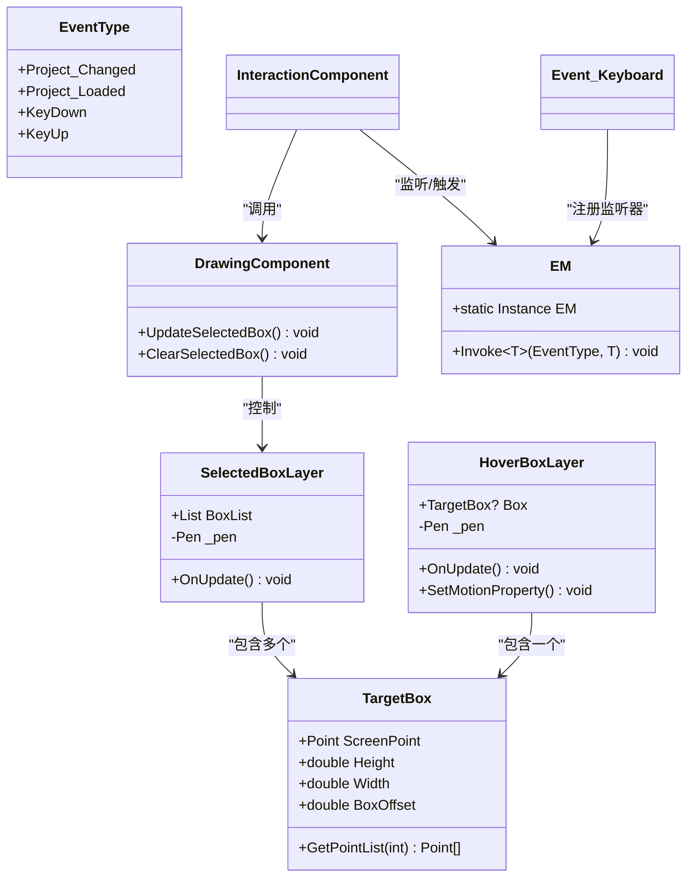

# 已选节点框图层 (SelectedBoxLayer)

<cite>
**本文档引用文件**  
- [SelectedBoxLayer.cs](file://XNode/SubSystem/NodeEditSystem/Panel/Layer/SelectedBoxLayer.cs#L1-L26)
- [HoverBoxLayer.cs](file://XNode/SubSystem/NodeEditSystem/Panel/Layer/HoverBoxLayer.cs#L1-L41)
- [TargetBox.cs](file://XNode/SubSystem/NodeEditSystem/Define/TargetBox.cs#L1-L63)
- [EM.cs](file://XNode/SubSystem/EventSystem/EM.cs#L1-L51)
- [EventType.cs](file://XNode/SubSystem/EventSystem/EventType.cs#L1-L15)
- [DrawingComponent.cs](file://XNode/SubSystem/NodeEditSystem/Panel/Component/DrawingComponent.cs#L41-L86)
</cite>

## 目录
1. [简介](#简介)
2. [核心功能与实现](#核心功能与实现)
3. [多选模式下的边框渲染逻辑](#多选模式下的边框渲染逻辑)
4. [与HoverBoxLayer的视觉优先级关系](#与hoverboxlayer的视觉优先级关系)
5. [事件监听机制（EM事件系统）](#事件监听机制em事件系统)
6. [自定义选中样式配置方式](#自定义选中样式配置方式)
7. [类结构与依赖关系图](#类结构与依赖关系图)

## 简介
`SelectedBoxLayer` 是 XNode 编辑系统中的一个 UI 图层组件，用于在画布上持久显示当前被选中的节点的边界框。该图层通过监听节点选择事件，动态更新其内部的 `BoxList`，从而实现对多个选中节点的可视化反馈。其主要职责是提供清晰、直观的选择状态提示，增强用户交互体验。

## 核心功能与实现

`SelectedBoxLayer` 继承自 `SingleBoard`，作为 WPF 绘图系统的一部分，负责在 `OnUpdate` 方法中遍历 `BoxList` 中的每一个 `TargetBox` 对象，并调用 `GetPointList(15)` 方法生成用于绘制虚线框的坐标点列表。随后，使用预定义的橙色画笔 `_pen` 在绘图上下文 `_dc` 中绘制这些线段。

其核心属性 `BoxList` 是一个 `List<TargetBox>` 类型的集合，存储了所有当前需要高亮显示的选中节点的边界框信息。每当选择状态发生变化时，该列表会被更新，触发图层重绘。

**Section sources**
- [SelectedBoxLayer.cs](file://XNode/SubSystem/NodeEditSystem/Panel/Layer/SelectedBoxLayer.cs#L1-L26)

## 多选模式下的边框渲染逻辑

`SelectedBoxLayer` 天然支持多选模式。其 `BoxList` 属性设计为一个列表，意味着它可以同时容纳多个 `TargetBox` 实例。当用户通过框选（`SelectBoxLayer`）或其他方式选择多个节点时，`DrawingComponent` 会将每个被选中节点对应的 `TargetBox` 添加到 `SelectedBoxLayer` 的 `BoxList` 中。

在 `OnUpdate` 方法中，通过 `foreach` 循环遍历 `BoxList`，为列表中的每一个 `TargetBox` 调用 `GetPointList` 并绘制其边界框。这种设计使得无论单选还是多选，渲染逻辑都保持一致且高效，实现了对多个选中节点的同时高亮。

**Section sources**
- [SelectedBoxLayer.cs](file://XNode/SubSystem/NodeEditSystem/Panel/Layer/SelectedBoxLayer.cs#L10-L16)
- [TargetBox.cs](file://XNode/SubSystem/NodeEditSystem/Define/TargetBox.cs#L1-L63)

## 与HoverBoxLayer的视觉优先级关系

`SelectedBoxLayer` 与 `HoverBoxLayer` 共同管理节点的视觉反馈，但服务于不同的交互状态，且存在明确的视觉优先级。

- **HoverBoxLayer**：负责显示鼠标悬停（Hover）状态下的节点边界框。其画笔 `_pen` 颜色为白色 (`Brushes.White`)，并且 `HoverBoxLayer` 实现了 `IMotion` 接口，支持动画效果（如边框的呼吸效果），提供动态的悬停反馈。
- **SelectedBoxLayer**：负责显示节点被选中（Selected）状态下的边界框。其画笔颜色为醒目的橙色 (`Color.FromRgb(237, 100, 21)`)，样式为静态。

在视觉优先级上，**选中状态高于悬停状态**。这意味着当一个节点被选中后，即使鼠标再次悬停其上，`SelectedBoxLayer` 的橙色边框会覆盖或取代 `HoverBoxLayer` 的白色边框，确保选中状态的视觉反馈最为突出和持久。这种设计避免了状态混淆，保证了用户界面的清晰性。

**Section sources**
- [SelectedBoxLayer.cs](file://XNode/SubSystem/NodeEditSystem/Panel/Layer/SelectedBoxLayer.cs#L24-L26)
- [HoverBoxLayer.cs](file://XNode/SubSystem/NodeEditSystem/Panel/Layer/HoverBoxLayer.cs#L39-L41)

## 事件监听机制（EM事件系统）

`SelectedBoxLayer` 本身不直接监听 EM 事件系统，而是通过 `DrawingComponent` 这一更高层级的组件进行间接管理。其事件监听和更新流程如下：

1.  **事件触发**：当用户进行选择操作（如点击节点或拖拽选框）时，`InteractionComponent` 或 `SelectTool` 会处理这些输入。
2.  **选择逻辑**：`InteractionComponent` 根据操作逻辑（如 `EndDrawSelectBox` 方法）确定哪些节点被选中，并调用 `CardComponent` 的方法更新选中状态。
3.  **触发更新**：选择状态变更后，`InteractionComponent` 会调用 `DrawingComponent.UpdateSelectedBox()` 方法。
4.  **数据同步**：`DrawingComponent` 负责将当前所有被选中节点的屏幕坐标、宽高信息同步到 `SelectedBoxLayer` 的 `BoxList` 中。
5.  **图层重绘**：`BoxList` 更新后，在下一帧的绘制周期中，`SelectedBoxLayer.OnUpdate()` 被调用，从而渲染出新的选中边框。

虽然 `SelectedBoxLayer` 没有直接调用 `EM.Instance.Add()`，但整个选择流程依赖于 EM 事件系统来协调不同组件间的通信。例如，`Project_Changed` 等事件可能间接触发 UI 的整体刷新，从而包含 `SelectedBoxLayer` 的更新。

**Section sources**
- [DrawingComponent.cs](file://XNode/SubSystem/NodeEditSystem/Panel/Component/DrawingComponent.cs#L41-L86)
- [InteractionComponent.cs](file://XNode/SubSystem/NodeEditSystem/Panel/Component/InteractionComponent.cs#L257-L288)
- [EM.cs](file://XNode/SubSystem/EventSystem/EM.cs#L1-L51)
- [EventType.cs](file://XNode/SubSystem/EventSystem/EventType.cs#L1-L15)

## 自定义选中样式配置方式

`SelectedBoxLayer` 的选中样式（颜色、线型）目前是硬编码在类内部的，但可以通过以下方式进行自定义：

1.  **修改源码**：最直接的方式是修改 `SelectedBoxLayer.cs` 文件中的 `_pen` 字段定义。
    ```csharp
    // 原始定义
    private readonly Pen _pen = new Pen(new SolidColorBrush(Color.FromRgb(237, 100, 21)), 1);
    
    // 示例：修改为蓝色、虚线样式
    private readonly Pen _pen = new Pen(new SolidColorBrush(Colors.Blue), 2)
    {
        DashStyle = DashStyles.DashDot
    };
    ```
2.  **扩展设计**：为了实现更灵活的配置，可以对 `SelectedBoxLayer` 进行扩展，例如：
    - 添加公共属性（如 `SelectedColor`、`LineWidth`）。
    - 从配置文件或主题系统中读取样式设置。
    - 在 `Init()` 方法中根据配置动态创建 `_pen` 对象。

尽管当前实现是固定的，但其设计模式为未来的样式自定义提供了清晰的扩展路径。

**Section sources**
- [SelectedBoxLayer.cs](file://XNode/SubSystem/NodeEditSystem/Panel/Layer/SelectedBoxLayer.cs#L26)

## 类结构与依赖关系图



**Diagram sources**
- [SelectedBoxLayer.cs](file://XNode/SubSystem/NodeEditSystem/Panel/Layer/SelectedBoxLayer.cs#L1-L26)
- [HoverBoxLayer.cs](file://XNode/SubSystem/NodeEditSystem/Panel/Layer/HoverBoxLayer.cs#L1-L41)
- [TargetBox.cs](file://XNode/SubSystem/NodeEditSystem/Define/TargetBox.cs#L1-L63)
- [DrawingComponent.cs](file://XNode/SubSystem/NodeEditSystem/Panel/Component/DrawingComponent.cs#L41-L86)
- [EM.cs](file://XNode/SubSystem/EventSystem/EM.cs#L1-L51)
- [EventType.cs](file://XNode/SubSystem/EventSystem/EventType.cs#L1-L15)