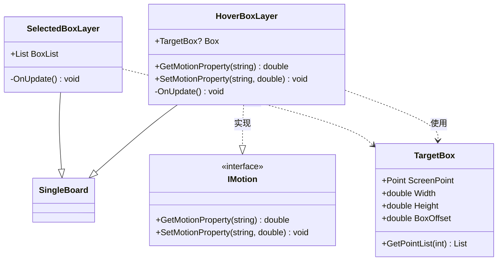
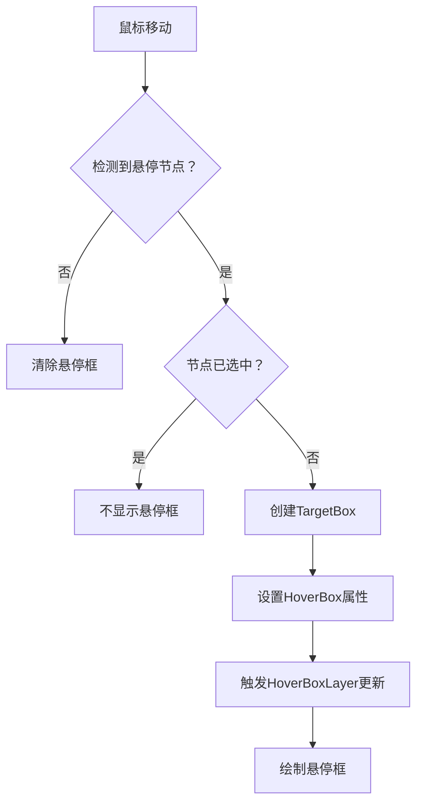
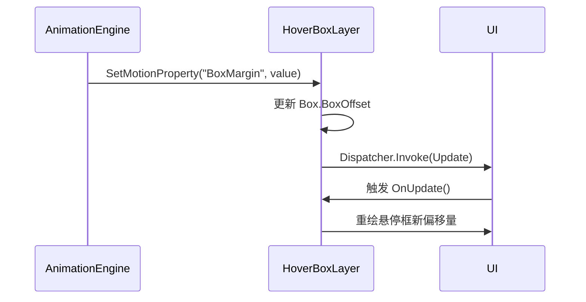

# 悬停框图层 (HoverBoxLayer)

<cite>
**本文档引用的文件**  
- [HoverBoxLayer.cs](file://XNode/SubSystem/NodeEditSystem/Panel/Layer/HoverBoxLayer.cs)
- [TargetBox.cs](file://XNode/SubSystem/NodeEditSystem/Define/TargetBox.cs)
- [SelectedBoxLayer.cs](file://XNode/SubSystem/NodeEditSystem/Panel/Layer/SelectedBoxLayer.cs)
- [InteractionComponent.cs](file://XNode/SubSystem/NodeEditSystem/Panel/Component/InteractionComponent.cs)
- [IMotion.cs](file://XLib.Animate/IMotion.cs)
- [AnimationEngine.cs](file://XLib.Animate/AnimationEngine.cs)
</cite>

## 目录
1. [简介](#简介)
2. [核心功能与实现机制](#核心功能与实现机制)
3. [悬停框显示逻辑与鼠标监听](#悬停框显示逻辑与鼠标监听)
4. [与选中框图层的视觉协调机制](#与选中框图层的视觉协调机制)
5. [动画效果集成与用户体验优化](#动画效果集成与用户体验优化)
6. [扩展性与自定义配置方法](#扩展性与自定义配置方法)
7. [总结](#总结)

## 简介
`HoverBoxLayer` 是 XNode 编辑系统中用于提供鼠标悬停视觉反馈的核心图层组件。该图层负责在用户将鼠标指针悬停于未选中的节点上时，动态绘制一个高亮边框（即“悬停框”），以增强界面的交互感知性。该图层通过实现 `IMotion` 接口，支持与 `XLib.Animate` 动画系统集成，从而实现平滑的淡入淡出等动画效果。同时，它与 `SelectedBoxLayer` 协同工作，确保在节点被选中后不再显示悬停框，避免视觉冲突。

**Section sources**  
- [HoverBoxLayer.cs](file://XNode/SubSystem/NodeEditSystem/Panel/Layer/HoverBoxLayer.cs#L1-L41)

## 核心功能与实现机制
`HoverBoxLayer` 继承自 `SingleBoard`，作为 WPF 绘图板层，负责在画布上绘制悬停视觉反馈。其核心功能包括：

- **悬停框绘制**：通过 `TargetBox` 类定义悬停框的位置、尺寸和偏移量，并调用 `GetPointList(int lineLength)` 方法生成用于绘制“虚线框”效果的坐标点列表。
- **动态更新机制**：重写 `OnUpdate()` 方法，在每次渲染周期中根据当前 `Box` 属性是否存在来决定是否绘制悬停框。
- **动画接口支持**：实现 `IMotion` 接口，允许外部动画系统通过 `SetMotionProperty` 方法动态修改悬停框的属性（如 `BoxMargin`），从而实现动画效果。

**Diagram sources**  
- [HoverBoxLayer.cs](file://XNode/SubSystem/NodeEditSystem/Panel/Layer/HoverBoxLayer.cs#L1-L41)
- [SelectedBoxLayer.cs](file://XNode/SubSystem/NodeEditSystem/Panel/Layer/SelectedBoxLayer.cs#L1-L26)
- [TargetBox.cs](file://XNode/SubSystem/NodeEditSystem/Define/TargetBox.cs#L1-L63)
- [IMotion.cs](file://XLib.Animate/IMotion.cs#L1-L17)

## 悬停框显示逻辑与鼠标监听
悬停框的显示由 `InteractionComponent` 组件驱动，该组件负责监听 `OperateArea` 的 `MouseMove` 事件。其逻辑流程如下：

1. 当鼠标移动时，`InteractionComponent` 检测当前悬停的节点视图（`_hoveredNodeView`）。
2. 若当前无悬停节点，则将 `DrawingComponent` 的 `HoverBox` 属性设为 `null`，并触发更新，使 `HoverBoxLayer` 停止绘制。
3. 若悬停节点存在但已被选中（存在于 `SelectedCardList` 中），则不设置悬停框，避免与选中框重复显示。
4. 若悬停节点未被选中，则创建一个新的 `TargetBox` 实例，设置其屏幕坐标、宽高和偏移量，并赋值给 `DrawingComponent.HoverBox`，触发 `HoverBoxLayer` 的更新与绘制。

此机制确保了悬停反馈仅在必要时显示，提升了界面的清晰度和响应性。

**Diagram sources**  
- [InteractionComponent.cs](file://XNode/SubSystem/NodeEditSystem/Panel/Component/InteractionComponent.cs#L566-L600)

**Section sources**  
- [InteractionComponent.cs](file://XNode/SubSystem/NodeEditSystem/Panel/Component/InteractionComponent.cs#L41-L82)
- [InteractionComponent.cs](file://XNode/SubSystem/NodeEditSystem/Panel/Component/InteractionComponent.cs#L566-L600)

## 与选中框图层的视觉协调机制
为避免视觉冲突，`HoverBoxLayer` 与 `SelectedBoxLayer` 采用互斥显示策略：

- `SelectedBoxLayer` 负责绘制所有被选中节点的高亮边框，其边框颜色为橙红色（RGB: 237, 100, 21）。
- `HoverBoxLayer` 仅在节点未被选中时才显示白色边框。
- 判断逻辑位于 `InteractionComponent` 中，通过检查 `SelectedCardList` 集合来决定是否为悬停节点创建 `TargetBox`。

这种设计确保了用户界面的整洁性，用户可以清晰地区分“悬停”与“选中”两种状态，防止信息过载。

**Section sources**  
- [SelectedBoxLayer.cs](file://XNode/SubSystem/NodeEditSystem/Panel/Layer/SelectedBoxLayer.cs#L1-L26)
- [InteractionComponent.cs](file://XNode/SubSystem/NodeEditSystem/Panel/Component/InteractionComponent.cs#L566-L600)

## 动画效果集成与用户体验优化
`HoverBoxLayer` 通过实现 `IMotion` 接口，无缝集成 `XLib.Animate` 动画系统，从而支持动态的视觉效果：

- **动画属性控制**：`SetMotionProperty` 方法监听 `"BoxMargin"` 属性，当该属性被动画系统修改时，会动态更新 `TargetBox` 的 `BoxOffset` 值，从而实现悬停框从内向外或从外向内的扩展/收缩动画。
- **线程安全更新**：在 `SetMotionProperty` 中，通过 `Dispatcher.Invoke(Update)` 确保 UI 更新在主线程执行，保证线程安全。
- **动画引擎集成**：虽然 `HoverBoxLayer` 本身不直接启动动画，但可通过 `AnimationEngine.Instance.AddAnimation()` 将其加入动画队列，例如实现淡入淡出效果（通过控制透明度或 `BoxOffset` 实现）。

此集成显著提升了用户体验，使视觉反馈更加流畅自然，减少了突兀的显示/隐藏效果。

**Diagram sources**  
- [HoverBoxLayer.cs](file://XNode/SubSystem/NodeEditSystem/Panel/Layer/HoverBoxLayer.cs#L30-L40)
- [IMotion.cs](file://XLib.Animate/IMotion.cs#L1-L17)

## 扩展性与自定义配置方法
`HoverBoxLayer` 的设计具有良好的扩展性，开发者可通过以下方式对其进行自定义：

1. **自定义悬停样式**：
   - 修改 `_pen` 字段的 `Brush` 和 `Thickness`，以改变悬停框的颜色、线型或粗细。
   - 扩展 `TargetBox.GetPointList()` 方法，生成不同样式的边框（如圆角、虚线模式等）。

2. **延迟显示悬停框**：
   - 在 `InteractionComponent` 中引入 `DispatcherTimer`，当鼠标悬停超过一定时间（如 300ms）后才设置 `HoverBox`，避免快速划过节点时的频繁闪烁。
   - 示例代码可在 `UpdateHoverBox` 方法中添加延迟逻辑。

3. **支持更多动画属性**：
   - 在 `SetMotionProperty` 中增加对 `"Opacity"` 或 `"Scale"` 等属性的支持，结合 `XLib.Animate` 实现更丰富的动画效果。

这些扩展点使得 `HoverBoxLayer` 能够适应不同的 UI 设计需求，提升应用的个性化和专业性。

**Section sources**  
- [HoverBoxLayer.cs](file://XNode/SubSystem/NodeEditSystem/Panel/Layer/HoverBoxLayer.cs#L30-L40)
- [InteractionComponent.cs](file://XNode/SubSystem/NodeEditSystem/Panel/Component/InteractionComponent.cs#L566-L600)

## 总结
`HoverBoxLayer` 作为 XNode 编辑器中关键的交互反馈组件，通过高效的鼠标事件监听、与 `SelectedBoxLayer` 的协调机制以及 `XLib.Animate` 动画系统的深度集成，实现了流畅、清晰的悬停视觉反馈。其模块化设计和接口化实现不仅保证了代码的可维护性，也为未来的功能扩展提供了坚实的基础。通过合理的自定义配置，开发者可以进一步优化用户体验，打造更加专业和直观的节点编辑界面。