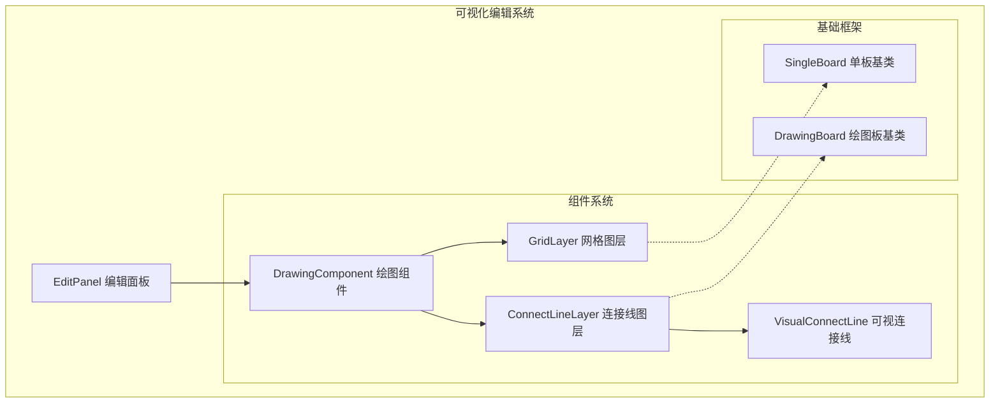
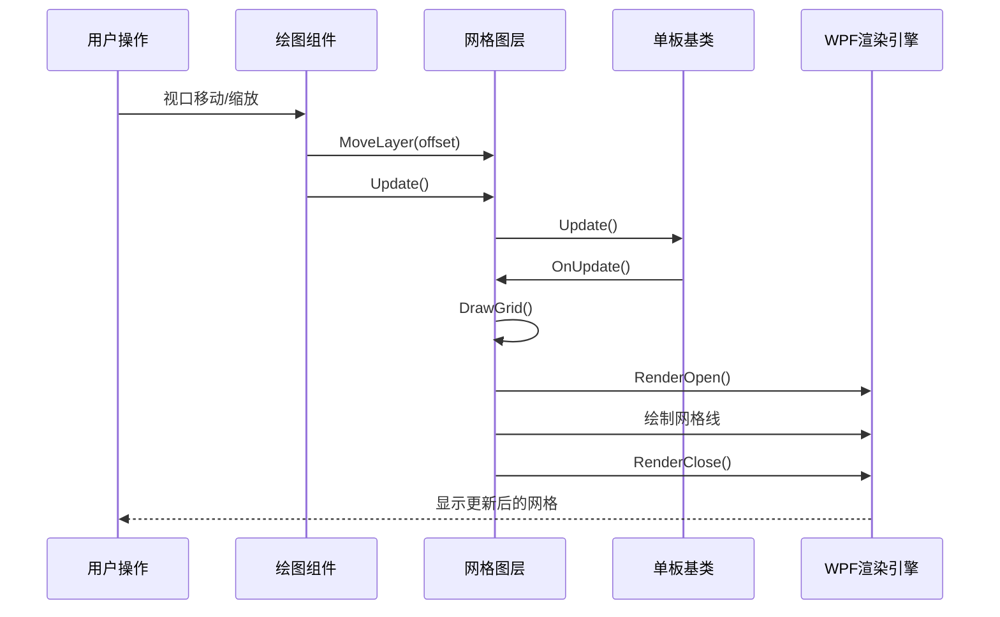
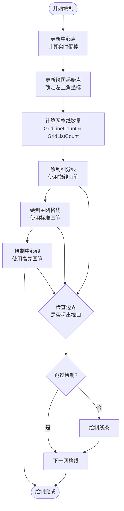
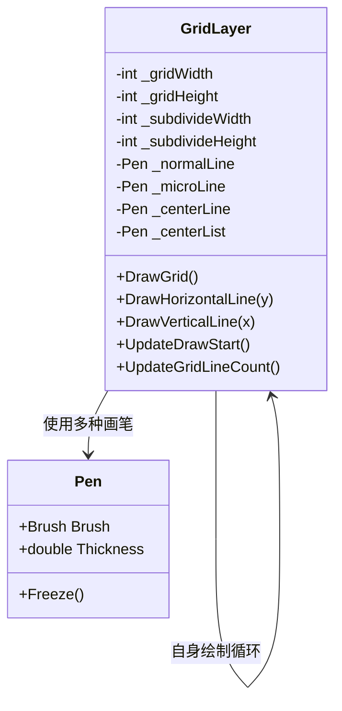
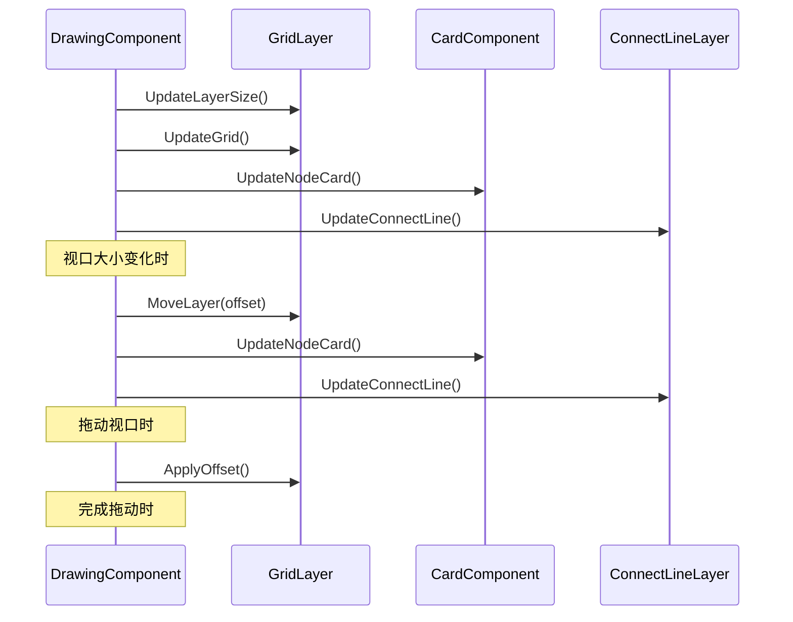
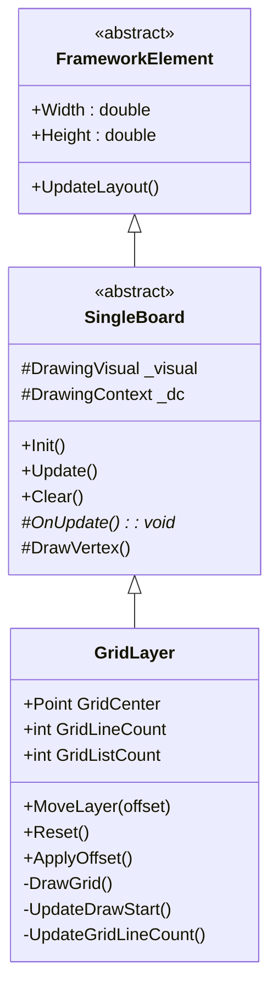

# 网格图层 (GridLayer) 可视化编辑器组件文档

<cite>
**本文档引用的文件**
- [GridLayer.cs](file://XNode/SubSystem/NodeEditSystem/Panel/Layer/GridLayer.cs)
- [DrawingComponent.cs](file://XNode/SubSystem/NodeEditSystem/Panel/Component/DrawingComponent.cs)
- [SingleBoard.cs](file://XLib.WPF/Drawing/SingleBoard.cs)
- [VisualConnectLine.cs](file://XNode/SubSystem/NodeEditSystem/Panel/Layer/VisualConnectLine.cs)
- [ConnectLineLayer.cs](file://XNode/SubSystem/NodeEditSystem/Panel/Layer/ConnectLineLayer.cs)
- [EditPanel.xaml.cs](file://XNode/SubSystem/NodeEditSystem/Panel/EditPanel.xaml.cs)
</cite>

## 目录
1. [简介](#简介)
2. [项目结构](#项目结构)
3. [核心组件](#核心组件)
4. [架构概览](#架构概览)
5. [详细组件分析](#详细组件分析)
6. [依赖关系分析](#依赖关系分析)
7. [性能考虑](#性能考虑)
8. [故障排除指南](#故障排除指南)
9. [结论](#结论)

## 简介

GridLayer是XNode可视化编辑器中的核心背景参考网格组件，负责为节点编辑界面提供精确的坐标对齐和视觉参考。该组件通过智能的网格密度调整机制，能够根据当前视图缩放级别动态优化网格显示，同时通过高效的绘制算法确保流畅的用户体验。

GridLayer不仅提供了基础的网格绘制功能，还实现了复杂的坐标转换逻辑，支持世界坐标与屏幕坐标的双向转换。它与DrawingComponent紧密协作，在视口移动、缩放和重绘过程中保持同步更新，为用户提供直观的编辑体验。

## 项目结构

GridLayer位于XNode项目的分层架构中，属于可视化编辑系统的图层面板部分：



**图表来源**
- [EditPanel.xaml.cs](file://XNode/SubSystem/NodeEditSystem/Panel/EditPanel.xaml.cs#L11-L121)
- [DrawingComponent.cs](file://XNode/SubSystem/NodeEditSystem/Panel/Component/DrawingComponent.cs#L18-L40)
- [GridLayer.cs](file://XNode/SubSystem/NodeEditSystem/Panel/Layer/GridLayer.cs#L10-L207)

**章节来源**
- [EditPanel.xaml.cs](file://XNode/SubSystem/NodeEditSystem/Panel/EditPanel.xaml.cs#L11-L121)
- [GridLayer.cs](file://XNode/SubSystem/NodeEditSystem/Panel/Layer/GridLayer.cs#L1-L209)

## 核心组件

### GridLayer 类设计

GridLayer继承自SingleBoard，是一个专门用于绘制网格背景的可视化组件。其设计遵循单一职责原则，专注于网格的绘制、缩放和坐标转换功能。

```csharp
public class GridLayer : SingleBoard
{
    // 核心属性
    public Point GridCenter { get; set; }
    public int GridLineCount { get; private set; }
    public int GridListCount { get; private set; }
    public int CellWidth => _gridWidth / _subdivideWidth;
    public int CellHeight => _gridHeight / _subdivideHeight;
}
```

### 关键特性

1. **动态网格密度调整**：根据视图尺寸自动计算网格线数量
2. **多级网格系统**：支持主网格线和细分网格线的双重绘制
3. **坐标对齐机制**：提供精确的世界坐标与屏幕坐标转换
4. **性能优化**：使用内联方法和画刷冻结技术提升渲染效率

**章节来源**
- [GridLayer.cs](file://XNode/SubSystem/NodeEditSystem/Panel/Layer/GridLayer.cs#L10-L207)

## 架构概览

GridLayer在整个可视化编辑器架构中扮演着基础设施的角色，为其他组件提供坐标参考和视觉引导：



**图表来源**
- [DrawingComponent.cs](file://XNode/SubSystem/NodeEditSystem/Panel/Component/DrawingComponent.cs#L274-L316)
- [GridLayer.cs](file://XNode/SubSystem/NodeEditSystem/Panel/Layer/GridLayer.cs#L35-L45)
- [SingleBoard.cs](file://XLib.WPF/Drawing/SingleBoard.cs#L25-L35)

## 详细组件分析

### GridLayer 核心实现

#### 绘制算法优化

GridLayer采用了高效的绘制算法来处理复杂的网格渲染需求：



**图表来源**
- [GridLayer.cs](file://XNode/SubSystem/NodeEditSystem/Panel/Layer/GridLayer.cs#L60-L120)

#### 坐标转换系统

GridLayer提供了完整的坐标转换接口，支持世界坐标与屏幕坐标的双向转换：

```csharp
// 世界坐标转屏幕坐标
public Point GetScreenPoint(Point worldPoint)
{
    return new Point(GridCenter.X + worldPoint.X, GridCenter.Y + worldPoint.Y);
}

// 屏幕坐标转世界坐标  
public Point GetWorldPoint(Point screenPoint)
{
    return new Point(screenPoint.X - GridCenter.X, screenPoint.Y - GridCenter.Y);
}
```

这种设计使得节点编辑器能够准确地将用户输入的屏幕坐标转换为内部使用的精确世界坐标，反之亦然。

#### 多级网格系统

GridLayer实现了主网格线和细分网格线的双重绘制机制：



**图表来源**
- [GridLayer.cs](file://XNode/SubSystem/NodeEditSystem/Panel/Layer/GridLayer.cs#L150-L207)

**章节来源**
- [GridLayer.cs](file://XNode/SubSystem/NodeEditSystem/Panel/Layer/GridLayer.cs#L60-L180)

### DrawingComponent 交互机制

DrawingComponent作为GridLayer的主要消费者，负责协调整个绘图系统的运行：



**图表来源**
- [DrawingComponent.cs](file://XNode/SubSystem/NodeEditSystem/Panel/Component/DrawingComponent.cs#L274-L316)
- [DrawingComponent.cs](file://XNode/SubSystem\NodeEditSystem\Panel\Component\DrawingComponent.cs#L180-L220)

#### 性能优化策略

GridLayer采用了多种性能优化技术：

1. **画刷冻结**：所有画笔对象在初始化时都调用Freeze()方法
2. **内联方法**：关键绘制方法使用MethodImpl(MethodImplOptions.AggressiveInlining)
3. **边界检查**：在绘制前检查线条是否超出视口范围
4. **增量更新**：只在必要时重新计算网格参数

```csharp
public override void Init()
{
    _normalLine.Freeze();
    _microLine.Freeze();
    _centerLine.Freeze();
    _centerList.Freeze();
}
```

**章节来源**
- [GridLayer.cs](file://XNode/SubSystem/NodeEditSystem/Panel/Layer/GridLayer.cs#L25-L35)
- [DrawingComponent.cs](file://XNode/SubSystem\NodeEditSystem\Panel\Component\DrawingComponent.cs#L274-L316)

### SingleBoard 基类集成

GridLayer继承自SingleBoard，利用了WPF的DrawingVisual渲染机制：



**图表来源**
- [SingleBoard.cs](file://XLib.WPF/Drawing/SingleBoard.cs#L9-L49)
- [GridLayer.cs](file://XNode/SubSystem/NodeEditSystem/Panel/Layer/GridLayer.cs#L10-L207)

**章节来源**
- [SingleBoard.cs](file://XLib.WPF/Drawing/SingleBoard.cs#L9-L49)
- [GridLayer.cs](file://XNode/SubSystem/NodeEditSystem/Panel/Layer/GridLayer.cs#L10-L207)

## 依赖关系分析

GridLayer的依赖关系体现了清晰的分层架构设计：

```mermaid
graph TB
subgraph "外部依赖"
WPF[WPF Framework]
WindowsMedia[System.Windows.Media]
Runtime[System.Runtime.CompilerServices]
end
subgraph "内部依赖"
SingleBoard[XLib.WPF.Drawing.SingleBoard]
DrawingVisual[DrawingVisual]
DrawingContext[DrawingContext]
Pen[Pen]
Brush[Brush]
Color[Color]
end
subgraph "GridLayer"
GridLayer[GridLayer]
end
GridLayer --> SingleBoard
GridLayer --> WPF
GridLayer --> WindowsMedia
GridLayer --> Runtime
SingleBoard --> DrawingVisual
SingleBoard --> DrawingContext
GridLayer --> Pen
GridLayer --> Brush
GridLayer --> Color
```

**图表来源**
- [GridLayer.cs](file://XNode/SubSystem/NodeEditSystem/Panel/Layer/GridLayer.cs#L1-L8)

**章节来源**
- [GridLayer.cs](file://XNode/SubSystem/NodeEditSystem/Panel/Layer/GridLayer.cs#L1-L8)

## 性能考虑

### 渲染性能优化

1. **画刷复用**：所有画笔对象都是只读的，避免重复创建
2. **绘制范围限制**：只绘制可见区域内的网格线
3. **增量计算**：仅在视图尺寸或偏移量变化时重新计算网格参数
4. **内联优化**：关键方法使用内联编译指令提升执行效率

### 内存管理

GridLayer采用了有效的内存管理策略：
- 所有画笔对象在初始化时冻结，防止内存泄漏
- 使用值类型Point减少堆分配
- 及时清理不需要的视觉元素

### 最佳实践建议

1. **避免频繁重绘**：只有在视图尺寸或偏移量真正改变时才调用Update()
2. **合理设置网格密度**：根据实际需要调整_gridWidth和_gridHeight参数
3. **监控绘制性能**：在复杂场景下测试网格渲染性能
4. **缓存计算结果**：对于重复的坐标转换操作，考虑添加缓存机制

## 故障排除指南

### 常见问题及解决方案

#### 网格显示异常

**问题描述**：网格线不显示或显示错误
**可能原因**：
- GridLayer未正确初始化
- 视图尺寸设置错误
- 偏移量计算错误

**解决方案**：
```csharp
// 确保正确初始化
gridLayer.Init();
gridLayer.Width = viewportWidth;
gridLayer.Height = viewportHeight;

// 检查偏移量
gridLayer.MoveLayer(new Point(10, 20));
gridLayer.ApplyOffset(); // 在拖动结束时调用
```

#### 性能问题

**问题描述**：网格渲染卡顿或响应缓慢
**可能原因**：
- 绘制范围过大
- 画刷未冻结
- 频繁的重绘调用

**解决方案**：
- 优化UpdateDrawStart()方法的边界检查逻辑
- 确保所有画笔在Init()中调用Freeze()
- 实现绘制频率限制机制

#### 坐标转换错误

**问题描述**：节点位置与网格不对齐
**可能原因**：
- 网格中心点计算错误
- 坐标转换公式错误
- 缩放比例未正确应用

**解决方案**：
```csharp
// 正确的坐标转换
Point worldPoint = gridLayer.GetWorldPoint(screenPoint);
Point screenPoint = gridLayer.GetScreenPoint(worldPoint);

// 确保网格中心点正确
Point center = new Point(gridLayer.Width / 2, gridLayer.Height / 2);
```

**章节来源**
- [GridLayer.cs](file://XNode/SubSystem/NodeEditSystem/Panel/Layer/GridLayer.cs#L25-L35)
- [GridLayer.cs](file://XNode/SubSystem/NodeEditSystem/Panel/Layer/GridLayer.cs#L120-L150)

## 结论

GridLayer作为XNode可视化编辑器的核心组件，成功实现了高性能的网格绘制和坐标转换功能。通过精心设计的架构和优化的算法，它为节点编辑器提供了稳定可靠的视觉参考系统。

### 主要优势

1. **高效渲染**：通过内联方法和边界检查优化，实现了流畅的网格渲染
2. **精确对齐**：完善的坐标转换系统确保了节点编辑的准确性
3. **灵活扩展**：清晰的架构设计便于功能扩展和维护
4. **性能优异**：采用多种优化技术，保证了良好的用户体验

### 技术亮点

- **多级网格系统**：主网格线和细分网格线的双重绘制机制
- **智能缩放适配**：根据视图尺寸动态调整网格密度
- **坐标对齐逻辑**：精确的世界坐标与屏幕坐标转换
- **性能优化策略**：画刷冻结、内联编译、增量计算等技术

GridLayer的设计充分体现了现代UI组件开发的最佳实践，为XNode可视化编辑器的成功奠定了坚实的基础。其模块化的设计和清晰的接口定义，也为未来的功能扩展提供了良好的架构支撑。