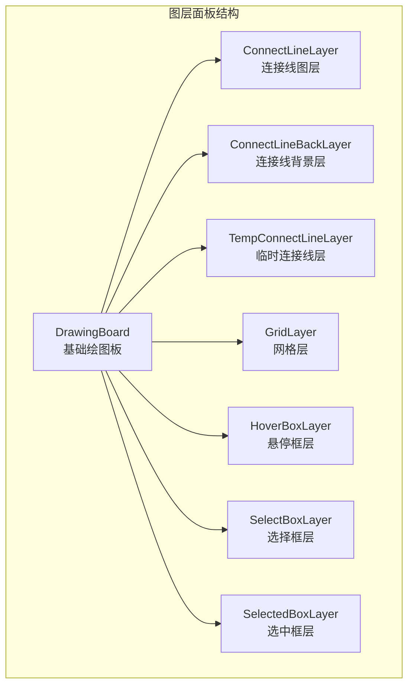
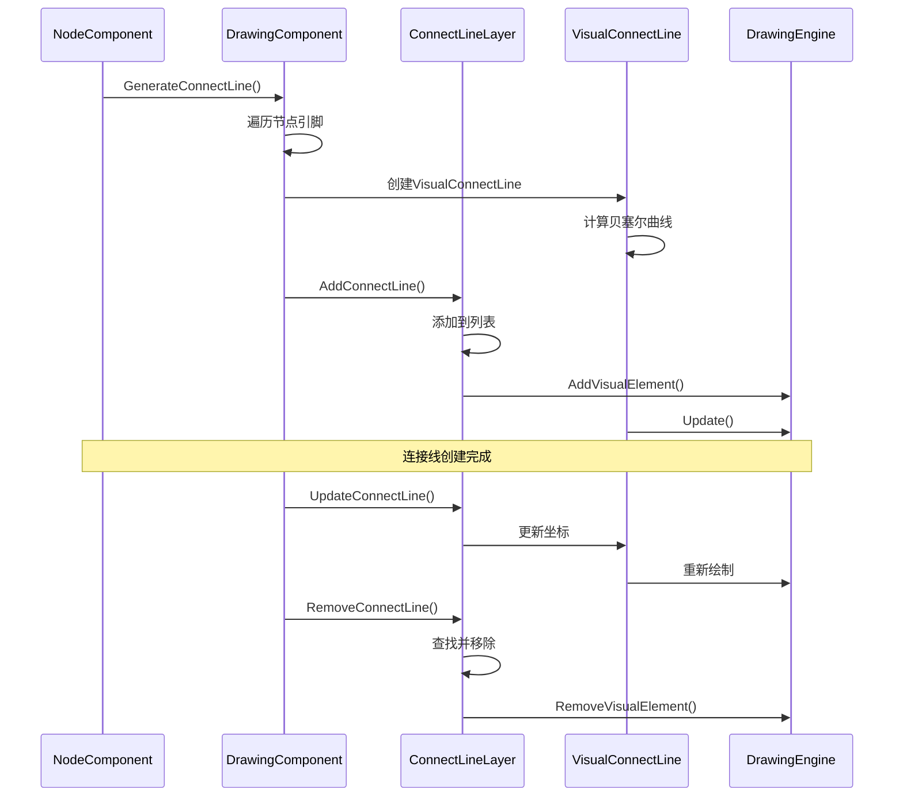
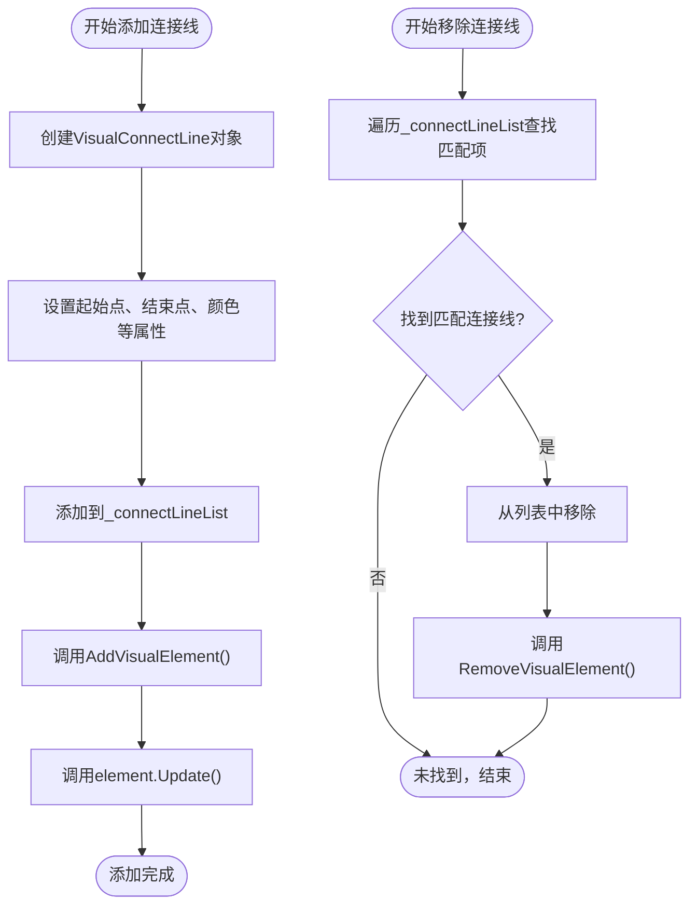
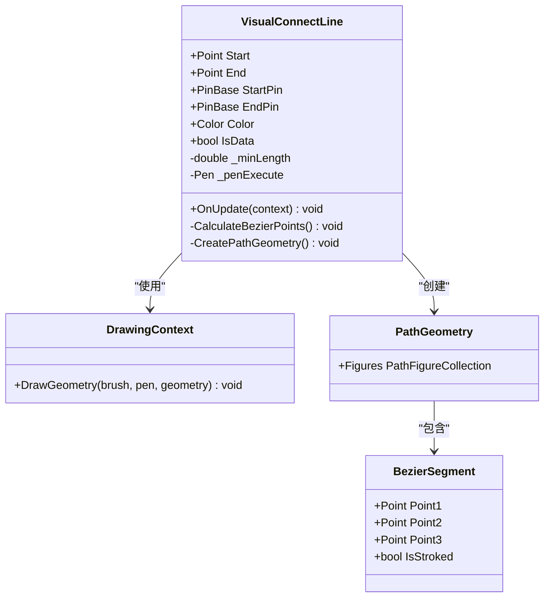
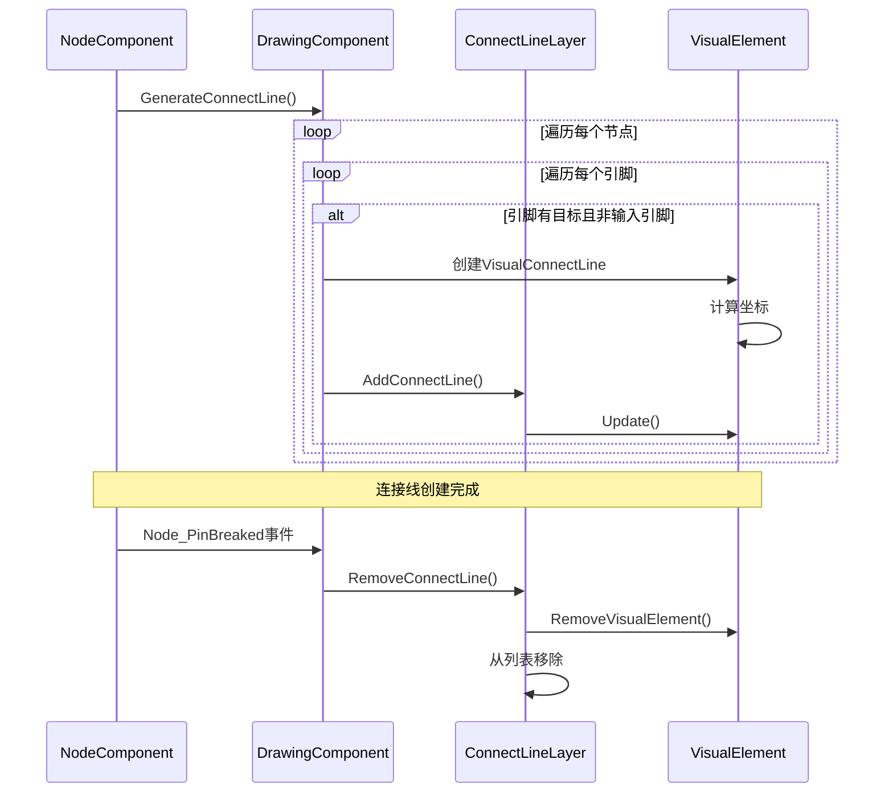
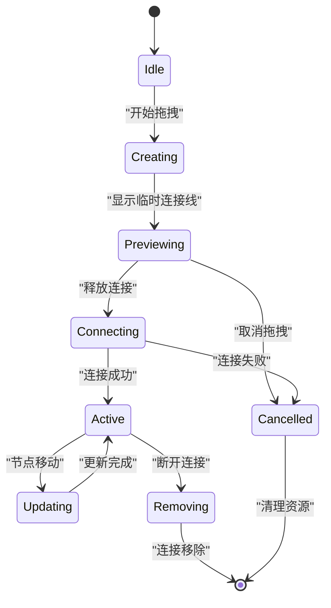
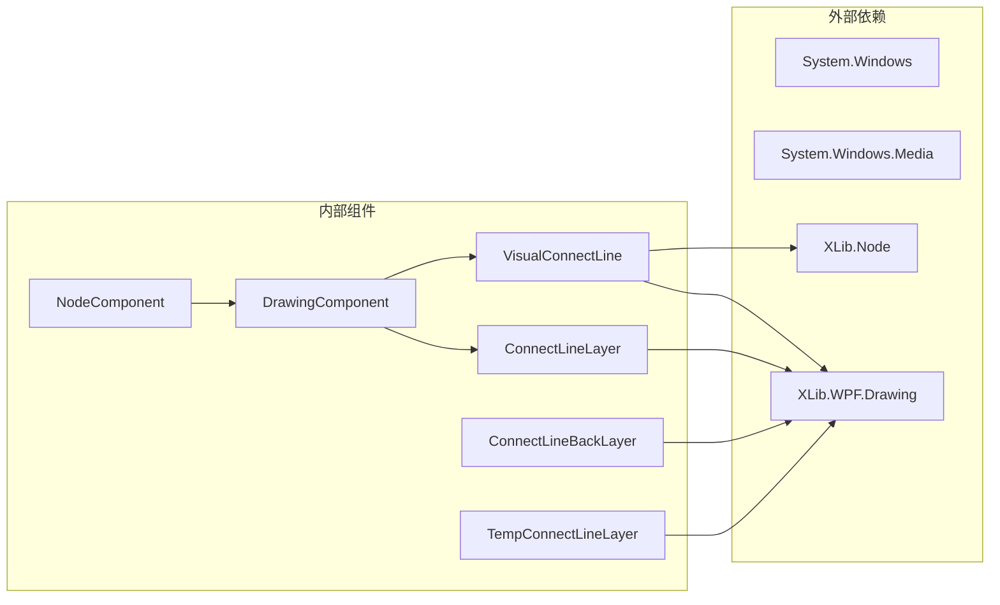

# 连接线图层 (ConnectLineLayer) 文档

<cite>
**本文档中引用的文件**
- [ConnectLineLayer.cs](file://XNode/SubSystem/NodeEditSystem/Panel/Layer/ConnectLineLayer.cs)
- [VisualConnectLine.cs](file://XNode/SubSystem/NodeEditSystem/Panel/Layer/VisualConnectLine.cs)
- [ConnectLineBackLayer.cs](file://XNode/SubSystem/NodeEditSystem/Panel/Layer/ConnectLineBackLayer.cs)
- [TempConnectLineLayer.cs](file://XNode/SubSystem/NodeEditSystem/Panel/Layer/TempConnectLineLayer.cs)
- [DrawingComponent.cs](file://XNode/SubSystem/NodeEditSystem/Panel/Component/DrawingComponent.cs)
- [NodeComponent.cs](file://XNode/SubSystem/NodeEditSystem/Panel/Component/NodeComponent.cs)
- [ConnectLine.cs](file://XNode/SubSystem/NodeEditSystem/Define/ConnectLine.cs)
</cite>

## 目录
1. [简介](#简介)
2. [项目结构](#项目结构)
3. [核心组件](#核心组件)
4. [架构概览](#架构概览)
5. [详细组件分析](#详细组件分析)
6. [依赖关系分析](#依赖关系分析)
7. [性能考虑](#性能考虑)
8. [故障排除指南](#故障排除指南)
9. [结论](#结论)

## 简介

ConnectLineLayer是XNode节点编辑器中的核心组件之一，作为持久化连接线的容器，负责管理和渲染已建立的节点间连接路径。该组件通过维护VisualConnectLine控件集合，实现了对连接关系的增删改操作，并与NodeComponent保持数据同步，在动画和交互过程中确保视觉一致性。

## 项目结构

ConnectLineLayer位于XNode项目的图层面板层次结构中，与其他图层组件协同工作：



**图表来源**
- [ConnectLineLayer.cs](file://XNode/SubSystem/NodeEditSystem/Panel/Layer/ConnectLineLayer.cs#L8-L50)
- [ConnectLineBackLayer.cs](file://XNode/SubSystem/NodeEditSystem/Panel/Layer/ConnectLineBackLayer.cs#L8-L56)
- [TempConnectLineLayer.cs](file://XNode/SubSystem/NodeEditSystem/Panel/Layer/TempConnectLineLayer.cs#L10-L59)

## 核心组件

### ConnectLineLayer类设计

ConnectLineLayer继承自DrawingBoard，提供了连接线管理的核心功能：

```csharp
public class ConnectLineLayer : DrawingBoard
{
    public List<VisualConnectLine> ConnectLineList => _connectLineList;

    public void AddConnectLine(VisualConnectLine connectLine)
    {
        _connectLineList.Add(connectLine);
        AddVisualElement(connectLine);
        connectLine.Update();
    }

    public void RemoveConnectLine(PinBase start, PinBase end)
    {
        int lineIndex = -1;
        int index = 0;
        foreach (var line in _connectLineList)
        {
            if (line.StartPin == start && line.EndPin == end)
            {
                lineIndex = index;
                break;
            }
            index++;
        }
        if (lineIndex != -1)
        {
            RemoveVisualElement(_connectLineList[lineIndex]);
            _connectLineList.RemoveAt(lineIndex);
        }
    }

    public void ClearConnectLine()
    {
        _connectLineList.Clear();
        ClearVisualElement();
    }

    private readonly List<VisualConnectLine> _connectLineList = new List<VisualConnectLine>();
}
```

**章节来源**
- [ConnectLineLayer.cs](file://XNode/SubSystem/NodeEditSystem/Panel/Layer/ConnectLineLayer.cs#L8-L50)

### VisualConnectLine可视化组件

VisualConnectLine负责实际的连接线绘制，使用贝塞尔曲线算法生成平滑的连接路径：

```csharp
public class VisualConnectLine : VisualElement
{
    protected override void OnUpdate(DrawingContext context)
    {
        // 计算连接线区域
        _left = Start.X;
        _right = End.X;
        _top = Start.Y + 0.5;
        _bottom = End.Y + 0.5;

        // 计算贝塞尔曲线的控制线长度
        double controlLineLength = (_right - _left) / 2;
        if (controlLineLength < _minLength) controlLineLength = _minLength;

        // 创建形状
        PathGeometry geometry = new PathGeometry();
        PathFigure figure = new PathFigure();
        geometry.Figures.Add(figure);

        // 计算贝塞尔曲线的控制点与终点
        Point p1 = new Point(_left + controlLineLength, _top);
        Point p2 = new Point(_right - controlLineLength, _bottom);
        Point endPoint = new Point(_right, _bottom);

        // 设置起点并添加贝塞尔曲线
        figure.StartPoint = new Point(_left, _top);
        figure.Segments.Add(new BezierSegment(p1, p2, endPoint, true));

        Pen pen = new Pen(new SolidColorBrush(Color), 1);
        if (!IsData) context.DrawGeometry(null, _penExecute, geometry);
        else context.DrawGeometry(null, new Pen(new SolidColorBrush(Color), 1), geometry);
    }
}
```

**章节来源**
- [VisualConnectLine.cs](file://XNode/SubSystem/NodeEditSystem/Panel/Layer/VisualConnectLine.cs#L7-L67)

## 架构概览

ConnectLineLayer在整个节点编辑器架构中扮演着关键角色，通过清晰的职责分离和模块化设计实现高效的功能：



**图表来源**
- [NodeComponent.cs](file://XNode/SubSystem/NodeEditSystem/Panel/Component/NodeComponent.cs#L75-L90)
- [DrawingComponent.cs](file://XNode/SubSystem/NodeEditSystem/Panel/Component/DrawingComponent.cs#L160-L180)
- [ConnectLineLayer.cs](file://XNode/SubSystem/NodeEditSystem/Panel/Layer/ConnectLineLayer.cs#L12-L35)

## 详细组件分析

### 连接线管理机制

ConnectLineLayer采用基于PinBase标识符的精确匹配机制来管理连接线：



**图表来源**
- [ConnectLineLayer.cs](file://XNode/SubSystem/NodeEditSystem/Panel/Layer/ConnectLineLayer.cs#L12-L35)

### 贝塞尔曲线生成算法

VisualConnectLine使用数学算法生成平滑的贝塞尔曲线连接线：



**图表来源**
- [VisualConnectLine.cs](file://XNode/SubSystem/NodeEditSystem/Panel/Layer/VisualConnectLine.cs#L7-L67)

### 数据同步机制

ConnectLineLayer与NodeComponent通过DrawingComponent实现数据同步：



**图表来源**
- [NodeComponent.cs](file://XNode/SubSystem/NodeEditSystem/Panel/Component/NodeComponent.cs#L75-L90)
- [DrawingComponent.cs](file://XNode/SubSystem/NodeEditSystem/Panel/Component/DrawingComponent.cs#L160-L180)

**章节来源**
- [NodeComponent.cs](file://XNode/SubSystem/NodeEditSystem/Panel/Component/NodeComponent.cs#L75-L90)
- [DrawingComponent.cs](file://XNode/SubSystem/NodeEditSystem/Panel/Component/DrawingComponent.cs#L160-L180)

### 动画和交互支持

系统支持多种类型的连接线交互和动画效果：

1. **悬停高亮**：通过ConnectLineBackLayer提供背景高亮
2. **临时连接线**：通过TempConnectLineLayer支持拖拽预览
3. **动态更新**：支持实时坐标更新和重绘



**章节来源**
- [ConnectLineBackLayer.cs](file://XNode/SubSystem/NodeEditSystem/Panel/Layer/ConnectLineBackLayer.cs#L8-L56)
- [TempConnectLineLayer.cs](file://XNode/SubSystem/NodeEditSystem/Panel/Layer/TempConnectLineLayer.cs#L10-L59)

## 依赖关系分析

ConnectLineLayer系统的依赖关系展现了清晰的分层架构：



**图表来源**
- [ConnectLineLayer.cs](file://XNode/SubSystem/NodeEditSystem/Panel/Layer/ConnectLineLayer.cs#L1-L5)
- [VisualConnectLine.cs](file://XNode/SubSystem/NodeEditSystem/Panel/Layer/VisualConnectLine.cs#L1-L5)

**章节来源**
- [ConnectLineLayer.cs](file://XNode/SubSystem/NodeEditSystem/Panel/Layer/ConnectLineLayer.cs#L1-L5)
- [VisualConnectLine.cs](file://XNode/SubSystem/NodeEditSystem/Panel/Layer/VisualConnectLine.cs#L1-L5)

## 性能考虑

### 大量连接线的性能优化策略

对于处理大量连接线的情况，系统采用了以下优化策略：

1. **虚拟化绘制**：仅绘制可见区域内的连接线
2. **批处理更新**：批量处理连接线更新操作
3. **延迟计算**：延迟计算贝塞尔曲线参数直到需要绘制时
4. **内存池化**：复用VisualConnectLine对象减少GC压力

### 性能监控指标

```csharp
// 性能监控示例代码
public class ConnectLinePerformanceMonitor
{
    private int _drawnLinesCount = 0;
    private long _lastUpdateTime = 0;
    
    public void MonitorUpdate()
    {
        var currentTime = DateTime.Now.Ticks;
        if (currentTime - _lastUpdateTime > 10000000) // 1秒
        {
            Console.WriteLine($"当前绘制连接线数量: {_drawnLinesCount}");
            _lastUpdateTime = currentTime;
        }
    }
}
```

### 优化建议

1. **视口裁剪**：只绘制屏幕范围内的连接线
2. **LOD系统**：根据距离简化连接线样式
3. **异步更新**：使用后台线程处理复杂计算
4. **缓存机制**：缓存已计算的贝塞尔曲线数据

## 故障排除指南

### 常见问题及解决方案

1. **连接线不显示**
   - 检查VisualConnectLine的Update()方法是否被正确调用
   - 验证Start和End坐标是否有效
   - 确认颜色设置是否为透明色

2. **连接线闪烁**
   - 检查OnUpdate()方法中的坐标计算逻辑
   - 验证贝塞尔曲线控制点是否合理
   - 确认绘制频率是否过高

3. **性能问题**
   - 使用性能分析工具检查DrawGeometry调用次数
   - 优化连接线数量，考虑使用虚拟化
   - 检查是否有不必要的重复更新

**章节来源**
- [VisualConnectLine.cs](file://XNode/SubSystem/NodeEditSystem/Panel/Layer/VisualConnectLine.cs#L20-L45)

## 结论

ConnectLineLayer作为XNode节点编辑器的核心组件，通过精心设计的架构实现了高效的连接线管理。其主要优势包括：

1. **清晰的职责分离**：ConnectLineLayer专注于连接线管理，VisualConnectLine专注于绘制
2. **高性能设计**：使用贝塞尔曲线算法和优化的绘制策略
3. **良好的扩展性**：支持不同类型连接线和动画效果
4. **稳定的同步机制**：与NodeComponent保持数据一致性

该组件为用户提供了流畅的节点连接体验，同时为开发者提供了可维护和可扩展的架构基础。通过持续的性能优化和功能增强，ConnectLineLayer将继续为XNode项目提供稳定可靠的连接线管理服务。