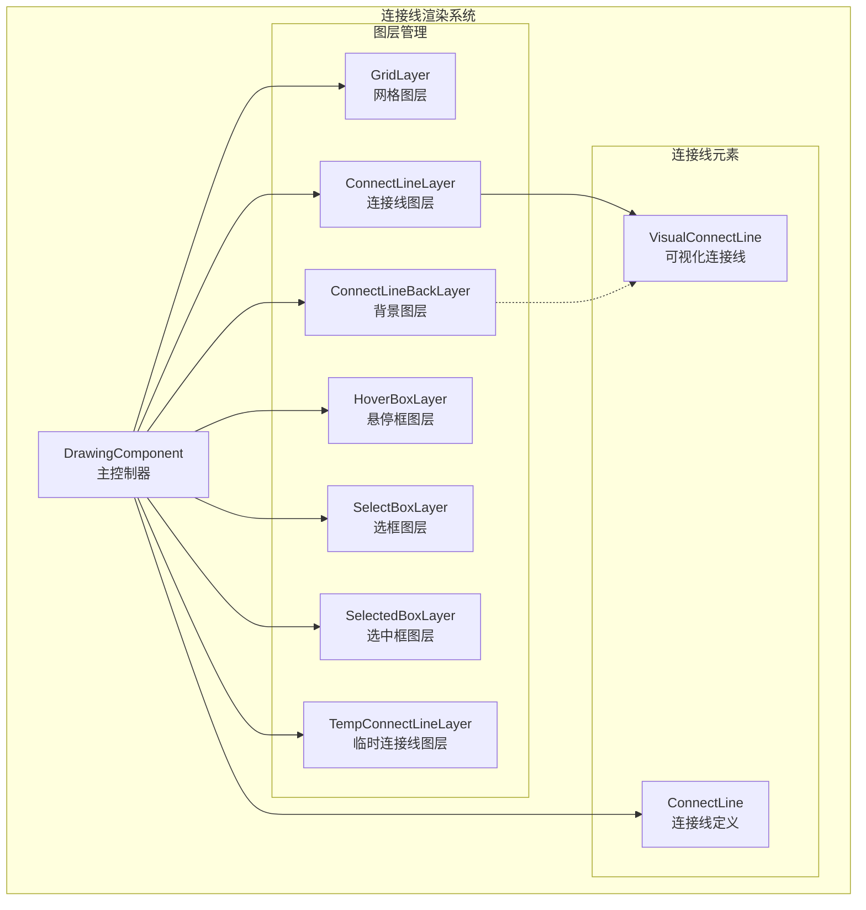
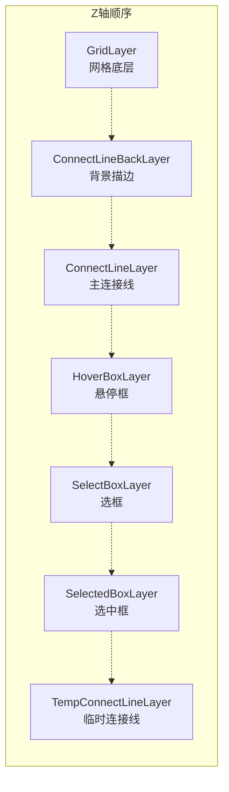
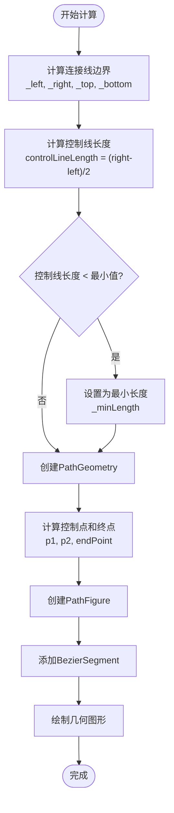
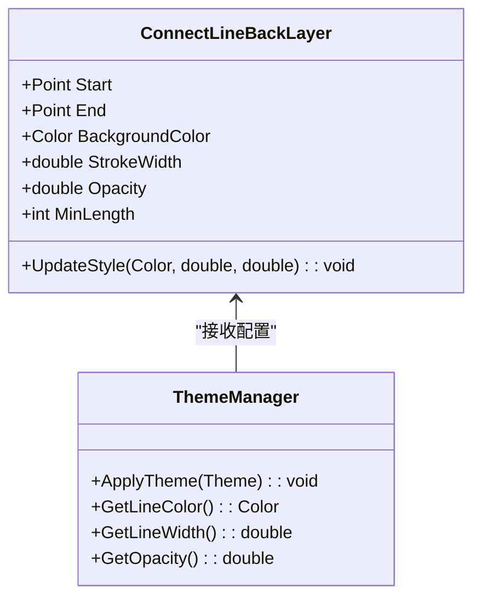
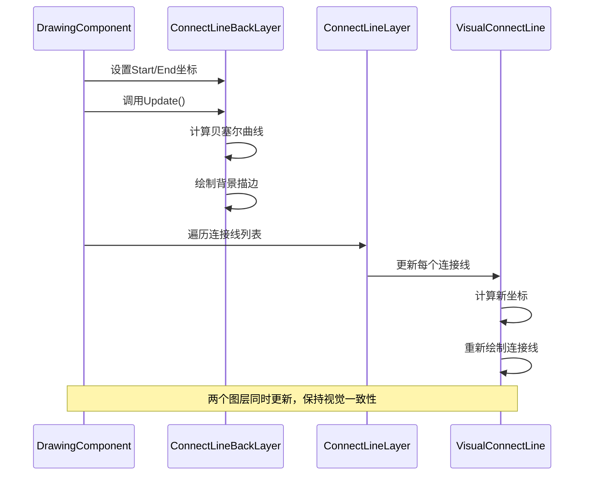

# 连接线背景图层 (ConnectLineBackLayer)

<cite>
**本文档引用的文件**
- [ConnectLineBackLayer.cs](file://XNode/SubSystem/NodeEditSystem/Panel/Layer/ConnectLineBackLayer.cs)
- [ConnectLineLayer.cs](file://XNode/SubSystem/NodeEditSystem/Panel/Layer/ConnectLineLayer.cs)
- [VisualConnectLine.cs](file://XNode/SubSystem/NodeEditSystem/Panel/Layer/VisualConnectLine.cs)
- [DrawingComponent.cs](file://XNode/SubSystem/NodeEditSystem/Panel/Component/DrawingComponent.cs)
- [TempConnectLineLayer.cs](file://XNode/SubSystem/NodeEditSystem/Panel/Layer/TempConnectLineLayer.cs)
</cite>

## 目录
1. [简介](#简介)
2. [设计目的](#设计目的)
3. [架构概览](#架构概览)
4. [核心组件分析](#核心组件分析)
5. [Z轴顺序控制机制](#z轴顺序控制机制)
6. [视觉层次增强](#视觉层次增强)
7. [主题切换与样式定制](#主题切换与样式定制)
8. [同步更新机制](#同步更新机制)
9. [性能考虑](#性能考虑)
10. [故障排除指南](#故障排除指南)
11. [总结](#总结)

## 简介

ConnectLineBackLayer是XNode节点编辑系统中的一个专门图层组件，负责为连接线提供背景描边或高亮效果以增强视觉层次。该组件作为连接线渲染管道的重要组成部分，通过在主连接线图层下方绘制半透明的白色描边，显著提升了连接线的可识别性和用户体验。

## 设计目的

ConnectLineBackLayer的核心设计目的是为连接线提供视觉上的背景描边效果，这种设计具有以下关键特性：

### 视觉增强功能
- **背景描边效果**：通过在连接线周围绘制半透明的白色描边，使连接线在复杂场景中更加突出
- **视觉层次提升**：为连接线建立清晰的视觉层级，使其在密集的节点布局中更容易被识别
- **高亮显示机制**：当用户悬停或选择连接线时，背景描边提供明显的视觉反馈

### 用户体验优化
- **可识别性增强**：在复杂的节点网络中，背景描边帮助用户快速定位和跟踪连接线
- **交互反馈**：为用户操作提供即时的视觉确认
- **美观性提升**：统一的视觉风格增强了整个编辑界面的专业感

## 架构概览

ConnectLineBackLayer采用分层架构设计，与其他连接线相关组件协同工作，形成完整的连接线渲染系统。



**图表来源**
- [DrawingComponent.cs](file://XNode/SubSystem/NodeEditSystem/Panel/Component/DrawingComponent.cs#L280-L290)
- [ConnectLineBackLayer.cs](file://XNode/SubSystem/NodeEditSystem/Panel/Layer/ConnectLineBackLayer.cs#L1-L57)

## 核心组件分析

### ConnectLineBackLayer类结构

ConnectLineBackLayer继承自SingleBoard基类，实现了专门的连接线背景渲染逻辑：

```mermaid
classDiagram
class SingleBoard {
<<abstract>>
+Width : double
+Height : double
+Init() : void
#OnUpdate() : void
+Clear() : void
}
class ConnectLineBackLayer {
+Point Start
+Point End
+Init() : void
#OnUpdate() : void
-double _left
-double _right
-double _top
-double _bottom
-int _minLength
-Pen _pen
}
class VisualConnectLine {
+PinBase StartPin
+PinBase EndPin
+Point Start
+Point End
+Color Color
+bool IsData
#OnUpdate(DrawingContext) : void
-Pen _penExecute
}
class ConnectLineLayer {
+VisualConnectLine[] ConnectLineList
+AddConnectLine(VisualConnectLine) : void
+RemoveConnectLine(PinBase, PinBase) : void
+ClearConnectLine() : void
}
SingleBoard <|-- ConnectLineBackLayer
ConnectLineLayer --> VisualConnectLine : "管理"
ConnectLineBackLayer -.-> VisualConnectLine : "同步更新"
```

**图表来源**
- [ConnectLineBackLayer.cs](file://XNode/SubSystem/NodeEditSystem/Panel/Layer/ConnectLineBackLayer.cs#L9-L57)
- [VisualConnectLine.cs](file://XNode/SubSystem/NodeEditSystem/Panel/Layer/VisualConnectLine.cs#L9-L69)
- [ConnectLineLayer.cs](file://XNode/SubSystem/NodeEditSystem/Panel/Layer/ConnectLineLayer.cs#L7-L52)

### 关键属性与配置

ConnectLineBackLayer包含以下核心属性：

- **Start/End Points**：定义连接线的起始和结束位置
- **Pen Configuration**：使用半透明白色画笔（Alpha=64）和5像素宽度
- **Minimum Length**：控制线最短长度为40像素，确保视觉效果的一致性

**章节来源**
- [ConnectLineBackLayer.cs](file://XNode/SubSystem/NodeEditSystem/Panel/Layer/ConnectLineBackLayer.cs#L11-L57)

## Z轴顺序控制机制

ConnectLineBackLayer在图层堆叠中位于连接线图层之下，这种Z轴顺序设计确保了背景描边效果的正确呈现。

### 图层堆叠顺序



**图表来源**
- [DrawingComponent.cs](file://XNode/SubSystem/NodeEditSystem/Panel/Component/DrawingComponent.cs#L280-L290)

### 堆叠实现机制

在DrawingComponent中，图层按照特定顺序添加到容器中：

```csharp
// 添加基础图层
Host.Layer_Base.Children.Add(_gridLayer);
Host.Layer_Base.Children.Add(_lineBackLayer);     // 背景图层
Host.Layer_Base.Children.Add(_connectLineLayer);  // 主连接线图层

// 添加交互图层
Host.Layer_Box.Children.Add(_hoverBoxLayer);
Host.Layer_Box.Children.Add(_selectedBoxLayer);
Host.Layer_Box.Children.Add(_selectBoxLayer);

// 添加临时图层
Host.Layer_Temp.Children.Add(_tempLineLayer);
```

这种堆叠顺序确保：
- 背景描边始终在主连接线下方
- 主连接线在背景描边上层显示
- 交互效果（悬停、选择）覆盖所有其他图层

**章节来源**
- [DrawingComponent.cs](file://XNode/SubSystem/NodeEditSystem/Panel/Component/DrawingComponent.cs#L280-L290)

## 视觉层次增强

ConnectLineBackLayer通过精心设计的视觉效果增强连接线的可识别性和美观性。

### 贝塞尔曲线算法

组件使用标准的贝塞尔曲线算法计算连接线形状：



**图表来源**
- [ConnectLineBackLayer.cs](file://XNode/SubSystem/NodeEditSystem/Panel/Layer/ConnectLineBackLayer.cs#L15-L45)

### 渲染参数配置

- **画笔配置**：使用半透明白色画笔（RGBA: 64,255,255,255）
- **线条宽度**：5像素粗细，提供明显的视觉效果
- **抗锯齿处理**：自动启用WPF的抗锯齿渲染
- **冻结画笔**：调用Freeze()方法优化性能

**章节来源**
- [ConnectLineBackLayer.cs](file://XNode/SubSystem/NodeEditSystem/Panel/Layer/ConnectLineBackLayer.cs#L50-L57)

## 主题切换与样式定制

ConnectLineBackLayer提供了良好的扩展能力，支持主题切换和样式定制需求。

### 可配置参数

虽然当前实现使用固定配置，但架构设计支持以下定制选项：



### 扩展建议

为了支持更灵活的主题定制，可以考虑以下改进：

1. **动态颜色配置**：允许运行时更改描边颜色
2. **可变宽度支持**：支持不同场景下的线条宽度调整
3. **动画效果**：添加颜色过渡或宽度变化的动画效果
4. **多主题适配**：支持深色/浅色主题的自动适配

**章节来源**
- [ConnectLineBackLayer.cs](file://XNode/SubSystem/NodeEditSystem/Panel/Layer/ConnectLineBackLayer.cs#L50-L57)

## 同步更新机制

ConnectLineBackLayer与主连接线图层保持同步更新，确保视觉一致性。

### 更新流程



**图表来源**
- [DrawingComponent.cs](file://XNode/SubSystem/NodeEditSystem/Panel/Component/DrawingComponent.cs#L175-L195)
- [ConnectLineBackLayer.cs](file://XNode/SubSystem/NodeEditSystem/Panel/Layer/ConnectLineBackLayer.cs#L15-L45)

### 同步实现细节

1. **坐标同步**：ConnectLineBackLayer从DrawingComponent获取最新的连接线端点坐标
2. **实时更新**：每次连接线状态变化时，两个图层都会立即重新绘制
3. **性能优化**：使用WPF的高效渲染管道，避免不必要的重绘

**章节来源**
- [DrawingComponent.cs](file://XNode/SubSystem/NodeEditSystem/Panel/Component/DrawingComponent.cs#L175-L195)

## 性能考虑

ConnectLineBackLayer在设计时充分考虑了性能优化，采用了多种技术手段确保流畅的用户体验。

### 性能优化策略

1. **画笔冻结**：使用`_pen.Freeze()`方法创建不可变画笔对象
2. **几何对象复用**：合理管理PathGeometry和PathFigure对象
3. **最小化重绘**：仅在必要时触发更新操作
4. **内存管理**：及时释放不再使用的图形资源

### 性能监控指标

- **渲染时间**：单次更新操作应控制在毫秒级别
- **内存占用**：避免大量连接线时的内存泄漏
- **响应速度**：用户交互后的视觉反馈应在16ms内完成

## 故障排除指南

### 常见问题与解决方案

#### 问题1：背景描边不显示
**症状**：连接线没有看到预期的白色描边效果
**可能原因**：
- 图层堆叠顺序错误
- 画笔配置问题
- 坐标计算错误

**解决方案**：
1. 检查图层添加顺序，确保ConnectLineBackLayer在ConnectLineLayer下方
2. 验证_pen属性的配置是否正确
3. 确认Start/End坐标已正确设置

#### 问题2：描边效果闪烁
**症状**：背景描边在某些情况下出现闪烁现象
**可能原因**：
- 更新频率过高
- 坐标精度问题
- WPF渲染缓存问题

**解决方案**：
1. 优化更新频率，避免频繁调用Update()
2. 检查坐标计算逻辑，确保精度
3. 尝试禁用WPF的硬件加速

#### 问题3：性能下降
**症状**：在大量连接线场景下界面卡顿
**可能原因**：
- 连接线数量过多
- 画笔未正确冻结
- 几何对象未正确回收

**解决方案**：
1. 实现连接线的可见性过滤
2. 确保所有画笔都调用了Freeze()方法
3. 定期清理不再使用的图形资源

**章节来源**
- [ConnectLineBackLayer.cs](file://XNode/SubSystem/NodeEditSystem/Panel/Layer/ConnectLineBackLayer.cs#L13-L15)

## 总结

ConnectLineBackLayer作为XNode节点编辑系统中的重要组件，通过精心设计的背景描边效果显著提升了连接线的视觉表现力。其主要优势包括：

### 技术特点
- **清晰的架构设计**：采用分层模式，职责明确
- **高效的渲染机制**：利用WPF的矢量图形系统
- **良好的扩展性**：支持主题定制和样式调整

### 用户价值
- **增强可识别性**：在复杂场景中更容易识别连接线
- **提升交互体验**：提供直观的视觉反馈
- **保持视觉一致性**：与主连接线图层完美配合

### 发展方向
- **主题系统集成**：与全局主题系统深度整合
- **动画效果支持**：添加动态视觉效果
- **性能进一步优化**：针对大规模场景的性能优化

ConnectLineBackLayer的设计体现了现代UI组件开发的最佳实践，为构建高质量的节点编辑器奠定了坚实的基础。通过持续的优化和扩展，该组件将继续为用户提供优秀的视觉体验和交互效果。