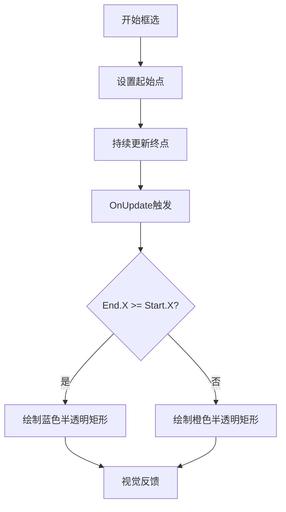
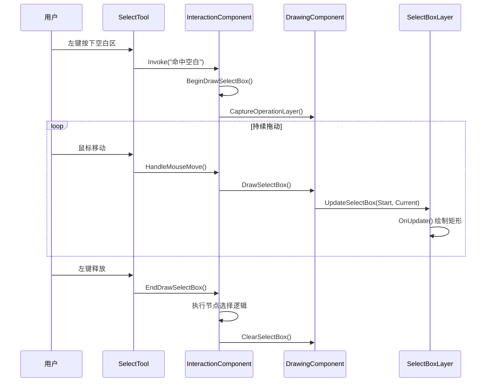
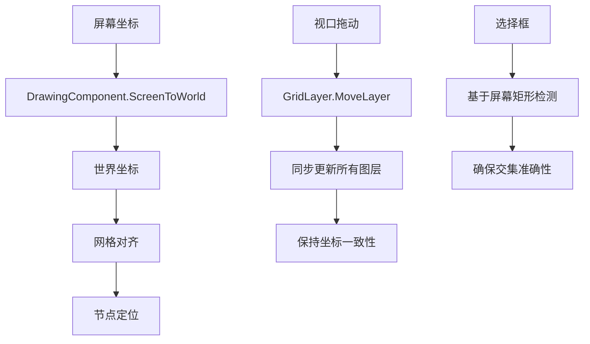

# 选择框图层 (SelectBoxLayer)

<cite>
**本文档引用文件**  
- [SelectBoxLayer.cs](file://XNode/SubSystem/NodeEditSystem/Panel/Layer/SelectBoxLayer.cs)
- [InteractionComponent.cs](file://XNode/SubSystem/NodeEditSystem/Panel/Component/InteractionComponent.cs)
- [DrawingComponent.cs](file://XNode/SubSystem/NodeEditSystem/Panel/Component/DrawingComponent.cs)
- [SelectTool.cs](file://XNode/SubSystem/NodeEditSystem/Panel/SelectTool.cs)
- [NodeComponent.cs](file://XNode/SubSystem/NodeEditSystem/Panel/Component/NodeComponent.cs)
</cite>

## 目录
1. [简介](#简介)
2. [选择框绘制机制](#选择框绘制机制)
3. [鼠标事件处理流程](#鼠标事件处理流程)
4. [节点交集检测逻辑](#节点交集检测逻辑)
5. [坐标转换与视图缩放支持](#坐标转换与视图缩放支持)
6. [总结](#总结)

## 简介
`SelectBoxLayer` 是 XNode 编辑器中用于实现用户框选操作的核心图层组件。当用户在编辑区域按下鼠标并拖动时，该图层负责绘制一个半透明的选择矩形，用于视觉反馈。框选结束后，系统会根据矩形范围自动检测并选中所有位于其内部或与其相交的节点。

该功能涉及多个组件的协同工作：`SelectTool` 捕获鼠标事件，`InteractionComponent` 处理交互逻辑，`DrawingComponent` 管理图层更新，`SelectBoxLayer` 负责实际绘制，而 `NodeComponent` 提供节点数据以进行交集判断。

**本节不分析具体源文件，因此无来源标注**

## 选择框绘制机制

`SelectBoxLayer` 继承自 `SingleBoard`，通过重写 `OnUpdate` 方法实现选择框的动态绘制。该图层维护两个关键属性：`Start` 和 `End`，分别表示鼠标按下和当前拖动位置的坐标。

在 `OnUpdate` 方法中，系统使用 `DrawingContext` 绘制一个矩形。矩形的颜色根据拖动方向动态变化：
- 当鼠标向右拖动（`End.X >= Start.X`）时，使用蓝色半透明画刷（`_blue`）
- 当鼠标向左拖动时，使用橙色半透明画刷（`_orange`）

这种颜色区分有助于用户直观判断选择模式（包含式选择或交叉式选择）。矩形边框使用白色细线（`_border`）绘制，以增强视觉清晰度。



**图层来源**  
- [SelectBoxLayer.cs](file://XNode/SubSystem/NodeEditSystem/Panel/Layer/SelectBoxLayer.cs#L9-L35)

**本节来源**  
- [SelectBoxLayer.cs](file://XNode/SubSystem/NodeEditSystem/Panel/Layer/SelectBoxLayer.cs#L9-L35)

## 鼠标事件处理流程

选择框功能的触发始于 `SelectTool` 工具。当用户在空白区域按下鼠标左键时，`InteractionComponent` 的 `OnLeftButtonDown` 方法被调用，根据命中区域判断是否启动框选模式。

具体流程如下：
1. 用户在空白区域点击鼠标左键
2. `SelectTool` 触发 `Behaviors.HitedSpace` 行为树
3. 调用 `InteractionComponent.BeginDrawSelectBox()` 记录鼠标按下位置
4. 鼠标移动时，持续调用 `DrawSelectBox()`
5. `DrawingComponent.UpdateSelectBox()` 更新 `SelectBoxLayer` 的 `Start` 和 `End` 坐标
6. 图层自动重绘，显示动态选择框
7. 用户释放鼠标左键时，调用 `EndDrawSelectBox()` 完成选择操作



**图层来源**  
- [SelectTool.cs](file://XNode/SubSystem/NodeEditSystem/Panel/SelectTool.cs#L7-L68)
- [InteractionComponent.cs](file://XNode/SubSystem/NodeEditSystem/Panel/Component/InteractionComponent.cs#L18-L755)
- [DrawingComponent.cs](file://XNode/SubSystem/NodeEditSystem/Panel/Component/DrawingComponent.cs#L15-L385)

**本节来源**  
- [SelectTool.cs](file://XNode/SubSystem/NodeEditSystem/Panel/SelectTool.cs#L7-L68)
- [InteractionComponent.cs](file://XNode/SubSystem/NodeEditSystem/Panel/Component/InteractionComponent.cs#L18-L755)
- [DrawingComponent.cs](file://XNode/SubSystem/NodeEditSystem/Panel/Component/DrawingComponent.cs#L15-L385)

## 节点交集检测逻辑

框选操作完成后，系统通过 `EndDrawSelectBox` 方法执行节点选择逻辑。该过程包含以下步骤：

1. 获取最终选择框的矩形区域（`Rect`）
2. 获取选择模式：根据 `End.X < Start.X` 判断为交叉选择（`SelectType.Cross`），否则为包含选择（`SelectType.Box`）
3. 遍历所有节点视图（`NodeView`）
4. 对每个节点获取其可命中区域（`GetHittableRect()`）
5. 根据选择模式进行交集判断：
   - **包含选择**：使用 `Rect.Contains()` 判断节点矩形是否完全位于选择框内
   - **交叉选择**：使用 `Rect.IntersectsWith()` 判断节点矩形是否与选择框相交
6. 将符合条件的节点添加到选中列表
7. 更新选中框图层（`SelectedBoxLayer`）和相关UI组件

此逻辑确保了两种选择模式的精确性：包含选择仅选中完全在框内的节点，而交叉选择会选中任何与框相交的节点。

```mermaid
flowchart TD
A[结束框选] --> B[获取选择矩形]
B --> C[确定选择模式]
C --> D[遍历所有节点]
D --> E{选择模式?}
E --> |包含| F[Rect.Contains()]
E --> |交叉| G[Rect.IntersectsWith()]
F --> H{完全包含?}
G --> I{相交?}
H --> |是| J[添加到选中列表]
I --> |是| J
H --> |否| K[跳过]
I --> |否| K
J --> L[更新UI]
K --> M[处理下一个节点]
M --> D
L --> N[完成选择]
```

**图层来源**  
- [InteractionComponent.cs](file://XNode/SubSystem/NodeEditSystem/Panel/Component/InteractionComponent.cs#L18-L755)
- [NodeComponent.cs](file://XNode/SubSystem/NodeEditSystem/Panel/Component/NodeComponent.cs#L11-L123)

**本节来源**  
- [InteractionComponent.cs](file://XNode/SubSystem/NodeEditSystem/Panel/Component/InteractionComponent.cs#L18-L755)
- [NodeComponent.cs](file://XNode/SubSystem/NodeEditSystem/Panel/Component/NodeComponent.cs#L11-L123)

## 坐标转换与视图缩放支持

尽管当前代码中未直接实现缩放功能，但系统架构已为多层嵌套和视图变换提供了良好的支持基础。`DrawingComponent` 中的 `ScreenToWorld` 方法展示了坐标转换的核心机制：

1. **坐标系管理**：系统区分屏幕坐标与世界坐标。世界中心由 `GridLayer.GridCenter` 定义，所有节点位置基于此中心计算。
2. **网格对齐**：在坐标转换过程中，系统会将坐标对齐到网格单元（`CellWidth`/`CellHeight`），确保节点放置的精确性。
3. **图层同步**：当视口拖动时，`DragViewport` 方法会同步移动 `GridLayer`，并更新所有节点、连接线和选择框的位置，保持视觉一致性。
4. **动态更新**：`UpdateLayerSize` 方法确保所有图层尺寸与操作区域同步，避免因窗口缩放导致的绘制错位。

虽然当前 `SelectBoxLayer` 直接使用屏幕坐标，但通过 `DrawingComponent` 的中介，未来可轻松扩展支持缩放和旋转等变换。所有交集检测均基于最终的屏幕矩形进行，保证了在任何视图状态下选择逻辑的准确性。



**图层来源**  
- [DrawingComponent.cs](file://XNode/SubSystem/NodeEditSystem/Panel/Component/DrawingComponent.cs#L15-L385)
- [GridLayer.cs](file://XNode/SubSystem/NodeEditSystem/Panel/Layer/GridLayer.cs)

**本节来源**  
- [DrawingComponent.cs](file://XNode/SubSystem/NodeEditSystem/Panel/Component/DrawingComponent.cs#L15-L385)

## 总结
`SelectBoxLayer` 作为 XNode 编辑器的交互核心组件之一，实现了高效且直观的框选功能。通过与 `SelectTool`、`InteractionComponent` 和 `DrawingComponent` 的紧密协作，系统能够准确捕获用户意图，实时绘制选择反馈，并精确判断被选中的节点集合。

其设计体现了清晰的职责分离：`SelectBoxLayer` 专注视觉呈现，`InteractionComponent` 处理业务逻辑，`DrawingComponent` 管理坐标与图层。这种架构不仅保证了当前功能的稳定性，也为未来扩展（如支持缩放、旋转等变换）奠定了坚实基础。

**本节不分析具体源文件，因此无来源标注**