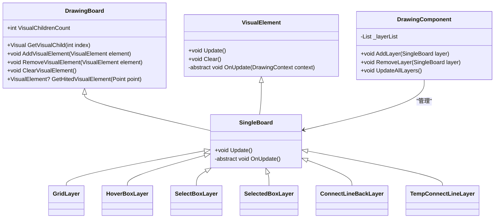
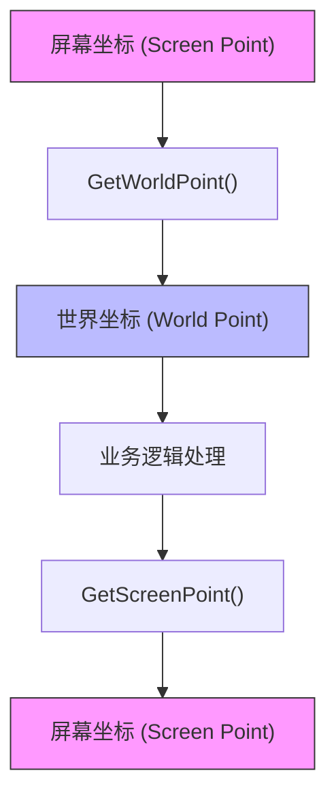
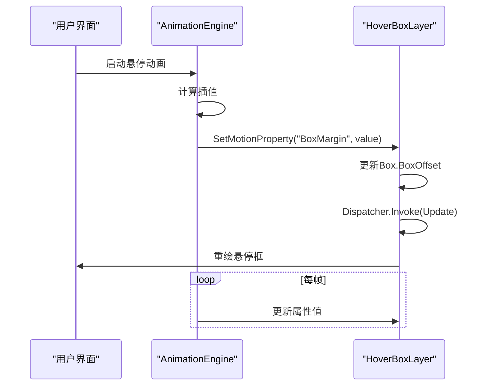

# 图形渲染系统

<cite>
**本文档引用的文件**
- [DrawingBoard.cs](file://XLib.WPF/Drawing/DrawingBoard.cs)
- [VisualElement.cs](file://XLib.WPF/Drawing/VisualElement.cs)
- [GridLayer.cs](file://XNode/SubSystem/NodeEditSystem/Panel/Layer/GridLayer.cs)
- [HoverBoxLayer.cs](file://XNode/SubSystem/NodeEditSystem/Panel/Layer/HoverBoxLayer.cs)
- [SelectBoxLayer.cs](file://XNode/SubSystem/NodeEditSystem/Panel/Layer/SelectBoxLayer.cs)
- [SelectedBoxLayer.cs](file://XNode/SubSystem/NodeEditSystem/Panel/Layer/SelectedBoxLayer.cs)
- [ConnectLineLayer.cs](file://XNode/SubSystem/NodeEditSystem/Panel/Layer/ConnectLineLayer.cs)
- [VisualConnectLine.cs](file://XNode/SubSystem/NodeEditSystem/Panel/Layer/VisualConnectLine.cs)
- [TempConnectLineLayer.cs](file://XNode/SubSystem/NodeEditSystem/Panel/Layer/TempConnectLineLayer.cs)
- [ConnectLineBackLayer.cs](file://XNode/SubSystem/NodeEditSystem/Panel/Layer/ConnectLineBackLayer.cs)
- [AnimationEngine.cs](file://XLib.Animate/AnimationEngine.cs)
- [DrawingComponent.cs](file://XNode/SubSystem/NodeEditSystem/Panel/Component/DrawingComponent.cs)
</cite>

## 目录
1. [引言](#引言)
2. [绘图容器与视觉元素管理](#绘图容器与视觉元素管理)
3. [图层系统与分层绘制机制](#图层系统与分层绘制机制)
4. [坐标转换算法](#坐标转换算法)
5. [动画系统集成](#动画系统集成)
6. [图层叠加与Z轴管理](#图层叠加与z轴管理)
7. [渲染性能调优指南](#渲染性能调优指南)
8. [自定义图层开发示例](#自定义图层开发示例)
9. [常见渲染问题排查](#常见渲染问题排查)
10. [结论](#结论)

## 引言
本文档详细阐述XNode图形渲染系统的实现机制，重点分析DrawingComponent如何协调多个图层进行分层绘制，解析坐标转换算法，描述DrawingBoard的核心作用，以及AnimationEngine如何实现动态效果。同时提供图层管理、性能调优和问题排查的实践指南。

## 绘图容器与视觉元素管理

### DrawingBoard核心作用
DrawingBoard作为WPF绘图容器，继承自FrameworkElement，负责管理多个视觉元素（VisualElement）。它通过重写VisualChildrenCount和GetVisualChild方法，实现对子元素的可视化树管理。

DrawingBoard提供了添加、移除和清空可视元素的公开方法，确保元素在可视化树和逻辑树中的同步。通过VisualTreeHelper.HitTest方法实现命中检测，支持基于几何区域的精确交互。

### VisualElement高效管理
VisualElement是所有可视元素的抽象基类，继承自DrawingVisual。它采用双缓冲机制，通过RenderOpen()获取DrawingContext进行绘制，避免直接操作UI线程。

每个VisualElement通过Update()方法触发重绘，Clear()方法清除内容。抽象的OnUpdate(DrawingContext context)方法强制子类实现具体的绘制逻辑，确保绘制操作的封装性和一致性。

**中文(中文)**
- [DrawingBoard.cs](file://XLib.WPF/Drawing/DrawingBoard.cs#L1-L95)
- [VisualElement.cs](file://XLib.WPF/Drawing/VisualElement.cs#L1-L20)

## 图层系统与分层绘制机制

### 图层类型与职责
系统采用分层绘制架构，各图层职责分明：
- **GridLayer**: 背景网格图层，显示坐标网格
- **ConnectLineBackLayer**: 连接线背景图层，提供连接线的视觉深度
- **ConnectLineLayer**: 连接线图层，管理所有连接线
- **HoverBoxLayer**: 悬停框图层，显示悬停时的高亮框
- **SelectBoxLayer**: 选框图层，显示拖拽选择区域
- **SelectedBoxLayer**: 选中框图层，显示已选中元素的边框
- **TempConnectLineLayer**: 临时连接线图层，显示正在创建的连接线

### DrawingComponent协调机制
DrawingComponent作为图层协调器，管理所有图层的生命周期和绘制顺序。它通过有序添加图层到DrawingBoard，确保正确的叠加顺序。

图层间通过事件和属性共享状态，如GridLayer的GridCenter影响所有基于世界坐标的图层。DrawingComponent监听用户交互事件，动态更新相应图层的状态。



**图层来源**
- [GridLayer.cs](file://XNode/SubSystem/NodeEditSystem/Panel/Layer/GridLayer.cs#L1-L209)
- [HoverBoxLayer.cs](file://XNode/SubSystem/NodeEditSystem/Panel/Layer/HoverBoxLayer.cs#L1-L42)
- [SelectBoxLayer.cs](file://XNode/SubSystem/NodeEditSystem/Panel/Layer/SelectBoxLayer.cs#L1-L37)
- [SelectedBoxLayer.cs](file://XNode/SubSystem/NodeEditSystem/Panel/Layer/SelectedBoxLayer.cs#L1-L27)
- [ConnectLineBackLayer.cs](file://XNode/SubSystem/NodeEditSystem/Panel/Layer/ConnectLineBackLayer.cs#L1-L57)
- [TempConnectLineLayer.cs](file://XNode/SubSystem/NodeEditSystem/Panel/Layer/TempConnectLineLayer.cs#L1-L60)

**中文(中文)**
- [DrawingComponent.cs](file://XNode/SubSystem/NodeEditSystem/Panel/Component/DrawingComponent.cs)

## 坐标转换算法

### 屏幕坐标与世界坐标
系统采用中心锚点坐标系，GridLayer维护GridCenter作为世界坐标原点。屏幕坐标以控件左上角为原点，世界坐标以画布中心为原点。



### 转换实现
GridLayer提供两个核心方法：
- `GetWorldPoint(Point screenPoint)`: 将屏幕坐标转换为世界坐标
- `GetScreenPoint(Point worldPoint)`: 将世界坐标转换为屏幕坐标

平移操作通过更新_centerOffset实现，缩放操作通过调整_gridWidth和_gridHeight实现。所有图层基于GridCenter进行绘制，确保坐标系的一致性。

**中文(中文)**
- [GridLayer.cs](file://XNode/SubSystem/NodeEditSystem/Panel/Layer/GridLayer.cs#L150-L170)

## 动画系统集成

### AnimationEngine集成
系统通过XLib.Animate模块的AnimationEngine实现动态效果。HoverBoxLayer实现IMotion接口，支持动画属性绑定。

AnimationEngine通过SetMotionProperty方法更新动画属性，如悬停框的BoxMargin，触发图层重绘。动画采用插值计算，结合Easing函数实现平滑过渡。

### 动态效果实现
- **悬停动画**: HoverBoxLayer通过动画改变BoxOffset属性，实现渐显效果
- **连接线生成动画**: TempConnectLineLayer在连接过程中实时更新End点，配合AnimationEngine实现动态绘制效果
- **选择框动画**: SelectBoxLayer在拖拽时连续更新Start和End点，实现流畅的选择反馈



**图层来源**
- [HoverBoxLayer.cs](file://XNode/SubSystem/NodeEditSystem/Panel/Layer/HoverBoxLayer.cs#L25-L40)
- [AnimationEngine.cs](file://XLib.Animate/AnimationEngine.cs)

**中文(中文)**
- [HoverBoxLayer.cs](file://XNode/SubSystem/NodeEditSystem/Panel/Layer/HoverBoxLayer.cs)
- [AnimationEngine.cs](file://XLib.Animate/AnimationEngine.cs)

## 图层叠加与Z轴管理

### 叠加顺序
图层按照添加顺序决定Z轴层级，后添加的图层位于上层。标准叠加顺序为：
1. GridLayer (最底层)
2. ConnectLineBackLayer
3. ConnectLineLayer
4. SelectedBoxLayer
5. HoverBoxLayer
6. SelectBoxLayer (最上层)

### Z轴控制策略
- **静态Z轴**: 通过图层初始化顺序固定Z轴层级
- **动态Z轴**: 特殊场景下临时调整图层顺序，如全屏遮罩
- **逻辑分组**: 将相关图层分组管理，确保组内顺序一致性

系统避免频繁的Z轴调整，通过合理的图层设计减少重绘开销。

**中文(中文)**
- [DrawingComponent.cs](file://XNode/SubSystem/NodeEditSystem/Panel/Component/DrawingComponent.cs)

## 渲染性能调优指南

### 性能优化策略
1. **分层绘制**: 将静态和动态内容分离到不同图层
2. **增量更新**: 仅重绘变化区域，避免全屏刷新
3. **对象复用**: 冻结画笔和画刷（Freeze），减少资源创建开销
4. **批处理**: 合并相似绘制操作，减少DrawingContext调用

### 具体实践
- **画笔冻结**: 所有Pen对象在Init()方法中调用Freeze()
- **条件绘制**: 在OnUpdate中检查必要性，避免无效绘制
- **几何缓存**: 复杂几何体（如贝塞尔曲线）在变化时重建
- **命中检测优化**: 使用小范围椭圆区域进行精确检测

**中文(中文)**
- [GridLayer.cs](file://XNode/SubSystem/NodeEditSystem/Panel/Layer/GridLayer.cs#L40-L50)
- [SelectBoxLayer.cs](file://XNode/SubSystem/NodeEditSystem/Panel/Layer/SelectBoxLayer.cs#L25-L30)

## 自定义图层开发示例

### 开发步骤
1. 继承SingleBoard或DrawingBoard
2. 重写OnUpdate方法实现绘制逻辑
3. 在DrawingComponent中注册图层
4. 实现必要的交互逻辑

### 示例代码结构
```csharp
public class CustomLayer : SingleBoard
{
    public override void Init()
    {
        // 初始化资源，冻结画笔
        _pen.Freeze();
    }

    protected override void OnUpdate()
    {
        // 绘制逻辑
        if (ShouldDraw)
        {
            _dc.DrawLine(_pen, startPoint, endPoint);
        }
    }

    private readonly Pen _pen = new Pen(Brushes.Red, 2);
}
```

**中文(中文)**
- [SingleBoard.cs](file://XLib.WPF/Drawing/SingleBoard.cs)
- [CustomLayer.cs](file://XNode/SubSystem/NodeEditSystem/Panel/Layer/CustomLayer.cs)

## 常见渲染问题排查

### 闪烁问题
**现象**: 图层在交互时出现闪烁
**排查路径**:
1. 检查是否未调用Freeze()导致资源重复创建
2. 确认Update()调用频率是否过高
3. 验证是否在非UI线程调用Dispatcher.Invoke

### 重叠错乱
**现象**: 图层叠加顺序错误
**排查路径**:
1. 检查图层添加顺序是否符合Z轴需求
2. 确认是否有图层被意外移除或重复添加
3. 验证坐标转换是否正确

### 性能瓶颈
**现象**: 滚动或缩放时卡顿
**排查路径**:
1. 分析OnUpdate方法复杂度
2. 检查是否进行不必要的全屏重绘
3. 验证动画帧率是否过高

**中文(中文)**
- [DrawingBoard.cs](file://XLib.WPF/Drawing/DrawingBoard.cs)
- [VisualElement.cs](file://XLib.WPF/Drawing/VisualElement.cs)

## 结论
XNode图形渲染系统通过DrawingComponent协调多图层分层绘制，实现了高效的视觉呈现。系统采用中心锚点坐标系，通过GridLayer管理屏幕与世界坐标的转换。DrawingBoard作为核心容器，结合VisualElement实现高效的视觉元素管理。AnimationEngine的集成使得悬停动画、连接线生成等动态效果流畅自然。通过合理的图层叠加顺序和性能优化策略，系统在复杂场景下仍能保持良好性能。开发者可基于现有架构轻松扩展自定义图层，满足特定需求。