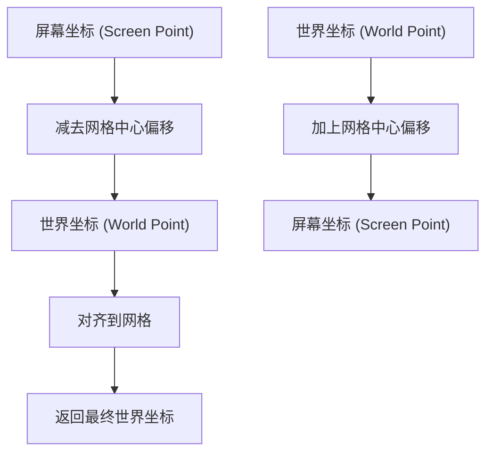
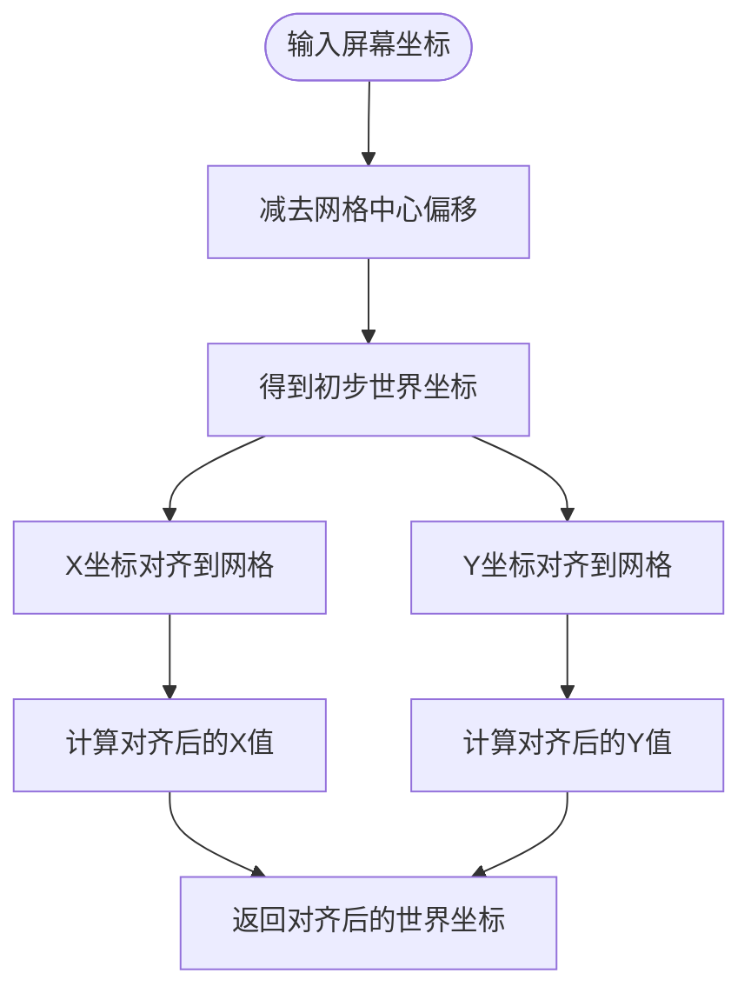
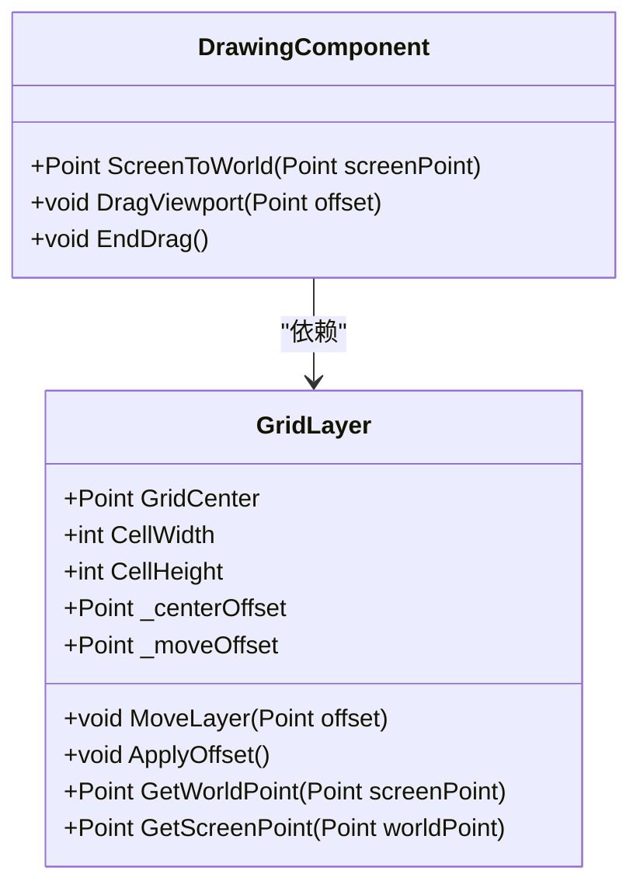
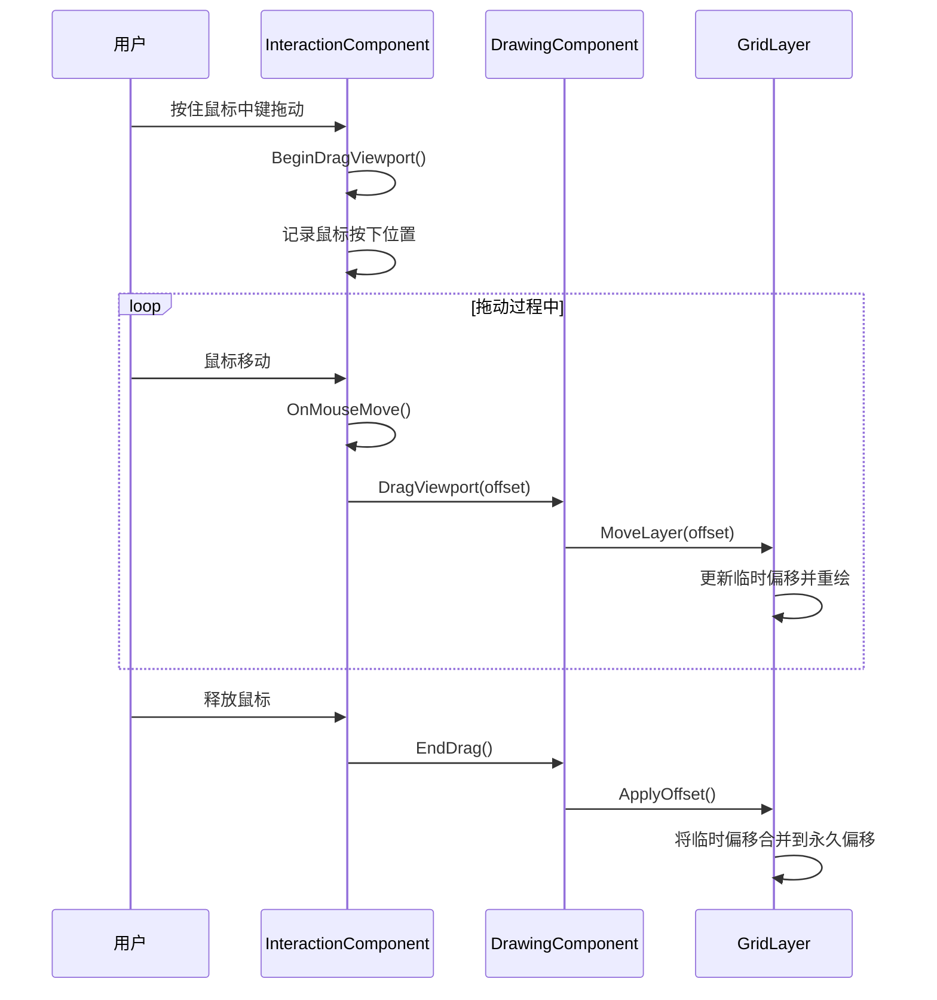
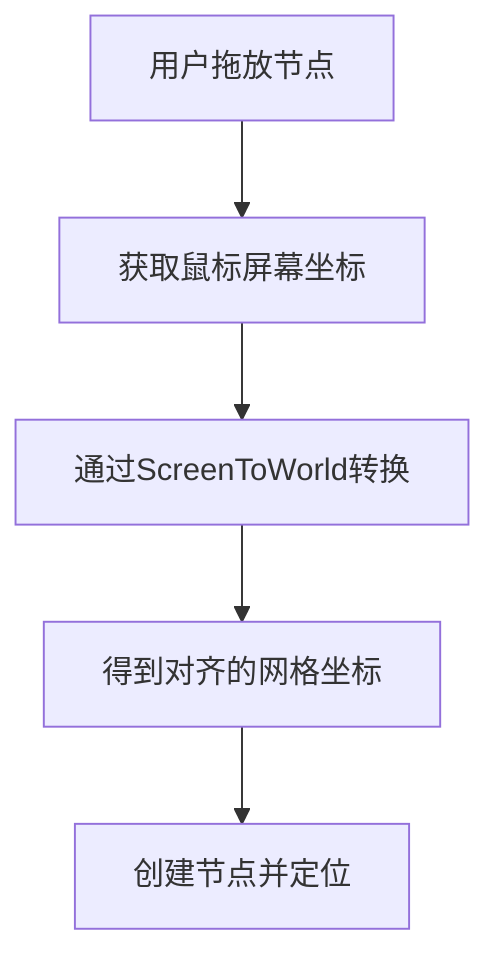
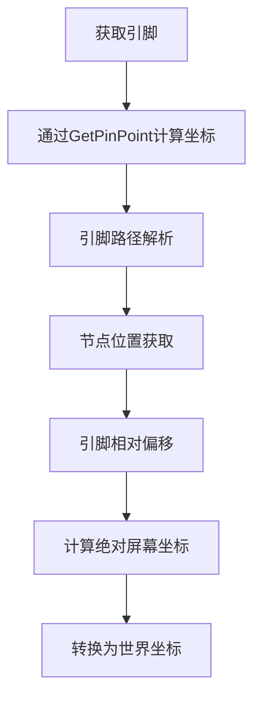

# 坐标变换系统

<cite>
**本文档引用的文件**
- [DrawingComponent.cs](file://XNode/SubSystem/NodeEditSystem/Panel/Component/DrawingComponent.cs)
- [GridLayer.cs](file://XNode/SubSystem/NodeEditSystem/Panel/Layer/GridLayer.cs)
- [EditPanel.xaml.cs](file://XNode/SubSystem/NodeEditSystem/Panel/EditPanel.xaml.cs)
- [InteractionComponent.cs](file://XNode/SubSystem/NodeEditSystem/Panel/Component/InteractionComponent.cs)
- [SingleBoard.cs](file://XLib.WPF/Drawing/SingleBoard.cs)
- [DrawingBoard.cs](file://XLib.WPF/Drawing/DrawingBoard.cs)
</cite>

## 目录
1. [引言](#引言)
2. [坐标转换核心机制](#坐标转换核心机制)
3. [DrawingComponent中的坐标转换方法](#drawingcomponent中的坐标转换方法)
4. [GridLayer与世界坐标系](#gridlayer与世界坐标系)
5. [视口拖动与坐标偏移](#视口拖动与坐标偏移)
6. [用户交互中的坐标应用](#用户交互中的坐标应用)
7. [坐标精度与对齐策略](#坐标精度与对齐策略)
8. [常见问题与调试技巧](#常见问题与调试技巧)
9. [结论](#结论)

## 引言
本文档深入解析XNode项目中屏幕坐标与世界坐标之间的转换机制。通过分析DrawingComponent、GridLayer等核心组件，详细说明坐标映射的实现逻辑，包括缩放因子、平移偏移在坐标变换中的作用，以及WPF可视化容器如何支持坐标映射系统。

## 坐标转换核心机制

在XNode的图形编辑系统中，坐标转换是实现用户交互和可视化渲染的基础。系统采用两套坐标系：

- **屏幕坐标系**：以操作区域左上角为原点(0,0)，X轴向右，Y轴向下，单位为像素
- **世界坐标系**：以画布中心为参考点，支持无限画布的逻辑坐标系统

坐标转换的核心在于通过**平移偏移**实现两套坐标系之间的映射，而非传统的缩放变换。这种设计简化了坐标计算，同时保持了画布的无限扩展能力。



**图示来源**
- [DrawingComponent.cs](file://XNode/SubSystem/NodeEditSystem/Panel/Component/DrawingComponent.cs#L86-L95)
- [GridLayer.cs](file://XNode/SubSystem/NodeEditSystem/Panel/Layer/GridLayer.cs#L120-L130)

## DrawingComponent中的坐标转换方法

DrawingComponent作为绘图功能的核心组件，提供了屏幕坐标与世界坐标之间的转换方法。

### ScreenToWorld方法实现

`ScreenToWorld`方法将屏幕坐标转换为对齐到网格的世界坐标：



**图示来源**
- [DrawingComponent.cs](file://XNode/SubSystem/NodeEditSystem/Panel/Component/DrawingComponent.cs#L86-L95)

### 转换逻辑分析

转换过程分为两个阶段：
1. **坐标系转换**：从屏幕坐标系转换到世界坐标系
2. **网格对齐**：将坐标对齐到最近的网格点

这种方法确保了节点和连接线始终对齐到网格，提升了用户体验。

**本节来源**
- [DrawingComponent.cs](file://XNode/SubSystem/NodeEditSystem/Panel/Component/DrawingComponent.cs#L86-L95)

## GridLayer与世界坐标系

GridLayer是实现坐标映射的基础设施，负责管理网格的绘制和坐标转换。

### 网格中心与坐标偏移

GridLayer通过`GridCenter`属性维护世界坐标系的中心点。该中心点是动态计算的，基于操作区域的尺寸和用户的拖动偏移：



**图示来源**
- [GridLayer.cs](file://XNode/SubSystem/NodeEditSystem/Panel/Layer/GridLayer.cs#L15-L25)
- [DrawingComponent.cs](file://XNode/SubSystem/NodeEditSystem/Panel/Component/DrawingComponent.cs#L15-L20)

### 动态中心点计算

GridCenter的值在`DrawGrid`方法中动态更新，考虑了两个偏移量：
- `_centerOffset`：累积的永久偏移
- `_moveOffset`：当前拖动的临时偏移

这种设计实现了平滑的视口拖动效果。

**本节来源**
- [GridLayer.cs](file://XNode/SubSystem/NodeEditSystem/Panel/Layer/GridLayer.cs#L150-L160)

## 视口拖动与坐标偏移

视口拖动是用户导航大画布的主要方式，其实现依赖于坐标偏移机制。

### 拖动流程分析



**图示来源**
- [InteractionComponent.cs](file://XNode/SubSystem/NodeEditSystem/Panel/Component/InteractionComponent.cs#L487-L532)
- [DrawingComponent.cs](file://XNode/SubSystem/NodeEditSystem/Panel/Component/DrawingComponent.cs#L250-L260)

### 偏移量管理

系统采用双偏移量设计：
- **临时偏移**（_moveOffset）：用于实时拖动反馈
- **永久偏移**（_centerOffset）：存储最终的视口位置

这种分离设计确保了拖动的流畅性和坐标计算的准确性。

**本节来源**
- [GridLayer.cs](file://XNode/SubSystem/NodeEditSystem/Panel/Layer/GridLayer.cs#L195-L205)

## 用户交互中的坐标应用

坐标转换在多种用户交互场景中发挥关键作用。

### 节点放置

当用户从节点库拖放节点到画布时，系统需要将鼠标位置的屏幕坐标转换为对齐到网格的世界坐标：



### 连接线绘制

绘制连接线时，需要精确计算引脚的世界坐标：



**本节来源**
- [InteractionComponent.cs](file://XNode/SubSystem/NodeEditSystem/Panel/Component/InteractionComponent.cs#L250-L280)
- [DrawingComponent.cs](file://XNode/SubSystem/NodeEditSystem/Panel/Component/DrawingComponent.cs#L300-L320)

## 坐标精度与对齐策略

系统采用多种策略确保坐标精度和视觉一致性。

### 网格对齐算法

`ScreenToWorld`方法中的网格对齐使用四舍五入策略：

```csharp
double x = Math.Round(worldPoint.X / _gridLayer.CellWidth) * _gridLayer.CellWidth;
double y = Math.Round(worldPoint.Y / _gridLayer.CellHeight) * _gridLayer.CellHeight;
```

这种策略确保坐标总是对齐到最近的网格线，避免了亚像素渲染问题。

### 浮点数处理

系统在关键计算中使用double类型，但在最终渲染时转换为整数像素值，平衡了精度和性能。

**本节来源**
- [DrawingComponent.cs](file://XNode/SubSystem/NodeEditSystem/Panel/Component/DrawingComponent.cs#L90-L93)

## 常见问题与调试技巧

### 坐标偏移问题

**现象**：节点位置与鼠标点击位置不一致
**原因**：未正确应用坐标转换
**解决方案**：
1. 确保使用`ScreenToWorld`方法转换坐标
2. 检查`GridCenter`是否正确更新
3. 验证`_centerOffset`和`_moveOffset`的状态

### 缩放失准问题

虽然本系统主要使用平移而非缩放，但若引入缩放功能，需注意：
1. 缩放因子应统一应用于所有坐标计算
2. 网格尺寸需根据缩放级别调整
3. 鼠标事件坐标需反向缩放

### 调试建议

1. 在`ScreenToWorld`和`WorldToScreen`方法中添加日志
2. 可视化网格中心点和偏移量
3. 使用调试工具检查`GridLayer`的`_centerOffset`和`_moveOffset`值

**本节来源**
- [DrawingComponent.cs](file://XNode/SubSystem/NodeEditSystem/Panel/Component/DrawingComponent.cs#L86-L95)
- [GridLayer.cs](file://XNode/SubSystem/NodeEditSystem/Panel/Layer/GridLayer.cs#L150-L160)

## 结论
XNode的坐标变换系统通过简洁而有效的设计，实现了屏幕坐标与世界坐标之间的可靠转换。系统以GridLayer为中心，通过平移偏移而非复杂缩放来管理视口，结合DrawingComponent的坐标转换方法，为用户提供流畅的图形编辑体验。这种设计既保证了坐标精度，又简化了实现复杂度，是图形编辑器坐标系统设计的良好范例。