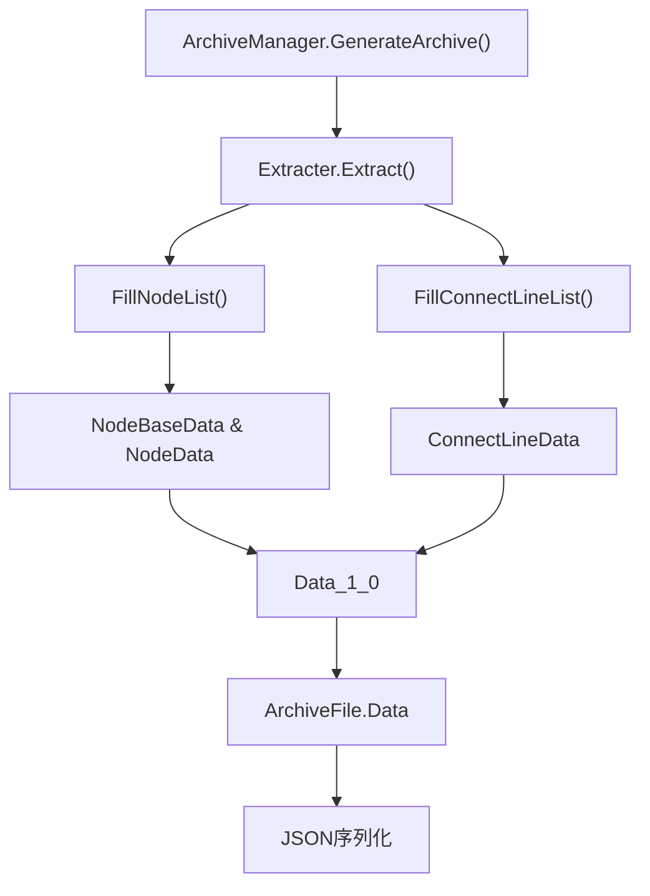
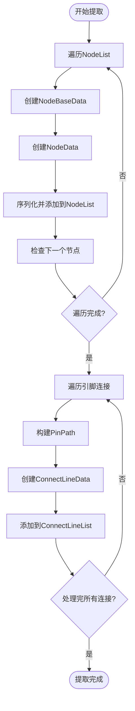
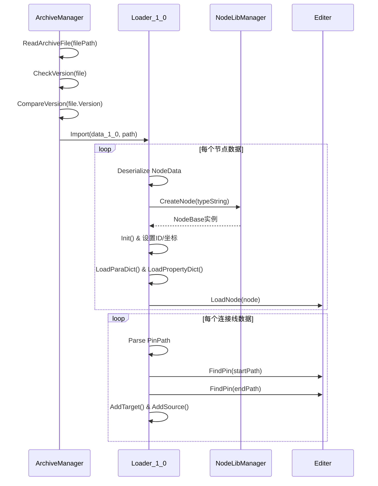
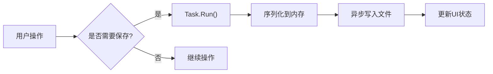

# 序列化机制

<cite>
**本文档引用文件**   
- [ArchiveManager.cs](file://XNode/SubSystem/ArchiveSystem/ArchiveManager.cs)
- [Extracter.cs](file://XNode/SubSystem/ArchiveSystem/Extracter.cs)
- [Data_1_0.cs](file://XNode/SubSystem/ArchiveSystem/Define/Data_1_0/Data_1_0.cs)
- [NodeBaseData.cs](file://XNode/SubSystem/ArchiveSystem/Define/Data_1_0/NodeBaseData.cs)
- [NodeData.cs](file://XNode/SubSystem/ArchiveSystem/Define/Data_1_0/NodeData.cs)
- [ConnectLineData.cs](file://XNode/SubSystem/ArchiveSystem/Define/Data_1_0/ConnectLineData.cs)
- [Loader_1_0.cs](file://XNode/SubSystem/ArchiveSystem/Loader/Loader_1_0.cs)
- [ArchiveFile.cs](file://XLib.Base/ArchiveFrame/ArchiveFile.cs)
- [ArchiveVersion.cs](file://XLib.Base/ArchiveFrame/ArchiveVersion.cs)
</cite>

## 目录
1. [简介](#简介)
2. [核心组件](#核心组件)
3. [序列化流程架构](#序列化流程架构)
4. [对象图遍历与转换逻辑](#对象图遍历与转换逻辑)
5. [反序列化与数据加载](#反序列化与数据加载)
6. [引用处理与类型元数据保留](#引用处理与类型元数据保留)
7. [性能优化建议](#性能优化建议)
8. [常见异常与调试方法](#常见异常与调试方法)
9. [结论](#结论)

## 简介
本文档深入解析XNode项目中的序列化机制，重点阐述`ArchiveManager`如何协调整个序列化流程，以及`Extracter`在运行时对象（如`NodeBase`、`ConnectLine`）与持久化数据模型（`Data_1_0`）之间的转换逻辑。详细说明对象图遍历策略、引用处理方式以及类型元数据的保留机制，并提供性能优化建议和常见异常的调试方法。

## 核心组件

本节分析序列化机制中的核心组件及其职责。

**中文(核心组件)来源**
- [ArchiveManager.cs](file://XNode/SubSystem/ArchiveSystem/ArchiveManager.cs#L1-L136)
- [Extracter.cs](file://XNode/SubSystem/ArchiveSystem/Extracter.cs#L1-L90)
- [Data_1_0.cs](file://XNode/SubSystem/ArchiveSystem/Define/Data_1_0/Data_1_0.cs#L1-L13)

## 序列化流程架构

**中文(流程架构)来源**
- [ArchiveManager.cs](file://XNode/SubSystem/ArchiveSystem/ArchiveManager.cs#L25-L35)
- [Extracter.cs](file://XNode/SubSystem/ArchiveSystem/Extracter.cs#L5-L15)

## 对象图遍历与转换逻辑

`Extracter`类负责将内存中的节点和连接线对象转换为可持久化的数据模型。其核心策略是遍历编辑器中的节点列表，并提取每个节点的基本信息、参数和属性。

节点转换过程如下：
1. 遍历`WM.Main.Editer.NodeList`中的所有`NodeBase`实例
2. 为每个节点创建`NodeBaseData`，包含库名、类型字符串、版本、ID和坐标
3. 构建`NodeData`，包含基本数据的字符串表示、参数字典和属性字典
4. 将序列化的`NodeData`字符串添加到`Data_1_0.NodeList`

连接线的提取采用间接引用方式：
1. 构建`Dictionary<PinBase, HashSet<PinBase>>`记录所有输出引脚及其目标
2. 忽略输入引脚和无连接的输出引脚
3. 将每个连接转换为`PinPath`字符串对，存储在`ConnectLineList`中

**中文(遍历与转换)来源**
- [Extracter.cs](file://XNode/SubSystem/ArchiveSystem/Extracter.cs#L17-L75)

## 反序列化与数据加载

反序列化由`ArchiveManager.LoadArchive`协调，`Loader_1_0.Import`具体执行。流程如下：

1. 版本检查：通过`ArchiveVersion`比较存档版本与当前软件版本
2. 数据转换：使用`JsonConvert.DeserializeObject<Data_1_0>`解析原始JSON数据
3. 节点加载：逐个创建节点实例，恢复ID、坐标、参数和属性
4. 连接线重建：通过`PinPath`定位引脚并重新建立连接

节点创建依赖`NodeLibManager`根据类型字符串实例化具体节点类型，确保类型一致性。

**中文(反序列化)来源**
- [ArchiveManager.cs](file://XNode/SubSystem/ArchiveSystem/ArchiveManager.cs#L45-L95)
- [Loader_1_0.cs](file://XNode/SubSystem/ArchiveSystem/Loader/Loader_1_0.cs#L1-L81)

## 引用处理与类型元数据保留

系统通过以下机制处理对象引用和保留类型信息：

- **引脚路径引用**：使用`PinPath`类将引脚引用序列化为字符串路径（如"NodeID.PinGroup.PinIndex"），避免直接序列化对象引用
- **类型标识**：通过`TypeString`字段保留节点类型信息，支持跨版本兼容性
- **版本控制**：每个节点携带`Version`字段，允许`LoadParaDict`和`LoadPropertyDict`方法根据版本差异进行数据迁移
- **字典存储**：参数和属性以`Dictionary<string, string>`形式存储，支持灵活的字段映射

空值处理策略：
- 所有集合类型（如`NodeList`）在声明时初始化为空集合，避免null引用
- 字符串字段提供默认值（如"1.0"、"0,0"），确保反序列化稳定性
- 使用`ToObject<T>()`时进行null检查，防止异常传播

## 性能优化建议

为提升序列化性能，建议采用以下策略：

1. **分批序列化大项目**：对于包含大量节点的项目，可将`NodeList`分块处理，避免内存峰值
2. **异步I/O操作**：将`File.ReadAllText`和文件写入操作移至后台线程，防止UI阻塞
3. **对象池优化**：对频繁创建的`PinPath`、`NodeBaseData`等临时对象实现对象池
4. **增量保存**：仅序列化修改过的节点，而非整个对象图
5. **压缩存储**：对大型存档文件启用GZIP压缩

## 常见异常与调试方法

常见序列化异常及解决方案：

- **类型未标记Serializable**：虽然使用JSON序列化，但仍需确保所有字段可被Newtonsoft.Json访问。检查私有字段或只读属性是否需要`[JsonProperty]`标记
- **版本不兼容**：当`CompareVersion`返回负值时，提示用户升级软件。建议实现向后兼容的数据迁移脚本
- **引脚路径解析失败**：确保`PinPath.ToString()`和`ParsePinPath()`的格式一致性，添加格式验证
- **循环引用检测**：当前机制通过引脚连接信息间接表示，避免了直接对象循环。若扩展功能，需在`Extracter`中添加循环检测

调试建议：
1. 在`Extracter.Extract()`前后验证`NodeList`数量一致性
2. 使用`JObject`预解析验证数据结构完整性
3. 在`Loader_1_0`的catch块中记录详细异常堆栈
4. 实现存档校验和（如MD5）验证文件完整性

**中文(异常调试)来源**
- [ArchiveManager.cs](file://XNode/SubSystem/ArchiveSystem/ArchiveManager.cs#L60-L70)
- [Loader_1_0.cs](file://XNode/SubSystem/ArchiveSystem/Loader/Loader_1_0.cs#L10-L15)

## 结论

XNode的序列化机制通过`ArchiveManager`统一协调，`Extracter`负责对象提取，`Loader_1_0`完成数据重建，形成了清晰的职责分离。系统采用字符串化路径引用和字典式参数存储，有效解决了对象引用和类型保留问题。建议未来引入异步序列化和增量保存机制以提升大型项目的响应性能。