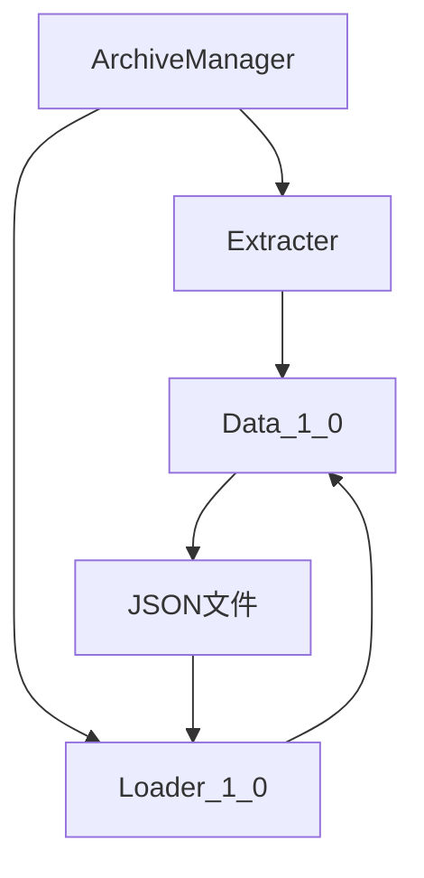
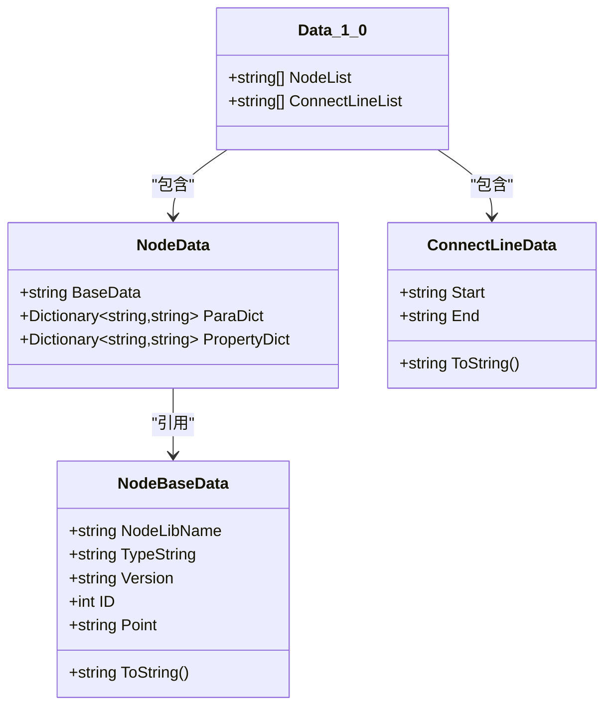
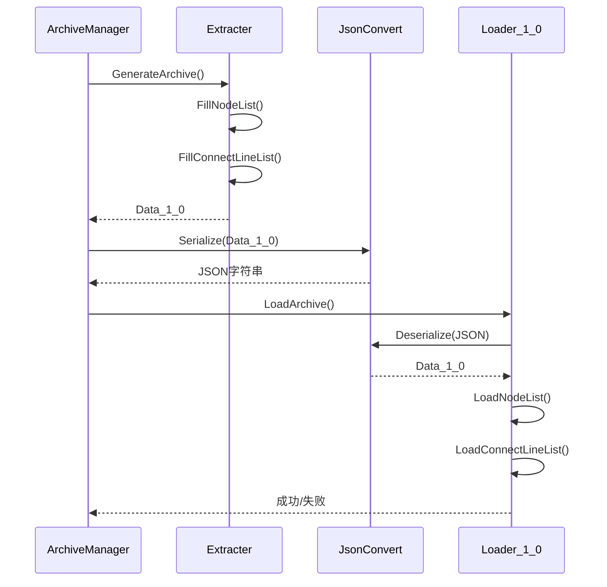
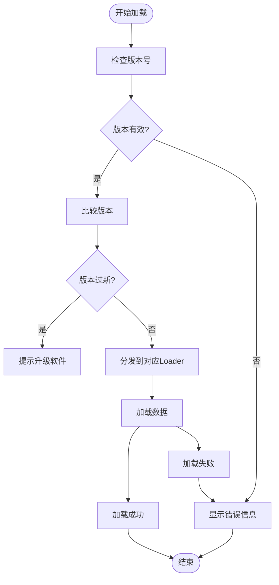

# 归档系统

<cite>
**本文档引用的文件**  
- [ArchiveManager.cs](file://XNode/SubSystem/ArchiveSystem/ArchiveManager.cs)
- [Extracter.cs](file://XNode/SubSystem/ArchiveSystem/Extracter.cs)
- [Loader_1_0.cs](file://XNode/SubSystem/ArchiveSystem/Loader/Loader_1_0.cs)
- [Data_1_0.cs](file://XNode/SubSystem/ArchiveSystem/Define/Data_1_0/Data_1_0.cs)
- [NodeData.cs](file://XNode/SubSystem/ArchiveSystem/Define/Data_1_0/NodeData.cs)
- [NodeBaseData.cs](file://XNode/SubSystem/ArchiveSystem/Define/Data_1_0/NodeBaseData.cs)
- [ConnectLineData.cs](file://XNode/SubSystem/ArchiveSystem/Define/Data_1_0/ConnectLineData.cs)
- [NodeBase.cs](file://XLib.Node/NodeBase.cs)
- [FileNode.cs](file://NodeLib.File/Define/FileNode.cs)
</cite>

## 目录
1. [引言](#引言)
2. [归档系统架构概览](#归档系统架构概览)
3. [核心组件分析](#核心组件分析)
4. [数据结构设计](#数据结构设计)
5. [序列化与反序列化流程](#序列化与反序列化流程)
6. [版本兼容性设计](#版本兼容性设计)
7. [数据迁移与恢复策略](#数据迁移与恢复策略)
8. [常见问题与解决方案](#常见问题与解决方案)
9. [结论](#结论)

## 引言
XNode项目采用基于JSON的持久化机制，通过归档系统实现运行时对象（如NodeBase、ConnectLine等）的完整序列化与反序列化。本系统设计注重版本兼容性，支持未来格式升级的同时确保旧版本文件可读。文档将深入解析ArchiveManager、Extracter、Loader_1_0等核心组件，详细说明Data_1_0数据模型的设计原则，并提供实际JSON样例展示存档文件结构。

## 归档系统架构概览

**图示来源**  
- [ArchiveManager.cs](file://XNode/SubSystem/ArchiveSystem/ArchiveManager.cs#L1-L136)
- [Extracter.cs](file://XNode/SubSystem/ArchiveSystem/Extracter.cs#L1-L90)
- [Loader_1_0.cs](file://XNode/SubSystem/ArchiveSystem/Loader/Loader_1_0.cs#L1-L81)

**本节来源**  
- [ArchiveManager.cs](file://XNode/SubSystem/ArchiveSystem/ArchiveManager.cs#L1-L136)

## 核心组件分析

### ArchiveManager：归档协调中枢
ArchiveManager作为单例模式实现的协调中心，负责管理整个归档生命周期。它通过`GenerateArchive`方法触发序列化流程，调用Extracter提取数据；通过`LoadArchive`方法启动反序列化流程，根据版本号调度对应的Loader。版本控制机制确保了向后兼容性，防止加载未来版本的不兼容文件。

**本节来源**  
- [ArchiveManager.cs](file://XNode/SubSystem/ArchiveSystem/ArchiveManager.cs#L1-L136)

### Extracter：运行时对象提取器
Extracter负责将编辑器中的运行时对象转换为可存储的数据模型。其核心方法`Extract`遍历节点列表和连接线信息，分别调用`FillNodeList`和`FillConnectLineList`进行数据填充。该组件实现了对象到字符串序列的转换，为JSON序列化做准备。

**本节来源**  
- [Extracter.cs](file://XNode/SubSystem/ArchiveSystem/Extracter.cs#L1-L90)

### Loader_1_0：版本化加载器
Loader_1_0实现了Data_1_0格式的反序列化逻辑。`Import`方法通过`LoadNodeList`和`LoadConnectLineList`分别重建节点和连接线。加载过程中包含异常捕获机制，确保损坏文件不会导致程序崩溃。该设计为未来扩展更多版本加载器（如Loader_2_0）提供了清晰的扩展点。

**本节来源**  
- [Loader_1_0.cs](file://XNode/SubSystem/ArchiveSystem/Loader/Loader_1_0.cs#L1-L81)

## 数据结构设计

### Data_1_0：顶层数据容器
Data_1_0作为版本1.0的顶层数据模型，包含两个核心集合：`NodeList`和`ConnectLineList`。两者均采用字符串列表形式存储，通过`ToString()`方法将复杂对象序列化为扁平字符串，便于JSON序列化处理。

**图示来源**  
- [Data_1_0.cs](file://XNode/SubSystem/ArchiveSystem/Define/Data_1_0/Data_1_0.cs#L1-L13)
- [NodeData.cs](file://XNode/SubSystem/ArchiveSystem/Define/Data_1_0/NodeData.cs#L1-L16)
- [NodeBaseData.cs](file://XNode/SubSystem/ArchiveSystem/Define/Data_1_0/NodeBaseData.cs#L1-L33)
- [ConnectLineData.cs](file://XNode/SubSystem/ArchiveSystem/Define/Data_1_0/ConnectLineData.cs#L1-L13)

**本节来源**  
- [Data_1_0.cs](file://XNode/SubSystem/ArchiveSystem/Define/Data_1_0/Data_1_0.cs#L1-L13)

### NodeData：节点数据封装
NodeData封装了单个节点的完整状态，包含三部分：`BaseData`（基本元数据）、`ParaDict`（参数字典）和`PropertyDict`（属性字典）。这种设计分离了结构信息与业务数据，便于版本迁移时的字段映射。

### NodeBaseData：基础元数据
NodeBaseData存储节点的识别信息，包括`NodeLibName`（库名称）、`TypeString`（类型标识）、`Version`（节点版本）、`ID`（实例编号）和`Point`（坐标）。其`ToString()`方法采用"/"分隔的扁平化格式，便于反序列化解析。

### ConnectLineData：连接线表示
ConnectLineData使用`Start`和`End`两个字符串字段表示连接线的起点和终点。字符串值为PinPath的序列化形式，通过"-"分隔构成完整连接关系。这种设计简洁高效，避免了复杂对象嵌套。

## 序列化与反序列化流程

**图示来源**  
- [ArchiveManager.cs](file://XNode/SubSystem/ArchiveSystem/ArchiveManager.cs#L1-L136)
- [Extracter.cs](file://XNode/SubSystem/ArchiveSystem/Extracter.cs#L1-L90)
- [Loader_1_0.cs](file://XNode/SubSystem/ArchiveSystem/Loader/Loader_1_0.cs#L1-L81)

**本节来源**  
- [Extracter.cs](file://XNode/SubSystem/ArchiveSystem/Extracter.cs#L1-L90)
- [Loader_1_0.cs](file://XNode/SubSystem/ArchiveSystem/Loader/Loader_1_0.cs#L1-L81)

### 序列化流程
1. ArchiveManager调用Extracter.Extract()
2. Extracter遍历WM.Main.Editer.NodeList
3. 对每个节点创建NodeBaseData并序列化为字符串
4. 构建NodeData对象并序列化为JSON字符串
5. 收集所有连接线信息，生成ConnectLineData字符串
6. 返回Data_1_0实例供JSON序列化

### 反序列化流程
1. ArchiveManager读取JSON文件并反序列化为ArchiveFile
2. 根据Version字段选择Loader_1_0
3. Loader_1_0解析NodeList中的每个字符串
4. 通过NodeLibManager创建对应节点实例
5. 恢复ID、坐标、参数和属性
6. 解析ConnectLineList并重建引脚连接

## 版本兼容性设计

**图示来源**  
- [ArchiveManager.cs](file://XNode/SubSystem/ArchiveSystem/ArchiveManager.cs#L1-L136)

**本节来源**  
- [ArchiveManager.cs](file://XNode/SubSystem/ArchiveSystem/ArchiveManager.cs#L1-L136)

系统通过`ArchiveVersion`类实现版本比较，支持主版本号和次版本号的语义化比较。`CompareVersion`方法返回负值时表示存档版本更新，此时系统会提示用户升级软件。这种设计确保了：
- 旧版本软件无法加载未来格式（防止数据损坏）
- 新版本软件可加载旧格式（向后兼容）
- 版本号为空或"???"时视为无效

## 数据迁移与恢复策略

### 数据迁移路径
当引入新版本格式（如Data_2_0）时，应：
1. 创建新的Loader_2_0类实现导入逻辑
2. 在ArchiveManager的ImportArchiveData中添加case分支
3. 实现Data_1_0到Data_2_0的转换器
4. 在新版本中保留Loader_1_0以支持旧文件

### 损坏文件恢复方案
系统内置多层防护：
- JSON反序列化异常捕获
- 版本号有效性验证
- 关键字段null检查
- 单个节点/连接线加载失败时跳过而非中断

建议的恢复流程：
1. 使用文本编辑器检查JSON语法
2. 验证"Version"字段有效性
3. 逐段注释NodeList/ConnectLineList定位损坏数据
4. 手动修复或删除损坏条目

## 常见问题与解决方案

### 类型转换错误
**问题**：NodeBaseData构造函数中`int.Parse(array[3])`可能抛出FormatException  
**解决方案**：增加try-catch包裹，无效ID时使用默认值-1

**问题**：JsonConvert.DeserializeObject可能返回null  
**解决方案**：所有反序列化结果必须进行null检查

### 引脚路径解析失败
**问题**：PinPath.ParsePinPath可能因格式错误失败  
**解决方案**：在Loader_1_0中增加try-catch，跳过无效连接线

### 节点创建失败
**问题**：NodeLibManager.CreateNode可能返回null  
**解决方案**：检查节点库名称和类型字符串的正确性

## 结论
XNode的归档系统通过清晰的职责分离实现了可靠的持久化机制。ArchiveManager作为协调者，Extracter负责数据提取，Loader_1_0处理版本化加载，Data_1_0提供结构化数据模型。系统设计充分考虑了版本演进需求，为未来扩展预留了空间。建议在后续版本中：
- 引入校验和机制增强文件完整性验证
- 支持压缩存档文件减小体积
- 增加增量保存功能提升性能
- 实现自动备份机制防止数据丢失