# 数据提取与封装

<cite>
**本文档引用文件**  
- [Extracter.cs](file://XNode/SubSystem/ArchiveSystem/Extracter.cs)
- [Data_1_0.cs](file://XNode/SubSystem/ArchiveSystem/Define/Data_1_0/Data_1_0.cs)
- [NodeData.cs](file://XNode/SubSystem/ArchiveSystem/Define/Data_1_0/NodeData.cs)
- [NodeBaseData.cs](file://XNode/SubSystem/ArchiveSystem/Define/Data_1_0/NodeBaseData.cs)
- [ConnectLineData.cs](file://XNode/SubSystem/ArchiveSystem/Define/Data_1_0/ConnectLineData.cs)
- [PinPath.cs](file://XNode/SubSystem/NodeEditSystem/Define/PinPath.cs)
- [NodeBase.cs](file://XLib.Node/NodeBase.cs)
- [Flow_If.cs](file://XNode/SubSystem/NodeLibSystem/Define/Flows/Flow_If.cs)
- [Data_Int.cs](file://XNode/SubSystem/NodeLibSystem/Define/Data/Data_Int.cs)
</cite>

## 目录
1. [引言](#引言)
2. [数据结构设计](#数据结构设计)
3. [Extracter工作机制](#extracter工作机制)
4. [节点数据序列化](#节点数据序列化)
5. [连接线数据提取](#连接线数据提取)
6. [数据完整性校验](#数据完整性校验)
7. [扩展指南](#扩展指南)
8. [JSON输出示例](#json输出示例)
9. [结论](#结论)

## 引言
本文档详细说明XNode系统中Extracter如何将复杂的节点编辑状态提取为扁平化的Data_1_0数据结构。该过程涉及节点与连接线的序列化、ID映射、引脚连接关系的持久化存储以及节点属性的通用化处理机制。通过分析核心数据结构与提取逻辑，为系统扩展和版本升级提供指导。

## 数据结构设计

### NodeBaseData设计原则
`NodeBaseData`类用于存储节点的基础元数据，采用字符串序列化格式`{NodeLibName}/{TypeString}/{Version}/{ID}/{Point}`，确保所有关键信息可被完整还原。

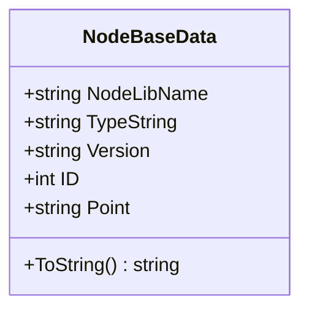

**图示来源**  
- [NodeBaseData.cs](file://XNode/SubSystem/ArchiveSystem/Define/Data_1_0/NodeBaseData.cs#L5-L33)

### NodeData设计原则
`NodeData`类封装单个节点的完整状态，包含基础数据、参数表和属性表三个核心部分，实现结构化与灵活性的平衡。

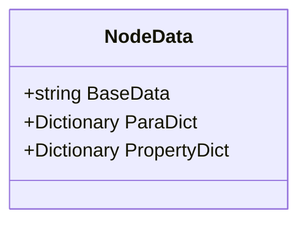

**图示来源**  
- [NodeData.cs](file://XNode/SubSystem/ArchiveSystem/Define/Data_1_0/NodeData.cs#L5-L16)

### ConnectLineData设计原则
`ConnectLineData`类表示连接线的端点信息，采用`Start-End`格式存储引脚路径，确保连接关系可被准确重建。

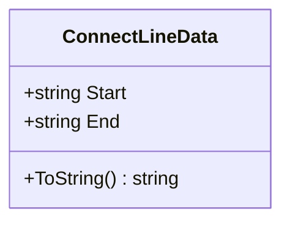

**图示来源**  
- [ConnectLineData.cs](file://XNode/SubSystem/ArchiveSystem/Define/Data_1_0/ConnectLineData.cs#L5-L13)

### Data_1_0整体结构
`Data_1_0`作为顶层数据容器，包含节点列表和连接线列表，形成完整的存档数据结构。

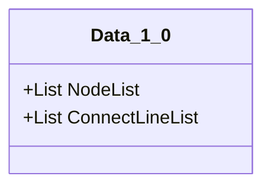

**图示来源**  
- [Data_1_0.cs](file://XNode/SubSystem/ArchiveSystem/Define/Data_1_0/Data_1_0.cs#L5-L13)

## Extracter工作机制

### 提取流程概览
Extracter通过静态方法`Extract()`协调节点和连接线的提取过程，生成完整的Data_1_0实例。

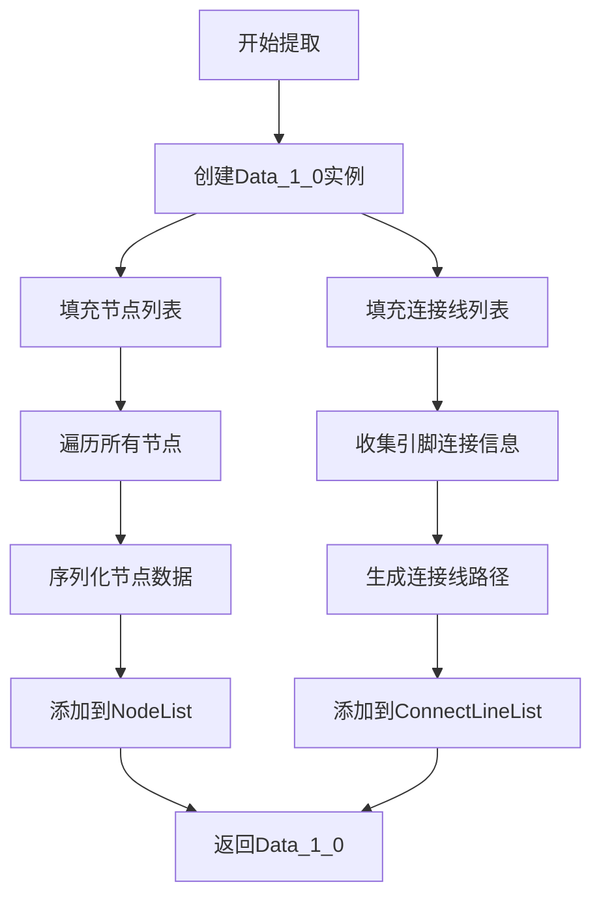

**图示来源**  
- [Extracter.cs](file://XNode/SubSystem/ArchiveSystem/Extracter.cs#L10-L48)

### ID映射机制
系统通过`ID`字段实现节点唯一标识，确保在序列化和反序列化过程中保持引用一致性。每个节点在创建时分配唯一ID，该ID随节点状态一同保存。

**节段来源**  
- [NodeBaseData.cs](file://XNode/SubSystem/ArchiveSystem/Define/Data_1_0/NodeBaseData.cs#L20-L21)

## 节点数据序列化

### 参数表(ParaDict)序列化
`ParaDict`存储节点运行时参数，由各节点类型通过重写`GetParaDict()`方法提供具体实现。例如`Flow_If`节点将逻辑值作为参数保存。

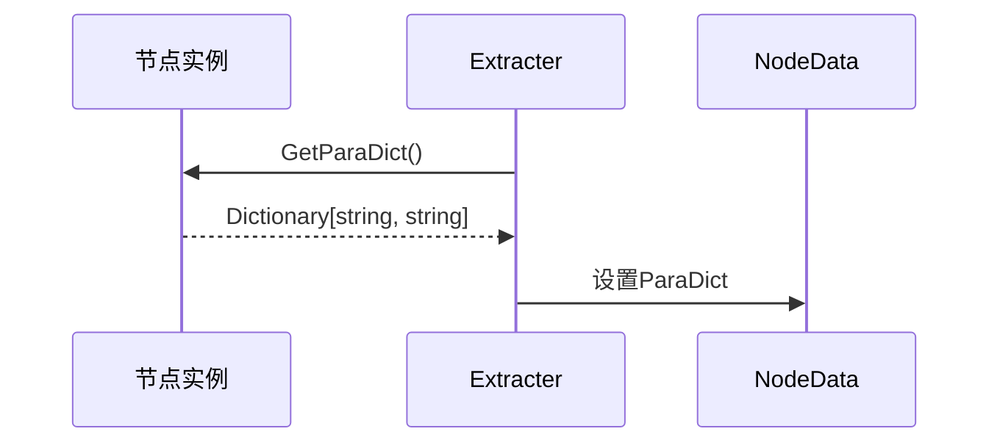

**图示来源**  
- [Flow_If.cs](file://XNode/SubSystem/NodeLibSystem/Define/Flows/Flow_If.cs#L39-L40)
- [NodeBase.cs](file://XLib.Node/NodeBase.cs#L380-L382)

### 属性表(PropertyDict)序列化
`PropertyDict`用于存储节点的可配置属性，通过`GetPropertyDict()`方法获取。例如`Func_NumberToRatio`节点保存精度设置。

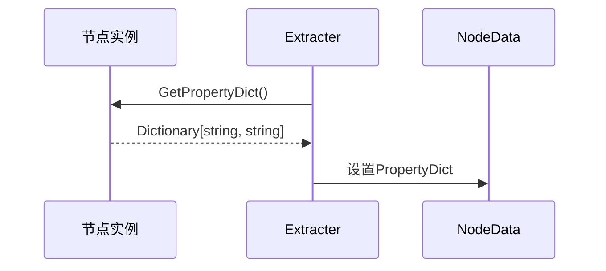

**图示来源**  
- [Func_NumberToRatio.cs](file://XNode/SubSystem/NodeLibSystem/Define/Functions/Func_NumberToRatio.cs#L66-L72)

### 通用存储机制
系统采用字典结构`Dictionary<string, string>`作为通用存储容器，具有以下优势：
- **灵活性**：可适应不同类型节点的参数需求
- **可扩展性**：无需修改数据结构即可支持新字段
- **序列化友好**：易于JSON转换和持久化存储

**节段来源**  
- [NodeData.cs](file://XNode/SubSystem/ArchiveSystem/Define/Data_1_0/NodeData.cs#L10-L16)

## 连接线数据提取

### 引脚连接关系序列化
Extracter通过遍历所有节点的引脚，收集输出引脚与其目标引脚的连接关系。连接信息以`PinBase`到`HashSet<PinBase>`的字典形式暂存。

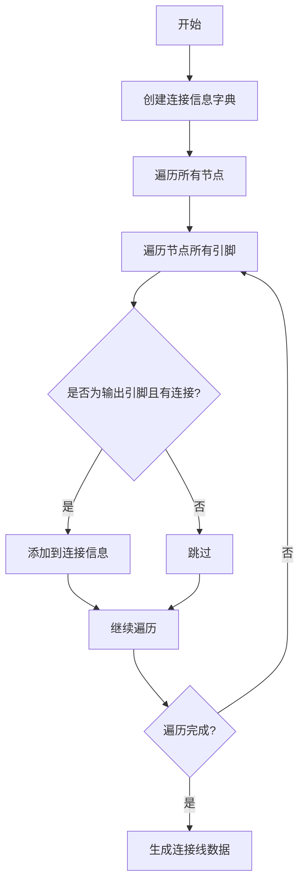

**图示来源**  
- [Extracter.cs](file://XNode/SubSystem/ArchiveSystem/Extracter.cs#L55-L70)

### PinPath结构解析
`PinPath`类采用`{NodeVersion},{NodeID},{GroupIndex},{PinIndex}`格式唯一标识一个引脚，确保连接关系的精确重建。

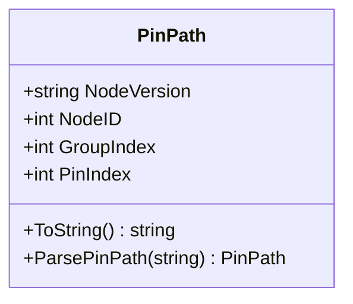

**图示来源**  
- [PinPath.cs](file://XNode/SubSystem/NodeEditSystem/Define/PinPath.cs#L5-L31)

## 数据完整性校验

### 连接线端点有效性检查
系统在反序列化阶段通过`PinPath.ParsePinPath()`方法验证连接线端点的有效性。该方法解析字符串路径并检查各组件的合理性。

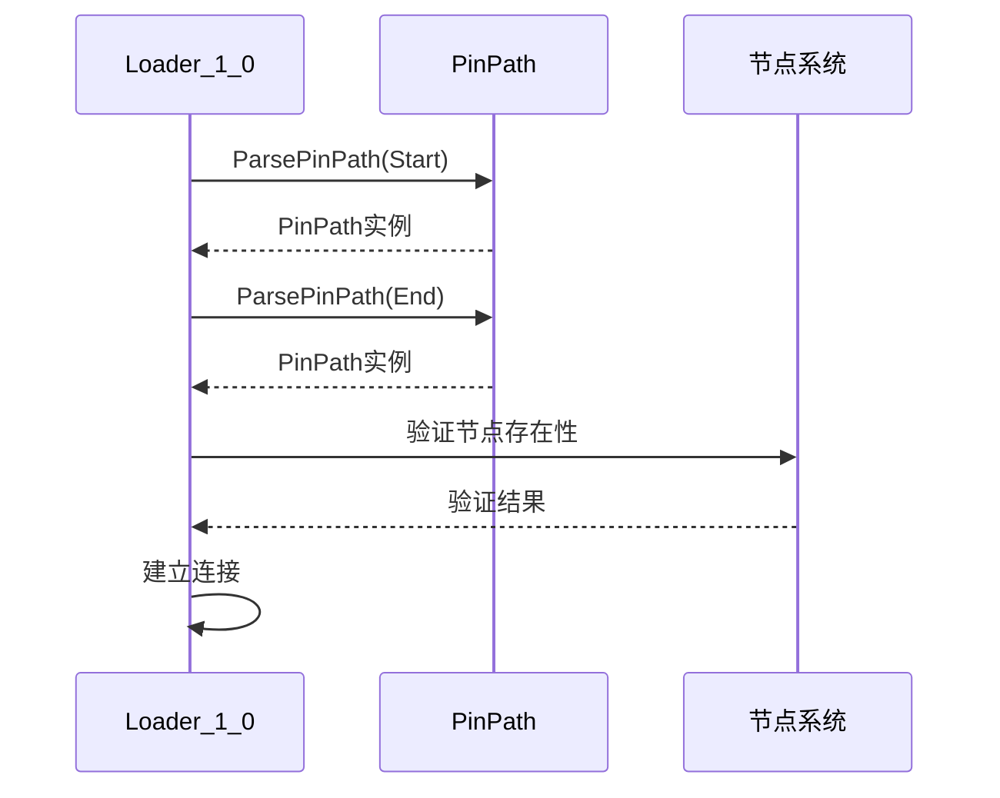

**节段来源**  
- [PinPath.cs](file://XNode/SubSystem/NodeEditSystem/Define/PinPath.cs#L7-L15)

### 数据结构完整性保障
通过以下机制确保数据完整性：
1. **空值检查**：所有集合类型初始化为默认实例
2. **边界检查**：访问集合时验证索引范围
3. **异常捕获**：在`LoadParaDict`中使用try-catch处理版本兼容性问题

**节段来源**  
- [Flow_If.cs](file://XNode/SubSystem/NodeLibSystem/Define/Flows/Flow_If.cs#L55-L59)

## 扩展指南

### 为自定义节点添加序列化支持
要为自定义节点类型添加序列化支持，需重写`GetParaDict()`和`LoadParaDict()`方法：

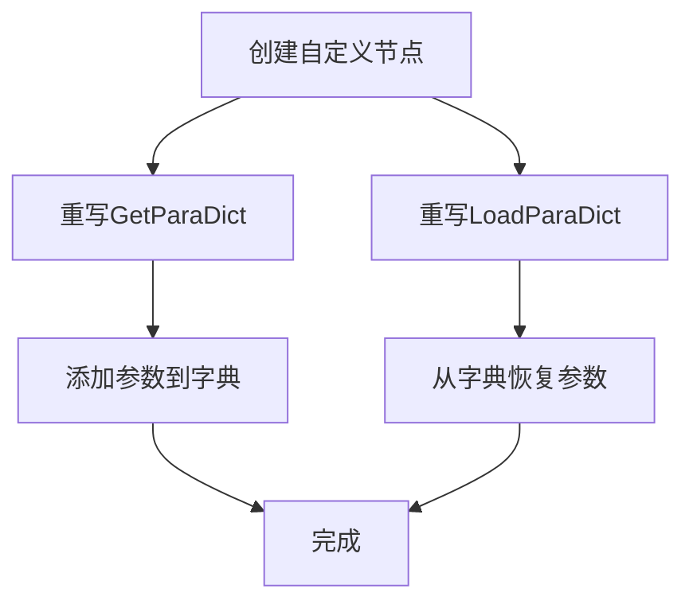

**节段来源**  
- [Data_Int.cs](file://XNode/SubSystem/NodeLibSystem/Define/Data/Data_Int.cs#L21-L28)

### 版本升级字段默认值策略
当新增字段时，应采用以下默认值填充策略：
1. **参数字段**：在`LoadParaDict`中使用try-catch捕获缺失键
2. **属性字段**：在`GetPropertyDict`中提供合理的默认值
3. **结构变更**：通过`Version`字段区分不同版本的处理逻辑

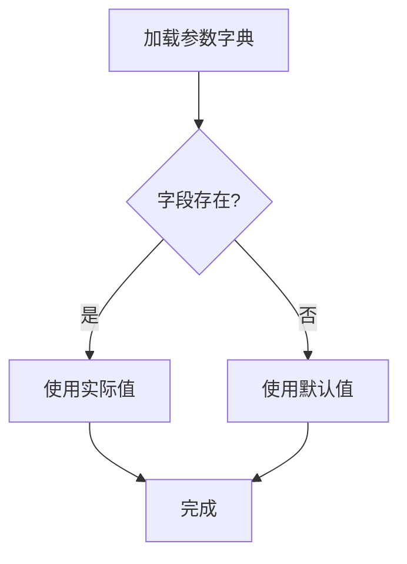

**节段来源**  
- [Flow_If.cs](file://XNode/SubSystem/NodeLibSystem/Define/Flows/Flow_If.cs#L55-L59)

## JSON输出示例

### 节点数据JSON结构
```json
{
  "BaseData": "Inner/Flow_If/1.0/101/100,200",
  "ParaDict": {
    "LogicValue": "True"
  },
  "PropertyDict": {}
}
```

### 连接线数据JSON结构
```json
"1.0,101,1,0-1.0,102,0,0"
```

### 完整Data_1_0结构
```json
{
  "NodeList": [
    "{\"BaseData\":\"Inner/Data_Int/1.0/100/50,100\",\"ParaDict\":{\"Data\":\"42\"},\"PropertyDict\":{}}",
    "{\"BaseData\":\"Inner/Flow_If/1.0/101/100,200\",\"ParaDict\":{\"LogicValue\":\"True\"},\"PropertyDict\":{}}"
  ],
  "ConnectLineList": [
    "1.0,100,0,0-1.0,101,1,0"
  ]
}
```

**节段来源**  
- [Extracter.cs](file://XNode/SubSystem/ArchiveSystem/Extracter.cs#L35-L37)
- [Extracter.cs](file://XNode/SubSystem/ArchiveSystem/Extracter.cs#L88-L90)

## 结论
Extracter通过系统化的数据提取机制，成功将复杂的节点编辑状态转换为扁平化的Data_1_0数据结构。该设计采用分层序列化策略，结合ID映射、引脚路径编码和通用字典存储，实现了高效的数据持久化。通过完善的扩展机制，系统能够灵活应对节点类型增加和版本升级的需求，为XNode的长期发展奠定了坚实基础。