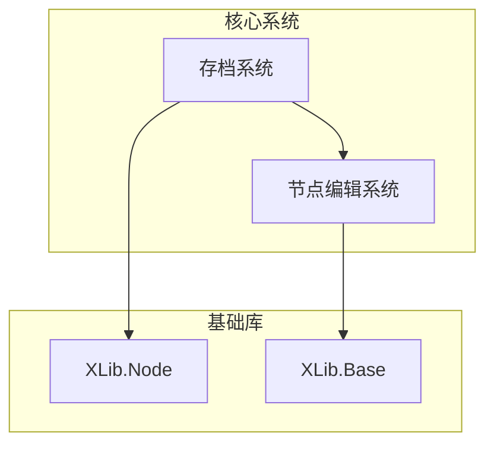
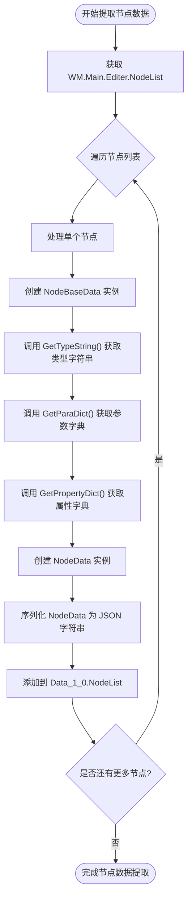
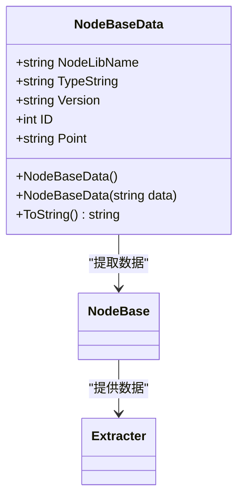
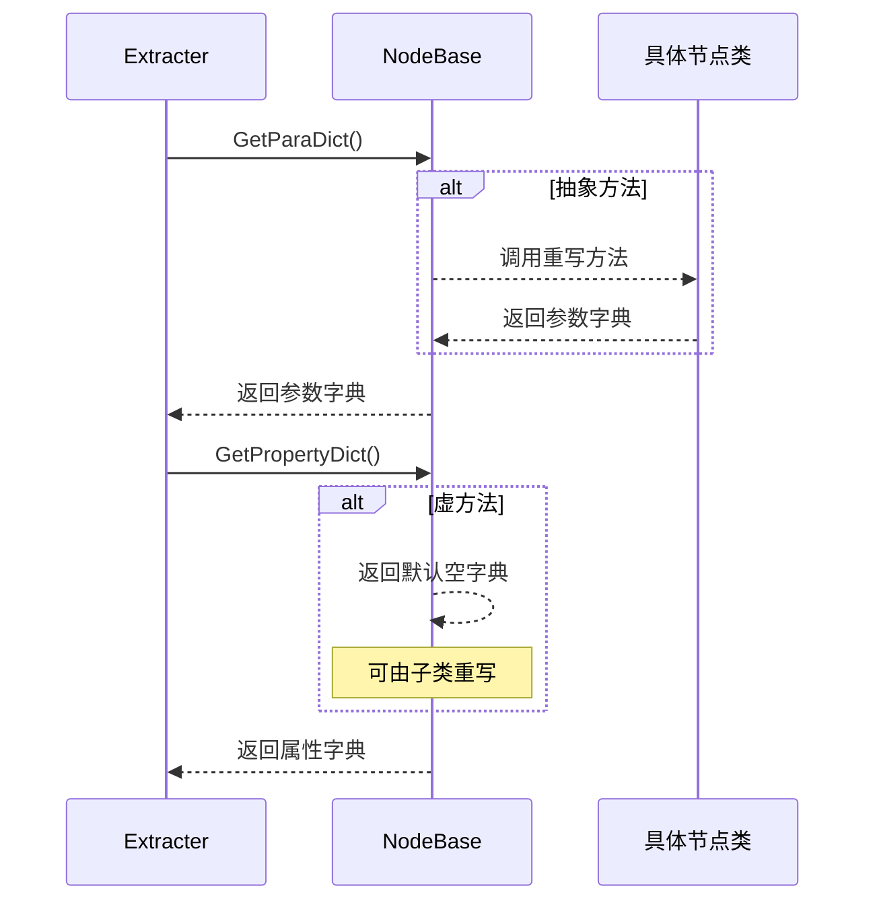
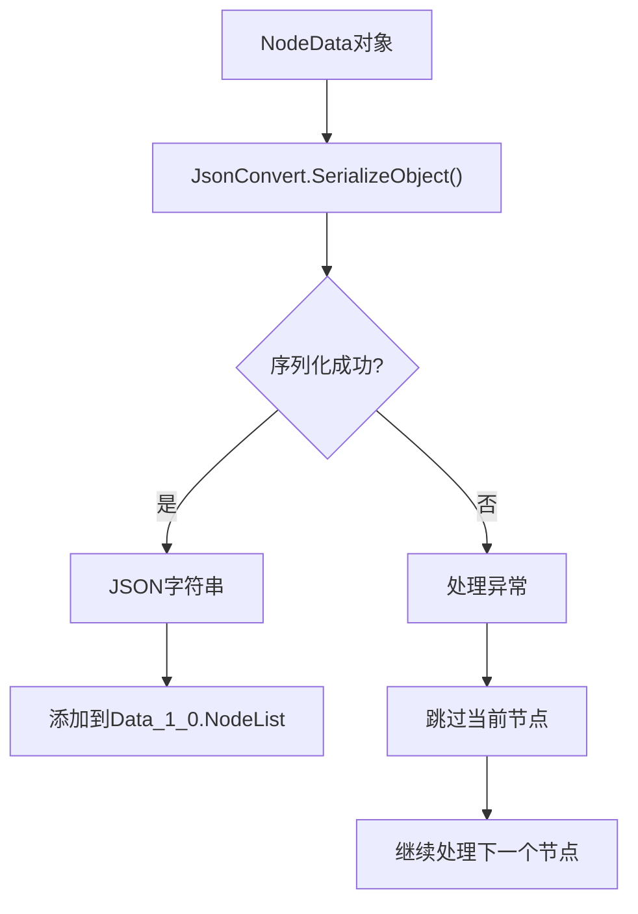
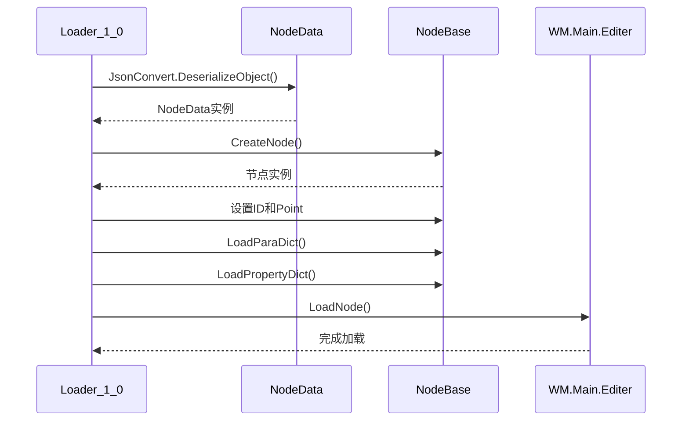

# 节点数据提取

<cite>
**本文档引用的文件**
- [Extracter.cs](file://XNode/SubSystem/ArchiveSystem/Extracter.cs)
- [Data_1_0.cs](file://XNode/SubSystem/ArchiveSystem/Define/Data_1_0/Data_1_0.cs)
- [NodeBaseData.cs](file://XNode/SubSystem/ArchiveSystem/Define/Data_1_0/NodeBaseData.cs)
- [NodeData.cs](file://XNode/SubSystem/ArchiveSystem/Define/Data_1_0/NodeData.cs)
- [NodeBase.cs](file://XLib.Node/NodeBase.cs)
- [CoreEditer.xaml.cs](file://XNode/CoreEditer.xaml.cs)
- [EditPanel.xaml.cs](file://XNode/SubSystem/NodeEditSystem/Panel/EditPanel.xaml.cs)
- [Loader_1_0.cs](file://XNode/SubSystem/ArchiveSystem/Loader/Loader_1_0.cs)
- [FileNode.cs](file://NodeLib.File/Define/FileNode.cs)
</cite>

## 目录
1. [项目结构](#项目结构)
2. [核心组件](#核心组件)
3. [节点数据提取流程](#节点数据提取流程)
4. [NodeBaseData序列化机制](#nodebasedata序列化机制)
5. [ParaDict与PropertyDict生成机制](#paradict与propertydict生成机制)
6. [JSON序列化与存储](#json序列化与存储)
7. [反序列化与ID映射](#反序列化与id映射)
8. [自定义节点类型识别](#自定义节点类型识别)

## 项目结构

本项目采用模块化架构，核心功能分布在多个子系统中。节点数据提取功能主要涉及`XNode`主项目中的`ArchiveSystem`（存档系统）和`NodeEditSystem`（节点编辑系统），以及基础库`XLib.Node`。

**Diagram sources**
- [Extracter.cs](file://XNode/SubSystem/ArchiveSystem/Extracter.cs#L1-L90)
- [CoreEditer.xaml.cs](file://XNode/CoreEditer.xaml.cs#L1-L72)

**Section sources**
- [Extracter.cs](file://XNode/SubSystem/ArchiveSystem/Extracter.cs#L1-L90)
- [CoreEditer.xaml.cs](file://XNode/CoreEditer.xaml.cs#L1-L72)

## 核心组件

系统中的核心组件包括`Extracter`类负责数据提取，`Data_1_0`结构体定义存档数据格式，`NodeBaseData`和`NodeData`类定义节点数据结构，`NodeBase`基类提供节点基本功能。

**Section sources**
- [Extracter.cs](file://XNode/SubSystem/ArchiveSystem/Extracter.cs#L1-L90)
- [Data_1_0.cs](file://XNode/SubSystem/ArchiveSystem/Define/Data_1_0/Data_1_0.cs#L1-L13)
- [NodeBaseData.cs](file://XNode/SubSystem/ArchiveSystem/Define/Data_1_0/NodeBaseData.cs#L1-L33)
- [NodeData.cs](file://XNode/SubSystem/ArchiveSystem/Define/Data_1_0/NodeData.cs#L1-L16)

## 节点数据提取流程

`Extracter`类的`FillNodeList`方法负责遍历`WM.Main.Editer.NodeList`中的节点实例，并将其转换为可序列化的`NodeData`对象。该方法首先通过`WM.Main.Editer.NodeList`获取当前编辑器中的所有节点，然后对每个节点进行数据提取和转换。

**Diagram sources**
- [Extracter.cs](file://XNode/SubSystem/ArchiveSystem/Extracter.cs#L15-L38)

**Section sources**
- [Extracter.cs](file://XNode/SubSystem/ArchiveSystem/Extracter.cs#L15-L38)
- [CoreEditer.xaml.cs](file://XNode/CoreEditer.xaml.cs#L13-L13)
- [EditPanel.xaml.cs](file://XNode/SubSystem/NodeEditSystem/Panel/EditPanel.xaml.cs#L16-L16)

## NodeBaseData序列化机制

`NodeBaseData`类负责封装节点的基本信息，包括`NodeLibName`、`TypeString`、`Version`、`ID`和`Point`。这些信息通过`ToString()`方法以特定格式序列化为字符串，格式为`NodeLibName/TypeString/Version/ID/Point`。

**Diagram sources**
- [NodeBaseData.cs](file://XNode/SubSystem/ArchiveSystem/Define/Data_1_0/NodeBaseData.cs#L1-L33)
- [NodeBase.cs](file://XLib.Node/NodeBase.cs#L1-L417)

**Section sources**
- [NodeBaseData.cs](file://XNode/SubSystem/ArchiveSystem/Define/Data_1_0/NodeBaseData.cs#L1-L33)
- [Extracter.cs](file://XNode/SubSystem/ArchiveSystem/Extracter.cs#L20-L25)

## ParaDict与PropertyDict生成机制

`ParaDict`和`PropertyDict`字典通过节点的`GetParaDict()`和`GetPropertyDict()`方法获取。`GetParaDict()`是抽象方法，必须由具体节点类实现，用于返回节点的参数字典。`GetPropertyDict()`是虚方法，默认返回空字典，可由子类重写以提供自定义属性。

**Diagram sources**
- [NodeBase.cs](file://XLib.Node/NodeBase.cs#L350-L370)
- [Extracter.cs](file://XNode/SubSystem/ArchiveSystem/Extracter.cs#L26-L31)

**Section sources**
- [NodeBase.cs](file://XLib.Node/NodeBase.cs#L350-L370)
- [Extracter.cs](file://XNode/SubSystem/ArchiveSystem/Extracter.cs#L26-L31)
- [FileNode.cs](file://NodeLib.File/Define/FileNode.cs#L1-L10)

## JSON序列化与存储

提取的`NodeData`对象通过`JsonConvert.SerializeObject()`方法序列化为JSON字符串，并存入`Data_1_0.NodeList`列表中。`Data_1_0`类的`NodeList`属性是字符串列表，用于存储所有节点的序列化数据。

**Diagram sources**
- [Extracter.cs](file://XNode/SubSystem/ArchiveSystem/Extracter.cs#L37-L38)
- [Data_1_0.cs](file://XNode/SubSystem/ArchiveSystem/Define/Data_1_0/Data_1_0.cs#L8-L8)

**Section sources**
- [Extracter.cs](file://XNode/SubSystem/ArchiveSystem/Extracter.cs#L37-L38)
- [Data_1_0.cs](file://XNode/SubSystem/ArchiveSystem/Define/Data_1_0/Data_1_0.cs#L8-L8)

## 反序列化与ID映射

在反序列化过程中，`Loader_1_0`类负责将存档数据重新加载到编辑器中。`LoadNodeList`方法解析`NodeData`字符串，创建相应的节点实例，并恢复其ID和坐标。ID映射在重建节点连接时起关键作用，确保连接线能正确指向目标节点。

**Diagram sources**
- [Loader_1_0.cs](file://XNode/SubSystem/ArchiveSystem/Loader/Loader_1_0.cs#L20-L50)
- [Extracter.cs](file://XNode/SubSystem/ArchiveSystem/Extracter.cs#L20-L25)

**Section sources**
- [Loader_1_0.cs](file://XNode/SubSystem/ArchiveSystem/Loader/Loader_1_0.cs#L20-L50)
- [Extracter.cs](file://XNode/SubSystem/ArchiveSystem/Extracter.cs#L20-L25)

## 自定义节点类型识别

自定义节点必须重写`GetTypeString()`方法以确保类型正确识别。该方法返回一个字符串标识符，用于在反序列化时创建正确的节点实例。`NodeLibManager`根据`NodeLibName`和`TypeString`来查找并创建相应的节点类型。

**Section sources**
- [NodeBase.cs](file://XLib.Node/NodeBase.cs#L345-L348)
- [FileNode.cs](file://NodeLib.File/Define/FileNode.cs#L1-L10)