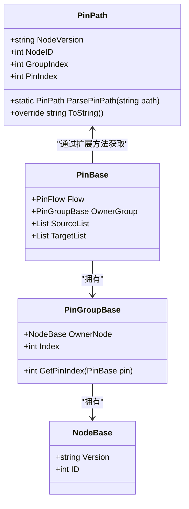
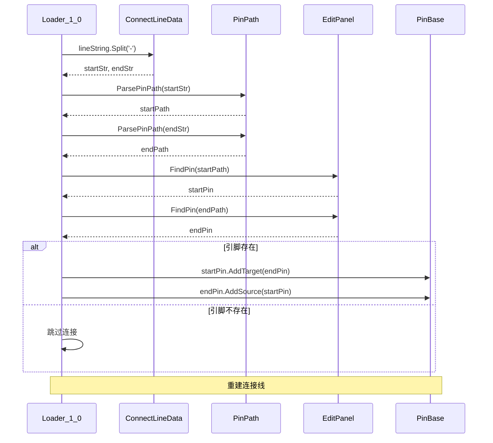
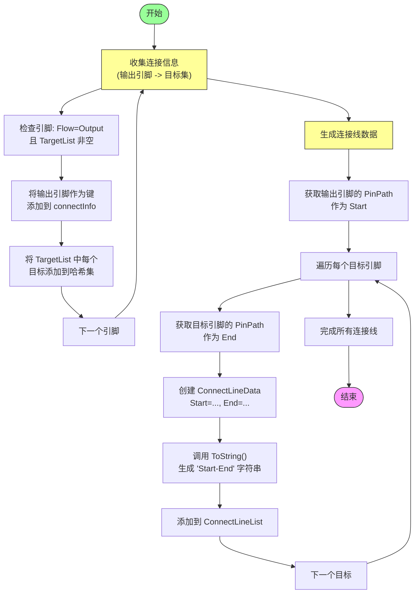

# 连接线数据提取

<cite>
**本文档引用的文件**   
- [Extracter.cs](file://XNode/SubSystem/ArchiveSystem/Extracter.cs)
- [ConnectLineData.cs](file://XNode/SubSystem/ArchiveSystem/Define/Data_1_0/ConnectLineData.cs)
- [PinPath.cs](file://XNode/SubSystem/NodeEditSystem/Define/PinPath.cs)
- [ClassExtension.cs](file://XNode/AppTool/ClassExtension.cs)
- [Loader_1_0.cs](file://XNode/SubSystem/ArchiveSystem/Loader/Loader_1_0.cs)
- [EditPanel.xaml.cs](file://XNode/SubSystem/NodeEditSystem/Panel/EditPanel.xaml.cs)
</cite>

## 目录
1. [引言](#引言)
2. [连接线提取流程](#连接线提取流程)
3. [PinPath结构的作用](#pinpath结构的作用)
4. [连接线数据的序列化与反序列化](#连接线数据的序列化与反序列化)
5. [端点有效性校验分析](#端点有效性校验分析)
6. [多目标连接展开示例](#多目标连接展开示例)
7. [结论与建议](#结论与建议)

## 引言
本文深入解析XNode项目中`Extracter.FillConnectLineList`方法的连接线数据提取逻辑。该方法负责将编辑器中节点间的连接关系持久化为可存储的数据格式，是系统存档功能的核心组成部分。通过分析其工作原理，可以理解节点连接信息如何被准确捕获、表示和重建。

## 连接线提取流程

`Extracter.FillConnectLineList`方法通过遍历所有节点的输出引脚及其目标引脚列表来构建连接关系映射。整个过程分为两个阶段：连接信息收集和连接线数据生成。

在第一阶段，方法创建一个字典`connectInfo`，以输出引脚（`PinBase`）为键，其所有连接目标引脚的集合（`HashSet<PinBase>`）为值。遍历编辑器中的每个节点及其所有引脚，仅处理流向为`PinFlow.Output`且目标列表非空的引脚。对于每个符合条件的输出引脚，将其自身作为键加入字典（若尚不存在），并将其`TargetList`中的每个目标引脚添加到对应的哈希集中。

第二阶段遍历`connectInfo`字典中的每一对键值，为每个输出引脚到其每个目标引脚的连接创建一条`ConnectLineData`记录。通过调用`GetPinPath()`方法获取起点和终点的引脚路径，并将其字符串化后赋值给`ConnectLineData`的`Start`和`End`字段，最终将连接线数据的字符串表示添加到结果列表中。

**Section sources**
- [Extracter.cs](file://XNode/SubSystem/ArchiveSystem/Extracter.cs#L50-L90)

## PinPath结构的作用

`PinPath`类在表示引脚路径中起着关键作用，它将一个引脚的完整位置信息编码为结构化的数据。其字段包括：
- `NodeVersion`：节点版本号
- `NodeID`：节点唯一标识
- `GroupIndex`：引脚组索引
- `PinIndex`：引脚在组内的索引

该结构通过`GetPinPath()`扩展方法从`PinBase`实例构建，该方法利用引脚的`OwnerGroup`和`OwnerNode`属性获取层级信息。`PinPath`的`ToString()`方法将这些字段以逗号分隔的字符串格式输出（如`"1.0,123,0,1"`），这种格式简洁且易于解析，为连接线的序列化提供了基础。

**Diagram sources**
- [PinPath.cs](file://XNode/SubSystem/NodeEditSystem/Define/PinPath.cs#L5-L32)
- [ClassExtension.cs](file://XNode/AppTool/ClassExtension.cs#L10-L17)

**Section sources**
- [PinPath.cs](file://XNode/SubSystem/NodeEditSystem/Define/PinPath.cs#L5-L32)
- [ClassExtension.cs](file://XNode/AppTool/ClassExtension.cs#L10-L17)

## 连接线数据的序列化与反序列化

`ConnectLineData`类定义了连接线的持久化数据结构，包含`Start`和`End`两个字符串字段，分别表示连接的起点和终点引脚路径。其`ToString()`方法生成`'起点-终点'`的字符串格式（如`"1.0,123,0,1-1.0,456,1,0"`），这是连接线数据的标准序列化形式。

在反序列化过程中，`Loader_1_0.LoadConnectLineList`方法解析该字符串：首先按`'-'`分割得到起点和终点路径字符串，然后调用`PinPath.ParsePinPath()`静态方法将每个路径字符串解析为`PinPath`对象。接着，通过`EditPanel.FindPin()`方法根据`PinPath`查找对应的引脚实例。若两端引脚均存在，则调用`AddTarget`和`AddSource`方法重建连接关系。

**Diagram sources**
- [ConnectLineData.cs](file://XNode/SubSystem/ArchiveSystem/Define/Data_1_0/ConnectLineData.cs#L5-L13)
- [Loader_1_0.cs](file://XNode/SubSystem/ArchiveSystem/Loader/Loader_1_0.cs#L65-L78)

**Section sources**
- [ConnectLineData.cs](file://XNode/SubSystem/ArchiveSystem/Define/Data_1_0/ConnectLineData.cs#L5-L13)
- [Loader_1_0.cs](file://XNode/SubSystem/ArchiveSystem/Loader/Loader_1_0.cs#L65-L78)

## 端点有效性校验分析

当前的连接线加载逻辑存在端点有效性校验的缺失风险。虽然`Loader_1_0.LoadConnectLineList`在连接前会检查`FindPin()`返回的引脚是否为`null`，但这种检查仅确保引脚路径能定位到实际引脚实例。然而，在存档提取阶段（`FillConnectLineList`），系统完全信任内存中的连接状态，未对`TargetList`中的目标引脚是否仍然有效或所属节点是否完整进行验证。

这种设计可能导致以下问题：如果存档过程中某些节点数据不一致或引脚已被移除但连接未清理，生成的连接线数据可能包含悬空引用。虽然加载器会跳过无法解析的连接，但问题的根源应在数据提取阶段就加以防范。建议在`FillConnectLineList`中增加对目标引脚及其所属节点状态的完整性检查，确保只有有效的连接才被序列化。

**Section sources**
- [Extracter.cs](file://XNode/SubSystem/ArchiveSystem/Extracter.cs#L50-L90)
- [Loader_1_0.cs](file://XNode/SubSystem/ArchiveSystem/Loader/Loader_1_0.cs#L65-L78)

## 多目标连接展开示例

考虑一个输出引脚连接到三个不同目标引脚的场景。`FillConnectLineList`方法的处理流程如下：

1. 在连接信息收集阶段，该输出引脚作为键被加入`connectInfo`字典，其值为包含三个目标引脚的`HashSet`。
2. 在连接线数据生成阶段，遍历该键值对，为每个目标引脚创建独立的`ConnectLineData`实例。
3. 假设输出引脚路径为`"1.0,100,0,0"`，三个目标引脚路径分别为`"1.0,200,1,0"`、`"1.0,300,0,1"`和`"1.0,400,2,0"`，则最终生成三条连接线数据：
   - `"1.0,100,0,0-1.0,200,1,0"`
   - `"1.0,100,0,0-1.0,300,0,1"`
   - `"1.0,100,0,0-1.0,400,2,0"`

此过程将多目标连接"展开"为多条独立的单一起点-终点连接线，确保了连接关系的完整保存。加载时，这三条数据将被独立解析并重建为原始的多目标连接状态。

**Diagram sources**
- [Extracter.cs](file://XNode/SubSystem/ArchiveSystem/Extracter.cs#L50-L90)

## 结论与建议

`Extracter.FillConnectLineList`方法通过系统性的两阶段流程，有效地将节点间的连接关系转换为可持久化的字符串数据。`PinPath`结构提供了精确的引脚寻址机制，而`ConnectLineData.ToString()`的简洁格式便于存储和解析。然而，当前实现缺乏在数据提取阶段的连接有效性验证。

建议在`FillConnectLineList`中增加对`TargetList`中每个目标引脚的额外检查，例如验证目标引脚的`OwnerGroup`和`OwnerNode`是否非空且状态正常。这可以防止将无效或悬空的连接写入存档，提高数据完整性和系统健壮性。此外，考虑在`ConnectLineData`中添加校验和或版本信息，以增强数据的可验证性。

**Section sources**
- [Extracter.cs](file://XNode/SubSystem/ArchiveSystem/Extracter.cs#L50-L90)
- [ConnectLineData.cs](file://XNode/SubSystem/ArchiveSystem/Define/Data_1_0/ConnectLineData.cs#L5-L13)
- [PinPath.cs](file://XNode/SubSystem/NodeEditSystem/Define/PinPath.cs#L5-L32)