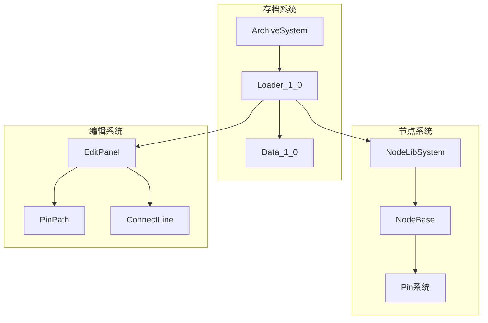
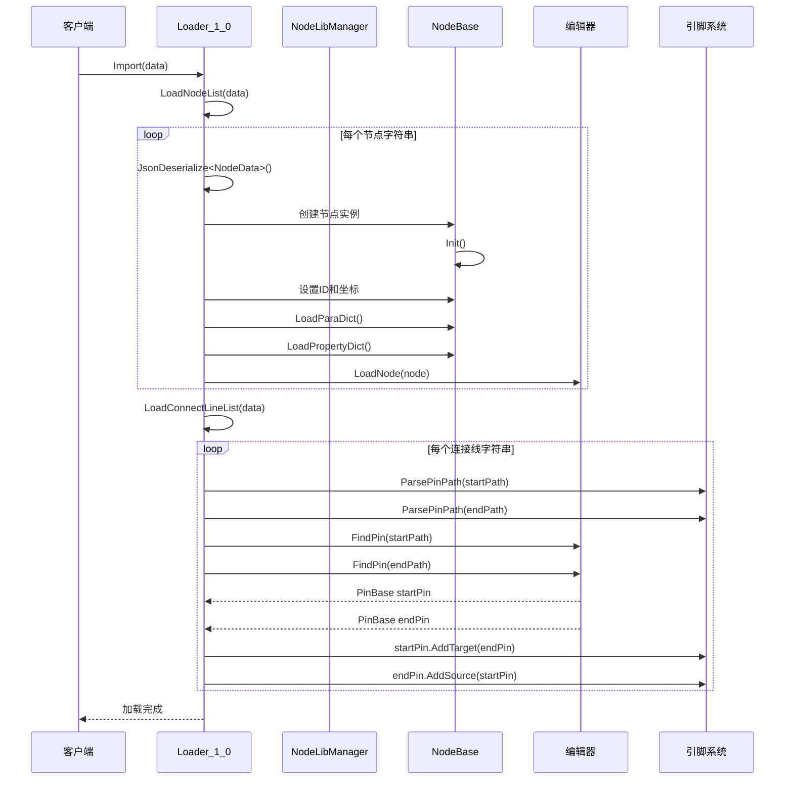
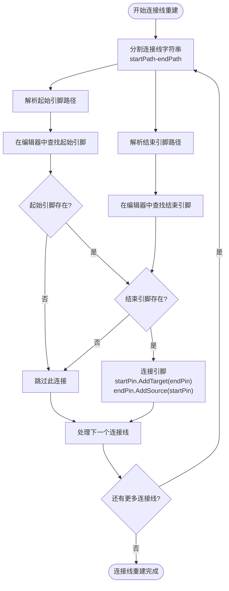
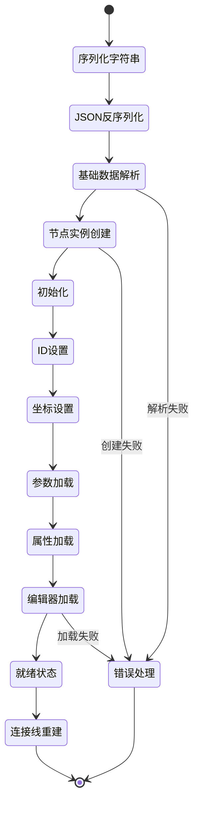

# 反序列化与对象重建

<cite>
**本文档中引用的文件**
- [Loader_1_0.cs](file://XNode/SubSystem/ArchiveSystem/Loader/Loader_1_0.cs)
- [Data_1_0.cs](file://XNode/SubSystem/ArchiveSystem/Define/Data_1_0/Data_1_0.cs)
- [NodeData.cs](file://XNode/SubSystem/ArchiveSystem/Define/Data_1_0/NodeData.cs)
- [NodeBaseData.cs](file://XNode/SubSystem/ArchiveSystem/Define/Data_1_0/NodeBaseData.cs)
- [PinPath.cs](file://XNode/SubSystem/NodeEditSystem/Define/PinPath.cs)
- [NodeBase.cs](file://XLib.Node/NodeBase.cs)
- [PinBase.cs](file://XLib.Node/PinBase.cs)
- [NodeLibManager.cs](file://XNode/SubSystem/NodeLibSystem/NodeLibManager.cs)
- [Data_Int.cs](file://XNode/SubSystem/NodeLibSystem/Define/Data/Data_Int.cs)
- [Flow_If.cs](file://XNode/SubSystem/NodeLibSystem/Define/Flows/Flow_If.cs)
</cite>

## 目录
1. [简介](#简介)
2. [项目结构概览](#项目结构概览)
3. [核心组件分析](#核心组件分析)
4. [反序列化架构](#反序列化架构)
5. [节点反序列化流程](#节点反序列化流程)
6. [连接线重建流程](#连接线重建流程)
7. [依赖关系管理](#依赖关系管理)
8. [性能考虑](#性能考虑)
9. [故障排除指南](#故障排除指南)
10. [结论](#结论)

## 简介

XNode框架中的反序列化系统负责将存储的节点和连接线数据重新构建为可执行的对象。该系统采用分阶段的重建策略，首先确保所有节点对象正确创建和初始化，然后在节点完全就绪后再建立连接线的引脚连接关系，从而避免悬空引用问题。

本文档深入分析了`LoadNodeList`和`LoadConnectLineList`两个核心方法的执行流程，详细说明了节点ID、坐标、参数字典和属性字典的恢复过程，以及连接线重建的依赖顺序管理。

## 项目结构概览

XNode项目采用模块化的架构设计，主要包含以下核心子系统：



**图表来源**
- [Loader_1_0.cs](file://XNode/SubSystem/ArchiveSystem/Loader/Loader_1_0.cs#L1-L82)
- [NodeLibManager.cs](file://XNode/SubSystem/NodeLibSystem/NodeLibManager.cs#L15-L220)

## 核心组件分析

### Loader_1_0 类

Loader_1_0是反序列化流程的核心控制器，负责协调整个重建过程：

```csharp
public class Loader_1_0
{
    public static bool Import(Data_1_0 data, string archiveFilePath)
    {
        try
        {
            LoadNodeList(data);
            LoadConnectLineList(data);
        }
        catch (Exception ex)
        {
            WM.ShowError("加载存档失败：" + ex.Message);
            return false;
        }
        return true;
    }
}
```

该类采用严格的错误处理机制，在任何一步失败时都会中断整个加载过程，并向用户显示详细的错误信息。

**章节来源**
- [Loader_1_0.cs](file://XNode/SubSystem/ArchiveSystem/Loader/Loader_1_0.cs#L12-L26)

### 数据结构定义

#### Data_1_0 结构

```csharp
public class Data_1_0
{
    public List<string> NodeList { get; set; } = new List<string>();
    public List<string> ConnectLineList { get; set; } = new List<string>();
}
```

该结构作为存档数据的容器，分别存储节点字符串列表和连接线字符串列表，每种数据都以JSON格式的字符串形式保存。

#### NodeData 结构

```csharp
public class NodeData
{
    public string BaseData { get; set; } = "";
    public Dictionary<string, string> ParaDict { get; set; } = new Dictionary<string, string>();
    public Dictionary<string, string> PropertyDict { get; set; } = new Dictionary<string, string>();
}
```

NodeData包含了节点的基本信息、参数字典和属性字典，这些信息在反序列化过程中会被逐一恢复。

**章节来源**
- [Data_1_0.cs](file://XNode/SubSystem/ArchiveSystem/Define/Data_1_0/Data_1_0.cs#L6-L13)
- [NodeData.cs](file://XNode/SubSystem/ArchiveSystem/Define/Data_1_0/NodeData.cs#L5-L15)

## 反序列化架构

反序列化系统采用两阶段重建策略，确保数据完整性：



**图表来源**
- [Loader_1_0.cs](file://XNode/SubSystem/ArchiveSystem/Loader/Loader_1_0.cs#L29-L79)
- [PinPath.cs](file://XNode/SubSystem/NodeEditSystem/Define/PinPath.cs#L10-L18)

## 节点反序列化流程

### LoadNodeList 方法详解

LoadNodeList方法负责将节点字符串列表逐项反序列化为NodeBase实例：

```csharp
private static void LoadNodeList(Data_1_0 data)
{
    foreach (var nodeString in data.NodeList)
    {
        // 解析节点数据
        NodeData? nodeData = JsonConvert.DeserializeObject<NodeData>(nodeString);
        if (nodeData == null) continue;
        
        // 解析节点基本数据
        NodeBaseData? nodeBaseData = new NodeBaseData(nodeData.BaseData);
        if (nodeBaseData == null) continue;
        
        // 创建节点实例
        NodeBase? node;
        if (nodeBaseData.NodeLibName == "Inner")
            node = NodeLibManager.Instance.CreateNode(nodeBaseData.TypeString);
        else
            node = NodeLibManager.Instance.CreateNode(nodeBaseData.NodeLibName, nodeBaseData.TypeString);
            
        // 创建节点失败，则跳过
        if (node == null) continue;
        
        // 初始化节点
        node.Init();
        
        // 设置编号与坐标
        node.ID = nodeBaseData.ID;
        node.Point = new NodePoint(nodeBaseData.Point);
        
        // 加载参数、属性
        node.LoadParaDict(nodeBaseData.Version, nodeData.ParaDict);
        node.LoadPropertyDict(nodeBaseData.Version, nodeData.PropertyDict);
        
        // 加载节点至编辑器
        WM.Main.Editer.LoadNode(node);
    }
}
```

### 节点重建的关键步骤

#### 1. JSON反序列化

```csharp
NodeData? nodeData = JsonConvert.DeserializeObject<NodeData>(nodeString);
```

使用Newtonsoft.Json库将JSON字符串反序列化为NodeData对象，这是整个反序列化过程的第一步。

#### 2. 基础数据解析

```csharp
NodeBaseData? nodeBaseData = new NodeBaseData(nodeData.BaseData);
```

NodeBaseData类负责解析基础数据字符串，该字符串采用"/"分隔的格式：
```
节点库名称/类型字符串/版本/ID/坐标
```

#### 3. 节点实例创建

```csharp
if (nodeBaseData.NodeLibName == "Inner")
    node = NodeLibManager.Instance.CreateNode(nodeBaseData.TypeString);
else
    node = NodeLibManager.Instance.CreateNode(nodeBaseData.NodeLibName, nodeBaseData.TypeString);
```

NodeLibManager采用工厂模式创建节点实例，支持内置节点库和外部节点库两种类型。

#### 4. 参数和属性恢复

```csharp
node.LoadParaDict(nodeBaseData.Version, nodeData.ParaDict);
node.LoadPropertyDict(nodeBaseData.Version, nodeData.PropertyDict);
```

这两个方法负责将存储的参数字典和属性字典恢复到节点实例中，确保节点的状态完整。

**章节来源**
- [Loader_1_0.cs](file://XNode/SubSystem/ArchiveSystem/Loader/Loader_1_0.cs#L29-L58)
- [NodeBaseData.cs](file://XNode/SubSystem/ArchiveSystem/Define/Data_1_0/NodeBaseData.cs#L7-L17)

## 连接线重建流程

### LoadConnectLineList 方法详解

连接线重建是一个复杂的依赖管理过程，必须在所有节点加载完成后才能进行：

```csharp
private static void LoadConnectLineList(Data_1_0 data)
{
    foreach (var lineString in data.ConnectLineList)
    {
        // 解析引脚路径
        PinPath startPath = PinPath.ParsePinPath(lineString.Split('-')[0]);
        PinPath endPath = PinPath.ParsePinPath(lineString.Split('-')[1]);
        
        // 查找引脚
        PinBase? startPin = WM.Main.Editer.FindPin(startPath);
        if (startPin == null) continue;
        PinBase? endPin = WM.Main.Editer.FindPin(endPath);
        if (endPin == null) continue;
        
        // 连接引脚
        startPin.AddTarget(endPin);
        endPin.AddSource(startPin);
    }
}
```

### PinPath 解析机制

PinPath类实现了引脚路径的解析和重建：

```csharp
public static PinPath ParsePinPath(string path)
{
    string[] nodeArray = path.Split(',');
    return new PinPath
    {
        NodeVersion = nodeArray[0],
        NodeID = int.Parse(nodeArray[1]),
        GroupIndex = int.Parse(nodeArray[2]),
        PinIndex = int.Parse(nodeArray[3])
    };
}
```

路径格式为：`版本,节点ID,组索引,引脚索引`

### 引脚查找和连接



**图表来源**
- [Loader_1_0.cs](file://XNode/SubSystem/ArchiveSystem/Loader/Loader_1_0.cs#L63-L79)
- [PinPath.cs](file://XNode/SubSystem/NodeEditSystem/Define/PinPath.cs#L10-L18)

### 依赖顺序的重要性

连接线重建严格遵循依赖顺序原则：

1. **节点优先加载**：所有节点必须先于连接线加载
2. **引脚存在性检查**：在尝试连接前验证引脚是否存在
3. **双向连接建立**：同时设置源引脚和目标引脚的连接关系

这种设计避免了悬空引用问题，确保每个连接都有有效的两端。

**章节来源**
- [Loader_1_0.cs](file://XNode/SubSystem/ArchiveSystem/Loader/Loader_1_0.cs#L63-L79)
- [PinPath.cs](file://XNode/SubSystem/NodeEditSystem/Define/PinPath.cs#L10-L18)

## 依赖关系管理

### 节点生命周期管理



### 引脚连接的安全机制

PinBase类提供了安全的连接机制：

```csharp
public void AddTarget(PinBase target)
{
    if (TargetList.Contains(target)) return;
    TargetList.Add(target);
}

public override void AddSource(PinBase source)
{
    // 如果已有连接，则先与源断开
    if (SourceList.Count > 0)
    {
        SourceList[0].TargetList.Remove(this);
        SourceList.Clear();
    }
    // 添加新的连接
    SourceList.Add(source);
}
```

这种设计确保了连接的唯一性和一致性，防止重复连接和孤立连接。

**章节来源**
- [PinBase.cs](file://XLib.Node/PinBase.cs#L25-L38)
- [PinBase.cs](file://XLib.Node/PinBase.cs#L68-L78)

## 性能考虑

### 内存优化策略

1. **延迟加载**：节点参数和属性采用延迟加载策略，只在需要时才恢复
2. **对象池**：对于频繁使用的节点类型，可以考虑使用对象池减少GC压力
3. **批量操作**：所有节点加载完成后统一进行连接线重建，减少中间状态

### 并发处理能力

当前实现采用单线程同步方式，适合大多数应用场景。对于大型项目，可以考虑：

```csharp
// 并行节点加载（伪代码）
Parallel.ForEach(data.NodeList, nodeString =>
{
    // 节点加载逻辑
});

// 串行连接线重建
foreach (var lineString in data.ConnectLineList)
{
    // 连接线重建逻辑
}
```

## 故障排除指南

### 常见错误及解决方案

#### 1. 节点创建失败

**症状**：节点ID和坐标正确设置，但节点无法正常工作
**原因**：节点库未正确注册或节点类型不存在
**解决方案**：
```csharp
// 检查节点库是否正确加载
if (NodeLibManager.Instance.NodeLibDict.ContainsKey(nodeBaseData.NodeLibName))
{
    var node = NodeLibManager.Instance.CreateNode(nodeBaseData.NodeLibName, nodeBaseData.TypeString);
    // 处理创建失败的情况
}
```

#### 2. 引脚连接失败

**症状**：连接线重建时出现"引脚不存在"错误
**原因**：节点加载顺序错误或节点ID不匹配
**解决方案**：
```csharp
// 在连接线重建前验证节点完整性
foreach (var node in nodeList)
{
    if (!editor.HasNode(node.ID))
    {
        throw new InvalidOperationException($"节点 {node.ID} 未找到");
    }
}
```

#### 3. 参数恢复失败

**症状**：节点参数丢失或格式错误
**原因**：参数字典版本不兼容或数据损坏
**解决方案**：
```csharp
try
{
    node.LoadParaDict(nodeBaseData.Version, nodeData.ParaDict);
}
catch (Exception ex)
{
    // 使用默认值或记录警告
    Logger.Warn($"参数恢复失败: {ex.Message}");
}
```

**章节来源**
- [Loader_1_0.cs](file://XNode/SubSystem/ArchiveSystem/Loader/Loader_1_0.cs#L12-L26)
- [NodeBase.cs](file://XLib.Node/NodeBase.cs#L250-L270)

## 结论

XNode的反序列化系统通过精心设计的两阶段重建策略，成功解决了复杂节点图的重建挑战。关键优势包括：

1. **严格的依赖管理**：确保节点先于连接线加载，避免悬空引用
2. **安全的连接机制**：提供完善的引脚连接验证和错误处理
3. **灵活的数据恢复**：支持参数字典和属性字典的版本兼容性
4. **强大的错误处理**：提供详细的错误信息和恢复机制

这种设计不仅保证了系统的稳定性，还为未来的扩展提供了良好的基础。开发者可以基于这个框架轻松添加新的节点类型和连接线处理逻辑。

通过深入理解这些核心概念和实现细节，开发者能够更好地利用XNode框架构建复杂的节点式应用程序，无论是用于游戏开发、数据流处理还是其他需要可视化编程的应用场景。