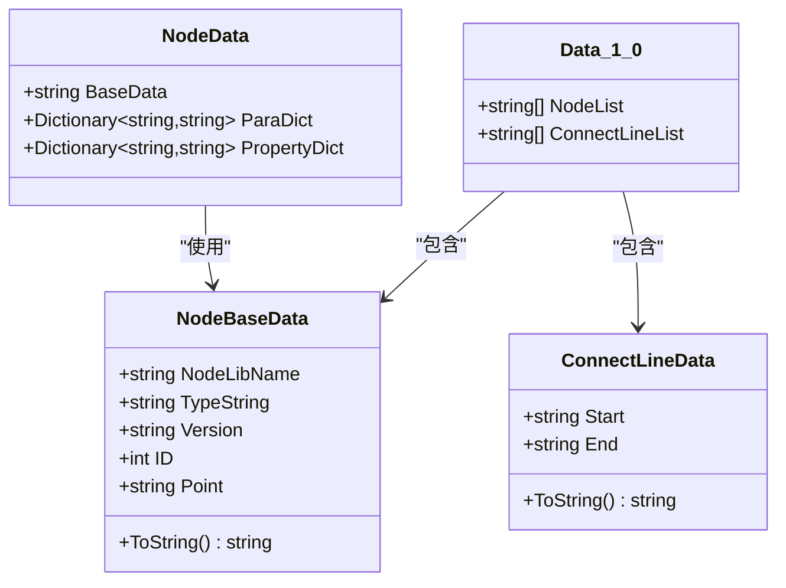
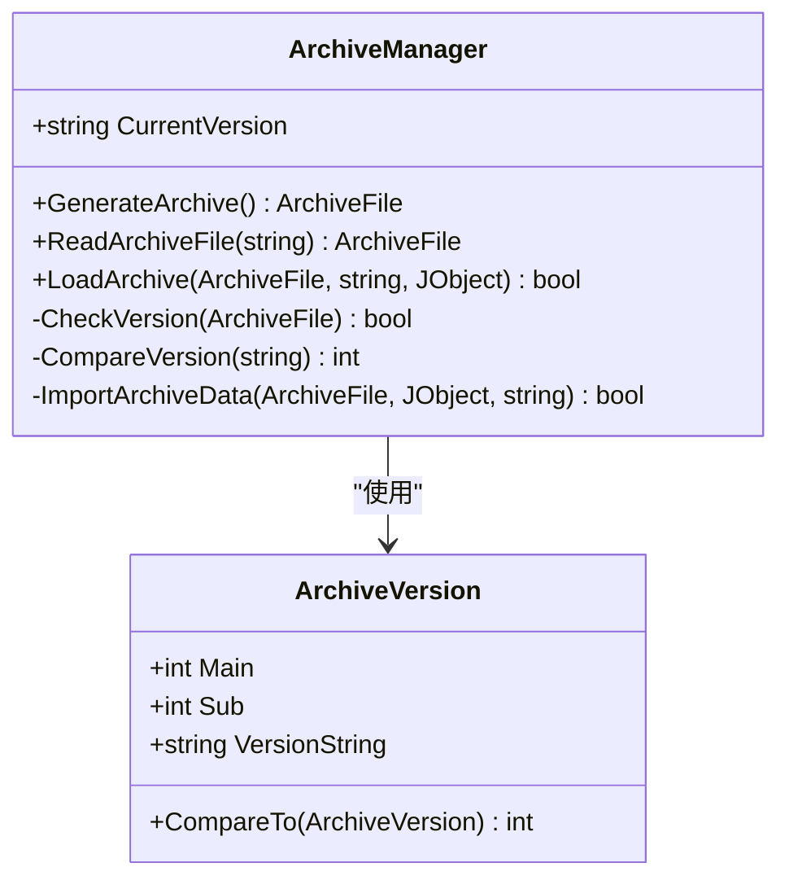
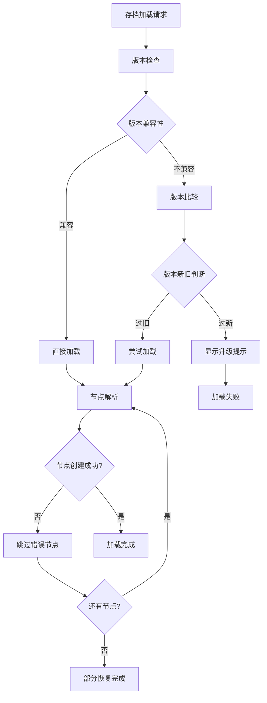
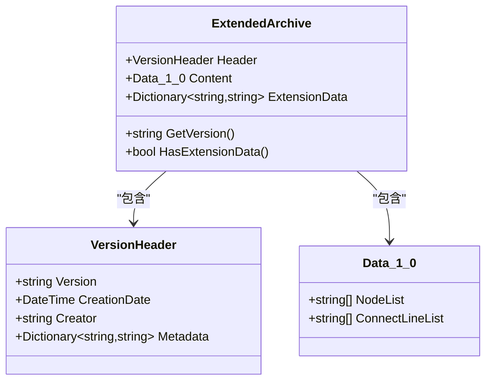
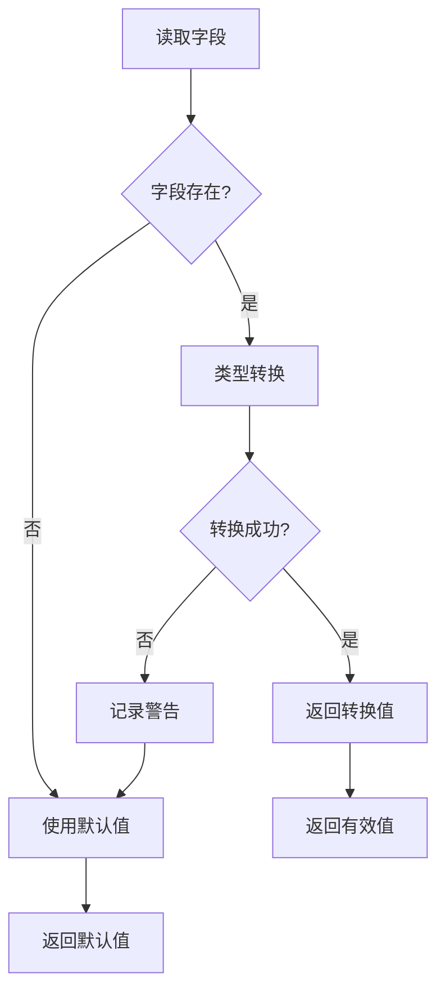
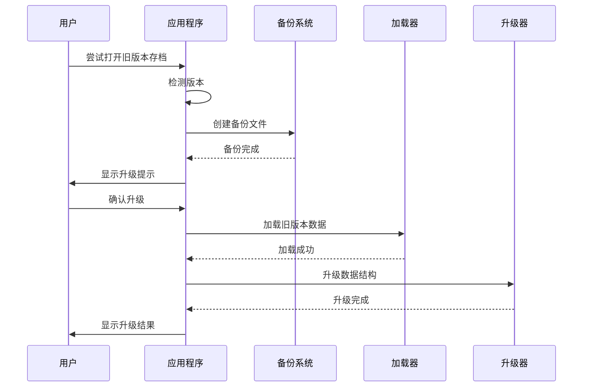
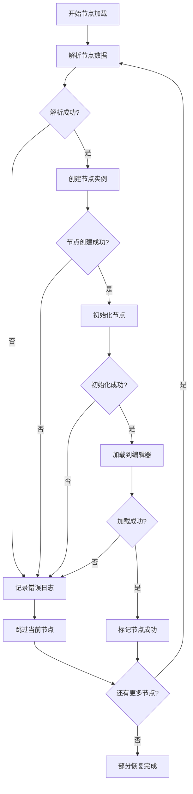

# 向后兼容性设计策略

<cite>
**本文档引用的文件**
- [Data_1_0.cs](file://XNode/SubSystem/ArchiveSystem/Define/Data_1_0/Data_1_0.cs)
- [NodeBaseData.cs](file://XNode/SubSystem/ArchiveSystem/Define/Data_1_0/NodeBaseData.cs)
- [NodeData.cs](file://XNode/SubSystem/ArchiveSystem/Define/Data_1_0/NodeData.cs)
- [ConnectLineData.cs](file://XNode/SubSystem/ArchiveSystem/Define/Data_1_0/ConnectLineData.cs)
- [Loader_1_0.cs](file://XNode/SubSystem/ArchiveSystem/Loader/Loader_1_0.cs)
- [ArchiveManager.cs](file://XNode/SubSystem/ArchiveSystem/ArchiveManager.cs)
- [Extracter.cs](file://XNode/SubSystem/ArchiveSystem/Extracter.cs)
- [ArchiveVersion.cs](file://XLib.Base/ArchiveFrame/ArchiveVersion.cs)
</cite>

## 目录
1. [简介](#简介)
2. [现有架构分析](#现有架构分析)
3. [向后兼容性挑战](#向后兼容性挑战)
4. [扩展建议方案](#扩展建议方案)
5. [安全字段处理策略](#安全字段处理策略)
6. [版本升级机制](#版本升级机制)
7. [部分恢复机制](#部分恢复机制)
8. [最佳实践指南](#最佳实践指南)
9. [总结](#总结)

## 简介

在现代软件开发中，向后兼容性是确保系统稳定性和用户体验的关键因素。本文档基于XNode项目的Data_1_0结构，分析其现有的存档系统架构，并提出未来版本兼容的扩展策略。通过深入分析现有代码结构，我们将探讨如何设计一个既保持向后兼容性又支持未来扩展的存档系统。

## 现有架构分析

### 核心数据结构

XNode项目采用了一套基于JSON的存档系统，主要包含以下核心数据结构：



**图表来源**
- [Data_1_0.cs](file://XNode/SubSystem/ArchiveSystem/Define/Data_1_0/Data_1_0.cs#L1-L14)
- [NodeBaseData.cs](file://XNode/SubSystem/ArchiveSystem/Define/Data_1_0/NodeBaseData.cs#L1-L34)
- [NodeData.cs](file://XNode/SubSystem/ArchiveSystem/Define/Data_1_0/NodeData.cs#L1-L17)
- [ConnectLineData.cs](file://XNode/SubSystem/ArchiveSystem/Define/Data_1_0/ConnectLineData.cs#L1-L14)

### 版本控制系统

项目实现了基于主版本号和子版本号的版本比较机制：



**图表来源**
- [ArchiveVersion.cs](file://XLib.Base/ArchiveFrame/ArchiveVersion.cs#L1-L28)
- [ArchiveManager.cs](file://XNode/SubSystem/ArchiveSystem/ArchiveManager.cs#L1-L137)

**章节来源**
- [ArchiveManager.cs](file://XNode/SubSystem/ArchiveSystem/ArchiveManager.cs#L1-L137)
- [ArchiveVersion.cs](file://XLib.Base/ArchiveFrame/ArchiveVersion.cs#L1-L28)

## 向后兼容性挑战

### 当前限制分析

1. **固定版本格式**：Data_1_0结构使用固定的版本格式，缺乏扩展性
2. **字段缺失处理**：现有代码对缺失字段的处理不够完善
3. **版本升级提示**：缺少版本升级的用户提示机制
4. **部分恢复能力**：当某些节点加载失败时，整个系统会中断

### 主要问题识别



**图表来源**
- [ArchiveManager.cs](file://XNode/SubSystem/ArchiveSystem/ArchiveManager.cs#L40-L80)
- [Loader_1_0.cs](file://XNode/SubSystem/ArchiveSystem/Loader/Loader_1_0.cs#L10-L40)

## 扩展建议方案

### 方案一：预留ExtensionData字段

在Data_1_0结构中添加ExtensionData字段，用于存储未知版本信息：

```csharp
// 扩展后的Data_1_0结构
public class Data_1_0_Extended
{
    public List<string> NodeList { get; set; } = new List<string>();
    public List<string> ConnectLineList { get; set; } = new List<string>();
    
    // 新增扩展数据字段
    public Dictionary<string, string> ExtensionData { get; set; } = new Dictionary<string, string>();
    
    // 版本标识符
    public string Version { get; set; } = "1.0";
}
```

### 方案二：引入VersionHeader元数据块

创建独立的版本头部信息块：

```csharp
public class VersionHeader
{
    public string Version { get; set; } = "1.0";
    public DateTime CreationDate { get; set; } = DateTime.Now;
    public string Creator { get; set; } = "";
    public Dictionary<string, string> Metadata { get; set; } = new Dictionary<string, string>();
}

public class ArchiveFileWithHeader
{
    public VersionHeader Header { get; set; } = new VersionHeader();
    public Data_1_0 Content { get; set; } = new Data_1_0();
}
```

### 方案三：混合策略

结合以上两种方案，提供更灵活的扩展机制：



**图表来源**
- [Data_1_0.cs](file://XNode/SubSystem/ArchiveSystem/Define/Data_1_0/Data_1_0.cs#L1-L14)

## 安全字段处理策略

### TryGetValue模式实现

为了安全地处理新增或缺失字段，可以实现类似.NET中的TryGetValue模式：

```csharp
public static class SafeFieldAccess
{
    public static bool TryGetValue<T>(
        this Dictionary<string, string> dict, 
        string key, 
        out T value, 
        T defaultValue = default(T))
    {
        value = defaultValue;
        if (dict.TryGetValue(key, out var stringValue))
        {
            try
            {
                value = (T)Convert.ChangeType(stringValue, typeof(T));
                return true;
            }
            catch
            {
                return false;
            }
        }
        return false;
    }
    
    public static T GetValueOrDefault<T>(
        this Dictionary<string, string> dict, 
        string key, 
        T defaultValue = default(T))
    {
        if (dict.TryGetValue(key, out var stringValue))
        {
            try
            {
                return (T)Convert.ChangeType(stringValue, typeof(T));
            }
            catch
            {
                return defaultValue;
            }
        }
        return defaultValue;
    }
}
```

### 字段验证和默认值处理



**图表来源**
- [NodeData.cs](file://XNode/SubSystem/ArchiveSystem/Define/Data_1_0/NodeData.cs#L1-L17)

## 版本升级机制

### 自动备份和升级流程



**图表来源**
- [ArchiveManager.cs](file://XNode/SubSystem/ArchiveSystem/ArchiveManager.cs#L40-L60)

### 升级提示功能实现

```csharp
public class UpgradePrompt
{
    public static bool ShowUpgradePrompt(string oldVersion, string newVersion)
    {
        var dialog = new UpgradeDialog
        {
            OldVersion = oldVersion,
            NewVersion = newVersion,
            BackupLocation = GetBackupLocation(oldVersion)
        };
        
        return dialog.ShowDialog() ?? false;
    }
    
    public static void CreateBackup(string filePath)
    {
        string backupPath = $"{filePath}.backup_{DateTime.Now:yyyyMMdd_HHmmss}";
        File.Copy(filePath, backupPath, overwrite: false);
    }
}
```

**章节来源**
- [ArchiveManager.cs](file://XNode/SubSystem/ArchiveSystem/ArchiveManager.cs#L40-L80)

## 部分恢复机制

### 错误隔离和跳过策略

当前的Loader_1_0已经实现了基本的错误跳过机制：

```csharp
private static void LoadNodeList(Data_1_0 data)
{
    foreach (var nodeString in data.NodeList)
    {
        try
        {
            // 解析节点数据
            NodeData? nodeData = JsonConvert.DeserializeObject<NodeData>(nodeString);
            if (nodeData == null) continue;
            
            // 解析节点基本数据
            NodeBaseData? nodeBaseData = new NodeBaseData(nodeData.BaseData);
            if (nodeBaseData == null) continue;
            
            // 创建节点实例
            NodeBase? node = CreateNodeInstance(nodeBaseData);
            if (node == null) continue;
            
            // 初始化节点
            InitializeNode(node, nodeBaseData, nodeData);
            
            // 加载节点至编辑器
            WM.Main.Editer.LoadNode(node);
        }
        catch (Exception ex)
        {
            // 记录错误但继续处理其他节点
            LogError($"节点加载失败: {ex.Message}");
            continue;
        }
    }
}
```

### 部分恢复流程图



**图表来源**
- [Loader_1_0.cs](file://XNode/SubSystem/ArchiveSystem/Loader/Loader_1_0.cs#L20-L50)

### 数据完整性保护

```csharp
public class PartialRecoveryManager
{
    private readonly List<string> _failedNodes = new List<string>();
    private readonly List<string> _successfulNodes = new List<string>();
    
    public RecoveryResult RecoverPartialData(List<string> nodeList)
    {
        var result = new RecoveryResult();
        
        foreach (var nodeString in nodeList)
        {
            try
            {
                var nodeData = JsonConvert.DeserializeObject<NodeData>(nodeString);
                if (nodeData == null) continue;
                
                var node = CreateNode(nodeData);
                if (node != null)
                {
                    result.SuccessfulNodes.Add(node);
                    _successfulNodes.Add(nodeString);
                }
                else
                {
                    result.FailedNodes.Add(nodeString);
                    _failedNodes.Add(nodeString);
                }
            }
            catch (Exception ex)
            {
                result.Errors.Add(ex);
                _failedNodes.Add(nodeString);
            }
        }
        
        result.HasPartiallyRecovered = _successfulNodes.Count > 0;
        result.TotalNodes = nodeList.Count;
        result.RecoveredNodes = _successfulNodes.Count;
        
        return result;
    }
}
```

**章节来源**
- [Loader_1_0.cs](file://XNode/SubSystem/ArchiveSystem/Loader/Loader_1_0.cs#L20-L80)

## 最佳实践指南

### 设计原则

1. **向后兼容性优先**：确保新版本能够加载旧版本存档
2. **渐进式升级**：支持多版本间的平滑升级
3. **数据完整性**：在升级过程中保护尽可能多的数据
4. **用户友好**：提供清晰的升级提示和回滚选项

### 实现建议


### 性能考虑

1. **延迟加载**：对于大型存档，采用延迟加载策略
2. **内存管理**：及时释放不再使用的资源
3. **缓存机制**：缓存常用的节点和连接信息
4. **异步处理**：在后台进行升级和恢复操作

## 总结

通过对XNode项目的深入分析，我们提出了一个全面的向后兼容性设计策略。该策略包括：

1. **扩展数据结构**：通过预留ExtensionData字段或引入VersionHeader来支持未来扩展
2. **安全字段处理**：实现TryGetValue等安全方法来处理新增或缺失字段
3. **版本升级机制**：建立自动备份和升级提示功能
4. **部分恢复能力**：在遇到错误时跳过失败项并继续加载剩余内容

这些改进将显著提升系统的稳定性和用户体验，同时为未来的功能扩展奠定坚实的基础。建议在实施过程中采用渐进式的方法，逐步完善各个组件，确保系统的平稳过渡和持续发展。