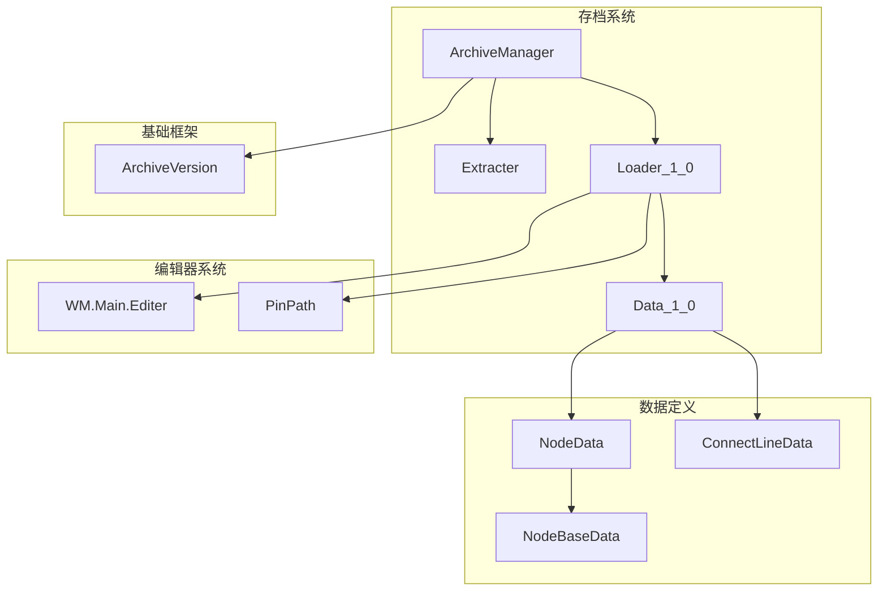
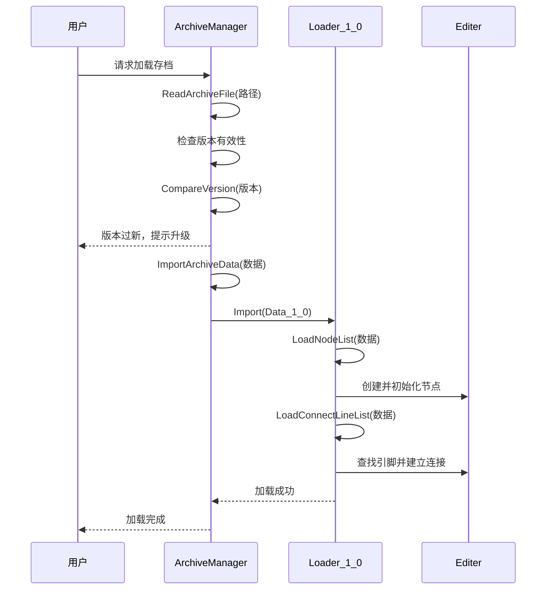
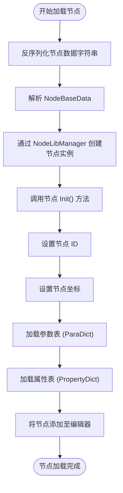
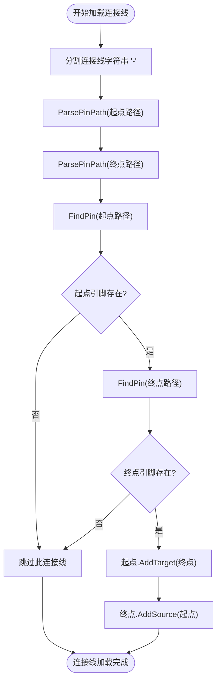
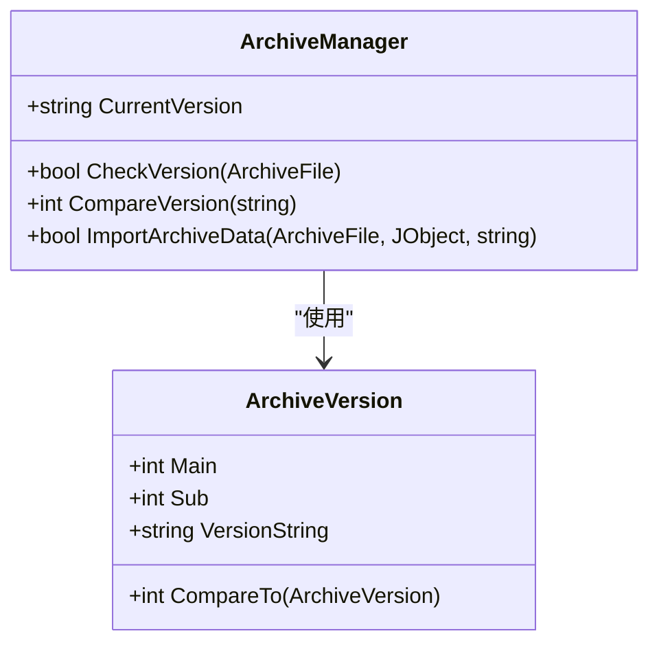
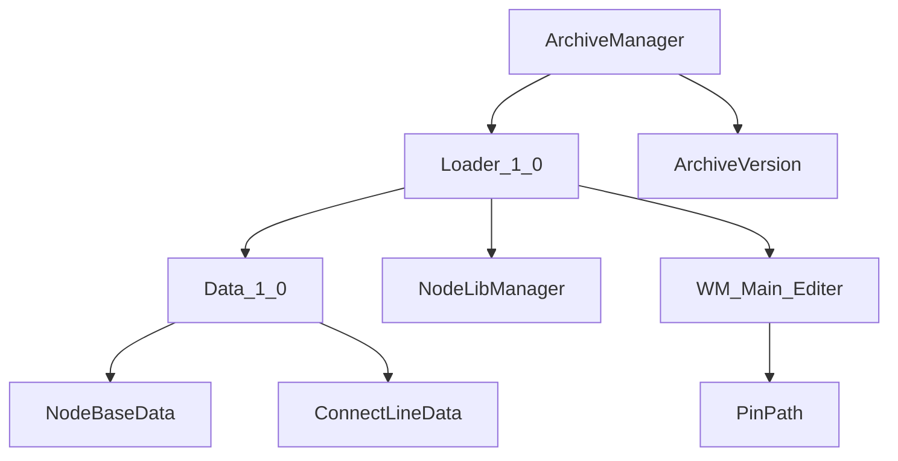

# 版本兼容与加载

<cite>
**本文档引用的文件**  
- [Loader_1_0.cs](file://XNode/SubSystem/ArchiveSystem/Loader/Loader_1_0.cs)
- [Data_1_0.cs](file://XNode/SubSystem/ArchiveSystem/Define/Data_1_0/Data_1_0.cs)
- [NodeData.cs](file://XNode/SubSystem/ArchiveSystem/Define/Data_1_0/NodeData.cs)
- [NodeBaseData.cs](file://XNode/SubSystem/ArchiveSystem/Define/Data_1_0/NodeBaseData.cs)
- [ConnectLineData.cs](file://XNode/SubSystem/ArchiveSystem/Define/Data_1_0/ConnectLineData.cs)
- [ArchiveManager.cs](file://XNode/SubSystem/ArchiveSystem/ArchiveManager.cs)
- [ArchiveVersion.cs](file://XLib.Base/ArchiveFrame/ArchiveVersion.cs)
- [Extracter.cs](file://XNode/SubSystem/ArchiveSystem/Extracter.cs)
- [PinPath.cs](file://XNode/SubSystem/NodeEditSystem/Define/PinPath.cs)
</cite>

## 目录
1. [引言](#引言)
2. [项目结构](#项目结构)
3. [核心组件](#核心组件)
4. [架构概述](#架构概述)
5. [详细组件分析](#详细组件分析)
6. [依赖分析](#依赖分析)
7. [性能考虑](#性能考虑)
8. [故障排除指南](#故障排除指南)
9. [结论](#结论)

## 引言

本文档旨在全面解析 `Loader_1_0` 的设计与实现，重点阐述其如何安全加载特定版本（1.0）的存档文件。内容涵盖版本号校验流程、缺失字段的容错处理机制、数据迁移策略（如旧版坐标格式转换）、反序列化过程中对象重建的顺序依赖管理，以及向后兼容性设计建议。同时，通过异常处理案例说明系统如何应对 JSON 格式错误或数据不一致问题。

## 项目结构

项目采用模块化分层架构，核心功能按子系统划分。与存档加载相关的组件主要集中在 `XNode/SubSystem/ArchiveSystem` 目录下，包括数据定义、加载器、提取器和版本管理。`Loader_1_0` 作为特定版本加载器，位于 `Loader` 子目录中，依赖于 `Data_1_0` 数据结构和编辑器上下文。

**图示来源**  
- [ArchiveManager.cs](file://XNode/SubSystem/ArchiveSystem/ArchiveManager.cs#L1-L137)
- [Loader_1_0.cs](file://XNode/SubSystem/ArchiveSystem/Loader/Loader_1_0.cs#L1-L82)
- [Data_1_0.cs](file://XNode/SubSystem/ArchiveSystem/Define/Data_1_0/Data_1_0.cs#L1-L14)
- [Extracter.cs](file://XNode/SubSystem/ArchiveSystem/Extracter.cs#L1-L91)
- [ArchiveVersion.cs](file://XLib.Base/ArchiveFrame/ArchiveVersion.cs#L1-L28)
- [PinPath.cs](file://XNode/SubSystem/NodeEditSystem/Define/PinPath.cs#L1-L33)

## 核心组件

`Loader_1_0` 是专为 1.0 版本设计的存档加载器，负责将序列化的 JSON 数据反序列化并重建编辑器中的节点和连接线。其核心流程包括版本校验后的节点列表加载和连接线列表加载，确保对象重建的顺序依赖。

**本节来源**  
- [Loader_1_0.cs](file://XNode/SubSystem/ArchiveSystem/Loader/Loader_1_0.cs#L1-L82)
- [Data_1_0.cs](file://XNode/SubSystem/ArchiveSystem/Define/Data_1_0/Data_1_0.cs#L1-L14)

## 架构概述

系统通过 `ArchiveManager` 统一管理存档的读取与加载。当用户请求加载存档时，`ArchiveManager` 首先读取文件并反序列化为 `ArchiveFile` 对象，然后进行版本校验。若版本兼容，则根据版本号分发至对应的加载器（如 `Loader_1_0`）进行数据导入。

**图示来源**  
- [ArchiveManager.cs](file://XNode/SubSystem/ArchiveSystem/ArchiveManager.cs#L50-L137)
- [Loader_1_0.cs](file://XNode/SubSystem/ArchiveSystem/Loader/Loader_1_0.cs#L10-L82)

## 详细组件分析

### Loader_1_0 分析

`Loader_1_0` 类实现了 `Import` 方法，该方法接收反序列化的 `Data_1_0` 对象和存档文件路径。它采用两阶段加载策略：先加载所有节点，再加载所有连接线，以确保连接线绑定时目标节点已存在。

#### 加载节点流程

节点加载过程中，系统首先反序列化节点数据字符串，解析出 `NodeBaseData`（包含节点库名、类型、版本、ID 和坐标）。随后通过 `NodeLibManager` 创建对应节点实例，并设置其 ID 和坐标。最后，调用 `LoadParaDict` 和 `LoadPropertyDict` 方法加载参数和属性，完成节点初始化。

**图示来源**  
- [Loader_1_0.cs](file://XNode/SubSystem/ArchiveSystem/Loader/Loader_1_0.cs#L25-L55)
- [NodeBaseData.cs](file://XNode/SubSystem/ArchiveSystem/Define/Data_1_0/NodeBaseData.cs#L1-L34)

#### 加载连接线流程

连接线数据以字符串形式存储，格式为 `"起点路径-终点路径"`。加载时，系统使用 `PinPath.ParsePinPath` 解析路径字符串，获取起点和终点引脚的完整路径。随后通过 `WM.Main.Editer.FindPin` 方法在编辑器中查找对应的引脚实例。若引脚存在，则调用 `AddTarget` 和 `AddSource` 方法建立双向连接。

**图示来源**  
- [Loader_1_0.cs](file://XNode/SubSystem/ArchiveSystem/Loader/Loader_1_0.cs#L60-L81)
- [PinPath.cs](file://XNode/SubSystem/NodeEditSystem/Define/PinPath.cs#L1-L33)

### 版本校验与兼容性

`ArchiveManager` 负责版本校验。`CheckVersion` 方法确保版本字符串非空且能被 `ArchiveVersion` 成功解析。`CompareVersion` 方法通过比较主版本号和次版本号，判断存档版本是否过新（返回负数则提示用户升级软件）。此机制实现了基础的向后兼容性。

**图示来源**  
- [ArchiveManager.cs](file://XNode/SubSystem/ArchiveSystem/ArchiveManager.cs#L1-L137)
- [ArchiveVersion.cs](file://XLib.Base/ArchiveFrame/ArchiveVersion.cs#L1-L28)

## 依赖分析

`Loader_1_0` 的正常运行依赖于多个核心组件。它直接依赖 `Data_1_0` 数据结构进行反序列化，依赖 `NodeLibManager` 创建节点实例，依赖 `WM.Main.Editer` 提供的上下文来查找引脚和加载节点。`ArchiveManager` 作为调度中心，协调版本校验与加载器调用。

**图示来源**  
- [Loader_1_0.cs](file://XNode/SubSystem/ArchiveSystem/Loader/Loader_1_0.cs#L1-L82)
- [ArchiveManager.cs](file://XNode/SubSystem/ArchiveSystem/ArchiveManager.cs#L1-L137)
- [PinPath.cs](file://XNode/SubSystem/NodeEditSystem/Define/PinPath.cs#L1-L33)

## 性能考虑

加载过程采用分步处理，避免一次性加载所有数据导致内存峰值。节点和连接线的加载均在 `try-catch` 块中进行，单个节点或连接线的加载失败不会中断整个流程。然而，反序列化大量节点数据字符串可能成为性能瓶颈，未来可考虑批量反序列化优化。

## 故障排除指南

系统通过 `try-catch` 捕获加载过程中的所有异常，并通过 `WM.ShowError` 向用户展示错误信息。常见问题包括：
- **JSON 格式错误**：`JsonConvert.DeserializeObject` 抛出异常，提示“加载存档失败”。
- **节点创建失败**：`NodeLibManager.CreateNode` 返回 `null`，该节点将被跳过。
- **引脚查找失败**：`FindPin` 返回 `null`，该连接线将被跳过，可能导致逻辑不完整。
- **版本不兼容**：`CheckVersion` 或 `CompareVersion` 失败，分别提示“无效的版本”或“存档版本过新”。

**本节来源**  
- [Loader_1_0.cs](file://XNode/SubSystem/ArchiveSystem/Loader/Loader_1_0.cs#L10-L15)
- [ArchiveManager.cs](file://XNode/SubSystem/ArchiveSystem/ArchiveManager.cs#L70-L75)

## 结论

`Loader_1_0` 设计简洁有效，通过严格的版本校验和两阶段加载策略，确保了 1.0 版本存档的安全加载。其容错机制允许在部分数据损坏时仍能恢复大部分内容。为增强向后兼容性，建议在 `Data_1_0` 中预留扩展字段（如 `ExtraData` 字典），并在未来版本中实现数据迁移脚本。此外，可增加损坏文件的部分恢复能力，记录加载过程中跳过的节点和连接线，供用户审查。