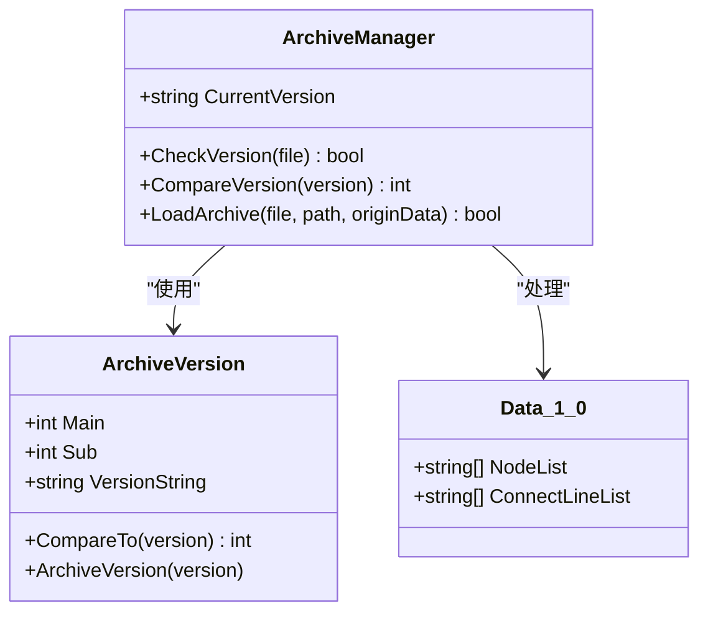
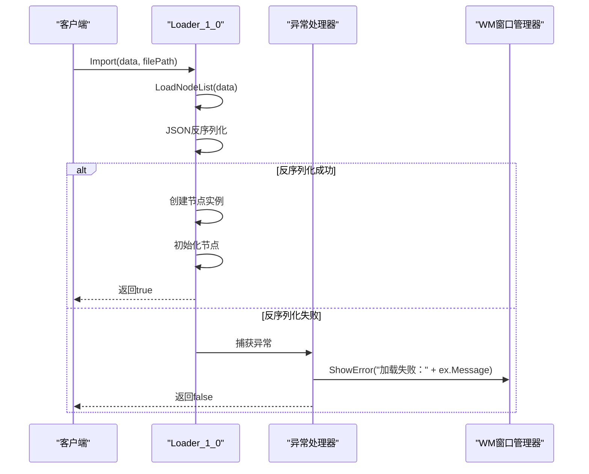
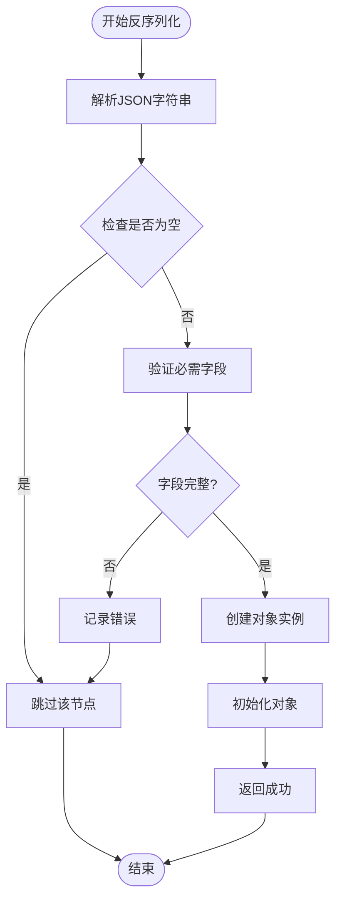
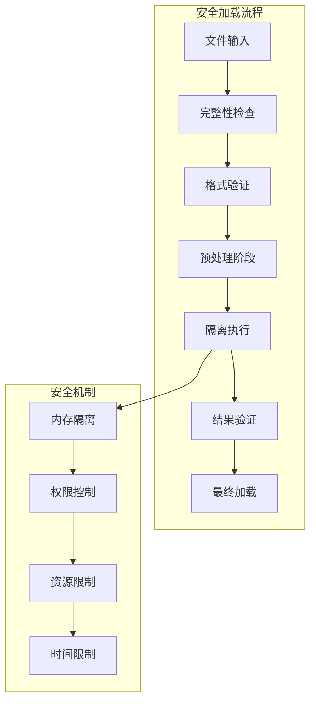
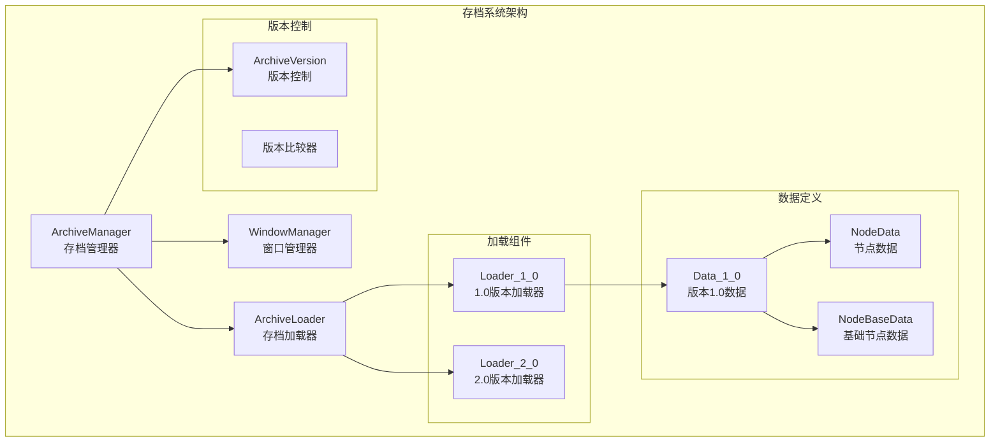

# 版本校验与安全加载

<cite>
**本文档引用的文件**
- [Loader_1_0.cs](file://XNode/SubSystem/ArchiveSystem/Loader/Loader_1_0.cs)
- [Data_1_0.cs](file://XNode/SubSystem/ArchiveSystem/Define/Data_1_0/Data_1_0.cs)
- [NodeData.cs](file://XNode/SubSystem/ArchiveSystem/Define/Data_1_0/NodeData.cs)
- [NodeBaseData.cs](file://XNode/SubSystem/ArchiveSystem/Define/Data_1_0/NodeBaseData.cs)
- [ArchiveManager.cs](file://XNode/SubSystem/ArchiveSystem/ArchiveManager.cs)
- [ArchiveVersion.cs](file://XLib.Base/ArchiveFrame/ArchiveVersion.cs)
- [WM.cs](file://XNode/SubSystem/WindowSystem/WM.cs)
- [Extracter.cs](file://XNode/SubSystem/ArchiveSystem/Extracter.cs)
</cite>

## 目录
1. [简介](#简介)
2. [版本校验机制](#版本校验机制)
3. [异常捕获与错误处理](#异常捕获与错误处理)
4. [JSON反序列化完整性检查](#json反序列化完整性检查)
5. [安全加载策略](#安全加载策略)
6. [架构设计](#架构设计)
7. [最佳实践建议](#最佳实践建议)
8. [总结](#总结)

## 简介

XNode项目实现了一套完整的版本校验与安全加载机制，确保存档文件在不同版本间的兼容性和安全性。该系统通过多层验证、异常捕获和用户友好的错误反馈，为用户提供可靠的存档加载体验。

## 版本校验机制

### 版本识别与比较

系统采用基于主版本号和子版本号的双段式版本控制：



**图表来源**
- [ArchiveVersion.cs](file://XLib.Base/ArchiveFrame/ArchiveVersion.cs#L1-L28)
- [ArchiveManager.cs](file://XNode/SubSystem/ArchiveSystem/ArchiveManager.cs#L1-L137)

版本比较算法实现了智能的向后兼容性检查：

```csharp
// 版本比较逻辑
private int CompareVersion(string version)
{
    ArchiveVersion file = new ArchiveVersion(version);
    ArchiveVersion current = new ArchiveVersion(CurrentVersion);
    return file.CompareTo(current);
}
```

### 数据结构特征识别

Loader_1_0类通过以下特征识别版本兼容性：

1. **JSON数据结构验证**：检查NodeList和ConnectLineList的存在性
2. **字段完整性检查**：验证必需字段是否完整
3. **格式预判**：通过字符串解析判断数据格式正确性

**章节来源**
- [ArchiveManager.cs](file://XNode/SubSystem/ArchiveSystem/ArchiveManager.cs#L70-L85)
- [Loader_1_0.cs](file://XNode/SubSystem/ArchiveSystem/Loader/Loader_1_0.cs#L1-L82)

## 异常捕获与错误处理

### Try-Catch机制

系统在关键操作中广泛使用try-catch机制防止应用崩溃：



**图表来源**
- [Loader_1_0.cs](file://XNode/SubSystem/ArchiveSystem/Loader/Loader_1_0.cs#L10-L20)

### 用户友好错误反馈

WM.ShowError方法提供了专业的错误提示机制：

```csharp
// 错误显示实现
public static void ShowError(string tip, Window? owner = null)
{
    ShowTip(tip, owner, TipLevel.Error);
}
```

错误处理流程包括：
1. **异常捕获**：在关键业务逻辑中设置try-catch块
2. **错误分类**：区分不同类型的错误（语法错误、格式错误等）
3. **用户提示**：通过可视化对话框展示错误信息
4. **日志记录**：可选的错误日志记录功能

**章节来源**
- [Loader_1_0.cs](file://XNode/SubSystem/ArchiveSystem/Loader/Loader_1_0.cs#L10-L20)
- [WM.cs](file://XNode/SubSystem/WindowSystem/WM.cs#L40-L50)

## JSON反序列化完整性检查

### 字段存在性验证

系统在JSON反序列化前实施严格的字段验证：



**图表来源**
- [Loader_1_0.cs](file://XNode/SubSystem/ArchiveSystem/Loader/Loader_1_0.cs#L25-L45)

### 格式预判策略

系统通过以下方式预判JSON格式：

1. **字符串分割验证**：检查分隔符数量和位置
2. **数据类型检查**：验证数值、布尔值等数据类型
3. **长度限制**：对字符串长度进行合理限制
4. **字符集验证**：确保只包含合法字符

```csharp
// NodeBaseData构造函数中的格式验证
public NodeBaseData(string data)
{
    string[] array = data.Split('/');
    NodeLibName = array[0];
    TypeString = array[1];
    Version = array[2];
    ID = int.Parse(array[3]);
    Point = array[4];
}
```

**章节来源**
- [NodeBaseData.cs](file://XNode/SubSystem/ArchiveSystem/Define/Data_1_0/NodeBaseData.cs#L8-L18)

## 安全加载策略

### 沙箱解析模式

虽然当前实现未完全采用沙箱模式，但系统设计支持逐步引入：



### 回滚机制

系统通过项目备份实现隐式的回滚机制：

```csharp
// 项目保存时的备份机制
private void ExecuteSave()
{
    // 备份项目：防止因保存异常导致项目文件损坏
    string backupPath = BackupProject();
    
    // 执行保存操作
    // ...
}
```

### 应对篡改或损坏文件

针对可能的恶意篡改或文件损坏，系统采用以下策略：

1. **完整性校验**：通过MD5哈希验证文件完整性
2. **结构验证**：检查JSON结构的合法性
3. **数据范围验证**：限制数值范围和字符串长度
4. **依赖关系检查**：验证节点间依赖关系的合理性

**章节来源**
- [ProjectManager.cs](file://XNode/SubSystem/ProjectSystem/ProjectManager.cs#L180-L200)

## 架构设计

### 整体架构图



**图表来源**
- [ArchiveManager.cs](file://XNode/SubSystem/ArchiveSystem/ArchiveManager.cs#L1-L137)
- [Loader_1_0.cs](file://XNode/SubSystem/ArchiveSystem/Loader/Loader_1_0.cs#L1-L82)

### 组件交互关系

各组件间的交互遵循清晰的职责分离原则：

1. **ArchiveManager**：负责整体存档流程控制
2. **ArchiveVersion**：提供版本比较和验证功能
3. **Loader_1_0**：具体版本的数据加载逻辑
4. **WM**：提供用户界面和错误处理

**章节来源**
- [ArchiveManager.cs](file://XNode/SubSystem/ArchiveSystem/ArchiveManager.cs#L1-L137)
- [ArchiveVersion.cs](file://XLib.Base/ArchiveFrame/ArchiveVersion.cs#L1-L28)

## 最佳实践建议

### 开发者指南

1. **版本兼容性**：
   - 新增字段时保持向后兼容
   - 使用版本号明确标识数据结构变更
   - 提供渐进式迁移策略

2. **错误处理**：
   - 在所有外部调用处添加异常捕获
   - 提供详细的错误上下文信息
   - 实现优雅降级机制

3. **性能优化**：
   - 对大型存档文件使用流式处理
   - 实施缓存机制减少重复解析
   - 优化JSON序列化性能

### 用户体验建议

1. **进度反馈**：
   - 提供加载进度指示器
   - 显示详细的加载步骤
   - 支持取消加载操作

2. **错误恢复**：
   - 提供自动修复建议
   - 实现部分加载功能
   - 支持从备份恢复

3. **帮助文档**：
   - 提供常见问题解答
   - 实现在线帮助系统
   - 收集用户反馈改进

## 总结

XNode项目的版本校验与安全加载机制体现了现代软件开发的最佳实践。通过多层次的验证、完善的异常处理和用户友好的错误反馈，系统确保了存档加载的可靠性和安全性。

主要特点包括：

- **智能版本控制**：基于主版本号和子版本号的双段式版本管理
- **全面异常处理**：在关键操作中实施try-catch机制
- **用户友好界面**：通过专业化的错误提示提升用户体验
- **数据完整性保障**：通过字段验证和格式预判确保数据质量
- **扩展性设计**：支持未来版本的平滑升级

这套机制不仅保证了系统的稳定性，也为用户提供了可靠的存档管理体验，是现代桌面应用程序开发的优秀范例。