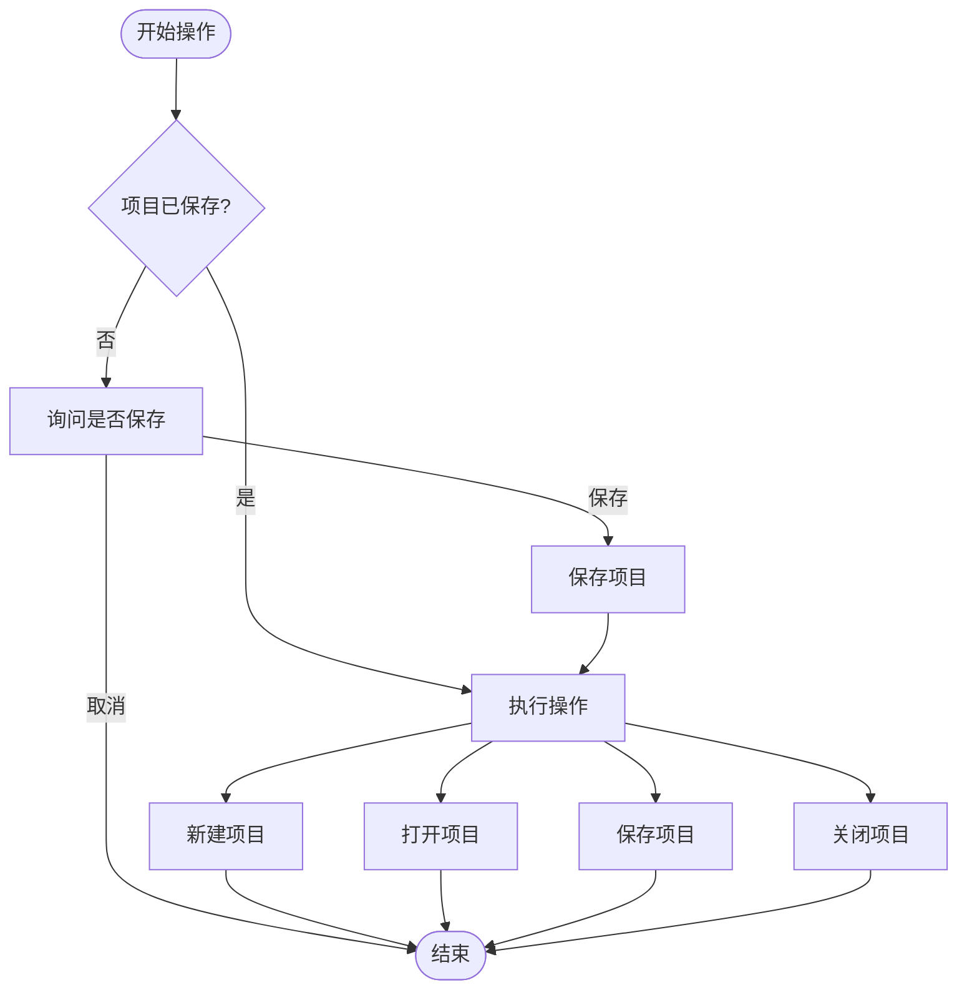
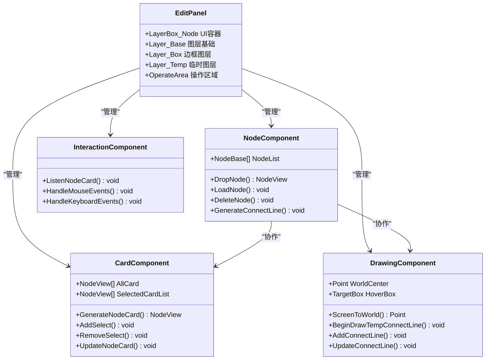
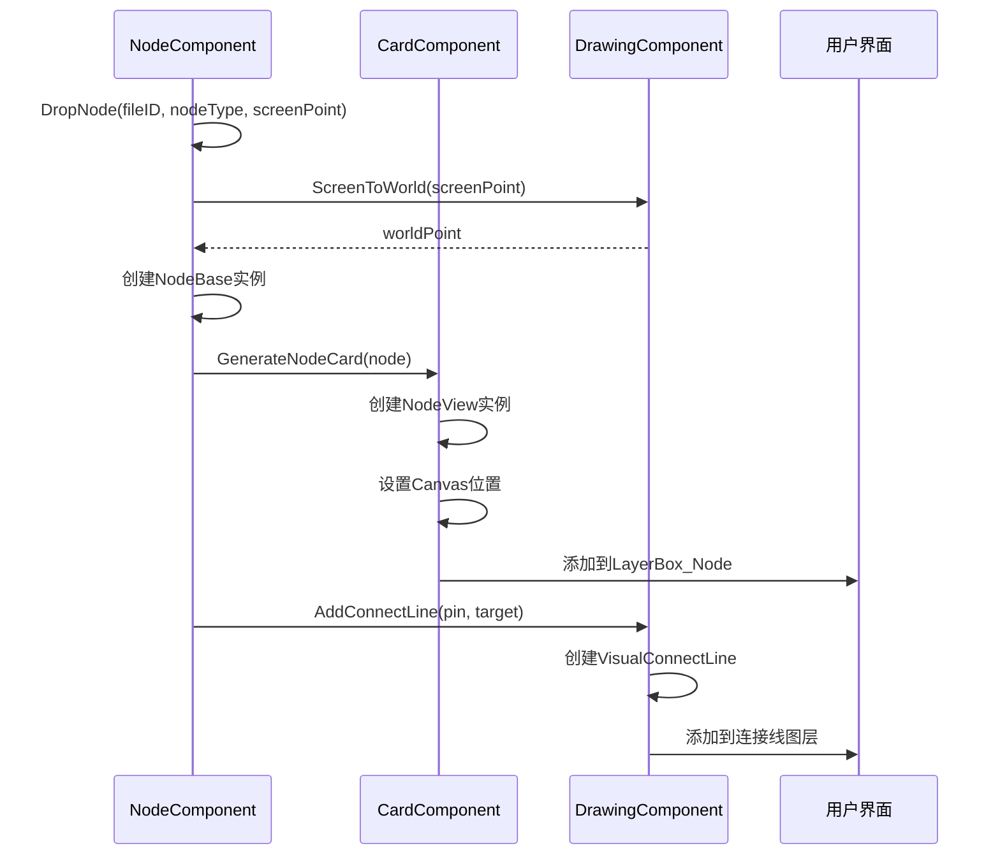
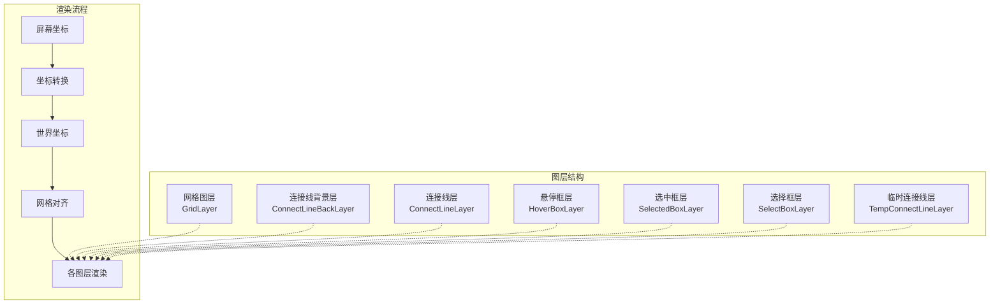
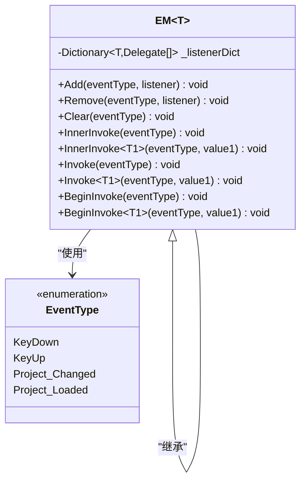
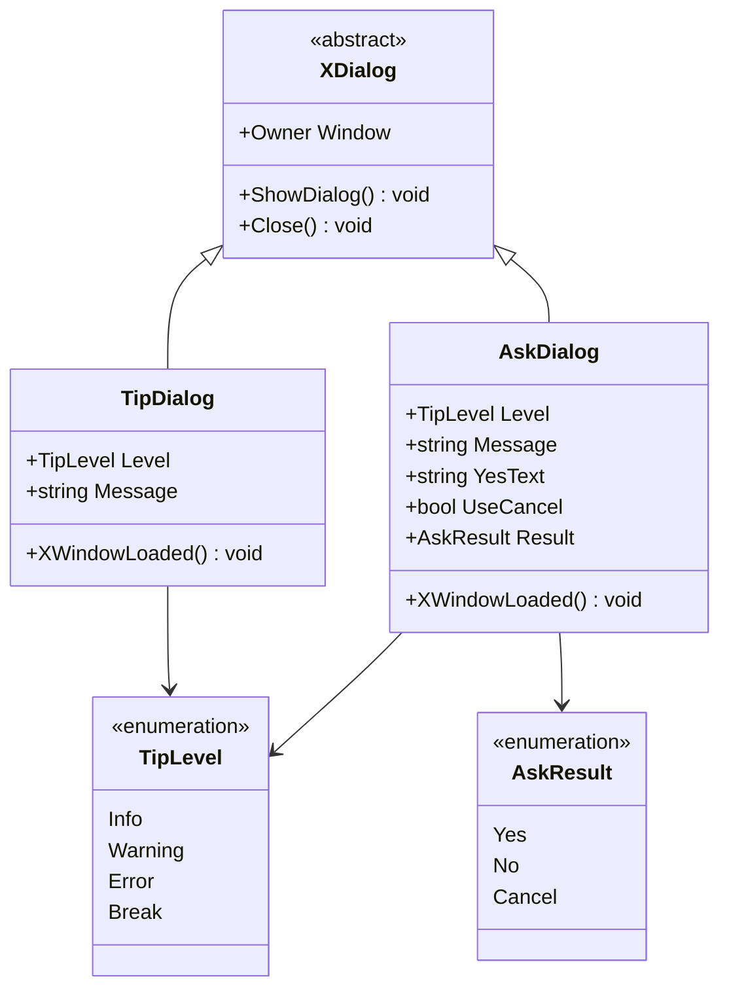

# XNode核心模块详解

<cite>
**本文档中引用的文件**
- [NodeProject.cs](file://XNode/SubSystem/ProjectSystem/NodeProject.cs)
- [ProjectManager.cs](file://XNode/SubSystem/ProjectSystem/ProjectManager.cs)
- [NodeComponent.cs](file://XNode/SubSystem/NodeEditSystem/Panel/Component/NodeComponent.cs)
- [CardComponent.cs](file://XNode/SubSystem/NodeEditSystem/Panel/Component/CardComponent.cs)
- [DrawingComponent.cs](file://XNode/SubSystem/NodeEditSystem/Panel/Component/DrawingComponent.cs)
- [AnimationEngine.cs](file://XLib.Animate/AnimationEngine.cs)
- [EM.cs](file://XLib.Base/EM.cs)
- [EM.cs](file://XNode/SubSystem/EventSystem/EM.cs)
- [EventType.cs](file://XNode/SubSystem/EventSystem/EventType.cs)
- [ArchiveManager.cs](file://XNode/SubSystem/ArchiveSystem/ArchiveManager.cs)
- [Extracter.cs](file://XNode/SubSystem/ArchiveSystem/Extracter.cs)
- [Loader_1_0.cs](file://XNode/SubSystem/ArchiveSystem/Loader/Loader_1_0.cs)
- [ImageResManager.cs](file://XNode/SubSystem/ResourceSystem/ImageResManager.cs)
- [CursorManager.cs](file://XNode/SubSystem/ResourceSystem/CursorManager.cs)
- [ResourceManager.cs](file://XNode/SubSystem/ResourceSystem/ResourceManager.cs)
- [CacheManager.cs](file://XNode/SubSystem/CacheSystem/CacheManager.cs)
- [AppTimer.cs](file://XNode/SubSystem/TimerSystem/AppTimer.cs)
- [TimeEngine.cs](file://XNode/SubSystem/TimerSystem/TimeEngine.cs)
- [ITimerHandler.cs](file://XNode/SubSystem/TimerSystem/ITimerHandler.cs)
- [OptionManager.cs](file://XNode/SubSystem/OptionSystem/OptionManager.cs)
- [NodeLibManager.cs](file://XNode/SubSystem/NodeLibSystem/NodeLibManager.cs)
- [NodeLibPanel.xaml.cs](file://XNode/SubSystem/NodeLibSystem/NodeLibPanel.xaml.cs)
- [WM.cs](file://XNode/SubSystem/WindowSystem/WM.cs)
- [AskDialog.xaml.cs](file://XNode/SubSystem/WindowSystem/AskDialog.xaml.cs)
- [TipDialog.xaml.cs](file://XNode/SubSystem/WindowSystem/TipDialog.xaml.cs)
</cite>

## 目录
1. [项目概述](#项目概述)
2. [项目管理系统](#项目管理系统)
3. [节点编辑系统](#节点编辑系统)
4. [图形渲染系统](#图形渲染系统)
5. [事件系统](#事件系统)
6. [归档系统](#归档系统)
7. [资源管理系统](#资源管理系统)
8. [缓存系统](#缓存系统)
9. [定时器系统](#定时器系统)
10. [选项系统](#选项系统)
11. [节点库系统](#节点库系统)
12. [窗口系统](#窗口系统)
13. [总结](#总结)

## 项目概述

XNode是一个基于WPF的节点式编程工具，采用模块化架构设计，将功能划分为多个独立的子系统。每个子系统负责特定的功能领域，通过统一的接口进行交互，形成了一个完整而灵活的开发环境。

## 项目管理系统

### NodeProject数据结构

NodeProject类是项目管理的核心数据结构，定义了项目的基本属性和行为：

```csharp
public class NodeProject
{
    /// <summary>项目路径。仅文件夹</summary>
    public string ProjectPath { get; set; } = "";

    /// <summary>项目名称。不包含扩展名</summary>
    public string ProjectName { get; set; } = "";

    /// <summary>文件扩展名</summary>
    public static string FileExtension { get; private set; } = ".xnode";

    /// <summary>项目文件路径</summary>
    public string ProjectFilePath => $"{ProjectPath}\\{ProjectFileName}{FileExtension}";
}
```

### ProjectManager单例控制机制

ProjectManager实现了单例模式，确保整个应用程序中只有一个项目管理器实例：

```csharp
public class ProjectManager
{
    #region 单例
    private ProjectManager() { }
    public static ProjectManager Instance { get; } = new ProjectManager();
    #endregion

    #region 属性
    /// <summary>当前项目</summary>
    public NodeProject? CurrentProject { get; set; } = null;

    /// <summary>已保存</summary>
    public bool Saved
    {
        get => _saved;
        set
        {
            _saved = value;
            EM.Instance.Invoke(EventType.Project_Changed);
        }
    }
    #endregion
}
```

### 文件操作流程

项目管理器提供了完整的文件操作流程：

1. **新建项目**：检查当前项目状态，创建新的NodeProject实例
2. **打开项目**：显示文件对话框，读取存档文件，加载项目数据
3. **保存项目**：生成存档数据，序列化为JSON格式，写入文件
4. **另存为项目**：选择保存路径，创建新项目文件
5. **关闭项目**：重置编辑器，清理当前项目



**图表来源**
- [ProjectManager.cs](file://XNode/SubSystem/ProjectSystem/ProjectManager.cs#L40-L120)

**章节来源**
- [NodeProject.cs](file://XNode/SubSystem/ProjectSystem/NodeProject.cs#L5-L39)
- [ProjectManager.cs](file://XNode/SubSystem/ProjectSystem/ProjectManager.cs#L15-L252)

## 节点编辑系统

### EditPanel组件化架构

EditPanel采用了组件化架构，将不同的功能模块封装为独立的组件：



**图表来源**
- [NodeComponent.cs](file://XNode/SubSystem/NodeEditSystem/Panel/Component/NodeComponent.cs#L11-L123)
- [CardComponent.cs](file://XNode/SubSystem/NodeEditSystem/Panel/Component/CardComponent.cs#L12-L133)
- [DrawingComponent.cs](file://XNode/SubSystem/NodeEditSystem/Panel/Component/DrawingComponent.cs#L15-L385)

### NodeComponent与CardComponent协同机制

NodeComponent负责管理节点数据，而CardComponent负责管理UI视图，两者通过以下机制协同工作：

#### NodeComponent职责：
- 管理节点列表和字典
- 处理节点的创建、加载和删除
- 生成连接线并管理连接关系
- 维护节点ID分配

#### CardComponent职责：
- 管理节点卡片的生命周期
- 处理节点卡片的选择和布局
- 更新节点卡片的位置和外观
- 管理节点卡片的Z轴顺序

#### 协同工作流程：



**图表来源**
- [NodeComponent.cs](file://XNode/SubSystem/NodeEditSystem/Panel/Component/NodeComponent.cs#L25-L50)
- [CardComponent.cs](file://XNode/SubSystem/NodeEditSystem/Panel/Component/CardComponent.cs#L30-L60)

**章节来源**
- [NodeComponent.cs](file://XNode/SubSystem/NodeEditSystem/Panel/Component/NodeComponent.cs#L11-L123)
- [CardComponent.cs](file://XNode/SubSystem/NodeEditSystem/Panel/Component/CardComponent.cs#L12-L133)

## 图形渲染系统

### DrawingComponent坐标转换机制

DrawingComponent是图形渲染系统的核心组件，负责处理屏幕坐标与世界坐标的转换：

```csharp
/// <summary>
/// 屏幕坐标转世界坐标
/// </summary>
public Point ScreenToWorld(Point screenPoint)
{
    // 转世界坐标
    Point worldPoint = new Point(screenPoint.X - _gridLayer.GridCenter.X, screenPoint.Y - _gridLayer.GridCenter.Y);
    // 对齐至网格
    double x = Math.Round(worldPoint.X / _gridLayer.CellWidth) * _gridLayer.CellWidth;
    double y = Math.Round(worldPoint.Y / _gridLayer.CellHeight) * _gridLayer.CellHeight;
    // 返回坐标
    return new Point(x, y);
}
```

### 图层管理系统

DrawingComponent管理多个图层，每个图层负责不同的渲染内容：



**图表来源**
- [DrawingComponent.cs](file://XNode/SubSystem/NodeEditSystem/Panel/Component/DrawingComponent.cs#L150-L200)

### 动画播放系统

XLib.Animate模块提供了完整的动画播放系统：

```csharp
public class AnimationEngine : ServiceBase
{
    #region 单例
    private AnimationEngine()
    {
        _timer.Interval = 10;
        _timer.Tick += Timer_Tick;
    }
    public static AnimationEngine Instance { get; } = new AnimationEngine();
    #endregion

    /// <summary>
    /// 驱动动画
    /// </summary>
    public void Drive()
    {
        _currentTime = _stopwatch.DoubleMs();
        foreach (var item in _animationList)
            item.Drive(_currentTime - _animationTimeDict[item]);
    }
}
```

**章节来源**
- [DrawingComponent.cs](file://XNode/SubSystem/NodeEditSystem/Panel/Component/DrawingComponent.cs#L15-L385)
- [AnimationEngine.cs](file://XLib.Animate/AnimationEngine.cs#L10-L110)

## 事件系统

### EM事件订阅与发布机制

EM（Event Manager）实现了通用的事件订阅与发布机制：

```csharp
public class EM<T> : IManager where T : Enum
{
    #region 添加监听器
    public void Add(T eventType, Action listener)
    {
        if (_inited)
            _listenerDict[eventType].Add(listener);
    }

    public void Add<T1>(T eventType, Action<T1> listener)
    {
        if (_inited)
            _listenerDict[eventType].Add(listener);
    }
    #endregion

    #region 引发事件
    protected void InnerInvoke<T1>(T eventType, T1 value1)
    {
        if (_inited)
            foreach (var item in _listenerDict[eventType])
                if (item is Action<T1> listener) listener?.Invoke(value1);
    }
    #endregion
}
```

### 全局通信支持

EM系统支持多种事件类型和参数传递：



**图表来源**
- [EM.cs](file://XLib.Base/EM.cs#L6-L140)
- [EM.cs](file://XNode/SubSystem/EventSystem/EM.cs#L5-L61)
- [EventType.cs](file://XNode/SubSystem/EventSystem/EventType.cs#L2-L14)

**章节来源**
- [EM.cs](file://XLib.Base/EM.cs#L6-L140)
- [EM.cs](file://XNode/SubSystem/EventSystem/EM.cs#L5-L61)
- [EventType.cs](file://XNode/SubSystem/EventSystem/EventType.cs#L2-L14)

## 归档系统

### ArchiveManager序列化流程

ArchiveManager负责项目的序列化和反序列化：

```csharp
public class ArchiveManager
{
    #region 单例
    private ArchiveManager() { }
    public static ArchiveManager Instance { get; } = new ArchiveManager();
    #endregion

    #region 公开方法
    /// <summary>
    /// 生成存档
    /// </summary>
    public ArchiveFile GenerateArchive()
    {
        return new ArchiveFile
        {
            Version = CurrentVersion,
            Data = Extracter.Extract(),
        };
    }
    #endregion
}
```

### Extracter数据提取逻辑

Extracter负责从当前编辑器状态提取数据：

```csharp
public static Data_1_0 Extract()
{
    Data_1_0 result = new Data_1_0();

    FillNodeList(result);
    FillConnectLineList(result);

    return result;
}

private static void FillNodeList(Data_1_0 data)
{
    // 遍历节点
    foreach (var node in WM.Main.Editer.NodeList)
    {
        // 基本数据
        NodeBaseData baseData = new NodeBaseData
        {
            NodeLibName = node.NodeLibName,
            TypeString = node.GetTypeString(),
            Version = node.Version,
            ID = node.ID,
            Point = node.Point.ToString(),
        };
        // 参数与属性
        NodeData nodeData = new NodeData
        {
            BaseData = baseData.ToString(),
            ParaDict = node.GetParaDict(),
            PropertyDict = node.GetPropertyDict(),
        };
        // 添加数据
        data.NodeList.Add(JsonConvert.SerializeObject(nodeData));
    }
}
```

### Loader_1_0版本兼容加载机制

Loader_1_0实现了版本兼容性处理：

```csharp
public class Loader_1_0
{
    public static bool Import(Data_1_0 data, string archiveFilePath)
    {
        try
        {
            LoadNodeList(data);
            LoadConnectLineList(data);
        }
        catch (Exception ex)
        {
            WM.ShowError("加载存档失败：" + ex.Message);
            return false;
        }
        return true;
    }

    private static void LoadNodeList(Data_1_0 data)
    {
        foreach (var nodeString in data.NodeList)
        {
            // 解析节点数据
            NodeData? nodeData = JsonConvert.DeserializeObject<NodeData>(nodeString);
            if (nodeData == null) continue;
            // 解析节点基本数据
            NodeBaseData? nodeBaseData = new NodeBaseData(nodeData.BaseData);
            if (nodeBaseData == null) continue;
            // 创建节点实例
            NodeBase? node = NodeLibManager.Instance.CreateNode(nodeBaseData.NodeLibName, nodeBaseData.TypeString);
            // 初始化节点
            node.Init();
            // 设置编号与坐标
            node.ID = nodeBaseData.ID;
            node.Point = new NodePoint(nodeBaseData.Point);
            // 加载参数、属性
            node.LoadParaDict(nodeBaseData.Version, nodeData.ParaDict);
            node.LoadPropertyDict(nodeBaseData.Version, nodeData.PropertyDict);
            // 加载节点至编辑器
            WM.Main.Editer.LoadNode(node);
        }
    }
}
```

**章节来源**
- [ArchiveManager.cs](file://XNode/SubSystem/ArchiveSystem/ArchiveManager.cs#L14-L135)
- [Extracter.cs](file://XNode/SubSystem/ArchiveSystem/Extracter.cs#L9-L90)
- [Loader_1_0.cs](file://XNode/SubSystem/ArchiveSystem/Loader/Loader_1_0.cs#L9-L80)

## 资源管理系统

### ImageResManager图像资源管理

ImageResManager统一管理图像资源：

```csharp
public class ImageResManager
{
    #region 单例
    private ImageResManager() { }
    public static ImageResManager Instance { get; } = new ImageResManager();
    #endregion

    /// <summary>
    /// 获取图片
    /// </summary>
    public BitmapImage GetImage(string path)
    {
        if (!path.StartsWith("pack:") && !File.Exists(path))
            throw new Exception("图片不存在");

        // 已加载过此图片，直接返回
        if (_imageResDict.ContainsKey(path))
            return _imageResDict[path].CloneCurrentValue();

        // 创建图片实例
        BitmapImage image = new BitmapImage();
        image.BeginInit();
        // 设置加载图片后释放文件
        image.CacheOption = BitmapCacheOption.OnLoad;
        // 设置图片源
        image.UriSource = new Uri(path);
        image.EndInit();
        // 保存图片引用
        _imageResDict.Add(path, image);

        // 返回图片实例
        return image;
    }
}
```

### CursorManager光标资源管理

CursorManager专门管理各种鼠标光标：

```csharp
public class CursorManager
{
    #region 单例
    private CursorManager() { }
    public static CursorManager Instance { get; } = new CursorManager();
    #endregion

    #region 光标
    /// <summary>选择</summary>
    public Cursor? Select { get; set; }
    /// <summary>移动</summary>
    public Cursor? Move { get; set; }
    /// <summary>禁止</summary>
    public Cursor? Disable { get; set; }
    // ... 更多光标类型
    #endregion

    #region 管理器接口
    public void Init()
    {
        Select = LoadCursor("Assets/Cursor/Select.cur");
        Move = LoadCursor("Assets/Cursor/Move.cur");
        Disable = LoadCursor("Assets/Cursor/Disable.cur");
        // ... 初始化更多光标
    }
    #endregion
}
```

### ResourceManager统一资源管理

ResourceManager作为资源管理的入口点：

```csharp
public class ResourceManager : IManager
{
    #region 单例
    private ResourceManager() { }
    public static ResourceManager Instance { get; } = new ResourceManager();
    #endregion

    #region 接口实现
    public void Init()
    {
        // 光标管理器
        CursorManager.Instance.Init();
        // 引脚图标管理器
        PinIconManager.Instance.Init();
    }
    #endregion
}
```

**章节来源**
- [ImageResManager.cs](file://XNode/SubSystem/ResourceSystem/ImageResManager.cs#L5-L96)
- [CursorManager.cs](file://XNode/SubSystem/ResourceSystem/CursorManager.cs#L9-L95)
- [ResourceManager.cs](file://XNode/SubSystem/ResourceSystem/ResourceManager.cs#L4-L34)

## 缓存系统

### CacheManager窗口状态持久化

CacheManager负责持久化窗口状态和节点库展开信息：

```csharp
public class CacheManager : IManager
{
    #region 单例
    private CacheManager() { }
    public static CacheManager Instance { get; } = new CacheManager();
    #endregion

    #region 属性
    public string Name { get; set; } = "缓存管理器";
    /// <summary>缓存数据</summary>
    public CacheData Cache { get; set; } = new CacheData();
    #endregion

    #region 公开方法
    /// <summary>
    /// 更新缓存
    /// </summary>
    public void UpdateCache() => SaveCacheFile();
    #endregion

    #region 私有方法
    private void SaveCacheFile()
    {
        string filePath = $"{OptionManager.Instance.CachePath}\\{_cacheFileName}";
        File.WriteAllText(filePath, JsonConvert.SerializeObject(Cache, Formatting.Indented));
    }

    private void LoadCacheFile()
    {
        string jsonData = File.ReadAllText($"{OptionManager.Instance.CachePath}\\{_cacheFileName}");
        CacheData? cache = JsonConvert.DeserializeObject<CacheData>(jsonData);
        if (cache != null) Cache = cache;
    }
    #endregion
}
```

**章节来源**
- [CacheManager.cs](file://XNode/SubSystem/CacheSystem/CacheManager.cs#L10-L82)

## 定时器系统

### AppTimer应用级定时器

AppTimer提供应用级别的定时器服务：

```csharp
public class AppTimer : ServiceBase
{
    #region 单例
    private AppTimer()
    {
        _timer.Interval = TimeSpan.FromMilliseconds(1000.0 / 30.0);
        _timer.Tick += Timer_Tick;
    }
    public static AppTimer Instance { get; } = new AppTimer();
    #endregion

    #region 公开方法
    /// <summary>
    /// 添加定时器处理器
    /// </summary>
    public void AddTimerHandler(ITimerHandler handler)
    {
        List<ITimerHandler> newList = new List<ITimerHandler>(_handlerList);
        if (!newList.Contains(handler)) newList.Add(handler);
        _handlerList = newList;
        _timer.Start();
    }
    #endregion

    private void Timer_Tick(object? sender, EventArgs e)
    {
        foreach (var handler in _handlerList) handler.Tick();
    }
}
```

### TimeEngine高精度时间引擎

TimeEngine提供高精度的时间参考：

```csharp
public class TimeEngine : ServiceBase
{
    #region 单例
    private TimeEngine() => _timer.Tick += Timer_Tick;
    public static TimeEngine Instance { get; } = new TimeEngine();
    #endregion

    #region 属性
    /// <summary>当前时间。单位：毫秒</summary>
    public static double Time => Instance._stopwatch.DoubleMs();
    /// <summary>秒表实例</summary>
    public static Stopwatch Watch => Instance._stopwatch;
    #endregion

    #region 生命周期
    public override void Start()
    {
        _timer.Start();
        _stopwatch.Start();
    }
    #endregion
}
```

**章节来源**
- [AppTimer.cs](file://XNode/SubSystem/TimerSystem/AppTimer.cs#L9-L82)
- [TimeEngine.cs](file://XNode/SubSystem/TimerSystem/TimeEngine.cs#L11-L87)
- [ITimerHandler.cs](file://XNode/SubSystem/TimerSystem/ITimerHandler.cs#L2-L5)

## 选项系统

### OptionManager配置管理

OptionManager管理应用程序的各种配置选项：

```csharp
public class OptionManager : IManager
{
    #region 单例
    private OptionManager() { }
    public static OptionManager Instance { get; } = new OptionManager();
    #endregion

    #region 属性
    /// <summary>缓存路径</summary>
    public string CachePath => _root + "Cache\\";

    /// <summary>项目路径</summary>
    public string ProjectPath => _root + "Project\\";

    /// <summary>节点库路径</summary>
    public string NodeLibPath => _root + "NodeLib\\";
    #endregion

    #region IManager方法
    public void Init()
    {
        if (!Directory.Exists(CachePath)) Directory.CreateDirectory(CachePath);
        if (!Directory.Exists(ProjectPath)) Directory.CreateDirectory(ProjectPath);
        if (!Directory.Exists(NodeLibPath)) Directory.CreateDirectory(NodeLibPath);
    }
    #endregion
}
```

**章节来源**
- [OptionManager.cs](file://XNode/SubSystem/OptionSystem/OptionManager.cs#L8-L51)

## 节点库系统

### NodeLibManager节点库管理

NodeLibManager负责管理内置和外部节点库：

```csharp
public class NodeLibManager : IManager
{
    #region 单例
    private NodeLibManager() { }
    public static NodeLibManager Instance { get; } = new NodeLibManager();
    #endregion

    #region 属性
    /// <summary>根文件夹</summary>
    public Folder Root => _nodeLibRoot.Root;

    /// <summary>节点库字典</summary>
    public Dictionary<string, INodeLib> NodeLibDict { get; set; } = new Dictionary<string, INodeLib>();
    #endregion

    #region 公开方法
    /// <summary>
    /// 创建节点
    /// </summary>
    public NodeBase? CreateNode(string typeString)
    {
        return typeString switch
        {
            nameof(Data_Int) => new Data_Int(),
            nameof(Data_Double) => new Data_Double(),
            nameof(Data_String) => new Data_String(),
            // ... 更多节点类型
            _ => null,
        };
    }
    #endregion
}
```

### NodeLibPanel节点库面板

NodeLibPanel提供节点库的可视化展示：

```csharp
public partial class NodeLibPanel : UserControl
{
    public void Init()
    {
        NodePresetTree.Init();
        NodePresetTree.SetTreeRoot(new TreeItem(NodeLibManager.Instance.Root));
        LoadNodeLib(NodeLibManager.Instance.Root, null);
    }

    private void LoadNodeLib(Folder folder, TreeItem? parentItem)
    {
        // 加载文件夹
        foreach (var currentFolder in folder.FolderList)
        {
            // 确定文件夹图标
            string icon = ContainsChild(currentFolder) ? "Folder" : "EmptyFolder";
            if (parentItem == null) icon = "Lib";
            // 添加文件夹项
            TreeItem folderTreeItem = AddTreeItem(parentItem, currentFolder, icon);
            // 恢复折叠状态
            folderTreeItem.IsExpanded = CacheManager.Instance.Cache.NodeLib.IsExpanded(folderTreeItem.GetFullPath());
            folderTreeItem.ItemExpanded = TreeItem_Expanded;
            folderTreeItem.ItemCollapsed = TreeItem_Collapsed;
            // 递归加载
            if (currentFolder.FolderList.Count > 0 || currentFolder.FileList.Count > 0)
                LoadNodeLib(currentFolder, folderTreeItem);
        }
        // 加载文件
        foreach (var currentFile in folder.FileList)
        {
            AddTreeItem(parentItem, currentFile, "NodePreset");
        }
    }
}
```

**章节来源**
- [NodeLibManager.cs](file://XNode/SubSystem/NodeLibSystem/NodeLibManager.cs#L15-L220)
- [NodeLibPanel.xaml.cs](file://XNode/SubSystem/NodeLibSystem/NodeLibPanel.xaml.cs#L9-L89)

## 窗口系统

### WM窗口管理器

WM（Window Manager）提供统一的窗口管理功能：

```csharp
public class WM
{
    /// <summary>主窗口</summary>
    public static MainWindow Main { get; set; }

    /// <summary>
    /// 显示应用程序错误
    /// </summary>
    public static void ShowAppError(string tip)
    {
        TipDialog dialog = new TipDialog
        {
            Message = tip,
            Level = TipLevel.Error
        };
        SystemSounds.Hand.Play();
        dialog.ShowDialog();
    }

    /// <summary>
    /// 显示询问框
    /// </summary>
    public static bool? ShowAsk(string message, string yesText = "是", bool useCancel = true, TipLevel level = TipLevel.Info)
    {
        AskDialog dialog = new AskDialog
        {
            Message = message,
            Owner = Main,
            YesText = yesText,
            Level = level,
            UseCancel = useCancel
        };
        dialog.ShowDialog();

        bool? result = null;
        if (dialog.Result == AskResult.Yes) result = true;
        else if (dialog.Result == AskResult.No) result = false;
        return result;
    }
}
```

### 对话框系统

窗口系统包含多种类型的对话框：



**图表来源**
- [TipDialog.xaml.cs](file://XNode/SubSystem/WindowSystem/TipDialog.xaml.cs#L9-L89)
- [AskDialog.xaml.cs](file://XNode/SubSystem/WindowSystem/AskDialog.xaml.cs#L34-L150)

**章节来源**
- [WM.cs](file://XNode/SubSystem/WindowSystem/WM.cs#L9-L84)
- [TipDialog.xaml.cs](file://XNode/SubSystem/WindowSystem/TipDialog.xaml.cs#L9-L89)
- [AskDialog.xaml.cs](file://XNode/SubSystem/WindowSystem/AskDialog.xaml.cs#L34-L150)

## 总结

XNode项目采用了高度模块化的架构设计，每个子系统都有明确的职责和清晰的接口。这种设计带来了以下优势：

1. **高内聚低耦合**：每个模块专注于自己的功能领域，模块间通过标准化接口交互
2. **可扩展性**：新的功能可以通过添加新的子系统或扩展现有模块来实现
3. **可维护性**：模块化的设计使得代码更容易理解和维护
4. **可测试性**：独立的模块可以单独进行单元测试
5. **性能优化**：可以根据需要对特定模块进行性能优化

通过这种架构设计，XNode能够提供一个功能丰富、稳定可靠的节点式编程环境，满足用户在不同场景下的需求。各个子系统的协同工作确保了整个系统的流畅运行和良好的用户体验。