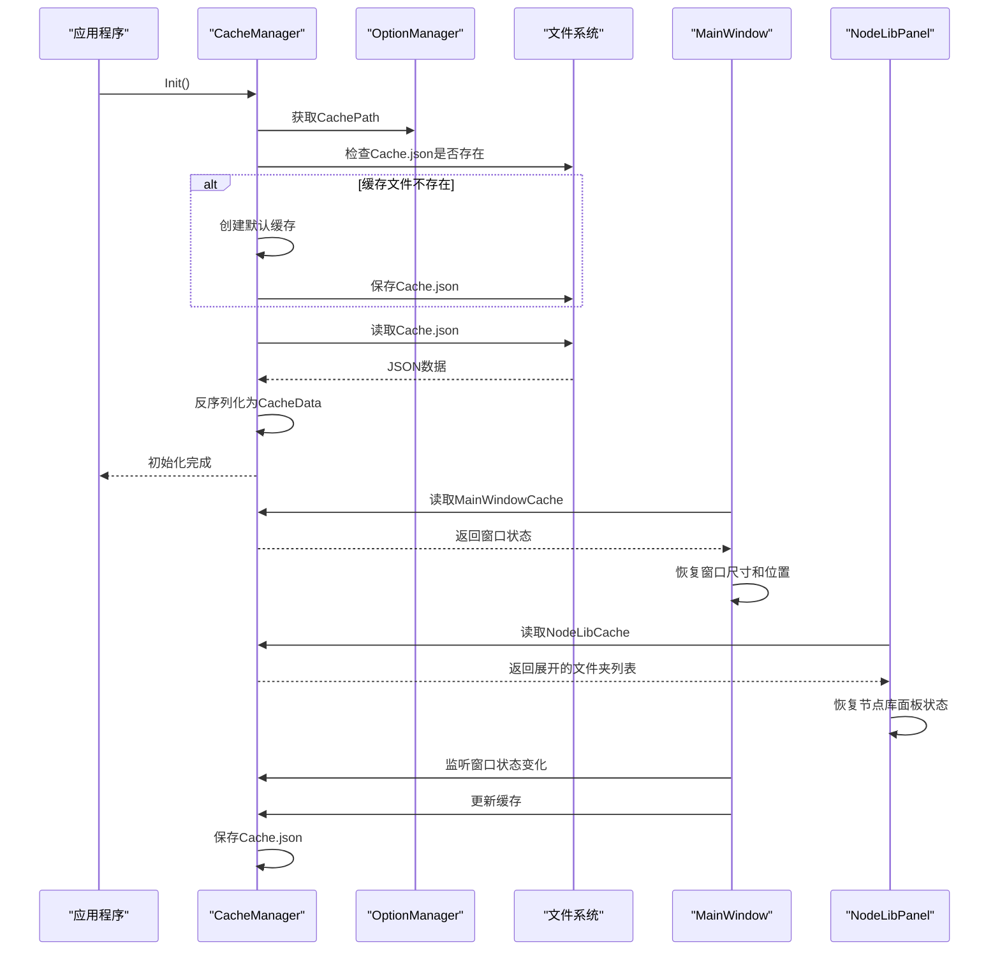
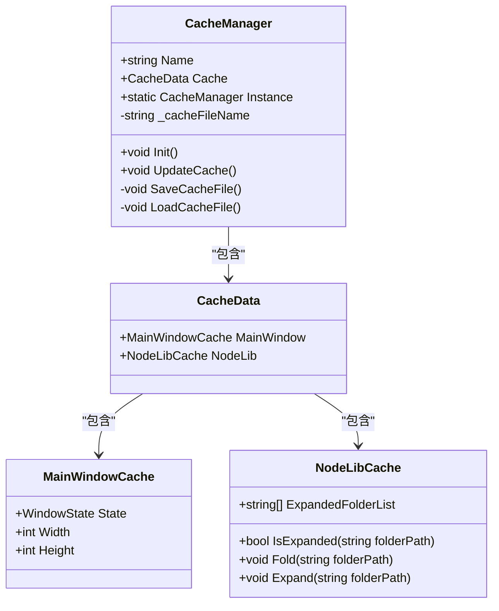
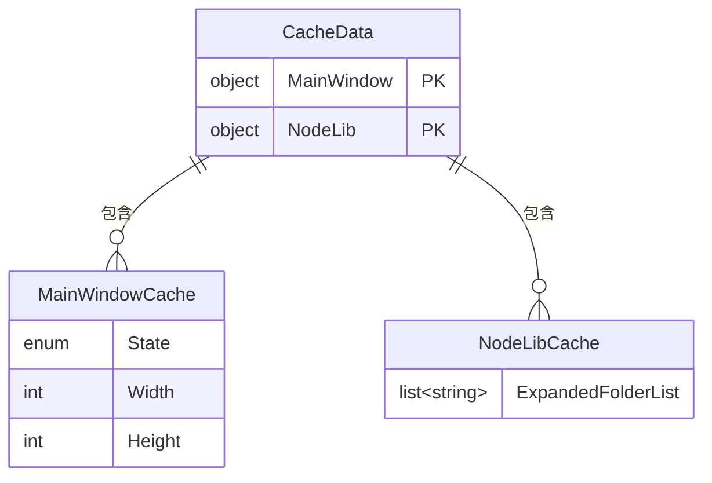
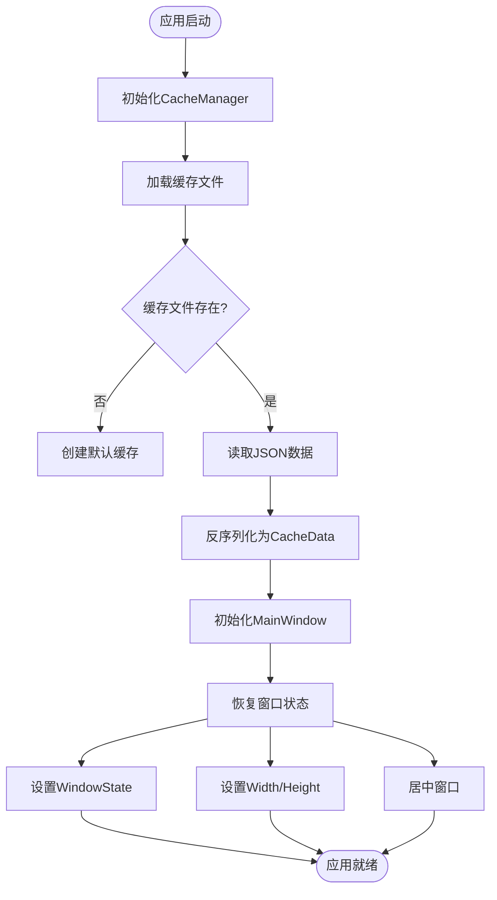
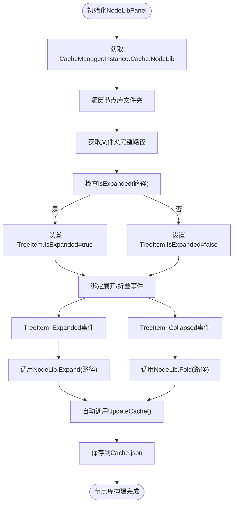
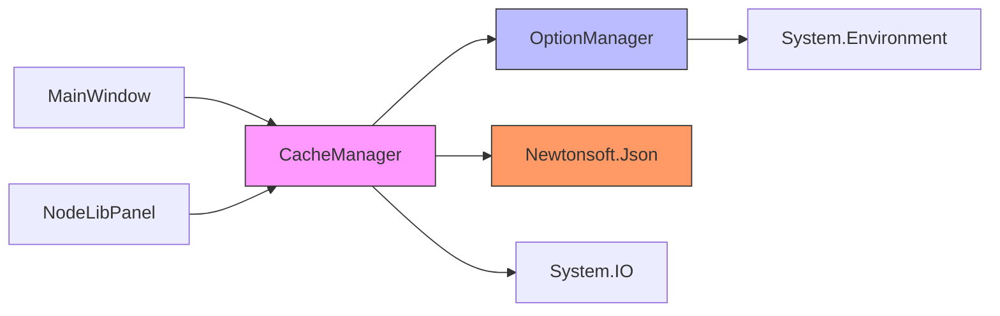

# 缓存系统

<cite>
**本文档中引用的文件**  
- [CacheManager.cs](file://XNode/SubSystem/CacheSystem/CacheManager.cs)
- [CacheData.cs](file://XNode/SubSystem/CacheSystem/CacheData.cs)
- [OptionManager.cs](file://XNode/SubSystem/OptionSystem/OptionManager.cs)
- [MainWindow.xaml.cs](file://XNode/MainWindow.xaml.cs)
- [NodeLibPanel.xaml.cs](file://XNode/SubSystem/NodeLibSystem/NodeLibPanel.xaml.cs)
</cite>

## 目录
1. [引言](#引言)
2. [项目结构](#项目结构)
3. [核心组件](#核心组件)
4. [架构概述](#架构概述)
5. [详细组件分析](#详细组件分析)
6. [依赖分析](#依赖分析)
7. [性能考虑](#性能考虑)
8. [故障排除指南](#故障排除指南)
9. [结论](#结论)

## 引言
本文档深入解析XNode项目中的缓存系统，重点说明其如何通过持久化存储用户偏好设置来提升用户体验和应用性能。文档详细描述了`CacheManager`单例的设计与实现，`CacheData`数据结构的组织方式，以及缓存数据的序列化与反序列化机制。同时，分析了缓存系统在应用启动时的快速恢复能力，并探讨了缓存清理、版本升级时的数据迁移策略。最后，文档通过实际场景说明了缓存失效机制和异常处理，并明确了缓存与项目数据的界限。

## 项目结构
缓存系统位于`XNode/SubSystem/CacheSystem`目录下，是整个应用子系统的一部分。该系统与选项系统、项目系统和UI组件紧密协作，共同维护用户状态。

```mermaid
graph TB
subgraph "缓存系统"
CM[CacheManager]
CD[CacheData]
end
subgraph "配置系统"
OM[OptionManager]
end
subgraph "UI组件"
MW[MainWindow]
NLP[NodeLibPanel]
end
subgraph "项目系统"
PM[ProjectManager]
end
CM --> OM : "获取缓存路径"
MW --> CM : "读取/写入主窗口状态"
NLP --> CM : "读取/写入节点库状态"
CM --> CD : "持有缓存数据"
```

**图示来源**
- [CacheManager.cs](file://XNode/SubSystem/CacheSystem/CacheManager.cs#L1-L83)
- [OptionManager.cs](file://XNode/SubSystem/OptionSystem/OptionManager.cs#L1-L52)
- [MainWindow.xaml.cs](file://XNode/MainWindow.xaml.cs#L1-L260)
- [NodeLibPanel.xaml.cs](file://XNode/SubSystem/NodeLibSystem/NodeLibPanel.xaml.cs#L1-L68)

**本节来源**
- [CacheManager.cs](file://XNode/SubSystem/CacheSystem/CacheManager.cs#L1-L83)
- [OptionManager.cs](file://XNode/SubSystem/OptionSystem/OptionManager.cs#L1-L52)

## 核心组件
缓存系统的核心由`CacheManager`和`CacheData`两个类构成。`CacheManager`作为单例提供全局访问点，负责缓存的持久化操作。`CacheData`则定义了缓存数据的结构，包含主窗口状态和节点库状态等用户偏好信息。

**本节来源**
- [CacheManager.cs](file://XNode/SubSystem/CacheSystem/CacheManager.cs#L1-L83)
- [CacheData.cs](file://XNode/SubSystem/CacheSystem/CacheData.cs#L1-L48)

## 架构概述
缓存系统采用单例模式，确保在整个应用生命周期内只有一个缓存管理实例。系统通过JSON序列化将`CacheData`对象持久化到本地文件系统，路径由`OptionManager`提供。应用启动时，`CacheManager`自动加载缓存文件，UI组件在初始化时读取缓存数据以恢复用户状态。



**图示来源**
- [CacheManager.cs](file://XNode/SubSystem/CacheSystem/CacheManager.cs#L1-L83)
- [MainWindow.xaml.cs](file://XNode/MainWindow.xaml.cs#L1-L260)
- [NodeLibPanel.xaml.cs](file://XNode/SubSystem/NodeLibSystem/NodeLibPanel.xaml.cs#L1-L68)

## 详细组件分析

### CacheManager 分析
`CacheManager`是缓存系统的控制中心，实现了单例模式和`IManager`接口。它负责缓存数据的加载、保存和更新。

#### 类图


**图示来源**
- [CacheManager.cs](file://XNode/SubSystem/CacheSystem/CacheManager.cs#L1-L83)
- [CacheData.cs](file://XNode/SubSystem/CacheSystem/CacheData.cs#L1-L48)

**本节来源**
- [CacheManager.cs](file://XNode/SubSystem/CacheSystem/CacheManager.cs#L1-L83)

### CacheData 数据结构分析
`CacheData`类定义了缓存数据的层次结构，包含主窗口和节点库两个主要部分。

#### 数据结构设计


**图示来源**
- [CacheData.cs](file://XNode/SubSystem/CacheSystem/CacheData.cs#L1-L48)

**本节来源**
- [CacheData.cs](file://XNode/SubSystem/CacheSystem/CacheData.cs#L1-L48)

### 实际应用场景分析

#### 主窗口状态恢复
当应用启动时，`MainWindow`会从缓存中恢复窗口状态，包括位置、尺寸和最大化状态。



**图示来源**
- [CacheManager.cs](file://XNode/SubSystem/CacheSystem/CacheManager.cs#L1-L83)
- [MainWindow.xaml.cs](file://XNode/MainWindow.xaml.cs#L1-L260)

#### 节点库面板状态恢复
节点库面板在初始化时会根据缓存中的`ExpandedFolderList`恢复文件夹的展开状态。



**图示来源**
- [NodeLibPanel.xaml.cs](file://XNode/SubSystem/NodeLibSystem/NodeLibPanel.xaml.cs#L1-L68)
- [CacheData.cs](file://XNode/SubSystem/CacheSystem/CacheData.cs#L1-L48)

**本节来源**
- [MainWindow.xaml.cs](file://XNode/MainWindow.xaml.cs#L1-L260)
- [NodeLibPanel.xaml.cs](file://XNode/SubSystem/NodeLibSystem/NodeLibPanel.xaml.cs#L1-L68)

## 依赖分析
缓存系统依赖于多个其他子系统和外部库，形成了清晰的依赖关系。



**图示来源**
- [CacheManager.cs](file://XNode/SubSystem/CacheSystem/CacheManager.cs#L1-L83)
- [OptionManager.cs](file://XNode/SubSystem/OptionSystem/OptionManager.cs#L1-L52)

**本节来源**
- [CacheManager.cs](file://XNode/SubSystem/CacheSystem/CacheManager.cs#L1-L83)
- [OptionManager.cs](file://XNode/SubSystem/OptionSystem/OptionManager.cs#L1-L52)

## 性能考虑
缓存系统在设计上考虑了性能因素：
1. **延迟写入**：窗口尺寸变化时，每次调整都会触发缓存更新，但通过`UpdateCache()`方法的简单调用，避免了复杂的计算。
2. **JSON序列化**：使用`JsonConvert.SerializeObject`进行序列化，格式化输出便于调试，但可能影响性能。对于大型缓存，可考虑使用紧凑格式。
3. **内存占用**：缓存数据常驻内存，避免了频繁的磁盘I/O，提升了访问速度。
4. **启动性能**：应用启动时仅需读取一个JSON文件，快速恢复用户状态，减少了重复配置的时间。

## 故障排除指南
### 缓存文件损坏处理
当前实现中，`LoadCacheFile`方法在反序列化失败时没有异常处理，可能导致`Cache`对象为空或部分数据丢失。

```csharp
private void LoadCacheFile()
{
    string jsonData = File.ReadAllText($"{OptionManager.Instance.CachePath}\\{_cacheFileName}");
    CacheData? cache = JsonConvert.DeserializeObject<CacheData>(jsonData);
    if (cache != null) Cache = cache;
    // 如果反序列化失败，cache为null，但没有异常处理
}
```

**建议改进**：
- 添加try-catch块捕获`JsonReaderException`等异常
- 当缓存文件损坏时，自动创建新的默认缓存并提示用户
- 提供"重置缓存"功能，允许用户手动清除损坏的缓存

### 缓存与项目数据的界限
缓存系统明确区分了用户偏好设置和项目数据：
- **缓存中存储**：主窗口位置尺寸、节点库面板展开状态、最近打开项目列表（未在代码中显示但合理推断）
- **不应存储在缓存中**：项目内容、节点数据、用户创建的任何持久化数据

这种分离确保了：
1. **安全性**：敏感的项目数据不会意外泄露到缓存文件中
2. **可移植性**：用户可以在不同机器间同步项目，而缓存保持本地化
3. **清理安全**：清除缓存不会影响项目数据

**本节来源**
- [CacheManager.cs](file://XNode/SubSystem/CacheSystem/CacheManager.cs#L1-L83)
- [CacheData.cs](file://XNode/SubSystem/CacheSystem/CacheData.cs#L1-L48)

## 结论
XNode的缓存系统通过`CacheManager`单例和`CacheData`数据结构，有效地提升了用户体验和应用性能。系统实现了用户偏好设置的持久化存储，包括主窗口状态和节点库面板状态，并在应用启动时快速恢复。尽管当前实现缺少对缓存文件损坏的异常处理，但整体架构清晰，职责分明。建议未来版本增加异常处理机制和缓存重置功能，以提高系统的健壮性。同时，系统严格区分了缓存与项目数据的界限，确保了数据的安全性和可维护性。