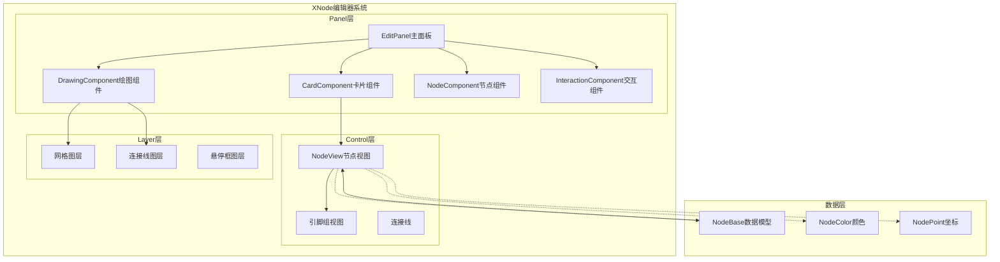
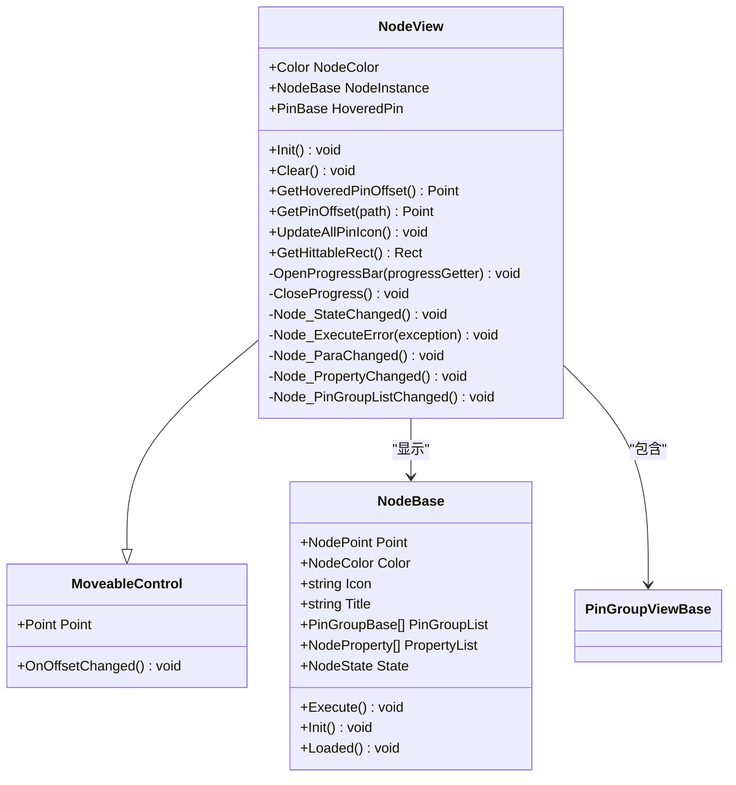
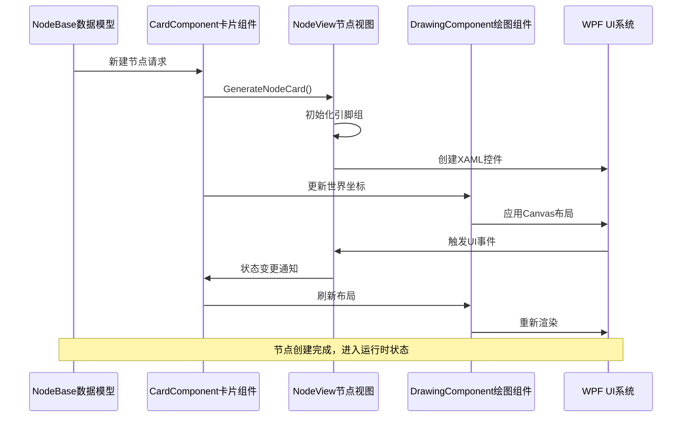
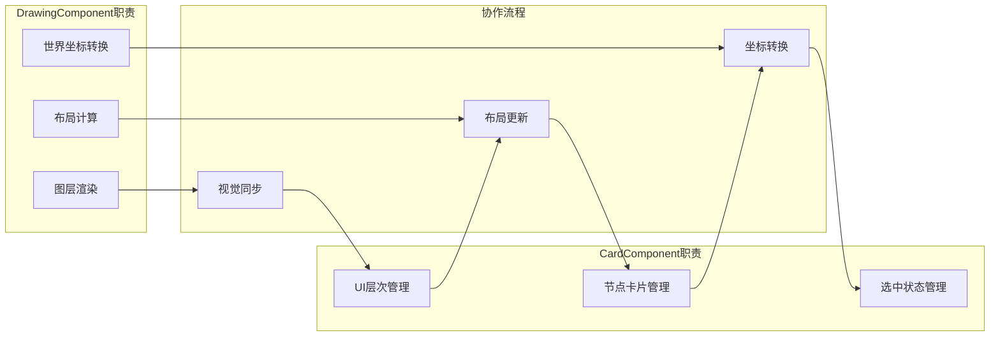
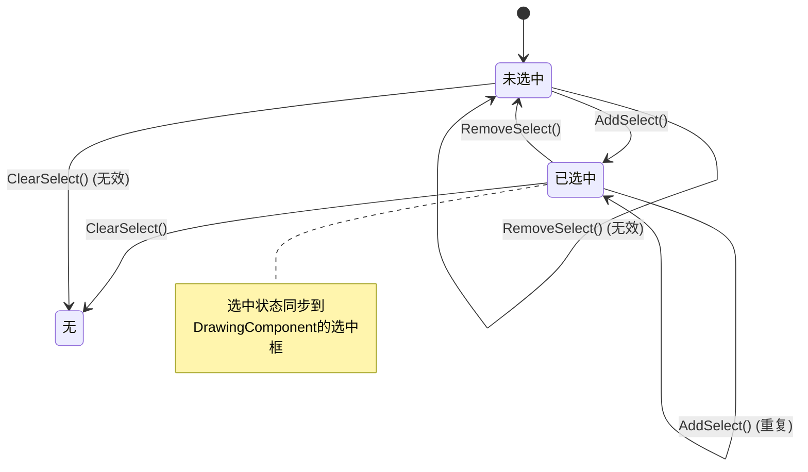
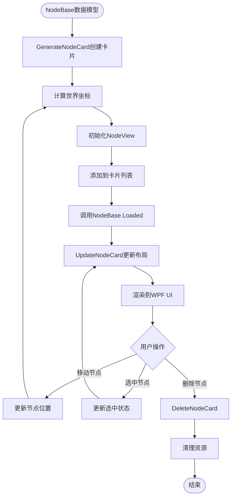
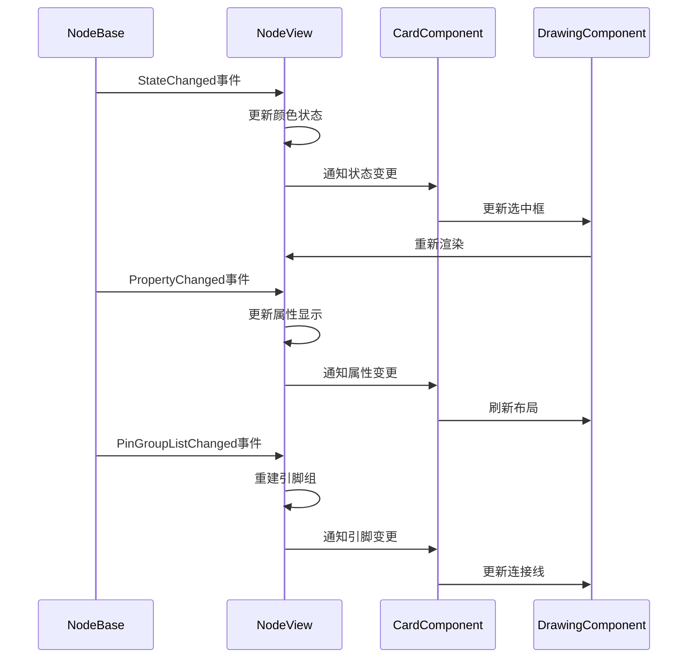

# CardComponent - 节点UI视图管理

<cite>
**本文档引用的文件**
- [CardComponent.cs](file://XNode/SubSystem/NodeEditSystem/Panel/Component/CardComponent.cs)
- [NodeView.xaml.cs](file://XNode/SubSystem/NodeEditSystem/Control/NodeView.xaml.cs)
- [NodeView.xaml](file://XNode/SubSystem/NodeEditSystem/Control/NodeView.xaml)
- [DrawingComponent.cs](file://XNode/SubSystem/NodeEditSystem/Panel/Component/DrawingComponent.cs)
- [NodeBase.cs](file://XLib.Node/NodeBase.cs)
- [EditPanel.xaml.cs](file://XNode/SubSystem/NodeEditSystem/Panel/EditPanel.xaml.cs)
- [GridLayer.cs](file://XNode/SubSystem/NodeEditSystem/Panel/Layer/GridLayer.cs)
- [PinGroupViewBase.cs](file://XNode/SubSystem/NodeEditSystem/Control/PinGroupViewBase.cs)
</cite>

## 目录
1. [简介](#简介)
2. [项目结构概览](#项目结构概览)
3. [核心组件分析](#核心组件分析)
4. [架构概览](#架构概览)
5. [详细组件分析](#详细组件分析)
6. [数据流与生命周期](#数据流与生命周期)
7. [性能优化与调试](#性能优化与调试)
8. [故障排除指南](#故障排除指南)
9. [总结](#总结)

## 简介

CardComponent是XNode编辑器系统中的核心UI视图控制器，负责将NodeBase数据模型映射为NodeView控件，并维护整个UI元素的生命周期。该组件作为节点卡片管理的核心，实现了从数据模型到可视化界面的完整转换流程，包括节点卡片的生成、布局更新、视觉状态同步以及与DrawingComponent的协作渲染。

CardComponent采用组件化设计模式，通过Component基类继承，实现了清晰的职责分离和模块化架构。它不仅管理单个节点的UI表示，还协调多个节点卡片的集合操作，确保编辑器界面的流畅性和响应性。

## 项目结构概览

XNode项目采用分层架构设计，CardComponent位于NodeEditSystem子系统的Panel层级，与其他核心组件协同工作：



**图表来源**
- [EditPanel.xaml.cs](file://XNode/SubSystem/NodeEditSystem/Panel/EditPanel.xaml.cs#L20-L50)
- [CardComponent.cs](file://XNode/SubSystem/NodeEditSystem/Panel/Component/CardComponent.cs#L1-L30)

**章节来源**
- [EditPanel.xaml.cs](file://XNode/SubSystem/NodeEditSystem/Panel/EditPanel.xaml.cs#L1-L123)
- [CardComponent.cs](file://XNode/SubSystem/NodeEditSystem/Panel/Component/CardComponent.cs#L1-L135)

## 核心组件分析

### CardComponent核心功能

CardComponent作为节点UI视图控制器，主要承担以下核心职责：

1. **节点卡片生命周期管理**
   - 节点卡片的创建、初始化和销毁
   - 选中状态的管理和批量操作
   - UI元素的层次管理（置顶、排序）

2. **数据模型映射**
   - 将NodeBase数据模型转换为NodeView控件
   - 同步节点属性变化到UI显示
   - 处理节点位置和颜色的动态更新

3. **集合操作管理**
   - 维护所有节点卡片的列表
   - 管理选中节点卡片的集合
   - 提供高效的查找和访问接口

### NodeView视图组件

NodeView是CardComponent管理的具体UI控件，继承自MoveableControl，提供了完整的节点可视化功能：



**图表来源**
- [NodeView.xaml.cs](file://XNode/SubSystem/NodeEditSystem/Control/NodeView.xaml.cs#L15-L80)
- [NodeBase.cs](file://XLib.Node/NodeBase.cs#L10-L50)

**章节来源**
- [CardComponent.cs](file://XNode/SubSystem/NodeEditSystem/Panel/Component/CardComponent.cs#L1-L135)
- [NodeView.xaml.cs](file://XNode/SubSystem\NodeEditSystem\Control\NodeView.xaml.cs#L1-L199)

## 架构概览

CardComponent在整个XNode编辑器架构中扮演着关键的桥梁角色，连接了数据层和UI层：



**图表来源**
- [CardComponent.cs](file://XNode/SubSystem\NodeEditSystem\Panel\Component\CardComponent.cs#L35-L60)
- [DrawingComponent.cs](file://XNode/SubSystem\NodeEditSystem\Panel\Component\DrawingComponent.cs#L200-L250)

### 组件协作关系

CardComponent与DrawingComponent紧密协作，共同完成图层渲染和布局管理：



**图表来源**
- [CardComponent.cs](file://XNode/SubSystem\NodeEditSystem\Panel\Component\CardComponent.cs#L65-L90)
- [DrawingComponent.cs](file://XNode/SubSystem\NodeEditSystem\Panel\Component\DrawingComponent.cs#L100-L150)

**章节来源**
- [CardComponent.cs](file://XNode/SubSystem\NodeEditSystem\Panel\Component\CardComponent.cs#L1-L135)
- [DrawingComponent.cs](file://XNode/SubSystem\NodeEditSystem\Panel\Component\DrawingComponent.cs#L1-L387)

## 详细组件分析

### 节点卡片生成机制

CardComponent的GenerateNodeCard方法是节点UI创建的核心入口：

```csharp
public NodeView GenerateNodeCard(NodeBase node)
{
    // 创建节点卡片实例
    NodeView card = new NodeView
    {
        NodeColor = Color.FromRgb(node.Color.r, node.Color.g, node.Color.b),
        NodeInstance = node,
        Point = new Point(node.Point.X, node.Point.Y),
    };
    
    // 计算世界坐标并设置Canvas位置
    Point center = GetComponent<DrawingComponent>().WorldCenter;
    Canvas.SetLeft(card, center.X + node.Point.X - 12);
    Canvas.SetTop(card, center.Y + node.Point.Y - 1);
    
    // 初始化节点卡片
    card.Init();
    
    // 添加到UI容器和内部列表
    _host.LayerBox_Node.Children.Add(card);
    _cardList.Add(card);
    
    // 调用节点已加载回调
    node.Loaded();
    
    return card;
}
```

该方法的关键步骤包括：
1. **数据模型映射**：将NodeBase的颜色、坐标等属性映射到NodeView
2. **世界坐标计算**：通过DrawingComponent获取世界中心点，计算绝对坐标
3. **UI初始化**：调用NodeView.Init()方法初始化引脚组和事件监听
4. **容器管理**：添加到Canvas容器和内部卡片列表
5. **生命周期回调**：通知NodeBase节点已成功加载

### 布局更新机制

UpdateNodeCard方法负责同步节点位置变化到UI显示：

```csharp
public void UpdateNodeCard()
{
    Point center = GetComponent<DrawingComponent>().WorldCenter;
    foreach (var card in _cardList)
    {
        Canvas.SetLeft(card, center.X + card.Point.X - 12);
        Canvas.SetTop(card, center.Y + card.Point.Y - 1);
    }
}
```

这个方法的特点：
- **批量更新**：遍历所有卡片，统一更新位置
- **坐标转换**：使用世界中心点进行坐标变换
- **性能优化**：避免逐个触发UI更新事件

### 选中状态管理

CardComponent通过HashSet<NodeView> _selectedCardSet管理选中状态：



**图表来源**
- [CardComponent.cs](file://XNode/SubSystem\NodeEditSystem\Panel\Component\CardComponent.cs#L95-L110)

### 可视化状态同步

NodeView通过多种机制实现视觉状态的同步：

1. **颜色状态同步**
```csharp
public Color NodeColor
{
    get => _nodeColor;
    set
    {
        _nodeColor = value;
        Color_Start.Color = Color.FromArgb(255, _nodeColor.R, _nodeColor.G, _nodeColor.B);
        Color_End.Color = Color.FromArgb(0, _nodeColor.R, _nodeColor.G, _nodeColor.B);
        NodeFillColor.Background = new SolidColorBrush(Color.FromArgb(48, _nodeColor.R, _nodeColor.G, _nodeColor.B));
    }
}
```

2. **执行状态指示**
- 通过Image_Light控件显示执行状态
- 支持不同状态的图标切换
- 实现渐变效果增强视觉反馈

3. **引脚状态管理**
- 动态更新引脚图标
- 支持悬停状态高亮
- 实现连接状态可视化

**章节来源**
- [CardComponent.cs](file://XNode/SubSystem\NodeEditSystem\Panel\Component\CardComponent.cs#L35-L90)
- [NodeView.xaml.cs](file://XNode/SubSystem\NodeEditSystem\Control\NodeView.xaml.cs#L30-L80)

## 数据流与生命周期

### 完整的数据流过程



**图表来源**
- [CardComponent.cs](file://XNode/SubSystem\NodeEditSystem\Panel\Component\CardComponent.cs#L35-L135)

### 生命周期事件处理

NodeView通过事件系统与NodeBase保持同步：



**图表来源**
- [NodeView.xaml.cs](file://XNode/SubSystem\NodeEditSystem\Control\NodeView.xaml.cs#L100-L150)
- [NodeBase.cs](file://XLib.Node\NodeBase.cs#L60-L90)

**章节来源**
- [NodeView.xaml.cs](file://XNode/SubSystem\NodeEditSystem\Control\NodeView.xaml.cs#L80-L150)
- [NodeBase.cs](file://XLib.Node\NodeBase.cs#L1-L100)

## 性能优化与调试

### 性能优化策略

1. **批量更新机制**
   - 使用UpdateNodeCard统一更新所有节点位置
   - 避免频繁的UI布局重排
   - 减少Canvas.SetLeft/SetTop的调用次数

2. **选择集优化**
   - 使用HashSet<NodeView>提高查找效率
   - O(1)时间复杂度的选中状态检查
   - 批量操作支持ClearSelect()

3. **内存管理**
   - 及时清理事件订阅
   - 在Clear()方法中移除所有事件处理器
   - 避免内存泄漏

### 调试技巧

1. **坐标调试**
```csharp
// 在GenerateNodeCard中添加调试信息
Debug.WriteLine($"生成节点卡片: ID={node.ID}, 位置={node.Point}");
Debug.WriteLine($"世界坐标: X={worldX}, Y={worldY}");
```

2. **性能监控**
```csharp
// 测量布局更新耗时
var stopwatch = Stopwatch.StartNew();
UpdateNodeCard();
stopwatch.Stop();
Debug.WriteLine($"布局更新耗时: {stopwatch.ElapsedMilliseconds}ms");
```

3. **状态验证**
```csharp
// 验证卡片列表一致性
Debug.Assert(_cardList.Count == _host.LayerBox_Node.Children.Count);
foreach (var card in _cardList)
{
    Debug.Assert(_host.LayerBox_Node.Children.Contains(card));
}
```

### 常见性能问题

1. **UI卡顿问题**
   - 原因：大量节点同时更新导致UI线程阻塞
   - 解决方案：使用Dispatcher异步更新，或分批处理

2. **视觉错位问题**
   - 原因：坐标计算不准确或更新时机不当
   - 解决方案：确保在DrawingComponent.WorldCenter更新后再调用UpdateNodeCard

3. **内存泄漏问题**
   - 原因：事件处理器未正确清理
   - 解决方案：在NodeView.Clear()中移除所有事件订阅

## 故障排除指南

### 常见问题诊断

1. **节点无法显示**
   - 检查NodeView是否正确添加到LayerBox_Node
   - 验证Canvas.SetLeft/SetTop坐标计算
   - 确认NodeBase.Loaded()被正确调用

2. **选中状态异常**
   - 检查_selectedCardSet集合状态
   - 验证AddSelect/RemoveSelect方法调用
   - 确认DrawingComponent.UpdateSelectedBox()被调用

3. **布局混乱**
   - 检查WorldCenter坐标获取
   - 验证UpdateNodeCard调用时机
   - 确认坐标转换公式正确性

### 调试工具和方法

1. **日志记录**
```csharp
// 启用详细日志
private static readonly Logger logger = LogManager.GetCurrentClassLogger();

logger.Debug("生成节点卡片: {NodeId}", node.ID);
logger.Trace("世界坐标: X={X}, Y={Y}", worldX, worldY);
```

2. **可视化调试**
```csharp
// 在节点周围绘制调试框
var debugRect = new Rectangle
{
    Stroke = Brushes.Red,
    StrokeThickness = 1,
    Width = card.ActualWidth,
    Height = card.ActualHeight
};
Canvas.SetLeft(debugRect, Canvas.GetLeft(card));
Canvas.SetTop(debugRect, Canvas.GetTop(card));
_debugLayer.Children.Add(debugRect);
```

3. **性能分析**
```csharp
// 使用性能计数器监控
var perfCounter = new PerformanceCounter("XNode", "CardUpdateCount");
perfCounter.Increment();
```

**章节来源**
- [CardComponent.cs](file://XNode/SubSystem\NodeEditSystem\Panel\Component\CardComponent.cs#L65-L90)
- [DrawingComponent.cs](file://XNode/SubSystem\NodeEditSystem\Panel\Component\DrawingComponent.cs#L200-L250)

## 总结

CardComponent作为XNode编辑器系统的核心UI视图控制器，实现了从NodeBase数据模型到NodeView控件的完整映射流程。通过精心设计的组件架构和优化的性能策略，它成功地平衡了功能完整性、性能表现和用户体验。

### 主要成就

1. **完整的生命周期管理**：从节点创建到销毁的全流程控制
2. **高效的集合操作**：O(1)时间复杂度的选择状态管理
3. **精确的坐标同步**：与DrawingComponent的无缝协作
4. **灵活的状态同步**：支持多种视觉状态的实时更新

### 技术亮点

- **组件化设计**：清晰的职责分离和模块化架构
- **事件驱动**：基于.NET事件系统的松耦合通信
- **性能优化**：批量更新和内存管理的最佳实践
- **扩展性**：良好的接口设计支持功能扩展

### 未来改进方向

1. **虚拟化支持**：大规模节点场景下的性能优化
2. **动画集成**：更丰富的视觉反馈和过渡效果
3. **多线程优化**：利用异步编程提升响应性
4. **内存池**：减少GC压力的内存管理策略

CardComponent的设计和实现为现代WPF应用程序的UI架构提供了优秀的参考范例，展示了如何在复杂的图形编辑器中实现高性能、高可用性的UI视图管理。