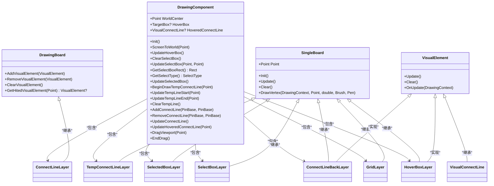
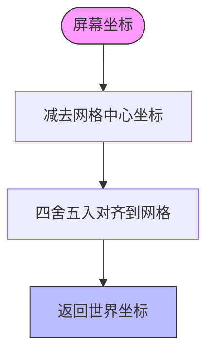
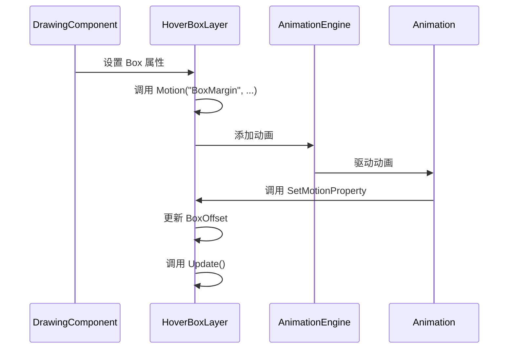
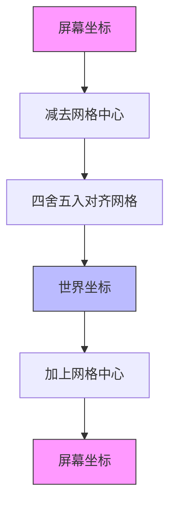
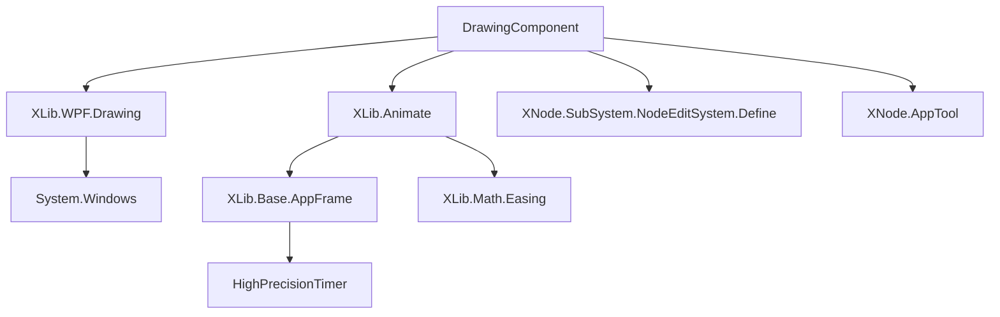

# DrawingComponent - 图形渲染引擎

<cite>
**本文档引用的文件**   
- [DrawingComponent.cs](file://XNode/SubSystem/NodeEditSystem/Panel/Component/DrawingComponent.cs)
- [GridLayer.cs](file://XNode/SubSystem/NodeEditSystem/Panel/Layer/GridLayer.cs)
- [ConnectLineLayer.cs](file://XNode/SubSystem/NodeEditSystem/Panel/Layer/ConnectLineLayer.cs)
- [VisualConnectLine.cs](file://XNode/SubSystem/NodeEditSystem/Panel/Layer/VisualConnectLine.cs)
- [HoverBoxLayer.cs](file://XNode/SubSystem/NodeEditSystem/Panel/Layer/HoverBoxLayer.cs)
- [ConnectLineBackLayer.cs](file://XNode/SubSystem/NodeEditSystem/Panel/Layer/ConnectLineBackLayer.cs)
- [DrawingBoard.cs](file://XLib/WPF/Drawing/DrawingBoard.cs)
- [SingleBoard.cs](file://XLib/WPF/Drawing/SingleBoard.cs)
- [VisualElement.cs](file://XLib/WPF/Drawing/VisualElement.cs)
- [AnimationEngine.cs](file://XLib.Animate/AnimationEngine.cs)
- [IAnimation.cs](file://XLib.Animate/IAnimation.cs)
- [IMotion.cs](file://XLib.Animate/IMotion.cs)
</cite>

## 目录
1. [引言](#引言)
2. [项目结构](#项目结构)
3. [核心组件](#核心组件)
4. [架构概述](#架构概述)
5. [详细组件分析](#详细组件分析)
6. [依赖分析](#依赖分析)
7. [性能考虑](#性能考虑)
8. [故障排除指南](#故障排除指南)
9. [结论](#结论)

## 引言
DrawingComponent 是 XNode 图形编辑系统中的核心渲染引擎，负责管理多个图层（Layer）并实现复杂的图形绘制功能。该组件通过 DrawingBoard 管理网格背景、连接线、悬停框等视觉元素，支持坐标系转换、缩放平移变换，并与 XLib.Animate 模块集成实现平滑动画效果。本文档将深入分析其职责与实现机制。

## 项目结构
DrawingComponent 位于 `XNode/SubSystem/NodeEditSystem/Panel/Component/` 目录下，作为 EditPanel 的核心组件之一。它依赖于多个图层类（Layer）和 XLib.WPF.Drawing 模块提供的基础绘图能力，同时与 XLib.Animate 动画系统紧密集成。

```mermaid
graph TB
subgraph "XNode"
DrawingComponent[DrawingComponent]
EditPanel[EditPanel]
end
subgraph "XNode.SubSystem.NodeEditSystem.Panel.Layer"
GridLayer[GridLayer]
ConnectLineLayer[ConnectLineLayer]
HoverBoxLayer[HoverBoxLayer]
SelectBoxLayer[SelectBoxLayer]
SelectedBoxLayer[SelectedBoxLayer]
TempConnectLineLayer[TempConnectLineLayer]
ConnectLineBackLayer[ConnectLineBackLayer]
end
subgraph "XLib.WPF.Drawing"
DrawingBoard[DrawingBoard]
SingleBoard[SingleBoard]
VisualElement[VisualElement]
end
subgraph "XLib.Animate"
AnimationEngine[AnimationEngine]
IAnimation[IAnimation]
IMotion[IMotion]
end
DrawingComponent --> GridLayer
DrawingComponent --> ConnectLineLayer
DrawingComponent --> HoverBoxLayer
DrawingComponent --> SelectBoxLayer
DrawingComponent --> SelectedBoxLayer
DrawingComponent --> TempConnectLineLayer
DrawingComponent --> ConnectLineBackLayer
DrawingComponent --> DrawingBoard
DrawingComponent --> SingleBoard
DrawingComponent --> VisualElement
DrawingComponent --> AnimationEngine
DrawingComponent --> IMotion
```

**图示来源**
- [DrawingComponent.cs](file://XNode/SubSystem/NodeEditSystem/Panel/Component/DrawingComponent.cs)
- [GridLayer.cs](file://XNode/SubSystem/NodeEditSystem/Panel/Layer/GridLayer.cs)
- [ConnectLineLayer.cs](file://XNode/SubSystem/NodeEditSystem/Panel/Layer/ConnectLineLayer.cs)
- [HoverBoxLayer.cs](file://XNode/SubSystem/NodeEditSystem/Panel/Layer/HoverBoxLayer.cs)
- [SelectBoxLayer.cs](file://XNode/SubSystem/NodeEditSystem/Panel/Layer/SelectBoxLayer.cs)
- [SelectedBoxLayer.cs](file://XNode/SubSystem/NodeEditSystem/Panel/Layer/SelectedBoxLayer.cs)
- [TempConnectLineLayer.cs](file://XNode/SubSystem/NodeEditSystem/Panel/Layer/TempConnectLineLayer.cs)
- [ConnectLineBackLayer.cs](file://XNode/SubSystem/NodeEditSystem/Panel/Layer/ConnectLineBackLayer.cs)
- [DrawingBoard.cs](file://XLib.WPF/Drawing/DrawingBoard.cs)
- [SingleBoard.cs](file://XLib.WPF/Drawing/SingleBoard.cs)
- [VisualElement.cs](file://XLib.WPF/Drawing/VisualElement.cs)
- [AnimationEngine.cs](file://XLib.Animate/AnimationEngine.cs)
- [IMotion.cs](file://XLib.Animate/IMotion.cs)

**节来源**
- [DrawingComponent.cs](file://XNode/SubSystem/NodeEditSystem/Panel/Component/DrawingComponent.cs)
- [GridLayer.cs](file://XNode/SubSystem/NodeEditSystem/Panel/Layer/GridLayer.cs)
- [ConnectLineLayer.cs](file://XNode/SubSystem/NodeEditSystem/Panel/Layer/ConnectLineLayer.cs)

## 核心组件

DrawingComponent 作为图形渲染的核心，封装了所有与视觉呈现相关的逻辑。它通过组合多个图层对象来实现分层渲染，每个图层负责特定类型的图形元素。组件还提供了坐标转换、动画控制和用户交互响应等关键功能。

**节来源**
- [DrawingComponent.cs](file://XNode/SubSystem/NodeEditSystem/Panel/Component/DrawingComponent.cs)

## 架构概述

DrawingComponent 采用分层架构设计，基于 WPF 的 DrawingVisual 模型构建。系统通过 DrawingBoard 管理多个 VisualElement，实现高效的图形渲染。各图层按 Z-order 排序，确保正确的绘制顺序。

**图示来源**
- [DrawingComponent.cs](file://XNode/SubSystem/NodeEditSystem/Panel/Component/DrawingComponent.cs)
- [DrawingBoard.cs](file://XLib/WPF/Drawing/DrawingBoard.cs)
- [SingleBoard.cs](file://XLib.WPF/Drawing/SingleBoard.cs)
- [VisualElement.cs](file://XLib.WPF/Drawing/VisualElement.cs)
- [GridLayer.cs](file://XNode/SubSystem/NodeEditSystem/Panel/Layer/GridLayer.cs)
- [ConnectLineLayer.cs](file://XNode/SubSystem/NodeEditSystem/Panel/Layer/ConnectLineLayer.cs)
- [HoverBoxLayer.cs](file://XNode/SubSystem/NodeEditSystem/Panel/Layer/HoverBoxLayer.cs)
- [SelectBoxLayer.cs](file://XNode/SubSystem/NodeEditSystem/Panel/Layer/SelectBoxLayer.cs)
- [SelectedBoxLayer.cs](file://XNode/SubSystem/NodeEditSystem/Panel/Layer/SelectedBoxLayer.cs)
- [TempConnectLineLayer.cs](file://XNode/SubSystem/NodeEditSystem/Panel/Layer/TempConnectLineLayer.cs)
- [ConnectLineBackLayer.cs](file://XNode/SubSystem/NodeEditSystem/Panel/Layer/ConnectLineBackLayer.cs)
- [VisualConnectLine.cs](file://XNode/SubSystem/NodeEditSystem/Panel/Layer/VisualConnectLine.cs)

**节来源**
- [DrawingComponent.cs](file://XNode/SubSystem/NodeEditSystem/Panel/Component/DrawingComponent.cs)
- [DrawingBoard.cs](file://XLib/WPF/Drawing/DrawingBoard.cs)
- [SingleBoard.cs](file://XLib.WPF/Drawing/SingleBoard.cs)
- [VisualElement.cs](file://XLib.WPF/Drawing/VisualElement.cs)

## 详细组件分析

### DrawingComponent 分析
DrawingComponent 是图形渲染系统的中枢，负责协调各个图层的工作。它通过 EnableLayer() 方法初始化所有图层，并将它们添加到宿主容器的相应层级中。组件维护对各个图层的引用，提供统一的接口来操作这些图层。

#### 坐标系转换实现

**图示来源**
- [DrawingComponent.cs](file://XNode/SubSystem/NodeEditSystem/Panel/Component/DrawingComponent.cs#L50-L58)

**节来源**
- [DrawingComponent.cs](file://XNode/SubSystem/NodeEditSystem/Panel/Component/DrawingComponent.cs#L50-L58)

#### 动画集成机制
DrawingComponent 与 XLib.Animate 模块深度集成，通过 IMotion 接口实现属性动画。当设置 HoverBox 属性时，会触发 Motion 动画，实现悬停框的平滑出现效果。

**图示来源**
- [DrawingComponent.cs](file://XNode/SubSystem/NodeEditSystem/Panel/Component/DrawingComponent.cs#L20-L30)
- [HoverBoxLayer.cs](file://XNode/SubSystem/NodeEditSystem/Panel/Layer/HoverBoxLayer.cs#L25-L35)
- [AnimationEngine.cs](file://XLib.Animate/AnimationEngine.cs#L30-L45)

**节来源**
- [DrawingComponent.cs](file://XNode/SubSystem/NodeEditSystem/Panel/Component/DrawingComponent.cs#L20-L30)
- [HoverBoxLayer.cs](file://XNode/SubSystem/NodeEditSystem/Panel/Layer/HoverBoxLayer.cs#L25-L35)

### 图层系统分析
DrawingComponent 管理多个图层，每个图层负责特定的视觉元素。图层按 Z-order 分层，确保正确的绘制顺序。

#### 图层类型与职责
| 图层类型 | 文件路径 | 职责描述 |
|---------|--------|---------|
| GridLayer | [GridLayer.cs](file://XNode/SubSystem/NodeEditSystem/Panel/Layer/GridLayer.cs) | 绘制网格背景，支持平移和缩放 |
| ConnectLineLayer | [ConnectLineLayer.cs](file://XNode/SubSystem/NodeEditSystem/Panel/Layer/ConnectLineLayer.cs) | 管理所有连接线 |
| HoverBoxLayer | [HoverBoxLayer.cs](file://XNode/SubSystem/NodeEditSystem/Panel/Layer/HoverBoxLayer.cs) | 显示悬停框，支持动画 |
| SelectBoxLayer | [SelectBoxLayer.cs](file://XNode/SubSystem/NodeEditSystem/Panel/Layer/SelectBoxLayer.cs) | 显示选择框 |
| SelectedBoxLayer | [SelectedBoxLayer.cs](file://XNode/SubSystem/NodeEditSystem/Panel/Layer/SelectedBoxLayer.cs) | 显示已选中节点的边框 |
| TempConnectLineLayer | [TempConnectLineLayer.cs](file://XNode/SubSystem/NodeEditSystem/Panel/Layer/TempConnectLineLayer.cs) | 显示临时连接线 |
| ConnectLineBackLayer | [ConnectLineBackLayer.cs](file://XNode/SubSystem/NodeEditSystem/Panel/Layer/ConnectLineBackLayer.cs) | 显示悬停连接线的背景 |

**节来源**
- [DrawingComponent.cs](file://XNode/SubSystem/NodeEditSystem/Panel/Component/DrawingComponent.cs#L150-L180)

### 坐标系转换数学实现
DrawingComponent 实现了屏幕坐标与世界坐标之间的转换。世界坐标以网格中心为原点，支持对齐到网格的功能。

**图示来源**
- [DrawingComponent.cs](file://XNode/SubSystem/NodeEditSystem/Panel/Component/DrawingComponent.cs#L50-L58)
- [GridLayer.cs](file://XNode/SubSystem/NodeEditSystem/Panel/Layer/GridLayer.cs#L100-L115)

**节来源**
- [DrawingComponent.cs](file://XNode/SubSystem/NodeEditSystem/Panel/Component/DrawingComponent.cs#L50-L58)

## 依赖分析

DrawingComponent 依赖于多个核心模块，形成了一个复杂的依赖网络。

**图示来源**
- [DrawingComponent.cs](file://XNode/SubSystem/NodeEditSystem/Panel/Component/DrawingComponent.cs)
- [AnimationEngine.cs](file://XLib.Animate/AnimationEngine.cs)
- [GridLayer.cs](file://XNode/SubSystem/NodeEditSystem/Panel/Layer/GridLayer.cs)

**节来源**
- [DrawingComponent.cs](file://XNode/SubSystem/NodeEditSystem/Panel/Component/DrawingComponent.cs)
- [AnimationEngine.cs](file://XLib.Animate/AnimationEngine.cs)

## 性能考虑

虽然当前代码中未显式实现脏区域重绘机制，但系统通过分层渲染和按需更新策略优化性能。每个图层只在必要时调用 Update() 方法，避免不必要的重绘。

- **分层渲染**：不同类型的图形元素分布在不同的图层，减少重绘范围
- **按需更新**：只有在数据变化时才调用 Update() 方法
- **命中检测优化**：使用 GeometryHitTestParameters 进行高效的命中检测
- **冻结画笔**：在 Init() 方法中冻结画笔对象，提高渲染性能

**节来源**
- [GridLayer.cs](file://XNode/SubSystem/NodeEditSystem/Panel/Layer/GridLayer.cs#L30-L35)
- [ConnectLineBackLayer.cs](file://XNode/SubSystem/NodeEditSystem/Panel/Layer/ConnectLineBackLayer.cs#L20-L25)
- [DrawingBoard.cs](file://XLib/WPF/Drawing/DrawingBoard.cs#L50-L60)

## 故障排除指南

### 渲染闪烁问题
**现象**：图形在交互时出现闪烁
**可能原因**：
- 图层更新顺序不当
- 动画帧率与渲染不同步
- 未正确冻结画笔资源

**解决方案**：
1. 确保所有画笔在 Init() 方法中调用 Freeze()
2. 检查动画引擎的定时器间隔是否合理
3. 确认图层的 Z-order 设置正确

### 图层错序问题
**现象**：视觉元素显示顺序错误
**可能原因**：
- 图层添加顺序不正确
- Z-index 设置错误

**解决方案**：
1. 检查 EnableLayer() 方法中的图层添加顺序
2. 确认宿主容器的子元素顺序
3. 使用 VisualTreeHelper.GetChildrenCount() 验证图层顺序

**节来源**
- [DrawingComponent.cs](file://XNode/SubSystem/NodeEditSystem/Panel/Component/DrawingComponent.cs#L150-L180)
- [GridLayer.cs](file://XNode/SubSystem/NodeEditSystem/Panel/Layer/GridLayer.cs#L30-L35)

## 结论
DrawingComponent 作为 XNode 系统的图形渲染核心，通过分层架构实现了高效的图形管理。它不仅提供了基本的绘图功能，还集成了动画系统，实现了流畅的用户体验。通过合理的坐标系转换和图层管理，系统能够处理复杂的图形编辑场景。未来可进一步优化性能，引入脏区域重绘机制，提升大规模场景下的渲染效率。