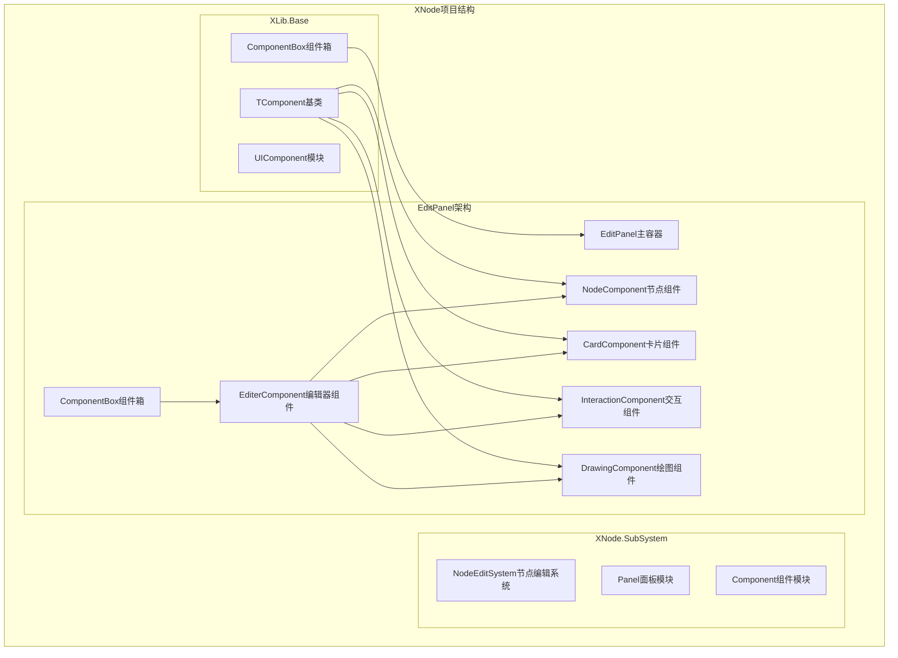
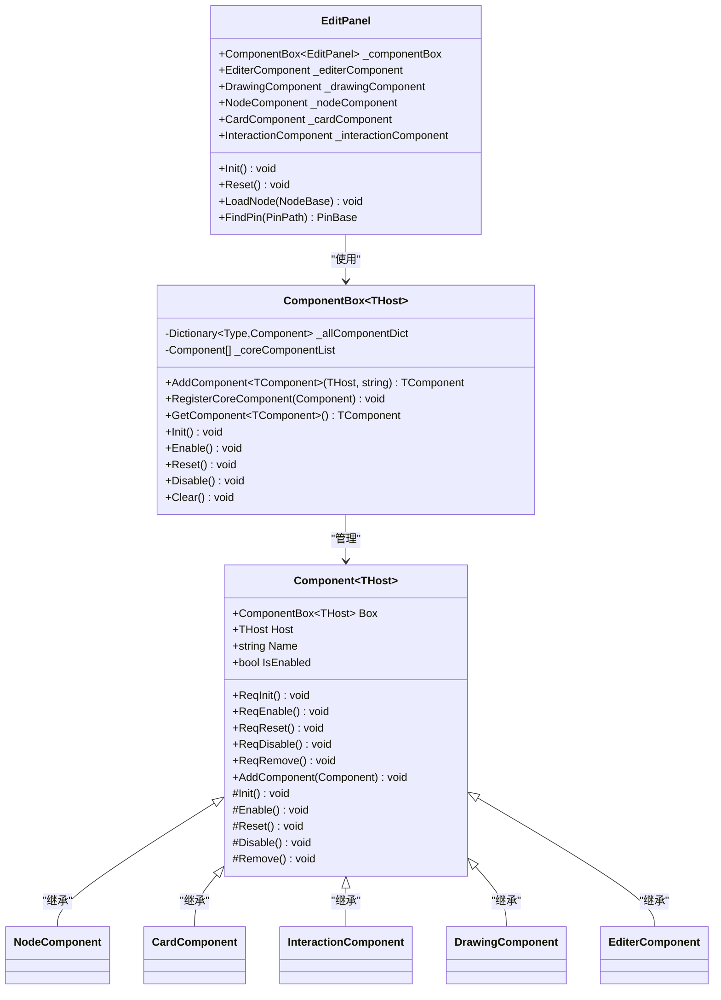
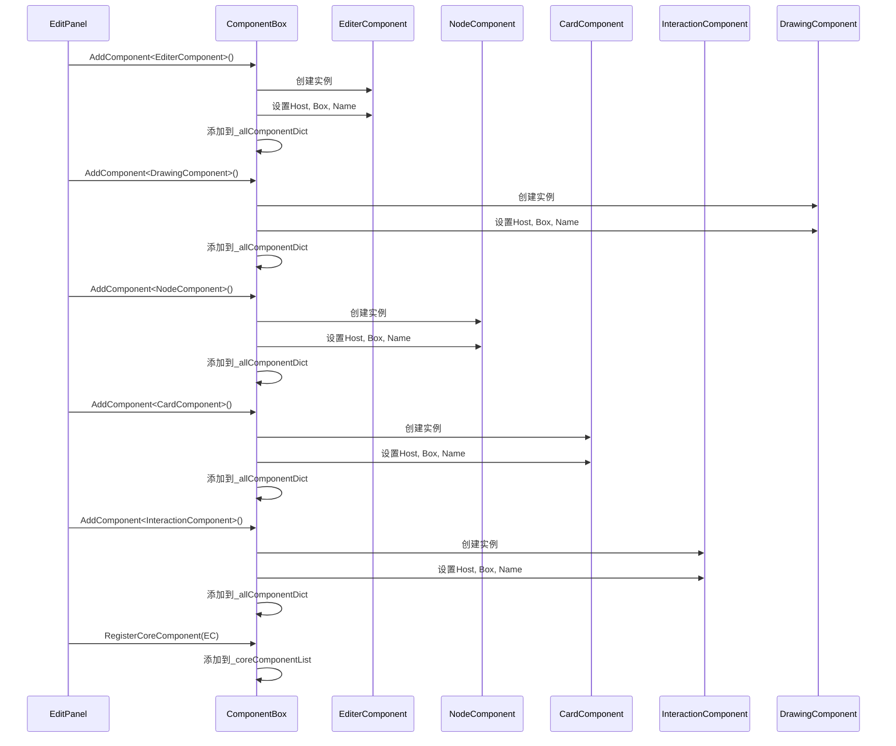
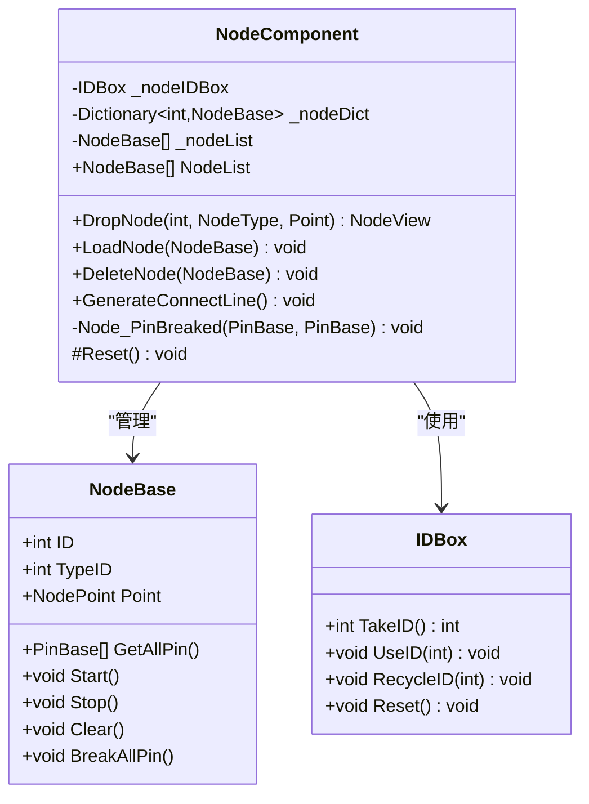
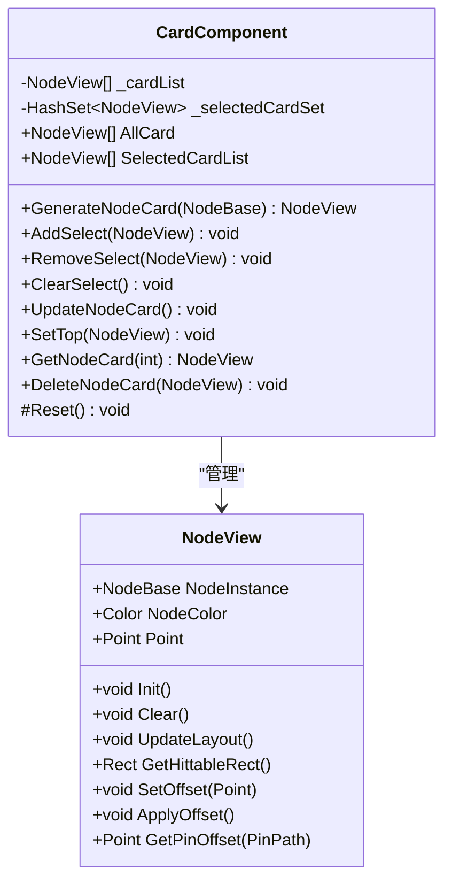
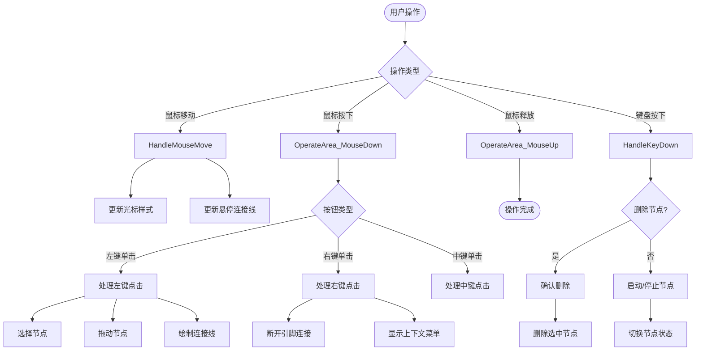
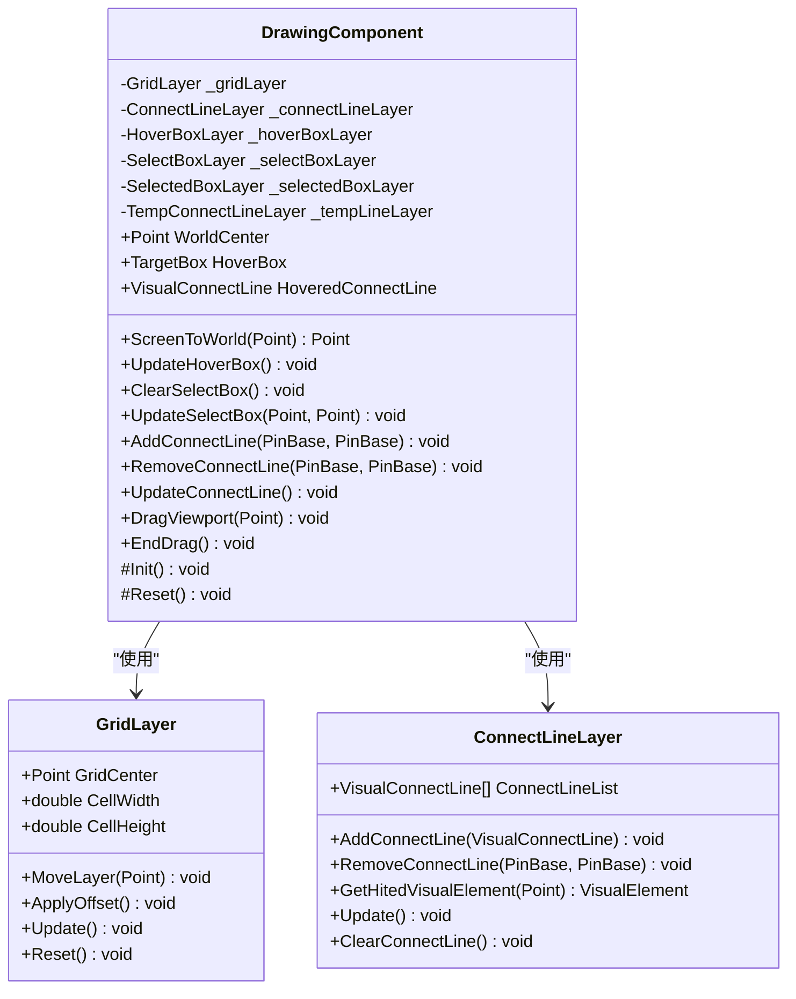
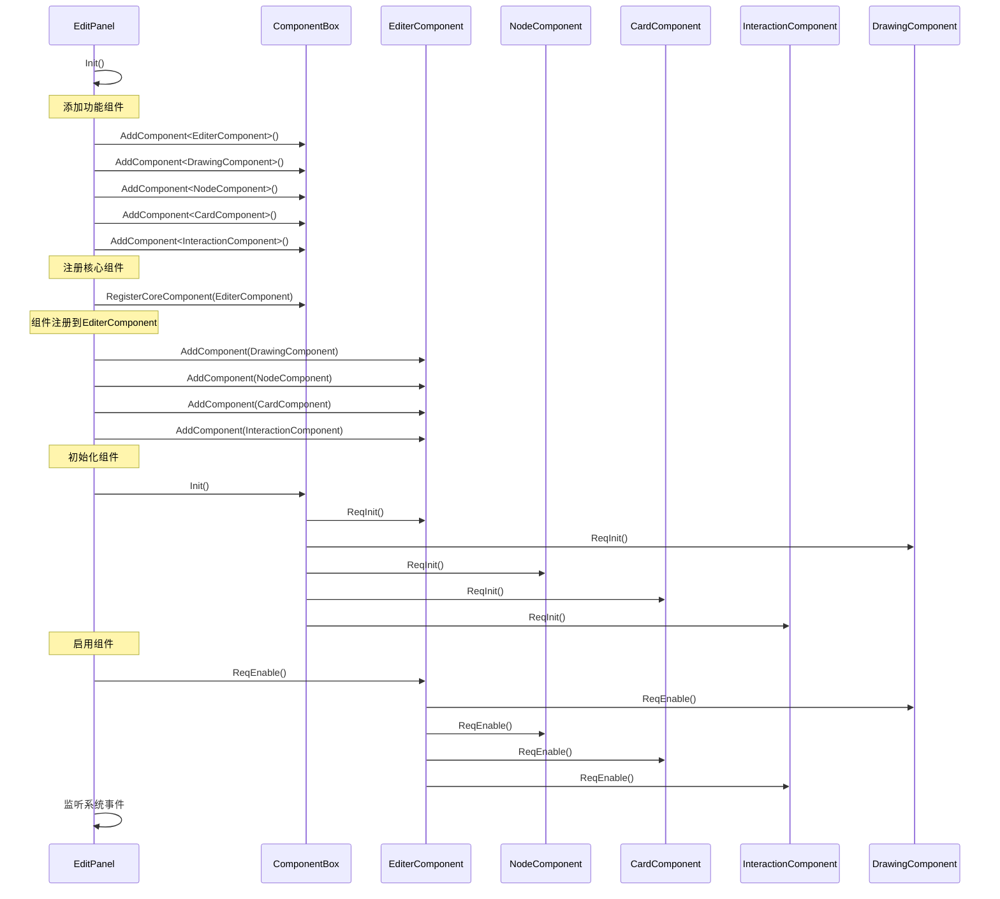
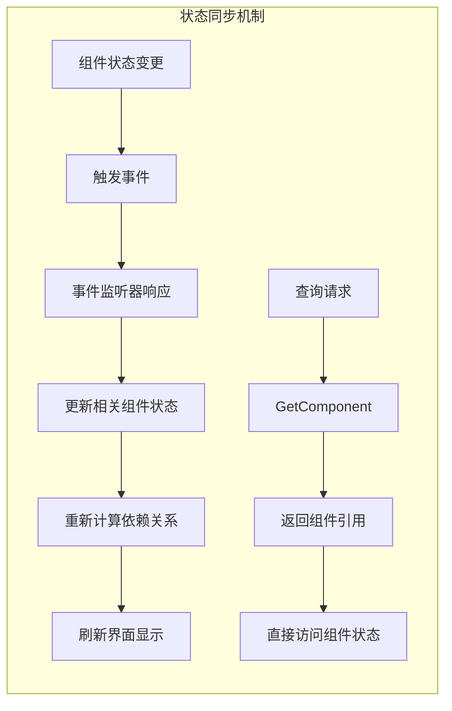
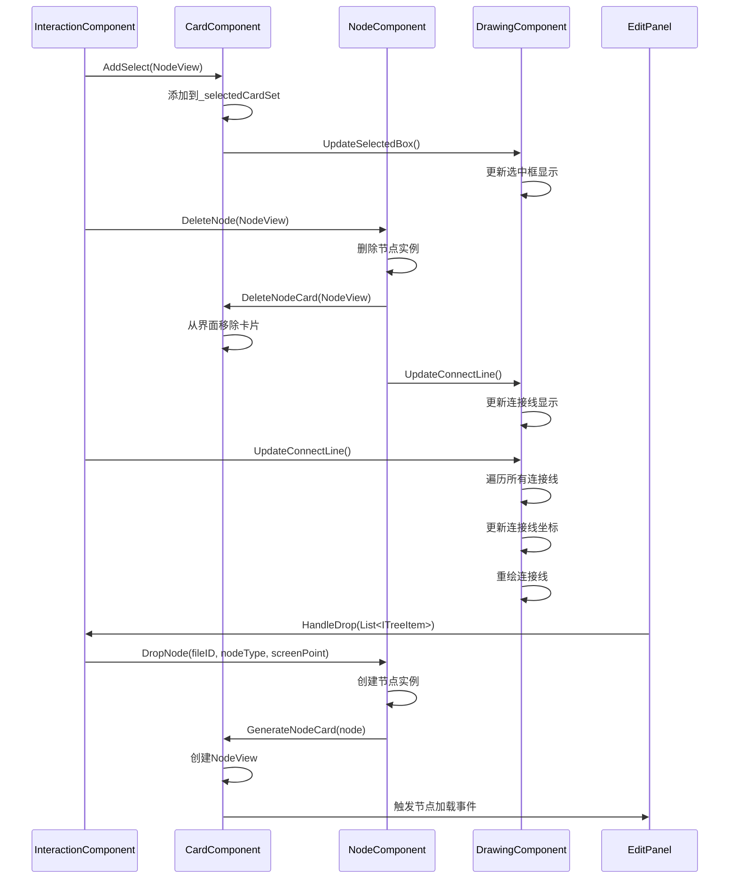

# EditPanel架构与组件管理

<cite>
**本文档引用的文件**
- [EditPanel.xaml.cs](file://XNode/SubSystem/NodeEditSystem/Panel/EditPanel.xaml.cs)
- [TComponentBox.cs](file://XLib.Base/UIComponent/TComponentBox.cs)
- [TComponent.cs](file://XLib.Base/UIComponent/TComponent.cs)
- [DrawingComponent.cs](file://XNode/SubSystem/NodeEditSystem/Panel/Component/DrawingComponent.cs)
- [CardComponent.cs](file://XNode/SubSystem/NodeEditSystem/Panel/Component/CardComponent.cs)
- [InteractionComponent.cs](file://XNode/SubSystem/NodeEditSystem/Panel/Component/InteractionComponent.cs)
- [NodeComponent.cs](file://XNode/SubSystem/NodeEditSystem/Panel/Component/NodeComponent.cs)
- [EditerComponent.cs](file://XNode/SubSystem/NodeEditSystem/Panel/Component/EditerComponent.cs)
</cite>

## 目录
1. [简介](#简介)
2. [项目结构概览](#项目结构概览)
3. [核心架构设计](#核心架构设计)
4. [组件管理系统](#组件管理系统)
5. [四大功能组件详解](#四大功能组件详解)
6. [生命周期管理](#生命周期管理)
7. [组件协作机制](#组件协作机制)
8. [错误处理与诊断](#错误处理与诊断)
9. [性能优化策略](#性能优化策略)
10. [最佳实践与扩展指南](#最佳实践与扩展指南)
11. [总结](#总结)

## 简介

EditPanel作为XNode节点编辑器的核心容器，采用组件化架构设计，通过TComponentBox聚合了NodeComponent、CardComponent、InteractionComponent和DrawingComponent四大核心功能组件。这种设计模式不仅实现了功能模块的解耦，还提供了强大的扩展性和可维护性。

EditPanel的设计理念基于以下核心原则：
- **组件化分离**：每个功能组件独立封装，职责单一
- **生命周期统一管理**：通过组件箱统一控制组件的初始化、启用、重置和禁用
- **上下文共享**：所有组件通过共享的宿主对象和组件箱进行协作
- **事件驱动通信**：组件间通过事件机制进行松耦合通信

## 项目结构概览



**图表来源**
- [EditPanel.xaml.cs](file://XNode/SubSystem/NodeEditSystem/Panel/EditPanel.xaml.cs#L1-L123)
- [TComponentBox.cs](file://XLib.Base/UIComponent/TComponentBox.cs#L1-L155)
- [TComponent.cs](file://XLib.Base/UIComponent/TComponent.cs#L1-L168)

## 核心架构设计

EditPanel采用了分层架构设计，将复杂的编辑器功能分解为多个独立的功能模块。这种设计带来了以下优势：

### 分层架构特点

1. **表现层**：EditPanel作为用户界面容器，负责整体布局和事件分发
2. **组件层**：四大功能组件各自负责特定领域逻辑
3. **基础设施层**：TComponent基类和ComponentBox提供通用功能支持

### 设计模式应用



**图表来源**
- [EditPanel.xaml.cs](file://XNode/SubSystem/NodeEditSystem/Panel/EditPanel.xaml.cs#L10-L123)
- [TComponentBox.cs](file://XLib.Base/UIComponent/TComponentBox.cs#L5-L155)
- [TComponent.cs](file://XLib.Base/UIComponent/TComponent.cs#L3-L168)

**章节来源**
- [EditPanel.xaml.cs](file://XNode/SubSystem/NodeEditSystem/Panel/EditPanel.xaml.cs#L1-L123)
- [TComponentBox.cs](file://XLib.Base/UIComponent/TComponentBox.cs#L1-L155)
- [TComponent.cs](file://XLib.Base/UIComponent/TComponent.cs#L1-L168)

## 组件管理系统

ComponentBox是EditPanel架构的核心管理器，它提供了完整的组件生命周期管理和依赖注入功能。

### 组件注册机制



**图表来源**
- [EditPanel.xaml.cs](file://XNode/SubSystem/NodeEditSystem/Panel/EditPanel.xaml.cs#L25-L35)
- [TComponentBox.cs](file://XLib.Base/UIComponent/TComponentBox.cs#L10-L25)

### 执行顺序控制策略

ComponentBox通过核心组件列表（_coreComponentList）来控制组件的执行顺序，确保依赖关系得到正确处理：

1. **初始化阶段**：按核心组件列表顺序依次调用ReqInit()
2. **启用阶段**：同样按照核心组件列表顺序调用ReqEnable()
3. **重置阶段**：逆序执行ReqReset()，确保清理顺序正确
4. **禁用阶段**：逆序执行ReqDisable()
5. **清理阶段**：逆序执行ReqRemove()

这种设计确保了组件间的依赖关系得到正确处理，避免了因执行顺序不当导致的问题。

**章节来源**
- [EditPanel.xaml.cs](file://XNode/SubSystem/NodeEditSystem/Panel/EditPanel.xaml.cs#L25-L45)
- [TComponentBox.cs](file://XLib.Base/UIComponent/TComponentBox.cs#L40-L120)

## 四大功能组件详解

### NodeComponent - 节点管理组件

NodeComponent负责管理编辑器中的节点实例，包括节点的创建、加载、删除和状态管理。



**图表来源**
- [NodeComponent.cs](file://XNode/SubSystem/NodeEditSystem/Panel/Component/NodeComponent.cs#L10-L125)

### CardComponent - 节点卡片组件

CardComponent负责管理节点的可视化表示，即NodeView实例的创建、更新和销毁。



**图表来源**
- [CardComponent.cs](file://XNode/SubSystem/NodeEditSystem/Panel/Component/CardComponent.cs#L10-L135)

### InteractionComponent - 交互处理组件

InteractionComponent是整个编辑器交互逻辑的核心，处理键盘、鼠标事件以及各种用户操作。



**图表来源**
- [InteractionComponent.cs](file://XNode/SubSystem/NodeEditSystem/Panel/Component/InteractionComponent.cs#L100-L200)

### DrawingComponent - 绘图渲染组件

DrawingComponent负责所有的图形绘制和视觉效果，包括网格、连接线、选框等的渲染。



**图表来源**
- [DrawingComponent.cs](file://XNode/SubSystem/NodeEditSystem/Panel/Component/DrawingComponent.cs#L15-L100)

**章节来源**
- [NodeComponent.cs](file://XNode/SubSystem/NodeEditSystem/Panel/Component/NodeComponent.cs#L1-L125)
- [CardComponent.cs](file://XNode/SubSystem/NodeEditSystem/Panel/Component/CardComponent.cs#L1-L135)
- [InteractionComponent.cs](file://XNode/SubSystem/NodeEditSystem/Panel/Component/InteractionComponent.cs#L1-L757)
- [DrawingComponent.cs](file://XNode/SubSystem/NodeEditSystem/Panel/Component/DrawingComponent.cs#L1-L387)

## 生命周期管理

EditPanel的组件生命周期管理遵循严格的顺序控制，确保系统的稳定性和一致性。

### 初始化流程



**图表来源**
- [EditPanel.xaml.cs](file://XNode/SubSystem/NodeEditSystem/Panel/EditPanel.xaml.cs#L25-L45)

### 状态同步机制

组件间的状态同步通过以下机制实现：

1. **事件驱动**：组件通过事件机制通知其他组件状态变化
2. **查询接口**：组件可以通过GetComponent方法获取其他组件的引用
3. **共享数据**：通过宿主对象和组件箱共享公共数据



**章节来源**
- [EditPanel.xaml.cs](file://XNode/SubSystem/NodeEditSystem/Panel/EditPanel.xaml.cs#L25-L50)
- [TComponent.cs](file://XLib.Base/UIComponent/TComponent.cs#L25-L85)

## 组件协作机制

### 共享上下文对象

所有组件都通过共享的宿主对象（EditPanel）和组件箱进行协作。这种设计确保了组件间的一致性和可访问性。

### 组件间通信模式



**图表来源**
- [InteractionComponent.cs](file://XNode/SubSystem/NodeEditSystem/Panel/Component/InteractionComponent.cs#L150-L200)
- [NodeComponent.cs](file://XNode/SubSystem/NodeEditSystem/Panel/Component/NodeComponent.cs#L30-L50)
- [CardComponent.cs](file://XNode/SubSystem/NodeEditSystem/Panel/Component/CardComponent.cs#L30-L60)

### 上下文共享模式

组件通过以下方式共享上下文信息：

1. **GetComponent方法**：组件可以通过GetComponent<T>()获取其他组件的引用
2. **事件系统**：组件通过事件系统传递状态变化信息
3. **共享数据结构**：组件可以访问EditPanel提供的公共数据

**章节来源**
- [InteractionComponent.cs](file://XNode/SubSystem/NodeEditSystem/Panel/Component/InteractionComponent.cs#L1-L757)
- [CardComponent.cs](file://XNode/SubSystem/NodeEditSystem/Panel/Component/CardComponent.cs#L1-L135)

## 错误处理与诊断

### 常见问题诊断

#### 组件加载失败

当组件初始化失败时，ComponentBox提供了完善的异常处理机制：

```csharp
// 异常处理示例
public void Init()
{
    foreach (var component in _coreComponentList)
    {
        try
        {
            component.ReqInit();
        }
        catch (Exception ex)
        {
            ExceptionHandler?.Invoke($"“{component.Name}”初始化失败：" + ex.Message);
            continue;
        }
    }
}
```

#### 状态不一致问题

状态不一致通常发生在组件重置或禁用过程中，可以通过以下方式进行诊断：

1. **检查组件状态**：验证IsEnabled属性是否正确设置
2. **追踪事件链**：检查事件是否正确传播到所有相关组件
3. **验证依赖关系**：确保被依赖的组件已经正确初始化

### 修复建议

1. **组件初始化失败**：检查组件依赖是否正确配置，确保所有必需的组件都已注册
2. **状态同步问题**：使用GetComponent方法显式获取组件引用，而不是依赖缓存
3. **内存泄漏**：确保在组件禁用时正确清理事件订阅和资源引用

**章节来源**
- [TComponentBox.cs](file://XLib.Base/UIComponent/TComponentBox.cs#L40-L80)

## 性能优化策略

### 组件懒加载

对于大型项目，可以考虑实现组件的懒加载机制，只有在需要时才初始化特定组件。

### 事件优化

- **批量处理**：将多个小的事件合并为一个大的事件处理
- **事件去重**：避免重复触发相同的事件
- **异步处理**：对于耗时的操作使用异步处理

### 内存管理

- **及时清理**：在组件禁用时及时清理不需要的资源
- **弱引用**：对于长期存在的事件订阅使用弱引用
- **对象池**：对于频繁创建的对象使用对象池技术

## 最佳实践与扩展指南

### 扩展新组件

要扩展新的功能组件，需要遵循以下步骤：

1. **继承Component基类**：创建新的组件类并继承Component<THost>
2. **实现生命周期方法**：根据需要重写Init、Enable、Reset、Disable等方法
3. **注册组件**：在EditPanel的Init方法中添加组件注册代码
4. **添加到核心组件**：将新组件添加到EditerComponent中

### 组件设计原则

1. **单一职责**：每个组件应该专注于一个特定的功能领域
2. **最小依赖**：尽量减少组件间的依赖关系
3. **接口隔离**：通过清晰的接口定义组件间的交互
4. **开放封闭**：对扩展开放，对修改封闭

### 代码示例：创建自定义组件

```csharp
public class CustomComponent : Component<EditPanel>
{
    protected override void Init()
    {
        // 初始化自定义功能
    }
    
    protected override void Enable()
    {
        // 启用自定义功能
    }
    
    protected override void Reset()
    {
        // 重置到启用状态
    }
    
    protected override void Disable()
    {
        // 禁用自定义功能
    }
    
    // 自定义方法
    public void CustomMethod()
    {
        // 实现自定义功能
    }
}
```

### 集成到EditPanel

```csharp
public void Init()
{
    // ... 现有组件注册 ...
    
    // 添加自定义组件
    var customComponent = _componentBox.AddComponent<CustomComponent>(this, "自定义组件");
    _componentBox.RegisterCoreComponent(customComponent);
    
    // 注册到主编辑器组件
    _editerComponent.AddComponent(customComponent);
    
    // 初始化组件
    _componentBox.Init();
    _editerComponent.ReqEnable();
}
```

## 总结

EditPanel作为XNode节点编辑器的核心容器，通过精心设计的组件化架构实现了高度的功能模块化和良好的可维护性。其主要优势包括：

### 架构优势

1. **模块化设计**：四大功能组件各司其职，职责清晰明确
2. **生命周期统一管理**：通过ComponentBox统一控制组件状态
3. **松耦合通信**：组件间通过事件和查询接口进行通信
4. **扩展性强**：易于添加新的功能组件和扩展现有功能

### 技术特色

1. **组件化思想**：完全遵循面向对象设计原则
2. **事件驱动架构**：支持灵活的组件间通信
3. **状态管理**：完善的组件状态同步机制
4. **错误处理**：健壮的异常处理和诊断能力

### 应用价值

这种组件化设计不仅适用于节点编辑器场景，也为其他复杂UI应用提供了优秀的架构参考。通过合理的组件拆分和生命周期管理，可以构建出既功能强大又易于维护的软件系统。

EditPanel的架构设计充分体现了现代软件工程的最佳实践，为开发者提供了一个可扩展、可维护、高性能的节点编辑器基础框架。