# InteractionComponent - 用户交互处理

<cite>
**本文档引用的文件**
- [InteractionComponent.cs](file://XNode/SubSystem/NodeEditSystem/Panel/Component/InteractionComponent.cs)
- [NodeComponent.cs](file://XNode/SubSystem/NodeEditSystem/Panel/Component/NodeComponent.cs)
- [CardComponent.cs](file://XNode/SubSystem/NodeEditSystem/Panel/Component/CardComponent.cs)
- [DrawingComponent.cs](file://XNode/SubSystem/NodeEditSystem/Panel/Component/DrawingComponent.cs)
- [SelectTool.cs](file://XLib.WPFControl/Tool/SelectTool.cs)
- [VisualConnectLine.cs](file://XNode/SubSystem/NodeEditSystem/Panel/Layer/VisualConnectLine.cs)
- [BehaviorTree.cs](file://XLib.WPF/Behavior/BehaviorTree.cs)
- [EnumDefine.cs](file://XNode/SubSystem/NodeEditSystem/Define/EnumDefine.cs)
- [TargetBox.cs](file://XNode/SubSystem/NodeEditSystem/Define/TargetBox.cs)
- [ToolBase.cs](file://XLib.WPF/ToolBase.cs)
- [Behaviors.cs](file://XLib.WPF/Behavior/Behaviors.cs)
</cite>

## 目录
1. [简介](#简介)
2. [核心事件处理机制](#核心事件处理机制)
3. [与NodeComponent和CardComponent的协作](#与nodecomponent和cardcomponent的协作)
4. [连接线绘制状态机实现](#连接线绘制状态机实现)
5. [常见问题与优化建议](#常见问题与优化建议)
6. [结论](#结论)

## 简介
InteractionComponent是XNode编辑器中的用户交互中枢，负责处理所有键盘和鼠标事件，并将其转换为具体的编辑操作。该组件通过事件监听、状态管理和组件协作，实现了节点移动、多选框绘制、连接线创建等核心功能。本文档将深入剖析其内部实现机制，重点关注事件处理流程、组件间协作以及状态机设计。

**Section sources**
- [InteractionComponent.cs](file://XNode/SubSystem/NodeEditSystem/Panel/Component/InteractionComponent.cs#L0-L757)

## 核心事件处理机制

### 鼠标事件捕获与分发
InteractionComponent通过订阅`OperateArea`的鼠标事件来捕获用户输入。在`Enable`方法中注册了`MouseMove`、`MouseDown`和`MouseUp`事件处理器，这些事件被转发给`SelectTool`进行处理。

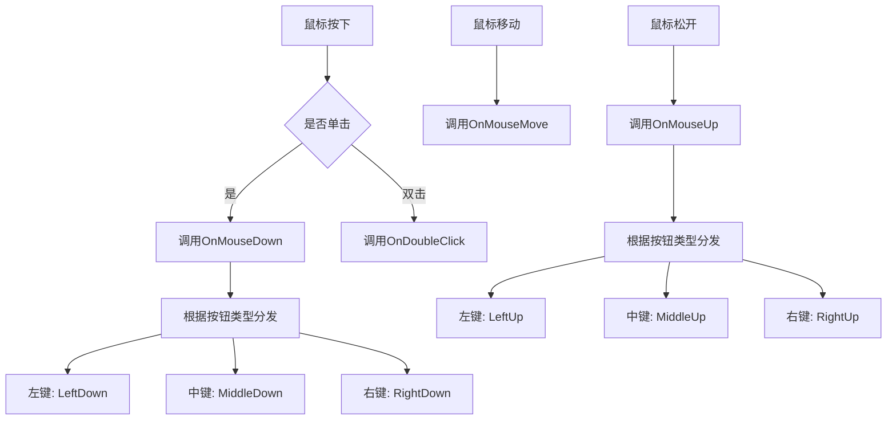

**Diagram sources**
- [InteractionComponent.cs](file://XNode/SubSystem/NodeEditSystem/Panel/Component/InteractionComponent.cs#L45-L51)
- [ToolBase.cs](file://XLib.WPF/ToolBase.cs#L49-L137)

### 事件到操作的转换
InteractionComponent将底层鼠标事件转换为高级编辑操作。例如，当检测到左键按下时，会根据当前鼠标位置和状态决定执行哪种操作：

- **点击节点**：选择或取消选择节点
- **拖拽节点**：移动选中的节点
- **空白区域拖拽**：绘制多选框
- **悬停引脚拖拽**：创建连接线

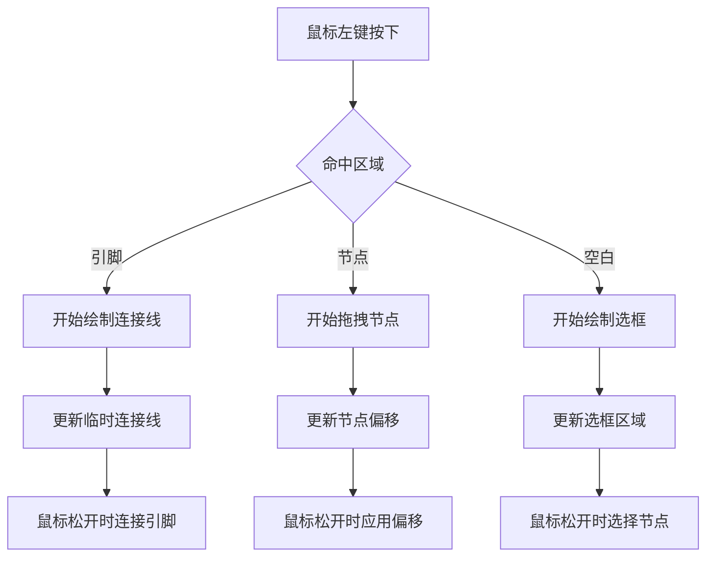

**Diagram sources**
- [InteractionComponent.cs](file://XNode/SubSystem/NodeEditSystem/Panel/Component/InteractionComponent.cs#L200-L400)

### 滚轮事件处理
滚轮事件用于视口缩放和导航。InteractionComponent通过`ToolBase`基类的`OnMouseWheel`方法处理滚轮事件，将滚轮增量传递给行为处理器。

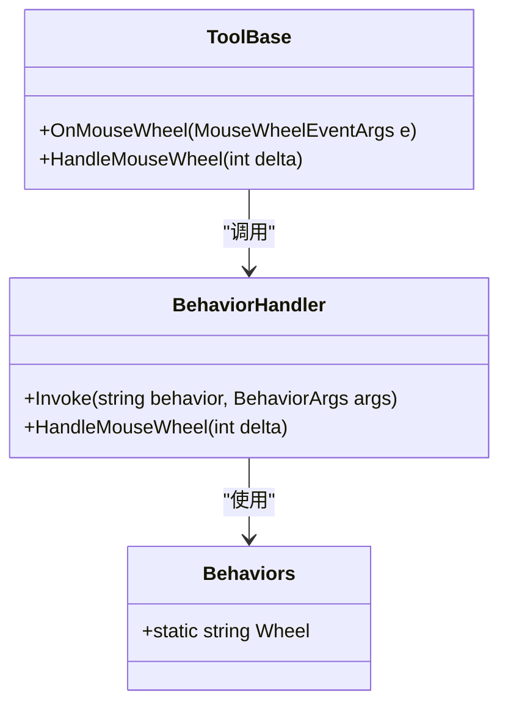

**Diagram sources**
- [ToolBase.cs](file://XLib.WPF/ToolBase.cs#L96-L137)
- [Behaviors.cs](file://XLib.WPF/Behavior/Behaviors.cs#L0-L40)

## 与NodeComponent和CardComponent的协作

### 组件依赖关系
InteractionComponent与其他核心组件通过`GetComponent<T>()`方法建立依赖关系，形成一个协作网络：

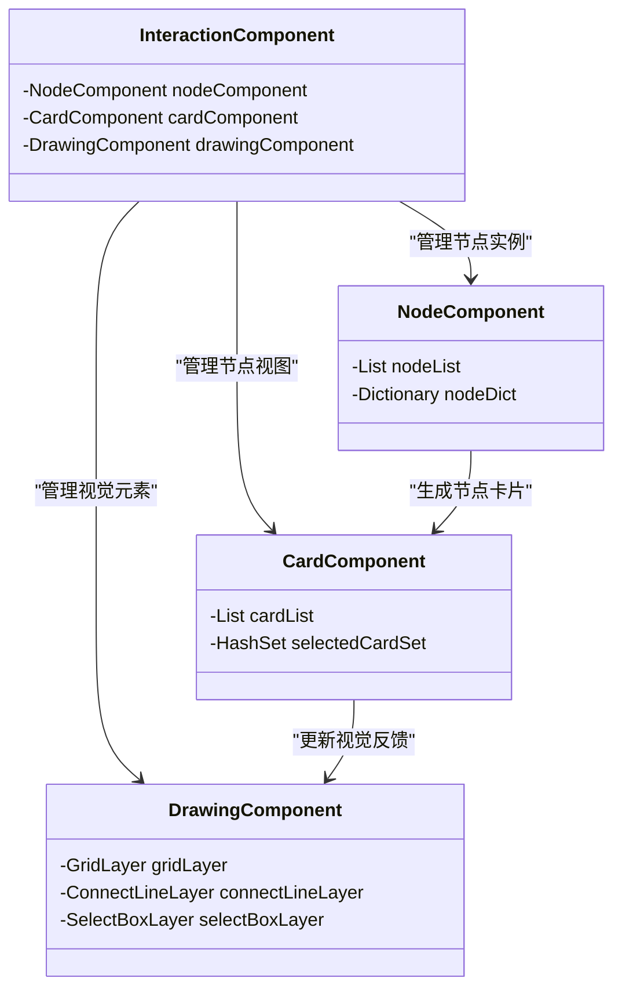

**Diagram sources**
- [InteractionComponent.cs](file://XNode/SubSystem/NodeEditSystem/Panel/Component/InteractionComponent.cs#L0-L757)
- [NodeComponent.cs](file://XNode/SubSystem/NodeEditSystem/Panel/Component/NodeComponent.cs#L0-L125)
- [CardComponent.cs](file://XNode/SubSystem/NodeEditSystem/Panel/Component/CardComponent.cs#L0-L135)

### 拖拽节点时的数据传递
当用户拖拽节点时，InteractionComponent负责协调数据传递和视觉反馈：

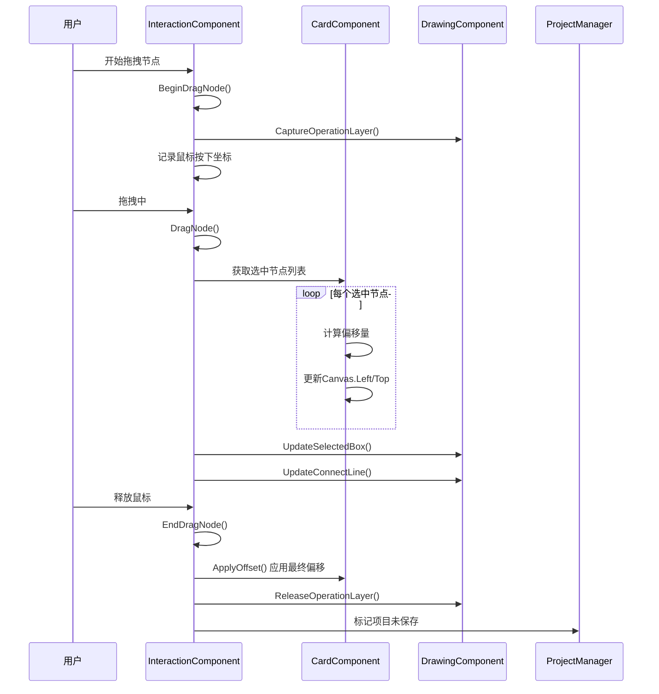

**Diagram sources**
- [InteractionComponent.cs](file://XNode/SubSystem/NodeEditSystem/Panel/Component/InteractionComponent.cs#L300-L350)
- [CardComponent.cs](file://XNode/SubSystem/NodeEditSystem/Panel/Component/CardComponent.cs#L0-L135)

### 视觉反馈流程
InteractionComponent通过`DrawingComponent`提供实时视觉反馈，包括悬停框、选中框和临时连接线：

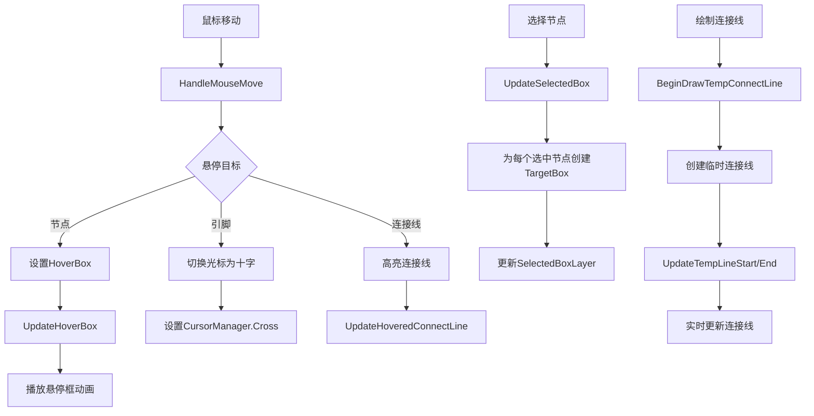

**Diagram sources**
- [InteractionComponent.cs](file://XNode/SubSystem/NodeEditSystem/Panel/Component/InteractionComponent.cs#L150-L200)
- [DrawingComponent.cs](file://XNode/SubSystem/NodeEditSystem/Panel/Component/DrawingComponent.cs#L0-L199)
- [TargetBox.cs](file://XNode/SubSystem/NodeEditSystem/Define/TargetBox.cs#L0-L64)

## 连接线绘制状态机实现

### 状态机设计
连接线绘制过程通过一系列状态方法实现，形成一个隐式的状态机：

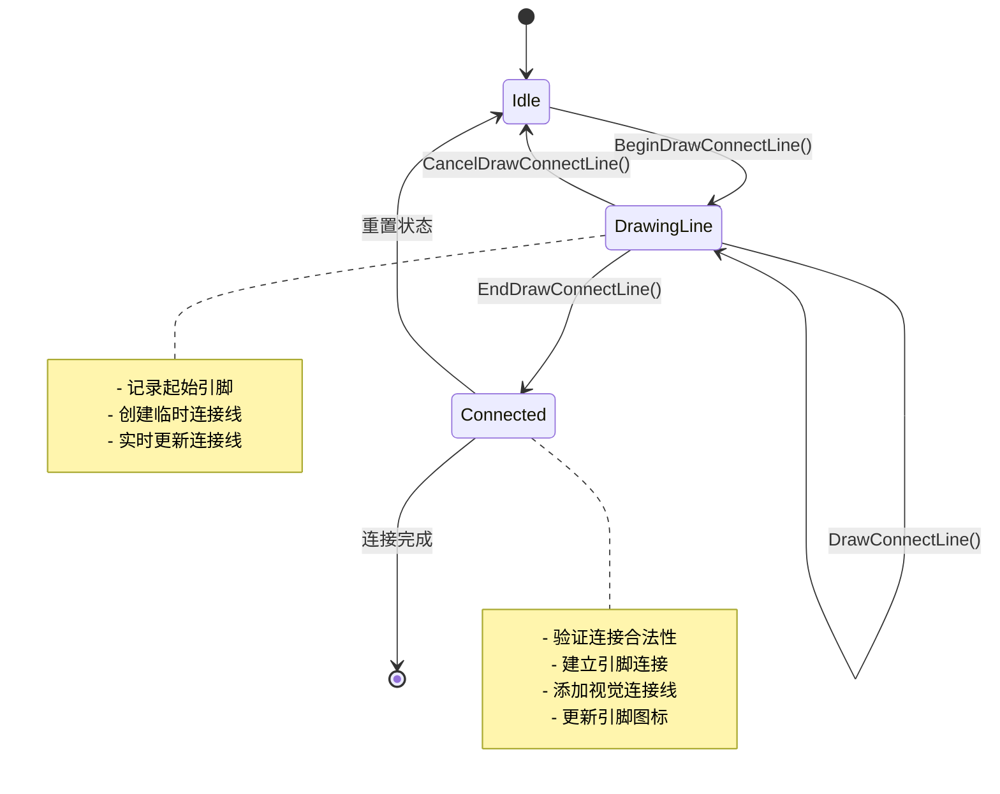

**Diagram sources**
- [InteractionComponent.cs](file://XNode/SubSystem/NodeEditSystem/Panel/Component/InteractionComponent.cs#L350-L400)
- [VisualConnectLine.cs](file://XNode/SubSystem/NodeEditSystem/Panel/Layer/VisualConnectLine.cs#L0-L69)

### 连接线绘制流程
详细的状态转换和数据处理流程：

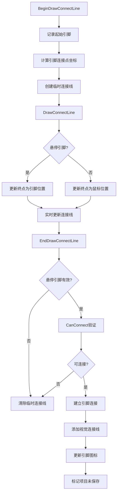

**Diagram sources**
- [InteractionComponent.cs](file://XNode/SubSystem/NodeEditSystem/Panel/Component/InteractionComponent.cs#L350-L400)
- [VisualConnectLine.cs](file://XNode/SubSystem/NodeEditSystem/Panel/Layer/VisualConnectLine.cs#L0-L69)

### 连接合法性验证
在建立连接前，系统会进行多项验证确保连接的合法性：

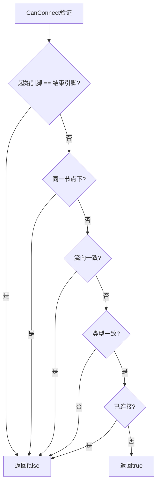

**Section sources**
- [InteractionComponent.cs](file://XNode/SubSystem/NodeEditSystem/Panel/Component/InteractionComponent.cs#L600-L620)

## 常见问题与优化建议

### 事件冲突解决方案
在复杂的交互场景中，可能会出现事件冲突，以下是推荐的解决方案：

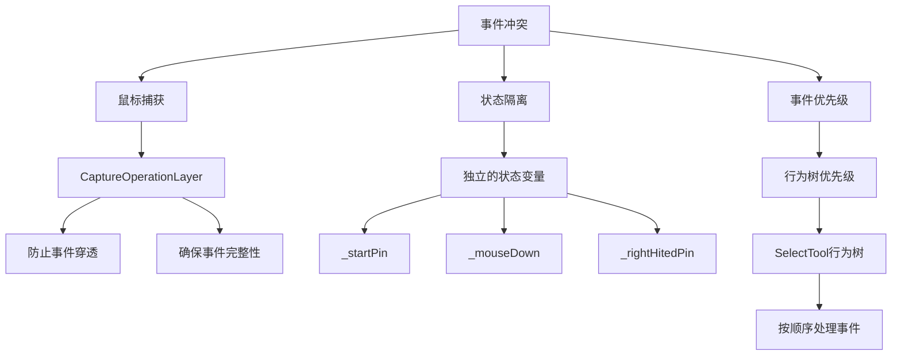

**Section sources**
- [InteractionComponent.cs](file://XNode/SubSystem/NodeEditSystem/Panel/Component/InteractionComponent.cs#L150-L200)
- [SelectTool.cs](file://XLib.WPFControl/Tool/SelectTool.cs#L0-L67)

### 响应延迟优化
针对可能的响应延迟问题，建议以下优化措施：

| 优化策略 | 实现方式 | 预期效果 |
|---------|---------|---------|
| **事件节流** | 限制高频事件处理频率 | 减少CPU占用 |
| **异步处理** | 将耗时操作移至后台线程 | 提升UI响应性 |
| **批量更新** | 合并多个视觉更新 | 减少重绘次数 |
| **对象池** | 复用临时对象 | 降低GC压力 |
| **延迟加载** | 按需加载复杂内容 | 加快初始响应 |

**Section sources**
- [InteractionComponent.cs](file://XNode/SubSystem/NodeEditSystem/Panel/Component/InteractionComponent.cs#L0-L757)
- [DrawingComponent.cs](file://XNode/SubSystem/NodeEditSystem/Panel/Component/DrawingComponent.cs#L0-L199)

### 性能监控建议
建立性能监控机制，及时发现和解决性能瓶颈：

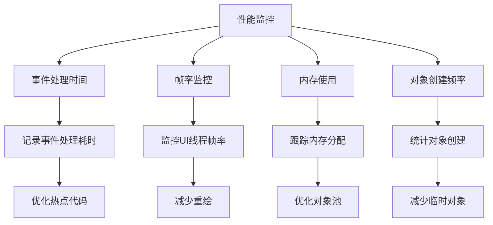

**Section sources**
- [InteractionComponent.cs](file://XNode/SubSystem/NodeEditSystem/Panel/Component/InteractionComponent.cs#L0-L757)

## 结论
InteractionComponent作为XNode编辑器的用户交互中枢，通过精心设计的事件处理机制、组件协作模式和状态管理，实现了流畅的用户体验。其核心价值体现在：

1. **统一的事件处理**：将底层鼠标键盘事件转换为高级编辑操作
2. **清晰的组件协作**：通过依赖注入实现组件间的松耦合协作
3. **实时的视觉反馈**：提供即时的视觉响应增强用户体验
4. **健壮的状态管理**：通过状态机模式确保操作的完整性和一致性

通过理解其内部实现机制，开发者可以更好地扩展和优化交互功能，同时为解决常见问题提供理论基础和实践指导。