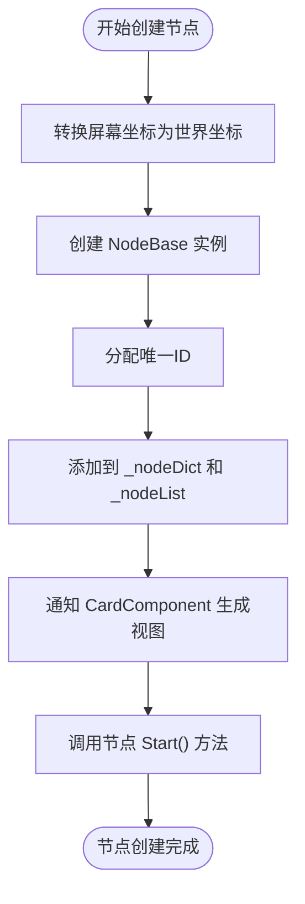
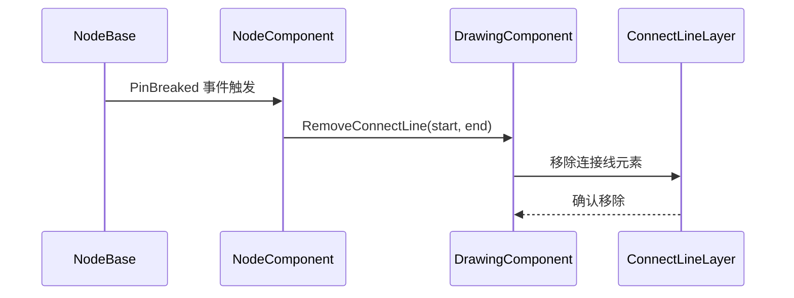
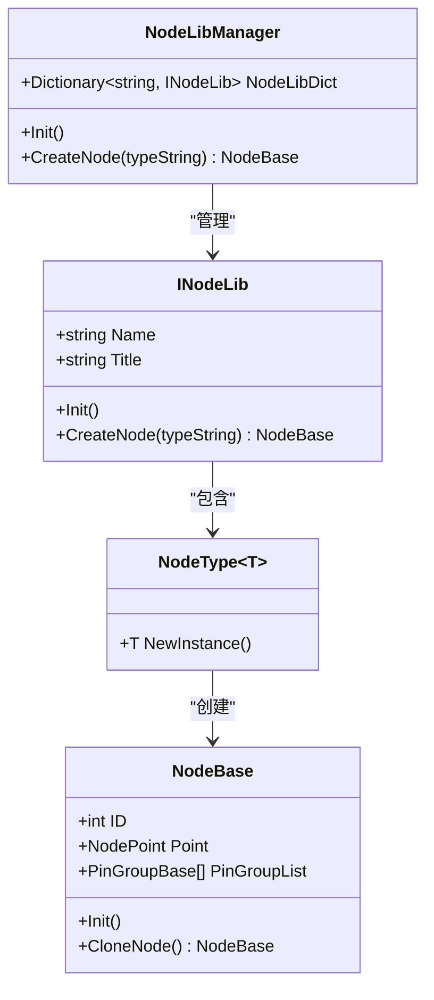

# NodeComponent - 节点数据管理

<cite>
**本文档引用文件**  
- [NodeComponent.cs](file://XNode/SubSystem/NodeEditSystem/Panel/Component/NodeComponent.cs)
- [NodeBase.cs](file://XLib.Node/NodeBase.cs)
- [CardComponent.cs](file://XNode/SubSystem/NodeEditSystem/Panel/Component/CardComponent.cs)
- [DrawingComponent.cs](file://XNode/SubSystem/NodeEditSystem/Panel/Component/DrawingComponent.cs)
- [ArchiveManager.cs](file://XNode/SubSystem/ArchiveSystem/ArchiveManager.cs)
- [NodeBaseData.cs](file://XNode/SubSystem/ArchiveSystem/Define/Data_1_0/NodeBaseData.cs)
- [NodeData.cs](file://XNode/SubSystem/ArchiveSystem/Define/Data_1_0/NodeData.cs)
- [NodeLibManager.cs](file://XNode/SubSystem/NodeLibSystem/NodeLibManager.cs)
- [ProjectManager.cs](file://XNode/SubSystem/ProjectSystem/ProjectManager.cs)
</cite>

## 目录
1. [引言](#引言)
2. [核心职责与数据结构](#核心职责与数据结构)
3. [节点生命周期管理](#节点生命周期管理)
4. [与CardComponent的数据同步机制](#与cardcomponent的数据同步机制)
5. [自定义节点注入与类型注册](#自定义节点注入与类型注册)
6. [与ArchiveSystem的数据交互逻辑](#与archivesystem的数据交互逻辑)
7. [性能优化与最佳实践](#性能优化与最佳实践)
8. [结论](#结论)

## 引言
NodeComponent 是 XNode 编辑器中的核心组件之一，作为节点数据模型的管理中心，负责维护所有节点实例的生命周期、状态同步与基础操作。它不仅提供节点的创建、删除、查找等基础接口，还与视图层（CardComponent）和持久化系统（ArchiveSystem）紧密协作，确保数据一致性与用户体验流畅性。本文将深入剖析其内部机制，涵盖从节点管理到大规模场景下的性能优化策略。

## 核心职责与数据结构

NodeComponent 的核心职责是作为节点数据模型的中央管理器，统一维护所有 `NodeBase` 实例的集合，并对外提供标准化的操作接口。其内部通过三种关键数据结构实现高效管理：

- **`_nodeList`**：`List<NodeBase>` 类型，存储所有节点实例的有序列表，支持遍历与索引访问。
- **`_nodeDict`**：`Dictionary<int, NodeBase>` 类型，以节点唯一ID为键的哈希表，实现 O(1) 时间复杂度的节点查找。
- **`_nodeIDBox`**：`IDBox` 类型，负责节点ID的分配与回收，确保ID的唯一性与可复用性。

这种组合结构兼顾了遍历效率与查询性能，是实现高效节点管理的基础。

**Section sources**
- [NodeComponent.cs](file://XNode/SubSystem/NodeEditSystem/Panel/Component/NodeComponent.cs#L11-L123)

## 节点生命周期管理

NodeComponent 提供了完整的节点生命周期控制接口，包括创建、加载、删除等核心操作。

### 节点创建（DropNode）
当用户从节点库拖拽节点到编辑区时，调用 `DropNode` 方法：
1. 将屏幕坐标转换为世界坐标。
2. 通过 `NodeType.NewInstance()` 创建 `NodeBase` 实例。
3. 分配唯一ID并设置初始坐标。
4. 将节点实例注册到 `_nodeDict` 和 `_nodeList` 中。
5. 通知 `CardComponent` 生成对应的视图控件（NodeView）。
6. 调用节点的 `Start()` 方法启动其逻辑。

### 节点加载（LoadNode）
在项目加载过程中，调用 `LoadNode` 方法将已序列化的节点实例注入系统：
1. 将节点的 `PinBreaked` 事件与 `NodeComponent` 的事件处理器绑定。
2. 将节点ID注册到 `IDBox`，防止ID冲突。
3. 将节点添加到 `_nodeDict` 和 `_nodeList`。
4. 通知 `CardComponent` 生成视图并更新布局。
5. 注册交互监听。

### 节点删除（DeleteNode）
删除节点时，`DeleteNode` 方法执行清理流程：
1. 调用节点的 `Clear()` 和 `BreakAllPin()` 方法，释放其内部资源并断开所有连接。
2. 解除事件订阅。
3. 回收节点ID。
4. 从 `_nodeDict` 和 `_nodeList` 中移除节点引用。



**Diagram sources**
- [NodeComponent.cs](file://XNode/SubSystem/NodeEditSystem/Panel/Component/NodeComponent.cs#L35-L65)

**Section sources**
- [NodeComponent.cs](file://XNode/SubSystem/NodeEditSystem/Panel/Component/NodeComponent.cs#L35-L85)

## 与CardComponent的数据同步机制

NodeComponent 与 CardComponent 之间通过事件驱动的方式实现数据同步，确保模型层（NodeBase）与视图层（NodeView）的一致性。

### 节点属性变更通知
当 `NodeBase` 实例的属性（如标题、状态、引脚组等）发生变化时，会触发相应的事件（如 `TitleChanged`, `StateChanged`, `PropertyChanged`）。`NodeView` 在初始化时会订阅这些事件，并在事件触发时自动更新UI。

### 选中状态更新
`CardComponent` 维护一个 `_selectedCardSet`（`HashSet<NodeView>`）来管理选中状态。当用户选择节点时：
1. `InteractionComponent` 捕获点击事件。
2. 调用 `CardComponent.AddSelect()` 将 `NodeView` 添加到选中集合。
3. `CardComponent` 触发UI更新，高亮显示选中节点。
4. `DrawingComponent` 调用 `UpdateSelectedBox()` 在选中节点周围绘制选中框。

### 连接线同步
当节点的引脚连接状态发生变化时，会触发 `PinBreaked` 事件。`NodeComponent` 作为事件监听者，调用 `DrawingComponent.RemoveConnectLine()` 来移除对应的连接线视图。反之，当需要生成连接线时，`NodeComponent.GenerateConnectLine()` 会遍历所有节点的输出引脚，并调用 `DrawingComponent.AddConnectLine()` 创建连接线。



**Diagram sources**
- [NodeComponent.cs](file://XNode/SubSystem/NodeEditSystem/Panel/Component/NodeComponent.cs#L105-L110)
- [DrawingComponent.cs](file://XNode/SubSystem/NodeEditSystem/Panel/Component/DrawingComponent.cs#L300-L310)

**Section sources**
- [NodeComponent.cs](file://XNode/SubSystem/NodeEditSystem/Panel/Component/NodeComponent.cs#L105-L110)
- [CardComponent.cs](file://XNode/SubSystem/NodeEditSystem/Panel/Component/CardComponent.cs#L75-L100)

## 自定义节点注入与类型注册

系统支持通过外部DLL注入自定义节点类型，其核心机制由 `NodeLibManager` 实现。

### 类型注册流程
1. **内置节点注册**：`NodeLibManager.BuildInnerNodeLib()` 方法在初始化时，通过 `new NodeType<T>()` 创建泛型节点类型，并将其作为文件实例存储在虚拟磁盘 `Harddisk` 中。
2. **外部节点加载**：`NodeLibManager.LoadOutsideNodeLib()` 方法扫描指定目录下的DLL文件，通过反射加载所有实现 `INodeLib` 接口的类型。
3. **单例初始化**：获取每个 `INodeLib` 实现的 `Instance` 属性，调用其 `Init()` 方法进行初始化，并将其加入 `NodeLibDict` 字典。
4. **文件系统映射**：将外部节点库的文件夹结构映射到编辑器的节点库面板中。

### 节点创建
当用户选择一个节点类型时，`NodeLibManager.CreateNode()` 方法根据 `typeString` 或 `(libName, typeString)` 查找对应的 `NodeType`，并调用其 `NewInstance()` 工厂方法创建 `NodeBase` 实例。



**Diagram sources**
- [NodeLibManager.cs](file://XNode/SubSystem/NodeLibSystem/NodeLibManager.cs#L45-L221)
- [NodeBase.cs](file://XLib.Node/NodeBase.cs#L1-L417)

**Section sources**
- [NodeLibManager.cs](file://XNode/SubSystem/NodeLibSystem/NodeLibManager.cs#L45-L221)

## 与ArchiveSystem的数据交互逻辑

NodeComponent 在项目加载和保存过程中，与 `ArchiveSystem` 进行数据交换，实现节点状态的持久化。

### 项目保存流程
1. 用户触发保存操作，`ProjectManager.SaveProject()` 被调用。
2. `ProjectManager` 调用 `ArchiveManager.GenerateArchive()`。
3. `ArchiveManager` 调用 `Extracter.Extract()` 收集当前编辑器状态，包括所有节点数据。
4. 节点数据被序列化为 `NodeData` 对象，包含 `BaseData`（`NodeBaseData`）、`ParaDict` 和 `PropertyDict`。
5. 整个存档数据被序列化为JSON并写入文件。

### 项目加载流程
1. 用户打开项目，`ProjectManager.OpenProject()` 调用 `ArchiveManager.ReadArchiveFile()` 读取JSON文件。
2. `ArchiveManager.LoadArchive()` 根据存档版本（如 "1.0"）调用对应的 `Loader_1_0.Import()`。
3. `Loader_1_0` 解析 `NodeData` 列表，为每个 `NodeData` 创建对应的 `NodeBase` 实例。
4. 调用 `NodeComponent.LoadNode()` 将创建的节点实例注入系统，完成视图生成和事件绑定。

```mermaid
flowchart LR
A[用户保存项目] --> B[ProjectManager.SaveProject]
B --> C[ArchiveManager.GenerateArchive]
C --> D[Extracter.Extract()]
D --> E[序列化为 NodeData]
E --> F[写入JSON文件]
G[用户打开项目] --> H[ProjectManager.OpenProject]
H --> I[ArchiveManager.ReadArchiveFile]
I --> J[ArchiveManager.LoadArchive]
J --> K[Loader_1_0.Import]
K --> L[创建 NodeBase 实例]
L --> M[NodeComponent.LoadNode]
M --> N[生成视图并绑定事件]
```

**Diagram sources**
- [ProjectManager.cs](file://XNode/SubSystem/ProjectSystem/ProjectManager.cs#L100-L200)
- [ArchiveManager.cs](file://XNode/SubSystem/ArchiveSystem/ArchiveManager.cs#L45-L100)
- [NodeData.cs](file://XNode/SubSystem/ArchiveSystem/Define/Data_1_0/NodeData.cs#L1-L16)

**Section sources**
- [ProjectManager.cs](file://XNode/SubSystem/ProjectSystem/ProjectManager.cs#L100-L200)
- [ArchiveManager.cs](file://XNode/SubSystem/ArchiveSystem/ArchiveManager.cs#L45-L100)

## 性能优化与最佳实践

针对大规模节点场景，可从内存占用和查询性能两方面进行优化。

### 内存占用优化
1. **对象池（Object Pooling）**：对频繁创建/销毁的 `NodeView` 和 `VisualConnectLine` 实现对象池，避免GC压力。
2. **懒加载（Lazy Loading）**：对于复杂节点或大量连接线，采用视口裁剪（View Frustum Culling），只渲染可见区域的节点。
3. **数据结构优化**：对于超大规模节点（>10,000），可考虑将 `_nodeList` 替换为更高效的集合类型，或引入空间分区数据结构（如四叉树）来加速空间查询。

### 查询性能优化
1. **索引优化**：`_nodeDict` 已提供 O(1) 查询，应优先使用ID查找而非遍历 `_nodeList`。
2. **事件节流（Throttling）**：对于高频触发的事件（如鼠标移动），应进行节流处理，避免过度更新UI。
3. **批量操作**：在执行批量删除或移动时，应先暂停事件通知，完成操作后再统一触发更新，减少UI重绘次数。

### 最佳实践
- **避免循环引用**：确保节点间的连接关系清晰，避免复杂的循环依赖。
- **及时释放资源**：在 `DeleteNode` 时，务必调用 `Clear()` 和解绑事件，防止内存泄漏。
- **使用ID而非引用**：在跨组件通信时，传递节点ID而非直接引用，降低耦合度。

## 结论
NodeComponent 作为 XNode 编辑器的节点数据中枢，通过精心设计的数据结构和事件机制，高效地管理着节点的全生命周期。它与 CardComponent 的松耦合同步、与 ArchiveSystem 的无缝持久化，以及对自定义节点的灵活支持，共同构建了一个稳定、可扩展的节点编辑系统。通过实施上述性能优化策略，该系统能够从容应对大规模节点场景的挑战，为用户提供流畅的编辑体验。