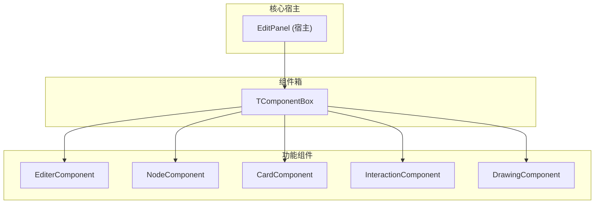
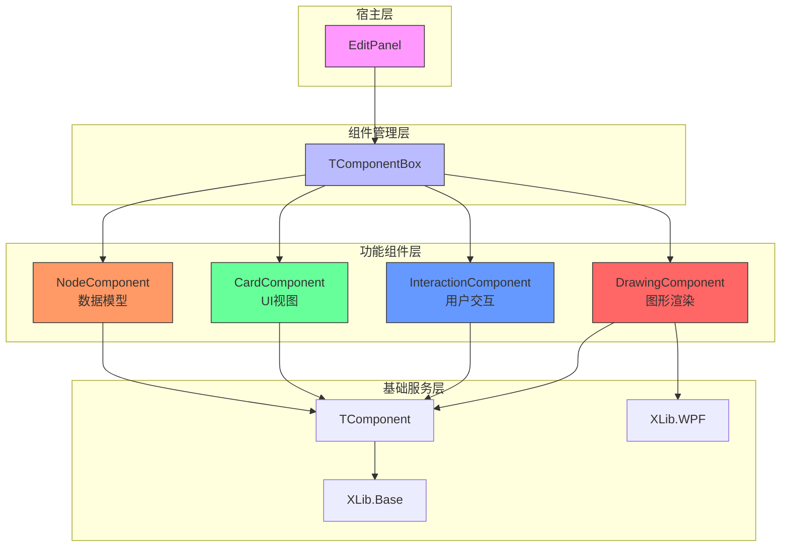
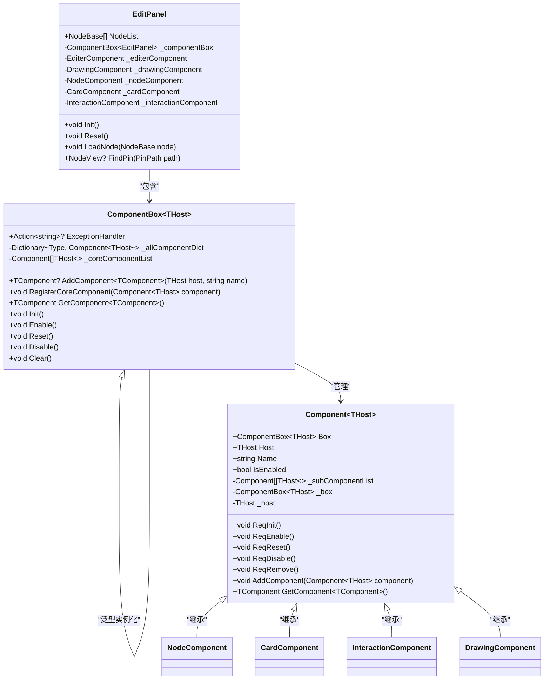
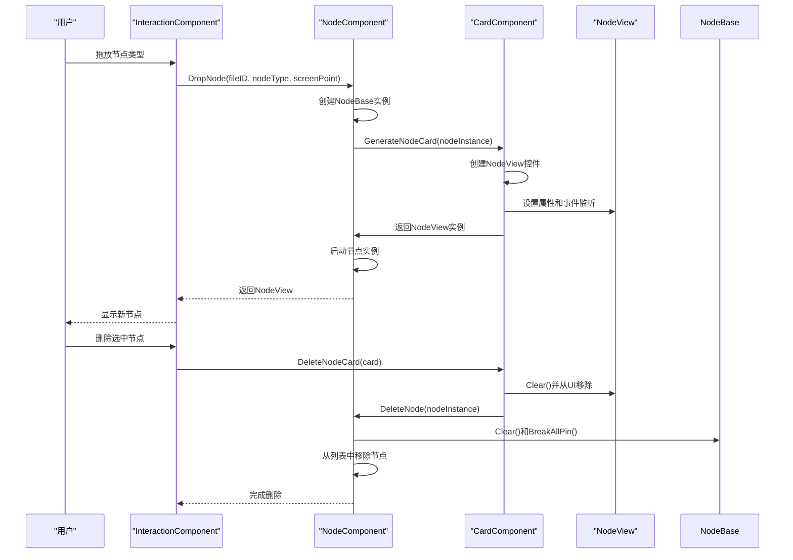
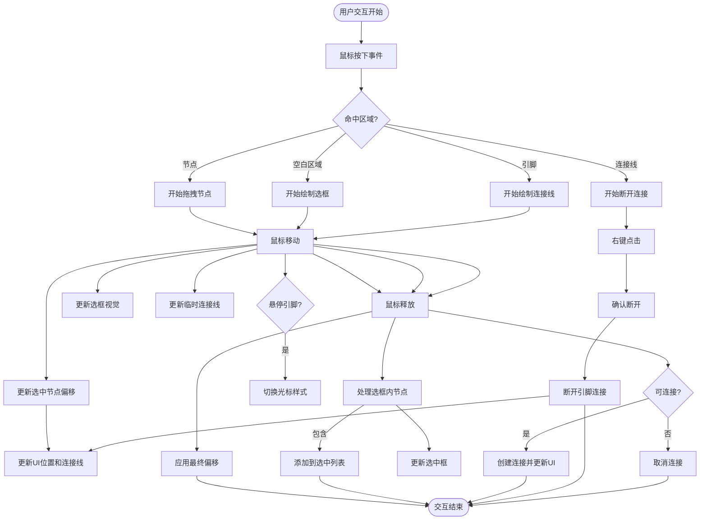
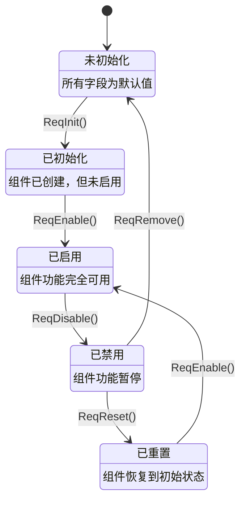
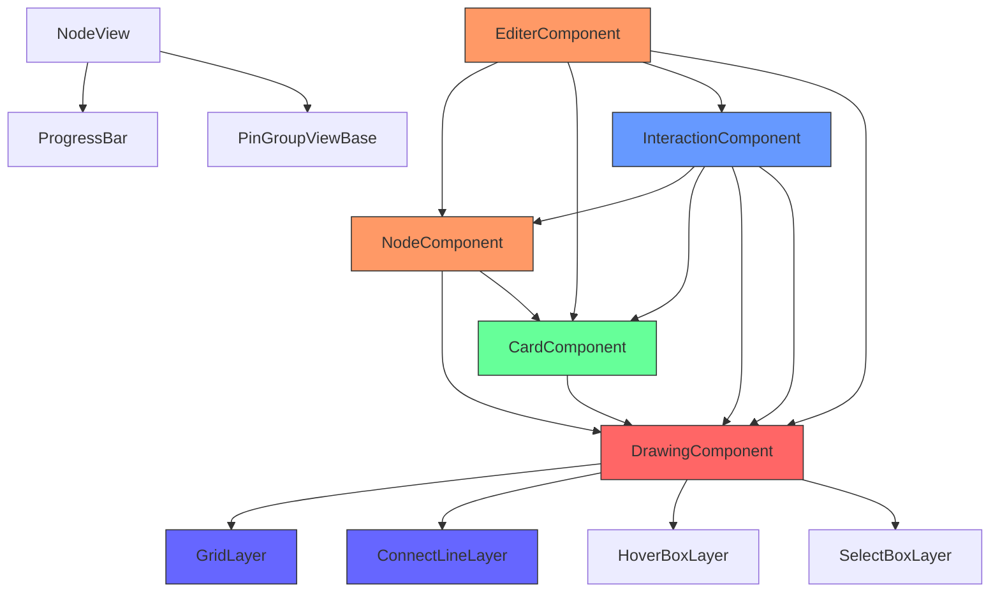

# 节点编辑系统

<cite>
**本文档引用文件**  
- [EditPanel.xaml.cs](file://XNode/SubSystem/NodeEditSystem/Panel/EditPanel.xaml.cs)
- [NodeComponent.cs](file://XNode/SubSystem/NodeEditSystem/Panel/Component/NodeComponent.cs)
- [CardComponent.cs](file://XNode/SubSystem/NodeEditSystem/Panel/Component/CardComponent.cs)
- [InteractionComponent.cs](file://XNode/SubSystem/NodeEditSystem/Panel/Component/InteractionComponent.cs)
- [DrawingComponent.cs](file://XNode/SubSystem/NodeEditSystem/Panel/Component/DrawingComponent.cs)
- [TComponentBox.cs](file://XLib.Base/UIComponent/TComponentBox.cs)
- [TComponent.cs](file://XLib.Base/UIComponent/TComponent.cs)
- [NodeView.xaml.cs](file://XNode/SubSystem/NodeEditSystem/Control/NodeView.xaml.cs)
- [NodeBase.cs](file://XLib.Node/NodeBase.cs)
- [GridLayer.cs](file://XNode/SubSystem/NodeEditSystem/Panel/Layer/GridLayer.cs)
- [ConnectLineLayer.cs](file://XNode/SubSystem/NodeEditSystem/Panel/Layer/ConnectLineLayer.cs)
</cite>

## 目录
1. [简介](#简介)
2. [项目结构](#项目结构)
3. [核心组件](#核心组件)
4. [架构概述](#架构概述)
5. [详细组件分析](#详细组件分析)
6. [依赖分析](#依赖分析)
7. [性能考虑](#性能考虑)
8. [故障排除指南](#故障排除指南)
9. [结论](#结论)

## 简介
本文档全面解析节点编辑系统的组件化架构。以EditPanel为核心，说明其如何通过TComponentBox管理NodeComponent（数据模型）、CardComponent（UI视图）、InteractionComponent（用户交互）和DrawingComponent（图形渲染）四大核心组件。详细描述NodeComponent与CardComponent之间的数据-视图同步机制，包括节点创建、删除、选中状态更新的实现流程。结合InteractionComponent分析鼠标拖拽、节点连接、多选框等交互逻辑的处理过程。通过实际代码示例展示组件间通信方式（如事件订阅、直接调用）。阐明组件生命周期管理（Init/Enable/Reset/Disable）在编辑器状态切换中的作用。针对复杂场景如大规模节点渲染性能问题，提供优化建议和调试方法。

## 项目结构
节点编辑系统采用分层组件化架构，核心功能集中在XNode项目下的SubSystem/NodeEditSystem模块中。系统通过EditPanel作为宿主容器，利用TComponentBox统一管理多个功能组件，实现关注点分离和模块化设计。

**图示来源**  
- [EditPanel.xaml.cs](file://XNode/SubSystem/NodeEditSystem/Panel/EditPanel.xaml.cs#L11-L121)
- [TComponentBox.cs](file://XLib.Base/UIComponent/TComponentBox.cs#L0-L154)

**本节来源**  
- [EditPanel.xaml.cs](file://XNode/SubSystem/NodeEditSystem/Panel/EditPanel.xaml.cs#L11-L121)
- [TComponentBox.cs](file://XLib.Base/UIComponent/TComponentBox.cs#L0-L154)

## 核心组件
系统通过四个核心组件协同工作：NodeComponent负责节点数据模型管理，CardComponent处理UI视图生成与同步，InteractionComponent管理用户交互逻辑，DrawingComponent负责图形渲染与图层管理。这些组件通过TComponentBox统一注册、初始化和生命周期管理，形成松耦合但高度协作的系统架构。

**本节来源**  
- [EditPanel.xaml.cs](file://XNode/SubSystem/NodeEditSystem/Panel/EditPanel.xaml.cs#L11-L121)
- [NodeComponent.cs](file://XNode/SubSystem/NodeEditSystem/Panel/Component/NodeComponent.cs#L11-L123)
- [CardComponent.cs](file://XNode/SubSystem/NodeEditSystem/Panel/Component/CardComponent.cs#L12-L133)
- [InteractionComponent.cs](file://XNode/SubSystem/NodeEditSystem/Panel/Component/InteractionComponent.cs#L18-L755)
- [DrawingComponent.cs](file://XNode/SubSystem/NodeEditSystem/Panel/Component/DrawingComponent.cs#L15-L385)

## 架构概述
节点编辑系统采用基于组件箱（ComponentBox）的模块化架构，通过EditPanel作为宿主容器协调各功能组件的工作。系统架构分为数据层、视图层、交互层和渲染层，各层通过明确定义的接口和事件机制进行通信。

**图示来源**  
- [EditPanel.xaml.cs](file://XNode/SubSystem/NodeEditSystem/Panel/EditPanel.xaml.cs#L11-L121)
- [TComponentBox.cs](file://XLib.Base/UIComponent/TComponentBox.cs#L0-L154)
- [TComponent.cs](file://XLib.Base/UIComponent/TComponent.cs#L0-L167)

**本节来源**  
- [EditPanel.xaml.cs](file://XNode/SubSystem/NodeEditSystem/Panel/EditPanel.xaml.cs#L11-L121)
- [TComponentBox.cs](file://XLib.Base/UIComponent/TComponentBox.cs#L0-L154)
- [TComponent.cs](file://XLib.Base/UIComponent/TComponent.cs#L0-L167)

## 详细组件分析
本节深入分析节点编辑系统的核心组件及其相互关系，重点阐述组件化架构的设计原理和实现细节。

### EditPanel与TComponentBox协同机制
EditPanel作为系统宿主，通过TComponentBox实现组件的集中管理和生命周期控制。TComponentBox不仅负责组件的注册和初始化，还提供了组件间通信的基础架构。

**图示来源**  
- [EditPanel.xaml.cs](file://XNode/SubSystem/NodeEditSystem/Panel/EditPanel.xaml.cs#L11-L121)
- [TComponentBox.cs](file://XLib.Base/UIComponent/TComponentBox.cs#L0-L154)
- [TComponent.cs](file://XLib.Base/UIComponent/TComponent.cs#L0-L167)

**本节来源**  
- [EditPanel.xaml.cs](file://XNode/SubSystem/NodeEditSystem/Panel/EditPanel.xaml.cs#L11-L121)
- [TComponentBox.cs](file://XLib.Base/UIComponent/TComponentBox.cs#L0-L154)
- [TComponent.cs](file://XLib.Base/UIComponent/TComponent.cs#L0-L167)

### NodeComponent与CardComponent数据-视图同步
NodeComponent作为数据模型组件，负责管理节点实例的创建、删除和状态维护；CardComponent作为视图组件，负责生成和更新节点UI卡片。两者通过明确的接口和事件机制实现数据-视图同步。

**图示来源**  
- [NodeComponent.cs](file://XNode/SubSystem/NodeEditSystem/Panel/Component/NodeComponent.cs#L11-L123)
- [CardComponent.cs](file://XNode/SubSystem/NodeEditSystem/Panel/Component/CardComponent.cs#L12-L133)
- [NodeView.xaml.cs](file://XNode/SubSystem/NodeEditSystem/Control/NodeView.xaml.cs#L0-L199)

**本节来源**  
- [NodeComponent.cs](file://XNode/SubSystem/NodeEditSystem/Panel/Component/NodeComponent.cs#L11-L123)
- [CardComponent.cs](file://XNode/SubSystem/NodeEditSystem/Panel/Component/CardComponent.cs#L12-L133)
- [NodeView.xaml.cs](file://XNode/SubSystem/NodeEditSystem/Control/NodeView.xaml.cs#L0-L199)

### InteractionComponent交互逻辑处理
InteractionComponent作为交互控制器，负责处理所有用户输入事件，包括鼠标拖拽、节点连接、多选框等复杂交互逻辑。该组件通过事件订阅机制与宿主控件通信，并协调其他组件完成相应操作。

**图示来源**  
- [InteractionComponent.cs](file://XNode/SubSystem/NodeEditSystem/Panel/Component/InteractionComponent.cs#L18-L755)
- [DrawingComponent.cs](file://XNode/SubSystem/NodeEditSystem/Panel/Component/DrawingComponent.cs#L15-L385)

**本节来源**  
- [InteractionComponent.cs](file://XNode/SubSystem/NodeEditSystem/Panel/Component/InteractionComponent.cs#L18-L755)
- [DrawingComponent.cs](file://XNode/SubSystem/NodeEditSystem/Panel/Component/DrawingComponent.cs#L15-L385)

### 组件生命周期管理
系统通过统一的生命周期管理机制确保各组件在不同编辑器状态下正确初始化、启用、重置和禁用。TComponentBox作为生命周期协调者，按照依赖顺序调用各组件的生命周期方法。

**图示来源**  
- [TComponentBox.cs](file://XLib.Base/UIComponent/TComponentBox.cs#L0-L154)
- [TComponent.cs](file://XLib.Base/UIComponent/TComponent.cs#L0-L167)

**本节来源**  
- [TComponentBox.cs](file://XLib.Base/UIComponent/TComponentBox.cs#L0-L154)
- [TComponent.cs](file://XLib.Base/UIComponent/TComponent.cs#L0-L167)

## 依赖分析
节点编辑系统各组件之间存在明确的依赖关系，这些依赖关系通过TComponentBox的GetComponent方法实现松耦合的组件间通信。

**图示来源**  
- [EditPanel.xaml.cs](file://XNode/SubSystem/NodeEditSystem/Panel/EditPanel.xaml.cs#L11-L121)
- [NodeComponent.cs](file://XNode/SubSystem/NodeEditSystem/Panel/Component/NodeComponent.cs#L11-L123)
- [CardComponent.cs](file://XNode/SubSystem/NodeEditSystem/Panel/Component/CardComponent.cs#L12-L133)
- [InteractionComponent.cs](file://XNode/SubSystem/NodeEditSystem/Panel/Component/InteractionComponent.cs#L18-L755)
- [DrawingComponent.cs](file://XNode/SubSystem/NodeEditSystem/Panel/Component/DrawingComponent.cs#L15-L385)

**本节来源**  
- [EditPanel.xaml.cs](file://XNode/SubSystem/NodeEditSystem/Panel/EditPanel.xaml.cs#L11-L121)
- [NodeComponent.cs](file://XNode/SubSystem/NodeEditSystem/Panel/Component/NodeComponent.cs#L11-L123)
- [CardComponent.cs](file://XNode/SubSystem/NodeEditSystem/Panel/Component/CardComponent.cs#L12-L133)
- [InteractionComponent.cs](file://XNode/SubSystem/NodeEditSystem/Panel/Component/InteractionComponent.cs#L18-L755)
- [DrawingComponent.cs](file://XNode/SubSystem/NodeEditSystem/Panel/Component/DrawingComponent.cs#L15-L385)

## 性能考虑
对于大规模节点渲染场景，系统性能可能成为瓶颈。以下是一些优化建议和调试方法：

1. **虚拟化渲染**：对于大量节点，考虑实现UI虚拟化，只渲染可视区域内的节点卡片
2. **连接线批处理**：在批量操作时，暂时禁用连接线更新，操作完成后一次性刷新
3. **事件节流**：对频繁触发的事件（如鼠标移动）进行节流处理，避免过度重绘
4. **对象池**：对频繁创建销毁的对象（如连接线、临时UI元素）使用对象池模式
5. **异步加载**：对于大型项目，采用异步方式加载节点数据，避免界面卡顿

**本节来源**  
- [DrawingComponent.cs](file://XNode/SubSystem/NodeEditSystem/Panel/Component/DrawingComponent.cs#L15-L385)
- [GridLayer.cs](file://XNode/SubSystem/NodeEditSystem/Panel/Layer/GridLayer.cs#L0-L199)
- [ConnectLineLayer.cs](file://XNode/SubSystem/NodeEditSystem/Panel/Layer/ConnectLineLayer.cs#L0-L51)

## 故障排除指南
当遇到节点编辑系统相关问题时，可按照以下步骤进行排查：

1. **检查组件初始化**：确保所有组件都已正确添加到TComponentBox并完成初始化
2. **验证生命周期状态**：确认相关组件处于Enabled状态，而非Disabled或Reseted状态
3. **审查事件订阅**：检查关键事件（如鼠标事件、节点事件）是否正确订阅和处理
4. **调试UI更新**：验证数据模型变更是否正确触发了UI更新流程
5. **检查坐标转换**：对于渲染问题，重点检查屏幕坐标与世界坐标的转换逻辑

**本节来源**  
- [InteractionComponent.cs](file://XNode/SubSystem/NodeEditSystem/Panel/Component/InteractionComponent.cs#L18-L755)
- [DrawingComponent.cs](file://XNode/SubSystem/NodeEditSystem/Panel/Component/DrawingComponent.cs#L15-L385)
- [NodeBase.cs](file://XLib.Node/NodeBase.cs#L0-L199)

## 结论
节点编辑系统通过精心设计的组件化架构实现了高度模块化和可扩展性。以TComponentBox为核心的组件管理机制，确保了各功能组件的松耦合和高内聚。NodeComponent、CardComponent、InteractionComponent和DrawingComponent四大核心组件各司其职，通过明确定义的接口和事件机制协同工作，形成了稳定可靠的编辑器基础架构。该架构不仅满足了当前功能需求，还为未来功能扩展提供了良好的基础。