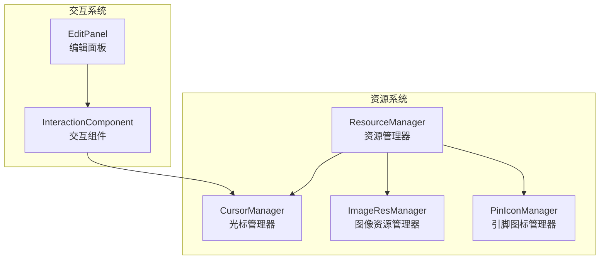
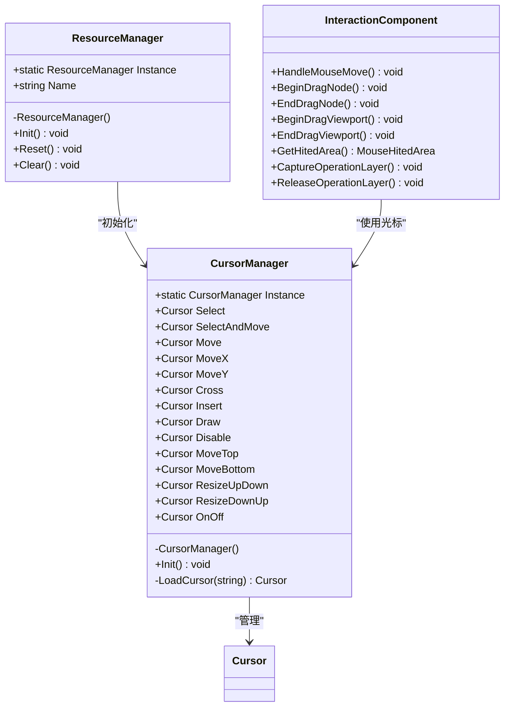
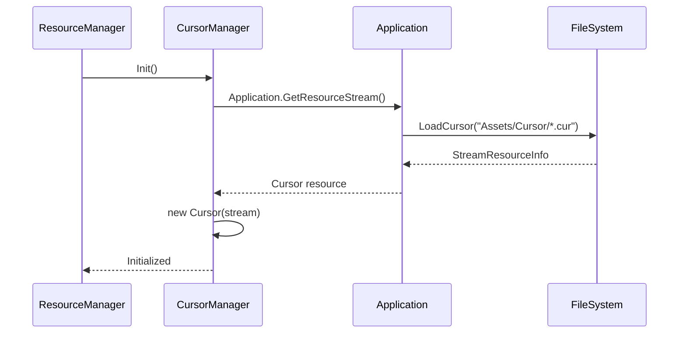
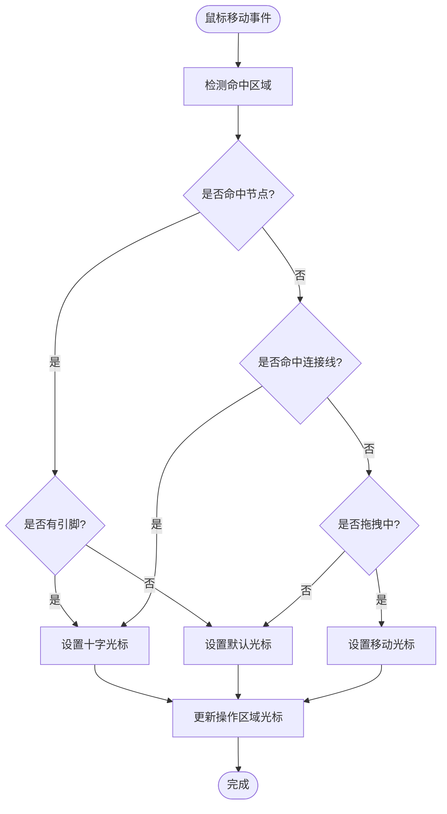
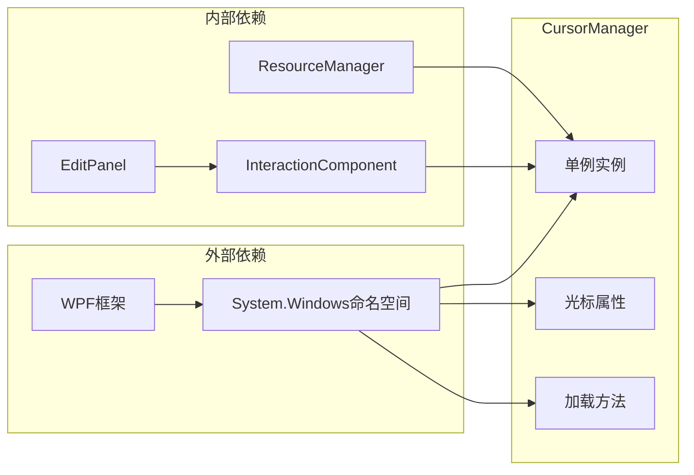

# 光标管理器

<cite>
**本文档引用的文件**
- [CursorManager.cs](file://XNode/SubSystem/ResourceSystem/CursorManager.cs)
- [InteractionComponent.cs](file://XNode/SubSystem/NodeEditSystem/Panel\Component\InteractionComponent.cs)
- [ResourceManager.cs](file://XNode/SubSystem\ResourceSystem\ResourceManager.cs)
- [EditPanel.xaml.cs](file://XNode\SubSystem\NodeEditSystem\Panel\EditPanel.xaml.cs)
- [EnumDefine.cs](file://XNode\SubSystem\NodeEditSystem\Define\EnumDefine.cs)
- [PinBase.cs](file://XLib.Node\PinBase.cs)
</cite>

## 目录
1. [简介](#简介)
2. [项目结构](#项目结构)
3. [核心组件](#核心组件)
4. [架构概览](#架构概览)
5. [详细组件分析](#详细组件分析)
6. [依赖关系分析](#依赖关系分析)
7. [性能考虑](#性能考虑)
8. [故障排除指南](#故障排除指南)
9. [结论](#结论)

## 简介

CursorManager是XNode项目中的核心光标管理系统，负责应用程序内自定义光标的动态加载与切换。该管理器采用单例模式设计，通过统一的资源管理机制为不同的操作模式提供相应的光标资源，实现了高效的光标缓存和快速访问。

## 项目结构

CursorManager位于XNode项目的资源子系统中，与其他资源管理器协同工作，为整个应用程序提供统一的资源管理服务。



**图表来源**
- [ResourceManager.cs](file://XNode/SubSystem/ResourceSystem/ResourceManager.cs#L1-L35)
- [CursorManager.cs](file://XNode/SubSystem/ResourceSystem/CursorManager.cs#L1-L97)

## 核心组件

CursorManager是一个单例类，提供了15种不同用途的自定义光标，每种光标都针对特定的操作场景进行了优化。

**章节来源**
- [CursorManager.cs](file://XNode/SubSystem/ResourceSystem/CursorManager.cs#L1-L97)

## 架构概览

CursorManager采用了简洁而高效的设计架构，通过静态实例管理和资源流加载实现了光标的快速初始化和访问。



**图表来源**
- [CursorManager.cs](file://XNode/SubSystem/ResourceSystem/CursorManager.cs#L8-L97)
- [ResourceManager.cs](file://XNode/SubSystem/ResourceSystem/ResourceManager.cs#L6-L35)
- [InteractionComponent.cs](file://XNode/SubSystem/NodeEditSystem/Panel\Component\InteractionComponent.cs#L18-L757)

## 详细组件分析

### CursorManager核心功能

CursorManager作为单例管理器，提供了完整的光标生命周期管理：

#### 单例模式实现
```csharp
private CursorManager() { }
public static CursorManager Instance { get; } = new CursorManager();
```

#### 光标属性定义
管理器定义了15种不同用途的光标属性，每种都有明确的功能定位：

- **基础操作光标**：Select、SelectAndMove、Move、Cross
- **方向控制光标**：MoveX、MoveY、ResizeUpDown、ResizeDownUp
- **特殊功能光标**：Insert、Draw、Disable、OnOff
- **布局调整光标**：MoveTop、MoveBottom

#### 资源初始化流程



**图表来源**
- [CursorManager.cs](file://XNode/SubSystem/ResourceSystem/CursorManager.cs#L60-L80)
- [ResourceManager.cs](file://XNode/SubSystem/ResourceSystem/ResourceManager.cs#L20-L25)

#### 光标加载机制

```csharp
private Cursor LoadCursor(string cursorPath)
{
    StreamResourceInfo resourceInfo = Application.GetResourceStream(new Uri(cursorPath, UriKind.Relative));
    return new Cursor(resourceInfo.Stream);
}
```

这种设计确保了：
1. **资源安全**：通过Application.GetResourceStream确保资源正确加载
2. **内存管理**：每个光标都是独立的Cursor对象，避免重复创建
3. **路径标准化**：使用相对路径确保跨平台兼容性

**章节来源**
- [CursorManager.cs](file://XNode/SubSystem/ResourceSystem/CursorManager.cs#L85-L90)

### InteractionComponent光标切换逻辑

InteractionComponent是光标使用的直接消费者，它根据不同的操作状态和鼠标位置动态切换光标：

#### 鼠标悬停检测
```csharp
public MouseHitedArea GetHitedArea()
{
    if (_hoveredNodeView != null)
        return _hoveredNodeView.HoveredPin == null ? MouseHitedArea.Node : MouseHitedArea.Pin;
    else if (GetComponent<DrawingComponent>().HoveredConnectLine != null) 
        return MouseHitedArea.ConnectLine;
    return MouseHitedArea.Space;
}
```

#### 操作模式下的光标切换



**图表来源**
- [InteractionComponent.cs](file://XNode/SubSystem\NodeEditSystem\Panel\Component\InteractionComponent.cs#L170-L200)

#### 特定操作的光标管理

1. **节点拖拽**：
```csharp
public void BeginDragNode()
{
    _host.OperateArea.Cursor = CursorManager.Instance.SelectAndMove;
    _mouseDown = Mouse.GetPosition(_host.OperateArea);
}

public void EndDragNode()
{
    _host.OperateArea.Cursor = _tool.Cursor;
}
```

2. **视口拖拽**：
```csharp
public void BeginDragViewport()
{
    _host.OperateArea.Cursor = CursorManager.Instance.Move;
    _mouseDown = Mouse.GetPosition(_host.OperateArea);
}
```

3. **连接线绘制**：
```csharp
// 在BeginDrawConnectLine中设置起始光标
// 在HandleMouseMove中根据悬停状态动态切换
```

**章节来源**
- [InteractionComponent.cs](file://XNode/SubSystem\NodeEditSystem\Panel\Component\InteractionComponent.cs#L280-L320)
- [InteractionComponent.cs](file://XNode/SubSystem\NodeEditSystem\Panel\Component\InteractionComponent.cs#L480-L520)

### 资源管理集成

ResourceManager作为统一入口，协调各个资源管理器的初始化：

```csharp
public void Init()
{
    // 光标管理器
    CursorManager.Instance.Init();
    // 引脚图标管理器
    PinIconManager.Instance.Init();
}
```

这种设计确保了：
- **模块化**：每个管理器专注于自己的职责
- **一致性**：所有资源按统一顺序初始化
- **可扩展性**：新增资源类型只需添加相应管理器

**章节来源**
- [ResourceManager.cs](file://XNode/SubSystem\ResourceSystem\ResourceManager.cs#L20-L25)

## 依赖关系分析

CursorManager的依赖关系体现了清晰的分层架构：



**图表来源**
- [CursorManager.cs](file://XNode/SubSystem\ResourceSystem\CursorManager.cs#L1-L5)
- [InteractionComponent.cs](file://XNode/SubSystem\NodeEditSystem\Panel\Component\InteractionComponent.cs#L1-L15)

**章节来源**
- [CursorManager.cs](file://XNode/SubSystem\ResourceSystem\CursorManager.cs#L1-L97)
- [ResourceManager.cs](file://XNode/SubSystem\ResourceSystem\ResourceManager.cs#L1-L35)

## 性能考虑

### 内存优化策略

1. **延迟加载**：光标仅在需要时才被加载到内存中
2. **对象复用**：每个光标只创建一次，后续访问直接使用缓存实例
3. **及时释放**：WPF框架自动管理Cursor对象的生命周期

### 访问性能优化

- **直接访问**：通过静态Instance属性实现O(1)时间复杂度的访问
- **属性封装**：使用自动属性提供高效的getter/setter访问
- **批量初始化**：在ResourceManager中统一初始化所有光标

### 跨线程安全性

由于CursorManager是单例且只读属性，天然具有线程安全性。但在实际使用中需要注意：

1. **Dispatcher要求**：在非UI线程中访问UI元素（包括光标）需要使用Dispatcher.Invoke
2. **备用方案**：如果跨线程访问失败，应降级使用系统默认光标

## 故障排除指南

### 常见问题及解决方案

1. **光标加载失败**
   - 检查Assets/Cursor目录是否存在
   - 验证.cur文件格式是否正确
   - 确认文件权限设置

2. **光标切换异常**
   - 检查InteractionComponent的状态机逻辑
   - 验证鼠标事件绑定是否正确
   - 确认光标属性赋值时机

3. **内存泄漏**
   - 确保没有手动创建额外的Cursor实例
   - 检查事件处理器是否正确注销
   - 使用内存分析工具验证

**章节来源**
- [CursorManager.cs](file://XNode/SubSystem\ResourceSystem\CursorManager.cs#L85-L90)

## 结论

CursorManager作为XNode项目的核心组件，成功实现了应用程序内自定义光标的动态加载与切换功能。通过单例模式、资源流加载和智能缓存机制，它为用户提供了流畅的视觉反馈体验。

### 主要优势

1. **高效性**：单例设计和缓存机制确保了快速访问
2. **可维护性**：清晰的职责分离和模块化设计
3. **可扩展性**：易于添加新的光标类型和操作模式
4. **稳定性**：完善的错误处理和资源管理

### 应用场景

- **节点编辑**：节点选择、拖拽、删除等基本操作
- **连接线绘制**：引脚连接、断开、预览等交互
- **视口导航**：平移、缩放、聚焦等视图操作
- **特殊功能**：插入、绘制、禁用等高级功能

通过本文档的详细分析，开发者可以深入理解CursorManager的工作原理，并在需要时进行定制化开发或问题排查。