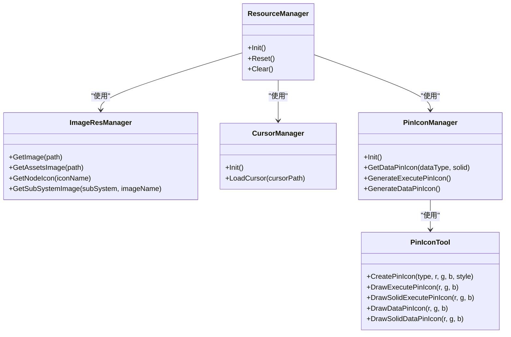
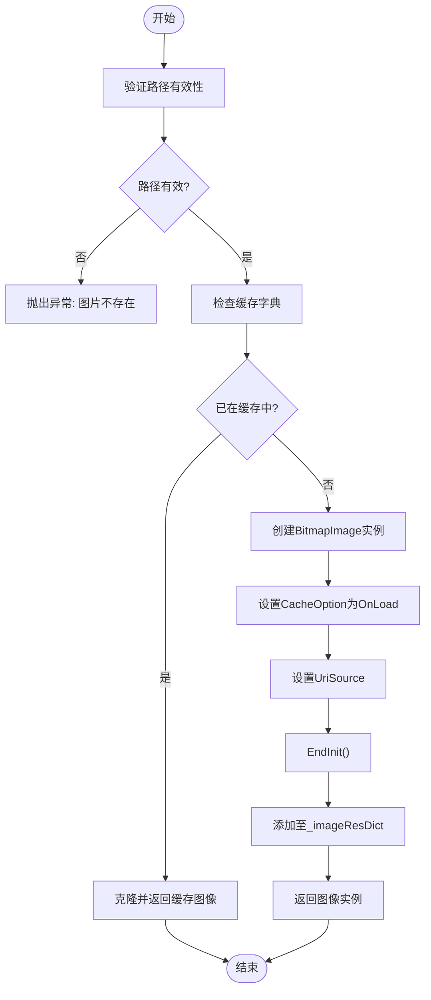
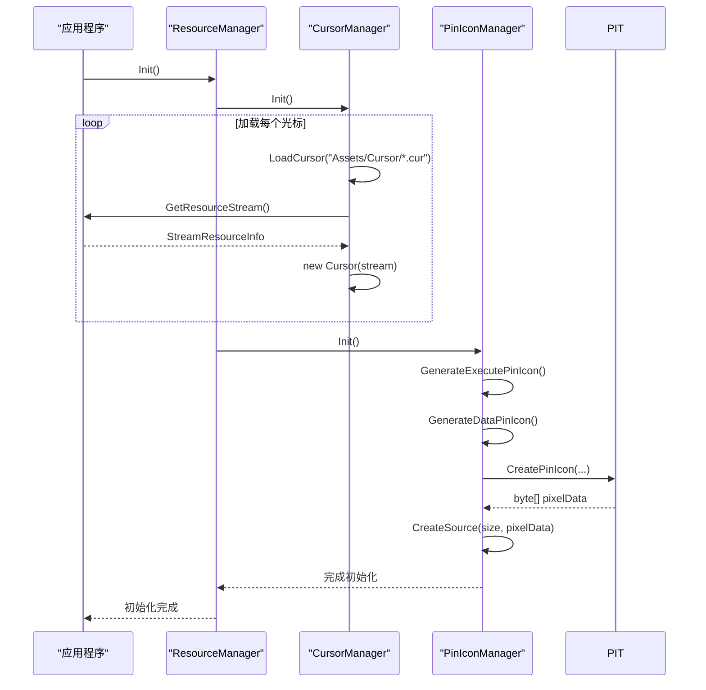

# 图像资源管理

<cite>
**本文档引用文件**  
- [ImageResManager.cs](file://XNode/SubSystem/ResourceSystem/ImageResManager.cs)
- [ResourceManager.cs](file://XNode/SubSystem/ResourceSystem/ResourceManager.cs)
- [CursorManager.cs](file://XNode/SubSystem/ResourceSystem/CursorManager.cs)
- [PinIconManager.cs](file://XNode/SubSystem/ResourceSystem/PinIconManager.cs)
- [PinIconTool.cs](file://XNode/SubSystem/ResourceSystem/PinIconTool.cs)
- [MainWindow.xaml.cs](file://XNode/MainWindow.xaml.cs)
- [NodeView.xaml.cs](file://XNode/SubSystem/NodeEditSystem/Control/NodeView.xaml.cs)
</cite>

## 目录
1. [引言](#引言)
2. [项目结构](#项目结构)
3. [核心组件](#核心组件)
4. [架构概述](#架构概述)
5. [详细组件分析](#详细组件分析)
6. [依赖分析](#依赖分析)
7. [性能考虑](#性能考虑)
8. [故障排除指南](#故障排除指南)
9. [结论](#结论)

## 引言
本文档详细说明了XNode项目中`ImageResManager`类如何实现图像资源的统一加载、缓存与复用机制。通过分析其内部字典结构、资源路径作为键值的快速查找策略、图像生命周期管理（包括弱引用缓存与显式释放）、预加载流程以及WPF图像冻结的最佳实践，全面揭示该系统的设计原理和使用方式。

## 项目结构
XNode项目的资源管理系统位于`XNode/SubSystem/ResourceSystem`目录下，主要由以下几个核心类构成：

```mermaid
graph TB
ResourceManager --> ImageResManager
ResourceManager --> CursorManager
ResourceManager --> PinIconManager
PinIconManager --> PinIconTool
ImageResManager -.-> "Dictionary<string, BitmapImage>"
```

**图示来源**  
- [ImageResManager.cs](file://XNode/SubSystem/ResourceSystem/ImageResManager.cs#L0-L97)
- [ResourceManager.cs](file://XNode/SubSystem/ResourceSystem/ResourceManager.cs#L0-L35)
- [PinIconManager.cs](file://XNode/SubSystem/ResourceSystem/PinIconManager.cs#L0-L109)

**本节来源**  
- [ImageResManager.cs](file://XNode/SubSystem/ResourceSystem/ImageResManager.cs#L0-L97)
- [ResourceManager.cs](file://XNode/SubSystem/ResourceSystem/ResourceManager.cs#L0-L35)

## 核心组件
`ImageResManager`是图像资源管理的核心类，采用单例模式确保全局唯一实例。它通过一个私有的`Dictionary<string, BitmapImage>`来缓存已加载的图像资源，以资源路径为键进行快速查找，避免重复加载导致内存浪费。

此外，`ResourceManager`作为资源系统的入口点，在应用程序启动时初始化所有子资源管理器（如光标、引脚图标等），实现了资源的集中管理和预加载。

**本节来源**  
- [ImageResManager.cs](file://XNode/SubSystem/ResourceSystem/ImageResManager.cs#L0-L97)
- [ResourceManager.cs](file://XNode/SubSystem/ResourceSystem/ResourceManager.cs#L0-L35)

## 架构概述
整个资源管理系统采用分层设计，`ResourceManager`负责协调各个子管理器的初始化，而每个子管理器专注于特定类型的资源处理。



**图示来源**  
- [ResourceManager.cs](file://XNode/SubSystem/ResourceSystem/ResourceManager.cs#L0-L35)
- [ImageResManager.cs](file://XNode/SubSystem/ResourceSystem/ImageResManager.cs#L0-L97)
- [CursorManager.cs](file://XNode/SubSystem/ResourceSystem/CursorManager.cs#L0-L96)
- [PinIconManager.cs](file://XNode/SubSystem/ResourceSystem/PinIconManager.cs#L0-L109)
- [PinIconTool.cs](file://XNode/SubSystem/ResourceSystem/PinIconTool.cs#L0-L181)

## 详细组件分析

### ImageResManager 分析
`ImageResManager`通过`GetImage(string path)`方法实现图像资源的统一加载与缓存机制。当请求图像时，首先检查是否已存在于`_imageResDict`字典中，若存在则返回克隆实例，否则创建新实例并加入缓存。

对于不同来源的图像（本地文件、pack:// URI、嵌入资源），均通过统一接口处理，并设置`CacheOption = BitmapCacheOption.OnLoad`确保加载后立即释放文件句柄，提升安全性与性能。

#### 图像加载与缓存流程


**图示来源**  
- [ImageResManager.cs](file://XNode/SubSystem/ResourceSystem/ImageResManager.cs#L15-L45)

**本节来源**  
- [ImageResManager.cs](file://XNode/SubSystem/ResourceSystem/ImageResManager.cs#L0-L97)

### ResourceManager 初始化流程
`ResourceManager`在应用启动时调用`Init()`方法，依次初始化`CursorManager`和`PinIconManager`，从而触发图像资源的预加载过程。

#### 预加载序列图


**图示来源**  
- [ResourceManager.cs](file://XNode/SubSystem/ResourceSystem/ResourceManager.cs#L20-L23)
- [CursorManager.cs](file://XNode/SubSystem/ResourceSystem/CursorManager.cs#L50-L75)
- [PinIconManager.cs](file://XNode/SubSystem/ResourceSystem/PinIconManager.cs#L20-L35)

**本节来源**  
- [ResourceManager.cs](file://XNode/SubSystem/ResourceSystem/ResourceManager.cs#L0-L35)
- [CursorManager.cs](file://XNode/SubSystem/ResourceSystem/CursorManager.cs#L0-L96)
- [PinIconManager.cs](file://XNode/SubSystem/ResourceSystem/PinIconManager.cs#L0-L109)

### 图像冻结与性能优化
虽然当前代码未显式调用`Freeze()`方法，但根据WPF最佳实践，所有静态图像应在加载后调用`Freeze()`以提升渲染性能。冻结后的图像变为不可变对象，可在多个线程间安全共享，减少渲染开销。

建议在`GetImage`方法中增加冻结逻辑：
```csharp
image.EndInit();
image.Freeze(); // 提升渲染性能
_imageResDict.Add(path, image);
```

**本节来源**  
- [ImageResManager.cs](file://XNode/SubSystem/ResourceSystem/ImageResManager.cs#L30-L40)

## 依赖分析
资源管理系统各组件之间存在明确的依赖关系，`ResourceManager`作为顶层协调者，依赖于具体的资源管理器实现。

```mermaid
graph TD
ResourceManager --> ImageResManager
ResourceManager --> CursorManager
ResourceManager --> PinIconManager
PinIconManager --> PinIconTool
ImageResManager -.-> "System.Windows.Media.Imaging.BitmapImage"
CursorManager -.-> "System.Windows.Input.Cursor"
PinIconManager -.-> "System.Windows.Media.Imaging.BitmapSource"
```

**图示来源**  
- [ResourceManager.cs](file://XNode/SubSystem/ResourceSystem/ResourceManager.cs#L0-L35)
- [ImageResManager.cs](file://XNode/SubSystem/ResourceSystem/ImageResManager.cs#L0-L97)
- [PinIconManager.cs](file://XNode/SubSystem/ResourceSystem/PinIconManager.cs#L0-L109)

**本节来源**  
- [ResourceManager.cs](file://XNode/SubSystem/ResourceSystem/ResourceManager.cs#L0-L35)
- [ImageResManager.cs](file://XNode/SubSystem/ResourceSystem/ImageResManager.cs#L0-L97)
- [PinIconManager.cs](file://XNode/SubSystem/ResourceSystem/PinIconManager.cs#L0-L109)

## 性能考虑
- **缓存机制**：通过字典缓存避免重复加载相同图像，显著降低内存占用和I/O开销。
- **图像冻结**：建议对所有静态图像调用`Freeze()`方法，提升WPF渲染性能。
- **异步加载**：对于大型图像或网络资源，建议实现异步加载接口，避免阻塞UI线程。
- **内存泄漏防范**：定期检查`_imageResDict`的大小，提供清理接口（如`Clear()`）以应对长时间运行场景。

## 故障排除指南
### 内存泄漏排查
- 检查`_imageResDict`是否持续增长而未释放。
- 确保不再使用的图像引用被及时清理。
- 使用内存分析工具（如Visual Studio Diagnostic Tools）检测BitmapImage对象数量。

### 常见问题
- **图像无法加载**：检查路径格式是否正确，特别是pack:// URI的语法。
- **光标不显示**：确认资源文件存在且构建操作为"Resource"。
- **图标颜色错误**：检查`PinColorSet`定义与`PinIconTool`生成逻辑是否匹配。

**本节来源**  
- [ImageResManager.cs](file://XNode/SubSystem/ResourceSystem/ImageResManager.cs#L0-L97)
- [PinIconManager.cs](file://XNode/SubSystem/ResourceSystem/PinIconManager.cs#L0-L109)

## 结论
`ImageResManager`通过基于路径的字典缓存机制，高效实现了图像资源的统一加载与复用。结合`ResourceManager`的初始化流程，系统能够在启动时预加载关键资源，提升用户体验。未来可进一步优化图像冻结策略，并引入异步加载机制以支持更复杂的使用场景。